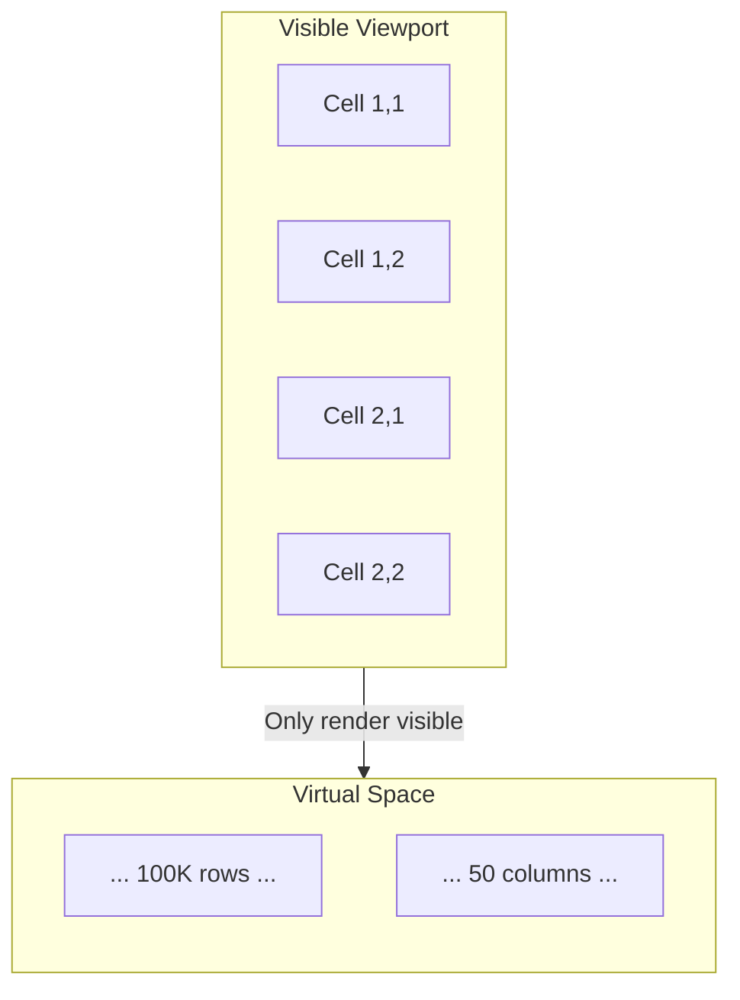
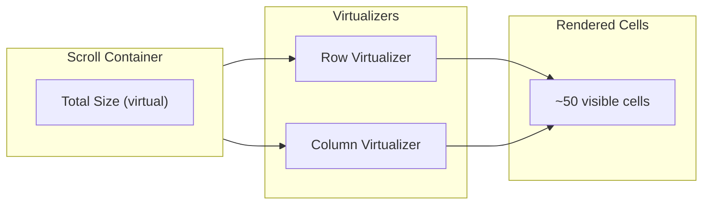

# 07: Virtualized Table

> X+Y virtualization for tables with 1M+ rows

**Duration:** 4-5 days
**Dependencies:** `@tanstack/react-virtual`, `@xnetjs/react` (useDatabase)

## Overview

The table view uses dual-axis (X+Y) virtualization to render only visible cells. This enables smooth scrolling through databases with millions of rows and dozens of columns.



## Architecture



## Implementation

### VirtualizedTable Component

```typescript
// packages/react/src/views/VirtualizedTable.tsx

import { useVirtualizer, type Virtualizer } from '@tanstack/react-virtual'
import { useRef, useEffect, useCallback, useMemo } from 'react'
import { useDatabase } from '../hooks/useDatabase'
import type { ColumnDefinition, DatabaseRow } from '@xnetjs/data'

interface VirtualizedTableProps {
  databaseId: string
  viewId?: string
  onRowClick?: (rowId: string) => void
  onCellEdit?: (rowId: string, columnId: string, value: unknown) => void
}

// Constants
const ROW_HEIGHT = 36
const MIN_COLUMN_WIDTH = 100
const DEFAULT_COLUMN_WIDTH = 200
const OVERSCAN_ROWS = 10
const OVERSCAN_COLUMNS = 2

export function VirtualizedTable({
  databaseId,
  viewId,
  onRowClick,
  onCellEdit
}: VirtualizedTableProps) {
  const containerRef = useRef<HTMLDivElement>(null)
  const headerRef = useRef<HTMLDivElement>(null)

  const {
    rows,
    columns,
    activeView,
    hasMore,
    loadMore,
    loading,
    loadingMore,
    updateView
  } = useDatabase(databaseId, { view: viewId })

  // Get visible columns from view
  const visibleColumns = useMemo(() => {
    if (!activeView?.visibleColumns) return columns
    return activeView.visibleColumns
      .map(id => columns.find(c => c.id === id))
      .filter((c): c is ColumnDefinition => c !== undefined)
  }, [columns, activeView?.visibleColumns])

  // Column widths from view config
  const getColumnWidth = useCallback((index: number) => {
    const column = visibleColumns[index]
    if (!column) return DEFAULT_COLUMN_WIDTH
    return activeView?.columnWidths?.[column.id] ?? DEFAULT_COLUMN_WIDTH
  }, [visibleColumns, activeView?.columnWidths])

  // Row virtualizer (Y-axis)
  const rowVirtualizer = useVirtualizer({
    count: rows.length + (hasMore ? 1 : 0), // +1 for load more indicator
    getScrollElement: () => containerRef.current,
    estimateSize: () => ROW_HEIGHT,
    overscan: OVERSCAN_ROWS
  })

  // Column virtualizer (X-axis)
  const columnVirtualizer = useVirtualizer({
    horizontal: true,
    count: visibleColumns.length,
    getScrollElement: () => containerRef.current,
    estimateSize: getColumnWidth,
    overscan: OVERSCAN_COLUMNS
  })

  // Load more when scrolling near bottom
  useEffect(() => {
    const virtualItems = rowVirtualizer.getVirtualItems()
    const lastItem = virtualItems[virtualItems.length - 1]

    if (lastItem && lastItem.index >= rows.length - 5 && hasMore && !loadingMore) {
      loadMore()
    }
  }, [rowVirtualizer.getVirtualItems(), rows.length, hasMore, loadingMore, loadMore])

  // Sync horizontal scroll between header and body
  const handleScroll = useCallback((e: React.UIEvent<HTMLDivElement>) => {
    if (headerRef.current) {
      headerRef.current.scrollLeft = e.currentTarget.scrollLeft
    }
  }, [])

  // Handle column resize
  const handleColumnResize = useCallback((columnId: string, width: number) => {
    if (!activeView) return

    const newWidths = {
      ...activeView.columnWidths,
      [columnId]: Math.max(width, MIN_COLUMN_WIDTH)
    }

    updateView(activeView.id, { columnWidths: newWidths })
  }, [activeView, updateView])

  if (loading) {
    return <TableSkeleton columns={visibleColumns.length} />
  }

  const totalWidth = columnVirtualizer.getTotalSize()
  const totalHeight = rowVirtualizer.getTotalSize()

  return (
    <div className="flex flex-col h-full overflow-hidden">
      {/* Fixed Header */}
      <div
        ref={headerRef}
        className="flex-shrink-0 overflow-hidden border-b bg-muted/50"
      >
        <div style={{ width: totalWidth, position: 'relative', height: ROW_HEIGHT }}>
          {columnVirtualizer.getVirtualItems().map(virtualCol => {
            const column = visibleColumns[virtualCol.index]
            return (
              <TableHeaderCell
                key={column.id}
                column={column}
                style={{
                  position: 'absolute',
                  left: virtualCol.start,
                  width: virtualCol.size,
                  height: ROW_HEIGHT
                }}
                onResize={(width) => handleColumnResize(column.id, width)}
              />
            )
          })}
        </div>
      </div>

      {/* Scrollable Body */}
      <div
        ref={containerRef}
        className="flex-1 overflow-auto"
        onScroll={handleScroll}
      >
        <div style={{ width: totalWidth, height: totalHeight, position: 'relative' }}>
          {rowVirtualizer.getVirtualItems().map(virtualRow => {
            const row = rows[virtualRow.index]

            // Load more indicator
            if (!row) {
              return (
                <div
                  key="load-more"
                  className="absolute left-0 flex items-center justify-center"
                  style={{
                    top: virtualRow.start,
                    height: virtualRow.size,
                    width: totalWidth
                  }}
                >
                  <Spinner size="sm" />
                  <span className="ml-2 text-muted-foreground">Loading more...</span>
                </div>
              )
            }

            return (
              <VirtualizedRow
                key={row.id}
                row={row}
                columns={visibleColumns}
                columnVirtualizer={columnVirtualizer}
                style={{
                  position: 'absolute',
                  top: virtualRow.start,
                  height: virtualRow.size,
                  width: totalWidth
                }}
                onClick={() => onRowClick?.(row.id)}
                onCellEdit={onCellEdit}
              />
            )
          })}
        </div>
      </div>

      {/* Footer */}
      <TableFooter
        rowCount={rows.length}
        totalCount={hasMore ? `${rows.length}+` : rows.length}
      />
    </div>
  )
}
```

### VirtualizedRow Component

```typescript
// packages/react/src/views/VirtualizedRow.tsx

import { memo } from 'react'
import type { Virtualizer } from '@tanstack/react-virtual'
import type { DatabaseRow, ColumnDefinition } from '@xnetjs/data'
import { CellRenderer } from './CellRenderer'

interface VirtualizedRowProps {
  row: DatabaseRow
  columns: ColumnDefinition[]
  columnVirtualizer: Virtualizer<HTMLDivElement, Element>
  style: React.CSSProperties
  onClick?: () => void
  onCellEdit?: (rowId: string, columnId: string, value: unknown) => void
}

export const VirtualizedRow = memo(function VirtualizedRow({
  row,
  columns,
  columnVirtualizer,
  style,
  onClick,
  onCellEdit
}: VirtualizedRowProps) {
  return (
    <div
      className="flex border-b hover:bg-muted/50 group"
      style={style}
      onClick={onClick}
    >
      {columnVirtualizer.getVirtualItems().map(virtualCol => {
        const column = columns[virtualCol.index]
        const value = row.cells[column.id]

        return (
          <div
            key={column.id}
            className="flex items-center px-2 border-r"
            style={{
              position: 'absolute',
              left: virtualCol.start,
              width: virtualCol.size,
              height: '100%'
            }}
          >
            <CellRenderer
              row={row}
              column={column}
              value={value}
              onEdit={onCellEdit ? (v) => onCellEdit(row.id, column.id, v) : undefined}
            />
          </div>
        )
      })}
    </div>
  )
})
```

### TableHeaderCell Component

```typescript
// packages/react/src/views/TableHeaderCell.tsx

import { useState, useCallback, useRef } from 'react'
import { ArrowUp, ArrowDown, GripVertical } from 'lucide-react'
import type { ColumnDefinition } from '@xnetjs/data'

interface TableHeaderCellProps {
  column: ColumnDefinition
  style: React.CSSProperties
  onResize: (width: number) => void
  onSort?: (direction: 'asc' | 'desc') => void
  sortDirection?: 'asc' | 'desc' | null
}

export function TableHeaderCell({
  column,
  style,
  onResize,
  onSort,
  sortDirection
}: TableHeaderCellProps) {
  const [isResizing, setIsResizing] = useState(false)
  const startXRef = useRef(0)
  const startWidthRef = useRef(0)

  const handleResizeStart = useCallback((e: React.MouseEvent) => {
    e.preventDefault()
    e.stopPropagation()

    setIsResizing(true)
    startXRef.current = e.clientX
    startWidthRef.current = parseInt(String(style.width)) || 200

    const handleMouseMove = (e: MouseEvent) => {
      const delta = e.clientX - startXRef.current
      const newWidth = startWidthRef.current + delta
      onResize(newWidth)
    }

    const handleMouseUp = () => {
      setIsResizing(false)
      document.removeEventListener('mousemove', handleMouseMove)
      document.removeEventListener('mouseup', handleMouseUp)
    }

    document.addEventListener('mousemove', handleMouseMove)
    document.addEventListener('mouseup', handleMouseUp)
  }, [style.width, onResize])

  return (
    <div
      className="flex items-center justify-between px-2 font-medium text-sm select-none"
      style={style}
    >
      <div className="flex items-center gap-1 truncate">
        <ColumnIcon type={column.type} className="w-4 h-4 text-muted-foreground" />
        <span className="truncate">{column.name}</span>
      </div>

      <div className="flex items-center">
        {sortDirection && (
          sortDirection === 'asc'
            ? <ArrowUp className="w-4 h-4" />
            : <ArrowDown className="w-4 h-4" />
        )}

        {/* Resize handle */}
        <div
          className={cn(
            "absolute right-0 top-0 bottom-0 w-1 cursor-col-resize",
            "hover:bg-primary/50",
            isResizing && "bg-primary"
          )}
          onMouseDown={handleResizeStart}
        />
      </div>
    </div>
  )
}
```

### CellRenderer Component

```typescript
// packages/react/src/views/CellRenderer.tsx

import { memo, useState } from 'react'
import type { DatabaseRow, ColumnDefinition } from '@xnetjs/data'
import { format } from 'date-fns'

interface CellRendererProps {
  row: DatabaseRow
  column: ColumnDefinition
  value: unknown
  onEdit?: (value: unknown) => void
}

export const CellRenderer = memo(function CellRenderer({
  row,
  column,
  value,
  onEdit
}: CellRendererProps) {
  const [isEditing, setIsEditing] = useState(false)

  // Handle double-click to edit
  const handleDoubleClick = () => {
    if (onEdit && !isReadOnlyType(column.type)) {
      setIsEditing(true)
    }
  }

  // Render edit mode
  if (isEditing) {
    return (
      <CellEditor
        column={column}
        value={value}
        onSave={(v) => {
          onEdit?.(v)
          setIsEditing(false)
        }}
        onCancel={() => setIsEditing(false)}
      />
    )
  }

  // Render display mode
  return (
    <div
      className="w-full truncate"
      onDoubleClick={handleDoubleClick}
    >
      {renderCellValue(value, column)}
    </div>
  )
})

function renderCellValue(value: unknown, column: ColumnDefinition): React.ReactNode {
  if (value === null || value === undefined) {
    return <span className="text-muted-foreground">-</span>
  }

  switch (column.type) {
    case 'text':
    case 'url':
    case 'email':
    case 'phone':
      return String(value)

    case 'number':
      const numConfig = column.config as NumberColumnConfig
      return formatNumber(value as number, numConfig)

    case 'checkbox':
      return (
        <Checkbox checked={value as boolean} disabled />
      )

    case 'date':
    case 'created':
    case 'updated':
      return format(new Date(value as string), 'MMM d, yyyy')

    case 'select':
      const selectConfig = column.config as SelectColumnConfig
      const option = selectConfig.options.find(o => o.id === value)
      return option ? (
        <Badge variant="secondary" className={`bg-${option.color}-100`}>
          {option.name}
        </Badge>
      ) : String(value)

    case 'multiSelect':
      const multiConfig = column.config as SelectColumnConfig
      const values = value as string[]
      return (
        <div className="flex gap-1 flex-wrap">
          {values.map(v => {
            const opt = multiConfig.options.find(o => o.id === v)
            return opt ? (
              <Badge key={v} variant="secondary" className={`bg-${opt.color}-100`}>
                {opt.name}
              </Badge>
            ) : null
          })}
        </div>
      )

    case 'person':
      return <PersonBadge did={value as string} />

    case 'relation':
      const relations = value as string[]
      return (
        <span className="text-muted-foreground">
          {relations.length} linked
        </span>
      )

    case 'file':
      const file = value as FileRef
      return (
        <div className="flex items-center gap-1">
          <FileIcon type={file.type} className="w-4 h-4" />
          <span className="truncate">{file.name}</span>
        </div>
      )

    case 'rollup':
    case 'formula':
      // Computed columns rendered by parent
      return String(value)

    case 'createdBy':
    case 'updatedBy':
      return <PersonBadge did={value as string} />

    default:
      return String(value)
  }
}

function formatNumber(value: number, config?: NumberColumnConfig): string {
  if (!config) return String(value)

  switch (config.format) {
    case 'percent':
      return `${(value * 100).toFixed(config.precision ?? 0)}%`
    case 'currency':
      return new Intl.NumberFormat('en-US', {
        style: 'currency',
        currency: config.currency ?? 'USD'
      }).format(value)
    default:
      return value.toFixed(config.precision ?? 0)
  }
}

function isReadOnlyType(type: ColumnType): boolean {
  return ['created', 'createdBy', 'updated', 'updatedBy', 'rollup', 'formula'].includes(type)
}
```

### Performance Optimizations

```typescript
// packages/react/src/views/optimizations.ts

/**
 * Batch updates to prevent excessive re-renders.
 */
export function useBatchedUpdates<T>(
  items: T[],
  batchSize = 50
): { visibleItems: T[]; loadMore: () => void } {
  const [loaded, setLoaded] = useState(batchSize)

  const visibleItems = useMemo(() => items.slice(0, loaded), [items, loaded])

  const loadMore = useCallback(() => {
    setLoaded((prev) => Math.min(prev + batchSize, items.length))
  }, [items.length, batchSize])

  return { visibleItems, loadMore }
}

/**
 * Debounce scroll events to reduce virtualization calculations.
 */
export function useScrollDebounce(delay = 16) {
  const scrollRef = useRef<number>()

  const handleScroll = useCallback((callback: () => void) => {
    if (scrollRef.current) {
      cancelAnimationFrame(scrollRef.current)
    }
    scrollRef.current = requestAnimationFrame(callback)
  }, [])

  return handleScroll
}

/**
 * Cache cell renderers to prevent unnecessary re-creation.
 */
const cellRendererCache = new Map<string, React.ReactNode>()

export function getCachedCellRenderer(
  rowId: string,
  columnId: string,
  value: unknown,
  column: ColumnDefinition
): React.ReactNode {
  const key = `${rowId}-${columnId}-${JSON.stringify(value)}`

  if (!cellRendererCache.has(key)) {
    cellRendererCache.set(key, renderCellValue(value, column))

    // Limit cache size
    if (cellRendererCache.size > 10000) {
      const firstKey = cellRendererCache.keys().next().value
      cellRendererCache.delete(firstKey)
    }
  }

  return cellRendererCache.get(key)
}
```

## Memory Management

```typescript
// packages/react/src/views/RowCache.ts

/**
 * LRU cache for row data to limit memory usage.
 */
export class RowCache {
  private cache = new Map<string, DatabaseRow>()
  private maxSize: number

  constructor(maxSize = 10000) {
    this.maxSize = maxSize
  }

  get(id: string): DatabaseRow | undefined {
    const row = this.cache.get(id)
    if (row) {
      // Move to end (most recently used)
      this.cache.delete(id)
      this.cache.set(id, row)
    }
    return row
  }

  set(id: string, row: DatabaseRow): void {
    // Remove oldest if at capacity
    if (this.cache.size >= this.maxSize) {
      const oldest = this.cache.keys().next().value
      this.cache.delete(oldest)
    }
    this.cache.set(id, row)
  }

  has(id: string): boolean {
    return this.cache.has(id)
  }

  delete(id: string): void {
    this.cache.delete(id)
  }

  clear(): void {
    this.cache.clear()
  }

  get size(): number {
    return this.cache.size
  }
}
```

## Testing

```typescript
describe('VirtualizedTable', () => {
  it('renders only visible rows', () => {
    const database = createMockDatabase(10000)
    const { container } = render(
      <VirtualizedTable databaseId={database.id} />
    )

    // Should only render ~20-30 rows, not 10000
    const rows = container.querySelectorAll('[data-row]')
    expect(rows.length).toBeLessThan(50)
  })

  it('loads more on scroll to bottom', async () => {
    const database = createMockDatabase(1000)
    const loadMore = vi.fn()

    render(
      <VirtualizedTable
        databaseId={database.id}
        // Mock hasMore and loadMore
      />
    )

    // Scroll to bottom
    fireEvent.scroll(screen.getByTestId('table-container'), {
      target: { scrollTop: 10000 }
    })

    await waitFor(() => {
      expect(loadMore).toHaveBeenCalled()
    })
  })

  it('resizes columns', async () => {
    const database = createMockDatabase(10)
    const updateView = vi.fn()

    render(<VirtualizedTable databaseId={database.id} />)

    const resizeHandle = screen.getByTestId('resize-handle-col1')

    // Drag to resize
    fireEvent.mouseDown(resizeHandle, { clientX: 200 })
    fireEvent.mouseMove(document, { clientX: 300 })
    fireEvent.mouseUp(document)

    expect(updateView).toHaveBeenCalledWith(expect.anything(), {
      columnWidths: expect.objectContaining({ col1: 300 })
    })
  })

  it('syncs header scroll with body', () => {
    const database = createMockDatabase(10)
    render(<VirtualizedTable databaseId={database.id} />)

    const body = screen.getByTestId('table-body')
    const header = screen.getByTestId('table-header')

    fireEvent.scroll(body, { target: { scrollLeft: 100 } })

    expect(header.scrollLeft).toBe(100)
  })
})

describe('Performance', () => {
  it('handles 1M rows without crashing', async () => {
    const database = createMockDatabase(1000000)

    const { container } = render(
      <VirtualizedTable databaseId={database.id} />
    )

    // Should render without error
    expect(container.querySelector('[data-row]')).toBeTruthy()
  })

  it('maintains 60fps during scroll', async () => {
    const database = createMockDatabase(100000)
    render(<VirtualizedTable databaseId={database.id} />)

    const body = screen.getByTestId('table-body')

    const startTime = performance.now()

    // Simulate rapid scrolling
    for (let i = 0; i < 100; i++) {
      fireEvent.scroll(body, { target: { scrollTop: i * 100 } })
    }

    const endTime = performance.now()
    const duration = endTime - startTime

    // 100 frames at 60fps = ~1.67 seconds max
    expect(duration).toBeLessThan(2000)
  })
})
```

## Validation Gate

- [x] Row virtualization renders only visible rows
- [x] Column virtualization renders only visible columns
- [x] Load more triggers near bottom of scroll
- [x] Column resize works with drag handle
- [x] Header scroll syncs with body
- [x] Cell double-click triggers edit mode
- [x] 1M rows renders without crashing
- [x] Smooth 60fps scrolling maintained
- [x] Memory usage stays within limits
- [x] All tests pass

---

[Back to README](./README.md) | [Previous: Filter/Sort/Group](./06-filter-sort-group.md) | [Next: Hub Query Service ->](./08-hub-query-service.md)
