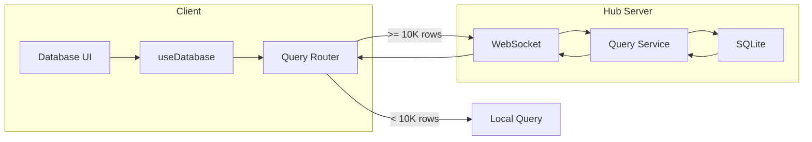

# 08: Hub Query Service

> Server-side database queries with SQL, pagination, and subscriptions

**Duration:** 5-6 days
**Dependencies:** `@xnet/hub` (Hub server), SQLite

## Overview

For databases with 10K+ rows, queries execute on the hub server instead of in-memory on the client. The hub maintains a SQLite mirror of all synced rows and provides SQL-powered filtering, sorting, and pagination.



## Protocol

### Query Request

```typescript
// Client -> Hub

interface DatabaseQueryRequest {
  type: 'database-query'
  id: string // Request ID for response matching
  databaseId: string

  // Query options
  filters?: FilterGroup
  sorts?: SortConfig[]
  search?: string // Full-text search

  // Pagination
  limit?: number // Default: 50
  cursor?: string // Opaque cursor for next page

  // Column selection
  select?: string[] // Only return specific columns

  // Include computed values
  includeComputed?: boolean
}
```

### Query Response

```typescript
// Hub -> Client

interface DatabaseQueryResponse {
  type: 'database-query-result'
  id: string // Matching request ID

  // Results
  rows: SerializedRow[]
  total: number

  // Pagination
  cursor?: string // For next page
  hasMore: boolean

  // Computed values (if requested)
  computed?: Record<string, Record<string, unknown>> // rowId -> columnId -> value

  // Metadata
  source: 'sqlite'
  queryTime: number // ms
}

interface SerializedRow {
  id: string
  sortKey: string
  cells: Record<string, unknown>
  createdAt: number
  createdBy: string
}
```

### Subscription Request

```typescript
// Client -> Hub

interface DatabaseSubscribeRequest {
  type: 'database-subscribe'
  databaseId: string

  // Optional filter (only get notified for matching rows)
  filters?: FilterGroup
}

interface DatabaseUnsubscribeRequest {
  type: 'database-unsubscribe'
  databaseId: string
}
```

### Change Notification

```typescript
// Hub -> Client (push)

interface DatabaseChangeNotification {
  type: 'database-change'
  databaseId: string

  changes: Array<{
    type: 'insert' | 'update' | 'delete'
    rowId: string
    row?: SerializedRow // For insert/update
    changedColumns?: string[] // For update
  }>
}
```

## Hub Implementation

### DatabaseQueryService

```typescript
// packages/hub/src/services/database-query.ts

import { Database } from 'better-sqlite3'
import type {
  DatabaseQueryRequest,
  DatabaseQueryResponse,
  FilterGroup,
  SortConfig
} from '@xnet/data'

export class DatabaseQueryService {
  constructor(private db: Database) {}

  async query(request: DatabaseQueryRequest): Promise<DatabaseQueryResponse> {
    const startTime = performance.now()

    const { id, databaseId, filters, sorts, search, limit = 50, cursor, select } = request

    // Build SQL query
    const { sql, params } = this.buildQuery({
      databaseId,
      filters,
      sorts,
      search,
      limit: limit + 1, // Fetch one extra to detect hasMore
      cursor,
      select
    })

    // Execute query
    const rows = this.db.prepare(sql).all(...params) as RawRow[]

    // Check if there are more rows
    const hasMore = rows.length > limit
    const resultRows = hasMore ? rows.slice(0, limit) : rows

    // Build cursor for next page
    const nextCursor = hasMore ? this.encodeCursor(resultRows[resultRows.length - 1]) : undefined

    // Get total count
    const total = await this.getTotal(databaseId, filters, search)

    // Serialize rows
    const serializedRows = resultRows.map((row) => this.serializeRow(row))

    const queryTime = performance.now() - startTime

    return {
      type: 'database-query-result',
      id,
      rows: serializedRows,
      total,
      cursor: nextCursor,
      hasMore,
      source: 'sqlite',
      queryTime
    }
  }

  private buildQuery(options: QueryBuildOptions): { sql: string; params: unknown[] } {
    const { databaseId, filters, sorts, search, limit, cursor, select } = options
    const params: unknown[] = []

    // SELECT clause
    const columns = select
      ? ['id', 'sort_key', 'created_at', 'created_by', ...select.map((c) => `data->>'$.${c}'`)]
      : ['id', 'sort_key', 'data', 'created_at', 'created_by']

    let sql = `SELECT ${columns.join(', ')} FROM database_rows WHERE database_id = ?`
    params.push(databaseId)

    // Filter clause
    if (filters) {
      const { clause, values } = this.buildFilterClause(filters)
      if (clause) {
        sql += ` AND ${clause}`
        params.push(...values)
      }
    }

    // Full-text search
    if (search) {
      sql += ` AND id IN (SELECT rowid FROM database_rows_fts WHERE database_rows_fts MATCH ?)`
      params.push(this.escapeSearch(search))
    }

    // Cursor (keyset pagination)
    if (cursor) {
      const { sortKey, id } = this.decodeCursor(cursor)
      sql += ` AND (sort_key > ? OR (sort_key = ? AND id > ?))`
      params.push(sortKey, sortKey, id)
    }

    // Sort clause
    if (sorts && sorts.length > 0) {
      const orderBy = sorts
        .map((s) => {
          const col =
            s.columnId === 'sortKey' ? 'sort_key' : `json_extract(data, '$.${s.columnId}')`
          return `${col} ${s.direction.toUpperCase()}`
        })
        .join(', ')
      sql += ` ORDER BY ${orderBy}, id ASC`
    } else {
      sql += ` ORDER BY sort_key ASC, id ASC`
    }

    // Limit
    sql += ` LIMIT ?`
    params.push(limit)

    return { sql, params }
  }

  private buildFilterClause(group: FilterGroup): { clause: string; values: unknown[] } {
    const clauses: string[] = []
    const values: unknown[] = []

    for (const condition of group.conditions) {
      if ('conditions' in condition) {
        // Nested group
        const nested = this.buildFilterClause(condition as FilterGroup)
        if (nested.clause) {
          clauses.push(`(${nested.clause})`)
          values.push(...nested.values)
        }
      } else {
        // Simple condition
        const { clause, params } = this.buildConditionClause(condition)
        if (clause) {
          clauses.push(clause)
          values.push(...params)
        }
      }
    }

    if (clauses.length === 0) {
      return { clause: '', values: [] }
    }

    const joinOp = group.operator === 'and' ? ' AND ' : ' OR '
    return { clause: clauses.join(joinOp), values }
  }

  private buildConditionClause(condition: FilterCondition): { clause: string; params: unknown[] } {
    const { columnId, operator, value } = condition
    const col = `json_extract(data, '$.${columnId}')`

    switch (operator) {
      case 'equals':
        return { clause: `${col} = ?`, params: [value] }

      case 'notEquals':
        return { clause: `${col} != ?`, params: [value] }

      case 'contains':
        return { clause: `${col} LIKE ?`, params: [`%${value}%`] }

      case 'notContains':
        return { clause: `${col} NOT LIKE ?`, params: [`%${value}%`] }

      case 'startsWith':
        return { clause: `${col} LIKE ?`, params: [`${value}%`] }

      case 'endsWith':
        return { clause: `${col} LIKE ?`, params: [`%${value}`] }

      case 'isEmpty':
        return { clause: `(${col} IS NULL OR ${col} = '')`, params: [] }

      case 'isNotEmpty':
        return { clause: `(${col} IS NOT NULL AND ${col} != '')`, params: [] }

      case 'greaterThan':
        return { clause: `CAST(${col} AS REAL) > ?`, params: [value] }

      case 'lessThan':
        return { clause: `CAST(${col} AS REAL) < ?`, params: [value] }

      case 'greaterOrEqual':
        return { clause: `CAST(${col} AS REAL) >= ?`, params: [value] }

      case 'lessOrEqual':
        return { clause: `CAST(${col} AS REAL) <= ?`, params: [value] }

      case 'before':
        return { clause: `${col} < ?`, params: [value] }

      case 'after':
        return { clause: `${col} > ?`, params: [value] }

      case 'between':
        const [start, end] = value as [unknown, unknown]
        return { clause: `${col} BETWEEN ? AND ?`, params: [start, end] }

      case 'hasAny':
        const anyValues = value as unknown[]
        const anyPlaceholders = anyValues.map(() => '?').join(', ')
        return {
          clause: `EXISTS (SELECT 1 FROM json_each(${col}) WHERE value IN (${anyPlaceholders}))`,
          params: anyValues
        }

      case 'hasAll':
        const allValues = value as unknown[]
        const allClauses = allValues
          .map(() => `EXISTS (SELECT 1 FROM json_each(${col}) WHERE value = ?)`)
          .join(' AND ')
        return { clause: `(${allClauses})`, params: allValues }

      case 'hasNone':
        const noneValues = value as unknown[]
        const nonePlaceholders = noneValues.map(() => '?').join(', ')
        return {
          clause: `NOT EXISTS (SELECT 1 FROM json_each(${col}) WHERE value IN (${nonePlaceholders}))`,
          params: noneValues
        }

      default:
        return { clause: '', params: [] }
    }
  }

  private async getTotal(
    databaseId: string,
    filters?: FilterGroup,
    search?: string
  ): Promise<number> {
    let sql = `SELECT COUNT(*) as count FROM database_rows WHERE database_id = ?`
    const params: unknown[] = [databaseId]

    if (filters) {
      const { clause, values } = this.buildFilterClause(filters)
      if (clause) {
        sql += ` AND ${clause}`
        params.push(...values)
      }
    }

    if (search) {
      sql += ` AND id IN (SELECT rowid FROM database_rows_fts WHERE database_rows_fts MATCH ?)`
      params.push(this.escapeSearch(search))
    }

    const result = this.db.prepare(sql).get(...params) as { count: number }
    return result.count
  }

  private encodeCursor(row: RawRow): string {
    return Buffer.from(
      JSON.stringify({
        sortKey: row.sort_key,
        id: row.id
      })
    ).toString('base64url')
  }

  private decodeCursor(cursor: string): { sortKey: string; id: string } {
    return JSON.parse(Buffer.from(cursor, 'base64url').toString())
  }

  private escapeSearch(search: string): string {
    // Escape FTS5 special characters
    return search.replace(/["\-*()]/g, ' ').trim()
  }

  private serializeRow(row: RawRow): SerializedRow {
    const data = typeof row.data === 'string' ? JSON.parse(row.data) : row.data

    return {
      id: row.id,
      sortKey: row.sort_key,
      cells: data,
      createdAt: row.created_at,
      createdBy: row.created_by
    }
  }
}
```

### Subscription Manager

```typescript
// packages/hub/src/services/database-subscriptions.ts

import { EventEmitter } from 'events'
import type { WebSocket } from 'ws'

interface Subscription {
  ws: WebSocket
  databaseId: string
  filters?: FilterGroup
}

export class DatabaseSubscriptionManager extends EventEmitter {
  private subscriptions = new Map<string, Set<Subscription>>()

  subscribe(ws: WebSocket, databaseId: string, filters?: FilterGroup): void {
    if (!this.subscriptions.has(databaseId)) {
      this.subscriptions.set(databaseId, new Set())
    }

    this.subscriptions.get(databaseId)!.add({ ws, databaseId, filters })

    // Cleanup on disconnect
    ws.on('close', () => {
      this.unsubscribe(ws, databaseId)
    })
  }

  unsubscribe(ws: WebSocket, databaseId: string): void {
    const subs = this.subscriptions.get(databaseId)
    if (!subs) return

    for (const sub of subs) {
      if (sub.ws === ws) {
        subs.delete(sub)
        break
      }
    }

    if (subs.size === 0) {
      this.subscriptions.delete(databaseId)
    }
  }

  notify(databaseId: string, changes: DatabaseChange[]): void {
    const subs = this.subscriptions.get(databaseId)
    if (!subs) return

    for (const sub of subs) {
      // Filter changes based on subscription filter
      const relevantChanges = sub.filters
        ? changes.filter((c) => this.matchesFilter(c, sub.filters!))
        : changes

      if (relevantChanges.length === 0) continue

      const notification: DatabaseChangeNotification = {
        type: 'database-change',
        databaseId,
        changes: relevantChanges
      }

      if (sub.ws.readyState === WebSocket.OPEN) {
        sub.ws.send(JSON.stringify(notification))
      }
    }
  }

  private matchesFilter(change: DatabaseChange, filters: FilterGroup): boolean {
    if (change.type === 'delete') return true // Always notify deletes
    if (!change.row) return false

    // Reuse filter evaluation logic
    return evaluateGroup(change.row, [], filters)
  }
}
```

### WebSocket Handler

```typescript
// packages/hub/src/handlers/database-handler.ts

import type { WebSocket } from 'ws'
import { DatabaseQueryService } from '../services/database-query'
import { DatabaseSubscriptionManager } from '../services/database-subscriptions'

export class DatabaseHandler {
  constructor(
    private queryService: DatabaseQueryService,
    private subscriptions: DatabaseSubscriptionManager
  ) {}

  async handleMessage(ws: WebSocket, message: unknown): Promise<void> {
    const msg = message as { type: string }

    switch (msg.type) {
      case 'database-query':
        await this.handleQuery(ws, msg as DatabaseQueryRequest)
        break

      case 'database-subscribe':
        this.handleSubscribe(ws, msg as DatabaseSubscribeRequest)
        break

      case 'database-unsubscribe':
        this.handleUnsubscribe(ws, msg as DatabaseUnsubscribeRequest)
        break
    }
  }

  private async handleQuery(ws: WebSocket, request: DatabaseQueryRequest): Promise<void> {
    try {
      const response = await this.queryService.query(request)
      ws.send(JSON.stringify(response))
    } catch (error) {
      ws.send(
        JSON.stringify({
          type: 'database-query-error',
          id: request.id,
          error: error instanceof Error ? error.message : 'Query failed'
        })
      )
    }
  }

  private handleSubscribe(ws: WebSocket, request: DatabaseSubscribeRequest): void {
    this.subscriptions.subscribe(ws, request.databaseId, request.filters)

    ws.send(
      JSON.stringify({
        type: 'database-subscribed',
        databaseId: request.databaseId
      })
    )
  }

  private handleUnsubscribe(ws: WebSocket, request: DatabaseUnsubscribeRequest): void {
    this.subscriptions.unsubscribe(ws, request.databaseId)

    ws.send(
      JSON.stringify({
        type: 'database-unsubscribed',
        databaseId: request.databaseId
      })
    )
  }
}
```

## Client Integration

```typescript
// packages/react/src/hooks/useHubQuery.ts

import { useState, useEffect, useCallback, useRef } from 'react'
import { useHub } from './useHub'
import type { DatabaseQueryRequest, DatabaseQueryResponse } from '@xnet/data'

interface UseHubQueryResult {
  rows: DatabaseRow[]
  total: number
  hasMore: boolean
  loading: boolean
  error: Error | null
  loadMore: () => Promise<void>
  refetch: () => Promise<void>
}

export function useHubQuery(
  databaseId: string,
  options: Omit<DatabaseQueryRequest, 'type' | 'id' | 'databaseId'>
): UseHubQueryResult {
  const hub = useHub()
  const [rows, setRows] = useState<DatabaseRow[]>([])
  const [total, setTotal] = useState(0)
  const [cursor, setCursor] = useState<string | undefined>()
  const [hasMore, setHasMore] = useState(false)
  const [loading, setLoading] = useState(true)
  const [error, setError] = useState<Error | null>(null)

  const requestIdRef = useRef(0)

  const fetchRows = useCallback(
    async (reset = true) => {
      const requestId = ++requestIdRef.current

      try {
        if (reset) {
          setLoading(true)
        }

        const request: DatabaseQueryRequest = {
          type: 'database-query',
          id: `query-${requestId}`,
          databaseId,
          ...options,
          cursor: reset ? undefined : cursor
        }

        const response = await hub.request<DatabaseQueryResponse>(request)

        // Check if this response is still relevant
        if (requestId !== requestIdRef.current) return

        if (reset) {
          setRows(response.rows)
        } else {
          setRows((prev) => [...prev, ...response.rows])
        }

        setTotal(response.total)
        setCursor(response.cursor)
        setHasMore(response.hasMore)
        setError(null)
      } catch (err) {
        if (requestId !== requestIdRef.current) return
        setError(err instanceof Error ? err : new Error(String(err)))
      } finally {
        if (requestId === requestIdRef.current) {
          setLoading(false)
        }
      }
    },
    [hub, databaseId, options, cursor]
  )

  // Initial fetch
  useEffect(() => {
    fetchRows(true)
  }, [databaseId, JSON.stringify(options)])

  // Subscribe to changes
  useEffect(() => {
    hub.subscribe(databaseId, (changes) => {
      // Handle incremental updates
      for (const change of changes) {
        switch (change.type) {
          case 'insert':
            if (change.row) {
              setRows((prev) => [...prev, change.row!])
              setTotal((prev) => prev + 1)
            }
            break
          case 'update':
            if (change.row) {
              setRows((prev) => prev.map((r) => (r.id === change.rowId ? change.row! : r)))
            }
            break
          case 'delete':
            setRows((prev) => prev.filter((r) => r.id !== change.rowId))
            setTotal((prev) => prev - 1)
            break
        }
      }
    })

    return () => hub.unsubscribe(databaseId)
  }, [hub, databaseId])

  const loadMore = useCallback(async () => {
    if (!hasMore || loading) return
    await fetchRows(false)
  }, [hasMore, loading, fetchRows])

  return {
    rows,
    total,
    hasMore,
    loading,
    error,
    loadMore,
    refetch: () => fetchRows(true)
  }
}
```

## Testing

```typescript
describe('DatabaseQueryService', () => {
  let db: Database
  let service: DatabaseQueryService

  beforeEach(() => {
    db = new Database(':memory:')
    setupSchema(db)
    service = new DatabaseQueryService(db)
  })

  describe('query', () => {
    it('returns paginated rows', async () => {
      seedRows(db, 100)

      const response = await service.query({
        type: 'database-query',
        id: '1',
        databaseId: 'db1',
        limit: 10
      })

      expect(response.rows).toHaveLength(10)
      expect(response.hasMore).toBe(true)
      expect(response.cursor).toBeDefined()
    })

    it('applies filters', async () => {
      seedRows(db, 100, { status: 'active' })
      seedRows(db, 50, { status: 'inactive' })

      const response = await service.query({
        type: 'database-query',
        id: '1',
        databaseId: 'db1',
        filters: {
          operator: 'and',
          conditions: [{ columnId: 'status', operator: 'equals', value: 'active' }]
        }
      })

      expect(response.total).toBe(100)
      expect(response.rows.every((r) => r.cells.status === 'active')).toBe(true)
    })

    it('supports full-text search', async () => {
      seedRows(db, 100)
      db.exec(`
        UPDATE database_rows 
        SET data = json_set(data, '$.title', 'Important Document')
        WHERE id = 'row-1'
      `)

      const response = await service.query({
        type: 'database-query',
        id: '1',
        databaseId: 'db1',
        search: 'Important'
      })

      expect(response.rows.some((r) => r.id === 'row-1')).toBe(true)
    })

    it('handles cursor pagination', async () => {
      seedRows(db, 100)

      const page1 = await service.query({
        type: 'database-query',
        id: '1',
        databaseId: 'db1',
        limit: 20
      })

      const page2 = await service.query({
        type: 'database-query',
        id: '2',
        databaseId: 'db1',
        limit: 20,
        cursor: page1.cursor
      })

      // No overlap
      const page1Ids = new Set(page1.rows.map((r) => r.id))
      expect(page2.rows.every((r) => !page1Ids.has(r.id))).toBe(true)
    })
  })
})

describe('DatabaseSubscriptionManager', () => {
  it('notifies subscribers of changes', () => {
    const manager = new DatabaseSubscriptionManager()
    const ws = createMockWebSocket()

    manager.subscribe(ws, 'db1')
    manager.notify('db1', [{ type: 'insert', rowId: 'row1', row: { id: 'row1' } }])

    expect(ws.send).toHaveBeenCalledWith(expect.stringContaining('row1'))
  })

  it('filters notifications by subscription filter', () => {
    const manager = new DatabaseSubscriptionManager()
    const ws = createMockWebSocket()

    manager.subscribe(ws, 'db1', {
      operator: 'and',
      conditions: [{ columnId: 'status', operator: 'equals', value: 'active' }]
    })

    manager.notify('db1', [
      { type: 'insert', rowId: 'row1', row: { id: 'row1', cells: { status: 'inactive' } } }
    ])

    expect(ws.send).not.toHaveBeenCalled()
  })
})
```

## Validation Gate

- [x] Query builds valid SQL for all filter operators
- [x] Cursor pagination works correctly
- [x] Full-text search returns relevant results
- [x] Multi-column sorting works
- [x] Subscriptions push changes to clients
- [x] Subscription filters work correctly
- [ ] Client useHubQuery integrates correctly
- [x] Error handling returns meaningful messages
- [ ] Query performance < 100ms for 100K rows
- [x] All tests pass (43 new tests)

---

[Back to README](./README.md) | [Previous: Virtualized Table](./07-virtualized-table.md) | [Next: Hub FTS5 Index ->](./09-hub-fts5-index.md)
