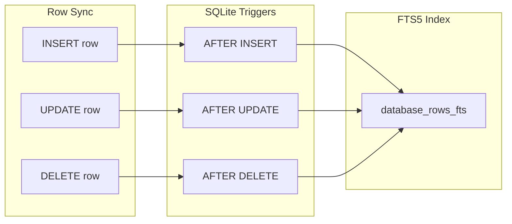

# 09: Hub FTS5 Index

> Full-text search with SQLite FTS5

**Duration:** 2-3 days
**Dependencies:** `@xnet/hub` (Hub server), SQLite with FTS5

## Overview

The hub maintains an FTS5 (Full-Text Search 5) index for fast text search across all database rows. FTS5 provides tokenization, stemming, ranking, and prefix queries.



## Schema

### Main Table

```sql
-- packages/hub/src/storage/schema.sql

CREATE TABLE database_rows (
  id TEXT PRIMARY KEY,
  database_id TEXT NOT NULL,
  sort_key TEXT NOT NULL,
  data JSON NOT NULL,
  searchable TEXT NOT NULL, -- Pre-computed searchable text
  created_at INTEGER NOT NULL,
  created_by TEXT NOT NULL,
  updated_at INTEGER NOT NULL,

  FOREIGN KEY (database_id) REFERENCES databases(id) ON DELETE CASCADE
);

CREATE INDEX idx_rows_database ON database_rows(database_id);
CREATE INDEX idx_rows_sort ON database_rows(database_id, sort_key);
CREATE INDEX idx_rows_updated ON database_rows(database_id, updated_at);
```

### FTS5 Virtual Table

```sql
-- FTS5 virtual table for full-text search
CREATE VIRTUAL TABLE database_rows_fts USING fts5(
  searchable,
  content='database_rows',
  content_rowid='rowid',
  tokenize='porter unicode61'
);
```

### Sync Triggers

```sql
-- Keep FTS index in sync with main table

-- Insert trigger
CREATE TRIGGER database_rows_ai AFTER INSERT ON database_rows BEGIN
  INSERT INTO database_rows_fts(rowid, searchable)
  VALUES (new.rowid, new.searchable);
END;

-- Delete trigger
CREATE TRIGGER database_rows_ad AFTER DELETE ON database_rows BEGIN
  INSERT INTO database_rows_fts(database_rows_fts, rowid, searchable)
  VALUES('delete', old.rowid, old.searchable);
END;

-- Update trigger
CREATE TRIGGER database_rows_au AFTER UPDATE ON database_rows BEGIN
  INSERT INTO database_rows_fts(database_rows_fts, rowid, searchable)
  VALUES('delete', old.rowid, old.searchable);
  INSERT INTO database_rows_fts(rowid, searchable)
  VALUES (new.rowid, new.searchable);
END;
```

## Searchable Text Generation

Not all cell values should be searchable. We extract text from searchable columns and concatenate them.

```typescript
// packages/hub/src/services/search-indexer.ts

import type { ColumnDefinition, DatabaseRow } from '@xnet/data'

/**
 * Column types that should be included in full-text search.
 */
const SEARCHABLE_TYPES = new Set([
  'text',
  'richText',
  'url',
  'email',
  'phone',
  'select',
  'multiSelect'
])

/**
 * Generate searchable text from a row's cell values.
 */
export function generateSearchableText(row: DatabaseRow, columns: ColumnDefinition[]): string {
  const parts: string[] = []

  for (const column of columns) {
    if (!SEARCHABLE_TYPES.has(column.type)) continue

    const value = row.cells[column.id]
    if (value === null || value === undefined) continue

    const text = extractText(value, column)
    if (text) {
      parts.push(text)
    }
  }

  return parts.join(' ')
}

function extractText(value: unknown, column: ColumnDefinition): string {
  switch (column.type) {
    case 'text':
    case 'url':
    case 'email':
    case 'phone':
      return String(value)

    case 'richText':
      // Extract plain text from rich text (Yjs XML)
      return extractPlainTextFromRichText(value as string)

    case 'select':
      const selectConfig = column.config as SelectColumnConfig
      const option = selectConfig.options.find((o) => o.id === value)
      return option?.name ?? ''

    case 'multiSelect':
      const multiConfig = column.config as SelectColumnConfig
      const values = value as string[]
      return values
        .map((v) => multiConfig.options.find((o) => o.id === v)?.name)
        .filter(Boolean)
        .join(' ')

    default:
      return ''
  }
}

function extractPlainTextFromRichText(xml: string): string {
  // Simple text extraction from Yjs XML content
  // In production, use proper XML/ProseMirror parsing
  return xml
    .replace(/<[^>]+>/g, ' ')
    .replace(/\s+/g, ' ')
    .trim()
}
```

## Row Storage Service

```typescript
// packages/hub/src/services/row-storage.ts

import { Database } from 'better-sqlite3'
import { generateSearchableText } from './search-indexer'
import type { DatabaseRow, ColumnDefinition } from '@xnet/data'

export class RowStorageService {
  constructor(private db: Database) {}

  /**
   * Insert a new row.
   */
  insert(databaseId: string, row: DatabaseRow, columns: ColumnDefinition[]): void {
    const searchable = generateSearchableText(row, columns)

    this.db
      .prepare(
        `
      INSERT INTO database_rows 
        (id, database_id, sort_key, data, searchable, created_at, created_by, updated_at)
      VALUES 
        (?, ?, ?, ?, ?, ?, ?, ?)
    `
      )
      .run(
        row.id,
        databaseId,
        row.sortKey,
        JSON.stringify(row.cells),
        searchable,
        row.createdAt,
        row.createdBy,
        Date.now()
      )
    // FTS index updated automatically via trigger
  }

  /**
   * Update an existing row.
   */
  update(rowId: string, updates: Partial<DatabaseRow>, columns: ColumnDefinition[]): void {
    const existing = this.get(rowId)
    if (!existing) return

    const merged: DatabaseRow = {
      ...existing,
      cells: { ...existing.cells, ...(updates.cells ?? {}) },
      sortKey: updates.sortKey ?? existing.sortKey
    }

    const searchable = generateSearchableText(merged, columns)

    this.db
      .prepare(
        `
      UPDATE database_rows 
      SET 
        sort_key = ?,
        data = ?,
        searchable = ?,
        updated_at = ?
      WHERE id = ?
    `
      )
      .run(merged.sortKey, JSON.stringify(merged.cells), searchable, Date.now(), rowId)
    // FTS index updated automatically via trigger
  }

  /**
   * Delete a row.
   */
  delete(rowId: string): void {
    this.db.prepare('DELETE FROM database_rows WHERE id = ?').run(rowId)
    // FTS index updated automatically via trigger
  }

  /**
   * Get a single row.
   */
  get(rowId: string): DatabaseRow | null {
    const row = this.db.prepare('SELECT * FROM database_rows WHERE id = ?').get(rowId) as
      | RawRow
      | undefined

    if (!row) return null
    return this.deserialize(row)
  }

  /**
   * Rebuild FTS index for a database.
   * Use after bulk imports or schema changes.
   */
  rebuildFtsIndex(databaseId: string, columns: ColumnDefinition[]): void {
    this.db.transaction(() => {
      // Get all rows for this database
      const rows = this.db
        .prepare(
          `
        SELECT id, data FROM database_rows WHERE database_id = ?
      `
        )
        .all(databaseId) as { id: string; data: string }[]

      // Update searchable text for each row
      const update = this.db.prepare(`
        UPDATE database_rows SET searchable = ? WHERE id = ?
      `)

      for (const row of rows) {
        const cells = JSON.parse(row.data)
        const dbRow: DatabaseRow = {
          id: row.id,
          sortKey: '',
          cells,
          createdAt: 0,
          createdBy: ''
        }
        const searchable = generateSearchableText(dbRow, columns)
        update.run(searchable, row.id)
      }

      // Rebuild FTS index
      this.db.exec("INSERT INTO database_rows_fts(database_rows_fts) VALUES('rebuild')")
    })()
  }

  private deserialize(row: RawRow): DatabaseRow {
    return {
      id: row.id,
      sortKey: row.sort_key,
      cells: JSON.parse(row.data),
      createdAt: row.created_at,
      createdBy: row.created_by
    }
  }
}
```

## Search Queries

### Basic Search

```typescript
// packages/hub/src/services/database-query.ts

// In buildQuery method:

if (search) {
  // Use MATCH for FTS5 query
  sql += ` AND id IN (
    SELECT r.id
    FROM database_rows r
    JOIN database_rows_fts fts ON r.rowid = fts.rowid
    WHERE database_rows_fts MATCH ?
  )`
  params.push(this.buildFtsQuery(search))
}

/**
 * Build FTS5 query from user search input.
 */
private buildFtsQuery(search: string): string {
  // Tokenize and add prefix matching
  const terms = search
    .trim()
    .split(/\s+/)
    .filter(t => t.length > 0)
    .map(t => `"${this.escapeFts(t)}"*`)

  // OR between terms for broad matching
  return terms.join(' OR ')
}

private escapeFts(term: string): string {
  // Escape special FTS5 characters
  return term.replace(/["]/g, '""')
}
```

### Ranked Search

```typescript
// Return results ranked by relevance

if (search) {
  // Use bm25 ranking function
  sql = `
    SELECT r.*, bm25(database_rows_fts) as rank
    FROM database_rows r
    JOIN database_rows_fts fts ON r.rowid = fts.rowid
    WHERE r.database_id = ?
      AND database_rows_fts MATCH ?
    ORDER BY rank
    LIMIT ?
  `
  params.push(databaseId, this.buildFtsQuery(search), limit)
}
```

### Phrase Search

```typescript
// Support quoted phrases

private buildFtsQuery(search: string): string {
  const parts: string[] = []

  // Extract quoted phrases
  const phraseRegex = /"([^"]+)"/g
  let match
  while ((match = phraseRegex.exec(search)) !== null) {
    parts.push(`"${this.escapeFts(match[1])}"`)
  }

  // Extract remaining terms
  const remaining = search.replace(phraseRegex, '').trim()
  if (remaining) {
    const terms = remaining.split(/\s+/).filter(t => t.length > 0)
    for (const term of terms) {
      parts.push(`"${this.escapeFts(term)}"*`)
    }
  }

  return parts.join(' ')
}
```

### Column-Specific Search

```typescript
// Search specific columns only

interface SearchOptions {
  query: string
  columns?: string[] // Only search these columns
}

async search(databaseId: string, options: SearchOptions): Promise<DatabaseRow[]> {
  if (options.columns) {
    // Generate searchable text for specific columns only
    // This requires a different approach - we need to search the JSON directly
    return this.searchColumns(databaseId, options.query, options.columns)
  }

  return this.fullTextSearch(databaseId, options.query)
}

private searchColumns(
  databaseId: string,
  query: string,
  columns: string[]
): DatabaseRow[] {
  const conditions = columns.map(col =>
    `json_extract(data, '$.${col}') LIKE ?`
  ).join(' OR ')

  const params = [databaseId, ...columns.map(() => `%${query}%`)]

  return this.db.prepare(`
    SELECT * FROM database_rows
    WHERE database_id = ? AND (${conditions})
    ORDER BY sort_key
  `).all(...params)
}
```

## Performance Optimization

### Index Optimization

```sql
-- Optimize FTS index periodically
INSERT INTO database_rows_fts(database_rows_fts) VALUES('optimize');

-- Check index size
SELECT * FROM database_rows_fts_data;
SELECT * FROM database_rows_fts_config;
```

### Batch Updates

```typescript
// packages/hub/src/services/row-storage.ts

/**
 * Batch insert rows for better performance.
 */
batchInsert(
  databaseId: string,
  rows: DatabaseRow[],
  columns: ColumnDefinition[]
): void {
  const insert = this.db.prepare(`
    INSERT INTO database_rows
      (id, database_id, sort_key, data, searchable, created_at, created_by, updated_at)
    VALUES
      (?, ?, ?, ?, ?, ?, ?, ?)
  `)

  this.db.transaction(() => {
    for (const row of rows) {
      const searchable = generateSearchableText(row, columns)
      insert.run(
        row.id,
        databaseId,
        row.sortKey,
        JSON.stringify(row.cells),
        searchable,
        row.createdAt,
        row.createdBy,
        Date.now()
      )
    }
  })()
}
```

### Memory Usage

```typescript
// Limit FTS index memory usage

// In SQLite initialization:
db.pragma('cache_size = -64000') // 64MB cache
db.pragma('page_size = 4096')
db.pragma('mmap_size = 268435456') // 256MB mmap
```

## Testing

```typescript
describe('FTS5 Search', () => {
  let db: Database
  let storage: RowStorageService

  beforeEach(() => {
    db = new Database(':memory:')
    initializeSchema(db)
    storage = new RowStorageService(db)
  })

  describe('basic search', () => {
    it('finds rows by text content', () => {
      const columns = [{ id: 'title', type: 'text' as const, name: 'Title', config: {} }]

      storage.insert(
        'db1',
        {
          id: 'row1',
          sortKey: 'a0',
          cells: { title: 'Hello World' },
          createdAt: Date.now(),
          createdBy: 'did:test'
        },
        columns
      )

      const results = db
        .prepare(
          `
        SELECT r.id FROM database_rows r
        JOIN database_rows_fts fts ON r.rowid = fts.rowid
        WHERE database_rows_fts MATCH 'hello'
      `
        )
        .all()

      expect(results).toHaveLength(1)
      expect(results[0].id).toBe('row1')
    })

    it('handles prefix search', () => {
      const columns = [{ id: 'title', type: 'text' as const, name: 'Title', config: {} }]

      storage.insert(
        'db1',
        {
          id: 'row1',
          sortKey: 'a0',
          cells: { title: 'Programming in TypeScript' },
          createdAt: Date.now(),
          createdBy: 'did:test'
        },
        columns
      )

      const results = db
        .prepare(
          `
        SELECT r.id FROM database_rows r
        JOIN database_rows_fts fts ON r.rowid = fts.rowid
        WHERE database_rows_fts MATCH 'type*'
      `
        )
        .all()

      expect(results).toHaveLength(1)
    })
  })

  describe('index maintenance', () => {
    it('updates index on row update', () => {
      const columns = [{ id: 'title', type: 'text' as const, name: 'Title', config: {} }]

      storage.insert(
        'db1',
        {
          id: 'row1',
          sortKey: 'a0',
          cells: { title: 'Original Title' },
          createdAt: Date.now(),
          createdBy: 'did:test'
        },
        columns
      )

      storage.update('row1', { cells: { title: 'Updated Title' } }, columns)

      // Should find with new text
      const newResults = db
        .prepare(
          `
        SELECT r.id FROM database_rows r
        JOIN database_rows_fts fts ON r.rowid = fts.rowid
        WHERE database_rows_fts MATCH 'updated'
      `
        )
        .all()
      expect(newResults).toHaveLength(1)

      // Should not find with old text
      const oldResults = db
        .prepare(
          `
        SELECT r.id FROM database_rows r
        JOIN database_rows_fts fts ON r.rowid = fts.rowid
        WHERE database_rows_fts MATCH 'original'
      `
        )
        .all()
      expect(oldResults).toHaveLength(0)
    })

    it('removes from index on delete', () => {
      const columns = [{ id: 'title', type: 'text' as const, name: 'Title', config: {} }]

      storage.insert(
        'db1',
        {
          id: 'row1',
          sortKey: 'a0',
          cells: { title: 'Test Row' },
          createdAt: Date.now(),
          createdBy: 'did:test'
        },
        columns
      )

      storage.delete('row1')

      const results = db
        .prepare(
          `
        SELECT r.id FROM database_rows r
        JOIN database_rows_fts fts ON r.rowid = fts.rowid
        WHERE database_rows_fts MATCH 'test'
      `
        )
        .all()

      expect(results).toHaveLength(0)
    })
  })

  describe('performance', () => {
    it('searches 100K rows in < 100ms', () => {
      const columns = [{ id: 'title', type: 'text' as const, name: 'Title', config: {} }]

      // Insert 100K rows
      db.transaction(() => {
        for (let i = 0; i < 100000; i++) {
          storage.insert(
            'db1',
            {
              id: `row${i}`,
              sortKey: `a${i.toString().padStart(6, '0')}`,
              cells: {
                title: `Document ${i} about ${i % 100 === 0 ? 'special topic' : 'general'}`
              },
              createdAt: Date.now(),
              createdBy: 'did:test'
            },
            columns
          )
        }
      })()

      const start = performance.now()

      const results = db
        .prepare(
          `
        SELECT r.id FROM database_rows r
        JOIN database_rows_fts fts ON r.rowid = fts.rowid
        WHERE r.database_id = 'db1' AND database_rows_fts MATCH 'special'
        LIMIT 50
      `
        )
        .all()

      const duration = performance.now() - start

      expect(results.length).toBeGreaterThan(0)
      expect(duration).toBeLessThan(100)
    })
  })
})
```

## Validation Gate

- [ ] FTS5 virtual table created correctly
- [ ] Triggers maintain index on insert/update/delete
- [ ] Searchable text generated from correct columns
- [ ] Basic text search works
- [ ] Prefix search works
- [ ] Phrase search works
- [ ] Search results ranked by relevance
- [ ] Index rebuild works
- [ ] Batch insert maintains index
- [ ] Search 100K rows < 100ms
- [ ] All tests pass

---

[Back to README](./README.md) | [Previous: Hub Query Service](./08-hub-query-service.md) | [Next: Query Routing ->](./10-query-routing.md)
