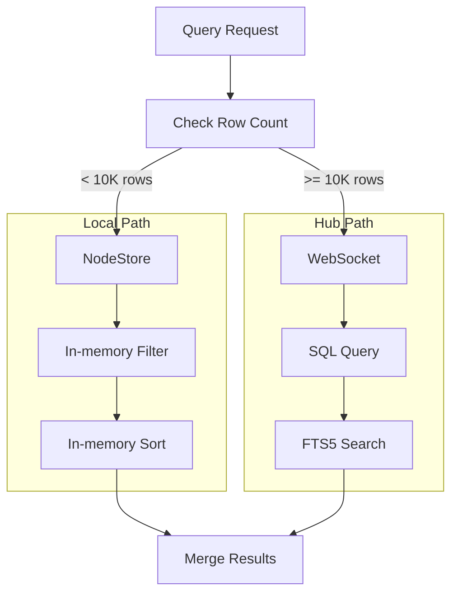
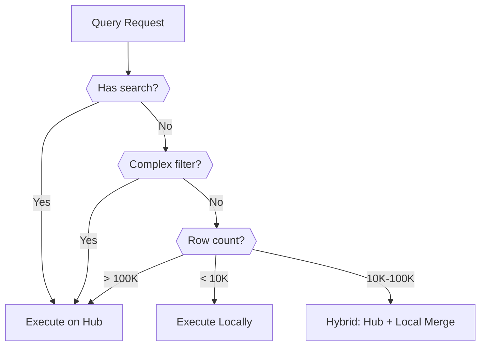

# 10: Query Routing

> Automatic routing between local and hub queries based on dataset size

**Duration:** 2-3 days
**Dependencies:** `@xnet/react` (hooks), `@xnet/hub` (query service)

## Overview

The query router automatically decides whether to execute queries locally (in-memory) or on the hub server based on dataset size and query complexity. This gives users the best of both worlds: instant local queries for small datasets and scalable hub queries for large ones.



## Routing Thresholds

```typescript
// packages/data/src/database/query-router.ts

export interface QueryRouterConfig {
  /** Max rows for local queries (default: 10,000) */
  localThreshold: number

  /** Max rows for hybrid queries (default: 100,000) */
  hybridThreshold: number

  /** Force hub for complex filters (default: true) */
  complexFilterToHub: boolean

  /** Force hub for full-text search (default: true) */
  searchToHub: boolean
}

export const DEFAULT_ROUTER_CONFIG: QueryRouterConfig = {
  localThreshold: 10_000,
  hybridThreshold: 100_000,
  complexFilterToHub: true,
  searchToHub: true
}
```

## Routing Decision



## Implementation

### Query Router

```typescript
// packages/data/src/database/query-router.ts

import type { FilterGroup, SortConfig, DatabaseRow, ColumnDefinition } from './types'

export type QuerySource = 'local' | 'hub' | 'hybrid'

export interface QueryRouterResult {
  source: QuerySource
  reason: string
}

export class QueryRouter {
  constructor(private config: QueryRouterConfig = DEFAULT_ROUTER_CONFIG) {}

  /**
   * Determine where to execute a query.
   */
  route(options: {
    rowCount: number
    filters?: FilterGroup
    search?: string
    hasHubConnection: boolean
  }): QueryRouterResult {
    const { rowCount, filters, search, hasHubConnection } = options

    // Full-text search always goes to hub (FTS5)
    if (search && this.config.searchToHub) {
      if (!hasHubConnection) {
        return { source: 'local', reason: 'search_no_hub_fallback' }
      }
      return { source: 'hub', reason: 'search_requires_fts5' }
    }

    // Complex filters go to hub for SQL efficiency
    if (filters && this.isComplexFilter(filters) && this.config.complexFilterToHub) {
      if (!hasHubConnection) {
        return { source: 'local', reason: 'complex_filter_no_hub_fallback' }
      }
      return { source: 'hub', reason: 'complex_filter' }
    }

    // Route by row count
    if (rowCount < this.config.localThreshold) {
      return { source: 'local', reason: 'small_dataset' }
    }

    if (!hasHubConnection) {
      return { source: 'local', reason: 'no_hub_connection' }
    }

    if (rowCount < this.config.hybridThreshold) {
      return { source: 'hybrid', reason: 'medium_dataset' }
    }

    return { source: 'hub', reason: 'large_dataset' }
  }

  /**
   * Check if a filter is complex enough to warrant hub execution.
   */
  private isComplexFilter(filter: FilterGroup): boolean {
    // Complex = nested groups or many conditions
    if (filter.conditions.length > 5) return true

    for (const condition of filter.conditions) {
      if ('conditions' in condition) {
        return true // Nested group
      }
    }

    return false
  }
}
```

### Unified Query Engine

```typescript
// packages/data/src/database/query-engine.ts

import { QueryRouter, type QuerySource } from './query-router'
import { filterRows, sortRows, groupRows } from './filter-engine'
import type {
  DatabaseRow,
  ColumnDefinition,
  FilterGroup,
  SortConfig,
  GroupConfig,
  RowGroup
} from './types'

export interface QueryOptions {
  filters?: FilterGroup
  sorts?: SortConfig[]
  groupBy?: GroupConfig
  search?: string
  limit?: number
  cursor?: string
}

export interface QueryResult {
  rows: DatabaseRow[]
  groups?: RowGroup[]
  total: number
  hasMore: boolean
  cursor?: string
  source: QuerySource
  queryTime: number
}

export class QueryEngine {
  private router: QueryRouter

  constructor(
    private localStore: LocalStore,
    private hubClient: HubClient | null,
    routerConfig?: QueryRouterConfig
  ) {
    this.router = new QueryRouter(routerConfig)
  }

  /**
   * Execute a query using the optimal source.
   */
  async query(
    databaseId: string,
    columns: ColumnDefinition[],
    options: QueryOptions
  ): Promise<QueryResult> {
    const startTime = performance.now()

    // Get row count for routing decision
    const rowCount = await this.getRowCount(databaseId)

    // Determine routing
    const routing = this.router.route({
      rowCount,
      filters: options.filters,
      search: options.search,
      hasHubConnection: this.hubClient?.isConnected ?? false
    })

    let result: QueryResult

    switch (routing.source) {
      case 'local':
        result = await this.executeLocal(databaseId, columns, options)
        break

      case 'hub':
        result = await this.executeHub(databaseId, options)
        break

      case 'hybrid':
        result = await this.executeHybrid(databaseId, columns, options)
        break
    }

    result.source = routing.source
    result.queryTime = performance.now() - startTime

    return result
  }

  /**
   * Execute query entirely in local store.
   */
  private async executeLocal(
    databaseId: string,
    columns: ColumnDefinition[],
    options: QueryOptions
  ): Promise<QueryResult> {
    const { filters, sorts, groupBy, limit = 50, cursor } = options

    // Load all rows from local store
    let rows = await this.localStore.queryRows(databaseId)
    const total = rows.length

    // Apply filter
    rows = filterRows(rows, columns, filters ?? null)
    const filtered = rows.length

    // Apply sort
    rows = sortRows(rows, columns, sorts ?? [])

    // Apply cursor pagination
    if (cursor) {
      const cursorIndex = rows.findIndex((r) => r.id === cursor)
      if (cursorIndex >= 0) {
        rows = rows.slice(cursorIndex + 1)
      }
    }

    // Apply limit
    const hasMore = rows.length > limit
    rows = rows.slice(0, limit)

    // Apply grouping
    const groups = groupBy ? groupRows(rows, columns, groupBy) : undefined

    return {
      rows,
      groups,
      total: filtered,
      hasMore,
      cursor: hasMore ? rows[rows.length - 1]?.id : undefined,
      source: 'local',
      queryTime: 0
    }
  }

  /**
   * Execute query on hub server.
   */
  private async executeHub(databaseId: string, options: QueryOptions): Promise<QueryResult> {
    if (!this.hubClient) {
      throw new Error('Hub client not available')
    }

    const response = await this.hubClient.query({
      type: 'database-query',
      id: nanoid(),
      databaseId,
      filters: options.filters,
      sorts: options.sorts,
      search: options.search,
      limit: options.limit,
      cursor: options.cursor
    })

    return {
      rows: response.rows,
      total: response.total,
      hasMore: response.hasMore,
      cursor: response.cursor,
      source: 'hub',
      queryTime: response.queryTime
    }
  }

  /**
   * Hybrid: fetch from hub, merge with local pending changes.
   */
  private async executeHybrid(
    databaseId: string,
    columns: ColumnDefinition[],
    options: QueryOptions
  ): Promise<QueryResult> {
    // Get hub results
    const hubResult = await this.executeHub(databaseId, options)

    // Get local pending changes (unsyced rows)
    const pendingRows = await this.localStore.getPendingRows(databaseId)

    if (pendingRows.length === 0) {
      return hubResult
    }

    // Merge: add pending inserts, apply pending updates, remove pending deletes
    let mergedRows = [...hubResult.rows]

    for (const pending of pendingRows) {
      switch (pending.type) {
        case 'insert':
          // Add to result if matches filter
          if (this.matchesFilter(pending.row, columns, options.filters)) {
            mergedRows.push(pending.row)
          }
          break

        case 'update':
          // Update existing row
          const idx = mergedRows.findIndex((r) => r.id === pending.rowId)
          if (idx >= 0) {
            mergedRows[idx] = { ...mergedRows[idx], ...pending.updates }
          }
          break

        case 'delete':
          // Remove from result
          mergedRows = mergedRows.filter((r) => r.id !== pending.rowId)
          break
      }
    }

    // Re-sort after merge
    mergedRows = sortRows(mergedRows, columns, options.sorts ?? [])

    // Re-apply limit
    const hasMore = mergedRows.length > (options.limit ?? 50)
    mergedRows = mergedRows.slice(0, options.limit ?? 50)

    return {
      rows: mergedRows,
      total: hubResult.total + pendingRows.filter((p) => p.type === 'insert').length,
      hasMore,
      cursor: hasMore ? mergedRows[mergedRows.length - 1]?.id : undefined,
      source: 'hybrid',
      queryTime: hubResult.queryTime
    }
  }

  private async getRowCount(databaseId: string): Promise<number> {
    // Try to get from cache or database metadata
    const db = await this.localStore.getDatabase(databaseId)
    return db?.properties.rowCount ?? 0
  }

  private matchesFilter(
    row: DatabaseRow,
    columns: ColumnDefinition[],
    filter?: FilterGroup
  ): boolean {
    if (!filter) return true
    return evaluateGroup(row, columns, filter)
  }
}
```

### React Integration

```typescript
// packages/react/src/hooks/useDatabase.ts (updated)

import { useMemo, useEffect, useState } from 'react'
import { QueryEngine, QueryRouter } from '@xnet/data'
import { useStore } from './useStore'
import { useHub } from './useHub'

export function useDatabase(
  databaseId: string,
  options: UseDatabaseOptions = {}
): UseDatabaseResult {
  const store = useStore()
  const hub = useHub()
  const { columns, views } = useDatabaseDoc(databaseId)

  // Create query engine with router
  const queryEngine = useMemo(() => new QueryEngine(store, hub), [store, hub])

  const [result, setResult] = useState<QueryResult | null>(null)
  const [loading, setLoading] = useState(true)
  const [error, setError] = useState<Error | null>(null)

  // Get effective query options from view
  const queryOptions = useMemo(
    () => ({
      filters: options.filters ?? activeView?.filters,
      sorts: options.sorts ?? activeView?.sorts,
      groupBy: activeView?.groupBy ? { columnId: activeView.groupBy } : undefined,
      search: options.search,
      limit: options.pageSize ?? 50
    }),
    [options, activeView]
  )

  // Execute query
  useEffect(() => {
    let cancelled = false

    const fetch = async () => {
      try {
        setLoading(true)
        const result = await queryEngine.query(databaseId, columns, queryOptions)

        if (!cancelled) {
          setResult(result)
          setError(null)
        }
      } catch (err) {
        if (!cancelled) {
          setError(err instanceof Error ? err : new Error(String(err)))
        }
      } finally {
        if (!cancelled) {
          setLoading(false)
        }
      }
    }

    fetch()

    return () => {
      cancelled = true
    }
  }, [queryEngine, databaseId, columns, queryOptions])

  return {
    rows: result?.rows ?? [],
    total: result?.total ?? 0,
    hasMore: result?.hasMore ?? false,
    source: result?.source ?? 'local',
    loading,
    error
    // ... rest of return value
  }
}
```

## LRU Row Cache

For hybrid queries, cache recently fetched rows to avoid re-fetching.

```typescript
// packages/data/src/database/row-cache.ts

export class RowCache {
  private cache = new Map<string, CachedRow>()
  private maxSize: number
  private maxAge: number

  constructor(options?: { maxSize?: number; maxAge?: number }) {
    this.maxSize = options?.maxSize ?? 10_000
    this.maxAge = options?.maxAge ?? 5 * 60 * 1000 // 5 minutes
  }

  get(id: string): DatabaseRow | undefined {
    const cached = this.cache.get(id)

    if (!cached) return undefined

    // Check if expired
    if (Date.now() - cached.fetchedAt > this.maxAge) {
      this.cache.delete(id)
      return undefined
    }

    // Move to end (LRU)
    this.cache.delete(id)
    this.cache.set(id, cached)

    return cached.row
  }

  set(id: string, row: DatabaseRow): void {
    // Evict oldest if at capacity
    if (this.cache.size >= this.maxSize) {
      const oldest = this.cache.keys().next().value
      this.cache.delete(oldest)
    }

    this.cache.set(id, {
      row,
      fetchedAt: Date.now()
    })
  }

  invalidate(id: string): void {
    this.cache.delete(id)
  }

  invalidateDatabase(databaseId: string): void {
    for (const [id, cached] of this.cache) {
      if (cached.row.databaseId === databaseId) {
        this.cache.delete(id)
      }
    }
  }

  clear(): void {
    this.cache.clear()
  }
}

interface CachedRow {
  row: DatabaseRow
  fetchedAt: number
}
```

## Testing

```typescript
describe('QueryRouter', () => {
  const router = new QueryRouter()

  describe('route', () => {
    it('routes small datasets to local', () => {
      const result = router.route({
        rowCount: 1000,
        hasHubConnection: true
      })

      expect(result.source).toBe('local')
      expect(result.reason).toBe('small_dataset')
    })

    it('routes large datasets to hub', () => {
      const result = router.route({
        rowCount: 500_000,
        hasHubConnection: true
      })

      expect(result.source).toBe('hub')
      expect(result.reason).toBe('large_dataset')
    })

    it('routes medium datasets to hybrid', () => {
      const result = router.route({
        rowCount: 50_000,
        hasHubConnection: true
      })

      expect(result.source).toBe('hybrid')
      expect(result.reason).toBe('medium_dataset')
    })

    it('routes search to hub', () => {
      const result = router.route({
        rowCount: 1000,
        search: 'test',
        hasHubConnection: true
      })

      expect(result.source).toBe('hub')
      expect(result.reason).toBe('search_requires_fts5')
    })

    it('falls back to local without hub connection', () => {
      const result = router.route({
        rowCount: 500_000,
        hasHubConnection: false
      })

      expect(result.source).toBe('local')
      expect(result.reason).toBe('no_hub_connection')
    })
  })
})

describe('QueryEngine', () => {
  describe('hybrid execution', () => {
    it('merges hub results with local pending changes', async () => {
      const store = createMockStore({
        pendingRows: [
          { type: 'insert', row: { id: 'new1', cells: { name: 'New Row' } } },
          { type: 'update', rowId: 'existing1', updates: { name: 'Updated' } }
        ]
      })

      const hub = createMockHub({
        rows: [
          { id: 'existing1', cells: { name: 'Original' } },
          { id: 'existing2', cells: { name: 'Other' } }
        ]
      })

      const engine = new QueryEngine(store, hub)
      const result = await engine.query('db1', [], {})

      expect(result.rows).toHaveLength(3)
      expect(result.rows.find((r) => r.id === 'new1')).toBeTruthy()
      expect(result.rows.find((r) => r.id === 'existing1')?.cells.name).toBe('Updated')
    })
  })
})
```

## Validation Gate

- [ ] Router routes small datasets (< 10K) to local
- [ ] Router routes large datasets (> 100K) to hub
- [ ] Router routes search queries to hub
- [ ] Router falls back to local without hub
- [ ] QueryEngine executes local queries correctly
- [ ] QueryEngine executes hub queries correctly
- [ ] Hybrid queries merge pending changes
- [ ] LRU cache limits memory usage
- [ ] Cache invalidates on changes
- [ ] useDatabase exposes query source
- [ ] All tests pass

---

[Back to README](./README.md) | [Previous: Hub FTS5 Index](./09-hub-fts5-index.md) | [Next: Rollup Columns ->](./11-rollup-columns.md)
