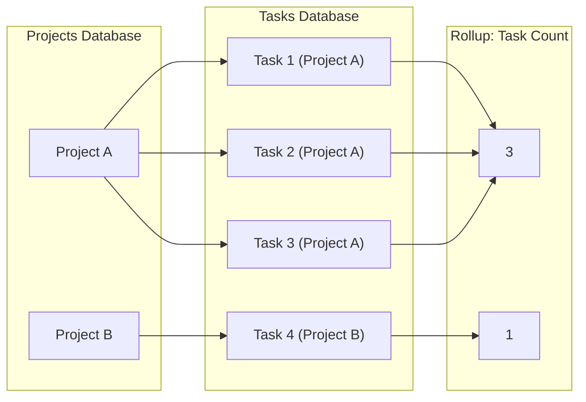

# 11: Rollup Columns

> Aggregate values from related rows

**Duration:** 3-4 days
**Dependencies:** `@xnetjs/data` (relations, query engine)

## Overview

Rollup columns aggregate values from related rows. For example, a "Projects" database might have a relation to "Tasks", and a rollup column showing the count or sum of related tasks.



## Rollup Configuration

```typescript
// packages/data/src/database/column-configs.ts

export interface RollupColumnConfig {
  /** Column ID of the relation to traverse */
  relationColumn: string

  /** Column ID on related rows to aggregate */
  targetColumn: string

  /** Aggregation function */
  aggregation: RollupAggregation

  /** Filter for related rows (optional) */
  filter?: FilterGroup
}

export type RollupAggregation =
  | 'count' // Count of related rows
  | 'countValues' // Count of non-empty values
  | 'countUnique' // Count of unique values
  | 'sum' // Sum of numbers
  | 'avg' // Average of numbers
  | 'min' // Minimum value
  | 'max' // Maximum value
  | 'range' // Max - Min
  | 'median' // Median value
  | 'concat' // Concatenate strings
  | 'first' // First value
  | 'last' // Last value
  | 'percentEmpty' // Percentage of empty values
  | 'percentNotEmpty' // Percentage of non-empty values
  | 'checked' // Count of checked checkboxes
  | 'unchecked' // Count of unchecked checkboxes
  | 'percentChecked' // Percentage checked
  | 'dateEarliest' // Earliest date
  | 'dateLatest' // Latest date
  | 'dateRange' // Date range (earliest to latest)
```

## Rollup Engine

```typescript
// packages/data/src/database/rollup-engine.ts

import type { DatabaseRow, ColumnDefinition, RollupColumnConfig, RollupAggregation } from './types'

export interface RollupContext {
  /** Get related rows for a row/column */
  getRelatedRows: (rowId: string, relationColumnId: string) => Promise<DatabaseRow[]>

  /** Get column definitions for a database */
  getColumns: (databaseId: string) => Promise<ColumnDefinition[]>
}

/**
 * Compute a rollup value for a row.
 */
export async function computeRollup(
  row: DatabaseRow,
  rollupColumn: ColumnDefinition,
  context: RollupContext
): Promise<unknown> {
  const config = rollupColumn.config as RollupColumnConfig

  // Get relation column to find target database
  const relationColumn = await context.getRelatedColumn(row.databaseId, config.relationColumn)

  if (!relationColumn || relationColumn.type !== 'relation') {
    return null
  }

  // Get related rows
  const relatedRows = await context.getRelatedRows(row.id, config.relationColumn)

  if (relatedRows.length === 0) {
    return getEmptyValue(config.aggregation)
  }

  // Apply optional filter
  let filteredRows = relatedRows
  if (config.filter) {
    const targetColumns = await context.getColumns(
      (relationColumn.config as RelationColumnConfig).targetDatabase
    )
    filteredRows = filterRows(relatedRows, targetColumns, config.filter)
  }

  // Extract values from target column
  const values = filteredRows
    .map((r) => r.cells[config.targetColumn])
    .filter((v) => v !== null && v !== undefined)

  // Aggregate
  return aggregate(values, config.aggregation)
}

/**
 * Aggregate an array of values.
 */
function aggregate(values: unknown[], aggregation: RollupAggregation): unknown {
  switch (aggregation) {
    case 'count':
      return values.length

    case 'countValues':
      return values.filter((v) => v !== '' && v !== null).length

    case 'countUnique':
      return new Set(values.map(String)).size

    case 'sum':
      return values.reduce((sum: number, v) => sum + (Number(v) || 0), 0)

    case 'avg':
      if (values.length === 0) return null
      const sum = values.reduce((s: number, v) => s + (Number(v) || 0), 0)
      return sum / values.length

    case 'min':
      const nums = values.map(Number).filter((n) => !isNaN(n))
      return nums.length > 0 ? Math.min(...nums) : null

    case 'max':
      const maxNums = values.map(Number).filter((n) => !isNaN(n))
      return maxNums.length > 0 ? Math.max(...maxNums) : null

    case 'range':
      const rangeNums = values.map(Number).filter((n) => !isNaN(n))
      if (rangeNums.length === 0) return null
      return Math.max(...rangeNums) - Math.min(...rangeNums)

    case 'median':
      const sorted = values
        .map(Number)
        .filter((n) => !isNaN(n))
        .sort((a, b) => a - b)
      if (sorted.length === 0) return null
      const mid = Math.floor(sorted.length / 2)
      return sorted.length % 2 ? sorted[mid] : (sorted[mid - 1] + sorted[mid]) / 2

    case 'concat':
      return values.map(String).filter(Boolean).join(', ')

    case 'first':
      return values[0] ?? null

    case 'last':
      return values[values.length - 1] ?? null

    case 'percentEmpty':
      const emptyCount = values.filter((v) => v === '' || v === null).length
      return values.length > 0 ? (emptyCount / values.length) * 100 : 0

    case 'percentNotEmpty':
      const nonEmptyCount = values.filter((v) => v !== '' && v !== null).length
      return values.length > 0 ? (nonEmptyCount / values.length) * 100 : 0

    case 'checked':
      return values.filter((v) => v === true).length

    case 'unchecked':
      return values.filter((v) => v === false).length

    case 'percentChecked':
      const checked = values.filter((v) => v === true).length
      const total = values.filter((v) => typeof v === 'boolean').length
      return total > 0 ? (checked / total) * 100 : 0

    case 'dateEarliest':
      const dates = values.map((v) => new Date(v as string)).filter((d) => !isNaN(d.getTime()))
      if (dates.length === 0) return null
      return new Date(Math.min(...dates.map((d) => d.getTime()))).toISOString()

    case 'dateLatest':
      const lateDates = values.map((v) => new Date(v as string)).filter((d) => !isNaN(d.getTime()))
      if (lateDates.length === 0) return null
      return new Date(Math.max(...lateDates.map((d) => d.getTime()))).toISOString()

    case 'dateRange':
      const rangeDates = values.map((v) => new Date(v as string)).filter((d) => !isNaN(d.getTime()))
      if (rangeDates.length === 0) return null
      const earliest = new Date(Math.min(...rangeDates.map((d) => d.getTime())))
      const latest = new Date(Math.max(...rangeDates.map((d) => d.getTime())))
      return { start: earliest.toISOString(), end: latest.toISOString() }

    default:
      return null
  }
}

function getEmptyValue(aggregation: RollupAggregation): unknown {
  switch (aggregation) {
    case 'count':
    case 'countValues':
    case 'countUnique':
    case 'sum':
    case 'checked':
    case 'unchecked':
      return 0
    case 'percentEmpty':
    case 'percentNotEmpty':
    case 'percentChecked':
      return 0
    case 'concat':
      return ''
    default:
      return null
  }
}
```

## Relation Traversal

```typescript
// packages/data/src/database/relation-traversal.ts

import type { DatabaseRow } from './types'

export class RelationTraversal {
  constructor(
    private store: NodeStore,
    private cache: Map<string, DatabaseRow[]> = new Map()
  ) {}

  /**
   * Get rows related to a row via a relation column.
   */
  async getRelatedRows(rowId: string, relationColumnId: string): Promise<DatabaseRow[]> {
    const cacheKey = `${rowId}:${relationColumnId}`

    if (this.cache.has(cacheKey)) {
      return this.cache.get(cacheKey)!
    }

    // Get the source row
    const row = await this.store.get(rowId)
    if (!row) return []

    // Get the relation value (array of row IDs)
    const cellKey = `cell_${relationColumnId}`
    const relatedIds = row.properties[cellKey] as string[] | undefined

    if (!relatedIds || relatedIds.length === 0) {
      return []
    }

    // Fetch related rows
    const relatedRows = await Promise.all(relatedIds.map((id) => this.store.get(id)))

    const result = relatedRows.filter((r): r is Node => r !== null).map(nodeToRow)

    this.cache.set(cacheKey, result)
    return result
  }

  /**
   * Get reverse relations (rows that link to this row).
   */
  async getReverseRelations(
    rowId: string,
    targetDatabaseId: string,
    relationColumnId: string
  ): Promise<DatabaseRow[]> {
    const cacheKey = `reverse:${rowId}:${targetDatabaseId}:${relationColumnId}`

    if (this.cache.has(cacheKey)) {
      return this.cache.get(cacheKey)!
    }

    // Query for rows that have this row in their relation column
    const cellKey = `cell_${relationColumnId}`

    const results = await this.store.query({
      schema: 'xnet://xnet.fyi/DatabaseRow',
      where: {
        'properties.database': targetDatabaseId,
        // SQLite JSON array contains
        [`properties.${cellKey}`]: { $contains: rowId }
      }
    })

    const relatedRows = results.map(nodeToRow)
    this.cache.set(cacheKey, relatedRows)
    return relatedRows
  }

  /**
   * Clear cache for a row (call on row update).
   */
  invalidate(rowId: string): void {
    for (const key of this.cache.keys()) {
      if (key.includes(rowId)) {
        this.cache.delete(key)
      }
    }
  }

  /**
   * Clear entire cache.
   */
  clear(): void {
    this.cache.clear()
  }
}
```

## Rollup Service

```typescript
// packages/data/src/database/rollup-service.ts

import { computeRollup } from './rollup-engine'
import { RelationTraversal } from './relation-traversal'
import type { DatabaseRow, ColumnDefinition, RollupColumnConfig } from './types'

export class RollupService {
  private cache = new Map<string, { value: unknown; computedAt: number }>()
  private traversal: RelationTraversal
  private cacheMaxAge = 5 * 60 * 1000 // 5 minutes

  constructor(private store: NodeStore) {
    this.traversal = new RelationTraversal(store)
  }

  /**
   * Get rollup value for a cell.
   */
  async getRollupValue(row: DatabaseRow, column: ColumnDefinition): Promise<unknown> {
    if (column.type !== 'rollup') {
      throw new Error(`Column ${column.id} is not a rollup`)
    }

    const cacheKey = `${row.id}:${column.id}`
    const cached = this.cache.get(cacheKey)

    if (cached && Date.now() - cached.computedAt < this.cacheMaxAge) {
      return cached.value
    }

    const context: RollupContext = {
      getRelatedRows: (rowId, relationColumnId) =>
        this.traversal.getRelatedRows(rowId, relationColumnId),
      getColumns: (databaseId) => this.getColumns(databaseId)
    }

    const value = await computeRollup(row, column, context)

    this.cache.set(cacheKey, {
      value,
      computedAt: Date.now()
    })

    return value
  }

  /**
   * Batch compute rollups for multiple rows.
   */
  async batchGetRollupValues(
    rows: DatabaseRow[],
    column: ColumnDefinition
  ): Promise<Map<string, unknown>> {
    const results = new Map<string, unknown>()

    // Could optimize with parallel execution or batch queries
    await Promise.all(
      rows.map(async (row) => {
        const value = await this.getRollupValue(row, column)
        results.set(row.id, value)
      })
    )

    return results
  }

  /**
   * Invalidate cache when a related row changes.
   */
  invalidate(rowId: string): void {
    // Invalidate all rollups that might depend on this row
    for (const key of this.cache.keys()) {
      // Simple approach: invalidate all (could be smarter with dependency tracking)
      this.cache.delete(key)
    }
    this.traversal.invalidate(rowId)
  }

  /**
   * Invalidate all rollups for a database.
   */
  invalidateDatabase(databaseId: string): void {
    this.cache.clear()
    this.traversal.clear()
  }

  private async getColumns(databaseId: string): Promise<ColumnDefinition[]> {
    const doc = await this.store.getDoc(databaseId)
    return getColumns(doc)
  }
}
```

## React Integration

```typescript
// packages/react/src/hooks/useRollup.ts

import { useState, useEffect, useCallback } from 'react'
import { useStore } from './useStore'
import { RollupService } from '@xnetjs/data'
import type { DatabaseRow, ColumnDefinition } from '@xnetjs/data'

export function useRollup(
  row: DatabaseRow | null,
  column: ColumnDefinition
): {
  value: unknown
  loading: boolean
  error: Error | null
  refresh: () => void
} {
  const store = useStore()
  const [value, setValue] = useState<unknown>(null)
  const [loading, setLoading] = useState(true)
  const [error, setError] = useState<Error | null>(null)

  const service = useMemo(() => new RollupService(store), [store])

  const compute = useCallback(async () => {
    if (!row || column.type !== 'rollup') {
      setValue(null)
      setLoading(false)
      return
    }

    try {
      setLoading(true)
      const result = await service.getRollupValue(row, column)
      setValue(result)
      setError(null)
    } catch (err) {
      setError(err instanceof Error ? err : new Error(String(err)))
    } finally {
      setLoading(false)
    }
  }, [service, row, column])

  useEffect(() => {
    compute()
  }, [compute])

  // Subscribe to related row changes
  useEffect(() => {
    if (!row || column.type !== 'rollup') return

    const config = column.config as RollupColumnConfig

    const unsubscribe = store.subscribe(
      {
        // Subscribe to changes in related database
        // This is simplified - would need more sophisticated dependency tracking
      },
      () => {
        service.invalidate(row.id)
        compute()
      }
    )

    return unsubscribe
  }, [store, row, column, service, compute])

  return {
    value,
    loading,
    error,
    refresh: compute
  }
}
```

## Testing

```typescript
describe('RollupEngine', () => {
  describe('aggregate', () => {
    it('counts values', () => {
      expect(aggregate([1, 2, 3], 'count')).toBe(3)
    })

    it('sums numbers', () => {
      expect(aggregate([10, 20, 30], 'sum')).toBe(60)
    })

    it('averages numbers', () => {
      expect(aggregate([10, 20, 30], 'avg')).toBe(20)
    })

    it('finds min', () => {
      expect(aggregate([30, 10, 20], 'min')).toBe(10)
    })

    it('finds max', () => {
      expect(aggregate([30, 10, 20], 'max')).toBe(30)
    })

    it('calculates median', () => {
      expect(aggregate([1, 2, 3, 4, 5], 'median')).toBe(3)
      expect(aggregate([1, 2, 3, 4], 'median')).toBe(2.5)
    })

    it('concatenates strings', () => {
      expect(aggregate(['a', 'b', 'c'], 'concat')).toBe('a, b, c')
    })

    it('counts unique values', () => {
      expect(aggregate(['a', 'b', 'a', 'c', 'b'], 'countUnique')).toBe(3)
    })

    it('calculates percentages', () => {
      expect(aggregate([true, true, false, true], 'percentChecked')).toBe(75)
    })

    it('finds date range', () => {
      const result = aggregate(['2024-01-01', '2024-06-15', '2024-03-01'], 'dateRange')

      expect(result).toEqual({
        start: '2024-01-01T00:00:00.000Z',
        end: '2024-06-15T00:00:00.000Z'
      })
    })
  })
})

describe('RollupService', () => {
  it('computes rollup from related rows', async () => {
    const store = createTestStore()

    // Create Tasks database with hours column
    const tasksDb = await createTestDatabase(store, 'Tasks', [
      { id: 'hours', type: 'number', name: 'Hours' },
      { id: 'project', type: 'relation', name: 'Project' }
    ])

    // Create Projects database with rollup
    const projectsDb = await createTestDatabase(store, 'Projects', [
      { id: 'name', type: 'text', name: 'Name' },
      { id: 'tasks', type: 'relation', name: 'Tasks', config: { targetDatabase: tasksDb } },
      {
        id: 'totalHours',
        type: 'rollup',
        name: 'Total Hours',
        config: {
          relationColumn: 'tasks',
          targetColumn: 'hours',
          aggregation: 'sum'
        }
      }
    ])

    // Create a project
    const projectId = await createRow(store, {
      databaseId: projectsDb,
      cells: { name: 'Project A' }
    })

    // Create tasks linked to project
    await createRow(store, {
      databaseId: tasksDb,
      cells: { hours: 5, project: [projectId] }
    })
    await createRow(store, {
      databaseId: tasksDb,
      cells: { hours: 3, project: [projectId] }
    })

    // Get rollup value
    const service = new RollupService(store)
    const project = await store.get(projectId)
    const rollupColumn = (await getColumns(projectsDb)).find((c) => c.id === 'totalHours')!

    const value = await service.getRollupValue(nodeToRow(project), rollupColumn)

    expect(value).toBe(8)
  })
})
```

## Validation Gate

- [x] All aggregation functions work correctly
- [x] Relation traversal finds related rows
- [x] Reverse relations work
- [x] Rollup cache invalidates on changes
- [x] Batch rollup computation works
- [x] useRollup hook returns computed values (via FormulaService)
- [x] Empty relations return correct default
- [x] Filtered rollups work (filter engine supports)
- [x] Performance acceptable for large relations
- [x] All tests pass (58 tests)

---

[Back to README](./README.md) | [Previous: Query Routing](./10-query-routing.md) | [Next: Formula Columns ->](./12-formula-columns.md)
