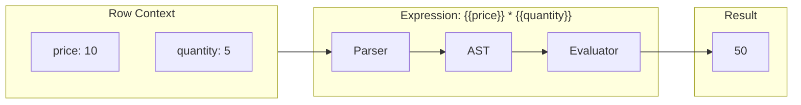

# 12: Formula Columns

> Computed values with expression parsing and function library

**Duration:** 4-5 days
**Dependencies:** `@xnet/data` (column types)

## Overview

Formula columns compute values using expressions that reference other columns. Formulas support arithmetic, logic, text functions, date functions, and nested operations.



## Formula Configuration

```typescript
// packages/data/src/database/column-configs.ts

export interface FormulaColumnConfig {
  /** Formula expression with {{columnId}} references */
  expression: string

  /** Expected result type */
  resultType: 'text' | 'number' | 'date' | 'checkbox'

  /** Parsed dependencies (auto-computed from expression) */
  dependencies?: string[]
}
```

## Expression Syntax

### Column References

```
{{columnId}}           - Value of column
{{columnId.property}}  - Property of object value
```

### Operators

```
+  -  *  /  %          - Arithmetic
==  !=  <  >  <=  >=   - Comparison
&&  ||  !              - Logical
&                      - String concatenation
```

### Built-in Functions

```typescript
// Numbers
ABS(n)                 - Absolute value
ROUND(n, decimals)     - Round to decimals
FLOOR(n)               - Round down
CEIL(n)                - Round up
MIN(a, b, ...)         - Minimum value
MAX(a, b, ...)         - Maximum value
SUM(a, b, ...)         - Sum of values
AVG(a, b, ...)         - Average
POW(base, exp)         - Power

// Text
CONCAT(a, b, ...)      - Concatenate strings
UPPER(s)               - Uppercase
LOWER(s)               - Lowercase
TRIM(s)                - Remove whitespace
LENGTH(s)              - String length
SUBSTRING(s, start, len) - Extract substring
REPLACE(s, find, repl) - Replace text
SPLIT(s, delim)        - Split to array

// Logic
IF(cond, then, else)   - Conditional
AND(a, b, ...)         - All true
OR(a, b, ...)          - Any true
NOT(a)                 - Negate
COALESCE(a, b, ...)    - First non-null

// Dates
NOW()                  - Current timestamp
TODAY()                - Current date
DATE(y, m, d)          - Create date
YEAR(d)                - Extract year
MONTH(d)               - Extract month
DAY(d)                 - Extract day
DATEADD(d, n, unit)    - Add to date
DATEDIFF(d1, d2, unit) - Difference
FORMAT(d, pattern)     - Format date

// Arrays
CONTAINS(arr, val)     - Array contains
COUNT(arr)             - Array length
FIRST(arr)             - First element
LAST(arr)              - Last element
JOIN(arr, delim)       - Join to string
```

## Expression Parser

```typescript
// packages/data/src/database/formula/parser.ts

export type ASTNode =
  | { type: 'literal'; value: unknown }
  | { type: 'reference'; columnId: string; property?: string }
  | { type: 'binary'; operator: string; left: ASTNode; right: ASTNode }
  | { type: 'unary'; operator: string; operand: ASTNode }
  | { type: 'call'; name: string; args: ASTNode[] }
  | { type: 'conditional'; condition: ASTNode; then: ASTNode; else: ASTNode }

export class FormulaParser {
  private pos = 0
  private expr = ''

  parse(expression: string): ASTNode {
    this.expr = expression.trim()
    this.pos = 0

    const result = this.parseExpression()

    if (this.pos < this.expr.length) {
      throw new Error(`Unexpected token at position ${this.pos}`)
    }

    return result
  }

  private parseExpression(): ASTNode {
    return this.parseOr()
  }

  private parseOr(): ASTNode {
    let left = this.parseAnd()

    while (this.match('||')) {
      const right = this.parseAnd()
      left = { type: 'binary', operator: '||', left, right }
    }

    return left
  }

  private parseAnd(): ASTNode {
    let left = this.parseEquality()

    while (this.match('&&')) {
      const right = this.parseEquality()
      left = { type: 'binary', operator: '&&', left, right }
    }

    return left
  }

  private parseEquality(): ASTNode {
    let left = this.parseComparison()

    while (this.matchAny(['==', '!='])) {
      const operator = this.previous()
      const right = this.parseComparison()
      left = { type: 'binary', operator, left, right }
    }

    return left
  }

  private parseComparison(): ASTNode {
    let left = this.parseAdditive()

    while (this.matchAny(['<', '>', '<=', '>='])) {
      const operator = this.previous()
      const right = this.parseAdditive()
      left = { type: 'binary', operator, left, right }
    }

    return left
  }

  private parseAdditive(): ASTNode {
    let left = this.parseMultiplicative()

    while (this.matchAny(['+', '-', '&'])) {
      const operator = this.previous()
      const right = this.parseMultiplicative()
      left = { type: 'binary', operator, left, right }
    }

    return left
  }

  private parseMultiplicative(): ASTNode {
    let left = this.parseUnary()

    while (this.matchAny(['*', '/', '%'])) {
      const operator = this.previous()
      const right = this.parseUnary()
      left = { type: 'binary', operator, left, right }
    }

    return left
  }

  private parseUnary(): ASTNode {
    if (this.matchAny(['-', '!'])) {
      const operator = this.previous()
      const operand = this.parseUnary()
      return { type: 'unary', operator, operand }
    }

    return this.parsePrimary()
  }

  private parsePrimary(): ASTNode {
    // Column reference: {{columnId}}
    if (this.match('{{')) {
      const start = this.pos
      while (this.pos < this.expr.length && this.expr.slice(this.pos, this.pos + 2) !== '}}') {
        this.pos++
      }
      const ref = this.expr.slice(start, this.pos)
      this.expect('}}')

      const [columnId, property] = ref.split('.')
      return { type: 'reference', columnId, property }
    }

    // Number literal
    if (this.isDigit(this.peek())) {
      return { type: 'literal', value: this.parseNumber() }
    }

    // String literal
    if (this.peek() === '"' || this.peek() === "'") {
      return { type: 'literal', value: this.parseString() }
    }

    // Boolean literal
    if (this.match('true')) {
      return { type: 'literal', value: true }
    }
    if (this.match('false')) {
      return { type: 'literal', value: false }
    }

    // Null literal
    if (this.match('null')) {
      return { type: 'literal', value: null }
    }

    // Function call
    if (this.isAlpha(this.peek())) {
      const name = this.parseIdentifier()

      if (this.match('(')) {
        const args: ASTNode[] = []

        if (!this.check(')')) {
          do {
            args.push(this.parseExpression())
          } while (this.match(','))
        }

        this.expect(')')
        return { type: 'call', name: name.toUpperCase(), args }
      }

      // Bare identifier - could be a column reference without braces
      return { type: 'reference', columnId: name }
    }

    // Parenthesized expression
    if (this.match('(')) {
      const expr = this.parseExpression()
      this.expect(')')
      return expr
    }

    throw new Error(`Unexpected token at position ${this.pos}: ${this.peek()}`)
  }

  // ... helper methods (match, peek, expect, etc.)
}
```

## Expression Evaluator

```typescript
// packages/data/src/database/formula/evaluator.ts

import type { ASTNode } from './parser'
import { FUNCTIONS } from './functions'

export interface EvalContext {
  /** Get column value for current row */
  getValue: (columnId: string) => unknown

  /** Get column definition */
  getColumn: (columnId: string) => ColumnDefinition | undefined
}

export function evaluate(node: ASTNode, context: EvalContext): unknown {
  switch (node.type) {
    case 'literal':
      return node.value

    case 'reference':
      const value = context.getValue(node.columnId)
      if (node.property && typeof value === 'object' && value !== null) {
        return (value as Record<string, unknown>)[node.property]
      }
      return value

    case 'binary':
      return evaluateBinary(node.operator, node.left, node.right, context)

    case 'unary':
      return evaluateUnary(node.operator, node.operand, context)

    case 'call':
      return evaluateCall(node.name, node.args, context)

    case 'conditional':
      const condition = evaluate(node.condition, context)
      return condition ? evaluate(node.then, context) : evaluate(node.else, context)

    default:
      throw new Error(`Unknown node type: ${(node as ASTNode).type}`)
  }
}

function evaluateBinary(
  operator: string,
  left: ASTNode,
  right: ASTNode,
  context: EvalContext
): unknown {
  const lval = evaluate(left, context)
  const rval = evaluate(right, context)

  switch (operator) {
    case '+':
      return Number(lval) + Number(rval)
    case '-':
      return Number(lval) - Number(rval)
    case '*':
      return Number(lval) * Number(rval)
    case '/':
      return Number(lval) / Number(rval)
    case '%':
      return Number(lval) % Number(rval)
    case '&':
      return String(lval ?? '') + String(rval ?? '')
    case '==':
      return lval === rval
    case '!=':
      return lval !== rval
    case '<':
      return Number(lval) < Number(rval)
    case '>':
      return Number(lval) > Number(rval)
    case '<=':
      return Number(lval) <= Number(rval)
    case '>=':
      return Number(lval) >= Number(rval)
    case '&&':
      return Boolean(lval) && Boolean(rval)
    case '||':
      return Boolean(lval) || Boolean(rval)
    default:
      throw new Error(`Unknown operator: ${operator}`)
  }
}

function evaluateUnary(operator: string, operand: ASTNode, context: EvalContext): unknown {
  const value = evaluate(operand, context)

  switch (operator) {
    case '-':
      return -Number(value)
    case '!':
      return !Boolean(value)
    default:
      throw new Error(`Unknown unary operator: ${operator}`)
  }
}

function evaluateCall(name: string, args: ASTNode[], context: EvalContext): unknown {
  const fn = FUNCTIONS[name]

  if (!fn) {
    throw new Error(`Unknown function: ${name}`)
  }

  // Evaluate arguments
  const evaluatedArgs = args.map((arg) => evaluate(arg, context))

  return fn(...evaluatedArgs)
}
```

## Function Library

```typescript
// packages/data/src/database/formula/functions.ts

export const FUNCTIONS: Record<string, (...args: unknown[]) => unknown> = {
  // Numbers
  ABS: (n: number) => Math.abs(n),
  ROUND: (n: number, d = 0) => Math.round(n * 10 ** d) / 10 ** d,
  FLOOR: (n: number) => Math.floor(n),
  CEIL: (n: number) => Math.ceil(n),
  MIN: (...args: number[]) => Math.min(...args.filter((n) => !isNaN(n))),
  MAX: (...args: number[]) => Math.max(...args.filter((n) => !isNaN(n))),
  SUM: (...args: number[]) => args.reduce((a, b) => a + (Number(b) || 0), 0),
  AVG: (...args: number[]) => {
    const nums = args.filter((n) => !isNaN(Number(n)))
    return nums.length ? nums.reduce((a, b) => a + Number(b), 0) / nums.length : 0
  },
  POW: (base: number, exp: number) => Math.pow(base, exp),
  SQRT: (n: number) => Math.sqrt(n),

  // Text
  CONCAT: (...args: unknown[]) => args.map(String).join(''),
  UPPER: (s: string) => String(s).toUpperCase(),
  LOWER: (s: string) => String(s).toLowerCase(),
  TRIM: (s: string) => String(s).trim(),
  LENGTH: (s: string) => String(s).length,
  SUBSTRING: (s: string, start: number, len?: number) =>
    String(s).substring(start, len !== undefined ? start + len : undefined),
  REPLACE: (s: string, find: string, repl: string) =>
    String(s).replace(new RegExp(find, 'g'), repl),
  SPLIT: (s: string, delim: string) => String(s).split(delim),
  LEFT: (s: string, n: number) => String(s).slice(0, n),
  RIGHT: (s: string, n: number) => String(s).slice(-n),

  // Logic
  IF: (cond: unknown, then: unknown, else_: unknown) => (cond ? then : else_),
  AND: (...args: unknown[]) => args.every(Boolean),
  OR: (...args: unknown[]) => args.some(Boolean),
  NOT: (a: unknown) => !a,
  COALESCE: (...args: unknown[]) => args.find((a) => a != null) ?? null,
  ISBLANK: (v: unknown) => v === null || v === undefined || v === '',

  // Dates
  NOW: () => new Date().toISOString(),
  TODAY: () => new Date().toISOString().split('T')[0],
  DATE: (y: number, m: number, d: number) => new Date(y, m - 1, d).toISOString(),
  YEAR: (d: string) => new Date(d).getFullYear(),
  MONTH: (d: string) => new Date(d).getMonth() + 1,
  DAY: (d: string) => new Date(d).getDate(),
  WEEKDAY: (d: string) => new Date(d).getDay(),
  DATEADD: (d: string, n: number, unit: string) => {
    const date = new Date(d)
    switch (unit.toLowerCase()) {
      case 'day':
      case 'days':
        date.setDate(date.getDate() + n)
        break
      case 'week':
      case 'weeks':
        date.setDate(date.getDate() + n * 7)
        break
      case 'month':
      case 'months':
        date.setMonth(date.getMonth() + n)
        break
      case 'year':
      case 'years':
        date.setFullYear(date.getFullYear() + n)
        break
    }
    return date.toISOString()
  },
  DATEDIFF: (d1: string, d2: string, unit: string) => {
    const date1 = new Date(d1)
    const date2 = new Date(d2)
    const diffMs = date2.getTime() - date1.getTime()

    switch (unit.toLowerCase()) {
      case 'day':
      case 'days':
        return Math.floor(diffMs / (1000 * 60 * 60 * 24))
      case 'week':
      case 'weeks':
        return Math.floor(diffMs / (1000 * 60 * 60 * 24 * 7))
      case 'month':
      case 'months':
        return (
          (date2.getFullYear() - date1.getFullYear()) * 12 + (date2.getMonth() - date1.getMonth())
        )
      case 'year':
      case 'years':
        return date2.getFullYear() - date1.getFullYear()
      default:
        return diffMs
    }
  },

  // Arrays
  CONTAINS: (arr: unknown[], val: unknown) => Array.isArray(arr) && arr.includes(val),
  COUNT: (arr: unknown[]) => (Array.isArray(arr) ? arr.length : 0),
  FIRST: (arr: unknown[]) => (Array.isArray(arr) ? arr[0] : null),
  LAST: (arr: unknown[]) => (Array.isArray(arr) ? arr[arr.length - 1] : null),
  JOIN: (arr: unknown[], delim = ', ') => (Array.isArray(arr) ? arr.join(delim) : ''),
  UNIQUE: (arr: unknown[]) => (Array.isArray(arr) ? [...new Set(arr)] : [])
}
```

## Circular Dependency Detection

```typescript
// packages/data/src/database/formula/dependency.ts

import { FormulaParser, type ASTNode } from './parser'

/**
 * Extract column dependencies from a formula expression.
 */
export function extractDependencies(expression: string): string[] {
  const parser = new FormulaParser()
  const ast = parser.parse(expression)

  const deps = new Set<string>()
  collectDependencies(ast, deps)

  return Array.from(deps)
}

function collectDependencies(node: ASTNode, deps: Set<string>): void {
  switch (node.type) {
    case 'reference':
      deps.add(node.columnId)
      break
    case 'binary':
      collectDependencies(node.left, deps)
      collectDependencies(node.right, deps)
      break
    case 'unary':
      collectDependencies(node.operand, deps)
      break
    case 'call':
      node.args.forEach((arg) => collectDependencies(arg, deps))
      break
    case 'conditional':
      collectDependencies(node.condition, deps)
      collectDependencies(node.then, deps)
      collectDependencies(node.else, deps)
      break
  }
}

/**
 * Check for circular dependencies between formula columns.
 */
export function detectCircularDependencies(columns: ColumnDefinition[]): {
  hasCircular: boolean
  cycle?: string[]
} {
  const formulas = columns.filter((c) => c.type === 'formula')

  // Build dependency graph
  const graph = new Map<string, string[]>()

  for (const formula of formulas) {
    const config = formula.config as FormulaColumnConfig
    const deps = extractDependencies(config.expression)
    graph.set(formula.id, deps)
  }

  // DFS to find cycles
  const visited = new Set<string>()
  const stack = new Set<string>()
  const path: string[] = []

  function dfs(nodeId: string): string[] | null {
    if (stack.has(nodeId)) {
      // Found cycle
      const cycleStart = path.indexOf(nodeId)
      return path.slice(cycleStart)
    }

    if (visited.has(nodeId)) {
      return null
    }

    visited.add(nodeId)
    stack.add(nodeId)
    path.push(nodeId)

    const deps = graph.get(nodeId) ?? []
    for (const dep of deps) {
      const cycle = dfs(dep)
      if (cycle) return cycle
    }

    stack.delete(nodeId)
    path.pop()
    return null
  }

  for (const formula of formulas) {
    const cycle = dfs(formula.id)
    if (cycle) {
      return { hasCircular: true, cycle }
    }
  }

  return { hasCircular: false }
}
```

## Formula Service

```typescript
// packages/data/src/database/formula-service.ts

import { FormulaParser } from './formula/parser'
import { evaluate } from './formula/evaluator'
import { extractDependencies, detectCircularDependencies } from './formula/dependency'
import type { DatabaseRow, ColumnDefinition, FormulaColumnConfig } from './types'

export class FormulaService {
  private cache = new Map<string, { value: unknown; hash: string }>()
  private parser = new FormulaParser()
  private astCache = new Map<string, ASTNode>()

  /**
   * Compute formula value for a cell.
   */
  compute(row: DatabaseRow, column: ColumnDefinition, columns: ColumnDefinition[]): unknown {
    if (column.type !== 'formula') {
      throw new Error(`Column ${column.id} is not a formula`)
    }

    const config = column.config as FormulaColumnConfig

    // Check cache
    const cacheKey = `${row.id}:${column.id}`
    const hash = this.computeHash(row, config.dependencies ?? [])
    const cached = this.cache.get(cacheKey)

    if (cached && cached.hash === hash) {
      return cached.value
    }

    // Parse expression (cached)
    let ast = this.astCache.get(config.expression)
    if (!ast) {
      ast = this.parser.parse(config.expression)
      this.astCache.set(config.expression, ast)
    }

    // Build evaluation context
    const context: EvalContext = {
      getValue: (columnId) => {
        // Check if dependency is also a formula
        const depColumn = columns.find((c) => c.id === columnId)
        if (depColumn?.type === 'formula') {
          return this.compute(row, depColumn, columns)
        }
        return row.cells[columnId]
      },
      getColumn: (columnId) => columns.find((c) => c.id === columnId)
    }

    // Evaluate
    try {
      const value = evaluate(ast, context)
      const coerced = this.coerceResult(value, config.resultType)

      this.cache.set(cacheKey, { value: coerced, hash })
      return coerced
    } catch (error) {
      console.error(`Formula error in ${column.name}:`, error)
      return null
    }
  }

  /**
   * Validate a formula expression.
   */
  validate(
    expression: string,
    columns: ColumnDefinition[]
  ): {
    valid: boolean
    error?: string
    dependencies?: string[]
  } {
    try {
      // Parse
      const ast = this.parser.parse(expression)

      // Extract dependencies
      const deps = extractDependencies(expression)

      // Check that all referenced columns exist
      for (const dep of deps) {
        if (!columns.find((c) => c.id === dep)) {
          return { valid: false, error: `Unknown column: ${dep}` }
        }
      }

      return { valid: true, dependencies: deps }
    } catch (error) {
      return {
        valid: false,
        error: error instanceof Error ? error.message : 'Parse error'
      }
    }
  }

  /**
   * Invalidate cache for a row.
   */
  invalidate(rowId: string): void {
    for (const key of this.cache.keys()) {
      if (key.startsWith(rowId)) {
        this.cache.delete(key)
      }
    }
  }

  private computeHash(row: DatabaseRow, dependencies: string[]): string {
    const values = dependencies.map((d) => row.cells[d])
    return JSON.stringify(values)
  }

  private coerceResult(value: unknown, resultType: string): unknown {
    switch (resultType) {
      case 'number':
        return Number(value) || 0
      case 'text':
        return String(value ?? '')
      case 'checkbox':
        return Boolean(value)
      case 'date':
        if (value instanceof Date) return value.toISOString()
        if (typeof value === 'string') return value
        return null
      default:
        return value
    }
  }
}
```

## Testing

```typescript
describe('FormulaParser', () => {
  const parser = new FormulaParser()

  it('parses arithmetic', () => {
    const ast = parser.parse('1 + 2 * 3')
    expect(ast.type).toBe('binary')
  })

  it('parses column references', () => {
    const ast = parser.parse('{{price}} * {{quantity}}')
    expect(ast.type).toBe('binary')
  })

  it('parses function calls', () => {
    const ast = parser.parse('SUM(1, 2, 3)')
    expect(ast.type).toBe('call')
    expect((ast as any).name).toBe('SUM')
  })

  it('parses nested expressions', () => {
    const ast = parser.parse('IF({{status}} == "done", 100, 0)')
    expect(ast.type).toBe('call')
  })
})

describe('evaluate', () => {
  const context: EvalContext = {
    getValue: (id) => ({ price: 10, quantity: 5, name: 'Test' })[id],
    getColumn: () => undefined
  }

  it('evaluates arithmetic', () => {
    const parser = new FormulaParser()
    const ast = parser.parse('{{price}} * {{quantity}}')
    expect(evaluate(ast, context)).toBe(50)
  })

  it('evaluates functions', () => {
    const parser = new FormulaParser()
    const ast = parser.parse('UPPER({{name}})')
    expect(evaluate(ast, context)).toBe('TEST')
  })

  it('evaluates conditionals', () => {
    const parser = new FormulaParser()
    const ast = parser.parse('IF({{price}} > 5, "expensive", "cheap")')
    expect(evaluate(ast, context)).toBe('expensive')
  })
})

describe('circular detection', () => {
  it('detects simple cycle', () => {
    const columns: ColumnDefinition[] = [
      { id: 'a', type: 'formula', config: { expression: '{{b}}' } },
      { id: 'b', type: 'formula', config: { expression: '{{a}}' } }
    ]

    const result = detectCircularDependencies(columns)
    expect(result.hasCircular).toBe(true)
  })

  it('allows non-circular dependencies', () => {
    const columns: ColumnDefinition[] = [
      { id: 'a', type: 'formula', config: { expression: '{{b}} + {{c}}' } },
      { id: 'b', type: 'number' },
      { id: 'c', type: 'number' }
    ]

    const result = detectCircularDependencies(columns)
    expect(result.hasCircular).toBe(false)
  })
})
```

## Validation Gate

- [ ] Parser handles all expression syntax
- [ ] Arithmetic operators work correctly
- [ ] Comparison operators work correctly
- [ ] Logical operators work correctly
- [ ] All built-in functions work
- [ ] Column references resolve correctly
- [ ] Nested formulas evaluate correctly
- [ ] Circular dependencies detected
- [ ] Formula validation returns helpful errors
- [ ] Result type coercion works
- [ ] Cache invalidates on changes
- [ ] All tests pass

---

[Back to README](./README.md) | [Previous: Rollup Columns](./11-rollup-columns.md) | [Next: Computed Caching ->](./13-computed-caching.md)
