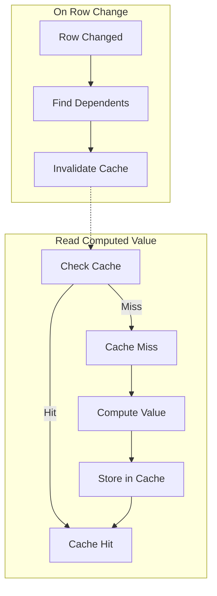
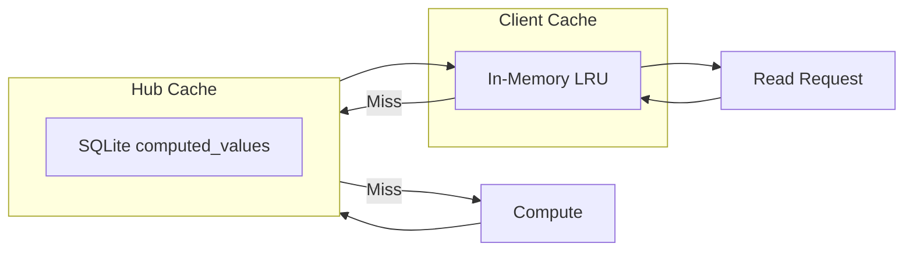

# 13: Computed Caching

> Efficient caching and invalidation for rollups and formulas

**Duration:** 2-3 days
**Dependencies:** `@xnet/data` (rollup service, formula service)

## Overview

Computed columns (rollups and formulas) can be expensive to calculate, especially rollups that traverse relations to aggregate values. This document covers caching strategies and invalidation patterns to maintain both correctness and performance.



## Cache Architecture



## Cache Data Structures

```typescript
// packages/data/src/database/computed-cache.ts

export interface ComputedCacheEntry {
  /** Computed value */
  value: unknown

  /** When the value was computed */
  computedAt: number

  /** Hash of inputs used to compute (for validation) */
  inputHash: string

  /** Row IDs this value depends on */
  dependencies: string[]
}

export interface ComputedCacheConfig {
  /** Max entries in memory cache */
  maxSize: number

  /** Max age before recompute (ms) */
  maxAge: number

  /** Whether to persist to hub */
  persistToHub: boolean
}

export const DEFAULT_CACHE_CONFIG: ComputedCacheConfig = {
  maxSize: 10_000,
  maxAge: 5 * 60 * 1000, // 5 minutes
  persistToHub: true
}
```

## Computed Value Cache

```typescript
// packages/data/src/database/computed-cache.ts

export class ComputedCache {
  private memory = new Map<string, ComputedCacheEntry>()
  private dependencyIndex = new Map<string, Set<string>>() // rowId -> cacheKeys

  constructor(
    private config: ComputedCacheConfig = DEFAULT_CACHE_CONFIG,
    private hubClient?: HubClient
  ) {}

  /**
   * Get a cached computed value.
   */
  async get(rowId: string, columnId: string): Promise<ComputedCacheEntry | null> {
    const key = this.cacheKey(rowId, columnId)

    // Check memory cache
    const memoryEntry = this.memory.get(key)
    if (memoryEntry && !this.isExpired(memoryEntry)) {
      return memoryEntry
    }

    // Check hub cache
    if (this.hubClient && this.config.persistToHub) {
      const hubEntry = await this.hubClient.getComputedValue(rowId, columnId)
      if (hubEntry && !this.isExpired(hubEntry)) {
        this.setMemory(key, hubEntry)
        return hubEntry
      }
    }

    return null
  }

  /**
   * Store a computed value.
   */
  async set(rowId: string, columnId: string, entry: ComputedCacheEntry): Promise<void> {
    const key = this.cacheKey(rowId, columnId)

    // Store in memory
    this.setMemory(key, entry)

    // Index dependencies
    for (const depRowId of entry.dependencies) {
      if (!this.dependencyIndex.has(depRowId)) {
        this.dependencyIndex.set(depRowId, new Set())
      }
      this.dependencyIndex.get(depRowId)!.add(key)
    }

    // Store in hub
    if (this.hubClient && this.config.persistToHub) {
      await this.hubClient.setComputedValue(rowId, columnId, entry)
    }
  }

  /**
   * Invalidate all computed values that depend on a row.
   */
  async invalidate(rowId: string): Promise<void> {
    // Get all cache keys that depend on this row
    const dependentKeys = this.dependencyIndex.get(rowId)

    if (dependentKeys) {
      for (const key of dependentKeys) {
        this.memory.delete(key)
      }
      this.dependencyIndex.delete(rowId)
    }

    // Also invalidate the row's own computed values
    for (const key of this.memory.keys()) {
      if (key.startsWith(rowId)) {
        this.memory.delete(key)
      }
    }

    // Invalidate in hub
    if (this.hubClient && this.config.persistToHub) {
      await this.hubClient.invalidateComputed(rowId)
    }
  }

  /**
   * Invalidate all computed values for a database.
   */
  async invalidateDatabase(databaseId: string): Promise<void> {
    // Clear all - could be smarter with database tracking
    this.memory.clear()
    this.dependencyIndex.clear()

    if (this.hubClient && this.config.persistToHub) {
      await this.hubClient.invalidateDatabaseComputed(databaseId)
    }
  }

  private cacheKey(rowId: string, columnId: string): string {
    return `${rowId}:${columnId}`
  }

  private isExpired(entry: ComputedCacheEntry): boolean {
    return Date.now() - entry.computedAt > this.config.maxAge
  }

  private setMemory(key: string, entry: ComputedCacheEntry): void {
    // Evict oldest if at capacity
    if (this.memory.size >= this.config.maxSize) {
      const oldest = this.memory.keys().next().value
      this.memory.delete(oldest)
    }
    this.memory.set(key, entry)
  }
}
```

## Dependency Tracking

```typescript
// packages/data/src/database/dependency-tracker.ts

import type { ColumnDefinition, RollupColumnConfig, FormulaColumnConfig } from './types'
import { extractDependencies } from './formula/dependency'

export interface DependencyGraph {
  /** columnId -> column IDs it depends on */
  columnDeps: Map<string, string[]>

  /** columnId -> column IDs that depend on it */
  reverseDeps: Map<string, string[]>
}

/**
 * Build dependency graph for computed columns.
 */
export function buildDependencyGraph(columns: ColumnDefinition[]): DependencyGraph {
  const columnDeps = new Map<string, string[]>()
  const reverseDeps = new Map<string, string[]>()

  // Initialize reverse deps for all columns
  for (const col of columns) {
    reverseDeps.set(col.id, [])
  }

  for (const column of columns) {
    const deps = getColumnDependencies(column)
    columnDeps.set(column.id, deps)

    // Build reverse index
    for (const dep of deps) {
      if (!reverseDeps.has(dep)) {
        reverseDeps.set(dep, [])
      }
      reverseDeps.get(dep)!.push(column.id)
    }
  }

  return { columnDeps, reverseDeps }
}

function getColumnDependencies(column: ColumnDefinition): string[] {
  switch (column.type) {
    case 'rollup':
      const rollupConfig = column.config as RollupColumnConfig
      return [rollupConfig.relationColumn]

    case 'formula':
      const formulaConfig = column.config as FormulaColumnConfig
      return extractDependencies(formulaConfig.expression)

    default:
      return []
  }
}

/**
 * Get all columns that need recomputing when a column changes.
 */
export function getAffectedColumns(changedColumnId: string, graph: DependencyGraph): string[] {
  const affected = new Set<string>()
  const queue = [changedColumnId]

  while (queue.length > 0) {
    const current = queue.shift()!
    const dependents = graph.reverseDeps.get(current) ?? []

    for (const dep of dependents) {
      if (!affected.has(dep)) {
        affected.add(dep)
        queue.push(dep)
      }
    }
  }

  return Array.from(affected)
}
```

## Invalidation Strategies

### On Row Update

```typescript
// packages/data/src/database/computed-invalidation.ts

export class ComputedInvalidator {
  constructor(
    private cache: ComputedCache,
    private store: NodeStore
  ) {}

  /**
   * Handle a row update and invalidate affected computed values.
   */
  async onRowUpdate(
    rowId: string,
    changedColumns: string[],
    columns: ColumnDefinition[]
  ): Promise<void> {
    // Build dependency graph
    const graph = buildDependencyGraph(columns)

    // Find all affected computed columns
    const affected = new Set<string>()
    for (const changedCol of changedColumns) {
      for (const affectedCol of getAffectedColumns(changedCol, graph)) {
        affected.add(affectedCol)
      }
    }

    // Invalidate cache for affected columns on this row
    await this.cache.invalidate(rowId)

    // For rollups, also invalidate rows that reference this row
    for (const affectedCol of affected) {
      const column = columns.find((c) => c.id === affectedCol)
      if (column?.type === 'rollup') {
        await this.invalidateReverseRollups(rowId, column, columns)
      }
    }
  }

  /**
   * Invalidate rollups on rows that reference the changed row.
   */
  private async invalidateReverseRollups(
    changedRowId: string,
    rollupColumn: ColumnDefinition,
    columns: ColumnDefinition[]
  ): Promise<void> {
    const config = rollupColumn.config as RollupColumnConfig
    const relationColumn = columns.find((c) => c.id === config.relationColumn)

    if (!relationColumn || relationColumn.type !== 'relation') return

    // Find the source database of the relation
    const relationConfig = relationColumn.config as RelationColumnConfig

    // Query for rows that have this row in their relation
    // This is a reverse lookup
    const relatedRows = await this.store.query({
      schema: 'xnet://xnet.fyi/DatabaseRow',
      where: {
        [`properties.cell_${config.relationColumn}`]: { $contains: changedRowId }
      }
    })

    for (const row of relatedRows) {
      await this.cache.invalidate(row.id)
    }
  }
}
```

### Batch Invalidation

```typescript
/**
 * Batch invalidate for bulk operations.
 */
export async function batchInvalidate(
  cache: ComputedCache,
  changes: Array<{ rowId: string; changedColumns: string[] }>,
  columns: ColumnDefinition[]
): Promise<void> {
  const graph = buildDependencyGraph(columns)
  const allAffected = new Set<string>()

  // Collect all affected rows
  for (const change of changes) {
    allAffected.add(change.rowId)

    for (const changedCol of change.changedColumns) {
      const affected = getAffectedColumns(changedCol, graph)
      // For simplicity, invalidate all computed columns for affected rows
    }
  }

  // Batch invalidate
  await Promise.all(Array.from(allAffected).map((rowId) => cache.invalidate(rowId)))
}
```

## Hub-Side Caching

```sql
-- packages/hub/src/storage/schema.sql

CREATE TABLE computed_values (
  row_id TEXT NOT NULL,
  column_id TEXT NOT NULL,
  value JSON,
  computed_at INTEGER NOT NULL,
  input_hash TEXT NOT NULL,
  dependencies JSON NOT NULL, -- Array of row IDs

  PRIMARY KEY (row_id, column_id)
);

CREATE INDEX idx_computed_deps ON computed_values(dependencies);

-- Trigger to clean up when row is deleted
CREATE TRIGGER computed_cleanup AFTER DELETE ON database_rows BEGIN
  DELETE FROM computed_values WHERE row_id = old.id;
END;
```

```typescript
// packages/hub/src/services/computed-cache.ts

export class HubComputedCache {
  constructor(private db: Database) {}

  get(rowId: string, columnId: string): ComputedCacheEntry | null {
    const row = this.db
      .prepare(
        `
      SELECT * FROM computed_values 
      WHERE row_id = ? AND column_id = ?
    `
      )
      .get(rowId, columnId)

    if (!row) return null

    return {
      value: JSON.parse(row.value),
      computedAt: row.computed_at,
      inputHash: row.input_hash,
      dependencies: JSON.parse(row.dependencies)
    }
  }

  set(rowId: string, columnId: string, entry: ComputedCacheEntry): void {
    this.db
      .prepare(
        `
      INSERT OR REPLACE INTO computed_values 
        (row_id, column_id, value, computed_at, input_hash, dependencies)
      VALUES (?, ?, ?, ?, ?, ?)
    `
      )
      .run(
        rowId,
        columnId,
        JSON.stringify(entry.value),
        entry.computedAt,
        entry.inputHash,
        JSON.stringify(entry.dependencies)
      )
  }

  invalidateRow(rowId: string): void {
    this.db
      .prepare(
        `
      DELETE FROM computed_values WHERE row_id = ?
    `
      )
      .run(rowId)

    // Also invalidate entries that depend on this row
    this.db
      .prepare(
        `
      DELETE FROM computed_values 
      WHERE EXISTS (
        SELECT 1 FROM json_each(dependencies) 
        WHERE value = ?
      )
    `
      )
      .run(rowId)
  }

  invalidateDatabase(databaseId: string): void {
    this.db
      .prepare(
        `
      DELETE FROM computed_values 
      WHERE row_id IN (
        SELECT id FROM database_rows WHERE database_id = ?
      )
    `
      )
      .run(databaseId)
  }
}
```

## React Integration

```typescript
// packages/react/src/hooks/useComputed.ts

import { useState, useEffect, useMemo } from 'react'
import { useStore } from './useStore'
import { ComputedCache, RollupService, FormulaService } from '@xnet/data'
import type { DatabaseRow, ColumnDefinition } from '@xnet/data'

export function useComputed(
  row: DatabaseRow | null,
  column: ColumnDefinition,
  columns: ColumnDefinition[]
): {
  value: unknown
  loading: boolean
  error: Error | null
} {
  const store = useStore()
  const [value, setValue] = useState<unknown>(null)
  const [loading, setLoading] = useState(true)
  const [error, setError] = useState<Error | null>(null)

  const cache = useMemo(() => new ComputedCache(), [])
  const rollupService = useMemo(() => new RollupService(store), [store])
  const formulaService = useMemo(() => new FormulaService(), [])

  useEffect(() => {
    if (!row) {
      setValue(null)
      setLoading(false)
      return
    }

    let cancelled = false

    const compute = async () => {
      try {
        setLoading(true)

        // Check cache first
        const cached = await cache.get(row.id, column.id)
        if (cached) {
          setValue(cached.value)
          setLoading(false)
          return
        }

        // Compute value
        let result: unknown

        if (column.type === 'rollup') {
          result = await rollupService.getRollupValue(row, column)
        } else if (column.type === 'formula') {
          result = formulaService.compute(row, column, columns)
        } else {
          result = null
        }

        if (!cancelled) {
          setValue(result)
          setError(null)

          // Cache the result
          await cache.set(row.id, column.id, {
            value: result,
            computedAt: Date.now(),
            inputHash: '', // Simplified
            dependencies: []
          })
        }
      } catch (err) {
        if (!cancelled) {
          setError(err instanceof Error ? err : new Error(String(err)))
        }
      } finally {
        if (!cancelled) {
          setLoading(false)
        }
      }
    }

    compute()

    return () => {
      cancelled = true
    }
  }, [row, column, columns, cache, rollupService, formulaService])

  // Subscribe to changes that might invalidate this value
  useEffect(() => {
    if (!row) return

    const unsubscribe = store.subscribe(
      {
        /* subscription filter */
      },
      () => {
        cache.invalidate(row.id)
        // Re-compute will happen via effect above
      }
    )

    return unsubscribe
  }, [store, row, cache])

  return { value, loading, error }
}
```

## Testing

```typescript
describe('ComputedCache', () => {
  it('returns cached value on hit', async () => {
    const cache = new ComputedCache()

    await cache.set('row1', 'col1', {
      value: 42,
      computedAt: Date.now(),
      inputHash: 'abc',
      dependencies: []
    })

    const entry = await cache.get('row1', 'col1')
    expect(entry?.value).toBe(42)
  })

  it('returns null for expired entries', async () => {
    const cache = new ComputedCache({
      maxSize: 100,
      maxAge: 100, // 100ms
      persistToHub: false
    })

    await cache.set('row1', 'col1', {
      value: 42,
      computedAt: Date.now() - 200, // Expired
      inputHash: 'abc',
      dependencies: []
    })

    const entry = await cache.get('row1', 'col1')
    expect(entry).toBeNull()
  })

  it('invalidates dependent entries', async () => {
    const cache = new ComputedCache()

    await cache.set('row1', 'col1', {
      value: 42,
      computedAt: Date.now(),
      inputHash: 'abc',
      dependencies: ['row2'] // Depends on row2
    })

    await cache.invalidate('row2')

    const entry = await cache.get('row1', 'col1')
    expect(entry).toBeNull()
  })
})

describe('DependencyTracker', () => {
  it('builds correct dependency graph', () => {
    const columns: ColumnDefinition[] = [
      { id: 'price', type: 'number', name: 'Price', config: {} },
      { id: 'quantity', type: 'number', name: 'Quantity', config: {} },
      {
        id: 'total',
        type: 'formula',
        name: 'Total',
        config: {
          expression: '{{price}} * {{quantity}}'
        }
      }
    ]

    const graph = buildDependencyGraph(columns)

    expect(graph.columnDeps.get('total')).toEqual(['price', 'quantity'])
    expect(graph.reverseDeps.get('price')).toContain('total')
    expect(graph.reverseDeps.get('quantity')).toContain('total')
  })

  it('finds all affected columns', () => {
    const columns: ColumnDefinition[] = [
      { id: 'a', type: 'number', name: 'A', config: {} },
      { id: 'b', type: 'formula', name: 'B', config: { expression: '{{a}} * 2' } },
      { id: 'c', type: 'formula', name: 'C', config: { expression: '{{b}} + 10' } }
    ]

    const graph = buildDependencyGraph(columns)
    const affected = getAffectedColumns('a', graph)

    expect(affected).toContain('b')
    expect(affected).toContain('c')
  })
})
```

## Validation Gate

- [ ] In-memory cache stores and retrieves values
- [ ] Cache expires entries after maxAge
- [ ] LRU eviction works at capacity
- [ ] Dependency index correctly tracks relationships
- [ ] Invalidation propagates to dependents
- [ ] Hub cache persists values
- [ ] Hub cache invalidation works
- [ ] Batch invalidation is efficient
- [ ] useComputed hook returns cached values
- [ ] Cache updates on row changes
- [ ] All tests pass

---

[Back to README](./README.md) | [Previous: Formula Columns](./12-formula-columns.md) | [Next: Relation UI ->](./14-relation-ui.md)
