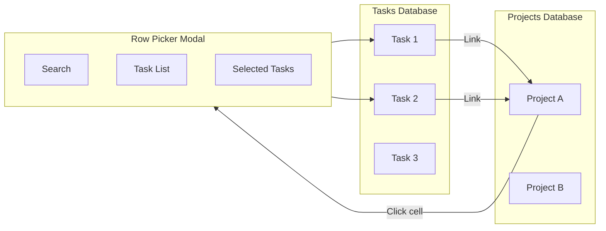

# 14: Relation UI

> Row picker, inline display, and reverse relations

**Duration:** 3-4 days
**Dependencies:** `@xnet/react` (hooks), `@xnet/data` (relation traversal)

## Overview

Relation columns link rows between databases. This document covers the UI components for creating, viewing, and managing these links.



## Relation Cell Display

```typescript
// packages/react/src/views/cells/RelationCell.tsx

import { useState } from 'react'
import { Plus, X } from 'lucide-react'
import { useRelatedRows } from '../../hooks/useRelatedRows'
import { RowPickerModal } from '../modals/RowPickerModal'
import type { ColumnDefinition, RelationColumnConfig } from '@xnet/data'

interface RelationCellProps {
  rowId: string
  column: ColumnDefinition
  value: string[] // Array of related row IDs
  onEdit?: (value: string[]) => void
  compact?: boolean
}

export function RelationCell({
  rowId,
  column,
  value = [],
  onEdit,
  compact
}: RelationCellProps) {
  const [pickerOpen, setPickerOpen] = useState(false)
  const config = column.config as RelationColumnConfig

  // Load related row data for display
  const { rows: relatedRows, loading } = useRelatedRows(value)

  if (loading) {
    return <Skeleton className="h-6 w-24" />
  }

  const handleAdd = (selectedIds: string[]) => {
    const newValue = [...new Set([...value, ...selectedIds])]
    onEdit?.(newValue)
    setPickerOpen(false)
  }

  const handleRemove = (removeId: string) => {
    onEdit?.(value.filter(id => id !== removeId))
  }

  if (compact) {
    return (
      <div className="flex items-center gap-1">
        <span className="text-muted-foreground">
          {relatedRows.length} linked
        </span>
        {onEdit && (
          <button
            onClick={() => setPickerOpen(true)}
            className="p-0.5 hover:bg-muted rounded"
          >
            <Plus className="w-3 h-3" />
          </button>
        )}

        <RowPickerModal
          open={pickerOpen}
          onClose={() => setPickerOpen(false)}
          targetDatabaseId={config.targetDatabase}
          selectedIds={value}
          onSelect={handleAdd}
          allowMultiple={config.allowMultiple ?? true}
        />
      </div>
    )
  }

  return (
    <div className="flex flex-wrap gap-1">
      {relatedRows.map(row => (
        <RelationChip
          key={row.id}
          row={row}
          onRemove={onEdit ? () => handleRemove(row.id) : undefined}
        />
      ))}

      {onEdit && (
        <button
          onClick={() => setPickerOpen(true)}
          className="flex items-center gap-1 px-2 py-0.5 text-sm text-muted-foreground hover:bg-muted rounded"
        >
          <Plus className="w-3 h-3" />
          Link
        </button>
      )}

      <RowPickerModal
        open={pickerOpen}
        onClose={() => setPickerOpen(false)}
        targetDatabaseId={config.targetDatabase}
        selectedIds={value}
        onSelect={handleAdd}
        allowMultiple={config.allowMultiple ?? true}
      />
    </div>
  )
}

function RelationChip({
  row,
  onRemove
}: {
  row: DatabaseRow
  onRemove?: () => void
}) {
  // Get title column value
  const title = row.cells.title ?? row.cells.name ?? row.id

  return (
    <div className="flex items-center gap-1 px-2 py-0.5 bg-muted rounded text-sm group">
      <span className="max-w-32 truncate">{String(title)}</span>
      {onRemove && (
        <button
          onClick={(e) => {
            e.stopPropagation()
            onRemove()
          }}
          className="opacity-0 group-hover:opacity-100 hover:text-destructive"
        >
          <X className="w-3 h-3" />
        </button>
      )}
    </div>
  )
}
```

## Row Picker Modal

```typescript
// packages/react/src/views/modals/RowPickerModal.tsx

import { useState, useMemo, useCallback } from 'react'
import { Search, Check, Plus } from 'lucide-react'
import { useDatabase } from '../../hooks/useDatabase'
import { Dialog, DialogContent, DialogHeader, DialogTitle } from '@/components/ui/dialog'

interface RowPickerModalProps {
  open: boolean
  onClose: () => void
  targetDatabaseId: string
  selectedIds: string[]
  onSelect: (ids: string[]) => void
  allowMultiple?: boolean
}

export function RowPickerModal({
  open,
  onClose,
  targetDatabaseId,
  selectedIds,
  onSelect,
  allowMultiple = true
}: RowPickerModalProps) {
  const [search, setSearch] = useState('')
  const [pendingSelection, setPendingSelection] = useState<Set<string>>(
    new Set(selectedIds)
  )

  const {
    database,
    rows,
    columns,
    loading,
    hasMore,
    loadMore,
    createRow
  } = useDatabase(targetDatabaseId, {
    search: search || undefined,
    pageSize: 20
  })

  // Get title column
  const titleColumn = useMemo(() =>
    columns.find(c => c.isTitle) ?? columns[0],
    [columns]
  )

  const handleToggle = useCallback((rowId: string) => {
    setPendingSelection(prev => {
      const next = new Set(prev)
      if (next.has(rowId)) {
        next.delete(rowId)
      } else {
        if (!allowMultiple) {
          next.clear()
        }
        next.add(rowId)
      }
      return next
    })
  }, [allowMultiple])

  const handleConfirm = () => {
    onSelect(Array.from(pendingSelection))
  }

  const handleCreateAndLink = async () => {
    const title = search.trim()
    if (!title) return

    const newRowId = await createRow({
      [titleColumn?.id ?? 'title']: title
    })

    if (allowMultiple) {
      setPendingSelection(prev => new Set([...prev, newRowId]))
    } else {
      onSelect([newRowId])
    }
  }

  return (
    <Dialog open={open} onOpenChange={onClose}>
      <DialogContent className="max-w-lg">
        <DialogHeader>
          <DialogTitle>Link to {database?.properties.title}</DialogTitle>
        </DialogHeader>

        {/* Search */}
        <div className="relative">
          <Search className="absolute left-3 top-1/2 -translate-y-1/2 w-4 h-4 text-muted-foreground" />
          <input
            type="text"
            placeholder="Search or create..."
            value={search}
            onChange={e => setSearch(e.target.value)}
            className="w-full pl-10 pr-4 py-2 border rounded-md"
            autoFocus
          />
        </div>

        {/* Row list */}
        <div className="max-h-64 overflow-y-auto border rounded-md">
          {loading ? (
            <div className="p-4 text-center text-muted-foreground">
              Loading...
            </div>
          ) : rows.length === 0 ? (
            <div className="p-4 text-center text-muted-foreground">
              {search ? (
                <div className="space-y-2">
                  <p>No results for "{search}"</p>
                  <button
                    onClick={handleCreateAndLink}
                    className="flex items-center gap-2 mx-auto text-primary hover:underline"
                  >
                    <Plus className="w-4 h-4" />
                    Create "{search}" and link
                  </button>
                </div>
              ) : (
                'No rows in this database'
              )}
            </div>
          ) : (
            <>
              {rows.map(row => {
                const isSelected = pendingSelection.has(row.id)
                const title = row.cells[titleColumn?.id] ?? row.id

                return (
                  <button
                    key={row.id}
                    onClick={() => handleToggle(row.id)}
                    className={cn(
                      "w-full flex items-center gap-3 px-4 py-2 hover:bg-muted text-left",
                      isSelected && "bg-primary/10"
                    )}
                  >
                    <div className={cn(
                      "w-4 h-4 border rounded flex items-center justify-center",
                      isSelected && "bg-primary border-primary"
                    )}>
                      {isSelected && <Check className="w-3 h-3 text-primary-foreground" />}
                    </div>
                    <span className="flex-1 truncate">{String(title)}</span>
                  </button>
                )
              })}

              {hasMore && (
                <button
                  onClick={loadMore}
                  className="w-full p-2 text-center text-muted-foreground hover:bg-muted"
                >
                  Load more...
                </button>
              )}
            </>
          )}
        </div>

        {/* Actions */}
        <div className="flex justify-between">
          <span className="text-sm text-muted-foreground">
            {pendingSelection.size} selected
          </span>
          <div className="flex gap-2">
            <button
              onClick={onClose}
              className="px-4 py-2 border rounded-md hover:bg-muted"
            >
              Cancel
            </button>
            <button
              onClick={handleConfirm}
              className="px-4 py-2 bg-primary text-primary-foreground rounded-md hover:bg-primary/90"
            >
              Link
            </button>
          </div>
        </div>
      </DialogContent>
    </Dialog>
  )
}
```

## Reverse Relations View

```typescript
// packages/react/src/views/ReverseRelationsPanel.tsx

import { useReverseRelations } from '../hooks/useReverseRelations'
import type { DatabaseRow, ColumnDefinition } from '@xnet/data'

interface ReverseRelationsPanelProps {
  rowId: string
  databaseId: string
}

export function ReverseRelationsPanel({ rowId, databaseId }: ReverseRelationsPanelProps) {
  const { relations, loading } = useReverseRelations(rowId, databaseId)

  if (loading) {
    return <Skeleton className="h-24" />
  }

  if (relations.length === 0) {
    return (
      <div className="text-sm text-muted-foreground p-4 text-center">
        No other rows link to this item
      </div>
    )
  }

  // Group by source database
  const groupedByDatabase = relations.reduce((acc, rel) => {
    if (!acc[rel.sourceDatabaseId]) {
      acc[rel.sourceDatabaseId] = {
        database: rel.sourceDatabase,
        column: rel.column,
        rows: []
      }
    }
    acc[rel.sourceDatabaseId].rows.push(rel.row)
    return acc
  }, {} as Record<string, { database: any; column: ColumnDefinition; rows: DatabaseRow[] }>)

  return (
    <div className="space-y-4">
      <h3 className="text-sm font-medium">Linked from</h3>

      {Object.entries(groupedByDatabase).map(([dbId, { database, column, rows }]) => (
        <div key={dbId} className="space-y-2">
          <div className="flex items-center gap-2 text-sm text-muted-foreground">
            <span>{database.properties.title}</span>
            <span>via</span>
            <span className="font-medium">{column.name}</span>
          </div>

          <div className="space-y-1">
            {rows.map(row => (
              <ReverseRelationRow key={row.id} row={row} />
            ))}
          </div>
        </div>
      ))}
    </div>
  )
}

function ReverseRelationRow({ row }: { row: DatabaseRow }) {
  const title = row.cells.title ?? row.cells.name ?? row.id

  return (
    <a
      href={`/row/${row.id}`}
      className="flex items-center gap-2 p-2 hover:bg-muted rounded"
    >
      <span className="truncate">{String(title)}</span>
    </a>
  )
}
```

## useRelatedRows Hook

```typescript
// packages/react/src/hooks/useRelatedRows.ts

import { useState, useEffect, useMemo } from 'react'
import { useStore } from './useStore'
import type { DatabaseRow } from '@xnet/data'

export function useRelatedRows(rowIds: string[]): {
  rows: DatabaseRow[]
  loading: boolean
  error: Error | null
} {
  const store = useStore()
  const [rows, setRows] = useState<DatabaseRow[]>([])
  const [loading, setLoading] = useState(true)
  const [error, setError] = useState<Error | null>(null)

  // Stable reference for row IDs
  const idsKey = useMemo(() => rowIds.join(','), [rowIds])

  useEffect(() => {
    if (rowIds.length === 0) {
      setRows([])
      setLoading(false)
      return
    }

    let cancelled = false

    const fetch = async () => {
      try {
        setLoading(true)
        const results = await Promise.all(rowIds.map((id) => store.get(id)))

        if (!cancelled) {
          setRows(results.filter(Boolean).map(nodeToRow))
          setError(null)
        }
      } catch (err) {
        if (!cancelled) {
          setError(err instanceof Error ? err : new Error(String(err)))
        }
      } finally {
        if (!cancelled) {
          setLoading(false)
        }
      }
    }

    fetch()

    return () => {
      cancelled = true
    }
  }, [store, idsKey])

  return { rows, loading, error }
}
```

## useReverseRelations Hook

```typescript
// packages/react/src/hooks/useReverseRelations.ts

import { useState, useEffect } from 'react'
import { useStore } from './useStore'
import type { DatabaseRow, ColumnDefinition } from '@xnet/data'

interface ReverseRelation {
  row: DatabaseRow
  column: ColumnDefinition
  sourceDatabaseId: string
  sourceDatabase: any
}

export function useReverseRelations(
  rowId: string,
  databaseId: string
): {
  relations: ReverseRelation[]
  loading: boolean
  error: Error | null
} {
  const store = useStore()
  const [relations, setRelations] = useState<ReverseRelation[]>([])
  const [loading, setLoading] = useState(true)
  const [error, setError] = useState<Error | null>(null)

  useEffect(() => {
    let cancelled = false

    const fetch = async () => {
      try {
        setLoading(true)

        // Find all relation columns that target this database
        const allDatabases = await store.query({
          schema: 'xnet://xnet.fyi/Database'
        })

        const reverseRelations: ReverseRelation[] = []

        for (const db of allDatabases) {
          const doc = await store.getDoc(db.id)
          const columns = getColumns(doc)

          // Find relation columns pointing to our database
          const relationColumns = columns.filter(
            (c) =>
              c.type === 'relation' &&
              (c.config as RelationColumnConfig).targetDatabase === databaseId
          )

          for (const col of relationColumns) {
            // Query for rows that have this row in their relation
            const rows = await store.query({
              schema: 'xnet://xnet.fyi/DatabaseRow',
              where: {
                'properties.database': db.id,
                [`properties.cell_${col.id}`]: { $contains: rowId }
              }
            })

            for (const row of rows) {
              reverseRelations.push({
                row: nodeToRow(row),
                column: col,
                sourceDatabaseId: db.id,
                sourceDatabase: db
              })
            }
          }
        }

        if (!cancelled) {
          setRelations(reverseRelations)
          setError(null)
        }
      } catch (err) {
        if (!cancelled) {
          setError(err instanceof Error ? err : new Error(String(err)))
        }
      } finally {
        if (!cancelled) {
          setLoading(false)
        }
      }
    }

    fetch()

    return () => {
      cancelled = true
    }
  }, [store, rowId, databaseId])

  return { relations, loading, error }
}
```

## Testing

```typescript
describe('RelationCell', () => {
  it('displays linked row titles', () => {
    const relatedRows = [
      { id: 'row1', cells: { title: 'Task 1' } },
      { id: 'row2', cells: { title: 'Task 2' } }
    ]

    render(
      <RelationCell
        rowId="project1"
        column={relationColumn}
        value={['row1', 'row2']}
      />
    )

    expect(screen.getByText('Task 1')).toBeInTheDocument()
    expect(screen.getByText('Task 2')).toBeInTheDocument()
  })

  it('opens picker on link button click', async () => {
    render(
      <RelationCell
        rowId="project1"
        column={relationColumn}
        value={[]}
        onEdit={vi.fn()}
      />
    )

    await userEvent.click(screen.getByText('Link'))

    expect(screen.getByRole('dialog')).toBeInTheDocument()
  })

  it('removes relation on chip X click', async () => {
    const onEdit = vi.fn()

    render(
      <RelationCell
        rowId="project1"
        column={relationColumn}
        value={['row1', 'row2']}
        onEdit={onEdit}
      />
    )

    // Hover to show X button
    const chip = screen.getByText('Task 1').parentElement!
    await userEvent.hover(chip)
    await userEvent.click(within(chip).getByRole('button'))

    expect(onEdit).toHaveBeenCalledWith(['row2'])
  })
})

describe('RowPickerModal', () => {
  it('shows searchable list of rows', async () => {
    render(
      <RowPickerModal
        open={true}
        onClose={vi.fn()}
        targetDatabaseId="tasks"
        selectedIds={[]}
        onSelect={vi.fn()}
      />
    )

    expect(screen.getByPlaceholderText('Search or create...')).toBeInTheDocument()
    expect(screen.getByText('Task 1')).toBeInTheDocument()
  })

  it('allows creating new row from search', async () => {
    const onSelect = vi.fn()

    render(
      <RowPickerModal
        open={true}
        onClose={vi.fn()}
        targetDatabaseId="tasks"
        selectedIds={[]}
        onSelect={onSelect}
      />
    )

    await userEvent.type(
      screen.getByPlaceholderText('Search or create...'),
      'New Task'
    )

    await userEvent.click(screen.getByText(/Create "New Task"/))

    expect(onSelect).toHaveBeenCalled()
  })
})

describe('ReverseRelationsPanel', () => {
  it('shows rows linking to this row', async () => {
    render(
      <ReverseRelationsPanel
        rowId="task1"
        databaseId="tasks"
      />
    )

    await waitFor(() => {
      expect(screen.getByText('Project A')).toBeInTheDocument()
    })
  })
})
```

## Validation Gate

Note: These are React UI components. The data layer for relations is complete (relation column type, rollup aggregation). UI components are deferred to the React UI phase.

- [ ] RelationCell displays linked row titles (React component - deferred)
- [ ] Compact mode shows count (React component - deferred)
- [ ] Link button opens picker modal (React component - deferred)
- [ ] Remove button removes relation (React component - deferred)
- [ ] RowPickerModal shows searchable list (React component - deferred)
- [ ] Multi-select works correctly (React component - deferred)
- [ ] Single-select clears previous selection (React component - deferred)
- [ ] Create and link works (React component - deferred)
- [ ] Load more pagination works (React component - deferred)
- [ ] ReverseRelationsPanel shows backlinks (React component - deferred)
- [ ] Backlinks grouped by database (React component - deferred)
- [ ] All tests pass (React component - deferred)

---

[Back to README](./README.md) | [Previous: Computed Caching](./13-computed-caching.md) | [Next: Import/Export ->](./15-import-export.md)
