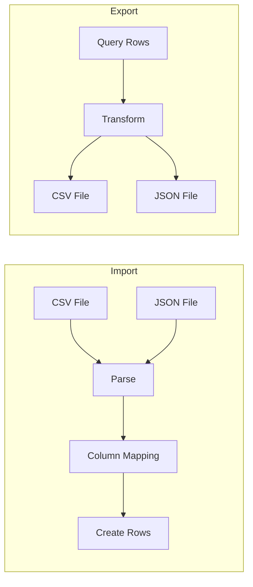

# 15: Import/Export

> CSV and JSON import/export for database data

**Duration:** 3-4 days
**Dependencies:** `@xnet/data` (database operations)

## Overview

Support importing data from CSV and JSON files, and exporting database content to these formats. This enables data migration, backup, and integration with external tools.



## CSV Import

### Column Mapping UI

```typescript
// packages/react/src/views/import/CsvImportModal.tsx

import { useState, useMemo } from 'react'
import { Upload, ArrowRight } from 'lucide-react'
import { parseCSV, guessColumnTypes } from '@xnet/data'
import type { ColumnDefinition, ColumnType } from '@xnet/data'

interface CsvImportModalProps {
  open: boolean
  onClose: () => void
  databaseId: string
  existingColumns: ColumnDefinition[]
  onImport: (rows: Record<string, unknown>[]) => Promise<void>
}

interface ColumnMapping {
  csvColumn: string
  targetColumn: string | null // null = skip, 'new:type' = create new
  targetType?: ColumnType
}

export function CsvImportModal({
  open,
  onClose,
  databaseId,
  existingColumns,
  onImport
}: CsvImportModalProps) {
  const [file, setFile] = useState<File | null>(null)
  const [csvData, setCsvData] = useState<{ headers: string[]; rows: string[][] } | null>(null)
  const [mappings, setMappings] = useState<ColumnMapping[]>([])
  const [importing, setImporting] = useState(false)
  const [progress, setProgress] = useState(0)

  // Parse CSV file
  const handleFileSelect = async (file: File) => {
    setFile(file)
    const text = await file.text()
    const parsed = parseCSV(text)
    setCsvData(parsed)

    // Auto-generate mappings
    const autoMappings = parsed.headers.map(header => {
      // Try to match existing column by name
      const existing = existingColumns.find(
        c => c.name.toLowerCase() === header.toLowerCase()
      )

      if (existing) {
        return {
          csvColumn: header,
          targetColumn: existing.id
        }
      }

      // Guess type for new column
      const values = parsed.rows.map(row => row[parsed.headers.indexOf(header)])
      const guessedType = guessColumnType(values)

      return {
        csvColumn: header,
        targetColumn: `new:${guessedType}`,
        targetType: guessedType
      }
    })

    setMappings(autoMappings)
  }

  const handleImport = async () => {
    if (!csvData) return

    setImporting(true)
    setProgress(0)

    try {
      const rows: Record<string, unknown>[] = []

      for (let i = 0; i < csvData.rows.length; i++) {
        const csvRow = csvData.rows[i]
        const row: Record<string, unknown> = {}

        for (const mapping of mappings) {
          if (!mapping.targetColumn) continue

          const csvIndex = csvData.headers.indexOf(mapping.csvColumn)
          const value = csvRow[csvIndex]

          if (mapping.targetColumn.startsWith('new:')) {
            // Will create column with this type
            row[mapping.csvColumn] = parseValue(value, mapping.targetType!)
          } else {
            const column = existingColumns.find(c => c.id === mapping.targetColumn)
            row[mapping.targetColumn] = parseValue(value, column?.type ?? 'text')
          }
        }

        rows.push(row)
        setProgress((i + 1) / csvData.rows.length * 100)
      }

      await onImport(rows)
      onClose()
    } finally {
      setImporting(false)
    }
  }

  return (
    <Dialog open={open} onOpenChange={onClose}>
      <DialogContent className="max-w-2xl">
        <DialogHeader>
          <DialogTitle>Import CSV</DialogTitle>
        </DialogHeader>

        {!csvData ? (
          <FileDropzone onFileSelect={handleFileSelect} accept=".csv" />
        ) : (
          <>
            {/* Column mapping */}
            <div className="space-y-2 max-h-64 overflow-y-auto">
              {mappings.map((mapping, i) => (
                <div key={i} className="flex items-center gap-4">
                  <div className="w-1/3 font-mono text-sm">
                    {mapping.csvColumn}
                  </div>

                  <ArrowRight className="w-4 h-4 text-muted-foreground" />

                  <select
                    value={mapping.targetColumn ?? 'skip'}
                    onChange={e => {
                      const newMappings = [...mappings]
                      newMappings[i] = {
                        ...mapping,
                        targetColumn: e.target.value === 'skip' ? null : e.target.value
                      }
                      setMappings(newMappings)
                    }}
                    className="flex-1 border rounded px-2 py-1"
                  >
                    <option value="skip">Skip</option>
                    <optgroup label="Existing columns">
                      {existingColumns.map(col => (
                        <option key={col.id} value={col.id}>
                          {col.name} ({col.type})
                        </option>
                      ))}
                    </optgroup>
                    <optgroup label="Create new column">
                      {(['text', 'number', 'date', 'checkbox', 'url', 'email'] as ColumnType[]).map(type => (
                        <option key={type} value={`new:${type}`}>
                          New {type} column
                        </option>
                      ))}
                    </optgroup>
                  </select>
                </div>
              ))}
            </div>

            {/* Preview */}
            <div className="border rounded">
              <div className="text-sm text-muted-foreground p-2 bg-muted">
                Preview (first 5 rows)
              </div>
              <table className="w-full text-sm">
                <thead>
                  <tr>
                    {mappings.filter(m => m.targetColumn).map(m => (
                      <th key={m.csvColumn} className="px-2 py-1 text-left border-b">
                        {m.csvColumn}
                      </th>
                    ))}
                  </tr>
                </thead>
                <tbody>
                  {csvData.rows.slice(0, 5).map((row, i) => (
                    <tr key={i}>
                      {mappings.filter(m => m.targetColumn).map(m => (
                        <td key={m.csvColumn} className="px-2 py-1 border-b truncate max-w-32">
                          {row[csvData.headers.indexOf(m.csvColumn)]}
                        </td>
                      ))}
                    </tr>
                  ))}
                </tbody>
              </table>
            </div>

            {/* Actions */}
            <div className="flex justify-between items-center">
              <span className="text-sm text-muted-foreground">
                {csvData.rows.length} rows to import
              </span>

              {importing ? (
                <div className="flex items-center gap-2">
                  <Progress value={progress} className="w-32" />
                  <span className="text-sm">{Math.round(progress)}%</span>
                </div>
              ) : (
                <div className="flex gap-2">
                  <button onClick={() => setCsvData(null)} className="px-4 py-2 border rounded">
                    Back
                  </button>
                  <button
                    onClick={handleImport}
                    className="px-4 py-2 bg-primary text-primary-foreground rounded"
                  >
                    Import {csvData.rows.length} rows
                  </button>
                </div>
              )}
            </div>
          </>
        )}
      </DialogContent>
    </Dialog>
  )
}
```

### CSV Parser

```typescript
// packages/data/src/database/import/csv-parser.ts

export interface ParsedCSV {
  headers: string[]
  rows: string[][]
}

export function parseCSV(text: string): ParsedCSV {
  const lines = text.split(/\r?\n/).filter((line) => line.trim())

  if (lines.length === 0) {
    return { headers: [], rows: [] }
  }

  const headers = parseCSVLine(lines[0])
  const rows = lines.slice(1).map(parseCSVLine)

  return { headers, rows }
}

function parseCSVLine(line: string): string[] {
  const result: string[] = []
  let current = ''
  let inQuotes = false

  for (let i = 0; i < line.length; i++) {
    const char = line[i]
    const nextChar = line[i + 1]

    if (inQuotes) {
      if (char === '"' && nextChar === '"') {
        current += '"'
        i++ // Skip next quote
      } else if (char === '"') {
        inQuotes = false
      } else {
        current += char
      }
    } else {
      if (char === '"') {
        inQuotes = true
      } else if (char === ',') {
        result.push(current.trim())
        current = ''
      } else {
        current += char
      }
    }
  }

  result.push(current.trim())
  return result
}

/**
 * Guess the column type from sample values.
 */
export function guessColumnType(values: string[]): ColumnType {
  const nonEmpty = values.filter((v) => v.trim() !== '')

  if (nonEmpty.length === 0) return 'text'

  // Check for boolean
  if (nonEmpty.every((v) => ['true', 'false', 'yes', 'no', '1', '0'].includes(v.toLowerCase()))) {
    return 'checkbox'
  }

  // Check for number
  if (nonEmpty.every((v) => !isNaN(parseFloat(v)))) {
    return 'number'
  }

  // Check for date
  if (nonEmpty.every((v) => !isNaN(Date.parse(v)))) {
    return 'date'
  }

  // Check for email
  const emailRegex = /^[^\s@]+@[^\s@]+\.[^\s@]+$/
  if (nonEmpty.every((v) => emailRegex.test(v))) {
    return 'email'
  }

  // Check for URL
  const urlRegex = /^https?:\/\//
  if (nonEmpty.every((v) => urlRegex.test(v))) {
    return 'url'
  }

  return 'text'
}

/**
 * Parse a string value to the appropriate type.
 */
export function parseValue(value: string, type: ColumnType): unknown {
  if (value.trim() === '') return null

  switch (type) {
    case 'number':
      return parseFloat(value) || null

    case 'checkbox':
      return ['true', 'yes', '1'].includes(value.toLowerCase())

    case 'date':
      const date = new Date(value)
      return isNaN(date.getTime()) ? null : date.toISOString()

    case 'multiSelect':
      return value
        .split(',')
        .map((v) => v.trim())
        .filter(Boolean)

    default:
      return value
  }
}
```

## JSON Import

```typescript
// packages/data/src/database/import/json-parser.ts

export interface ParsedJSON {
  rows: Record<string, unknown>[]
  inferredColumns: ColumnDefinition[]
}

export function parseJSON(text: string): ParsedJSON {
  const data = JSON.parse(text)

  // Handle array of objects
  if (Array.isArray(data)) {
    return {
      rows: data,
      inferredColumns: inferColumnsFromRows(data)
    }
  }

  // Handle object with 'rows' property
  if (data.rows && Array.isArray(data.rows)) {
    return {
      rows: data.rows,
      inferredColumns: data.columns ?? inferColumnsFromRows(data.rows)
    }
  }

  throw new Error('Invalid JSON format. Expected array of objects or {rows: [...]}')
}

function inferColumnsFromRows(rows: Record<string, unknown>[]): ColumnDefinition[] {
  const columnMap = new Map<string, { type: ColumnType; values: unknown[] }>()

  for (const row of rows) {
    for (const [key, value] of Object.entries(row)) {
      if (!columnMap.has(key)) {
        columnMap.set(key, { type: 'text', values: [] })
      }
      columnMap.get(key)!.values.push(value)
    }
  }

  return Array.from(columnMap.entries()).map(([name, { values }]) => ({
    id: nanoid(),
    name,
    type: inferTypeFromValues(values),
    config: {}
  }))
}

function inferTypeFromValues(values: unknown[]): ColumnType {
  const nonNull = values.filter((v) => v !== null && v !== undefined)

  if (nonNull.length === 0) return 'text'

  if (nonNull.every((v) => typeof v === 'boolean')) return 'checkbox'
  if (nonNull.every((v) => typeof v === 'number')) return 'number'
  if (nonNull.every((v) => Array.isArray(v))) return 'multiSelect'

  // Check for date strings
  if (nonNull.every((v) => typeof v === 'string' && !isNaN(Date.parse(v)))) {
    return 'date'
  }

  return 'text'
}
```

## CSV Export

```typescript
// packages/data/src/database/export/csv-export.ts

import type { DatabaseRow, ColumnDefinition } from '../types'

export interface CsvExportOptions {
  /** Columns to include (default: all visible) */
  columns?: string[]

  /** Include header row */
  includeHeaders?: boolean

  /** Delimiter (default: comma) */
  delimiter?: string

  /** Line ending (default: CRLF for Windows compatibility) */
  lineEnding?: string
}

export function exportToCsv(
  rows: DatabaseRow[],
  columns: ColumnDefinition[],
  options: CsvExportOptions = {}
): string {
  const {
    columns: selectedColumns,
    includeHeaders = true,
    delimiter = ',',
    lineEnding = '\r\n'
  } = options

  const exportColumns = selectedColumns
    ? columns.filter((c) => selectedColumns.includes(c.id))
    : columns

  const lines: string[] = []

  // Header row
  if (includeHeaders) {
    lines.push(exportColumns.map((c) => escapeCSV(c.name, delimiter)).join(delimiter))
  }

  // Data rows
  for (const row of rows) {
    const values = exportColumns.map((col) => {
      const value = row.cells[col.id]
      return escapeCSV(formatValue(value, col), delimiter)
    })
    lines.push(values.join(delimiter))
  }

  return lines.join(lineEnding)
}

function escapeCSV(value: string, delimiter: string): string {
  if (value.includes(delimiter) || value.includes('"') || value.includes('\n')) {
    return `"${value.replace(/"/g, '""')}"`
  }
  return value
}

function formatValue(value: unknown, column: ColumnDefinition): string {
  if (value === null || value === undefined) return ''

  switch (column.type) {
    case 'date':
      return new Date(value as string).toISOString().split('T')[0]

    case 'checkbox':
      return value ? 'true' : 'false'

    case 'multiSelect':
    case 'relation':
      return (value as string[]).join(', ')

    case 'select':
      const config = column.config as SelectColumnConfig
      const option = config.options.find((o) => o.id === value)
      return option?.name ?? String(value)

    default:
      return String(value)
  }
}
```

## JSON Export

```typescript
// packages/data/src/database/export/json-export.ts

import type { DatabaseRow, ColumnDefinition } from '../types'

export interface JsonExportOptions {
  /** Columns to include (default: all) */
  columns?: string[]

  /** Include column definitions */
  includeSchema?: boolean

  /** Pretty print with indentation */
  pretty?: boolean
}

export function exportToJson(
  rows: DatabaseRow[],
  columns: ColumnDefinition[],
  options: JsonExportOptions = {}
): string {
  const { columns: selectedColumns, includeSchema = true, pretty = true } = options

  const exportColumns = selectedColumns
    ? columns.filter((c) => selectedColumns.includes(c.id))
    : columns

  const exportRows = rows.map((row) => {
    const obj: Record<string, unknown> = {}

    for (const col of exportColumns) {
      obj[col.name] = row.cells[col.id] ?? null
    }

    return obj
  })

  const result: Record<string, unknown> = {
    rows: exportRows
  }

  if (includeSchema) {
    result.columns = exportColumns.map((col) => ({
      name: col.name,
      type: col.type,
      config: col.config
    }))
  }

  return JSON.stringify(result, null, pretty ? 2 : undefined)
}
```

## Export Modal

```typescript
// packages/react/src/views/export/ExportModal.tsx

import { useState } from 'react'
import { Download } from 'lucide-react'
import { exportToCsv, exportToJson } from '@xnet/data'
import type { ColumnDefinition } from '@xnet/data'

interface ExportModalProps {
  open: boolean
  onClose: () => void
  databaseId: string
  viewId?: string
}

export function ExportModal({ open, onClose, databaseId, viewId }: ExportModalProps) {
  const [format, setFormat] = useState<'csv' | 'json'>('csv')
  const [includeSchema, setIncludeSchema] = useState(true)
  const [exporting, setExporting] = useState(false)

  const { rows, columns, activeView } = useDatabase(databaseId, { view: viewId })

  const handleExport = async () => {
    setExporting(true)

    try {
      let content: string
      let filename: string
      let mimeType: string

      // Use view's visible columns if available
      const exportColumns = activeView?.visibleColumns ?? columns.map(c => c.id)

      if (format === 'csv') {
        content = exportToCsv(rows, columns, { columns: exportColumns })
        filename = `${activeView?.name ?? 'export'}.csv`
        mimeType = 'text/csv'
      } else {
        content = exportToJson(rows, columns, {
          columns: exportColumns,
          includeSchema
        })
        filename = `${activeView?.name ?? 'export'}.json`
        mimeType = 'application/json'
      }

      // Download file
      const blob = new Blob([content], { type: mimeType })
      const url = URL.createObjectURL(blob)
      const a = document.createElement('a')
      a.href = url
      a.download = filename
      a.click()
      URL.revokeObjectURL(url)

      onClose()
    } finally {
      setExporting(false)
    }
  }

  return (
    <Dialog open={open} onOpenChange={onClose}>
      <DialogContent>
        <DialogHeader>
          <DialogTitle>Export Data</DialogTitle>
        </DialogHeader>

        <div className="space-y-4">
          {/* Format selection */}
          <div className="space-y-2">
            <label className="text-sm font-medium">Format</label>
            <div className="flex gap-4">
              <label className="flex items-center gap-2">
                <input
                  type="radio"
                  checked={format === 'csv'}
                  onChange={() => setFormat('csv')}
                />
                CSV
              </label>
              <label className="flex items-center gap-2">
                <input
                  type="radio"
                  checked={format === 'json'}
                  onChange={() => setFormat('json')}
                />
                JSON
              </label>
            </div>
          </div>

          {/* JSON options */}
          {format === 'json' && (
            <label className="flex items-center gap-2">
              <input
                type="checkbox"
                checked={includeSchema}
                onChange={e => setIncludeSchema(e.target.checked)}
              />
              Include column definitions
            </label>
          )}

          {/* Info */}
          <div className="text-sm text-muted-foreground">
            Exporting {rows.length} rows with {columns.length} columns
            {activeView && ` from view "${activeView.name}"`}
          </div>
        </div>

        <div className="flex justify-end gap-2">
          <button onClick={onClose} className="px-4 py-2 border rounded">
            Cancel
          </button>
          <button
            onClick={handleExport}
            disabled={exporting}
            className="flex items-center gap-2 px-4 py-2 bg-primary text-primary-foreground rounded"
          >
            <Download className="w-4 h-4" />
            {exporting ? 'Exporting...' : 'Export'}
          </button>
        </div>
      </DialogContent>
    </Dialog>
  )
}
```

## Testing

```typescript
describe('CSV Parser', () => {
  it('parses simple CSV', () => {
    const csv = `name,age,active
Alice,30,true
Bob,25,false`

    const result = parseCSV(csv)

    expect(result.headers).toEqual(['name', 'age', 'active'])
    expect(result.rows).toHaveLength(2)
    expect(result.rows[0]).toEqual(['Alice', '30', 'true'])
  })

  it('handles quoted values', () => {
    const csv = `name,description
"John Doe","Hello, World"`

    const result = parseCSV(csv)

    expect(result.rows[0]).toEqual(['John Doe', 'Hello, World'])
  })

  it('handles escaped quotes', () => {
    const csv = `name,quote
Alice,"She said ""hello"""`

    const result = parseCSV(csv)

    expect(result.rows[0][1]).toBe('She said "hello"')
  })
})

describe('guessColumnType', () => {
  it('detects numbers', () => {
    expect(guessColumnType(['1', '2.5', '100'])).toBe('number')
  })

  it('detects booleans', () => {
    expect(guessColumnType(['true', 'false', 'yes', 'no'])).toBe('checkbox')
  })

  it('detects dates', () => {
    expect(guessColumnType(['2024-01-01', '2024-06-15'])).toBe('date')
  })

  it('detects emails', () => {
    expect(guessColumnType(['a@b.com', 'test@example.org'])).toBe('email')
  })

  it('defaults to text', () => {
    expect(guessColumnType(['hello', 'world'])).toBe('text')
  })
})

describe('CSV Export', () => {
  it('exports rows with headers', () => {
    const columns = [
      { id: 'name', name: 'Name', type: 'text' as const, config: {} },
      { id: 'age', name: 'Age', type: 'number' as const, config: {} }
    ]
    const rows = [{ id: '1', sortKey: 'a0', cells: { name: 'Alice', age: 30 } }]

    const csv = exportToCsv(rows, columns)

    expect(csv).toBe('Name,Age\r\nAlice,30')
  })

  it('escapes special characters', () => {
    const columns = [{ id: 'desc', name: 'Description', type: 'text' as const, config: {} }]
    const rows = [{ id: '1', sortKey: 'a0', cells: { desc: 'Hello, "World"' } }]

    const csv = exportToCsv(rows, columns)

    expect(csv).toContain('"Hello, ""World"""')
  })
})

describe('JSON Export', () => {
  it('exports rows with schema', () => {
    const columns = [{ id: 'name', name: 'Name', type: 'text' as const, config: {} }]
    const rows = [{ id: '1', sortKey: 'a0', cells: { name: 'Alice' } }]

    const json = JSON.parse(exportToJson(rows, columns))

    expect(json.rows[0].Name).toBe('Alice')
    expect(json.columns[0].name).toBe('Name')
  })
})
```

## Validation Gate

- [ ] CSV parser handles basic CSV
- [ ] CSV parser handles quoted values
- [ ] CSV parser handles escaped quotes
- [ ] Column type guessing works
- [ ] Value parsing by type works
- [ ] Column mapping UI works
- [ ] JSON parser handles arrays
- [ ] JSON parser handles {rows: []}
- [ ] CSV export with headers
- [ ] CSV export escapes properly
- [ ] JSON export with schema
- [ ] Export modal downloads file
- [ ] All tests pass

---

[Back to README](./README.md) | [Previous: Relation UI](./14-relation-ui.md) | [Next: Templates ->](./16-templates.md)
