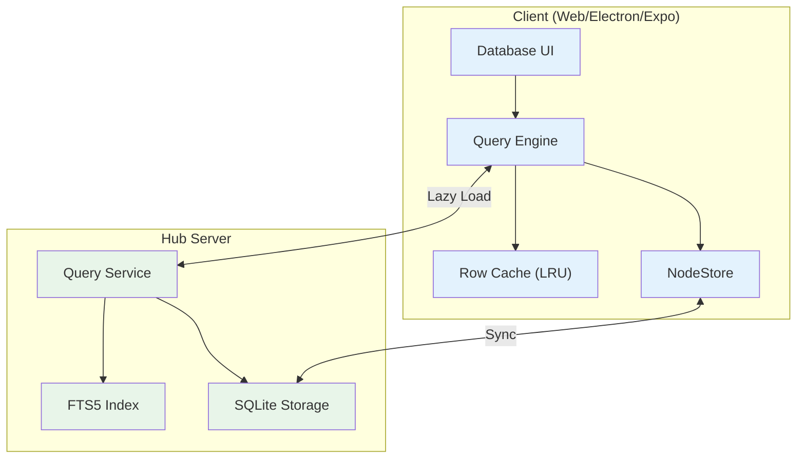
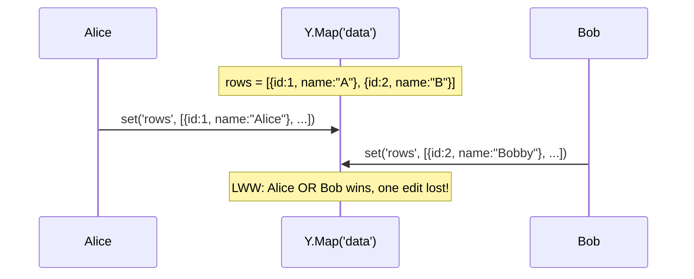
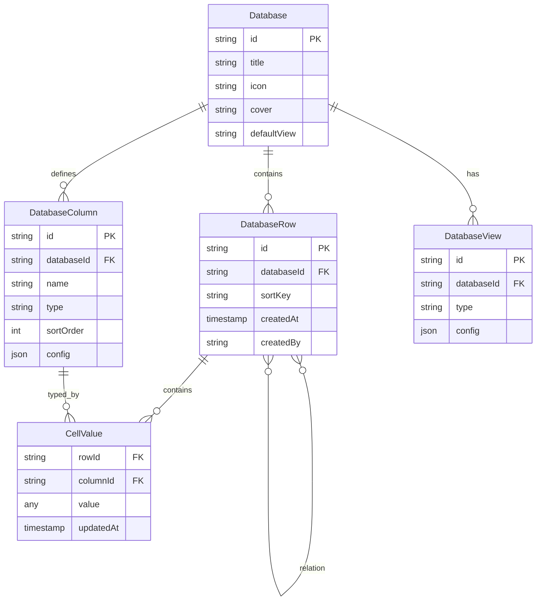
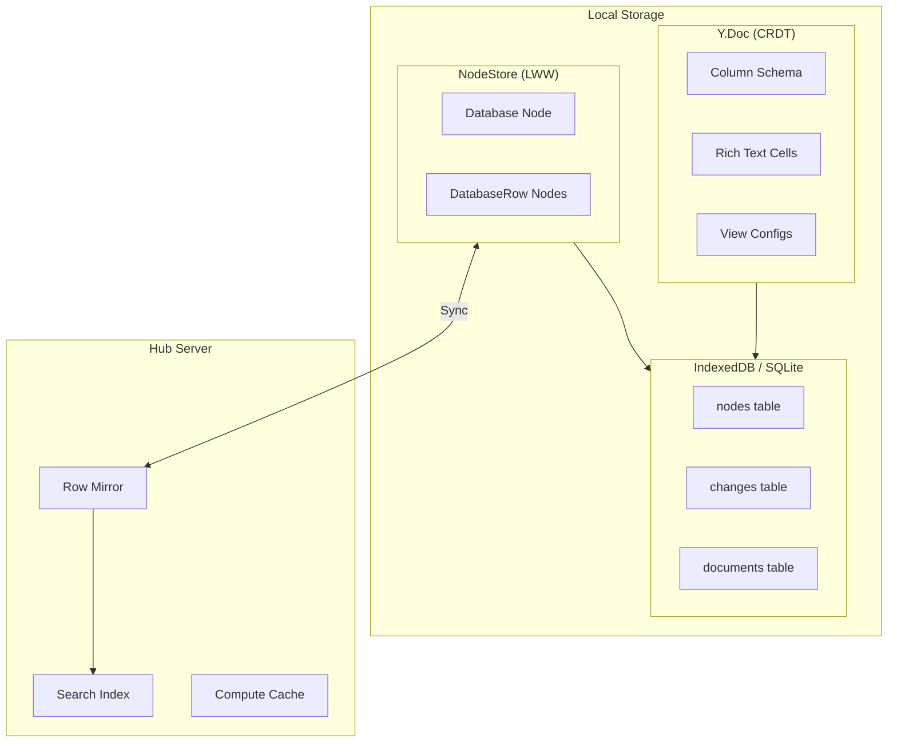
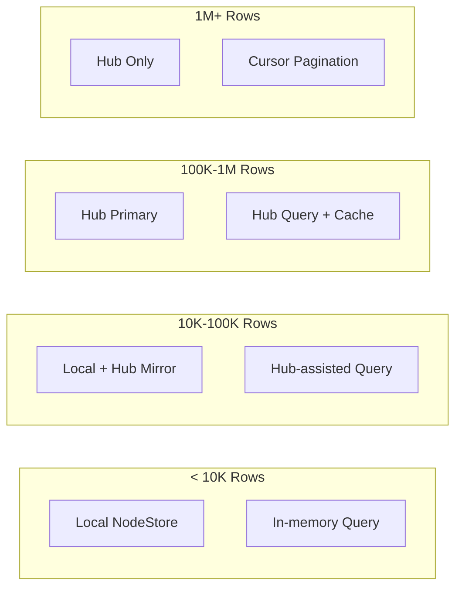
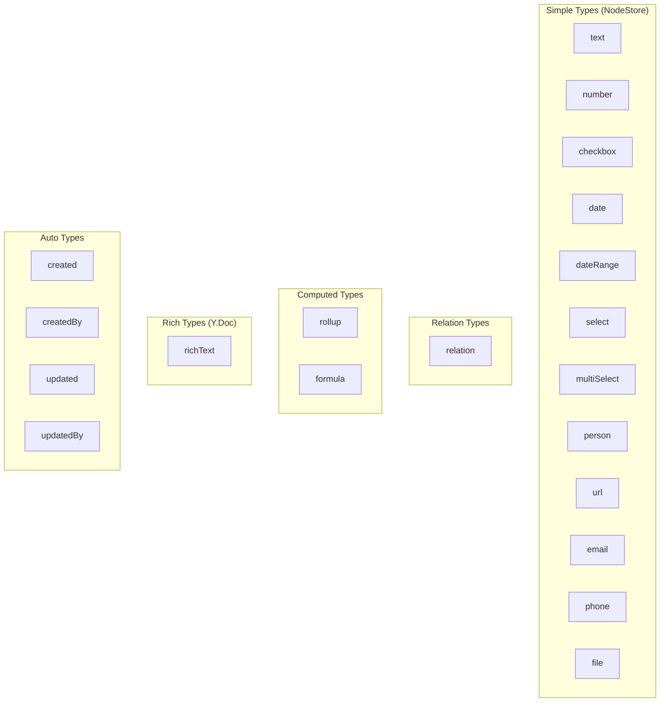

# xNet Implementation Plan - Step 03.9.3: Database Data Model V2

> High-performance database architecture for massive datasets with full Notion/Sheets feature parity

## Executive Summary

This plan implements a complete database system that:

- Supports **1M+ rows** per database with virtualized rendering and lazy loading
- Provides **full feature parity** with Notion (relations, rollups, formulas, views)
- Leverages **hub server queries** for server-side filtering, sorting, and pagination
- Enables **real-time collaboration** at the row level via Yjs CRDTs
- Implements **computed columns** (rollups, formulas) with efficient caching

The user experience we're building:

```
1. Create a database with any column types
2. Add millions of rows (virtualized, lazy-loaded)
3. Create multiple views (table, board, gallery, calendar, timeline)
4. Filter, sort, and group without loading everything
5. Link databases with relations and rollups
6. Collaborate in real-time on individual cells
7. Search across all content with full-text search
```



## Architecture Decisions

| Decision         | Choice              | Rationale                                     |
| ---------------- | ------------------- | --------------------------------------------- |
| Row storage      | Rows as Nodes       | Per-row identity, per-property LWW, queryable |
| Column storage   | Y.Doc               | CRDT ordering for column reorder              |
| Row ordering     | Fractional indexing | O(1) insert/reorder, no global array          |
| Rich text cells  | Row Y.Doc           | Character-level CRDT only when needed         |
| Large queries    | Hub-assisted        | SQL queries > 10K rows                        |
| Computed columns | Compute on read     | No stale data, cache invalidation             |
| Virtualization   | TanStack Virtual    | X+Y virtualization for massive tables         |

## Current Problems Being Solved



| Problem          | Current State           | Target State                              |
| ---------------- | ----------------------- | ----------------------------------------- |
| Cell conflicts   | Whole-array replacement | Per-cell LWW                              |
| Large datasets   | Load all in memory      | Lazy load visible rows                    |
| Server queries   | No SQL support          | Hub FTS5 + filtering                      |
| Computed columns | Not implemented         | Rollups + formulas                        |
| Views            | Basic table only        | Table, board, gallery, calendar, timeline |

## Data Model Overview



## Storage Architecture



## Storage Tiers



| Tier    | Rows     | Storage          | Query Strategy    |
| ------- | -------- | ---------------- | ----------------- |
| Small   | < 10K    | Local only       | In-memory         |
| Medium  | 10K-100K | Local + lazy hub | Hub queries       |
| Large   | 100K-1M  | Hub-primary      | Hub queries       |
| Massive | 1M+      | Hub + pagination | Cursor pagination |

## Implementation Phases

### Phase 1: Core Data Model (Weeks 1-3)

| Task | Document                                                     | Description                               |
| ---- | ------------------------------------------------------------ | ----------------------------------------- |
| 1.1  | [01-database-row-schema.md](./01-database-row-schema.md)     | DatabaseRowSchema with dynamic properties |
| 1.2  | [01-database-row-schema.md](./01-database-row-schema.md)     | Dynamic property support in NodeStore     |
| 1.3  | [02-fractional-indexing.md](./02-fractional-indexing.md)     | Fractional indexing for row ordering      |
| 1.4  | [03-column-ydoc-structure.md](./03-column-ydoc-structure.md) | Y.Doc structure for columns               |
| 1.5  | [03-column-ydoc-structure.md](./03-column-ydoc-structure.md) | View configurations in Y.Map              |
| 1.6  | [04-react-hooks.md](./04-react-hooks.md)                     | useDatabase hook with local queries       |
| 1.7  | [04-react-hooks.md](./04-react-hooks.md)                     | useDatabaseRow for single row ops         |
| 1.8  | [04-react-hooks.md](./04-react-hooks.md)                     | Basic CRUD operations                     |

**Phase 1 Validation Gate:**

- [x] DatabaseRow nodes created with per-row identity
- [x] Cell edits are per-property LWW (no whole-row conflicts)
- [x] Row reordering uses fractional indexing
- [x] Columns stored in Y.Doc with CRDT ordering
- [x] useDatabase returns paginated rows with mutations
- [x] Unit tests pass for row CRUD and ordering

### Phase 2: View System (Weeks 4-6)

| Task | Document                                             | Description                       |
| ---- | ---------------------------------------------------- | --------------------------------- |
| 2.1  | [05-view-system.md](./05-view-system.md)             | View type definitions             |
| 2.2  | [06-filter-sort-group.md](./06-filter-sort-group.md) | Filter builder with all operators |
| 2.3  | [06-filter-sort-group.md](./06-filter-sort-group.md) | Multi-column sorting              |
| 2.4  | [06-filter-sort-group.md](./06-filter-sort-group.md) | Group-by with aggregation headers |
| 2.5  | [07-virtualized-table.md](./07-virtualized-table.md) | VirtualizedTable with X+Y         |
| 2.6  | [05-view-system.md](./05-view-system.md)             | BoardView with dnd-kit            |
| 2.7  | [05-view-system.md](./05-view-system.md)             | GalleryView with grid layout      |
| 2.8  | [05-view-system.md](./05-view-system.md)             | CalendarView with month/week/day  |
| 2.9  | [05-view-system.md](./05-view-system.md)             | TimelineView with zoom            |
| 2.10 | [05-view-system.md](./05-view-system.md)             | ListView with compact rows        |

**Phase 2 Validation Gate:**

- [x] All 6 view types render correctly
- [x] Filters work for all column types
- [x] Multi-column sorting works
- [x] Group-by shows collapsible groups with aggregates
- [ ] VirtualizedTable handles 100K rows smoothly (Y-axis done, X-axis TODO)
- [x] View configs persist in Y.Doc

### Phase 3: Hub Integration (Weeks 7-9)

| Task | Document                                             | Description                 |
| ---- | ---------------------------------------------------- | --------------------------- |
| 3.1  | [08-hub-query-service.md](./08-hub-query-service.md) | DatabaseQueryService on hub |
| 3.2  | [08-hub-query-service.md](./08-hub-query-service.md) | Filter/sort SQL generation  |
| 3.3  | [09-hub-fts5-index.md](./09-hub-fts5-index.md)       | FTS5 schema and triggers    |
| 3.4  | [09-hub-fts5-index.md](./09-hub-fts5-index.md)       | Full-text search queries    |
| 3.5  | [10-query-routing.md](./10-query-routing.md)         | Query router (local vs hub) |
| 3.6  | [10-query-routing.md](./10-query-routing.md)         | Cursor pagination           |
| 3.7  | [10-query-routing.md](./10-query-routing.md)         | LRU row cache               |
| 3.8  | [08-hub-query-service.md](./08-hub-query-service.md) | Real-time subscriptions     |

**Phase 3 Validation Gate:**

- [ ] Hub executes SQL queries for large databases
- [ ] FTS5 search returns relevant results
- [ ] Query routing automatically selects local/hub
- [ ] Cursor pagination works for 1M+ rows
- [ ] LRU cache maintains memory budget
- [ ] Subscriptions push row changes in real-time

### Phase 4: Computed Columns (Weeks 10-11)

| Task | Document                                           | Description                    |
| ---- | -------------------------------------------------- | ------------------------------ |
| 4.1  | [11-rollup-columns.md](./11-rollup-columns.md)     | Rollup aggregation functions   |
| 4.2  | [11-rollup-columns.md](./11-rollup-columns.md)     | Relation traversal for rollups |
| 4.3  | [12-formula-columns.md](./12-formula-columns.md)   | Formula expression parser      |
| 4.4  | [12-formula-columns.md](./12-formula-columns.md)   | Built-in function library      |
| 4.5  | [12-formula-columns.md](./12-formula-columns.md)   | Dependency tracking            |
| 4.6  | [12-formula-columns.md](./12-formula-columns.md)   | Circular reference detection   |
| 4.7  | [13-computed-caching.md](./13-computed-caching.md) | In-memory compute cache        |
| 4.8  | [13-computed-caching.md](./13-computed-caching.md) | Cache invalidation on change   |

**Phase 4 Validation Gate:**

- [ ] Rollup aggregates (sum, avg, count, min, max, concat, unique) work
- [ ] Formulas evaluate with {{column}} references
- [ ] Circular formulas detected and reported
- [ ] Computed values cached per row+column
- [ ] Cache invalidates when dependencies change
- [ ] Hub computes rollups for large datasets

### Phase 5: Advanced Features (Weeks 12-14)

| Task | Document                                     | Description                     |
| ---- | -------------------------------------------- | ------------------------------- |
| 5.1  | [14-relation-ui.md](./14-relation-ui.md)     | Row picker modal                |
| 5.2  | [14-relation-ui.md](./14-relation-ui.md)     | Inline relation display         |
| 5.3  | [14-relation-ui.md](./14-relation-ui.md)     | Reverse relation view           |
| 5.4  | [15-import-export.md](./15-import-export.md) | CSV import with column mapping  |
| 5.5  | [15-import-export.md](./15-import-export.md) | CSV export with all views       |
| 5.6  | [15-import-export.md](./15-import-export.md) | JSON export/import              |
| 5.7  | [16-templates.md](./16-templates.md)         | Pre-built database templates    |
| 5.8  | [16-templates.md](./16-templates.md)         | Template creation from existing |

**Phase 5 Validation Gate:**

- [ ] Relations linkable via picker modal
- [ ] Reverse relations show backlinks
- [ ] CSV import maps columns correctly
- [ ] CSV/JSON export includes all data
- [ ] Templates create pre-configured databases
- [ ] Custom templates saveable

## Feature Parity Matrix

| Feature                                | Notion          | Google Sheets | xNet Target |
| -------------------------------------- | --------------- | ------------- | ----------- |
| Basic types (text, number, date, etc.) | Yes             | Yes           | Yes         |
| Select / Multi-select                  | Yes             | Yes           | Yes         |
| Relations between databases            | Yes             | Limited       | Yes         |
| Rollup (aggregate related rows)        | Yes             | No            | Yes         |
| Formula (computed values)              | Yes             | Yes           | Yes         |
| Views (table, board, gallery, etc.)    | Yes             | Limited       | Yes         |
| Filters                                | Yes             | Yes           | Yes         |
| Sorts                                  | Yes             | Yes           | Yes         |
| Groups                                 | Yes             | Yes           | Yes         |
| Real-time collaboration                | Yes             | Yes           | Yes         |
| Row-level permissions                  | No              | Yes           | Future      |
| 1M+ rows                               | No (~10K limit) | Yes           | Yes         |

## Column Types



## Performance Budget

| Component      | Small DB | Medium DB | Large DB    |
| -------------- | -------- | --------- | ----------- |
| Row cache      | All rows | 10K rows  | 1K rows     |
| Computed cache | All      | LRU 10K   | LRU 1K      |
| Y.Doc          | Full     | Full      | Schema only |

| Operation      | Cost   | At 5 ops/sec | Notes            |
| -------------- | ------ | ------------ | ---------------- |
| Local query    | ~1ms   | 5ms/sec      | In-memory filter |
| Hub query      | ~50ms  | N/A          | Network + SQL    |
| Rollup compute | ~10ms  | 50ms/sec     | Per visible row  |
| Formula eval   | ~0.1ms | 0.5ms/sec    | Per cell         |

## Affected Packages

| Package         | Changes                                             |
| --------------- | --------------------------------------------------- |
| `@xnet/data`    | DatabaseRowSchema, dynamic properties, column types |
| `@xnet/sync`    | Row-level Y.Doc sync for rich text cells            |
| `@xnet/react`   | useDatabase, useDatabaseRow hooks, view components  |
| `@xnet/hub`     | DatabaseQueryService, FTS5 index, subscriptions     |
| `apps/electron` | Database UI integration                             |

## Dependencies

| Dependency                | Package     | Purpose                  |
| ------------------------- | ----------- | ------------------------ |
| `@tanstack/react-virtual` | @xnet/react | X+Y virtualization       |
| `@dnd-kit/core`           | @xnet/react | Board view drag-and-drop |
| `fractional-indexing`     | @xnet/data  | Row ordering             |
| `date-fns`                | @xnet/react | Calendar view            |

## Success Criteria

1. **1M row support** — Database with 1M rows renders smoothly
2. **Per-cell conflict resolution** — Concurrent edits to different cells merge
3. **View flexibility** — All 6 view types work with same data
4. **Fast queries** — Complex filters execute in <100ms
5. **Full-text search** — Find any text across all cells
6. **Rollup accuracy** — Aggregations match expected values
7. **Formula power** — Common formulas (IF, SUM, etc.) work
8. **Real-time sync** — Changes appear on other devices <1s
9. **Offline support** — Full functionality without network
10. **Memory efficiency** — 100K row DB uses <100MB RAM

## Risk Mitigation

| Risk                        | Mitigation                                       |
| --------------------------- | ------------------------------------------------ |
| Fractional index collisions | Use large alphabet, regenerate on collision      |
| Rollup performance          | Batch computation, hub-side for large DBs        |
| Formula complexity          | Limit recursion depth, timeout long formulas     |
| Hub query load              | Rate limiting, query caching, index optimization |
| Yjs doc size                | Rich text cells only, not all cells              |
| Migration from old model    | Gradual migration, backward compatibility        |

## Timeline Summary

| Phase             | Duration | Milestone                              |
| ----------------- | -------- | -------------------------------------- |
| Core Data Model   | 3 weeks  | Rows as nodes, CRUD working            |
| View System       | 3 weeks  | All views, filter/sort/group           |
| Hub Integration   | 3 weeks  | Server queries, FTS, subscriptions     |
| Computed Columns  | 2 weeks  | Rollups, formulas, caching             |
| Advanced Features | 3 weeks  | Relations UI, import/export, templates |

**Total: ~14 weeks (3.5 months)**

## Open Questions

1. **SQLite-WASM adoption**: Should we use SQLite-WASM on web for all databases, or only large ones?

2. **Computed column caching**: Should computed values be cached in the hub or client-side?

3. **Offline support**: How do we handle large database queries when offline?

4. **Collaboration on rows**: Should row edits use Y.Doc or NodeStore? What about concurrent cell edits?

5. **Schema evolution**: How do we handle column type changes (e.g., text -> number)?

## Reference Documents

- [Database Data Model V2 Exploration](../../explorations/0067_DATABASE_DATA_MODEL_V2.md) — Original design document
- [Database Data Model V1](../../explorations/0041_DATABASE_DATA_MODEL.md) — Previous exploration
- [Off-Main-Thread Architecture](../../explorations/0043_OFF_MAIN_THREAD_ARCHITECTURE.md) — Worker thread design
- [Hub Phase 1 Plan](../plan03_8HubPhase1VPS/README.md) — Hub implementation context
- [TanStack Virtual](https://tanstack.com/virtual/latest) — Virtualization library
- [Fractional Indexing](https://www.figma.com/blog/realtime-editing-of-ordered-sequences/) — Figma's approach
- [Notion Data Model](https://www.notion.so/blog/data-model-behind-notion) — Inspiration

---

[Back to Main Plan](../plan00Setup/README.md) | [Start Implementation ->](./01-database-row-schema.md)
