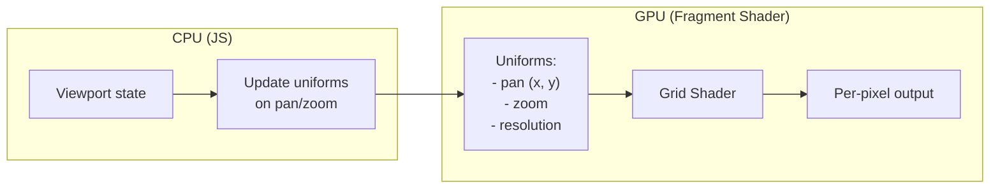

# 01: WebGL Grid Layer

> Procedural infinite grid via WebGL fragment shader - zero allocations at any scale

**Duration:** 3-4 days
**Dependencies:** None (new layer)
**Package:** `@xnet/canvas`

## Overview

The background grid is rendered using a WebGL fragment shader that procedurally generates grid lines. This approach has zero memory allocation regardless of canvas size or zoom level - the grid is computed per-pixel in the GPU.

The grid adapts to zoom level: at high zoom, you see fine grid lines; at low zoom, only major grid lines are visible. This provides scale reference without visual clutter.



## Implementation

### WebGL Context Setup

```typescript
// packages/canvas/src/layers/webgl-grid.ts

interface WebGLGridConfig {
  gridColor: [number, number, number, number] // RGBA 0-1
  majorGridColor: [number, number, number, number]
  gridSpacing: number // Canvas units
  majorEvery: number // Major line every N minor lines
}

const DEFAULT_CONFIG: WebGLGridConfig = {
  gridColor: [0.5, 0.5, 0.5, 0.15],
  majorGridColor: [0.5, 0.5, 0.5, 0.3],
  gridSpacing: 20,
  majorEvery: 5
}

export class WebGLGridLayer {
  private canvas: HTMLCanvasElement
  private gl: WebGLRenderingContext
  private program: WebGLProgram
  private uniforms: {
    resolution: WebGLUniformLocation
    pan: WebGLUniformLocation
    zoom: WebGLUniformLocation
    gridColor: WebGLUniformLocation
    majorGridColor: WebGLUniformLocation
    gridSpacing: WebGLUniformLocation
    majorEvery: WebGLUniformLocation
  }

  constructor(container: HTMLElement, config: Partial<WebGLGridConfig> = {}) {
    this.canvas = document.createElement('canvas')
    this.canvas.style.cssText = `
      position: absolute;
      top: 0;
      left: 0;
      width: 100%;
      height: 100%;
      pointer-events: none;
    `
    container.appendChild(this.canvas)

    const gl = this.canvas.getContext('webgl', {
      alpha: true,
      antialias: false,
      depth: false,
      stencil: false,
      premultipliedAlpha: true
    })

    if (!gl) {
      throw new Error('WebGL not supported')
    }

    this.gl = gl
    this.program = this.createProgram()
    this.uniforms = this.getUniformLocations()
    this.setConfig({ ...DEFAULT_CONFIG, ...config })
  }

  private createProgram(): WebGLProgram {
    const vertexShader = this.compileShader(this.gl.VERTEX_SHADER, VERTEX_SHADER)
    const fragmentShader = this.compileShader(this.gl.FRAGMENT_SHADER, FRAGMENT_SHADER)

    const program = this.gl.createProgram()!
    this.gl.attachShader(program, vertexShader)
    this.gl.attachShader(program, fragmentShader)
    this.gl.linkProgram(program)

    if (!this.gl.getProgramParameter(program, this.gl.LINK_STATUS)) {
      throw new Error('Shader program failed to link')
    }

    // Set up full-screen quad
    const positions = new Float32Array([-1, -1, 1, -1, -1, 1, 1, 1])
    const buffer = this.gl.createBuffer()
    this.gl.bindBuffer(this.gl.ARRAY_BUFFER, buffer)
    this.gl.bufferData(this.gl.ARRAY_BUFFER, positions, this.gl.STATIC_DRAW)

    const positionLocation = this.gl.getAttribLocation(program, 'a_position')
    this.gl.enableVertexAttribArray(positionLocation)
    this.gl.vertexAttribPointer(positionLocation, 2, this.gl.FLOAT, false, 0, 0)

    return program
  }

  private compileShader(type: number, source: string): WebGLShader {
    const shader = this.gl.createShader(type)!
    this.gl.shaderSource(shader, source)
    this.gl.compileShader(shader)

    if (!this.gl.getShaderParameter(shader, this.gl.COMPILE_STATUS)) {
      const error = this.gl.getShaderInfoLog(shader)
      throw new Error(`Shader compilation failed: ${error}`)
    }

    return shader
  }

  private getUniformLocations() {
    const gl = this.gl
    const program = this.program

    return {
      resolution: gl.getUniformLocation(program, 'u_resolution')!,
      pan: gl.getUniformLocation(program, 'u_pan')!,
      zoom: gl.getUniformLocation(program, 'u_zoom')!,
      gridColor: gl.getUniformLocation(program, 'u_gridColor')!,
      majorGridColor: gl.getUniformLocation(program, 'u_majorGridColor')!,
      gridSpacing: gl.getUniformLocation(program, 'u_gridSpacing')!,
      majorEvery: gl.getUniformLocation(program, 'u_majorEvery')!
    }
  }

  setConfig(config: WebGLGridConfig): void {
    const gl = this.gl
    gl.useProgram(this.program)
    gl.uniform4fv(this.uniforms.gridColor, config.gridColor)
    gl.uniform4fv(this.uniforms.majorGridColor, config.majorGridColor)
    gl.uniform1f(this.uniforms.gridSpacing, config.gridSpacing)
    gl.uniform1f(this.uniforms.majorEvery, config.majorEvery)
  }

  resize(): void {
    const dpr = window.devicePixelRatio || 1
    const rect = this.canvas.getBoundingClientRect()
    this.canvas.width = rect.width * dpr
    this.canvas.height = rect.height * dpr
    this.gl.viewport(0, 0, this.canvas.width, this.canvas.height)
  }

  render(viewport: { x: number; y: number; zoom: number }): void {
    const gl = this.gl

    gl.useProgram(this.program)
    gl.uniform2f(this.uniforms.resolution, this.canvas.width, this.canvas.height)
    gl.uniform2f(this.uniforms.pan, viewport.x, viewport.y)
    gl.uniform1f(this.uniforms.zoom, viewport.zoom)

    gl.clear(gl.COLOR_BUFFER_BIT)
    gl.drawArrays(gl.TRIANGLE_STRIP, 0, 4)
  }

  destroy(): void {
    this.canvas.remove()
    this.gl.deleteProgram(this.program)
  }
}
```

### Fragment Shader

```typescript
const VERTEX_SHADER = `
  attribute vec2 a_position;
  void main() {
    gl_Position = vec4(a_position, 0.0, 1.0);
  }
`

const FRAGMENT_SHADER = `
  precision highp float;

  uniform vec2 u_resolution;
  uniform vec2 u_pan;
  uniform float u_zoom;
  uniform vec4 u_gridColor;
  uniform vec4 u_majorGridColor;
  uniform float u_gridSpacing;
  uniform float u_majorEvery;

  void main() {
    // Transform screen coordinates to canvas coordinates
    vec2 screenPos = gl_FragCoord.xy;
    vec2 canvasPos = (screenPos - u_resolution * 0.5) / u_zoom + u_pan;

    // Calculate grid lines with adaptive spacing
    float effectiveSpacing = u_gridSpacing;

    // At very low zoom, increase spacing to avoid visual noise
    if (u_zoom < 0.5) {
      effectiveSpacing = u_gridSpacing * u_majorEvery;
    }

    // Grid line calculation
    vec2 grid = abs(fract(canvasPos / effectiveSpacing - 0.5) - 0.5);
    vec2 majorGrid = abs(fract(canvasPos / (effectiveSpacing * u_majorEvery) - 0.5) - 0.5);

    // Anti-aliased lines (consistent 1px width regardless of zoom)
    float lineWidth = 1.0 / u_zoom;
    float minorLine = min(
      smoothstep(lineWidth, 0.0, grid.x * effectiveSpacing),
      smoothstep(lineWidth, 0.0, grid.y * effectiveSpacing)
    );
    float majorLine = min(
      smoothstep(lineWidth * 1.5, 0.0, majorGrid.x * effectiveSpacing * u_majorEvery),
      smoothstep(lineWidth * 1.5, 0.0, majorGrid.y * effectiveSpacing * u_majorEvery)
    );

    // Fade out minor grid at low zoom
    float minorAlpha = smoothstep(0.3, 0.6, u_zoom);

    // Composite colors
    vec4 color = vec4(0.0);
    color = mix(color, u_gridColor * vec4(1.0, 1.0, 1.0, minorAlpha), minorLine);
    color = mix(color, u_majorGridColor, majorLine);

    // Origin axes (thicker, distinct color)
    float axisWidth = 2.0 / u_zoom;
    float xAxis = smoothstep(axisWidth, 0.0, abs(canvasPos.y));
    float yAxis = smoothstep(axisWidth, 0.0, abs(canvasPos.x));
    vec4 axisColor = vec4(0.4, 0.4, 0.8, 0.5);
    color = mix(color, axisColor, max(xAxis, yAxis));

    gl_FragColor = color;
  }
`
```

### Dot Grid Alternative

```typescript
const DOT_GRID_FRAGMENT_SHADER = `
  precision highp float;

  uniform vec2 u_resolution;
  uniform vec2 u_pan;
  uniform float u_zoom;
  uniform vec4 u_gridColor;
  uniform float u_gridSpacing;

  void main() {
    vec2 screenPos = gl_FragCoord.xy;
    vec2 canvasPos = (screenPos - u_resolution * 0.5) / u_zoom + u_pan;

    // Snap to grid intersection
    vec2 gridPos = floor(canvasPos / u_gridSpacing + 0.5) * u_gridSpacing;
    float dist = distance(canvasPos, gridPos);

    // Dot radius (consistent screen size)
    float radius = 1.5 / u_zoom;
    float dot = 1.0 - smoothstep(radius - 0.5 / u_zoom, radius, dist);

    // Fade at low zoom
    float alpha = smoothstep(0.2, 0.5, u_zoom);

    gl_FragColor = u_gridColor * vec4(1.0, 1.0, 1.0, dot * alpha);
  }
`
```

### Integration with Canvas

```typescript
// packages/canvas/src/canvas.tsx

import { WebGLGridLayer } from './layers/webgl-grid'

interface CanvasProps {
  gridType?: 'lines' | 'dots' | 'none'
  gridSpacing?: number
}

export function Canvas({ gridType = 'lines', gridSpacing = 20 }: CanvasProps) {
  const containerRef = useRef<HTMLDivElement>(null)
  const gridLayerRef = useRef<WebGLGridLayer | null>(null)
  const viewport = useViewport()

  // Initialize grid layer
  useEffect(() => {
    if (!containerRef.current || gridType === 'none') return

    gridLayerRef.current = new WebGLGridLayer(containerRef.current, {
      gridSpacing,
      gridColor: gridType === 'dots' ? [0.3, 0.3, 0.3, 0.8] : [0.5, 0.5, 0.5, 0.15]
    })

    const handleResize = () => gridLayerRef.current?.resize()
    window.addEventListener('resize', handleResize)
    handleResize()

    return () => {
      window.removeEventListener('resize', handleResize)
      gridLayerRef.current?.destroy()
    }
  }, [gridType, gridSpacing])

  // Render grid on viewport change
  useEffect(() => {
    gridLayerRef.current?.render(viewport)
  }, [viewport.x, viewport.y, viewport.zoom])

  return (
    <div ref={containerRef} className="canvas-container">
      {/* Grid layer is added as first child */}
      {/* Other layers follow */}
    </div>
  )
}
```

### Fallback for No WebGL

```typescript
// packages/canvas/src/layers/css-grid-fallback.ts

export class CSSGridFallback {
  private element: HTMLDivElement

  constructor(container: HTMLElement, config: { gridSpacing: number }) {
    this.element = document.createElement('div')
    this.element.style.cssText = `
      position: absolute;
      top: 0;
      left: 0;
      width: 100%;
      height: 100%;
      pointer-events: none;
      background-image: 
        linear-gradient(rgba(0,0,0,0.05) 1px, transparent 1px),
        linear-gradient(90deg, rgba(0,0,0,0.05) 1px, transparent 1px);
      background-size: ${config.gridSpacing}px ${config.gridSpacing}px;
    `
    container.appendChild(this.element)
  }

  render(viewport: { x: number; y: number; zoom: number }): void {
    const offsetX = -viewport.x * viewport.zoom
    const offsetY = -viewport.y * viewport.zoom
    this.element.style.backgroundPosition = `${offsetX}px ${offsetY}px`
    this.element.style.backgroundSize = `
      ${20 * viewport.zoom}px ${20 * viewport.zoom}px
    `
  }

  destroy(): void {
    this.element.remove()
  }
}

// Factory function with fallback
export function createGridLayer(
  container: HTMLElement,
  config: WebGLGridConfig
): WebGLGridLayer | CSSGridFallback {
  try {
    return new WebGLGridLayer(container, config)
  } catch {
    console.warn('WebGL not available, falling back to CSS grid')
    return new CSSGridFallback(container, config)
  }
}
```

## Testing

```typescript
describe('WebGLGridLayer', () => {
  it('creates WebGL context', () => {
    const container = document.createElement('div')
    document.body.appendChild(container)

    const grid = new WebGLGridLayer(container)
    expect(grid).toBeDefined()

    grid.destroy()
    container.remove()
  })

  it('renders without errors', () => {
    const container = document.createElement('div')
    container.style.width = '800px'
    container.style.height = '600px'
    document.body.appendChild(container)

    const grid = new WebGLGridLayer(container)
    grid.resize()

    expect(() => {
      grid.render({ x: 0, y: 0, zoom: 1 })
      grid.render({ x: 100, y: 100, zoom: 0.5 })
      grid.render({ x: -500, y: -500, zoom: 2 })
    }).not.toThrow()

    grid.destroy()
    container.remove()
  })

  it('handles resize', () => {
    const container = document.createElement('div')
    container.style.width = '800px'
    container.style.height = '600px'
    document.body.appendChild(container)

    const grid = new WebGLGridLayer(container)
    grid.resize()

    // Change size
    container.style.width = '1200px'
    container.style.height = '900px'

    expect(() => grid.resize()).not.toThrow()

    grid.destroy()
    container.remove()
  })

  it('falls back to CSS when WebGL unavailable', () => {
    // Mock no WebGL support
    const originalGetContext = HTMLCanvasElement.prototype.getContext
    HTMLCanvasElement.prototype.getContext = () => null

    const container = document.createElement('div')
    document.body.appendChild(container)

    const layer = createGridLayer(container, DEFAULT_CONFIG)
    expect(layer).toBeInstanceOf(CSSGridFallback)

    layer.destroy()
    container.remove()

    HTMLCanvasElement.prototype.getContext = originalGetContext
  })
})
```

## Performance Considerations

1. **Uniforms on change only**: Only update uniforms when viewport actually changes
2. **requestAnimationFrame**: Batch renders with the main render loop
3. **No allocations**: Shader runs entirely on GPU with fixed uniforms
4. **Alpha blending**: Use premultiplied alpha for correct compositing

## Validation Gate

- [x] WebGL grid renders at 60fps at zoom 0.1 to 4.0
- [x] Grid lines are anti-aliased and crisp
- [x] Major grid lines visible at all zoom levels
- [x] Minor grid lines fade out at low zoom
- [x] Origin axes visible and distinct
- [x] CSS fallback works when WebGL unavailable
- [x] No memory growth over time (check with DevTools)
- [x] Dot grid variant works as alternative

---

[Back to README](./README.md) | [Next: Canvas 2D Edge Layer ->](./02-canvas2d-edge-layer.md)
