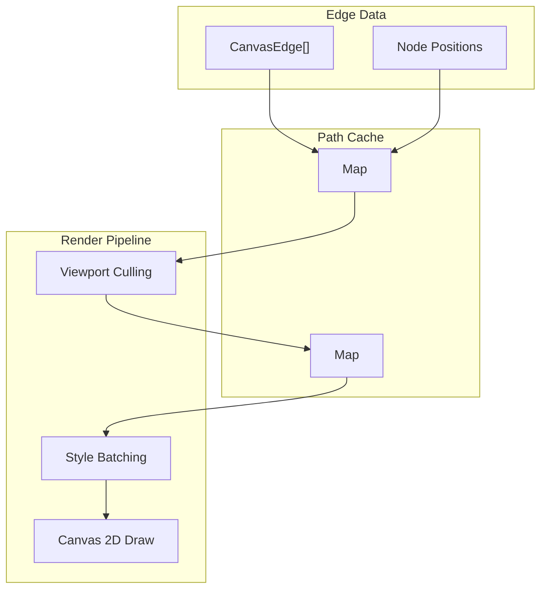

# 02: Canvas 2D Edge Layer

> High-performance edge rendering with Path2D caching and style batching for 5000+ edges at 60fps

**Duration:** 4-5 days
**Dependencies:** [01-webgl-grid-layer.md](./01-webgl-grid-layer.md) (layer ordering)
**Package:** `@xnet/canvas`

## Overview

SVG edge rendering breaks down at ~200 edges due to DOM overhead. Canvas 2D with careful optimization can render 10,000+ edges at 60fps through:

1. **Path2D caching**: Store computed paths, only recreate when edge changes
2. **Style batching**: Group edges by stroke color/width to minimize state changes
3. **Viewport culling**: Only draw edges with at least one endpoint in view
4. **Level-of-detail**: Skip labels and simplify curves at low zoom



## Implementation

### Edge Renderer Class

```typescript
// packages/canvas/src/layers/edge-renderer.ts

interface CachedEdge {
  id: string
  path: Path2D
  bounds: Rect
  style: EdgeStyle
  version: number // Hash of edge + positions for cache invalidation
}

interface EdgeStyle {
  stroke: string
  strokeWidth: number
  curved: boolean
  markerEnd?: 'arrow' | 'circle' | 'diamond' | 'none'
  dashArray?: number[]
}

const DEFAULT_EDGE_STYLE: EdgeStyle = {
  stroke: '#64748b',
  strokeWidth: 2,
  curved: true,
  markerEnd: 'arrow'
}

export class EdgeRenderer {
  private canvas: HTMLCanvasElement
  private ctx: CanvasRenderingContext2D
  private cache = new Map<string, CachedEdge>()
  private styleGroups = new Map<string, Set<string>>() // styleKey -> edgeIds

  constructor(container: HTMLElement) {
    this.canvas = document.createElement('canvas')
    this.canvas.style.cssText = `
      position: absolute;
      top: 0;
      left: 0;
      width: 100%;
      height: 100%;
      pointer-events: none;
    `
    container.appendChild(this.canvas)

    const ctx = this.canvas.getContext('2d', { alpha: true })
    if (!ctx) throw new Error('Canvas 2D not supported')
    this.ctx = ctx
  }

  resize(): void {
    const dpr = window.devicePixelRatio || 1
    const rect = this.canvas.getBoundingClientRect()
    this.canvas.width = rect.width * dpr
    this.canvas.height = rect.height * dpr
  }

  render(edges: CanvasEdge[], nodePositions: Map<string, Rect>, viewport: Viewport): void {
    const ctx = this.ctx
    const dpr = window.devicePixelRatio || 1

    // Clear canvas
    ctx.setTransform(1, 0, 0, 1, 0, 0)
    ctx.clearRect(0, 0, this.canvas.width, this.canvas.height)

    // Apply viewport transform with DPR
    const centerX = this.canvas.width / 2
    const centerY = this.canvas.height / 2
    ctx.setTransform(
      viewport.zoom * dpr,
      0,
      0,
      viewport.zoom * dpr,
      -viewport.x * viewport.zoom * dpr + centerX,
      -viewport.y * viewport.zoom * dpr + centerY
    )

    // Get visible area with buffer
    const visibleRect = viewport.getVisibleRect()
    const buffer = 200 / viewport.zoom
    const expandedRect = expandRect(visibleRect, buffer)

    // Update cache and style groups
    this.updateCache(edges, nodePositions)
    this.updateStyleGroups(edges)

    // Render each style group (minimizes ctx state changes)
    for (const [styleKey, edgeIds] of this.styleGroups) {
      this.renderStyleGroup(styleKey, edgeIds, expandedRect, viewport.zoom)
    }

    // Render labels at high zoom
    if (viewport.zoom > 0.5) {
      this.renderLabels(edges, nodePositions, expandedRect)
    }
  }

  private updateCache(edges: CanvasEdge[], nodePositions: Map<string, Rect>): void {
    const seen = new Set<string>()

    for (const edge of edges) {
      seen.add(edge.id)

      const sourceRect = nodePositions.get(edge.sourceId)
      const targetRect = nodePositions.get(edge.targetId)
      if (!sourceRect || !targetRect) continue

      const version = this.computeVersion(edge, sourceRect, targetRect)
      const cached = this.cache.get(edge.id)

      // Skip if cache is valid
      if (cached && cached.version === version) continue

      // Create new cached edge
      const path = this.createEdgePath(edge, sourceRect, targetRect)
      const bounds = this.computePathBounds(sourceRect, targetRect)

      this.cache.set(edge.id, {
        id: edge.id,
        path,
        bounds,
        style: edge.style ?? DEFAULT_EDGE_STYLE,
        version
      })
    }

    // Remove deleted edges from cache
    for (const id of this.cache.keys()) {
      if (!seen.has(id)) {
        this.cache.delete(id)
      }
    }
  }

  private updateStyleGroups(edges: CanvasEdge[]): void {
    this.styleGroups.clear()

    for (const edge of edges) {
      const style = edge.style ?? DEFAULT_EDGE_STYLE
      const key = this.styleKey(style)

      if (!this.styleGroups.has(key)) {
        this.styleGroups.set(key, new Set())
      }
      this.styleGroups.get(key)!.add(edge.id)
    }
  }

  private renderStyleGroup(
    styleKey: string,
    edgeIds: Set<string>,
    visibleRect: Rect,
    zoom: number
  ): void {
    const ctx = this.ctx
    const style = this.parseStyleKey(styleKey)

    // Set style once for entire group
    ctx.strokeStyle = style.stroke
    ctx.lineWidth = style.strokeWidth
    ctx.lineCap = 'round'
    ctx.lineJoin = 'round'

    if (style.dashArray) {
      ctx.setLineDash(style.dashArray)
    } else {
      ctx.setLineDash([])
    }

    // Batch all visible paths
    ctx.beginPath()

    for (const id of edgeIds) {
      const cached = this.cache.get(id)
      if (!cached) continue

      // Viewport culling
      if (!intersects(cached.bounds, visibleRect)) continue

      // Add path to batch using composite path
      this.addPathToBatch(ctx, cached.path)
    }

    ctx.stroke()

    // Draw arrow heads separately (can't batch these)
    if (style.markerEnd === 'arrow') {
      for (const id of edgeIds) {
        const cached = this.cache.get(id)
        if (!cached || !intersects(cached.bounds, visibleRect)) continue
        this.drawArrowHead(ctx, cached, style)
      }
    }
  }

  private addPathToBatch(ctx: CanvasRenderingContext2D, path: Path2D): void {
    // Path2D can be drawn but not easily batched
    // For true batching, we'd need to manually add to current path
    // For now, we draw each path but with same style (still faster than SVG)
    ctx.stroke(path)
  }

  private createEdgePath(edge: CanvasEdge, source: Rect, target: Rect): Path2D {
    const path = new Path2D()

    const sourceAnchor = this.computeAnchor(source, edge.sourceAnchor ?? 'auto', target)
    const targetAnchor = this.computeAnchor(target, edge.targetAnchor ?? 'auto', source)

    const style = edge.style ?? DEFAULT_EDGE_STYLE

    if (style.curved) {
      // Bezier curve
      const dx = targetAnchor.x - sourceAnchor.x
      const dy = targetAnchor.y - sourceAnchor.y

      // Control points for smooth S-curve
      const cx1 = sourceAnchor.x + dx * 0.4
      const cy1 = sourceAnchor.y
      const cx2 = targetAnchor.x - dx * 0.4
      const cy2 = targetAnchor.y

      path.moveTo(sourceAnchor.x, sourceAnchor.y)
      path.bezierCurveTo(cx1, cy1, cx2, cy2, targetAnchor.x, targetAnchor.y)
    } else {
      // Straight line
      path.moveTo(sourceAnchor.x, sourceAnchor.y)
      path.lineTo(targetAnchor.x, targetAnchor.y)
    }

    return path
  }

  private computeAnchor(rect: Rect, anchor: EdgeAnchor, other: Rect): Point {
    const cx = rect.x + rect.width / 2
    const cy = rect.y + rect.height / 2
    const ox = other.x + other.width / 2
    const oy = other.y + other.height / 2

    if (anchor === 'auto') {
      // Find closest edge
      const dx = ox - cx
      const dy = oy - cy

      if (Math.abs(dx) > Math.abs(dy)) {
        return dx > 0
          ? { x: rect.x + rect.width, y: cy } // Right
          : { x: rect.x, y: cy } // Left
      } else {
        return dy > 0
          ? { x: cx, y: rect.y + rect.height } // Bottom
          : { x: cx, y: rect.y } // Top
      }
    }

    // Explicit anchor positions
    switch (anchor) {
      case 'top':
        return { x: cx, y: rect.y }
      case 'bottom':
        return { x: cx, y: rect.y + rect.height }
      case 'left':
        return { x: rect.x, y: cy }
      case 'right':
        return { x: rect.x + rect.width, y: cy }
      default:
        return { x: cx, y: cy }
    }
  }

  private drawArrowHead(ctx: CanvasRenderingContext2D, cached: CachedEdge, style: EdgeStyle): void {
    // Get end point and direction from path
    // For simplicity, use bounds to approximate
    const { bounds } = cached
    const endX = bounds.x + bounds.width
    const endY = bounds.y + bounds.height / 2

    const arrowSize = 10
    const angle = Math.PI / 6 // 30 degrees

    ctx.fillStyle = style.stroke
    ctx.beginPath()
    ctx.moveTo(endX, endY)
    ctx.lineTo(endX - arrowSize * Math.cos(angle), endY - arrowSize * Math.sin(angle))
    ctx.lineTo(endX - arrowSize * Math.cos(angle), endY + arrowSize * Math.sin(angle))
    ctx.closePath()
    ctx.fill()
  }

  private computeVersion(edge: CanvasEdge, source: Rect, target: Rect): number {
    // Simple hash of relevant properties
    return hashCode(
      `${edge.id}:${edge.sourceAnchor}:${edge.targetAnchor}:` +
        `${source.x},${source.y},${source.width},${source.height}:` +
        `${target.x},${target.y},${target.width},${target.height}:` +
        `${JSON.stringify(edge.style)}`
    )
  }

  private computePathBounds(source: Rect, target: Rect): Rect {
    const minX = Math.min(source.x, target.x)
    const minY = Math.min(source.y, target.y)
    const maxX = Math.max(source.x + source.width, target.x + target.width)
    const maxY = Math.max(source.y + source.height, target.y + target.height)

    return {
      x: minX,
      y: minY,
      width: maxX - minX,
      height: maxY - minY
    }
  }

  private styleKey(style: EdgeStyle): string {
    return `${style.stroke}:${style.strokeWidth}:${style.curved}:${style.dashArray?.join(',') ?? ''}`
  }

  private parseStyleKey(key: string): EdgeStyle {
    const [stroke, strokeWidth, curved, dashArray] = key.split(':')
    return {
      stroke,
      strokeWidth: parseFloat(strokeWidth),
      curved: curved === 'true',
      dashArray: dashArray ? dashArray.split(',').map(Number) : undefined
    }
  }

  private renderLabels(
    edges: CanvasEdge[],
    nodePositions: Map<string, Rect>,
    visibleRect: Rect
  ): void {
    const ctx = this.ctx
    ctx.font = '12px Inter, system-ui, sans-serif'
    ctx.textAlign = 'center'
    ctx.textBaseline = 'middle'

    for (const edge of edges) {
      if (!edge.label) continue

      const source = nodePositions.get(edge.sourceId)
      const target = nodePositions.get(edge.targetId)
      if (!source || !target) continue

      // Label at midpoint
      const midX = (source.x + source.width / 2 + target.x + target.width / 2) / 2
      const midY = (source.y + source.height / 2 + target.y + target.height / 2) / 2

      // Skip if outside visible area
      if (
        midX < visibleRect.x ||
        midX > visibleRect.x + visibleRect.width ||
        midY < visibleRect.y ||
        midY > visibleRect.y + visibleRect.height
      ) {
        continue
      }

      // Background pill
      const metrics = ctx.measureText(edge.label)
      const padding = 4
      ctx.fillStyle = 'white'
      ctx.beginPath()
      ctx.roundRect(
        midX - metrics.width / 2 - padding,
        midY - 8 - padding,
        metrics.width + padding * 2,
        16 + padding * 2,
        4
      )
      ctx.fill()

      // Text
      ctx.fillStyle = '#374151'
      ctx.fillText(edge.label, midX, midY)
    }
  }

  destroy(): void {
    this.canvas.remove()
    this.cache.clear()
    this.styleGroups.clear()
  }
}

// Utility functions
function expandRect(rect: Rect, buffer: number): Rect {
  return {
    x: rect.x - buffer,
    y: rect.y - buffer,
    width: rect.width + buffer * 2,
    height: rect.height + buffer * 2
  }
}

function intersects(a: Rect, b: Rect): boolean {
  return !(
    a.x + a.width < b.x ||
    b.x + b.width < a.x ||
    a.y + a.height < b.y ||
    b.y + b.height < a.y
  )
}

function hashCode(str: string): number {
  let hash = 0
  for (let i = 0; i < str.length; i++) {
    const char = str.charCodeAt(i)
    hash = (hash << 5) - hash + char
    hash = hash & hash
  }
  return hash
}
```

### Integration with Canvas

```typescript
// packages/canvas/src/canvas.tsx

import { EdgeRenderer } from './layers/edge-renderer'

export function Canvas({ nodes, edges }: CanvasProps) {
  const containerRef = useRef<HTMLDivElement>(null)
  const edgeRendererRef = useRef<EdgeRenderer | null>(null)
  const viewport = useViewport()

  // Node positions map (computed from nodes)
  const nodePositions = useMemo(() => {
    const map = new Map<string, Rect>()
    for (const node of nodes) {
      map.set(node.id, node.position)
    }
    return map
  }, [nodes])

  // Initialize edge renderer
  useEffect(() => {
    if (!containerRef.current) return

    edgeRendererRef.current = new EdgeRenderer(containerRef.current)

    const handleResize = () => edgeRendererRef.current?.resize()
    window.addEventListener('resize', handleResize)
    handleResize()

    return () => {
      window.removeEventListener('resize', handleResize)
      edgeRendererRef.current?.destroy()
    }
  }, [])

  // Render edges on change
  useEffect(() => {
    edgeRendererRef.current?.render(edges, nodePositions, viewport)
  }, [edges, nodePositions, viewport])

  return (
    <div ref={containerRef} className="canvas-container">
      {/* Layers: WebGL grid -> Canvas 2D edges -> DOM nodes */}
    </div>
  )
}
```

## Testing

```typescript
describe('EdgeRenderer', () => {
  let container: HTMLDivElement
  let renderer: EdgeRenderer

  beforeEach(() => {
    container = document.createElement('div')
    container.style.width = '800px'
    container.style.height = '600px'
    document.body.appendChild(container)
    renderer = new EdgeRenderer(container)
    renderer.resize()
  })

  afterEach(() => {
    renderer.destroy()
    container.remove()
  })

  it('renders edges without errors', () => {
    const edges = [
      { id: 'e1', sourceId: 'n1', targetId: 'n2' },
      { id: 'e2', sourceId: 'n2', targetId: 'n3' }
    ]

    const positions = new Map([
      ['n1', { x: 0, y: 0, width: 100, height: 50 }],
      ['n2', { x: 200, y: 100, width: 100, height: 50 }],
      ['n3', { x: 400, y: 0, width: 100, height: 50 }]
    ])

    const viewport = {
      x: 200,
      y: 50,
      zoom: 1,
      getVisibleRect: () => ({ x: -200, y: -150, width: 800, height: 600 })
    }

    expect(() => renderer.render(edges, positions, viewport)).not.toThrow()
  })

  it('handles 5000 edges', () => {
    const edges = []
    const positions = new Map()

    // Create grid of nodes
    for (let i = 0; i < 100; i++) {
      for (let j = 0; j < 50; j++) {
        const id = `n${i}-${j}`
        positions.set(id, {
          x: i * 150,
          y: j * 80,
          width: 100,
          height: 50
        })
      }
    }

    // Create edges between adjacent nodes
    for (let i = 0; i < 99; i++) {
      for (let j = 0; j < 50; j++) {
        edges.push({
          id: `e${i}-${j}`,
          sourceId: `n${i}-${j}`,
          targetId: `n${i + 1}-${j}`
        })
      }
    }

    const viewport = {
      x: 0,
      y: 0,
      zoom: 0.5,
      getVisibleRect: () => ({ x: -800, y: -600, width: 1600, height: 1200 })
    }

    const start = performance.now()
    renderer.render(edges, positions, viewport)
    const elapsed = performance.now() - start

    expect(elapsed).toBeLessThan(16) // Must complete within frame budget
  })

  it('caches paths correctly', () => {
    const edges = [{ id: 'e1', sourceId: 'n1', targetId: 'n2' }]
    const positions = new Map([
      ['n1', { x: 0, y: 0, width: 100, height: 50 }],
      ['n2', { x: 200, y: 100, width: 100, height: 50 }]
    ])
    const viewport = {
      x: 100,
      y: 50,
      zoom: 1,
      getVisibleRect: () => ({ x: -300, y: -250, width: 800, height: 600 })
    }

    // First render
    renderer.render(edges, positions, viewport)

    // Second render with same data should use cache
    const spy = vi.spyOn(Path2D.prototype, 'moveTo')
    renderer.render(edges, positions, viewport)

    // Path2D.moveTo should not be called if cache is used
    expect(spy).not.toHaveBeenCalled()
  })

  it('culls edges outside viewport', () => {
    const edges = [
      { id: 'visible', sourceId: 'n1', targetId: 'n2' },
      { id: 'hidden', sourceId: 'n3', targetId: 'n4' }
    ]

    const positions = new Map([
      ['n1', { x: 0, y: 0, width: 100, height: 50 }],
      ['n2', { x: 200, y: 0, width: 100, height: 50 }],
      ['n3', { x: 5000, y: 5000, width: 100, height: 50 }],
      ['n4', { x: 5200, y: 5000, width: 100, height: 50 }]
    ])

    const viewport = {
      x: 150,
      y: 25,
      zoom: 1,
      getVisibleRect: () => ({ x: -250, y: -275, width: 800, height: 600 })
    }

    // Render should skip the hidden edge
    renderer.render(edges, positions, viewport)

    // Can verify through internal state or visual inspection
  })
})
```

## Validation Gate

- [ ] Canvas 2D renders 5000 edges at 60fps
- [ ] Path2D caching prevents redundant path creation
- [ ] Style batching minimizes context state changes
- [ ] Viewport culling skips off-screen edges
- [ ] Labels hidden at zoom < 0.5
- [ ] Arrow heads render correctly
- [ ] Dashed edges supported
- [ ] Curved and straight edges both work
- [ ] Memory stable over time (no leaks)

---

[Back to README](./README.md) | [Previous: WebGL Grid Layer](./01-webgl-grid-layer.md) | [Next: Virtualized Node Layer ->](./03-virtualized-node-layer.md)
