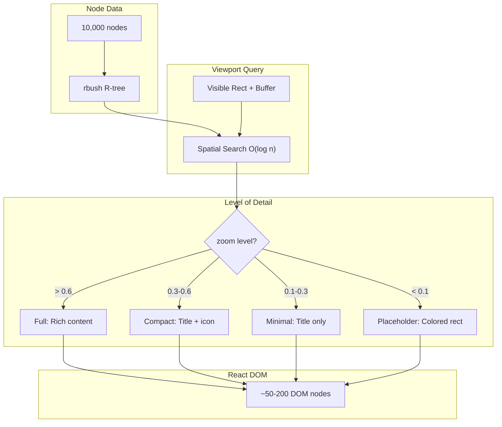

# 03: Virtualized Node Layer

> Only render visible nodes with level-of-detail for 10,000+ node support

**Duration:** 4-5 days
**Dependencies:** [01-webgl-grid-layer.md](./01-webgl-grid-layer.md), [02-canvas2d-edge-layer.md](./02-canvas2d-edge-layer.md)
**Package:** `@xnetjs/canvas`

## Overview

React remains the best choice for interactive nodes because rich text editing, embedded databases, and accessibility all require DOM. However, rendering 10,000+ nodes in the DOM simultaneously is not feasible.

The solution is **virtualization**: only nodes within the viewport (plus a buffer zone) exist in the DOM. Combined with **level-of-detail (LOD)** rendering, we can show simplified representations at low zoom levels.



## Implementation

### Virtualized Node Layer Component

```typescript
// packages/canvas/src/layers/virtualized-node-layer.tsx

import { memo, useMemo } from 'react'
import type { CanvasNode, Viewport, SpatialIndex } from '../types'

type LODLevel = 'placeholder' | 'minimal' | 'compact' | 'full'

interface VirtualizedNodeLayerProps {
  nodes: CanvasNode[]
  viewport: Viewport
  spatialIndex: SpatialIndex
  selectedIds: Set<string>
  onNodeChange: (id: string, changes: Partial<CanvasNode>) => void
  onNodeSelect: (id: string, multi: boolean) => void
}

export function VirtualizedNodeLayer({
  nodes,
  viewport,
  spatialIndex,
  selectedIds,
  onNodeChange,
  onNodeSelect
}: VirtualizedNodeLayerProps) {
  // Query visible node IDs from spatial index (O(log n))
  const visibleNodeIds = useMemo(() => {
    const rect = viewport.getVisibleRect()
    // Buffer zone prevents pop-in during fast panning
    const buffer = 300 / viewport.zoom
    const expandedRect = {
      minX: rect.x - buffer,
      minY: rect.y - buffer,
      maxX: rect.x + rect.width + buffer,
      maxY: rect.y + rect.height + buffer
    }
    return spatialIndex.search(expandedRect).map((item) => item.id)
  }, [spatialIndex, viewport.x, viewport.y, viewport.zoom, viewport.width, viewport.height])

  // Create node lookup for O(1) access
  const nodeMap = useMemo(() => new Map(nodes.map((n) => [n.id, n])), [nodes])

  // Only render visible nodes
  const visibleNodes = useMemo(
    () => visibleNodeIds.map((id) => nodeMap.get(id)).filter(Boolean) as CanvasNode[],
    [visibleNodeIds, nodeMap]
  )

  // Determine LOD based on zoom
  const lod = useMemo((): LODLevel => {
    if (viewport.zoom < 0.1) return 'placeholder'
    if (viewport.zoom < 0.3) return 'minimal'
    if (viewport.zoom < 0.6) return 'compact'
    return 'full'
  }, [viewport.zoom])

  return (
    <div
      className="virtualized-node-layer"
      style={{
        position: 'absolute',
        width: '100%',
        height: '100%',
        pointerEvents: 'none',
        transform: viewport.getTransformCSS(),
        transformOrigin: '0 0'
      }}
    >
      {visibleNodes.map((node) => (
        <VirtualizedNode
          key={node.id}
          node={node}
          lod={lod}
          isSelected={selectedIds.has(node.id)}
          onNodeChange={onNodeChange}
          onNodeSelect={onNodeSelect}
        />
      ))}
    </div>
  )
}

// Memoized node component to prevent unnecessary re-renders
const VirtualizedNode = memo(function VirtualizedNode({
  node,
  lod,
  isSelected,
  onNodeChange,
  onNodeSelect
}: {
  node: CanvasNode
  lod: LODLevel
  isSelected: boolean
  onNodeChange: (id: string, changes: Partial<CanvasNode>) => void
  onNodeSelect: (id: string, multi: boolean) => void
}) {
  const handleClick = (e: React.MouseEvent) => {
    e.stopPropagation()
    onNodeSelect(node.id, e.shiftKey || e.metaKey)
  }

  // Placeholder: just a colored rectangle (for extreme zoom-out)
  if (lod === 'placeholder') {
    return (
      <div
        className="canvas-node canvas-node--placeholder"
        style={{
          position: 'absolute',
          left: node.position.x,
          top: node.position.y,
          width: node.position.width,
          height: node.position.height,
          backgroundColor: getNodeColor(node),
          borderRadius: 4,
          pointerEvents: 'auto',
          boxShadow: isSelected ? '0 0 0 2px #3b82f6' : undefined
        }}
        onClick={handleClick}
      />
    )
  }

  // Minimal: title only
  if (lod === 'minimal') {
    return (
      <div
        className="canvas-node canvas-node--minimal"
        style={{
          position: 'absolute',
          left: node.position.x,
          top: node.position.y,
          width: node.position.width,
          height: node.position.height,
          backgroundColor: 'white',
          border: '1px solid #e5e7eb',
          borderRadius: 4,
          padding: 4,
          overflow: 'hidden',
          pointerEvents: 'auto',
          boxShadow: isSelected ? '0 0 0 2px #3b82f6' : undefined
        }}
        onClick={handleClick}
      >
        <span className="node-title">{getNodeTitle(node)}</span>
      </div>
    )
  }

  // Compact: title + icon
  if (lod === 'compact') {
    return (
      <div
        className="canvas-node canvas-node--compact"
        style={{
          position: 'absolute',
          left: node.position.x,
          top: node.position.y,
          width: node.position.width,
          height: node.position.height,
          backgroundColor: 'white',
          border: '1px solid #e5e7eb',
          borderRadius: 6,
          padding: 8,
          overflow: 'hidden',
          pointerEvents: 'auto',
          boxShadow: isSelected ? '0 0 0 2px #3b82f6' : undefined,
          display: 'flex',
          alignItems: 'center',
          gap: 8
        }}
        onClick={handleClick}
      >
        <NodeIcon type={node.type} />
        <span className="node-title" style={{ fontWeight: 500 }}>
          {getNodeTitle(node)}
        </span>
      </div>
    )
  }

  // Full: complete interactive node
  return (
    <FullCanvasNode
      node={node}
      isSelected={isSelected}
      onNodeChange={onNodeChange}
      onNodeSelect={onNodeSelect}
    />
  )
})
```

### Full Interactive Node

```typescript
// packages/canvas/src/components/full-canvas-node.tsx

import { memo, useCallback, useRef } from 'react'
import { useDrag } from '../hooks/use-drag'

interface FullCanvasNodeProps {
  node: CanvasNode
  isSelected: boolean
  onNodeChange: (id: string, changes: Partial<CanvasNode>) => void
  onNodeSelect: (id: string, multi: boolean) => void
}

export const FullCanvasNode = memo(function FullCanvasNode({
  node,
  isSelected,
  onNodeChange,
  onNodeSelect
}: FullCanvasNodeProps) {
  const nodeRef = useRef<HTMLDivElement>(null)

  const handleClick = useCallback(
    (e: React.MouseEvent) => {
      e.stopPropagation()
      onNodeSelect(node.id, e.shiftKey || e.metaKey)
    },
    [node.id, onNodeSelect]
  )

  const { isDragging, dragHandlers } = useDrag({
    onDragStart: () => {
      if (!isSelected) {
        onNodeSelect(node.id, false)
      }
    },
    onDrag: (delta) => {
      onNodeChange(node.id, {
        position: {
          ...node.position,
          x: node.position.x + delta.x,
          y: node.position.y + delta.y
        }
      })
    }
  })

  return (
    <div
      ref={nodeRef}
      className={`canvas-node canvas-node--full ${isSelected ? 'selected' : ''} ${isDragging ? 'dragging' : ''}`}
      style={{
        position: 'absolute',
        left: node.position.x,
        top: node.position.y,
        width: node.position.width,
        height: node.position.height,
        backgroundColor: 'white',
        border: '1px solid #e5e7eb',
        borderRadius: 8,
        boxShadow: isSelected
          ? '0 0 0 2px #3b82f6, 0 4px 12px rgba(0,0,0,0.1)'
          : '0 1px 3px rgba(0,0,0,0.1)',
        pointerEvents: 'auto',
        cursor: isDragging ? 'grabbing' : 'grab'
      }}
      onClick={handleClick}
      {...dragHandlers}
    >
      <NodeContent node={node} onNodeChange={onNodeChange} />
      {isSelected && <ResizeHandles node={node} onNodeChange={onNodeChange} />}
    </div>
  )
})

function NodeContent({
  node,
  onNodeChange
}: {
  node: CanvasNode
  onNodeChange: (id: string, changes: Partial<CanvasNode>) => void
}) {
  switch (node.type) {
    case 'card':
      return <CardNodeContent node={node} onNodeChange={onNodeChange} />
    case 'embed':
      return <EmbedNodeContent node={node} />
    case 'mermaid':
      return <MermaidNodeContent node={node} onNodeChange={onNodeChange} />
    case 'shape':
      return <ShapeNodeContent node={node} />
    default:
      return <div className="node-fallback">{node.type}</div>
  }
}

function CardNodeContent({
  node,
  onNodeChange
}: {
  node: CanvasNode
  onNodeChange: (id: string, changes: Partial<CanvasNode>) => void
}) {
  return (
    <div className="card-node-content">
      <div className="node-header">
        <NodeIcon type={node.type} />
        <input
          className="node-title-input"
          value={node.properties?.title ?? ''}
          onChange={(e) =>
            onNodeChange(node.id, {
              properties: { ...node.properties, title: e.target.value }
            })
          }
          placeholder="Untitled"
        />
      </div>
      <div className="node-body">
        {/* TipTap editor or other rich content */}
      </div>
    </div>
  )
}
```

### Spatial Index Integration

```typescript
// packages/canvas/src/hooks/use-spatial-index.ts

import { useMemo, useRef, useEffect } from 'react'
import RBush from 'rbush'

interface RBushItem {
  id: string
  minX: number
  minY: number
  maxX: number
  maxY: number
}

export function useSpatialIndex(nodes: CanvasNode[]): SpatialIndex {
  const treeRef = useRef(new RBush<RBushItem>())

  // Rebuild index when nodes change
  useEffect(() => {
    const tree = treeRef.current
    tree.clear()

    const items: RBushItem[] = nodes.map((node) => ({
      id: node.id,
      minX: node.position.x,
      minY: node.position.y,
      maxX: node.position.x + node.position.width,
      maxY: node.position.y + node.position.height
    }))

    tree.load(items)
  }, [nodes])

  return useMemo(
    () => ({
      search: (rect: { minX: number; minY: number; maxX: number; maxY: number }) => {
        return treeRef.current.search(rect)
      },
      update: (id: string, position: Rect) => {
        const tree = treeRef.current
        // Remove old item
        const items = tree.all()
        const oldItem = items.find((item) => item.id === id)
        if (oldItem) {
          tree.remove(oldItem, (a, b) => a.id === b.id)
        }
        // Insert new item
        tree.insert({
          id,
          minX: position.x,
          minY: position.y,
          maxX: position.x + position.width,
          maxY: position.y + position.height
        })
      }
    }),
    []
  )
}
```

### Viewport Hook

```typescript
// packages/canvas/src/hooks/use-viewport.ts

import { useState, useCallback, useMemo } from 'react'

interface ViewportState {
  x: number // Center X in canvas coordinates
  y: number // Center Y in canvas coordinates
  zoom: number
  width: number // Viewport width in screen pixels
  height: number // Viewport height in screen pixels
}

export function useViewport(initialState?: Partial<ViewportState>) {
  const [state, setState] = useState<ViewportState>({
    x: 0,
    y: 0,
    zoom: 1,
    width: window.innerWidth,
    height: window.innerHeight,
    ...initialState
  })

  const pan = useCallback((dx: number, dy: number) => {
    setState((s) => ({
      ...s,
      x: s.x - dx / s.zoom,
      y: s.y - dy / s.zoom
    }))
  }, [])

  const zoomTo = useCallback((newZoom: number, center?: { x: number; y: number }) => {
    setState((s) => {
      const clampedZoom = Math.max(0.1, Math.min(4, newZoom))
      if (center) {
        // Zoom towards cursor position
        const scale = clampedZoom / s.zoom
        return {
          ...s,
          zoom: clampedZoom,
          x: center.x + (s.x - center.x) * scale,
          y: center.y + (s.y - center.y) * scale
        }
      }
      return { ...s, zoom: clampedZoom }
    })
  }, [])

  const setSize = useCallback((width: number, height: number) => {
    setState((s) => ({ ...s, width, height }))
  }, [])

  const getVisibleRect = useCallback(() => {
    const halfWidth = state.width / state.zoom / 2
    const halfHeight = state.height / state.zoom / 2
    return {
      x: state.x - halfWidth,
      y: state.y - halfHeight,
      width: state.width / state.zoom,
      height: state.height / state.zoom
    }
  }, [state])

  const getTransformCSS = useCallback(() => {
    return `scale(${state.zoom}) translate(${-state.x}px, ${-state.y}px)`
  }, [state.x, state.y, state.zoom])

  const canvasToScreen = useCallback(
    (canvasX: number, canvasY: number) => ({
      x: (canvasX - state.x) * state.zoom + state.width / 2,
      y: (canvasY - state.y) * state.zoom + state.height / 2
    }),
    [state]
  )

  const screenToCanvas = useCallback(
    (screenX: number, screenY: number) => ({
      x: (screenX - state.width / 2) / state.zoom + state.x,
      y: (screenY - state.height / 2) / state.zoom + state.y
    }),
    [state]
  )

  return useMemo(
    () => ({
      ...state,
      pan,
      zoomTo,
      setSize,
      getVisibleRect,
      getTransformCSS,
      canvasToScreen,
      screenToCanvas
    }),
    [state, pan, zoomTo, setSize, getVisibleRect, getTransformCSS, canvasToScreen, screenToCanvas]
  )
}
```

## Testing

```typescript
describe('VirtualizedNodeLayer', () => {
  it('only renders visible nodes', () => {
    const nodes = Array.from({ length: 1000 }, (_, i) => ({
      id: `node-${i}`,
      type: 'card',
      position: {
        x: (i % 50) * 150,
        y: Math.floor(i / 50) * 100,
        width: 120,
        height: 80
      }
    }))

    const spatialIndex = createSpatialIndex(nodes)
    const viewport = {
      x: 0,
      y: 0,
      zoom: 1,
      width: 800,
      height: 600,
      getVisibleRect: () => ({ x: -400, y: -300, width: 800, height: 600 }),
      getTransformCSS: () => 'scale(1) translate(0px, 0px)'
    }

    const { container } = render(
      <VirtualizedNodeLayer
        nodes={nodes}
        viewport={viewport}
        spatialIndex={spatialIndex}
        selectedIds={new Set()}
        onNodeChange={vi.fn()}
        onNodeSelect={vi.fn()}
      />
    )

    // Only visible nodes should be in DOM (roughly 6x8 = 48 nodes plus buffer)
    const renderedNodes = container.querySelectorAll('.canvas-node')
    expect(renderedNodes.length).toBeLessThan(100)
    expect(renderedNodes.length).toBeGreaterThan(0)
  })

  it('applies LOD based on zoom', () => {
    const nodes = [{ id: 'n1', type: 'card', position: { x: 0, y: 0, width: 100, height: 50 } }]
    const spatialIndex = createSpatialIndex(nodes)

    // High zoom - full detail
    const { container: fullContainer } = render(
      <VirtualizedNodeLayer
        nodes={nodes}
        viewport={createViewport(1)}
        spatialIndex={spatialIndex}
        selectedIds={new Set()}
        onNodeChange={vi.fn()}
        onNodeSelect={vi.fn()}
      />
    )
    expect(fullContainer.querySelector('.canvas-node--full')).toBeTruthy()

    // Low zoom - placeholder
    const { container: placeholderContainer } = render(
      <VirtualizedNodeLayer
        nodes={nodes}
        viewport={createViewport(0.05)}
        spatialIndex={spatialIndex}
        selectedIds={new Set()}
        onNodeChange={vi.fn()}
        onNodeSelect={vi.fn()}
      />
    )
    expect(placeholderContainer.querySelector('.canvas-node--placeholder')).toBeTruthy()
  })

  it('updates when viewport pans', () => {
    const nodes = Array.from({ length: 100 }, (_, i) => ({
      id: `node-${i}`,
      type: 'card',
      position: { x: i * 200, y: 0, width: 100, height: 50 }
    }))

    const spatialIndex = createSpatialIndex(nodes)

    // Initial view shows first few nodes
    const viewport1 = createViewport(1, 0, 0)
    const { container, rerender } = render(
      <VirtualizedNodeLayer
        nodes={nodes}
        viewport={viewport1}
        spatialIndex={spatialIndex}
        selectedIds={new Set()}
        onNodeChange={vi.fn()}
        onNodeSelect={vi.fn()}
      />
    )

    const initialCount = container.querySelectorAll('.canvas-node').length

    // Pan to show different nodes
    const viewport2 = createViewport(1, 5000, 0)
    rerender(
      <VirtualizedNodeLayer
        nodes={nodes}
        viewport={viewport2}
        spatialIndex={spatialIndex}
        selectedIds={new Set()}
        onNodeChange={vi.fn()}
        onNodeSelect={vi.fn()}
      />
    )

    // Should still have similar number of nodes, but different ones
    const panCount = container.querySelectorAll('.canvas-node').length
    expect(panCount).toBeCloseTo(initialCount, 10)
  })
})
```

## Validation Gate

- [x] Only visible nodes rendered in DOM (+ 300px buffer)
- [x] LOD transitions smoothly at zoom thresholds
- [x] Placeholder nodes render at zoom < 0.1
- [x] Minimal nodes show title at zoom 0.1-0.3
- [x] Compact nodes show title + icon at zoom 0.3-0.6
- [x] Full nodes render at zoom > 0.6
- [ ] No pop-in during normal pan speeds
- [ ] 10,000 nodes pans at 60fps
- [x] Selection works at all LOD levels
- [x] Memoization prevents unnecessary re-renders

---

[Back to README](./README.md) | [Previous: Canvas 2D Edge Layer](./02-canvas2d-edge-layer.md) | [Next: Chunked Storage ->](./04-chunked-storage.md)
