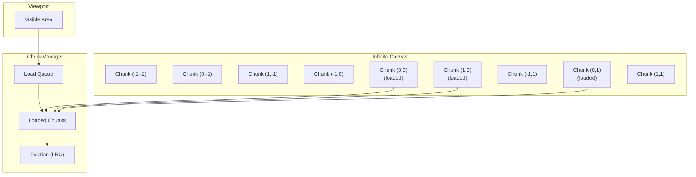

# 04: Chunked Storage

> Tile-based Y.Doc storage for truly infinite canvases with lazy-loading and eviction

**Duration:** 4-5 days
**Dependencies:** [03-virtualized-node-layer.md](./03-virtualized-node-layer.md)
**Package:** `@xnet/canvas`

## Overview

A truly infinite canvas cannot load all nodes at once. The solution is **spatial chunking**: divide the canvas into tiles, load tiles on demand, and evict distant tiles to free memory.

Each chunk is a separate Y.Map within the canvas Y.Doc, enabling:

- Progressive loading (nearest chunks first)
- Memory management through eviction
- Independent sync per chunk
- Efficient querying via spatial index



## Implementation

### Chunk Configuration

```typescript
// packages/canvas/src/chunks/config.ts

/** Size of each chunk in canvas units */
export const CHUNK_SIZE = 2048

/** Load chunks within this radius (in chunks) from viewport center */
export const LOAD_RADIUS = 2

/** Evict chunks beyond this radius (in chunks) from viewport center */
export const EVICT_RADIUS = 4

/** Maximum chunks to keep in memory */
export const MAX_LOADED_CHUNKS = 50

/** Chunk key format: "x,y" e.g., "0,0", "-1,2" */
export type ChunkKey = `${number},${number}`

export function chunkKeyFromPosition(x: number, y: number): ChunkKey {
  const chunkX = Math.floor(x / CHUNK_SIZE)
  const chunkY = Math.floor(y / CHUNK_SIZE)
  return `${chunkX},${chunkY}`
}

export function positionFromChunkKey(key: ChunkKey): { x: number; y: number } {
  const [x, y] = key.split(',').map(Number)
  return { x: x * CHUNK_SIZE, y: y * CHUNK_SIZE }
}

export function chunkBounds(key: ChunkKey): Rect {
  const { x, y } = positionFromChunkKey(key)
  return { x, y, width: CHUNK_SIZE, height: CHUNK_SIZE }
}
```

### Chunk Data Structure

```typescript
// packages/canvas/src/chunks/types.ts

import type { CanvasNode, CanvasEdge } from '../types'

export interface Chunk {
  key: ChunkKey
  x: number // Chunk X coordinate (not canvas)
  y: number // Chunk Y coordinate (not canvas)
  nodes: CanvasNode[] // Nodes whose center is in this chunk
  edges: CanvasEdge[] // Edges where both endpoints are in this chunk
  loaded: boolean
  loading: boolean
  lastAccessed: number
}

export interface CrossChunkEdge extends CanvasEdge {
  sourceChunk: ChunkKey
  targetChunk: ChunkKey
}
```

### Chunk Manager

```typescript
// packages/canvas/src/chunks/chunk-manager.ts

import * as Y from 'yjs'
import {
  CHUNK_SIZE,
  LOAD_RADIUS,
  EVICT_RADIUS,
  MAX_LOADED_CHUNKS,
  type ChunkKey,
  chunkKeyFromPosition,
  positionFromChunkKey
} from './config'
import type { Chunk, CrossChunkEdge } from './types'
import type { Viewport, CanvasNode, CanvasEdge } from '../types'

export class ChunkManager {
  private chunks = new Map<ChunkKey, Chunk>()
  private crossChunkEdges: CrossChunkEdge[] = []
  private loadQueue: ChunkKey[] = []
  private isLoading = false

  constructor(
    private store: ChunkedCanvasStore,
    private onChunkLoaded: (chunk: Chunk) => void,
    private onChunkEvicted: (chunkKey: ChunkKey) => void
  ) {}

  /**
   * Update which chunks should be loaded based on viewport position.
   * Called on every viewport change.
   */
  updateViewport(viewport: Viewport): void {
    const centerChunk = this.getChunkAtPoint(viewport.x, viewport.y)
    const visibleChunks = this.getChunksInRadius(centerChunk, LOAD_RADIUS, viewport)
    const evictableChunks = this.getChunksOutsideRadius(centerChunk, EVICT_RADIUS)

    // Queue loading for missing chunks (prioritize by distance from center)
    const missingChunks = visibleChunks.filter(
      (key) => !this.chunks.has(key) || !this.chunks.get(key)!.loaded
    )

    // Sort by distance from viewport center
    const sorted = missingChunks.sort((a, b) => {
      const distA = this.chunkDistanceFromCenter(a, centerChunk)
      const distB = this.chunkDistanceFromCenter(b, centerChunk)
      return distA - distB
    })

    // Update load queue (keep existing entries that are still relevant)
    this.loadQueue = [
      ...sorted,
      ...this.loadQueue.filter((key) => !sorted.includes(key) && visibleChunks.includes(key))
    ]

    // Evict distant chunks
    for (const key of evictableChunks) {
      this.evictChunk(key)
    }

    // Enforce memory limit
    this.enforceMemoryLimit()

    // Start loading
    this.processLoadQueue()
  }

  /**
   * Get all loaded nodes (for rendering).
   */
  getAllNodes(): CanvasNode[] {
    const nodes: CanvasNode[] = []
    for (const chunk of this.chunks.values()) {
      if (chunk.loaded) {
        nodes.push(...chunk.nodes)
      }
    }
    return nodes
  }

  /**
   * Get all edges (including cross-chunk edges).
   */
  getAllEdges(): CanvasEdge[] {
    const edges: CanvasEdge[] = []
    for (const chunk of this.chunks.values()) {
      if (chunk.loaded) {
        edges.push(...chunk.edges)
      }
    }
    // Add cross-chunk edges where both chunks are loaded
    for (const edge of this.crossChunkEdges) {
      const sourceLoaded = this.chunks.get(edge.sourceChunk)?.loaded
      const targetLoaded = this.chunks.get(edge.targetChunk)?.loaded
      if (sourceLoaded && targetLoaded) {
        edges.push(edge)
      }
    }
    return edges
  }

  /**
   * Add a node to the appropriate chunk.
   */
  addNode(node: CanvasNode): void {
    const chunkKey = this.getChunkForNode(node)
    this.store.addNode(node, chunkKey)

    // Update local cache if chunk is loaded
    const chunk = this.chunks.get(chunkKey)
    if (chunk?.loaded) {
      chunk.nodes.push(node)
    }
  }

  /**
   * Move a node, potentially to a different chunk.
   */
  moveNode(nodeId: string, newPosition: CanvasNodePosition): void {
    const oldChunkKey = this.findNodeChunk(nodeId)
    const newChunkKey = chunkKeyFromPosition(
      newPosition.x + newPosition.width / 2,
      newPosition.y + newPosition.height / 2
    )

    if (oldChunkKey === newChunkKey) {
      // Same chunk, just update position
      this.store.updateNodePosition(nodeId, newPosition)
      this.updateLocalNodePosition(nodeId, newPosition)
    } else {
      // Moving to different chunk
      this.store.moveNodeToChunk(nodeId, oldChunkKey, newChunkKey, newPosition)
      this.moveLocalNode(nodeId, oldChunkKey, newChunkKey, newPosition)

      // Update edges that reference this node
      this.updateEdgesForMovedNode(nodeId, oldChunkKey, newChunkKey)
    }
  }

  private getChunkAtPoint(x: number, y: number): ChunkKey {
    return chunkKeyFromPosition(x, y)
  }

  private getChunkForNode(node: CanvasNode): ChunkKey {
    // Use node center
    const cx = node.position.x + node.position.width / 2
    const cy = node.position.y + node.position.height / 2
    return chunkKeyFromPosition(cx, cy)
  }

  private getChunksInRadius(center: ChunkKey, radius: number, viewport: Viewport): ChunkKey[] {
    const [cx, cy] = center.split(',').map(Number)
    const chunks: ChunkKey[] = []

    // Also consider visible rect to handle non-square viewports
    const rect = viewport.getVisibleRect()
    const minChunkX = Math.floor(rect.x / CHUNK_SIZE) - 1
    const maxChunkX = Math.ceil((rect.x + rect.width) / CHUNK_SIZE) + 1
    const minChunkY = Math.floor(rect.y / CHUNK_SIZE) - 1
    const maxChunkY = Math.ceil((rect.y + rect.height) / CHUNK_SIZE) + 1

    for (let x = cx - radius; x <= cx + radius; x++) {
      for (let y = cy - radius; y <= cy + radius; y++) {
        // Include if within radius OR within visible rect
        const inRadius = Math.abs(x - cx) <= radius && Math.abs(y - cy) <= radius
        const inViewport = x >= minChunkX && x <= maxChunkX && y >= minChunkY && y <= maxChunkY

        if (inRadius || inViewport) {
          chunks.push(`${x},${y}`)
        }
      }
    }

    return chunks
  }

  private getChunksOutsideRadius(center: ChunkKey, radius: number): ChunkKey[] {
    const [cx, cy] = center.split(',').map(Number)
    const evictable: ChunkKey[] = []

    for (const key of this.chunks.keys()) {
      const [x, y] = key.split(',').map(Number)
      if (Math.abs(x - cx) > radius || Math.abs(y - cy) > radius) {
        evictable.push(key)
      }
    }

    return evictable
  }

  private chunkDistanceFromCenter(key: ChunkKey, center: ChunkKey): number {
    const [x, y] = key.split(',').map(Number)
    const [cx, cy] = center.split(',').map(Number)
    return Math.sqrt((x - cx) ** 2 + (y - cy) ** 2)
  }

  private async processLoadQueue(): Promise<void> {
    if (this.isLoading || this.loadQueue.length === 0) return

    this.isLoading = true
    const key = this.loadQueue.shift()!

    // Mark as loading
    if (!this.chunks.has(key)) {
      const [x, y] = key.split(',').map(Number)
      this.chunks.set(key, {
        key,
        x,
        y,
        nodes: [],
        edges: [],
        loaded: false,
        loading: true,
        lastAccessed: Date.now()
      })
    } else {
      this.chunks.get(key)!.loading = true
    }

    try {
      const data = await this.store.loadChunk(key)
      const chunk = this.chunks.get(key)!
      chunk.nodes = data.nodes
      chunk.edges = data.edges
      chunk.loaded = true
      chunk.loading = false
      chunk.lastAccessed = Date.now()

      // Load cross-chunk edges that reference nodes in this chunk
      const newCrossEdges = await this.store.loadCrossChunkEdgesFor(key)
      this.crossChunkEdges.push(...newCrossEdges)

      this.onChunkLoaded(chunk)
    } catch (err) {
      console.error(`Failed to load chunk ${key}:`, err)
      this.chunks.get(key)!.loading = false
    } finally {
      this.isLoading = false
      // Continue processing queue with idle callback
      if (this.loadQueue.length > 0) {
        requestIdleCallback(() => this.processLoadQueue())
      }
    }
  }

  private evictChunk(key: ChunkKey): void {
    const chunk = this.chunks.get(key)
    if (!chunk || !chunk.loaded) return

    // Remove from cache
    this.chunks.delete(key)

    // Remove cross-chunk edges that involve this chunk
    this.crossChunkEdges = this.crossChunkEdges.filter(
      (edge) => edge.sourceChunk !== key && edge.targetChunk !== key
    )

    this.onChunkEvicted(key)
  }

  private enforceMemoryLimit(): void {
    if (this.chunks.size <= MAX_LOADED_CHUNKS) return

    // Sort by last accessed time
    const loadedChunks = Array.from(this.chunks.entries())
      .filter(([, chunk]) => chunk.loaded)
      .sort(([, a], [, b]) => a.lastAccessed - b.lastAccessed)

    // Evict oldest chunks until under limit
    const toEvict = loadedChunks.length - MAX_LOADED_CHUNKS
    for (let i = 0; i < toEvict; i++) {
      this.evictChunk(loadedChunks[i][0])
    }
  }

  private findNodeChunk(nodeId: string): ChunkKey | null {
    for (const [key, chunk] of this.chunks) {
      if (chunk.nodes.some((n) => n.id === nodeId)) {
        return key
      }
    }
    return null
  }

  private updateLocalNodePosition(nodeId: string, position: CanvasNodePosition): void {
    for (const chunk of this.chunks.values()) {
      const node = chunk.nodes.find((n) => n.id === nodeId)
      if (node) {
        node.position = position
        break
      }
    }
  }

  private moveLocalNode(
    nodeId: string,
    fromKey: ChunkKey | null,
    toKey: ChunkKey,
    position: CanvasNodePosition
  ): void {
    // Remove from old chunk
    if (fromKey) {
      const oldChunk = this.chunks.get(fromKey)
      if (oldChunk) {
        const idx = oldChunk.nodes.findIndex((n) => n.id === nodeId)
        if (idx >= 0) {
          const node = oldChunk.nodes[idx]
          oldChunk.nodes.splice(idx, 1)

          // Add to new chunk if loaded
          const newChunk = this.chunks.get(toKey)
          if (newChunk?.loaded) {
            node.position = position
            newChunk.nodes.push(node)
          }
        }
      }
    }
  }

  private updateEdgesForMovedNode(
    nodeId: string,
    oldChunk: ChunkKey | null,
    newChunk: ChunkKey
  ): void {
    // Find all edges involving this node
    // If edge now spans chunks, move to crossChunkEdges
    // If edge was cross-chunk but now same chunk, move back

    for (const chunk of this.chunks.values()) {
      const edges = chunk.edges.filter((e) => e.sourceId === nodeId || e.targetId === nodeId)

      for (const edge of edges) {
        const sourceChunk = this.findNodeChunk(edge.sourceId)
        const targetChunk = this.findNodeChunk(edge.targetId)

        if (sourceChunk && targetChunk && sourceChunk !== targetChunk) {
          // Now a cross-chunk edge
          chunk.edges = chunk.edges.filter((e) => e.id !== edge.id)
          this.crossChunkEdges.push({
            ...edge,
            sourceChunk,
            targetChunk
          })
        }
      }
    }

    // Check cross-chunk edges that might now be same-chunk
    this.crossChunkEdges = this.crossChunkEdges.filter((edge) => {
      if (edge.sourceId === nodeId || edge.targetId === nodeId) {
        const sourceChunk = this.findNodeChunk(edge.sourceId)
        const targetChunk = this.findNodeChunk(edge.targetId)

        if (sourceChunk === targetChunk && sourceChunk) {
          // Move back to chunk
          const chunk = this.chunks.get(sourceChunk)
          if (chunk?.loaded) {
            chunk.edges.push(edge)
          }
          return false // Remove from cross-chunk
        }
      }
      return true
    })
  }
}
```

### Chunked Canvas Store

```typescript
// packages/canvas/src/chunks/chunked-canvas-store.ts

import * as Y from 'yjs'
import type { ChunkKey } from './config'
import type { CanvasNode, CanvasEdge, CrossChunkEdge } from '../types'

interface ChunkData {
  nodes: CanvasNode[]
  edges: CanvasEdge[]
}

export class ChunkedCanvasStore {
  private ydoc: Y.Doc
  private metadata: Y.Map<unknown>
  private chunks: Y.Map<Y.Map<unknown>>
  private crossEdges: Y.Map<unknown>
  private index: Y.Map<string> // nodeId -> chunkKey

  constructor(id: string) {
    this.ydoc = new Y.Doc({ guid: id })
    this.metadata = this.ydoc.getMap('metadata')
    this.chunks = this.ydoc.getMap('chunks')
    this.crossEdges = this.ydoc.getMap('crossEdges')
    this.index = this.ydoc.getMap('index')
  }

  async loadChunk(key: ChunkKey): Promise<ChunkData> {
    const chunkMap = this.chunks.get(key) as Y.Map<unknown> | undefined

    if (!chunkMap) {
      return { nodes: [], edges: [] }
    }

    const nodesMap = chunkMap.get('nodes') as Y.Map<unknown>
    const edgesMap = chunkMap.get('edges') as Y.Map<unknown>

    const nodes: CanvasNode[] = []
    const edges: CanvasEdge[] = []

    nodesMap?.forEach((value, key) => {
      nodes.push(value as CanvasNode)
    })

    edgesMap?.forEach((value, key) => {
      edges.push(value as CanvasEdge)
    })

    return { nodes, edges }
  }

  async loadCrossChunkEdgesFor(chunkKey: ChunkKey): Promise<CrossChunkEdge[]> {
    const edges: CrossChunkEdge[] = []

    this.crossEdges.forEach((value, key) => {
      const edge = value as CrossChunkEdge
      if (edge.sourceChunk === chunkKey || edge.targetChunk === chunkKey) {
        edges.push(edge)
      }
    })

    return edges
  }

  addNode(node: CanvasNode, chunkKey: ChunkKey): void {
    this.ydoc.transact(() => {
      // Ensure chunk exists
      if (!this.chunks.has(chunkKey)) {
        const chunk = new Y.Map()
        chunk.set('nodes', new Y.Map())
        chunk.set('edges', new Y.Map())
        this.chunks.set(chunkKey, chunk)
      }

      // Add node to chunk
      const chunk = this.chunks.get(chunkKey) as Y.Map<unknown>
      const nodes = chunk.get('nodes') as Y.Map<unknown>
      nodes.set(node.id, node)

      // Update index
      this.index.set(node.id, chunkKey)
    })
  }

  updateNodePosition(nodeId: string, position: CanvasNodePosition): void {
    const chunkKey = this.index.get(nodeId)
    if (!chunkKey) return

    const chunk = this.chunks.get(chunkKey) as Y.Map<unknown>
    if (!chunk) return

    const nodes = chunk.get('nodes') as Y.Map<unknown>
    const node = nodes.get(nodeId) as CanvasNode
    if (!node) return

    nodes.set(nodeId, { ...node, position })
  }

  moveNodeToChunk(
    nodeId: string,
    fromKey: ChunkKey,
    toKey: ChunkKey,
    newPosition: CanvasNodePosition
  ): void {
    this.ydoc.transact(() => {
      // Remove from old chunk
      const oldChunk = this.chunks.get(fromKey) as Y.Map<unknown>
      if (oldChunk) {
        const oldNodes = oldChunk.get('nodes') as Y.Map<unknown>
        const node = oldNodes.get(nodeId) as CanvasNode
        if (node) {
          oldNodes.delete(nodeId)

          // Ensure new chunk exists
          if (!this.chunks.has(toKey)) {
            const chunk = new Y.Map()
            chunk.set('nodes', new Y.Map())
            chunk.set('edges', new Y.Map())
            this.chunks.set(toKey, chunk)
          }

          // Add to new chunk
          const newChunk = this.chunks.get(toKey) as Y.Map<unknown>
          const newNodes = newChunk.get('nodes') as Y.Map<unknown>
          newNodes.set(nodeId, { ...node, position: newPosition })

          // Update index
          this.index.set(nodeId, toKey)
        }
      }
    })
  }

  addEdge(edge: CanvasEdge, sourceChunk: ChunkKey, targetChunk: ChunkKey): void {
    this.ydoc.transact(() => {
      if (sourceChunk === targetChunk) {
        // Same chunk edge
        const chunk = this.chunks.get(sourceChunk) as Y.Map<unknown>
        if (chunk) {
          const edges = chunk.get('edges') as Y.Map<unknown>
          edges.set(edge.id, edge)
        }
      } else {
        // Cross-chunk edge
        this.crossEdges.set(edge.id, {
          ...edge,
          sourceChunk,
          targetChunk
        })
      }
    })
  }

  getNodeChunk(nodeId: string): ChunkKey | null {
    return this.index.get(nodeId) ?? null
  }

  getYDoc(): Y.Doc {
    return this.ydoc
  }
}
```

## Testing

```typescript
describe('ChunkManager', () => {
  let store: ChunkedCanvasStore
  let manager: ChunkManager
  let loadedChunks: Chunk[]
  let evictedChunks: ChunkKey[]

  beforeEach(() => {
    store = new ChunkedCanvasStore('test-canvas')
    loadedChunks = []
    evictedChunks = []
    manager = new ChunkManager(
      store,
      (chunk) => loadedChunks.push(chunk),
      (key) => evictedChunks.push(key)
    )
  })

  it('loads chunks around viewport', async () => {
    // Add nodes to different chunks
    const node1 = { id: 'n1', type: 'card', position: { x: 100, y: 100, width: 100, height: 50 } }
    const node2 = { id: 'n2', type: 'card', position: { x: 2200, y: 100, width: 100, height: 50 } }

    store.addNode(node1, '0,0')
    store.addNode(node2, '1,0')

    // Update viewport centered at origin
    const viewport = createViewport(1, 0, 0)
    manager.updateViewport(viewport)

    // Wait for loading
    await waitFor(() => loadedChunks.length > 0)

    expect(loadedChunks.some((c) => c.key === '0,0')).toBe(true)
  })

  it('evicts distant chunks', async () => {
    // Load initial chunk
    const viewport1 = createViewport(1, 0, 0)
    manager.updateViewport(viewport1)
    await waitFor(() => loadedChunks.length > 0)

    // Pan far away
    const viewport2 = createViewport(1, 10000, 10000)
    manager.updateViewport(viewport2)

    // Original chunk should be evicted
    await waitFor(() => evictedChunks.includes('0,0'))
  })

  it('handles node movement between chunks', async () => {
    const node = { id: 'n1', type: 'card', position: { x: 100, y: 100, width: 100, height: 50 } }
    store.addNode(node, '0,0')

    const viewport = createViewport(1, 0, 0)
    manager.updateViewport(viewport)
    await waitFor(() => loadedChunks.length > 0)

    // Move node to different chunk
    manager.moveNode('n1', { x: 2200, y: 100, width: 100, height: 50 })

    expect(store.getNodeChunk('n1')).toBe('1,0')
  })

  it('loads cross-chunk edges correctly', async () => {
    const node1 = { id: 'n1', type: 'card', position: { x: 100, y: 100, width: 100, height: 50 } }
    const node2 = { id: 'n2', type: 'card', position: { x: 2200, y: 100, width: 100, height: 50 } }
    const edge = { id: 'e1', sourceId: 'n1', targetId: 'n2' }

    store.addNode(node1, '0,0')
    store.addNode(node2, '1,0')
    store.addEdge(edge, '0,0', '1,0')

    const viewport = createViewport(0.5, 1100, 100) // View both chunks
    manager.updateViewport(viewport)

    await waitFor(() => loadedChunks.length >= 2)

    const allEdges = manager.getAllEdges()
    expect(allEdges.some((e) => e.id === 'e1')).toBe(true)
  })

  it('respects memory limit', async () => {
    // Create many chunks
    for (let i = 0; i < 100; i++) {
      const x = i * CHUNK_SIZE
      store.addNode(
        { id: `n${i}`, type: 'card', position: { x, y: 0, width: 100, height: 50 } },
        `${i},0`
      )
    }

    // Pan across all of them
    for (let i = 0; i < 100; i++) {
      const viewport = createViewport(1, i * CHUNK_SIZE, 0)
      manager.updateViewport(viewport)
      await sleep(10)
    }

    // Should never exceed MAX_LOADED_CHUNKS
    expect(loadedChunks.length).toBeLessThanOrEqual(MAX_LOADED_CHUNKS + 10) // Some buffer for async
  })
})
```

## Validation Gate

- [ ] Chunks load progressively (nearest first)
- [ ] Distant chunks evicted to free memory
- [ ] Memory stays under limit with many chunks
- [ ] Cross-chunk edges render when both chunks loaded
- [ ] Node movement updates chunk assignment
- [ ] Edge classification updates on node move
- [ ] Chunk loading uses requestIdleCallback
- [ ] Y.Doc structure supports chunk-based sync
- [ ] No data loss during chunk transitions

---

[Back to README](./README.md) | [Previous: Virtualized Node Layer](./03-virtualized-node-layer.md) | [Next: Spatial Index ->](./05-spatial-index.md)
