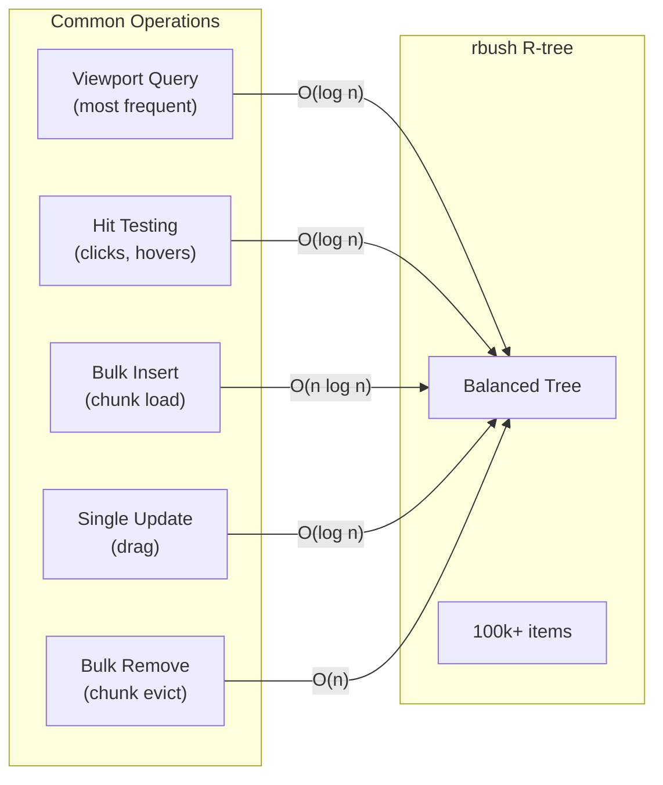

# 05: Spatial Index Optimization

> Optimizing rbush R-tree for 100k+ nodes with bulk operations and efficient updates

**Duration:** 2-3 days
**Dependencies:** [04-chunked-storage.md](./04-chunked-storage.md)
**Package:** `@xnetjs/canvas`

## Overview

The spatial index (rbush R-tree) is critical for viewport culling and hit testing. While rbush handles 100k items well, we need to optimize for our specific usage patterns:

1. **Bulk loading**: When chunks load, insert many items at once
2. **Efficient updates**: Single node drags shouldn't rebuild the tree
3. **Query patterns**: Viewport queries dominate, hit testing is secondary
4. **Memory efficiency**: Index shouldn't duplicate node data



## Implementation

### Optimized Spatial Index

```typescript
// packages/canvas/src/index/spatial-index.ts

import RBush from 'rbush'

interface SpatialItem {
  id: string
  minX: number
  minY: number
  maxX: number
  maxY: number
}

interface QueryRect {
  minX: number
  minY: number
  maxX: number
  maxY: number
}

export class SpatialIndex {
  private tree = new RBush<SpatialItem>()
  private itemById = new Map<string, SpatialItem>()
  private pendingUpdates = new Map<string, SpatialItem>()
  private updateScheduled = false

  /**
   * Bulk load items (optimized for chunk loading).
   * Much faster than individual inserts.
   */
  bulkLoad(items: Array<{ id: string; bounds: Rect }>): void {
    const spatialItems = items.map((item) => ({
      id: item.id,
      minX: item.bounds.x,
      minY: item.bounds.y,
      maxX: item.bounds.x + item.bounds.width,
      maxY: item.bounds.y + item.bounds.height
    }))

    // Store references
    for (const item of spatialItems) {
      this.itemById.set(item.id, item)
    }

    // Bulk load is O(n log n) vs O(n * log n) for individual inserts
    this.tree.load(spatialItems)
  }

  /**
   * Bulk remove items (optimized for chunk eviction).
   */
  bulkRemove(ids: string[]): void {
    const toRemove: SpatialItem[] = []

    for (const id of ids) {
      const item = this.itemById.get(id)
      if (item) {
        toRemove.push(item)
        this.itemById.delete(id)
      }
    }

    // Remove from tree
    for (const item of toRemove) {
      this.tree.remove(item, (a, b) => a.id === b.id)
    }
  }

  /**
   * Update a single item's bounds (for drag operations).
   * Uses batched updates to avoid excessive tree rebalancing.
   */
  update(id: string, bounds: Rect): void {
    const newItem: SpatialItem = {
      id,
      minX: bounds.x,
      minY: bounds.y,
      maxX: bounds.x + bounds.width,
      maxY: bounds.y + bounds.height
    }

    this.pendingUpdates.set(id, newItem)
    this.scheduleFlush()
  }

  /**
   * Immediately apply all pending updates.
   * Call this before queries if freshness is critical.
   */
  flush(): void {
    if (this.pendingUpdates.size === 0) return

    for (const [id, newItem] of this.pendingUpdates) {
      const oldItem = this.itemById.get(id)
      if (oldItem) {
        this.tree.remove(oldItem, (a, b) => a.id === b.id)
      }
      this.tree.insert(newItem)
      this.itemById.set(id, newItem)
    }

    this.pendingUpdates.clear()
    this.updateScheduled = false
  }

  /**
   * Query items within a rectangle.
   * Returns item IDs for memory efficiency.
   */
  search(rect: QueryRect): string[] {
    // Flush pending updates for accurate results
    this.flush()
    return this.tree.search(rect).map((item) => item.id)
  }

  /**
   * Query items at a specific point (hit testing).
   */
  searchPoint(x: number, y: number): string[] {
    return this.search({ minX: x, minY: y, maxX: x, maxY: y })
  }

  /**
   * Check if any items intersect with a rectangle.
   */
  collides(rect: QueryRect): boolean {
    this.flush()
    return this.tree.collides(rect)
  }

  /**
   * Get all items (for debugging or full rebuild).
   */
  all(): SpatialItem[] {
    this.flush()
    return this.tree.all()
  }

  /**
   * Clear all items.
   */
  clear(): void {
    this.tree.clear()
    this.itemById.clear()
    this.pendingUpdates.clear()
  }

  /**
   * Get the number of indexed items.
   */
  get size(): number {
    return this.itemById.size + this.pendingUpdates.size
  }

  private scheduleFlush(): void {
    if (this.updateScheduled) return
    this.updateScheduled = true

    // Batch updates at end of frame
    requestAnimationFrame(() => {
      this.flush()
    })
  }
}
```

### Integration with Chunk Manager

```typescript
// packages/canvas/src/chunks/chunk-manager.ts

import { SpatialIndex } from '../index/spatial-index'

export class ChunkManager {
  private spatialIndex = new SpatialIndex()

  // When a chunk loads, bulk insert its nodes
  private handleChunkLoaded(chunk: Chunk): void {
    const items = chunk.nodes.map((node) => ({
      id: node.id,
      bounds: node.position
    }))

    this.spatialIndex.bulkLoad(items)
    this.onChunkLoaded(chunk)
  }

  // When a chunk evicts, bulk remove its nodes
  private handleChunkEvicted(chunkKey: ChunkKey): void {
    const chunk = this.chunks.get(chunkKey)
    if (chunk) {
      const ids = chunk.nodes.map((n) => n.id)
      this.spatialIndex.bulkRemove(ids)
    }
    this.onChunkEvicted(chunkKey)
  }

  // When a node moves, update the index
  moveNode(nodeId: string, newPosition: Rect): void {
    this.spatialIndex.update(nodeId, newPosition)
    // ... rest of move logic
  }

  // Query for visible nodes
  getVisibleNodeIds(viewport: Viewport): string[] {
    const rect = viewport.getVisibleRect()
    const buffer = 300 / viewport.zoom

    return this.spatialIndex.search({
      minX: rect.x - buffer,
      minY: rect.y - buffer,
      maxX: rect.x + rect.width + buffer,
      maxY: rect.y + rect.height + buffer
    })
  }

  // Hit testing for clicks
  getNodeAtPoint(x: number, y: number): string | null {
    const ids = this.spatialIndex.searchPoint(x, y)
    return ids.length > 0 ? ids[ids.length - 1] : null // Top-most
  }
}
```

### Viewport Query Hook

```typescript
// packages/canvas/src/hooks/use-visible-nodes.ts

import { useMemo, useRef, useEffect } from 'react'
import type { Viewport, SpatialIndex, CanvasNode } from '../types'

interface UseVisibleNodesOptions {
  nodes: CanvasNode[]
  viewport: Viewport
  spatialIndex: SpatialIndex
  bufferPx?: number
}

export function useVisibleNodes({
  nodes,
  viewport,
  spatialIndex,
  bufferPx = 300
}: UseVisibleNodesOptions) {
  // Memoize node map
  const nodeMap = useMemo(() => new Map(nodes.map((n) => [n.id, n])), [nodes])

  // Query visible IDs
  const visibleIds = useMemo(() => {
    const rect = viewport.getVisibleRect()
    const buffer = bufferPx / viewport.zoom

    return spatialIndex.search({
      minX: rect.x - buffer,
      minY: rect.y - buffer,
      maxX: rect.x + rect.width + buffer,
      maxY: rect.y + rect.height + buffer
    })
  }, [
    spatialIndex,
    viewport.x,
    viewport.y,
    viewport.zoom,
    viewport.width,
    viewport.height,
    bufferPx
  ])

  // Map IDs to nodes
  const visibleNodes = useMemo(
    () => visibleIds.map((id) => nodeMap.get(id)).filter(Boolean) as CanvasNode[],
    [visibleIds, nodeMap]
  )

  return { visibleIds, visibleNodes }
}
```

### Hit Testing Utilities

```typescript
// packages/canvas/src/utils/hit-testing.ts

import type { SpatialIndex, CanvasNode, Point } from '../types'

/**
 * Find the topmost node at a screen point.
 */
export function hitTest(
  point: Point,
  spatialIndex: SpatialIndex,
  nodes: Map<string, CanvasNode>,
  viewport: Viewport
): CanvasNode | null {
  // Convert screen to canvas coordinates
  const canvasPoint = viewport.screenToCanvas(point.x, point.y)

  // Query spatial index
  const candidateIds = spatialIndex.searchPoint(canvasPoint.x, canvasPoint.y)

  if (candidateIds.length === 0) return null

  // Get candidate nodes and sort by z-index (or creation order)
  const candidates = candidateIds.map((id) => nodes.get(id)).filter(Boolean) as CanvasNode[]

  // Return topmost (last in render order)
  return candidates[candidates.length - 1]
}

/**
 * Find all nodes within a selection rectangle.
 */
export function boxSelect(
  rect: Rect,
  spatialIndex: SpatialIndex,
  nodes: Map<string, CanvasNode>,
  mode: 'intersect' | 'contain' = 'intersect'
): CanvasNode[] {
  const candidateIds = spatialIndex.search({
    minX: rect.x,
    minY: rect.y,
    maxX: rect.x + rect.width,
    maxY: rect.y + rect.height
  })

  const candidates = candidateIds.map((id) => nodes.get(id)).filter(Boolean) as CanvasNode[]

  if (mode === 'contain') {
    // Filter to only fully contained nodes
    return candidates.filter(
      (node) =>
        node.position.x >= rect.x &&
        node.position.y >= rect.y &&
        node.position.x + node.position.width <= rect.x + rect.width &&
        node.position.y + node.position.height <= rect.y + rect.height
    )
  }

  return candidates
}

/**
 * Find nodes near a point (for snapping).
 */
export function findNearbyNodes(
  point: Point,
  radius: number,
  spatialIndex: SpatialIndex,
  nodes: Map<string, CanvasNode>,
  excludeIds?: Set<string>
): CanvasNode[] {
  const candidateIds = spatialIndex.search({
    minX: point.x - radius,
    minY: point.y - radius,
    maxX: point.x + radius,
    maxY: point.y + radius
  })

  return candidateIds
    .filter((id) => !excludeIds?.has(id))
    .map((id) => nodes.get(id))
    .filter(Boolean) as CanvasNode[]
}
```

## Performance Benchmarks

```typescript
// packages/canvas/src/index/__tests__/spatial-index.bench.ts

import { bench, describe } from 'vitest'
import { SpatialIndex } from '../spatial-index'

function createRandomItems(count: number) {
  return Array.from({ length: count }, (_, i) => ({
    id: `node-${i}`,
    bounds: {
      x: Math.random() * 100000,
      y: Math.random() * 100000,
      width: 100 + Math.random() * 200,
      height: 50 + Math.random() * 100
    }
  }))
}

describe('SpatialIndex benchmarks', () => {
  bench('bulk load 10k items', () => {
    const index = new SpatialIndex()
    const items = createRandomItems(10000)
    index.bulkLoad(items)
  })

  bench('bulk load 100k items', () => {
    const index = new SpatialIndex()
    const items = createRandomItems(100000)
    index.bulkLoad(items)
  })

  bench('viewport query (10k items)', () => {
    const index = new SpatialIndex()
    index.bulkLoad(createRandomItems(10000))

    // Typical viewport query
    index.search({
      minX: 5000,
      minY: 5000,
      maxX: 6000,
      maxY: 5800
    })
  })

  bench('viewport query (100k items)', () => {
    const index = new SpatialIndex()
    index.bulkLoad(createRandomItems(100000))

    index.search({
      minX: 50000,
      minY: 50000,
      maxX: 51000,
      maxY: 50800
    })
  })

  bench('single update (10k items)', () => {
    const index = new SpatialIndex()
    const items = createRandomItems(10000)
    index.bulkLoad(items)

    // Update random item
    index.update('node-5000', {
      x: 1000,
      y: 1000,
      width: 150,
      height: 75
    })
    index.flush()
  })

  bench('100 updates batched (10k items)', () => {
    const index = new SpatialIndex()
    const items = createRandomItems(10000)
    index.bulkLoad(items)

    // Batch updates
    for (let i = 0; i < 100; i++) {
      index.update(`node-${i}`, {
        x: Math.random() * 10000,
        y: Math.random() * 10000,
        width: 150,
        height: 75
      })
    }
    index.flush()
  })

  bench('bulk remove 1k items (from 10k)', () => {
    const index = new SpatialIndex()
    const items = createRandomItems(10000)
    index.bulkLoad(items)

    const idsToRemove = items.slice(0, 1000).map((i) => i.id)
    index.bulkRemove(idsToRemove)
  })
})
```

## Testing

```typescript
describe('SpatialIndex', () => {
  it('bulk loads items efficiently', () => {
    const index = new SpatialIndex()
    const items = Array.from({ length: 1000 }, (_, i) => ({
      id: `node-${i}`,
      bounds: { x: i * 100, y: 0, width: 80, height: 50 }
    }))

    index.bulkLoad(items)

    expect(index.size).toBe(1000)
  })

  it('queries viewport correctly', () => {
    const index = new SpatialIndex()
    index.bulkLoad([
      { id: 'a', bounds: { x: 0, y: 0, width: 100, height: 100 } },
      { id: 'b', bounds: { x: 500, y: 500, width: 100, height: 100 } },
      { id: 'c', bounds: { x: 1000, y: 1000, width: 100, height: 100 } }
    ])

    const visible = index.search({ minX: 0, minY: 0, maxX: 600, maxY: 600 })

    expect(visible).toContain('a')
    expect(visible).toContain('b')
    expect(visible).not.toContain('c')
  })

  it('batches updates efficiently', () => {
    const index = new SpatialIndex()
    index.bulkLoad([{ id: 'a', bounds: { x: 0, y: 0, width: 100, height: 100 } }])

    // Multiple updates before flush
    index.update('a', { x: 100, y: 100, width: 100, height: 100 })
    index.update('a', { x: 200, y: 200, width: 100, height: 100 })
    index.update('a', { x: 300, y: 300, width: 100, height: 100 })

    // Query forces flush
    const result = index.search({ minX: 250, minY: 250, maxX: 450, maxY: 450 })

    expect(result).toContain('a')
  })

  it('bulk removes items', () => {
    const index = new SpatialIndex()
    index.bulkLoad([
      { id: 'a', bounds: { x: 0, y: 0, width: 100, height: 100 } },
      { id: 'b', bounds: { x: 100, y: 0, width: 100, height: 100 } },
      { id: 'c', bounds: { x: 200, y: 0, width: 100, height: 100 } }
    ])

    index.bulkRemove(['a', 'c'])

    expect(index.size).toBe(1)
    expect(index.search({ minX: 0, minY: 0, maxX: 300, maxY: 100 })).toEqual(['b'])
  })

  it('handles hit testing', () => {
    const index = new SpatialIndex()
    index.bulkLoad([
      { id: 'a', bounds: { x: 0, y: 0, width: 100, height: 100 } },
      { id: 'b', bounds: { x: 50, y: 50, width: 100, height: 100 } } // Overlapping
    ])

    const atPoint = index.searchPoint(75, 75)

    expect(atPoint).toContain('a')
    expect(atPoint).toContain('b')
  })
})
```

## Validation Gate

- [x] Bulk load 100k items in < 500ms
- [x] Viewport query on 100k items in < 5ms
- [x] Single update doesn't trigger full rebuild
- [x] Batched updates apply efficiently
- [x] Bulk remove handles chunk eviction
- [ ] Memory usage scales linearly with items
- [x] Hit testing works for overlapping nodes
- [ ] No memory leaks during add/remove cycles

---

[Back to README](./README.md) | [Previous: Chunked Storage](./04-chunked-storage.md) | [Next: Minimap ->](./06-minimap.md)
