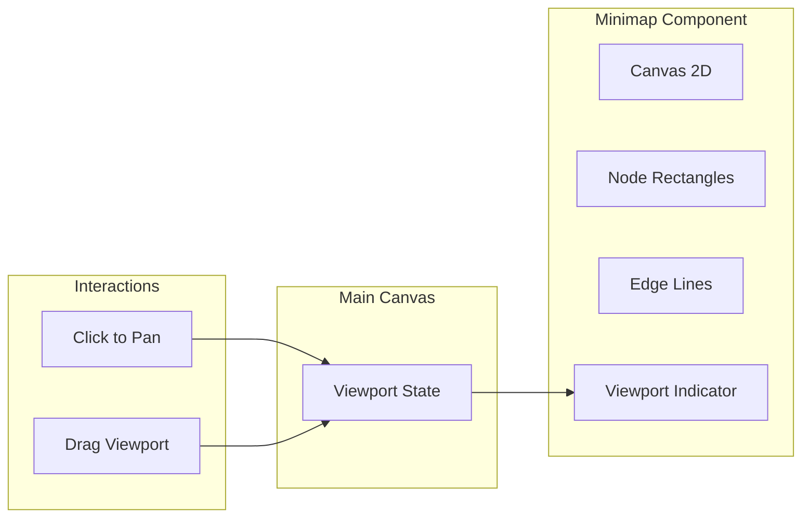

# 06: Minimap

> Canvas-based minimap for navigation on large canvases

**Duration:** 2-3 days
**Dependencies:** [03-virtualized-node-layer.md](./03-virtualized-node-layer.md)
**Package:** `@xnetjs/canvas`

## Overview

The minimap provides an overview of the entire canvas content and allows quick navigation. It renders a simplified view using Canvas 2D, showing nodes as colored rectangles and edges as lines, with a viewport indicator that can be dragged.



## Implementation

### Minimap Component

```typescript
// packages/canvas/src/components/minimap.tsx

import { useRef, useEffect, useCallback, useMemo } from 'react'
import type { CanvasNode, CanvasEdge, Viewport, Rect } from '../types'

interface MinimapProps {
  nodes: CanvasNode[]
  edges: CanvasEdge[]
  viewport: Viewport
  width?: number
  height?: number
  onViewportChange: (changes: Partial<Viewport>) => void
  className?: string
}

export function Minimap({
  nodes,
  edges,
  viewport,
  width = 200,
  height = 150,
  onViewportChange,
  className
}: MinimapProps) {
  const canvasRef = useRef<HTMLCanvasElement>(null)
  const isDraggingRef = useRef(false)

  // Calculate bounds of all content
  const canvasBounds = useMemo(() => {
    if (nodes.length === 0) {
      return { x: -500, y: -500, width: 1000, height: 1000 }
    }

    let minX = Infinity
    let minY = Infinity
    let maxX = -Infinity
    let maxY = -Infinity

    for (const node of nodes) {
      minX = Math.min(minX, node.position.x)
      minY = Math.min(minY, node.position.y)
      maxX = Math.max(maxX, node.position.x + node.position.width)
      maxY = Math.max(maxY, node.position.y + node.position.height)
    }

    // Add padding
    const padding = 100
    return {
      x: minX - padding,
      y: minY - padding,
      width: maxX - minX + padding * 2,
      height: maxY - minY + padding * 2
    }
  }, [nodes])

  // Calculate scale to fit canvas bounds in minimap
  const scale = useMemo(() => {
    if (!canvasBounds.width || !canvasBounds.height) return 1
    const scaleX = (width - 20) / canvasBounds.width
    const scaleY = (height - 20) / canvasBounds.height
    return Math.min(scaleX, scaleY)
  }, [canvasBounds, width, height])

  // Render minimap
  useEffect(() => {
    const canvas = canvasRef.current
    if (!canvas) return

    const ctx = canvas.getContext('2d')!
    const dpr = window.devicePixelRatio || 1

    // Set up canvas size
    canvas.width = width * dpr
    canvas.height = height * dpr
    canvas.style.width = `${width}px`
    canvas.style.height = `${height}px`
    ctx.scale(dpr, dpr)

    // Clear
    ctx.fillStyle = 'rgba(249, 250, 251, 0.95)'
    ctx.fillRect(0, 0, width, height)

    // Calculate offset to center content
    const offsetX = width / 2 - (canvasBounds.x + canvasBounds.width / 2) * scale
    const offsetY = height / 2 - (canvasBounds.y + canvasBounds.height / 2) * scale

    // Draw edges
    ctx.strokeStyle = 'rgba(156, 163, 175, 0.4)'
    ctx.lineWidth = 1
    ctx.beginPath()

    for (const edge of edges) {
      const source = nodes.find((n) => n.id === edge.sourceId)
      const target = nodes.find((n) => n.id === edge.targetId)
      if (!source || !target) continue

      const sx = (source.position.x + source.position.width / 2) * scale + offsetX
      const sy = (source.position.y + source.position.height / 2) * scale + offsetY
      const tx = (target.position.x + target.position.width / 2) * scale + offsetX
      const ty = (target.position.y + target.position.height / 2) * scale + offsetY

      ctx.moveTo(sx, sy)
      ctx.lineTo(tx, ty)
    }
    ctx.stroke()

    // Draw nodes
    for (const node of nodes) {
      const x = node.position.x * scale + offsetX
      const y = node.position.y * scale + offsetY
      const w = Math.max(node.position.width * scale, 3)
      const h = Math.max(node.position.height * scale, 2)

      ctx.fillStyle = getNodeMinimapColor(node)
      ctx.fillRect(x, y, w, h)
    }

    // Draw viewport rectangle
    const visibleRect = viewport.getVisibleRect()
    const vx = visibleRect.x * scale + offsetX
    const vy = visibleRect.y * scale + offsetY
    const vw = visibleRect.width * scale
    const vh = visibleRect.height * scale

    // Viewport fill
    ctx.fillStyle = 'rgba(59, 130, 246, 0.1)'
    ctx.fillRect(vx, vy, vw, vh)

    // Viewport border
    ctx.strokeStyle = 'rgba(59, 130, 246, 0.8)'
    ctx.lineWidth = 2
    ctx.strokeRect(vx, vy, vw, vh)

    // Border
    ctx.strokeStyle = 'rgba(209, 213, 219, 1)'
    ctx.lineWidth = 1
    ctx.strokeRect(0.5, 0.5, width - 1, height - 1)
  }, [nodes, edges, viewport, canvasBounds, scale, width, height])

  // Convert minimap coordinates to canvas coordinates
  const minimapToCanvas = useCallback(
    (minimapX: number, minimapY: number) => {
      const offsetX = width / 2 - (canvasBounds.x + canvasBounds.width / 2) * scale
      const offsetY = height / 2 - (canvasBounds.y + canvasBounds.height / 2) * scale

      return {
        x: (minimapX - offsetX) / scale,
        y: (minimapY - offsetY) / scale
      }
    },
    [canvasBounds, scale, width, height]
  )

  // Handle click to navigate
  const handleMouseDown = useCallback(
    (e: React.MouseEvent) => {
      const rect = canvasRef.current!.getBoundingClientRect()
      const minimapX = e.clientX - rect.left
      const minimapY = e.clientY - rect.top

      const canvasPos = minimapToCanvas(minimapX, minimapY)
      onViewportChange({ x: canvasPos.x, y: canvasPos.y })

      isDraggingRef.current = true
    },
    [minimapToCanvas, onViewportChange]
  )

  const handleMouseMove = useCallback(
    (e: React.MouseEvent) => {
      if (!isDraggingRef.current) return

      const rect = canvasRef.current!.getBoundingClientRect()
      const minimapX = e.clientX - rect.left
      const minimapY = e.clientY - rect.top

      const canvasPos = minimapToCanvas(minimapX, minimapY)
      onViewportChange({ x: canvasPos.x, y: canvasPos.y })
    },
    [minimapToCanvas, onViewportChange]
  )

  const handleMouseUp = useCallback(() => {
    isDraggingRef.current = false
  }, [])

  return (
    <div
      className={`minimap ${className ?? ''}`}
      style={{
        position: 'absolute',
        bottom: 16,
        right: 16,
        borderRadius: 8,
        overflow: 'hidden',
        boxShadow: '0 2px 8px rgba(0,0,0,0.15)',
        cursor: 'crosshair'
      }}
    >
      <canvas
        ref={canvasRef}
        width={width}
        height={height}
        onMouseDown={handleMouseDown}
        onMouseMove={handleMouseMove}
        onMouseUp={handleMouseUp}
        onMouseLeave={handleMouseUp}
      />
    </div>
  )
}

function getNodeMinimapColor(node: CanvasNode): string {
  switch (node.type) {
    case 'card':
      return 'rgba(59, 130, 246, 0.7)'
    case 'embed':
      return 'rgba(16, 185, 129, 0.7)'
    case 'shape':
      return 'rgba(245, 158, 11, 0.7)'
    case 'mermaid':
      return 'rgba(139, 92, 246, 0.7)'
    default:
      return 'rgba(107, 114, 128, 0.7)'
  }
}
```

### Collapsible Minimap

```typescript
// packages/canvas/src/components/collapsible-minimap.tsx

import { useState } from 'react'
import { Minimap } from './minimap'

interface CollapsibleMinimapProps extends React.ComponentProps<typeof Minimap> {
  defaultExpanded?: boolean
}

export function CollapsibleMinimap({
  defaultExpanded = true,
  ...props
}: CollapsibleMinimapProps) {
  const [isExpanded, setIsExpanded] = useState(defaultExpanded)

  return (
    <div
      className="collapsible-minimap"
      style={{
        position: 'absolute',
        bottom: 16,
        right: 16
      }}
    >
      {isExpanded ? (
        <div style={{ position: 'relative' }}>
          <Minimap {...props} />
          <button
            onClick={() => setIsExpanded(false)}
            style={{
              position: 'absolute',
              top: 4,
              right: 4,
              width: 20,
              height: 20,
              border: 'none',
              background: 'rgba(255,255,255,0.8)',
              borderRadius: 4,
              cursor: 'pointer',
              fontSize: 12,
              display: 'flex',
              alignItems: 'center',
              justifyContent: 'center'
            }}
            title="Hide minimap"
          >
            -
          </button>
        </div>
      ) : (
        <button
          onClick={() => setIsExpanded(true)}
          style={{
            width: 32,
            height: 32,
            border: '1px solid #e5e7eb',
            background: 'white',
            borderRadius: 8,
            cursor: 'pointer',
            boxShadow: '0 2px 4px rgba(0,0,0,0.1)',
            display: 'flex',
            alignItems: 'center',
            justifyContent: 'center'
          }}
          title="Show minimap"
        >
          <MapIcon />
        </button>
      )}
    </div>
  )
}

function MapIcon() {
  return (
    <svg width="16" height="16" viewBox="0 0 16 16" fill="none">
      <rect x="2" y="2" width="12" height="12" rx="1" stroke="#6b7280" strokeWidth="1.5" />
      <rect x="4" y="4" width="4" height="3" fill="#3b82f6" />
      <rect x="9" y="8" width="3" height="2" fill="#3b82f6" />
    </svg>
  )
}
```

### Integration

```typescript
// packages/canvas/src/canvas.tsx

import { Minimap } from './components/minimap'
import { useViewport } from './hooks/use-viewport'

export function Canvas({ nodes, edges }: CanvasProps) {
  const viewport = useViewport()

  const handleViewportChange = (changes: Partial<Viewport>) => {
    if (changes.x !== undefined) viewport.x = changes.x
    if (changes.y !== undefined) viewport.y = changes.y
    if (changes.zoom !== undefined) viewport.zoomTo(changes.zoom)
  }

  return (
    <div className="canvas-container">
      {/* Main canvas layers */}
      <WebGLGridLayer viewport={viewport} />
      <EdgeRenderer edges={edges} viewport={viewport} />
      <VirtualizedNodeLayer nodes={nodes} viewport={viewport} />

      {/* Minimap */}
      <Minimap
        nodes={nodes}
        edges={edges}
        viewport={viewport}
        onViewportChange={handleViewportChange}
      />
    </div>
  )
}
```

## Testing

```typescript
describe('Minimap', () => {
  it('renders nodes as rectangles', () => {
    const nodes = [
      { id: 'n1', type: 'card', position: { x: 0, y: 0, width: 100, height: 50 } },
      { id: 'n2', type: 'card', position: { x: 200, y: 100, width: 100, height: 50 } }
    ]

    const { container } = render(
      <Minimap
        nodes={nodes}
        edges={[]}
        viewport={createViewport(1, 100, 50)}
        onViewportChange={vi.fn()}
      />
    )

    expect(container.querySelector('canvas')).toBeTruthy()
  })

  it('calls onViewportChange when clicked', () => {
    const onViewportChange = vi.fn()
    const nodes = [{ id: 'n1', type: 'card', position: { x: 0, y: 0, width: 100, height: 50 } }]

    const { container } = render(
      <Minimap
        nodes={nodes}
        edges={[]}
        viewport={createViewport(1, 0, 0)}
        onViewportChange={onViewportChange}
      />
    )

    const canvas = container.querySelector('canvas')!
    fireEvent.mouseDown(canvas, { clientX: 50, clientY: 50 })

    expect(onViewportChange).toHaveBeenCalled()
  })

  it('supports drag to pan', () => {
    const onViewportChange = vi.fn()
    const nodes = [{ id: 'n1', type: 'card', position: { x: 0, y: 0, width: 100, height: 50 } }]

    const { container } = render(
      <Minimap
        nodes={nodes}
        edges={[]}
        viewport={createViewport(1, 0, 0)}
        onViewportChange={onViewportChange}
      />
    )

    const canvas = container.querySelector('canvas')!

    fireEvent.mouseDown(canvas, { clientX: 50, clientY: 50 })
    fireEvent.mouseMove(canvas, { clientX: 100, clientY: 75 })
    fireEvent.mouseUp(canvas)

    expect(onViewportChange).toHaveBeenCalledTimes(2) // Down + Move
  })

  it('renders edges as lines', () => {
    const nodes = [
      { id: 'n1', type: 'card', position: { x: 0, y: 0, width: 100, height: 50 } },
      { id: 'n2', type: 'card', position: { x: 200, y: 0, width: 100, height: 50 } }
    ]
    const edges = [{ id: 'e1', sourceId: 'n1', targetId: 'n2' }]

    // Visual test - canvas rendering
    const { container } = render(
      <Minimap
        nodes={nodes}
        edges={edges}
        viewport={createViewport(1, 100, 25)}
        onViewportChange={vi.fn()}
      />
    )

    expect(container.querySelector('canvas')).toBeTruthy()
  })

  it('shows viewport rectangle', () => {
    const nodes = Array.from({ length: 100 }, (_, i) => ({
      id: `n${i}`,
      type: 'card',
      position: { x: (i % 10) * 150, y: Math.floor(i / 10) * 100, width: 100, height: 50 }
    }))

    const { container } = render(
      <Minimap
        nodes={nodes}
        edges={[]}
        viewport={createViewport(1, 0, 0)}
        onViewportChange={vi.fn()}
      />
    )

    // Viewport rectangle is rendered on canvas
    expect(container.querySelector('canvas')).toBeTruthy()
  })
})
```

## Validation Gate

- [x] Minimap renders all nodes as colored rectangles
- [x] Minimap renders edges as lines
- [x] Viewport indicator shows current view area
- [x] Click on minimap pans main viewport
- [x] Drag on minimap continuously pans
- [x] Minimap scales to fit all content
- [x] Different node types have different colors
- [x] Minimap can be collapsed/expanded
- [x] Performance: renders 10k nodes smoothly

---

[Back to README](./README.md) | [Previous: Spatial Index](./05-spatial-index.md) | [Next: Navigation Tools ->](./07-navigation-tools.md)
