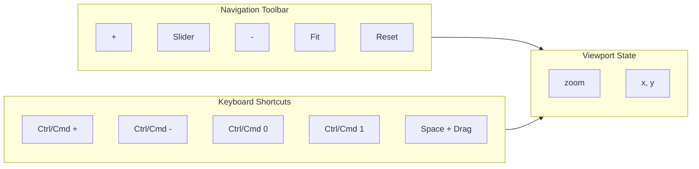

# 07: Navigation Tools

> Zoom controls, fit-to-content, and keyboard shortcuts for canvas navigation

**Duration:** 2 days
**Dependencies:** [06-minimap.md](./06-minimap.md)
**Package:** `@xnet/canvas`

## Overview

Navigation tools provide quick access to common viewport operations: zoom in/out, fit content, reset view, and zoom slider. Combined with keyboard shortcuts, they enable efficient navigation without using the minimap.



## Implementation

### Navigation Tools Component

```typescript
// packages/canvas/src/components/navigation-tools.tsx

import { useCallback } from 'react'
import type { Viewport, Rect } from '../types'

interface NavigationToolsProps {
  viewport: Viewport
  canvasBounds: Rect
  onViewportChange: (changes: Partial<Viewport>) => void
  position?: 'bottom-left' | 'bottom-right' | 'top-left' | 'top-right'
}

export function NavigationTools({
  viewport,
  canvasBounds,
  onViewportChange,
  position = 'bottom-left'
}: NavigationToolsProps) {
  const zoomIn = useCallback(() => {
    const newZoom = Math.min(viewport.zoom * 1.5, 4)
    onViewportChange({ zoom: newZoom })
  }, [viewport.zoom, onViewportChange])

  const zoomOut = useCallback(() => {
    const newZoom = Math.max(viewport.zoom / 1.5, 0.1)
    onViewportChange({ zoom: newZoom })
  }, [viewport.zoom, onViewportChange])

  const zoomTo = useCallback(
    (zoom: number) => {
      const clampedZoom = Math.max(0.1, Math.min(4, zoom))
      onViewportChange({ zoom: clampedZoom })
    },
    [onViewportChange]
  )

  const fitToContent = useCallback(() => {
    if (!canvasBounds.width || !canvasBounds.height) return

    const padding = 50
    const scaleX = (viewport.width - padding * 2) / canvasBounds.width
    const scaleY = (viewport.height - padding * 2) / canvasBounds.height
    const newZoom = Math.min(scaleX, scaleY, 1) // Don't zoom in past 100%

    onViewportChange({
      x: canvasBounds.x + canvasBounds.width / 2,
      y: canvasBounds.y + canvasBounds.height / 2,
      zoom: newZoom
    })
  }, [viewport.width, viewport.height, canvasBounds, onViewportChange])

  const resetView = useCallback(() => {
    onViewportChange({ x: 0, y: 0, zoom: 1 })
  }, [onViewportChange])

  const zoomPercent = Math.round(viewport.zoom * 100)

  const positionStyles = getPositionStyles(position)

  return (
    <div className="navigation-tools" style={positionStyles}>
      <div className="nav-tool-group">
        <button
          className="nav-button"
          onClick={zoomIn}
          title="Zoom In (Ctrl/Cmd +)"
          disabled={viewport.zoom >= 4}
        >
          <PlusIcon />
        </button>

        <div className="zoom-slider-container">
          <input
            type="range"
            min="10"
            max="400"
            value={zoomPercent}
            onChange={(e) => zoomTo(Number(e.target.value) / 100)}
            className="zoom-slider"
            title={`${zoomPercent}%`}
          />
          <span className="zoom-label">{zoomPercent}%</span>
        </div>

        <button
          className="nav-button"
          onClick={zoomOut}
          title="Zoom Out (Ctrl/Cmd -)"
          disabled={viewport.zoom <= 0.1}
        >
          <MinusIcon />
        </button>
      </div>

      <div className="nav-divider" />

      <div className="nav-tool-group">
        <button
          className="nav-button"
          onClick={fitToContent}
          title="Fit to Content (Ctrl/Cmd 1)"
        >
          <FitIcon />
        </button>

        <button
          className="nav-button"
          onClick={resetView}
          title="Reset View (Ctrl/Cmd 0)"
        >
          <ResetIcon />
        </button>
      </div>
    </div>
  )
}

function getPositionStyles(position: string): React.CSSProperties {
  const base: React.CSSProperties = {
    position: 'absolute',
    display: 'flex',
    alignItems: 'center',
    gap: 8,
    padding: '8px 12px',
    background: 'white',
    borderRadius: 8,
    boxShadow: '0 2px 8px rgba(0,0,0,0.1)',
    border: '1px solid #e5e7eb'
  }

  switch (position) {
    case 'bottom-left':
      return { ...base, bottom: 16, left: 16 }
    case 'bottom-right':
      return { ...base, bottom: 16, right: 16 }
    case 'top-left':
      return { ...base, top: 16, left: 16 }
    case 'top-right':
      return { ...base, top: 16, right: 16 }
    default:
      return { ...base, bottom: 16, left: 16 }
  }
}

// Icon components
function PlusIcon() {
  return (
    <svg width="16" height="16" viewBox="0 0 16 16" fill="none">
      <path d="M8 3v10M3 8h10" stroke="currentColor" strokeWidth="1.5" strokeLinecap="round" />
    </svg>
  )
}

function MinusIcon() {
  return (
    <svg width="16" height="16" viewBox="0 0 16 16" fill="none">
      <path d="M3 8h10" stroke="currentColor" strokeWidth="1.5" strokeLinecap="round" />
    </svg>
  )
}

function FitIcon() {
  return (
    <svg width="16" height="16" viewBox="0 0 16 16" fill="none">
      <rect x="2" y="2" width="12" height="12" rx="1" stroke="currentColor" strokeWidth="1.5" />
      <path d="M5 8h6M8 5v6" stroke="currentColor" strokeWidth="1" strokeLinecap="round" />
    </svg>
  )
}

function ResetIcon() {
  return (
    <svg width="16" height="16" viewBox="0 0 16 16" fill="none">
      <circle cx="8" cy="8" r="5" stroke="currentColor" strokeWidth="1.5" />
      <circle cx="8" cy="8" r="1.5" fill="currentColor" />
    </svg>
  )
}
```

### Keyboard Shortcuts Hook

```typescript
// packages/canvas/src/hooks/use-canvas-keyboard.ts

import { useEffect, useCallback } from 'react'
import type { Viewport, Rect } from '../types'

interface UseCanvasKeyboardOptions {
  viewport: Viewport
  canvasBounds: Rect
  onViewportChange: (changes: Partial<Viewport>) => void
  enabled?: boolean
}

export function useCanvasKeyboard({
  viewport,
  canvasBounds,
  onViewportChange,
  enabled = true
}: UseCanvasKeyboardOptions) {
  const handleKeyDown = useCallback(
    (e: KeyboardEvent) => {
      if (!enabled) return

      // Check if user is typing in an input
      if (
        e.target instanceof HTMLInputElement ||
        e.target instanceof HTMLTextAreaElement ||
        (e.target as HTMLElement).isContentEditable
      ) {
        return
      }

      const isMod = e.metaKey || e.ctrlKey

      // Zoom in: Ctrl/Cmd + Plus or Ctrl/Cmd + =
      if (isMod && (e.key === '+' || e.key === '=')) {
        e.preventDefault()
        const newZoom = Math.min(viewport.zoom * 1.5, 4)
        onViewportChange({ zoom: newZoom })
        return
      }

      // Zoom out: Ctrl/Cmd + Minus
      if (isMod && e.key === '-') {
        e.preventDefault()
        const newZoom = Math.max(viewport.zoom / 1.5, 0.1)
        onViewportChange({ zoom: newZoom })
        return
      }

      // Reset view: Ctrl/Cmd + 0
      if (isMod && e.key === '0') {
        e.preventDefault()
        onViewportChange({ x: 0, y: 0, zoom: 1 })
        return
      }

      // Fit to content: Ctrl/Cmd + 1
      if (isMod && e.key === '1') {
        e.preventDefault()
        if (canvasBounds.width && canvasBounds.height) {
          const padding = 50
          const scaleX = (viewport.width - padding * 2) / canvasBounds.width
          const scaleY = (viewport.height - padding * 2) / canvasBounds.height
          const newZoom = Math.min(scaleX, scaleY, 1)

          onViewportChange({
            x: canvasBounds.x + canvasBounds.width / 2,
            y: canvasBounds.y + canvasBounds.height / 2,
            zoom: newZoom
          })
        }
        return
      }

      // Arrow key panning (when no modifier)
      if (!isMod && !e.shiftKey) {
        const panAmount = 50 / viewport.zoom

        switch (e.key) {
          case 'ArrowUp':
            e.preventDefault()
            onViewportChange({ y: viewport.y - panAmount })
            break
          case 'ArrowDown':
            e.preventDefault()
            onViewportChange({ y: viewport.y + panAmount })
            break
          case 'ArrowLeft':
            e.preventDefault()
            onViewportChange({ x: viewport.x - panAmount })
            break
          case 'ArrowRight':
            e.preventDefault()
            onViewportChange({ x: viewport.x + panAmount })
            break
        }
      }
    },
    [enabled, viewport, canvasBounds, onViewportChange]
  )

  useEffect(() => {
    if (!enabled) return

    window.addEventListener('keydown', handleKeyDown)
    return () => window.removeEventListener('keydown', handleKeyDown)
  }, [enabled, handleKeyDown])
}
```

### Space-to-Pan Hook

```typescript
// packages/canvas/src/hooks/use-space-pan.ts

import { useEffect, useRef, useCallback } from 'react'
import type { Viewport } from '../types'

interface UseSpacePanOptions {
  viewport: Viewport
  onViewportChange: (changes: Partial<Viewport>) => void
  containerRef: React.RefObject<HTMLElement>
  enabled?: boolean
}

export function useSpacePan({
  viewport,
  onViewportChange,
  containerRef,
  enabled = true
}: UseSpacePanOptions) {
  const isSpaceHeldRef = useRef(false)
  const isPanningRef = useRef(false)
  const lastPosRef = useRef({ x: 0, y: 0 })

  const handleKeyDown = useCallback(
    (e: KeyboardEvent) => {
      if (e.code === 'Space' && !isSpaceHeldRef.current) {
        // Don't activate if typing
        if (
          e.target instanceof HTMLInputElement ||
          e.target instanceof HTMLTextAreaElement ||
          (e.target as HTMLElement).isContentEditable
        ) {
          return
        }

        e.preventDefault()
        isSpaceHeldRef.current = true
        containerRef.current?.style.setProperty('cursor', 'grab')
      }
    },
    [containerRef]
  )

  const handleKeyUp = useCallback(
    (e: KeyboardEvent) => {
      if (e.code === 'Space') {
        isSpaceHeldRef.current = false
        isPanningRef.current = false
        containerRef.current?.style.setProperty('cursor', '')
      }
    },
    [containerRef]
  )

  const handleMouseDown = useCallback(
    (e: MouseEvent) => {
      if (isSpaceHeldRef.current && e.button === 0) {
        isPanningRef.current = true
        lastPosRef.current = { x: e.clientX, y: e.clientY }
        containerRef.current?.style.setProperty('cursor', 'grabbing')
      }
    },
    [containerRef]
  )

  const handleMouseMove = useCallback(
    (e: MouseEvent) => {
      if (isPanningRef.current) {
        const dx = e.clientX - lastPosRef.current.x
        const dy = e.clientY - lastPosRef.current.y

        onViewportChange({
          x: viewport.x - dx / viewport.zoom,
          y: viewport.y - dy / viewport.zoom
        })

        lastPosRef.current = { x: e.clientX, y: e.clientY }
      }
    },
    [viewport.x, viewport.y, viewport.zoom, onViewportChange]
  )

  const handleMouseUp = useCallback(() => {
    if (isPanningRef.current) {
      isPanningRef.current = false
      containerRef.current?.style.setProperty('cursor', isSpaceHeldRef.current ? 'grab' : '')
    }
  }, [containerRef])

  useEffect(() => {
    if (!enabled) return

    const container = containerRef.current
    if (!container) return

    window.addEventListener('keydown', handleKeyDown)
    window.addEventListener('keyup', handleKeyUp)
    container.addEventListener('mousedown', handleMouseDown)
    window.addEventListener('mousemove', handleMouseMove)
    window.addEventListener('mouseup', handleMouseUp)

    return () => {
      window.removeEventListener('keydown', handleKeyDown)
      window.removeEventListener('keyup', handleKeyUp)
      container.removeEventListener('mousedown', handleMouseDown)
      window.removeEventListener('mousemove', handleMouseMove)
      window.removeEventListener('mouseup', handleMouseUp)
    }
  }, [enabled, handleKeyDown, handleKeyUp, handleMouseDown, handleMouseMove, handleMouseUp])
}
```

### Wheel Zoom Hook

```typescript
// packages/canvas/src/hooks/use-wheel-zoom.ts

import { useEffect, useCallback, useRef } from 'react'
import type { Viewport } from '../types'

interface UseWheelZoomOptions {
  viewport: Viewport
  onViewportChange: (changes: Partial<Viewport>) => void
  containerRef: React.RefObject<HTMLElement>
  enabled?: boolean
  zoomSpeed?: number
}

export function useWheelZoom({
  viewport,
  onViewportChange,
  containerRef,
  enabled = true,
  zoomSpeed = 0.002
}: UseWheelZoomOptions) {
  // Throttle wheel events
  const lastWheelRef = useRef(0)

  const handleWheel = useCallback(
    (e: WheelEvent) => {
      if (!enabled) return

      // Prevent default browser zoom
      if (e.ctrlKey || e.metaKey) {
        e.preventDefault()

        // Throttle
        const now = Date.now()
        if (now - lastWheelRef.current < 16) return
        lastWheelRef.current = now

        // Calculate zoom
        const delta = -e.deltaY * zoomSpeed
        const newZoom = Math.max(0.1, Math.min(4, viewport.zoom * (1 + delta)))

        // Zoom towards cursor position
        const rect = containerRef.current?.getBoundingClientRect()
        if (rect) {
          const cursorX = e.clientX - rect.left - rect.width / 2
          const cursorY = e.clientY - rect.top - rect.height / 2

          // Canvas position at cursor
          const canvasX = cursorX / viewport.zoom + viewport.x
          const canvasY = cursorY / viewport.zoom + viewport.y

          // New viewport position to keep cursor at same canvas position
          const newX = canvasX - cursorX / newZoom
          const newY = canvasY - cursorY / newZoom

          onViewportChange({ x: newX, y: newY, zoom: newZoom })
        } else {
          onViewportChange({ zoom: newZoom })
        }
      }
    },
    [enabled, viewport, onViewportChange, containerRef, zoomSpeed]
  )

  useEffect(() => {
    if (!enabled) return

    const container = containerRef.current
    if (!container) return

    container.addEventListener('wheel', handleWheel, { passive: false })

    return () => {
      container.removeEventListener('wheel', handleWheel)
    }
  }, [enabled, handleWheel, containerRef])
}
```

## Testing

```typescript
describe('NavigationTools', () => {
  it('renders zoom controls', () => {
    const { container } = render(
      <NavigationTools
        viewport={createViewport(1, 0, 0)}
        canvasBounds={{ x: 0, y: 0, width: 1000, height: 1000 }}
        onViewportChange={vi.fn()}
      />
    )

    expect(container.querySelectorAll('button').length).toBeGreaterThanOrEqual(4)
  })

  it('zooms in when + clicked', () => {
    const onViewportChange = vi.fn()

    const { container } = render(
      <NavigationTools
        viewport={createViewport(1, 0, 0)}
        canvasBounds={{ x: 0, y: 0, width: 1000, height: 1000 }}
        onViewportChange={onViewportChange}
      />
    )

    const plusButton = container.querySelector('button')!
    fireEvent.click(plusButton)

    expect(onViewportChange).toHaveBeenCalledWith({ zoom: 1.5 })
  })

  it('fits to content correctly', () => {
    const onViewportChange = vi.fn()
    const viewport = { ...createViewport(1, 0, 0), width: 800, height: 600 }
    const bounds = { x: 100, y: 100, width: 400, height: 300 }

    const { container } = render(
      <NavigationTools
        viewport={viewport}
        canvasBounds={bounds}
        onViewportChange={onViewportChange}
      />
    )

    // Find and click fit button
    const buttons = container.querySelectorAll('button')
    const fitButton = Array.from(buttons).find((b) => b.title?.includes('Fit'))!
    fireEvent.click(fitButton)

    expect(onViewportChange).toHaveBeenCalledWith(
      expect.objectContaining({
        x: 300, // Center of bounds
        y: 250
      })
    )
  })
})

describe('useCanvasKeyboard', () => {
  it('zooms on Ctrl+Plus', () => {
    const onViewportChange = vi.fn()

    renderHook(() =>
      useCanvasKeyboard({
        viewport: createViewport(1, 0, 0),
        canvasBounds: { x: 0, y: 0, width: 1000, height: 1000 },
        onViewportChange
      })
    )

    fireEvent.keyDown(window, { key: '+', ctrlKey: true })

    expect(onViewportChange).toHaveBeenCalledWith({ zoom: 1.5 })
  })

  it('resets on Ctrl+0', () => {
    const onViewportChange = vi.fn()

    renderHook(() =>
      useCanvasKeyboard({
        viewport: createViewport(2, 500, 300),
        canvasBounds: { x: 0, y: 0, width: 1000, height: 1000 },
        onViewportChange
      })
    )

    fireEvent.keyDown(window, { key: '0', ctrlKey: true })

    expect(onViewportChange).toHaveBeenCalledWith({ x: 0, y: 0, zoom: 1 })
  })

  it('pans with arrow keys', () => {
    const onViewportChange = vi.fn()

    renderHook(() =>
      useCanvasKeyboard({
        viewport: createViewport(1, 0, 0),
        canvasBounds: { x: 0, y: 0, width: 1000, height: 1000 },
        onViewportChange
      })
    )

    fireEvent.keyDown(window, { key: 'ArrowRight' })

    expect(onViewportChange).toHaveBeenCalledWith({ x: 50 })
  })
})
```

## Validation Gate

- [x] Zoom in/out buttons work
- [x] Zoom slider adjusts zoom smoothly
- [x] Fit to content centers and scales correctly
- [x] Reset view returns to origin at 100%
- [x] Ctrl/Cmd + Plus zooms in
- [x] Ctrl/Cmd + Minus zooms out
- [x] Ctrl/Cmd + 0 resets view
- [x] Ctrl/Cmd + 1 fits to content
- [x] Arrow keys pan the viewport
- [x] Space + drag pans the viewport
- [x] Ctrl/Cmd + wheel zooms towards cursor
- [x] Keyboard shortcuts don't activate in inputs

---

[Back to README](./README.md) | [Previous: Minimap](./06-minimap.md) | [Next: Live Cursors ->](./08-live-cursors.md)
