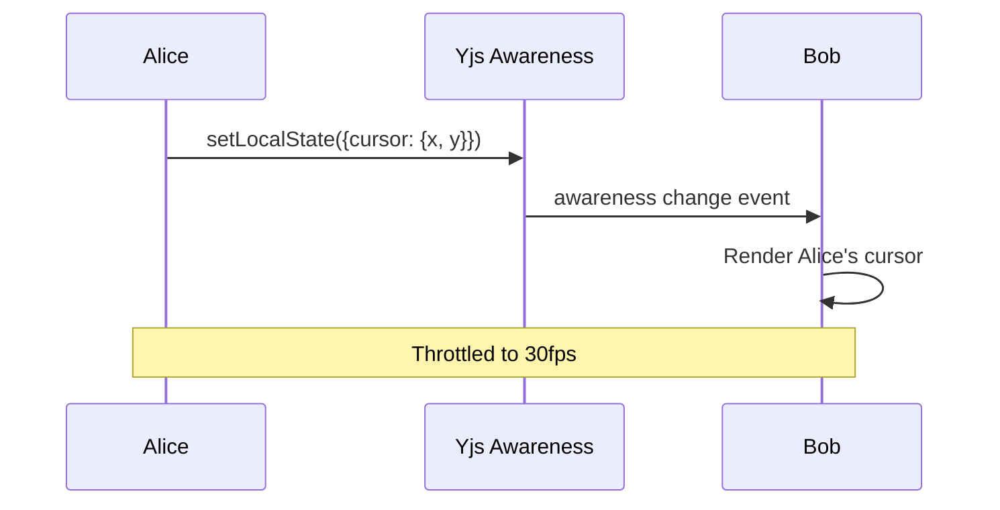

# 08: Live Cursors

> Real-time cursor broadcasting and rendering via Yjs Awareness

**Duration:** 2-3 days
**Dependencies:** [07-navigation-tools.md](./07-navigation-tools.md), `@xnetjs/sync` (Awareness)
**Package:** `@xnetjs/canvas`

## Overview

Live cursors show where other users are pointing on the canvas, providing essential presence awareness for real-time collaboration. We use Yjs Awareness to broadcast cursor positions at 30fps, with smooth interpolation for remote cursors.



## Implementation

### Canvas Presence Manager

```typescript
// packages/canvas/src/presence/canvas-presence.ts

import type { Awareness } from 'y-protocols/awareness'
import { throttle } from '../utils/throttle'

interface CanvasPresence {
  cursor?: { x: number; y: number } // Canvas coordinates
  selection?: string[] // Selected node IDs
  viewport?: { x: number; y: number; zoom: number }
  activity?: 'idle' | 'dragging' | 'drawing' | 'editing'
  user?: {
    name: string
    color: string
    avatar?: string
  }
}

export class CanvasPresenceManager {
  private awareness: Awareness
  private localState: Partial<CanvasPresence> = {}
  private throttledBroadcast: () => void
  private pendingState: Partial<CanvasPresence> = {}

  constructor(awareness: Awareness, user: CanvasPresence['user']) {
    this.awareness = awareness

    // Set initial user info
    this.localState = { user }
    this.awareness.setLocalState(this.localState)

    // Throttle cursor broadcasts to 30fps
    this.throttledBroadcast = throttle(() => {
      this.awareness.setLocalState({
        ...this.localState,
        ...this.pendingState
      })
      this.localState = { ...this.localState, ...this.pendingState }
      this.pendingState = {}
    }, 33) // ~30fps
  }

  /**
   * Update local cursor position (throttled to 30fps).
   */
  updateCursor(position: { x: number; y: number } | null): void {
    this.pendingState.cursor = position ?? undefined
    this.throttledBroadcast()
  }

  /**
   * Update local selection (immediate, not throttled).
   */
  updateSelection(nodeIds: string[]): void {
    this.localState.selection = nodeIds
    this.awareness.setLocalState(this.localState)
  }

  /**
   * Update activity state.
   */
  updateActivity(activity: CanvasPresence['activity']): void {
    this.pendingState.activity = activity
    this.throttledBroadcast()
  }

  /**
   * Get all remote presence states.
   */
  getRemotePresence(): Map<number, CanvasPresence> {
    const states = new Map<number, CanvasPresence>()
    this.awareness.getStates().forEach((state, clientId) => {
      if (clientId !== this.awareness.clientID) {
        states.set(clientId, state as CanvasPresence)
      }
    })
    return states
  }

  /**
   * Subscribe to presence changes.
   */
  onPresenceChange(callback: (states: Map<number, CanvasPresence>) => void): () => void {
    const handler = () => callback(this.getRemotePresence())
    this.awareness.on('change', handler)
    return () => this.awareness.off('change', handler)
  }

  /**
   * Clear local presence (e.g., on unmount).
   */
  clear(): void {
    this.awareness.setLocalState(null)
  }
}
```

### Remote Cursor Component

```typescript
// packages/canvas/src/components/remote-cursor.tsx

import { memo, useMemo } from 'react'
import type { Point } from '../types'

interface RemoteCursorProps {
  position: Point // Screen coordinates
  user: {
    name: string
    color: string
    avatar?: string
  }
  activity?: 'idle' | 'dragging' | 'drawing' | 'editing'
  isStale?: boolean
}

export const RemoteCursor = memo(function RemoteCursor({
  position,
  user,
  activity,
  isStale
}: RemoteCursorProps) {
  const cursorPath = useMemo(() => {
    // Default pointer cursor shape
    return 'M5.65 2.65L18.35 12.35L12.35 13.35L10.35 19.35L5.65 2.65Z'
  }, [])

  return (
    <div
      className="remote-cursor"
      style={{
        position: 'absolute',
        left: position.x,
        top: position.y,
        pointerEvents: 'none',
        opacity: isStale ? 0.3 : 1,
        transition: 'left 50ms linear, top 50ms linear, opacity 300ms ease',
        zIndex: 1000
      }}
    >
      {/* Cursor icon */}
      <svg
        width="24"
        height="24"
        viewBox="0 0 24 24"
        style={{ filter: 'drop-shadow(0 1px 2px rgba(0,0,0,0.2))' }}
      >
        <path d={cursorPath} fill={user.color} stroke="white" strokeWidth="1.5" />
      </svg>

      {/* Activity indicator */}
      {activity === 'drawing' && (
        <div
          className="activity-indicator"
          style={{
            position: 'absolute',
            top: -4,
            right: -4,
            width: 8,
            height: 8,
            borderRadius: '50%',
            backgroundColor: '#10b981',
            border: '2px solid white'
          }}
        />
      )}

      {/* Name tag */}
      <div
        className="cursor-name-tag"
        style={{
          position: 'absolute',
          left: 16,
          top: 16,
          backgroundColor: user.color,
          color: 'white',
          fontSize: 11,
          fontWeight: 500,
          padding: '2px 6px',
          borderRadius: 4,
          whiteSpace: 'nowrap',
          boxShadow: '0 1px 3px rgba(0,0,0,0.2)'
        }}
      >
        {user.name}
      </div>
    </div>
  )
})
```

### Presence Overlay

```typescript
// packages/canvas/src/layers/presence-overlay.tsx

import { useEffect, useState, useMemo } from 'react'
import { RemoteCursor } from '../components/remote-cursor'
import type { CanvasPresenceManager } from '../presence/canvas-presence'
import type { Viewport } from '../types'

interface PresenceOverlayProps {
  presenceManager: CanvasPresenceManager
  viewport: Viewport
}

interface RemoteCursorState {
  clientId: number
  position: { x: number; y: number }
  user: { name: string; color: string }
  activity?: string
  lastSeen: number
}

const STALE_THRESHOLD = 5000 // 5 seconds

export function PresenceOverlay({ presenceManager, viewport }: PresenceOverlayProps) {
  const [remoteCursors, setRemoteCursors] = useState<RemoteCursorState[]>([])

  // Subscribe to presence changes
  useEffect(() => {
    const updateCursors = () => {
      const presence = presenceManager.getRemotePresence()
      const cursors: RemoteCursorState[] = []

      presence.forEach((state, clientId) => {
        if (state.cursor && state.user) {
          cursors.push({
            clientId,
            position: state.cursor,
            user: state.user,
            activity: state.activity,
            lastSeen: Date.now()
          })
        }
      })

      setRemoteCursors(cursors)
    }

    const unsubscribe = presenceManager.onPresenceChange(updateCursors)
    updateCursors() // Initial load

    return unsubscribe
  }, [presenceManager])

  // Convert canvas coordinates to screen coordinates
  const screenCursors = useMemo(() => {
    return remoteCursors.map((cursor) => ({
      ...cursor,
      screenPosition: viewport.canvasToScreen(cursor.position.x, cursor.position.y),
      isStale: Date.now() - cursor.lastSeen > STALE_THRESHOLD
    }))
  }, [remoteCursors, viewport])

  return (
    <div
      className="presence-overlay"
      style={{
        position: 'absolute',
        top: 0,
        left: 0,
        width: '100%',
        height: '100%',
        pointerEvents: 'none',
        overflow: 'hidden'
      }}
    >
      {screenCursors.map((cursor) => (
        <RemoteCursor
          key={cursor.clientId}
          position={cursor.screenPosition}
          user={cursor.user}
          activity={cursor.activity as any}
          isStale={cursor.isStale}
        />
      ))}
    </div>
  )
}
```

### Cursor Tracking Hook

```typescript
// packages/canvas/src/hooks/use-cursor-tracking.ts

import { useEffect, useRef, useCallback } from 'react'
import type { CanvasPresenceManager } from '../presence/canvas-presence'
import type { Viewport } from '../types'

interface UseCursorTrackingOptions {
  presenceManager: CanvasPresenceManager
  viewport: Viewport
  containerRef: React.RefObject<HTMLElement>
  enabled?: boolean
}

export function useCursorTracking({
  presenceManager,
  viewport,
  containerRef,
  enabled = true
}: UseCursorTrackingOptions) {
  const isInsideRef = useRef(false)

  const handleMouseMove = useCallback(
    (e: MouseEvent) => {
      if (!enabled || !containerRef.current) return

      const rect = containerRef.current.getBoundingClientRect()
      const screenX = e.clientX - rect.left
      const screenY = e.clientY - rect.top

      // Convert to canvas coordinates
      const canvasPos = viewport.screenToCanvas(screenX, screenY)

      presenceManager.updateCursor(canvasPos)
    },
    [enabled, viewport, presenceManager, containerRef]
  )

  const handleMouseEnter = useCallback(() => {
    isInsideRef.current = true
  }, [])

  const handleMouseLeave = useCallback(() => {
    isInsideRef.current = false
    if (enabled) {
      presenceManager.updateCursor(null)
    }
  }, [enabled, presenceManager])

  useEffect(() => {
    if (!enabled) return

    const container = containerRef.current
    if (!container) return

    container.addEventListener('mousemove', handleMouseMove)
    container.addEventListener('mouseenter', handleMouseEnter)
    container.addEventListener('mouseleave', handleMouseLeave)

    return () => {
      container.removeEventListener('mousemove', handleMouseMove)
      container.removeEventListener('mouseenter', handleMouseEnter)
      container.removeEventListener('mouseleave', handleMouseLeave)
    }
  }, [enabled, handleMouseMove, handleMouseEnter, handleMouseLeave, containerRef])

  // Clear cursor on unmount
  useEffect(() => {
    return () => {
      presenceManager.updateCursor(null)
    }
  }, [presenceManager])
}
```

### Integration

```typescript
// packages/canvas/src/canvas.tsx

import { useRef, useMemo, useEffect } from 'react'
import { CanvasPresenceManager } from './presence/canvas-presence'
import { PresenceOverlay } from './layers/presence-overlay'
import { useCursorTracking } from './hooks/use-cursor-tracking'

interface CanvasProps {
  awareness: Awareness
  user: { name: string; color: string }
  // ... other props
}

export function Canvas({ awareness, user, nodes, edges }: CanvasProps) {
  const containerRef = useRef<HTMLDivElement>(null)
  const viewport = useViewport()

  // Create presence manager
  const presenceManager = useMemo(
    () => new CanvasPresenceManager(awareness, user),
    [awareness, user]
  )

  // Track cursor movement
  useCursorTracking({
    presenceManager,
    viewport,
    containerRef
  })

  // Cleanup on unmount
  useEffect(() => {
    return () => presenceManager.clear()
  }, [presenceManager])

  return (
    <div ref={containerRef} className="canvas-container">
      <WebGLGridLayer viewport={viewport} />
      <EdgeRenderer edges={edges} viewport={viewport} />
      <VirtualizedNodeLayer nodes={nodes} viewport={viewport} />

      {/* Presence layer on top */}
      <PresenceOverlay presenceManager={presenceManager} viewport={viewport} />

      <Minimap nodes={nodes} edges={edges} viewport={viewport} />
      <NavigationTools viewport={viewport} />
    </div>
  )
}
```

## Testing

```typescript
describe('CanvasPresenceManager', () => {
  let awareness: MockAwareness
  let manager: CanvasPresenceManager

  beforeEach(() => {
    awareness = createMockAwareness()
    manager = new CanvasPresenceManager(awareness, { name: 'Alice', color: '#3b82f6' })
  })

  it('sets initial user state', () => {
    expect(awareness.getLocalState()).toMatchObject({
      user: { name: 'Alice', color: '#3b82f6' }
    })
  })

  it('updates cursor position', async () => {
    manager.updateCursor({ x: 100, y: 200 })

    // Wait for throttle
    await sleep(50)

    expect(awareness.getLocalState()).toMatchObject({
      cursor: { x: 100, y: 200 }
    })
  })

  it('throttles cursor updates', async () => {
    const setStateSpy = vi.spyOn(awareness, 'setLocalState')

    // Rapid updates
    for (let i = 0; i < 100; i++) {
      manager.updateCursor({ x: i, y: i })
    }

    await sleep(100)

    // Should have called setLocalState far fewer than 100 times
    expect(setStateSpy.mock.calls.length).toBeLessThan(10)
  })

  it('clears cursor on leave', async () => {
    manager.updateCursor({ x: 100, y: 200 })
    await sleep(50)

    manager.updateCursor(null)
    await sleep(50)

    expect(awareness.getLocalState().cursor).toBeUndefined()
  })
})

describe('PresenceOverlay', () => {
  it('renders remote cursors', () => {
    const presenceManager = createMockPresenceManager([
      { clientId: 1, cursor: { x: 100, y: 100 }, user: { name: 'Bob', color: '#10b981' } }
    ])

    const { container } = render(
      <PresenceOverlay
        presenceManager={presenceManager}
        viewport={createViewport(1, 0, 0)}
      />
    )

    expect(container.querySelector('.remote-cursor')).toBeTruthy()
    expect(container.textContent).toContain('Bob')
  })

  it('converts canvas to screen coordinates', () => {
    const presenceManager = createMockPresenceManager([
      { clientId: 1, cursor: { x: 500, y: 300 }, user: { name: 'Bob', color: '#10b981' } }
    ])

    const viewport = {
      ...createViewport(2, 250, 150), // Zoomed and panned
      canvasToScreen: (x: number, y: number) => ({
        x: (x - 250) * 2 + 400,
        y: (y - 150) * 2 + 300
      })
    }

    const { container } = render(
      <PresenceOverlay presenceManager={presenceManager} viewport={viewport} />
    )

    const cursor = container.querySelector('.remote-cursor') as HTMLElement
    // Cursor should be at calculated screen position
    expect(cursor.style.left).toBe('900px') // (500-250)*2 + 400
    expect(cursor.style.top).toBe('600px') // (300-150)*2 + 300
  })

  it('marks stale cursors', async () => {
    vi.useFakeTimers()

    const presenceManager = createMockPresenceManager([
      { clientId: 1, cursor: { x: 100, y: 100 }, user: { name: 'Bob', color: '#10b981' } }
    ])

    const { container } = render(
      <PresenceOverlay
        presenceManager={presenceManager}
        viewport={createViewport(1, 0, 0)}
      />
    )

    // Initially not stale
    let cursor = container.querySelector('.remote-cursor') as HTMLElement
    expect(cursor.style.opacity).not.toBe('0.3')

    // Advance time past threshold
    vi.advanceTimersByTime(6000)

    // Re-render would show stale cursor
    // (In real test, would need to trigger re-render)

    vi.useRealTimers()
  })
})
```

## Validation Gate

- [x] Local cursor broadcasts at 30fps max
- [x] Remote cursors appear within 50ms of update
- [x] Cursor positions are in canvas coordinates
- [x] Screen rendering adapts to viewport transform
- [x] Cursor shows user name and color
- [x] Stale cursors (>5s) fade out
- [x] Cursor clears when mouse leaves canvas
- [x] Activity indicators show (drawing, editing)
- [x] Throttling prevents network spam
- [x] Cleanup on component unmount

---

[Back to README](./README.md) | [Previous: Navigation Tools](./07-navigation-tools.md) | [Next: Selection Presence ->](./09-selection-presence.md)
