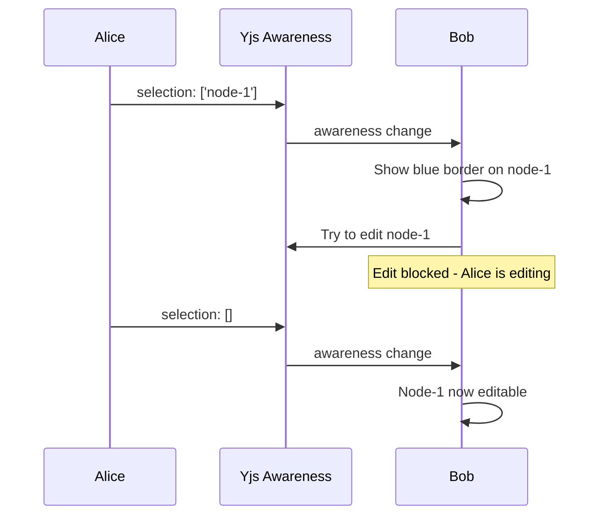

# 09: Selection Presence

> Remote selection indicators and edit locking for collaborative editing

**Duration:** 2 days
**Dependencies:** [08-live-cursors.md](./08-live-cursors.md)
**Package:** `@xnet/canvas`

## Overview

Selection presence shows which nodes other users have selected, and edit locking prevents concurrent editing of the same node. This builds on the presence system to provide visual feedback and conflict prevention.



## Implementation

### Selection Lock Manager

```typescript
// packages/canvas/src/presence/selection-lock.ts

import type { Awareness } from 'y-protocols/awareness'

interface SelectionLock {
  nodeId: string
  ownerId: number // Awareness clientID
  ownerName: string
  ownerColor: string
  acquiredAt: number
}

interface PresenceState {
  selection?: string[]
  editingNodeId?: string
  user?: { name: string; color: string }
}

export class SelectionLockManager {
  private awareness: Awareness
  private locks = new Map<string, SelectionLock>()
  private listeners = new Set<(locks: Map<string, SelectionLock>) => void>()

  constructor(awareness: Awareness) {
    this.awareness = awareness

    // Listen for remote lock changes
    awareness.on('change', () => {
      this.updateLocksFromAwareness()
    })

    // Initial sync
    this.updateLocksFromAwareness()
  }

  /**
   * Try to acquire an edit lock on a node.
   * Returns true if lock acquired, false if already locked by someone else.
   */
  tryAcquireLock(nodeId: string): boolean {
    const existingLock = this.locks.get(nodeId)

    // Already locked by someone else?
    if (existingLock && existingLock.ownerId !== this.awareness.clientID) {
      return false
    }

    // Acquire lock
    const current = (this.awareness.getLocalState() as PresenceState) ?? {}
    this.awareness.setLocalState({
      ...current,
      editingNodeId: nodeId
    })

    return true
  }

  /**
   * Release the lock on a node.
   */
  releaseLock(nodeId: string): void {
    const current = (this.awareness.getLocalState() as PresenceState) ?? {}

    if (current.editingNodeId === nodeId) {
      const { editingNodeId, ...rest } = current
      this.awareness.setLocalState(rest)
    }
  }

  /**
   * Check if a node is locked by someone else.
   */
  isLockedByOther(nodeId: string): SelectionLock | null {
    const lock = this.locks.get(nodeId)
    if (lock && lock.ownerId !== this.awareness.clientID) {
      return lock
    }
    return null
  }

  /**
   * Get all current locks.
   */
  getAllLocks(): Map<string, SelectionLock> {
    return new Map(this.locks)
  }

  /**
   * Get remote selections (nodes selected by others).
   */
  getRemoteSelections(): Map<number, { nodeIds: string[]; user: { name: string; color: string } }> {
    const selections = new Map()

    this.awareness.getStates().forEach((state, clientId) => {
      if (clientId === this.awareness.clientID) return

      const presence = state as PresenceState
      if (presence.selection?.length && presence.user) {
        selections.set(clientId, {
          nodeIds: presence.selection,
          user: presence.user
        })
      }
    })

    return selections
  }

  /**
   * Subscribe to lock changes.
   */
  onLocksChange(callback: (locks: Map<string, SelectionLock>) => void): () => void {
    this.listeners.add(callback)
    return () => this.listeners.delete(callback)
  }

  private updateLocksFromAwareness(): void {
    const newLocks = new Map<string, SelectionLock>()

    this.awareness.getStates().forEach((state, clientId) => {
      const presence = state as PresenceState

      if (presence.editingNodeId && presence.user) {
        newLocks.set(presence.editingNodeId, {
          nodeId: presence.editingNodeId,
          ownerId: clientId,
          ownerName: presence.user.name,
          ownerColor: presence.user.color,
          acquiredAt: Date.now()
        })
      }
    })

    this.locks = newLocks

    // Notify listeners
    this.listeners.forEach((cb) => cb(newLocks))
  }
}
```

### Selection Indicator Component

```typescript
// packages/canvas/src/components/selection-indicator.tsx

import { memo } from 'react'
import type { Rect } from '../types'

interface SelectionIndicatorProps {
  bounds: Rect // Screen coordinates
  user: { name: string; color: string }
  isEditLocked?: boolean
}

export const SelectionIndicator = memo(function SelectionIndicator({
  bounds,
  user,
  isEditLocked
}: SelectionIndicatorProps) {
  return (
    <div
      className="selection-indicator"
      style={{
        position: 'absolute',
        left: bounds.x - 2,
        top: bounds.y - 2,
        width: bounds.width + 4,
        height: bounds.height + 4,
        border: `2px solid ${user.color}`,
        borderRadius: 6,
        pointerEvents: 'none',
        boxShadow: `0 0 0 1px white, 0 0 8px ${user.color}40`
      }}
    >
      {/* User label */}
      <div
        className="selection-label"
        style={{
          position: 'absolute',
          top: -20,
          left: -2,
          backgroundColor: user.color,
          color: 'white',
          fontSize: 10,
          fontWeight: 500,
          padding: '2px 6px',
          borderRadius: '4px 4px 0 0',
          whiteSpace: 'nowrap'
        }}
      >
        {user.name}
        {isEditLocked && ' (editing)'}
      </div>

      {/* Lock icon for edit-locked nodes */}
      {isEditLocked && (
        <div
          className="lock-icon"
          style={{
            position: 'absolute',
            top: -20,
            right: -2,
            backgroundColor: user.color,
            borderRadius: 4,
            padding: 2,
            display: 'flex',
            alignItems: 'center',
            justifyContent: 'center'
          }}
        >
          <svg width="12" height="12" viewBox="0 0 12 12" fill="white">
            <rect x="2" y="5" width="8" height="6" rx="1" />
            <path
              d="M3.5 5V3.5a2.5 2.5 0 015 0V5"
              fill="none"
              stroke="white"
              strokeWidth="1.5"
            />
          </svg>
        </div>
      )}
    </div>
  )
})
```

### Remote Selections Overlay

```typescript
// packages/canvas/src/layers/remote-selections-overlay.tsx

import { useEffect, useState, useMemo } from 'react'
import { SelectionIndicator } from '../components/selection-indicator'
import type { SelectionLockManager } from '../presence/selection-lock'
import type { Viewport, CanvasNode } from '../types'

interface RemoteSelectionsOverlayProps {
  lockManager: SelectionLockManager
  viewport: Viewport
  nodes: Map<string, CanvasNode>
}

export function RemoteSelectionsOverlay({
  lockManager,
  viewport,
  nodes
}: RemoteSelectionsOverlayProps) {
  const [remoteSelections, setRemoteSelections] = useState<
    Array<{
      clientId: number
      nodeIds: string[]
      user: { name: string; color: string }
    }>
  >([])
  const [locks, setLocks] = useState(new Map())

  // Subscribe to selection changes
  useEffect(() => {
    const updateSelections = () => {
      const selections = lockManager.getRemoteSelections()
      setRemoteSelections(
        Array.from(selections.entries()).map(([clientId, data]) => ({
          clientId,
          ...data
        }))
      )
    }

    // Also subscribe to lock changes
    const unsubscribeLocks = lockManager.onLocksChange(setLocks)

    // Initial load
    updateSelections()

    // Subscribe to awareness changes
    const interval = setInterval(updateSelections, 100) // Poll for simplicity

    return () => {
      clearInterval(interval)
      unsubscribeLocks()
    }
  }, [lockManager])

  // Convert to screen coordinates
  const indicators = useMemo(() => {
    const result: Array<{
      key: string
      bounds: Rect
      user: { name: string; color: string }
      isEditLocked: boolean
    }> = []

    for (const selection of remoteSelections) {
      for (const nodeId of selection.nodeIds) {
        const node = nodes.get(nodeId)
        if (!node) continue

        // Convert node bounds to screen
        const screenPos = viewport.canvasToScreen(node.position.x, node.position.y)
        const screenBounds = {
          x: screenPos.x,
          y: screenPos.y,
          width: node.position.width * viewport.zoom,
          height: node.position.height * viewport.zoom
        }

        // Check if this node is edit-locked by this user
        const lock = locks.get(nodeId)
        const isEditLocked = lock?.ownerId === selection.clientId

        result.push({
          key: `${selection.clientId}-${nodeId}`,
          bounds: screenBounds,
          user: selection.user,
          isEditLocked
        })
      }
    }

    return result
  }, [remoteSelections, locks, nodes, viewport])

  return (
    <div
      className="remote-selections-overlay"
      style={{
        position: 'absolute',
        top: 0,
        left: 0,
        width: '100%',
        height: '100%',
        pointerEvents: 'none',
        overflow: 'hidden'
      }}
    >
      {indicators.map((indicator) => (
        <SelectionIndicator
          key={indicator.key}
          bounds={indicator.bounds}
          user={indicator.user}
          isEditLocked={indicator.isEditLocked}
        />
      ))}
    </div>
  )
}
```

### Edit Lock Hook

```typescript
// packages/canvas/src/hooks/use-edit-lock.ts

import { useCallback, useEffect, useRef } from 'react'
import type { SelectionLockManager } from '../presence/selection-lock'

interface UseEditLockOptions {
  lockManager: SelectionLockManager
  nodeId: string | null
  onLockFailed?: (lockedBy: { name: string; color: string }) => void
}

export function useEditLock({ lockManager, nodeId, onLockFailed }: UseEditLockOptions) {
  const currentLockRef = useRef<string | null>(null)

  const acquireLock = useCallback(
    (id: string): boolean => {
      const lock = lockManager.isLockedByOther(id)

      if (lock) {
        onLockFailed?.({ name: lock.ownerName, color: lock.ownerColor })
        return false
      }

      const acquired = lockManager.tryAcquireLock(id)

      if (acquired) {
        currentLockRef.current = id
      }

      return acquired
    },
    [lockManager, onLockFailed]
  )

  const releaseLock = useCallback(() => {
    if (currentLockRef.current) {
      lockManager.releaseLock(currentLockRef.current)
      currentLockRef.current = null
    }
  }, [lockManager])

  // Release lock on unmount or when nodeId changes
  useEffect(() => {
    return () => {
      if (currentLockRef.current) {
        lockManager.releaseLock(currentLockRef.current)
        currentLockRef.current = null
      }
    }
  }, [lockManager])

  // Auto-acquire lock when nodeId provided
  useEffect(() => {
    if (nodeId) {
      acquireLock(nodeId)
    } else {
      releaseLock()
    }
  }, [nodeId, acquireLock, releaseLock])

  return {
    acquireLock,
    releaseLock,
    isLockedByOther: useCallback((id: string) => lockManager.isLockedByOther(id), [lockManager])
  }
}
```

### Integration with Node Component

```typescript
// packages/canvas/src/components/full-canvas-node.tsx

export const FullCanvasNode = memo(function FullCanvasNode({
  node,
  isSelected,
  lockManager,
  onNodeChange,
  onNodeSelect
}: FullCanvasNodeProps) {
  const [isEditing, setIsEditing] = useState(false)
  const [lockError, setLockError] = useState<string | null>(null)

  const { acquireLock, releaseLock, isLockedByOther } = useEditLock({
    lockManager,
    nodeId: isEditing ? node.id : null,
    onLockFailed: (lockedBy) => {
      setLockError(`${lockedBy.name} is editing this node`)
      setTimeout(() => setLockError(null), 3000)
    }
  })

  const handleDoubleClick = () => {
    const lock = isLockedByOther(node.id)
    if (lock) {
      setLockError(`${lock.ownerName} is editing this node`)
      setTimeout(() => setLockError(null), 3000)
      return
    }

    setIsEditing(true)
  }

  const handleBlur = () => {
    setIsEditing(false)
    releaseLock()
  }

  const remoteLock = isLockedByOther(node.id)

  return (
    <div
      className={`canvas-node ${remoteLock ? 'locked' : ''}`}
      onDoubleClick={handleDoubleClick}
      style={{
        opacity: remoteLock ? 0.7 : 1,
        cursor: remoteLock ? 'not-allowed' : undefined
      }}
    >
      {/* Lock indicator */}
      {remoteLock && (
        <div className="lock-tooltip">
          Editing by {remoteLock.ownerName}
        </div>
      )}

      {/* Error toast */}
      {lockError && (
        <div className="lock-error-toast">
          {lockError}
        </div>
      )}

      {/* Node content */}
      <NodeContent
        node={node}
        isEditing={isEditing}
        onBlur={handleBlur}
        onNodeChange={onNodeChange}
      />
    </div>
  )
})
```

## Testing

```typescript
describe('SelectionLockManager', () => {
  let awareness: MockAwareness
  let manager: SelectionLockManager

  beforeEach(() => {
    awareness = createMockAwareness()
    manager = new SelectionLockManager(awareness)
  })

  it('acquires lock successfully', () => {
    const acquired = manager.tryAcquireLock('node-1')

    expect(acquired).toBe(true)
    expect(awareness.getLocalState().editingNodeId).toBe('node-1')
  })

  it('prevents lock when already locked by other', () => {
    // Simulate remote user holding lock
    awareness.setRemoteState(999, {
      editingNodeId: 'node-1',
      user: { name: 'Bob', color: '#10b981' }
    })

    const acquired = manager.tryAcquireLock('node-1')

    expect(acquired).toBe(false)
  })

  it('allows same user to re-acquire lock', () => {
    manager.tryAcquireLock('node-1')
    const reacquired = manager.tryAcquireLock('node-1')

    expect(reacquired).toBe(true)
  })

  it('releases lock correctly', () => {
    manager.tryAcquireLock('node-1')
    manager.releaseLock('node-1')

    expect(awareness.getLocalState().editingNodeId).toBeUndefined()
  })

  it('detects lock by other user', () => {
    awareness.setRemoteState(999, {
      editingNodeId: 'node-1',
      user: { name: 'Bob', color: '#10b981' }
    })

    const lock = manager.isLockedByOther('node-1')

    expect(lock).not.toBeNull()
    expect(lock?.ownerName).toBe('Bob')
  })

  it('returns remote selections', () => {
    awareness.setRemoteState(999, {
      selection: ['node-1', 'node-2'],
      user: { name: 'Bob', color: '#10b981' }
    })

    const selections = manager.getRemoteSelections()

    expect(selections.size).toBe(1)
    expect(selections.get(999)?.nodeIds).toEqual(['node-1', 'node-2'])
  })
})

describe('SelectionIndicator', () => {
  it('renders with user color', () => {
    const { container } = render(
      <SelectionIndicator
        bounds={{ x: 100, y: 100, width: 200, height: 100 }}
        user={{ name: 'Bob', color: '#10b981' }}
      />
    )

    const indicator = container.querySelector('.selection-indicator') as HTMLElement
    expect(indicator.style.borderColor).toBe('rgb(16, 185, 129)')
  })

  it('shows lock icon when editing', () => {
    const { container } = render(
      <SelectionIndicator
        bounds={{ x: 100, y: 100, width: 200, height: 100 }}
        user={{ name: 'Bob', color: '#10b981' }}
        isEditLocked
      />
    )

    expect(container.querySelector('.lock-icon')).toBeTruthy()
    expect(container.textContent).toContain('editing')
  })
})
```

## Validation Gate

- [x] Remote selections show colored borders
- [x] User name appears on selection indicator
- [x] Edit lock prevents concurrent editing
- [x] Lock icon shows when node is being edited
- [x] Failed lock attempt shows error message
- [x] Lock releases on blur/unmount
- [x] Multiple users can select same node (but not edit)
- [x] Locked nodes appear dimmed
- [x] Lock state syncs within 100ms

---

[Back to README](./README.md) | [Previous: Live Cursors](./08-live-cursors.md) | [Next: Mermaid Diagrams ->](./10-mermaid-diagrams.md)
