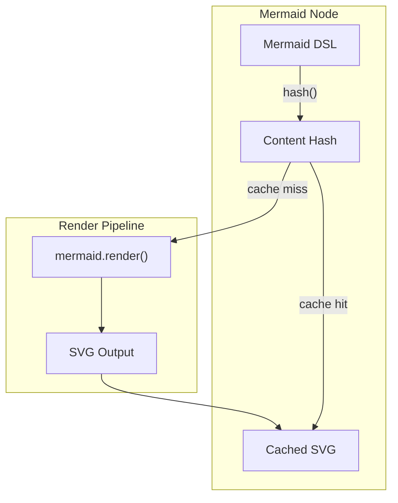

# 10: Mermaid Diagrams

> Embedded Mermaid diagram nodes with live preview and SVG caching

**Duration:** 3-4 days
**Dependencies:** [03-virtualized-node-layer.md](./03-virtualized-node-layer.md)
**Package:** `@xnet/canvas`

## Overview

Mermaid nodes allow embedding diagrams (flowcharts, sequence diagrams, etc.) directly on the canvas. The diagram is rendered to SVG using the Mermaid library, with caching to avoid re-rendering on every pan/zoom.



## Implementation

### Mermaid Node Type

```typescript
// packages/canvas/src/nodes/types.ts

export interface MermaidNode extends BaseCanvasNode {
  type: 'mermaid'
  properties: {
    code: string // Mermaid DSL
    theme?: 'default' | 'dark' | 'forest' | 'neutral'
    renderedSvg?: string // Cached SVG output
    lastRenderHash?: string // Hash of code that produced cached SVG
  }
}
```

### Mermaid Node Component

```typescript
// packages/canvas/src/nodes/mermaid-node.tsx

import { useEffect, useState, useRef, useCallback, memo } from 'react'
import mermaid from 'mermaid'

interface MermaidNodeProps {
  node: MermaidNode
  isEditing: boolean
  onUpdate: (changes: Partial<MermaidNode['properties']>) => void
  onStartEdit: () => void
  onEndEdit: () => void
}

// Initialize mermaid once
let mermaidInitialized = false
function initMermaid() {
  if (mermaidInitialized) return
  mermaid.initialize({
    startOnLoad: false,
    securityLevel: 'loose',
    theme: 'default',
    flowchart: { useMaxWidth: true }
  })
  mermaidInitialized = true
}

export const MermaidNodeComponent = memo(function MermaidNodeComponent({
  node,
  isEditing,
  onUpdate,
  onStartEdit,
  onEndEdit
}: MermaidNodeProps) {
  const [svg, setSvg] = useState<string>(node.properties.renderedSvg ?? '')
  const [error, setError] = useState<string | null>(null)
  const [isRendering, setIsRendering] = useState(false)
  const containerRef = useRef<HTMLDivElement>(null)
  const editorRef = useRef<HTMLTextAreaElement>(null)

  // Hash function for cache invalidation
  const hashCode = useCallback((str: string) => {
    let hash = 0
    for (let i = 0; i < str.length; i++) {
      const char = str.charCodeAt(i)
      hash = (hash << 5) - hash + char
      hash = hash & hash
    }
    return String(hash)
  }, [])

  // Render mermaid diagram
  useEffect(() => {
    if (isEditing) return // Don't re-render while editing

    const renderDiagram = async () => {
      const code = node.properties.code?.trim()
      if (!code) {
        setSvg('')
        setError(null)
        return
      }

      const hash = hashCode(code)

      // Check cache
      if (hash === node.properties.lastRenderHash && node.properties.renderedSvg) {
        setSvg(node.properties.renderedSvg)
        setError(null)
        return
      }

      setIsRendering(true)
      initMermaid()

      try {
        const id = `mermaid-${node.id}-${Date.now()}`
        const { svg: renderedSvg } = await mermaid.render(id, code)

        setSvg(renderedSvg)
        setError(null)

        // Cache the result
        onUpdate({
          renderedSvg,
          lastRenderHash: hash
        })
      } catch (err) {
        const message = err instanceof Error ? err.message : 'Failed to render diagram'
        setError(message)
        setSvg('')
      } finally {
        setIsRendering(false)
      }
    }

    renderDiagram()
  }, [node.properties.code, node.id, isEditing, hashCode, onUpdate])

  // Focus editor on edit start
  useEffect(() => {
    if (isEditing && editorRef.current) {
      editorRef.current.focus()
      editorRef.current.selectionStart = editorRef.current.value.length
    }
  }, [isEditing])

  const handleCodeChange = (e: React.ChangeEvent<HTMLTextAreaElement>) => {
    onUpdate({ code: e.target.value })
  }

  const handleKeyDown = (e: React.KeyboardEvent) => {
    if (e.key === 'Escape') {
      onEndEdit()
    }
    // Allow Tab for indentation
    if (e.key === 'Tab') {
      e.preventDefault()
      const textarea = e.target as HTMLTextAreaElement
      const start = textarea.selectionStart
      const end = textarea.selectionEnd
      const value = textarea.value
      textarea.value = value.substring(0, start) + '  ' + value.substring(end)
      textarea.selectionStart = textarea.selectionEnd = start + 2
      onUpdate({ code: textarea.value })
    }
  }

  if (isEditing) {
    return (
      <div className="mermaid-node mermaid-node--editing">
        <div className="mermaid-editor">
          <textarea
            ref={editorRef}
            value={node.properties.code ?? ''}
            onChange={handleCodeChange}
            onKeyDown={handleKeyDown}
            onBlur={onEndEdit}
            placeholder="Enter Mermaid diagram code..."
            spellCheck={false}
            className="mermaid-textarea"
          />
          <div className="mermaid-help">
            <a
              href="https://mermaid.js.org/syntax/flowchart.html"
              target="_blank"
              rel="noopener noreferrer"
              onClick={(e) => e.stopPropagation()}
            >
              Syntax reference
            </a>
          </div>
        </div>

        {/* Live preview */}
        {svg && !error && (
          <div className="mermaid-preview">
            <div className="preview-label">Preview</div>
            <div
              className="mermaid-svg"
              dangerouslySetInnerHTML={{ __html: svg }}
            />
          </div>
        )}
      </div>
    )
  }

  if (isRendering) {
    return (
      <div className="mermaid-node mermaid-node--loading" onDoubleClick={onStartEdit}>
        <div className="mermaid-loading">
          <div className="spinner" />
          <span>Rendering diagram...</span>
        </div>
      </div>
    )
  }

  if (error) {
    return (
      <div className="mermaid-node mermaid-node--error" onDoubleClick={onStartEdit}>
        <div className="mermaid-error">
          <div className="error-icon">!</div>
          <div className="error-message">
            <strong>Diagram Error</strong>
            <code>{error}</code>
          </div>
        </div>
        <div className="mermaid-hint">Double-click to edit</div>
      </div>
    )
  }

  if (!svg) {
    return (
      <div className="mermaid-node mermaid-node--empty" onDoubleClick={onStartEdit}>
        <div className="mermaid-placeholder">
          <MermaidIcon />
          <span>Double-click to add diagram</span>
        </div>
      </div>
    )
  }

  return (
    <div
      ref={containerRef}
      className="mermaid-node mermaid-node--rendered"
      onDoubleClick={onStartEdit}
    >
      <div
        className="mermaid-svg"
        dangerouslySetInnerHTML={{ __html: svg }}
      />
    </div>
  )
})

function MermaidIcon() {
  return (
    <svg width="24" height="24" viewBox="0 0 24 24" fill="none">
      <rect x="3" y="3" width="7" height="7" rx="1" stroke="currentColor" strokeWidth="1.5" />
      <rect x="14" y="3" width="7" height="7" rx="1" stroke="currentColor" strokeWidth="1.5" />
      <rect x="3" y="14" width="7" height="7" rx="1" stroke="currentColor" strokeWidth="1.5" />
      <path d="M10 6.5H14M6.5 10V14M17.5 10V14" stroke="currentColor" strokeWidth="1.5" />
    </svg>
  )
}
```

### Mermaid Node Styles

```typescript
// packages/canvas/src/nodes/mermaid-node.css.ts (or CSS file)

export const mermaidStyles = `
.mermaid-node {
  width: 100%;
  height: 100%;
  display: flex;
  flex-direction: column;
  background: white;
  border-radius: 8px;
  overflow: hidden;
}

.mermaid-node--editing {
  display: grid;
  grid-template-columns: 1fr 1fr;
  gap: 12px;
  padding: 12px;
}

.mermaid-editor {
  display: flex;
  flex-direction: column;
  gap: 8px;
}

.mermaid-textarea {
  flex: 1;
  min-height: 200px;
  padding: 12px;
  font-family: 'Fira Code', 'Monaco', monospace;
  font-size: 13px;
  line-height: 1.5;
  border: 1px solid #e5e7eb;
  border-radius: 6px;
  resize: none;
  background: #f9fafb;
}

.mermaid-textarea:focus {
  outline: none;
  border-color: #3b82f6;
  box-shadow: 0 0 0 3px rgba(59, 130, 246, 0.1);
}

.mermaid-help {
  font-size: 12px;
  color: #6b7280;
}

.mermaid-help a {
  color: #3b82f6;
  text-decoration: none;
}

.mermaid-preview {
  display: flex;
  flex-direction: column;
  gap: 4px;
}

.preview-label {
  font-size: 11px;
  font-weight: 500;
  color: #6b7280;
  text-transform: uppercase;
  letter-spacing: 0.05em;
}

.mermaid-svg {
  flex: 1;
  display: flex;
  align-items: center;
  justify-content: center;
  padding: 16px;
  overflow: auto;
}

.mermaid-svg svg {
  max-width: 100%;
  height: auto;
}

.mermaid-node--loading,
.mermaid-node--empty,
.mermaid-node--error {
  display: flex;
  flex-direction: column;
  align-items: center;
  justify-content: center;
  padding: 24px;
  gap: 12px;
  color: #6b7280;
}

.mermaid-loading {
  display: flex;
  align-items: center;
  gap: 8px;
}

.spinner {
  width: 16px;
  height: 16px;
  border: 2px solid #e5e7eb;
  border-top-color: #3b82f6;
  border-radius: 50%;
  animation: spin 0.8s linear infinite;
}

@keyframes spin {
  to { transform: rotate(360deg); }
}

.mermaid-error {
  display: flex;
  align-items: flex-start;
  gap: 12px;
  padding: 12px;
  background: #fef2f2;
  border-radius: 6px;
  width: 100%;
}

.error-icon {
  width: 24px;
  height: 24px;
  background: #ef4444;
  color: white;
  border-radius: 50%;
  display: flex;
  align-items: center;
  justify-content: center;
  font-weight: bold;
  flex-shrink: 0;
}

.error-message {
  display: flex;
  flex-direction: column;
  gap: 4px;
}

.error-message strong {
  color: #991b1b;
}

.error-message code {
  font-size: 12px;
  color: #dc2626;
  word-break: break-word;
}

.mermaid-placeholder {
  display: flex;
  flex-direction: column;
  align-items: center;
  gap: 8px;
  color: #9ca3af;
}

.mermaid-hint {
  font-size: 12px;
  color: #9ca3af;
}
`
```

### Integration with Node Content

```typescript
// packages/canvas/src/components/node-content.tsx

export function NodeContent({
  node,
  isEditing,
  onNodeChange,
  onStartEdit,
  onEndEdit
}: NodeContentProps) {
  switch (node.type) {
    case 'mermaid':
      return (
        <MermaidNodeComponent
          node={node as MermaidNode}
          isEditing={isEditing}
          onUpdate={(changes) =>
            onNodeChange(node.id, { properties: { ...node.properties, ...changes } })
          }
          onStartEdit={onStartEdit}
          onEndEdit={onEndEdit}
        />
      )
    // ... other node types
  }
}
```

## Testing

```typescript
describe('MermaidNodeComponent', () => {
  beforeEach(() => {
    // Mock mermaid
    vi.mock('mermaid', () => ({
      default: {
        initialize: vi.fn(),
        render: vi.fn().mockResolvedValue({ svg: '<svg>mock</svg>' })
      }
    }))
  })

  it('renders cached SVG when hash matches', () => {
    const node = {
      id: 'n1',
      type: 'mermaid',
      properties: {
        code: 'graph TD\nA-->B',
        renderedSvg: '<svg>cached</svg>',
        lastRenderHash: '-123456' // Matching hash
      }
    }

    const { container } = render(
      <MermaidNodeComponent
        node={node}
        isEditing={false}
        onUpdate={vi.fn()}
        onStartEdit={vi.fn()}
        onEndEdit={vi.fn()}
      />
    )

    expect(container.innerHTML).toContain('cached')
    expect(mermaid.render).not.toHaveBeenCalled()
  })

  it('renders new SVG when code changes', async () => {
    const node = {
      id: 'n1',
      type: 'mermaid',
      properties: {
        code: 'graph TD\nA-->B',
        renderedSvg: '<svg>old</svg>',
        lastRenderHash: 'old-hash'
      }
    }

    render(
      <MermaidNodeComponent
        node={node}
        isEditing={false}
        onUpdate={vi.fn()}
        onStartEdit={vi.fn()}
        onEndEdit={vi.fn()}
      />
    )

    await waitFor(() => {
      expect(mermaid.render).toHaveBeenCalled()
    })
  })

  it('shows editor on double-click', () => {
    const onStartEdit = vi.fn()
    const node = {
      id: 'n1',
      type: 'mermaid',
      properties: { code: 'graph TD\nA-->B' }
    }

    const { container } = render(
      <MermaidNodeComponent
        node={node}
        isEditing={false}
        onUpdate={vi.fn()}
        onStartEdit={onStartEdit}
        onEndEdit={vi.fn()}
      />
    )

    fireEvent.doubleClick(container.firstChild as Element)
    expect(onStartEdit).toHaveBeenCalled()
  })

  it('shows error for invalid syntax', async () => {
    mermaid.render.mockRejectedValueOnce(new Error('Syntax error'))

    const node = {
      id: 'n1',
      type: 'mermaid',
      properties: { code: 'invalid syntax' }
    }

    const { container } = render(
      <MermaidNodeComponent
        node={node}
        isEditing={false}
        onUpdate={vi.fn()}
        onStartEdit={vi.fn()}
        onEndEdit={vi.fn()}
      />
    )

    await waitFor(() => {
      expect(container.textContent).toContain('Diagram Error')
    })
  })

  it('shows live preview while editing', async () => {
    const node = {
      id: 'n1',
      type: 'mermaid',
      properties: {
        code: 'graph TD\nA-->B',
        renderedSvg: '<svg>preview</svg>'
      }
    }

    const { container } = render(
      <MermaidNodeComponent
        node={node}
        isEditing={true}
        onUpdate={vi.fn()}
        onStartEdit={vi.fn()}
        onEndEdit={vi.fn()}
      />
    )

    expect(container.querySelector('.mermaid-preview')).toBeTruthy()
    expect(container.querySelector('textarea')).toBeTruthy()
  })
})
```

## Validation Gate

- [ ] Mermaid diagrams render correctly
- [ ] SVG is cached after first render
- [ ] Cache invalidates when code changes
- [ ] Syntax errors show helpful message
- [ ] Double-click enters edit mode
- [ ] Live preview shows while editing
- [ ] Escape exits edit mode
- [ ] Tab inserts spaces in editor
- [ ] Empty nodes show placeholder
- [ ] Multiple themes supported

---

[Back to README](./README.md) | [Previous: Selection Presence](./09-selection-presence.md) | [Next: Rich Node Types ->](./11-rich-node-types.md)
