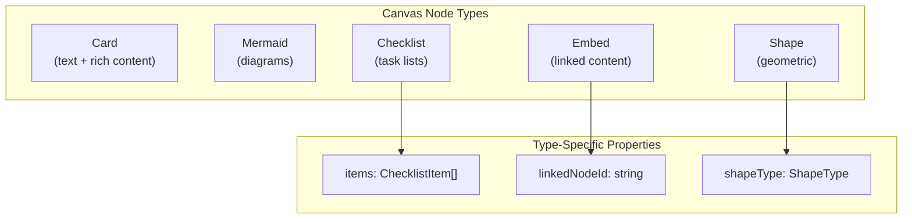

# 11: Rich Node Types

> Checklists, embedded pages/databases, and shape library for canvas nodes

**Duration:** 4-5 days
**Dependencies:** [10-mermaid-diagrams.md](./10-mermaid-diagrams.md)
**Package:** `@xnetjs/canvas`

## Overview

This step adds additional rich node types beyond the basic card and Mermaid nodes:

1. **Checklist nodes** - Task lists with keyboard navigation
2. **Embed nodes** - Embedded pages, databases, and other xNet content
3. **Shape nodes** - Geometric shapes for diagrams



## Implementation

### Checklist Node

```typescript
// packages/canvas/src/nodes/checklist-node.tsx

import { memo, useCallback, useRef, useEffect } from 'react'
import { nanoid } from 'nanoid'

interface ChecklistItem {
  id: string
  text: string
  checked: boolean
  indent: number
}

interface ChecklistNode extends BaseCanvasNode {
  type: 'checklist'
  properties: {
    title?: string
    items: ChecklistItem[]
  }
}

interface ChecklistNodeProps {
  node: ChecklistNode
  onUpdate: (changes: Partial<ChecklistNode['properties']>) => void
}

export const ChecklistNodeComponent = memo(function ChecklistNodeComponent({
  node,
  onUpdate
}: ChecklistNodeProps) {
  const items = node.properties.items ?? []

  const updateItem = useCallback(
    (id: string, changes: Partial<ChecklistItem>) => {
      const newItems = items.map((item) =>
        item.id === id ? { ...item, ...changes } : item
      )
      onUpdate({ items: newItems })
    },
    [items, onUpdate]
  )

  const addItem = useCallback(
    (afterId: string | null) => {
      const newItem: ChecklistItem = {
        id: nanoid(10),
        text: '',
        checked: false,
        indent: 0
      }

      let newItems: ChecklistItem[]
      if (afterId) {
        const index = items.findIndex((item) => item.id === afterId)
        newItem.indent = items[index]?.indent ?? 0
        newItems = [...items.slice(0, index + 1), newItem, ...items.slice(index + 1)]
      } else {
        newItems = [...items, newItem]
      }

      onUpdate({ items: newItems })

      // Focus new item after render
      setTimeout(() => {
        const input = document.querySelector(
          `[data-item-id="${newItem.id}"] input[type="text"]`
        ) as HTMLInputElement
        input?.focus()
      }, 0)
    },
    [items, onUpdate]
  )

  const deleteItem = useCallback(
    (id: string) => {
      const index = items.findIndex((item) => item.id === id)
      if (index < 0) return

      const newItems = items.filter((item) => item.id !== id)
      onUpdate({ items: newItems })

      // Focus previous item
      if (index > 0) {
        setTimeout(() => {
          const prevId = items[index - 1].id
          const input = document.querySelector(
            `[data-item-id="${prevId}"] input[type="text"]`
          ) as HTMLInputElement
          input?.focus()
        }, 0)
      }
    },
    [items, onUpdate]
  )

  const handleKeyDown = useCallback(
    (e: React.KeyboardEvent, item: ChecklistItem) => {
      if (e.key === 'Enter') {
        e.preventDefault()
        addItem(item.id)
      } else if (e.key === 'Backspace' && item.text === '') {
        e.preventDefault()
        deleteItem(item.id)
      } else if (e.key === 'Tab') {
        e.preventDefault()
        const newIndent = e.shiftKey
          ? Math.max(0, item.indent - 1)
          : Math.min(4, item.indent + 1)
        updateItem(item.id, { indent: newIndent })
      } else if (e.key === 'ArrowUp' && e.altKey) {
        e.preventDefault()
        moveItem(item.id, -1)
      } else if (e.key === 'ArrowDown' && e.altKey) {
        e.preventDefault()
        moveItem(item.id, 1)
      }
    },
    [addItem, deleteItem, updateItem]
  )

  const moveItem = useCallback(
    (id: string, direction: -1 | 1) => {
      const index = items.findIndex((item) => item.id === id)
      if (index < 0) return

      const newIndex = index + direction
      if (newIndex < 0 || newIndex >= items.length) return

      const newItems = [...items]
      const [removed] = newItems.splice(index, 1)
      newItems.splice(newIndex, 0, removed)
      onUpdate({ items: newItems })
    },
    [items, onUpdate]
  )

  return (
    <div className="checklist-node">
      {node.properties.title && (
        <div className="checklist-title">{node.properties.title}</div>
      )}

      <div className="checklist-items">
        {items.map((item) => (
          <div
            key={item.id}
            data-item-id={item.id}
            className="checklist-item"
            style={{ paddingLeft: item.indent * 20 + 8 }}
          >
            <input
              type="checkbox"
              checked={item.checked}
              onChange={(e) => updateItem(item.id, { checked: e.target.checked })}
              className="checklist-checkbox"
            />
            <input
              type="text"
              value={item.text}
              onChange={(e) => updateItem(item.id, { text: e.target.value })}
              onKeyDown={(e) => handleKeyDown(e, item)}
              placeholder="Task..."
              className={`checklist-text ${item.checked ? 'completed' : ''}`}
            />
          </div>
        ))}
      </div>

      <button className="checklist-add" onClick={() => addItem(items[items.length - 1]?.id ?? null)}>
        + Add item
      </button>
    </div>
  )
})
```

### Embed Node

```typescript
// packages/canvas/src/nodes/embed-node.tsx

import { memo, useMemo } from 'react'
import { useNode } from '@xnetjs/react'

interface EmbedNode extends BaseCanvasNode {
  type: 'embed'
  properties: {
    linkedNodeId: string
    viewType: 'card' | 'full' | 'database' | 'kanban'
    collapsed?: boolean
  }
}

interface EmbedNodeProps {
  node: EmbedNode
  onUpdate: (changes: Partial<EmbedNode['properties']>) => void
}

export const EmbedNodeComponent = memo(function EmbedNodeComponent({
  node,
  onUpdate
}: EmbedNodeProps) {
  const { linkedNodeId, viewType, collapsed } = node.properties

  // Fetch the linked node
  const { node: linkedNode, loading, error } = useNode(linkedNodeId)

  if (loading) {
    return (
      <div className="embed-node embed-node--loading">
        <div className="loading-spinner" />
        <span>Loading...</span>
      </div>
    )
  }

  if (error || !linkedNode) {
    return (
      <div className="embed-node embed-node--error">
        <div className="error-icon">!</div>
        <span>Failed to load linked content</span>
      </div>
    )
  }

  const toggleCollapse = () => {
    onUpdate({ collapsed: !collapsed })
  }

  return (
    <div className={`embed-node embed-node--${viewType}`}>
      <div className="embed-header" onClick={toggleCollapse}>
        <NodeIcon type={linkedNode.schema} />
        <span className="embed-title">{linkedNode.properties?.title ?? 'Untitled'}</span>
        <button className="collapse-button">{collapsed ? '+' : '-'}</button>
      </div>

      {!collapsed && (
        <div className="embed-content">
          <EmbedContent node={linkedNode} viewType={viewType} />
        </div>
      )}
    </div>
  )
})

function EmbedContent({
  node,
  viewType
}: {
  node: any
  viewType: string
}) {
  switch (viewType) {
    case 'card':
      return <CardEmbed node={node} />
    case 'database':
      return <DatabaseEmbed node={node} />
    case 'kanban':
      return <KanbanEmbed node={node} />
    case 'full':
    default:
      return <FullEmbed node={node} />
  }
}

function CardEmbed({ node }: { node: any }) {
  return (
    <div className="card-embed">
      <p className="card-excerpt">
        {node.properties?.content?.slice(0, 200)}
        {node.properties?.content?.length > 200 && '...'}
      </p>
    </div>
  )
}

function DatabaseEmbed({ node }: { node: any }) {
  // Render a mini table view
  return (
    <div className="database-embed">
      <div className="mini-table">
        {/* Simplified database view */}
        <div className="table-row header">
          {node.properties?.columns?.slice(0, 3).map((col: any) => (
            <div key={col.id} className="table-cell">
              {col.name}
            </div>
          ))}
        </div>
        {/* Show first 5 rows */}
      </div>
    </div>
  )
}
```

### Shape Node

```typescript
// packages/canvas/src/nodes/shape-node.tsx

import { memo, useMemo } from 'react'

type ShapeType =
  | 'rectangle'
  | 'rounded-rectangle'
  | 'ellipse'
  | 'diamond'
  | 'triangle'
  | 'hexagon'
  | 'star'
  | 'arrow'
  | 'cylinder'
  | 'cloud'

interface ShapeNode extends BaseCanvasNode {
  type: 'shape'
  properties: {
    shapeType: ShapeType
    fill: string
    stroke: string
    strokeWidth: number
    cornerRadius?: number
    label?: string
  }
}

interface ShapeNodeProps {
  node: ShapeNode
  onUpdate: (changes: Partial<ShapeNode['properties']>) => void
}

export const ShapeNodeComponent = memo(function ShapeNodeComponent({
  node,
  onUpdate
}: ShapeNodeProps) {
  const { shapeType, fill, stroke, strokeWidth, cornerRadius, label } = node.properties
  const { width, height } = node.position

  const shapePath = useMemo(() => {
    return createShapePath(shapeType, width, height, cornerRadius)
  }, [shapeType, width, height, cornerRadius])

  return (
    <div className="shape-node">
      <svg
        width={width}
        height={height}
        viewBox={`0 0 ${width} ${height}`}
        className="shape-svg"
      >
        <path
          d={shapePath}
          fill={fill}
          stroke={stroke}
          strokeWidth={strokeWidth}
        />
      </svg>

      {label && (
        <div className="shape-label">
          <span>{label}</span>
        </div>
      )}
    </div>
  )
})

function createShapePath(
  type: ShapeType,
  width: number,
  height: number,
  cornerRadius?: number
): string {
  const cx = width / 2
  const cy = height / 2

  switch (type) {
    case 'rectangle':
      return `M 0 0 H ${width} V ${height} H 0 Z`

    case 'rounded-rectangle': {
      const r = Math.min(cornerRadius ?? 8, width / 2, height / 2)
      return `
        M ${r} 0
        H ${width - r}
        Q ${width} 0 ${width} ${r}
        V ${height - r}
        Q ${width} ${height} ${width - r} ${height}
        H ${r}
        Q 0 ${height} 0 ${height - r}
        V ${r}
        Q 0 0 ${r} 0
        Z
      `
    }

    case 'ellipse':
      return `
        M ${cx} 0
        A ${cx} ${cy} 0 1 1 ${cx} ${height}
        A ${cx} ${cy} 0 1 1 ${cx} 0
        Z
      `

    case 'diamond':
      return `
        M ${cx} 0
        L ${width} ${cy}
        L ${cx} ${height}
        L 0 ${cy}
        Z
      `

    case 'triangle':
      return `
        M ${cx} 0
        L ${width} ${height}
        L 0 ${height}
        Z
      `

    case 'hexagon': {
      const r = Math.min(width, height) / 2
      const points = []
      for (let i = 0; i < 6; i++) {
        const angle = (Math.PI / 3) * i - Math.PI / 2
        const px = cx + r * Math.cos(angle)
        const py = cy + r * Math.sin(angle)
        points.push(`${px} ${py}`)
      }
      return `M ${points.join(' L ')} Z`
    }

    case 'star': {
      const outerR = Math.min(width, height) / 2
      const innerR = outerR * 0.4
      const points = []
      for (let i = 0; i < 10; i++) {
        const angle = (Math.PI / 5) * i - Math.PI / 2
        const r = i % 2 === 0 ? outerR : innerR
        const px = cx + r * Math.cos(angle)
        const py = cy + r * Math.sin(angle)
        points.push(`${px} ${py}`)
      }
      return `M ${points.join(' L ')} Z`
    }

    case 'arrow':
      return `
        M 0 ${height * 0.3}
        H ${width * 0.6}
        V 0
        L ${width} ${cy}
        L ${width * 0.6} ${height}
        V ${height * 0.7}
        H 0
        Z
      `

    case 'cylinder':
      const ry = height * 0.1
      return `
        M 0 ${ry}
        A ${cx} ${ry} 0 0 1 ${width} ${ry}
        V ${height - ry}
        A ${cx} ${ry} 0 0 1 0 ${height - ry}
        Z
        M 0 ${ry}
        A ${cx} ${ry} 0 0 0 ${width} ${ry}
      `

    case 'cloud': {
      // Simplified cloud shape
      return `
        M ${width * 0.25} ${height * 0.6}
        A ${width * 0.15} ${height * 0.15} 0 1 1 ${width * 0.35} ${height * 0.35}
        A ${width * 0.2} ${height * 0.2} 0 1 1 ${width * 0.65} ${height * 0.3}
        A ${width * 0.15} ${height * 0.2} 0 1 1 ${width * 0.8} ${height * 0.5}
        A ${width * 0.12} ${height * 0.15} 0 1 1 ${width * 0.7} ${height * 0.7}
        Q ${width * 0.5} ${height * 0.8} ${width * 0.25} ${height * 0.6}
        Z
      `
    }

    default:
      return `M 0 0 H ${width} V ${height} H 0 Z`
  }
}
```

### Shape Picker Component

```typescript
// packages/canvas/src/components/shape-picker.tsx

const SHAPES: Array<{ type: ShapeType; label: string }> = [
  { type: 'rectangle', label: 'Rectangle' },
  { type: 'rounded-rectangle', label: 'Rounded' },
  { type: 'ellipse', label: 'Ellipse' },
  { type: 'diamond', label: 'Diamond' },
  { type: 'triangle', label: 'Triangle' },
  { type: 'hexagon', label: 'Hexagon' },
  { type: 'star', label: 'Star' },
  { type: 'arrow', label: 'Arrow' },
  { type: 'cylinder', label: 'Cylinder' },
  { type: 'cloud', label: 'Cloud' }
]

interface ShapePickerProps {
  onSelect: (shapeType: ShapeType) => void
  onClose: () => void
}

export function ShapePicker({ onSelect, onClose }: ShapePickerProps) {
  return (
    <div className="shape-picker">
      <div className="shape-picker-header">
        <span>Shapes</span>
        <button onClick={onClose}>x</button>
      </div>
      <div className="shape-picker-grid">
        {SHAPES.map(({ type, label }) => (
          <button
            key={type}
            className="shape-option"
            onClick={() => onSelect(type)}
            title={label}
          >
            <svg width="32" height="32" viewBox="0 0 32 32">
              <path
                d={createShapePath(type, 28, 28)}
                transform="translate(2, 2)"
                fill="#e5e7eb"
                stroke="#6b7280"
                strokeWidth="1"
              />
            </svg>
          </button>
        ))}
      </div>
    </div>
  )
}
```

## Testing

```typescript
describe('ChecklistNodeComponent', () => {
  it('renders items with correct indentation', () => {
    const node = {
      id: 'n1',
      type: 'checklist',
      properties: {
        items: [
          { id: '1', text: 'Task 1', checked: false, indent: 0 },
          { id: '2', text: 'Subtask', checked: false, indent: 1 }
        ]
      }
    }

    const { container } = render(
      <ChecklistNodeComponent node={node} onUpdate={vi.fn()} />
    )

    const items = container.querySelectorAll('.checklist-item')
    expect(items[0].style.paddingLeft).toBe('8px')
    expect(items[1].style.paddingLeft).toBe('28px')
  })

  it('adds item on Enter', () => {
    const onUpdate = vi.fn()
    const node = {
      id: 'n1',
      type: 'checklist',
      properties: { items: [{ id: '1', text: 'Task', checked: false, indent: 0 }] }
    }

    const { container } = render(
      <ChecklistNodeComponent node={node} onUpdate={onUpdate} />
    )

    const input = container.querySelector('input[type="text"]')!
    fireEvent.keyDown(input, { key: 'Enter' })

    expect(onUpdate).toHaveBeenCalledWith({
      items: expect.arrayContaining([
        expect.objectContaining({ text: 'Task' }),
        expect.objectContaining({ text: '' })
      ])
    })
  })

  it('changes indent on Tab', () => {
    const onUpdate = vi.fn()
    const node = {
      id: 'n1',
      type: 'checklist',
      properties: { items: [{ id: '1', text: 'Task', checked: false, indent: 0 }] }
    }

    const { container } = render(
      <ChecklistNodeComponent node={node} onUpdate={onUpdate} />
    )

    const input = container.querySelector('input[type="text"]')!
    fireEvent.keyDown(input, { key: 'Tab' })

    expect(onUpdate).toHaveBeenCalledWith({
      items: [expect.objectContaining({ indent: 1 })]
    })
  })
})

describe('ShapeNodeComponent', () => {
  it('renders correct shape path', () => {
    const node = {
      id: 'n1',
      type: 'shape',
      position: { x: 0, y: 0, width: 100, height: 100 },
      properties: {
        shapeType: 'diamond',
        fill: '#3b82f6',
        stroke: '#1d4ed8',
        strokeWidth: 2
      }
    }

    const { container } = render(
      <ShapeNodeComponent node={node} onUpdate={vi.fn()} />
    )

    const path = container.querySelector('path')!
    expect(path.getAttribute('d')).toContain('M 50 0')
    expect(path.getAttribute('fill')).toBe('#3b82f6')
  })

  it('renders label when provided', () => {
    const node = {
      id: 'n1',
      type: 'shape',
      position: { x: 0, y: 0, width: 100, height: 100 },
      properties: {
        shapeType: 'rectangle',
        fill: '#fff',
        stroke: '#000',
        strokeWidth: 1,
        label: 'Process'
      }
    }

    const { container } = render(
      <ShapeNodeComponent node={node} onUpdate={vi.fn()} />
    )

    expect(container.textContent).toContain('Process')
  })
})
```

## Validation Gate

- [x] Checklist items render with correct indentation
- [x] Enter adds new item below current
- [x] Backspace on empty item deletes it
- [x] Tab increases indent, Shift+Tab decreases
- [x] Checkbox toggles item completion
- [x] Alt+Arrow moves items up/down
- [x] Embed nodes load linked content
- [x] Embed collapse/expand works
- [x] All 10 shape types render correctly
- [x] Shape picker allows type selection
- [x] Shapes support fill, stroke, and label

---

[Back to README](./README.md) | [Previous: Mermaid Diagrams](./10-mermaid-diagrams.md) | [Next: Drawing Tools ->](./12-drawing-tools.md)
