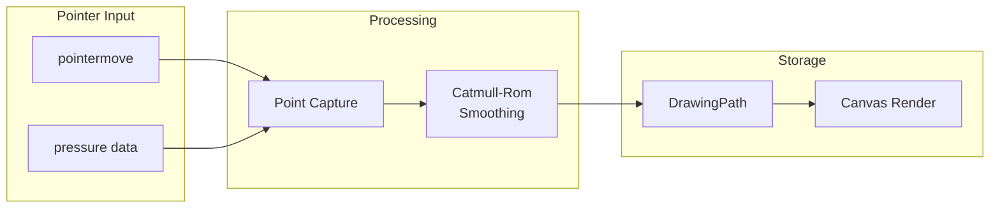

# 12: Drawing Tools

> Freehand drawing with pressure support and path smoothing

**Duration:** 3-4 days
**Dependencies:** [02-canvas2d-edge-layer.md](./02-canvas2d-edge-layer.md)
**Package:** `@xnetjs/canvas`

## Overview

Drawing tools allow freehand annotation on the canvas. Strokes are captured with optional pressure sensitivity, smoothed using Catmull-Rom splines, and stored as vector paths for efficient rendering and editing.



## Implementation

### Drawing Path Type

```typescript
// packages/canvas/src/drawing/types.ts

interface Point {
  x: number
  y: number
}

interface PressurePoint extends Point {
  pressure: number
}

interface DrawingPath {
  id: string
  points: PressurePoint[] // Raw captured points
  smoothed?: Point[] // Smoothed points for rendering
  strokeWidth: number
  strokeColor: string
  opacity: number
  timestamp: number
}

interface DrawingTool {
  type: 'pen' | 'highlighter' | 'eraser'
  strokeWidth: number
  strokeColor: string
  opacity: number
}
```

### Drawing Tool Class

```typescript
// packages/canvas/src/drawing/drawing-tool.ts

import { nanoid } from 'nanoid'

const DEFAULT_TOOL: DrawingTool = {
  type: 'pen',
  strokeWidth: 2,
  strokeColor: '#000000',
  opacity: 1
}

export class DrawingToolController {
  private canvas: HTMLCanvasElement
  private ctx: CanvasRenderingContext2D
  private isDrawing = false
  private currentPath: DrawingPath | null = null
  private tool: DrawingTool = DEFAULT_TOOL

  private onPathComplete: (path: DrawingPath) => void

  constructor(canvas: HTMLCanvasElement, onPathComplete: (path: DrawingPath) => void) {
    this.canvas = canvas
    this.ctx = canvas.getContext('2d')!
    this.onPathComplete = onPathComplete
  }

  setTool(tool: Partial<DrawingTool>): void {
    this.tool = { ...this.tool, ...tool }
  }

  getTool(): DrawingTool {
    return { ...this.tool }
  }

  onPointerDown(e: PointerEvent, canvasPoint: Point): void {
    if (e.button !== 0) return // Left button only

    this.isDrawing = true
    this.canvas.setPointerCapture(e.pointerId)

    const pressure = e.pressure || 0.5

    this.currentPath = {
      id: nanoid(10),
      points: [{ ...canvasPoint, pressure }],
      strokeWidth: this.tool.strokeWidth,
      strokeColor: this.tool.strokeColor,
      opacity: this.tool.opacity,
      timestamp: Date.now()
    }

    // Start drawing
    this.ctx.beginPath()
    this.ctx.strokeStyle = this.tool.strokeColor
    this.ctx.lineWidth = this.tool.strokeWidth * pressure
    this.ctx.lineCap = 'round'
    this.ctx.lineJoin = 'round'
    this.ctx.globalAlpha = this.tool.opacity
    this.ctx.moveTo(canvasPoint.x, canvasPoint.y)
  }

  onPointerMove(e: PointerEvent, canvasPoint: Point): void {
    if (!this.isDrawing || !this.currentPath) return

    const pressure = e.pressure || 0.5

    // Add point
    this.currentPath.points.push({ ...canvasPoint, pressure })

    // Draw segment
    const lastPoint = this.currentPath.points[this.currentPath.points.length - 2]
    this.drawSegment(lastPoint, { ...canvasPoint, pressure })
  }

  onPointerUp(e: PointerEvent): DrawingPath | null {
    if (!this.isDrawing || !this.currentPath) return null

    this.isDrawing = false
    this.canvas.releasePointerCapture(e.pointerId)

    // Smooth the path
    this.currentPath.smoothed = this.smoothPath(this.currentPath.points)

    const completedPath = this.currentPath
    this.currentPath = null

    // Notify completion
    this.onPathComplete(completedPath)

    return completedPath
  }

  private drawSegment(from: PressurePoint, to: PressurePoint): void {
    const ctx = this.ctx

    // Variable width based on pressure
    const avgPressure = (from.pressure + to.pressure) / 2
    ctx.lineWidth = this.tool.strokeWidth * avgPressure * 2

    ctx.lineTo(to.x, to.y)
    ctx.stroke()
    ctx.beginPath()
    ctx.moveTo(to.x, to.y)
  }

  /**
   * Smooth path using Catmull-Rom spline interpolation.
   */
  private smoothPath(points: PressurePoint[]): Point[] {
    if (points.length < 3) return points

    const smoothed: Point[] = []
    const tension = 0.5

    for (let i = 0; i < points.length - 1; i++) {
      const p0 = points[Math.max(0, i - 1)]
      const p1 = points[i]
      const p2 = points[Math.min(points.length - 1, i + 1)]
      const p3 = points[Math.min(points.length - 1, i + 2)]

      // Add interpolated points
      for (let t = 0; t < 1; t += 0.25) {
        smoothed.push(this.catmullRom(p0, p1, p2, p3, t, tension))
      }
    }

    // Add final point
    smoothed.push(points[points.length - 1])

    return smoothed
  }

  private catmullRom(
    p0: Point,
    p1: Point,
    p2: Point,
    p3: Point,
    t: number,
    tension: number
  ): Point {
    const t2 = t * t
    const t3 = t2 * t

    const s = (1 - tension) / 2

    const b1 = s * (-t3 + 2 * t2 - t)
    const b2 = s * (-t3 + t2) + (2 * t3 - 3 * t2 + 1)
    const b3 = s * (t3 - 2 * t2 + t) + (-2 * t3 + 3 * t2)
    const b4 = s * (t3 - t2)

    return {
      x: p0.x * b1 + p1.x * b2 + p2.x * b3 + p3.x * b4,
      y: p0.y * b1 + p1.y * b2 + p2.y * b3 + p3.y * b4
    }
  }
}
```

### Drawing Layer Component

```typescript
// packages/canvas/src/layers/drawing-layer.tsx

import { useRef, useEffect, useCallback, forwardRef, useImperativeHandle } from 'react'
import { DrawingToolController } from '../drawing/drawing-tool'
import type { DrawingPath, DrawingTool, Viewport } from '../types'

interface DrawingLayerProps {
  viewport: Viewport
  paths: DrawingPath[]
  activeTool: DrawingTool | null
  onPathComplete: (path: DrawingPath) => void
}

export interface DrawingLayerRef {
  setTool: (tool: Partial<DrawingTool>) => void
  clear: () => void
}

export const DrawingLayer = forwardRef<DrawingLayerRef, DrawingLayerProps>(
  function DrawingLayer({ viewport, paths, activeTool, onPathComplete }, ref) {
    const canvasRef = useRef<HTMLCanvasElement>(null)
    const controllerRef = useRef<DrawingToolController | null>(null)

    // Initialize controller
    useEffect(() => {
      if (!canvasRef.current) return

      controllerRef.current = new DrawingToolController(
        canvasRef.current,
        onPathComplete
      )

      return () => {
        controllerRef.current = null
      }
    }, [onPathComplete])

    // Update tool
    useEffect(() => {
      if (activeTool && controllerRef.current) {
        controllerRef.current.setTool(activeTool)
      }
    }, [activeTool])

    // Resize canvas
    useEffect(() => {
      const canvas = canvasRef.current
      if (!canvas) return

      const dpr = window.devicePixelRatio || 1
      const rect = canvas.getBoundingClientRect()
      canvas.width = rect.width * dpr
      canvas.height = rect.height * dpr
      canvas.getContext('2d')!.scale(dpr, dpr)

      // Re-render paths
      renderPaths()
    }, [viewport.width, viewport.height])

    // Render all paths
    const renderPaths = useCallback(() => {
      const canvas = canvasRef.current
      if (!canvas) return

      const ctx = canvas.getContext('2d')!
      ctx.clearRect(0, 0, canvas.width, canvas.height)

      // Apply viewport transform
      ctx.save()
      const dpr = window.devicePixelRatio || 1
      ctx.setTransform(
        viewport.zoom * dpr,
        0,
        0,
        viewport.zoom * dpr,
        (-viewport.x * viewport.zoom + canvas.width / dpr / 2) * dpr,
        (-viewport.y * viewport.zoom + canvas.height / dpr / 2) * dpr
      )

      // Draw each path
      for (const path of paths) {
        drawPath(ctx, path)
      }

      ctx.restore()
    }, [paths, viewport])

    useEffect(() => {
      renderPaths()
    }, [renderPaths])

    // Handle pointer events
    const handlePointerDown = useCallback(
      (e: React.PointerEvent) => {
        if (!activeTool || !controllerRef.current) return

        const rect = canvasRef.current!.getBoundingClientRect()
        const screenX = e.clientX - rect.left
        const screenY = e.clientY - rect.top
        const canvasPoint = viewport.screenToCanvas(screenX, screenY)

        controllerRef.current.onPointerDown(e.nativeEvent, canvasPoint)
      },
      [activeTool, viewport]
    )

    const handlePointerMove = useCallback(
      (e: React.PointerEvent) => {
        if (!controllerRef.current) return

        const rect = canvasRef.current!.getBoundingClientRect()
        const screenX = e.clientX - rect.left
        const screenY = e.clientY - rect.top
        const canvasPoint = viewport.screenToCanvas(screenX, screenY)

        controllerRef.current.onPointerMove(e.nativeEvent, canvasPoint)
      },
      [viewport]
    )

    const handlePointerUp = useCallback((e: React.PointerEvent) => {
      controllerRef.current?.onPointerUp(e.nativeEvent)
    }, [])

    // Expose methods
    useImperativeHandle(ref, () => ({
      setTool: (tool) => controllerRef.current?.setTool(tool),
      clear: () => renderPaths()
    }))

    return (
      <canvas
        ref={canvasRef}
        className="drawing-layer"
        style={{
          position: 'absolute',
          top: 0,
          left: 0,
          width: '100%',
          height: '100%',
          cursor: activeTool ? 'crosshair' : 'default',
          pointerEvents: activeTool ? 'auto' : 'none',
          touchAction: 'none'
        }}
        onPointerDown={handlePointerDown}
        onPointerMove={handlePointerMove}
        onPointerUp={handlePointerUp}
        onPointerLeave={handlePointerUp}
      />
    )
  }
)

function drawPath(ctx: CanvasRenderingContext2D, path: DrawingPath): void {
  const points = path.smoothed ?? path.points

  if (points.length < 2) return

  ctx.strokeStyle = path.strokeColor
  ctx.lineWidth = path.strokeWidth
  ctx.lineCap = 'round'
  ctx.lineJoin = 'round'
  ctx.globalAlpha = path.opacity

  ctx.beginPath()
  ctx.moveTo(points[0].x, points[0].y)

  for (let i = 1; i < points.length; i++) {
    ctx.lineTo(points[i].x, points[i].y)
  }

  ctx.stroke()
  ctx.globalAlpha = 1
}
```

### Drawing Toolbar

```typescript
// packages/canvas/src/components/drawing-toolbar.tsx

interface DrawingToolbarProps {
  activeTool: DrawingTool | null
  onToolChange: (tool: DrawingTool | null) => void
  onClear: () => void
}

const COLORS = [
  '#000000', '#ef4444', '#f97316', '#eab308',
  '#22c55e', '#3b82f6', '#8b5cf6', '#ec4899'
]

const SIZES = [1, 2, 4, 8, 16]

export function DrawingToolbar({
  activeTool,
  onToolChange,
  onClear
}: DrawingToolbarProps) {
  const isActive = activeTool !== null

  const toggleDrawing = () => {
    if (isActive) {
      onToolChange(null)
    } else {
      onToolChange({
        type: 'pen',
        strokeWidth: 2,
        strokeColor: '#000000',
        opacity: 1
      })
    }
  }

  const setColor = (color: string) => {
    if (activeTool) {
      onToolChange({ ...activeTool, strokeColor: color })
    }
  }

  const setSize = (size: number) => {
    if (activeTool) {
      onToolChange({ ...activeTool, strokeWidth: size })
    }
  }

  return (
    <div className="drawing-toolbar">
      <button
        className={`tool-button ${isActive ? 'active' : ''}`}
        onClick={toggleDrawing}
        title={isActive ? 'Exit drawing mode' : 'Enter drawing mode'}
      >
        <PenIcon />
      </button>

      {isActive && (
        <>
          <div className="toolbar-divider" />

          <div className="color-picker">
            {COLORS.map((color) => (
              <button
                key={color}
                className={`color-option ${activeTool.strokeColor === color ? 'selected' : ''}`}
                style={{ backgroundColor: color }}
                onClick={() => setColor(color)}
              />
            ))}
          </div>

          <div className="toolbar-divider" />

          <div className="size-picker">
            {SIZES.map((size) => (
              <button
                key={size}
                className={`size-option ${activeTool.strokeWidth === size ? 'selected' : ''}`}
                onClick={() => setSize(size)}
              >
                <div
                  className="size-dot"
                  style={{ width: size * 2, height: size * 2 }}
                />
              </button>
            ))}
          </div>

          <div className="toolbar-divider" />

          <button className="tool-button" onClick={onClear} title="Clear all drawings">
            <TrashIcon />
          </button>
        </>
      )}
    </div>
  )
}
```

## Testing

```typescript
describe('DrawingToolController', () => {
  let canvas: HTMLCanvasElement
  let controller: DrawingToolController
  let completedPaths: DrawingPath[]

  beforeEach(() => {
    canvas = document.createElement('canvas')
    canvas.width = 800
    canvas.height = 600
    document.body.appendChild(canvas)

    completedPaths = []
    controller = new DrawingToolController(canvas, (path) => completedPaths.push(path))
  })

  afterEach(() => {
    canvas.remove()
  })

  it('captures drawing path', () => {
    controller.onPointerDown({ pointerId: 1, button: 0, pressure: 0.5 } as PointerEvent, {
      x: 100,
      y: 100
    })

    controller.onPointerMove({ pressure: 0.6 } as PointerEvent, { x: 150, y: 120 })

    controller.onPointerMove({ pressure: 0.7 } as PointerEvent, { x: 200, y: 140 })

    const path = controller.onPointerUp({ pointerId: 1 } as PointerEvent)

    expect(path).not.toBeNull()
    expect(path!.points).toHaveLength(3)
    expect(completedPaths).toHaveLength(1)
  })

  it('captures pressure data', () => {
    controller.onPointerDown({ pointerId: 1, button: 0, pressure: 0.3 } as PointerEvent, {
      x: 0,
      y: 0
    })

    controller.onPointerMove({ pressure: 0.8 } as PointerEvent, { x: 50, y: 50 })

    const path = controller.onPointerUp({ pointerId: 1 } as PointerEvent)

    expect(path!.points[0].pressure).toBe(0.3)
    expect(path!.points[1].pressure).toBe(0.8)
  })

  it('smooths path with Catmull-Rom', () => {
    controller.onPointerDown({ pointerId: 1, button: 0, pressure: 0.5 } as PointerEvent, {
      x: 0,
      y: 0
    })

    // Add multiple points
    for (let i = 1; i <= 10; i++) {
      controller.onPointerMove({ pressure: 0.5 } as PointerEvent, {
        x: i * 10,
        y: Math.sin(i) * 10
      })
    }

    const path = controller.onPointerUp({ pointerId: 1 } as PointerEvent)

    expect(path!.smoothed).toBeDefined()
    expect(path!.smoothed!.length).toBeGreaterThan(path!.points.length)
  })

  it('applies tool settings', () => {
    controller.setTool({
      type: 'pen',
      strokeWidth: 5,
      strokeColor: '#ff0000',
      opacity: 0.5
    })

    controller.onPointerDown({ pointerId: 1, button: 0, pressure: 0.5 } as PointerEvent, {
      x: 0,
      y: 0
    })

    const path = controller.onPointerUp({ pointerId: 1 } as PointerEvent)

    expect(path!.strokeWidth).toBe(5)
    expect(path!.strokeColor).toBe('#ff0000')
    expect(path!.opacity).toBe(0.5)
  })
})
```

## Validation Gate

- [x] Freehand strokes render smoothly
- [x] Pressure sensitivity affects stroke width
- [x] Catmull-Rom smoothing reduces jaggedness
- [x] Color picker changes stroke color
- [x] Size picker changes stroke width
- [x] Drawing mode can be toggled on/off
- [x] Paths persist after drawing completes
- [x] Clear removes all drawings
- [x] Touch/stylus input works
- [x] Paths render correctly after pan/zoom

---

[Back to README](./README.md) | [Previous: Rich Node Types](./11-rich-node-types.md) | [Next: Edge Routing ->](./13-edge-routing.md)
