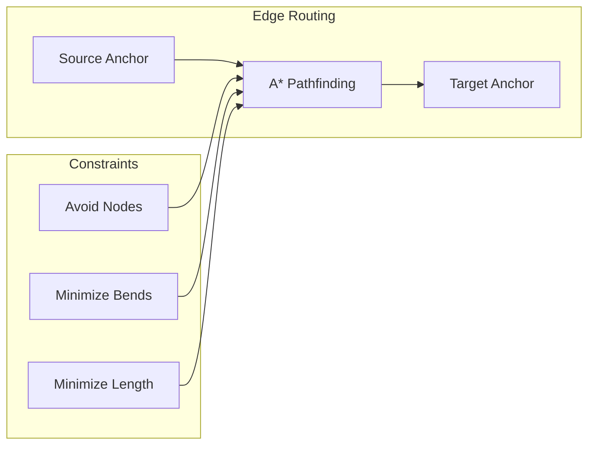

# 13: Edge Routing

> Orthogonal connector routing with A\* pathfinding around obstacles

**Duration:** 3-4 days
**Dependencies:** [02-canvas2d-edge-layer.md](./02-canvas2d-edge-layer.md)
**Package:** `@xnetjs/canvas`

## Overview

Professional diagrams use right-angle (orthogonal) connectors that route around nodes. This requires pathfinding to avoid obstacles while minimizing bends and edge crossings.



## Implementation

### Orthogonal Router

```typescript
// packages/canvas/src/routing/orthogonal-router.ts

interface RouterConfig {
  gridSize: number // Routing grid size (e.g., 10px)
  nodeMargin: number // Minimum distance from nodes (e.g., 20px)
  bendPenalty: number // Cost for each bend (higher = fewer bends)
  crossingPenalty: number // Cost for crossing edges
}

const DEFAULT_CONFIG: RouterConfig = {
  gridSize: 10,
  nodeMargin: 20,
  bendPenalty: 50,
  crossingPenalty: 100
}

interface PathNode {
  x: number
  y: number
  g: number // Cost from start
  h: number // Heuristic to end
  parent: PathNode | null
  direction: 'up' | 'down' | 'left' | 'right' | null
}

export class OrthogonalRouter {
  private config: RouterConfig
  private obstacles: Rect[] = []
  private existingEdges: Point[][] = []

  constructor(config: Partial<RouterConfig> = {}) {
    this.config = { ...DEFAULT_CONFIG, ...config }
  }

  setObstacles(nodes: Array<{ position: Rect }>): void {
    // Expand node bounds by margin
    this.obstacles = nodes.map((node) => ({
      x: node.position.x - this.config.nodeMargin,
      y: node.position.y - this.config.nodeMargin,
      width: node.position.width + this.config.nodeMargin * 2,
      height: node.position.height + this.config.nodeMargin * 2
    }))
  }

  setExistingEdges(edges: Point[][]): void {
    this.existingEdges = edges
  }

  route(source: Rect, sourceAnchor: EdgeAnchor, target: Rect, targetAnchor: EdgeAnchor): Point[] {
    const start = this.getAnchorPoint(source, sourceAnchor, target)
    const end = this.getAnchorPoint(target, targetAnchor, source)

    // Get initial direction from anchor
    const startDir = this.getAnchorDirection(sourceAnchor, source, target)
    const endDir = this.getAnchorDirection(targetAnchor, target, source)

    // Run A* pathfinding
    const path = this.astar(start, end, startDir, endDir)

    // Simplify path (remove redundant points on same line)
    return this.simplifyPath(path)
  }

  private astar(start: Point, end: Point, startDir: string | null, endDir: string | null): Point[] {
    const { gridSize, bendPenalty } = this.config

    const openSet = new MinHeap<PathNode>((a, b) => a.g + a.h - (b.g + b.h))
    const closedSet = new Set<string>()

    const startNode: PathNode = {
      x: this.snapToGrid(start.x),
      y: this.snapToGrid(start.y),
      g: 0,
      h: this.heuristic(start, end),
      parent: null,
      direction: startDir as any
    }

    openSet.push(startNode)

    let iterations = 0
    const maxIterations = 10000

    while (!openSet.isEmpty() && iterations < maxIterations) {
      iterations++

      const current = openSet.pop()!
      const key = `${current.x},${current.y}`

      if (closedSet.has(key)) continue
      closedSet.add(key)

      // Check if reached end
      if (this.isNearEnd(current, end, gridSize)) {
        return this.reconstructPath(current, end)
      }

      // Explore orthogonal neighbors
      const directions = [
        { dx: 0, dy: -gridSize, dir: 'up' as const },
        { dx: gridSize, dy: 0, dir: 'right' as const },
        { dx: 0, dy: gridSize, dir: 'down' as const },
        { dx: -gridSize, dy: 0, dir: 'left' as const }
      ]

      for (const { dx, dy, dir } of directions) {
        const nx = current.x + dx
        const ny = current.y + dy
        const nkey = `${nx},${ny}`

        if (closedSet.has(nkey)) continue

        // Check collision with obstacles
        if (this.collidesWithObstacle(nx, ny)) continue

        // Calculate cost
        const moveCost = gridSize
        const bendCost = current.direction && current.direction !== dir ? bendPenalty : 0
        const crossingCost =
          this.countCrossings(current.x, current.y, nx, ny) * this.config.crossingPenalty

        const g = current.g + moveCost + bendCost + crossingCost
        const h = this.heuristic({ x: nx, y: ny }, end)

        openSet.push({
          x: nx,
          y: ny,
          g,
          h,
          parent: current,
          direction: dir
        })
      }
    }

    // No path found - return straight line
    console.warn('No orthogonal path found, falling back to straight line')
    return [start, end]
  }

  private heuristic(a: Point, b: Point): number {
    // Manhattan distance
    return Math.abs(a.x - b.x) + Math.abs(a.y - b.y)
  }

  private isNearEnd(node: PathNode, end: Point, threshold: number): boolean {
    return Math.abs(node.x - end.x) <= threshold && Math.abs(node.y - end.y) <= threshold
  }

  private collidesWithObstacle(x: number, y: number): boolean {
    for (const obstacle of this.obstacles) {
      if (
        x >= obstacle.x &&
        x <= obstacle.x + obstacle.width &&
        y >= obstacle.y &&
        y <= obstacle.y + obstacle.height
      ) {
        return true
      }
    }
    return false
  }

  private countCrossings(x1: number, y1: number, x2: number, y2: number): number {
    let count = 0
    for (const edge of this.existingEdges) {
      for (let i = 0; i < edge.length - 1; i++) {
        if (this.segmentsIntersect(x1, y1, x2, y2, edge[i], edge[i + 1])) {
          count++
        }
      }
    }
    return count
  }

  private segmentsIntersect(
    x1: number,
    y1: number,
    x2: number,
    y2: number,
    p1: Point,
    p2: Point
  ): boolean {
    const d1 = this.direction(p1, p2, { x: x1, y: y1 })
    const d2 = this.direction(p1, p2, { x: x2, y: y2 })
    const d3 = this.direction({ x: x1, y: y1 }, { x: x2, y: y2 }, p1)
    const d4 = this.direction({ x: x1, y: y1 }, { x: x2, y: y2 }, p2)

    if (((d1 > 0 && d2 < 0) || (d1 < 0 && d2 > 0)) && ((d3 > 0 && d4 < 0) || (d3 < 0 && d4 > 0))) {
      return true
    }
    return false
  }

  private direction(a: Point, b: Point, c: Point): number {
    return (b.x - a.x) * (c.y - a.y) - (b.y - a.y) * (c.x - a.x)
  }

  private reconstructPath(node: PathNode, end: Point): Point[] {
    const path: Point[] = [end]
    let current: PathNode | null = node

    while (current) {
      path.unshift({ x: current.x, y: current.y })
      current = current.parent
    }

    return path
  }

  private simplifyPath(path: Point[]): Point[] {
    if (path.length < 3) return path

    const simplified: Point[] = [path[0]]

    for (let i = 1; i < path.length - 1; i++) {
      const prev = path[i - 1]
      const curr = path[i]
      const next = path[i + 1]

      // Keep point if direction changes
      const sameHorizontal = prev.y === curr.y && curr.y === next.y
      const sameVertical = prev.x === curr.x && curr.x === next.x

      if (!sameHorizontal && !sameVertical) {
        simplified.push(curr)
      }
    }

    simplified.push(path[path.length - 1])
    return simplified
  }

  private snapToGrid(value: number): number {
    return Math.round(value / this.config.gridSize) * this.config.gridSize
  }

  private getAnchorPoint(rect: Rect, anchor: EdgeAnchor, other: Rect): Point {
    const cx = rect.x + rect.width / 2
    const cy = rect.y + rect.height / 2
    const ox = other.x + other.width / 2
    const oy = other.y + other.height / 2

    if (anchor === 'auto') {
      const dx = ox - cx
      const dy = oy - cy

      if (Math.abs(dx) > Math.abs(dy)) {
        return dx > 0 ? { x: rect.x + rect.width, y: cy } : { x: rect.x, y: cy }
      } else {
        return dy > 0 ? { x: cx, y: rect.y + rect.height } : { x: cx, y: rect.y }
      }
    }

    switch (anchor) {
      case 'top':
        return { x: cx, y: rect.y }
      case 'bottom':
        return { x: cx, y: rect.y + rect.height }
      case 'left':
        return { x: rect.x, y: cy }
      case 'right':
        return { x: rect.x + rect.width, y: cy }
      default:
        return { x: cx, y: cy }
    }
  }

  private getAnchorDirection(anchor: EdgeAnchor, rect: Rect, other: Rect): string | null {
    if (anchor === 'auto') {
      const cx = rect.x + rect.width / 2
      const cy = rect.y + rect.height / 2
      const ox = other.x + other.width / 2
      const oy = other.y + other.height / 2

      if (Math.abs(ox - cx) > Math.abs(oy - cy)) {
        return ox > cx ? 'right' : 'left'
      } else {
        return oy > cy ? 'down' : 'up'
      }
    }

    switch (anchor) {
      case 'top':
        return 'up'
      case 'bottom':
        return 'down'
      case 'left':
        return 'left'
      case 'right':
        return 'right'
      default:
        return null
    }
  }
}

// Min heap implementation
class MinHeap<T> {
  private items: T[] = []

  constructor(private compare: (a: T, b: T) => number) {}

  push(item: T): void {
    this.items.push(item)
    this.bubbleUp(this.items.length - 1)
  }

  pop(): T | undefined {
    if (this.items.length === 0) return undefined
    if (this.items.length === 1) return this.items.pop()

    const result = this.items[0]
    this.items[0] = this.items.pop()!
    this.bubbleDown(0)
    return result
  }

  isEmpty(): boolean {
    return this.items.length === 0
  }

  private bubbleUp(index: number): void {
    while (index > 0) {
      const parent = Math.floor((index - 1) / 2)
      if (this.compare(this.items[index], this.items[parent]) >= 0) break
      ;[this.items[index], this.items[parent]] = [this.items[parent], this.items[index]]
      index = parent
    }
  }

  private bubbleDown(index: number): void {
    const length = this.items.length
    while (true) {
      const left = 2 * index + 1
      const right = 2 * index + 2
      let smallest = index

      if (left < length && this.compare(this.items[left], this.items[smallest]) < 0) {
        smallest = left
      }
      if (right < length && this.compare(this.items[right], this.items[smallest]) < 0) {
        smallest = right
      }
      if (smallest === index) break
      ;[this.items[index], this.items[smallest]] = [this.items[smallest], this.items[index]]
      index = smallest
    }
  }
}
```

### Integration with Edge Renderer

```typescript
// packages/canvas/src/layers/edge-renderer.ts (updated)

import { OrthogonalRouter } from '../routing/orthogonal-router'

export class EdgeRenderer {
  private router = new OrthogonalRouter()

  updateObstacles(nodes: CanvasNode[]): void {
    this.router.setObstacles(nodes)
  }

  private createEdgePath(edge: CanvasEdge, source: Rect, target: Rect): Path2D {
    const path = new Path2D()
    const style = edge.style ?? DEFAULT_EDGE_STYLE

    let points: Point[]

    if (style.routing === 'orthogonal') {
      points = this.router.route(
        source,
        edge.sourceAnchor ?? 'auto',
        target,
        edge.targetAnchor ?? 'auto'
      )
    } else if (style.curved) {
      // Bezier curve
      const sourceAnchor = this.computeAnchor(source, edge.sourceAnchor ?? 'auto', target)
      const targetAnchor = this.computeAnchor(target, edge.targetAnchor ?? 'auto', source)
      points = this.createBezierPoints(sourceAnchor, targetAnchor)
    } else {
      // Straight line
      const sourceAnchor = this.computeAnchor(source, edge.sourceAnchor ?? 'auto', target)
      const targetAnchor = this.computeAnchor(target, edge.targetAnchor ?? 'auto', source)
      points = [sourceAnchor, targetAnchor]
    }

    // Draw path
    path.moveTo(points[0].x, points[0].y)
    for (let i = 1; i < points.length; i++) {
      path.lineTo(points[i].x, points[i].y)
    }

    return path
  }
}
```

## Testing

```typescript
describe('OrthogonalRouter', () => {
  let router: OrthogonalRouter

  beforeEach(() => {
    router = new OrthogonalRouter({ gridSize: 10, nodeMargin: 10 })
  })

  it('routes around obstacles', () => {
    router.setObstacles([{ position: { x: 100, y: 100, width: 100, height: 100 } }])

    const path = router.route(
      { x: 0, y: 150, width: 50, height: 50 },
      'right',
      { x: 250, y: 150, width: 50, height: 50 },
      'left'
    )

    // Path should go around the obstacle
    expect(path.length).toBeGreaterThan(2)

    // No point should be inside the obstacle
    for (const point of path) {
      const inside = point.x >= 90 && point.x <= 210 && point.y >= 90 && point.y <= 210
      expect(inside).toBe(false)
    }
  })

  it('minimizes bends', () => {
    router.setObstacles([])

    const path = router.route(
      { x: 0, y: 0, width: 50, height: 50 },
      'right',
      { x: 200, y: 0, width: 50, height: 50 },
      'left'
    )

    // Direct horizontal connection should have minimal points
    expect(path.length).toBeLessThanOrEqual(3)
  })

  it('simplifies redundant points', () => {
    router.setObstacles([])

    const path = router.route(
      { x: 0, y: 0, width: 50, height: 50 },
      'right',
      { x: 200, y: 100, width: 50, height: 50 },
      'left'
    )

    // Path should be simplified (no consecutive collinear points)
    for (let i = 1; i < path.length - 1; i++) {
      const prev = path[i - 1]
      const curr = path[i]
      const next = path[i + 1]

      const sameH = prev.y === curr.y && curr.y === next.y
      const sameV = prev.x === curr.x && curr.x === next.x

      expect(sameH || sameV).toBe(false)
    }
  })

  it('handles auto anchors', () => {
    const path = router.route(
      { x: 0, y: 0, width: 50, height: 50 },
      'auto',
      { x: 200, y: 0, width: 50, height: 50 },
      'auto'
    )

    expect(path.length).toBeGreaterThan(0)
    expect(path[0].x).toBe(50) // Right edge of source
    expect(path[path.length - 1].x).toBe(200) // Left edge of target
  })
})
```

## Validation Gate

- [x] Orthogonal paths avoid node obstacles
- [x] Paths use right-angle bends only
- [x] Bend count is minimized
- [x] Path simplification removes redundant points
- [x] Auto anchors choose optimal direction
- [x] Performance: < 10ms for typical routes
- [x] Fallback to straight line when no path found
- [x] Edge crossings are minimized when possible

---

[Back to README](./README.md) | [Previous: Drawing Tools](./12-drawing-tools.md) | [Next: Edge Bundling ->](./14-edge-bundling.md)
