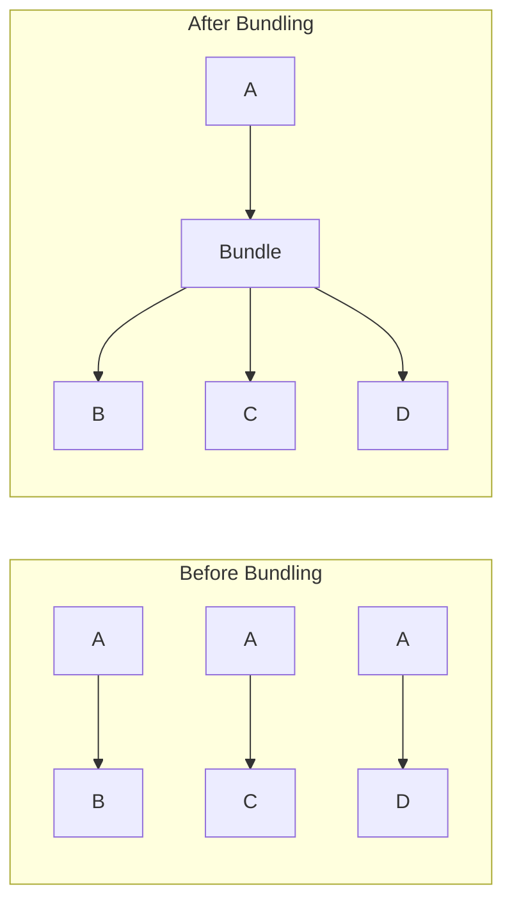

# 14: Edge Bundling

> Group parallel edges to reduce visual clutter in dense graphs

**Duration:** 2-3 days
**Dependencies:** [02-canvas2d-edge-layer.md](./02-canvas2d-edge-layer.md)
**Package:** `@xnet/canvas`

## Overview

When many edges connect similar regions, bundling them together reduces visual clutter and makes the graph more readable. Bundled edges share a common path and fan out at their endpoints.



## Implementation

### Edge Bundler

```typescript
// packages/canvas/src/routing/edge-bundler.ts

interface BundledEdge {
  id: string
  originalEdges: CanvasEdge[]
  path: Point[]
  width: number // Proportional to edge count
  color: string // Dominant color or blend
}

interface BundleConfig {
  bundleThreshold: number // Max distance between midpoints to bundle (px)
  minBundleSize: number // Minimum edges to form a bundle
  fanOutDistance: number // Distance to fan out at endpoints
}

const DEFAULT_BUNDLE_CONFIG: BundleConfig = {
  bundleThreshold: 80,
  minBundleSize: 2,
  fanOutDistance: 30
}

export class EdgeBundler {
  private config: BundleConfig

  constructor(config: Partial<BundleConfig> = {}) {
    this.config = { ...DEFAULT_BUNDLE_CONFIG, ...config }
  }

  bundle(edges: CanvasEdge[], nodePositions: Map<string, Rect>): BundledEdge[] {
    // Calculate midpoint for each edge
    const edgeData = edges
      .map((edge) => {
        const source = nodePositions.get(edge.sourceId)
        const target = nodePositions.get(edge.targetId)
        if (!source || !target) return null

        const sourceCenter = {
          x: source.x + source.width / 2,
          y: source.y + source.height / 2
        }
        const targetCenter = {
          x: target.x + target.width / 2,
          y: target.y + target.height / 2
        }
        const midpoint = {
          x: (sourceCenter.x + targetCenter.x) / 2,
          y: (sourceCenter.y + targetCenter.y) / 2
        }

        return {
          edge,
          sourceCenter,
          targetCenter,
          midpoint,
          angle: Math.atan2(targetCenter.y - sourceCenter.y, targetCenter.x - sourceCenter.x)
        }
      })
      .filter(Boolean) as Array<{
      edge: CanvasEdge
      sourceCenter: Point
      targetCenter: Point
      midpoint: Point
      angle: number
    }>

    // Cluster edges by midpoint proximity and similar angle
    const clusters = this.clusterEdges(edgeData)

    // Create bundled edges
    const bundledEdges: BundledEdge[] = []

    for (const cluster of clusters) {
      if (cluster.length < this.config.minBundleSize) {
        // Single edges - no bundling
        for (const item of cluster) {
          bundledEdges.push({
            id: item.edge.id,
            originalEdges: [item.edge],
            path: [item.sourceCenter, item.targetCenter],
            width: 2,
            color: item.edge.style?.stroke ?? '#64748b'
          })
        }
      } else {
        // Bundle multiple edges
        const bundled = this.createBundle(cluster, nodePositions)
        bundledEdges.push(bundled)
      }
    }

    return bundledEdges
  }

  private clusterEdges(
    edgeData: Array<{
      edge: CanvasEdge
      sourceCenter: Point
      targetCenter: Point
      midpoint: Point
      angle: number
    }>
  ): (typeof edgeData)[] {
    const clusters: (typeof edgeData)[] = []
    const assigned = new Set<string>()

    for (const item of edgeData) {
      if (assigned.has(item.edge.id)) continue

      // Find all edges that can be bundled with this one
      const cluster = [item]
      assigned.add(item.edge.id)

      for (const other of edgeData) {
        if (assigned.has(other.edge.id)) continue

        const distance = this.distance(item.midpoint, other.midpoint)
        const angleDiff = Math.abs(item.angle - other.angle)

        // Bundle if midpoints are close and angles are similar
        if (
          distance < this.config.bundleThreshold &&
          angleDiff < Math.PI / 6 // Within 30 degrees
        ) {
          cluster.push(other)
          assigned.add(other.edge.id)
        }
      }

      clusters.push(cluster)
    }

    return clusters
  }

  private createBundle(
    cluster: Array<{
      edge: CanvasEdge
      sourceCenter: Point
      targetCenter: Point
      midpoint: Point
      angle: number
    }>,
    nodePositions: Map<string, Rect>
  ): BundledEdge {
    // Calculate bundle center line
    const avgMidpoint = {
      x: cluster.reduce((sum, c) => sum + c.midpoint.x, 0) / cluster.length,
      y: cluster.reduce((sum, c) => sum + c.midpoint.y, 0) / cluster.length
    }

    // Calculate average source and target positions
    const avgSource = {
      x: cluster.reduce((sum, c) => sum + c.sourceCenter.x, 0) / cluster.length,
      y: cluster.reduce((sum, c) => sum + c.sourceCenter.y, 0) / cluster.length
    }
    const avgTarget = {
      x: cluster.reduce((sum, c) => sum + c.targetCenter.x, 0) / cluster.length,
      y: cluster.reduce((sum, c) => sum + c.targetCenter.y, 0) / cluster.length
    }

    // Create bundle path with fan-out at endpoints
    const path = this.createBundlePath(avgSource, avgMidpoint, avgTarget, cluster)

    // Calculate bundle width
    const width = Math.min(2 + cluster.length * 0.5, 8)

    // Get dominant color
    const colorCounts = new Map<string, number>()
    for (const item of cluster) {
      const color = item.edge.style?.stroke ?? '#64748b'
      colorCounts.set(color, (colorCounts.get(color) ?? 0) + 1)
    }
    const dominantColor = Array.from(colorCounts.entries()).sort((a, b) => b[1] - a[1])[0][0]

    return {
      id: `bundle-${cluster.map((c) => c.edge.id).join('-')}`,
      originalEdges: cluster.map((c) => c.edge),
      path,
      width,
      color: dominantColor
    }
  }

  private createBundlePath(
    source: Point,
    midpoint: Point,
    target: Point,
    cluster: Array<{ sourceCenter: Point; targetCenter: Point }>
  ): Point[] {
    // Simple path through midpoint
    // Could be enhanced with Bezier curves or more sophisticated bundling
    return [source, midpoint, target]
  }

  private distance(a: Point, b: Point): number {
    return Math.sqrt((a.x - b.x) ** 2 + (a.y - b.y) ** 2)
  }
}
```

### Bundle Renderer

```typescript
// packages/canvas/src/layers/bundle-renderer.ts

export class BundleRenderer {
  private canvas: HTMLCanvasElement
  private ctx: CanvasRenderingContext2D
  private bundler = new EdgeBundler()

  render(edges: CanvasEdge[], nodePositions: Map<string, Rect>, viewport: Viewport): void {
    const ctx = this.ctx

    // Clear and apply transform
    ctx.setTransform(1, 0, 0, 1, 0, 0)
    ctx.clearRect(0, 0, this.canvas.width, this.canvas.height)
    this.applyViewportTransform(ctx, viewport)

    // Bundle edges
    const bundles = this.bundler.bundle(edges, nodePositions)

    // Draw bundles
    for (const bundle of bundles) {
      this.drawBundle(ctx, bundle, viewport)
    }
  }

  private drawBundle(ctx: CanvasRenderingContext2D, bundle: BundledEdge, viewport: Viewport): void {
    const { path, width, color } = bundle

    ctx.strokeStyle = color
    ctx.lineWidth = width
    ctx.lineCap = 'round'
    ctx.lineJoin = 'round'
    ctx.globalAlpha = bundle.originalEdges.length > 1 ? 0.6 : 1

    ctx.beginPath()
    ctx.moveTo(path[0].x, path[0].y)

    if (path.length === 3) {
      // Bezier curve through midpoint
      const cp1 = {
        x: path[0].x + (path[1].x - path[0].x) * 0.5,
        y: path[1].y
      }
      const cp2 = {
        x: path[2].x - (path[2].x - path[1].x) * 0.5,
        y: path[1].y
      }
      ctx.bezierCurveTo(cp1.x, cp1.y, cp2.x, cp2.y, path[2].x, path[2].y)
    } else {
      for (let i = 1; i < path.length; i++) {
        ctx.lineTo(path[i].x, path[i].y)
      }
    }

    ctx.stroke()
    ctx.globalAlpha = 1

    // Draw bundle indicator (count badge)
    if (bundle.originalEdges.length > 1) {
      this.drawBundleCount(ctx, bundle)
    }
  }

  private drawBundleCount(ctx: CanvasRenderingContext2D, bundle: BundledEdge): void {
    const midIdx = Math.floor(bundle.path.length / 2)
    const mid = bundle.path[midIdx]
    const count = bundle.originalEdges.length

    ctx.fillStyle = 'white'
    ctx.beginPath()
    ctx.arc(mid.x, mid.y, 10, 0, Math.PI * 2)
    ctx.fill()

    ctx.strokeStyle = bundle.color
    ctx.lineWidth = 1.5
    ctx.stroke()

    ctx.fillStyle = '#374151'
    ctx.font = 'bold 10px Inter, system-ui, sans-serif'
    ctx.textAlign = 'center'
    ctx.textBaseline = 'middle'
    ctx.fillText(String(count), mid.x, mid.y)
  }
}
```

### Hover Unbundle

```typescript
// packages/canvas/src/components/bundle-tooltip.tsx

interface BundleTooltipProps {
  bundle: BundledEdge
  position: Point
  onEdgeClick: (edgeId: string) => void
}

export function BundleTooltip({
  bundle,
  position,
  onEdgeClick
}: BundleTooltipProps) {
  return (
    <div
      className="bundle-tooltip"
      style={{
        position: 'absolute',
        left: position.x,
        top: position.y,
        transform: 'translate(-50%, -100%)',
        marginTop: -8
      }}
    >
      <div className="bundle-tooltip-header">
        {bundle.originalEdges.length} connections
      </div>
      <div className="bundle-tooltip-list">
        {bundle.originalEdges.slice(0, 5).map((edge) => (
          <button
            key={edge.id}
            className="bundle-edge-item"
            onClick={() => onEdgeClick(edge.id)}
          >
            {edge.label ?? edge.id}
          </button>
        ))}
        {bundle.originalEdges.length > 5 && (
          <div className="bundle-more">
            +{bundle.originalEdges.length - 5} more
          </div>
        )}
      </div>
    </div>
  )
}
```

## Testing

```typescript
describe('EdgeBundler', () => {
  let bundler: EdgeBundler

  beforeEach(() => {
    bundler = new EdgeBundler({ bundleThreshold: 50, minBundleSize: 2 })
  })

  it('bundles parallel edges', () => {
    const edges = [
      { id: 'e1', sourceId: 'a', targetId: 'b' },
      { id: 'e2', sourceId: 'a', targetId: 'c' },
      { id: 'e3', sourceId: 'a', targetId: 'd' }
    ]

    const positions = new Map([
      ['a', { x: 0, y: 100, width: 50, height: 50 }],
      ['b', { x: 200, y: 80, width: 50, height: 50 }],
      ['c', { x: 200, y: 100, width: 50, height: 50 }],
      ['d', { x: 200, y: 120, width: 50, height: 50 }]
    ])

    const bundles = bundler.bundle(edges, positions)

    // Should create one bundle with all 3 edges
    expect(bundles.length).toBe(1)
    expect(bundles[0].originalEdges.length).toBe(3)
  })

  it('keeps separate edges unbundled', () => {
    const edges = [
      { id: 'e1', sourceId: 'a', targetId: 'b' },
      { id: 'e2', sourceId: 'c', targetId: 'd' }
    ]

    const positions = new Map([
      ['a', { x: 0, y: 0, width: 50, height: 50 }],
      ['b', { x: 200, y: 0, width: 50, height: 50 }],
      ['c', { x: 0, y: 500, width: 50, height: 50 }],
      ['d', { x: 200, y: 500, width: 50, height: 50 }]
    ])

    const bundles = bundler.bundle(edges, positions)

    // Should keep edges separate
    expect(bundles.length).toBe(2)
    expect(bundles[0].originalEdges.length).toBe(1)
    expect(bundles[1].originalEdges.length).toBe(1)
  })

  it('calculates bundle width proportionally', () => {
    const edges = Array.from({ length: 10 }, (_, i) => ({
      id: `e${i}`,
      sourceId: 'a',
      targetId: `b${i}`
    }))

    const positions = new Map<string, Rect>([['a', { x: 0, y: 100, width: 50, height: 50 }]])

    // Add target nodes in a line
    for (let i = 0; i < 10; i++) {
      positions.set(`b${i}`, { x: 200, y: 90 + i * 5, width: 50, height: 50 })
    }

    const bundles = bundler.bundle(edges, positions)

    // Bundle width should be proportional to edge count
    const bundle = bundles.find((b) => b.originalEdges.length > 1)
    expect(bundle).toBeDefined()
    expect(bundle!.width).toBeGreaterThan(2)
  })
})
```

## Validation Gate

- [x] Parallel edges are bundled together
- [x] Bundle width reflects edge count
- [x] Bundle count badge shows on hover
- [x] Separated edges remain unbundled
- [x] Similar angles required for bundling
- [x] Maximum bundle width is capped
- [x] Dominant color used for bundle
- [x] Performance: < 10ms for 1000 edges

---

[Back to README](./README.md) | [Previous: Edge Routing](./13-edge-routing.md) | [Next: Swimlanes ->](./15-swimlanes.md)
