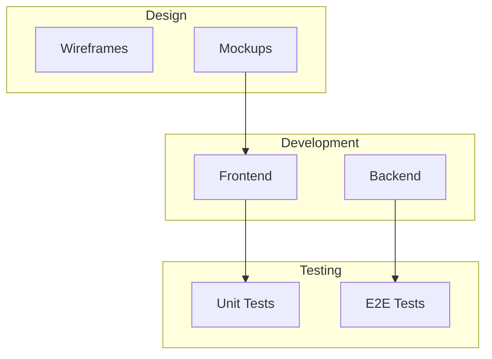

# 15: Swimlanes

> Container nodes that group and organize other nodes in lanes

**Duration:** 3-4 days
**Dependencies:** [03-virtualized-node-layer.md](./03-virtualized-node-layer.md)
**Package:** `@xnet/canvas`

## Overview

Swimlanes are container nodes that organize child nodes into distinct regions. They're commonly used for process diagrams, workflow visualization, and organizational charts.



## Implementation

### Swimlane Node Type

```typescript
// packages/canvas/src/nodes/types.ts

interface SwimlaneNode extends BaseCanvasNode {
  type: 'swimlane'
  properties: {
    title: string
    orientation: 'horizontal' | 'vertical'
    color: string
    headerSize: number // Height for horizontal, width for vertical
    childNodeIds: string[] // Nodes contained in this lane
    collapsed?: boolean
  }
}
```

### Swimlane Node Component

```typescript
// packages/canvas/src/nodes/swimlane-node.tsx

import { memo, useCallback, useMemo } from 'react'

interface SwimlaneNodeProps {
  node: SwimlaneNode
  children: CanvasNode[]
  isSelected: boolean
  onUpdate: (changes: Partial<SwimlaneNode['properties']>) => void
  onNodeDrop: (nodeId: string, swimlaneId: string) => void
}

export const SwimlaneNodeComponent = memo(function SwimlaneNodeComponent({
  node,
  children,
  isSelected,
  onUpdate,
  onNodeDrop
}: SwimlaneNodeProps) {
  const { title, orientation, color, headerSize, collapsed } = node.properties
  const { width, height } = node.position

  const isHorizontal = orientation === 'horizontal'

  const handleDragOver = useCallback((e: React.DragEvent) => {
    e.preventDefault()
    e.dataTransfer.dropEffect = 'move'
  }, [])

  const handleDrop = useCallback(
    (e: React.DragEvent) => {
      e.preventDefault()
      const nodeId = e.dataTransfer.getData('text/node-id')
      if (nodeId && nodeId !== node.id) {
        onNodeDrop(nodeId, node.id)
      }
    },
    [node.id, onNodeDrop]
  )

  const toggleCollapse = useCallback(() => {
    onUpdate({ collapsed: !collapsed })
  }, [collapsed, onUpdate])

  const headerStyle: React.CSSProperties = isHorizontal
    ? {
        position: 'absolute',
        top: 0,
        left: 0,
        width: '100%',
        height: headerSize,
        backgroundColor: color,
        display: 'flex',
        alignItems: 'center',
        padding: '0 12px'
      }
    : {
        position: 'absolute',
        top: 0,
        left: 0,
        width: headerSize,
        height: '100%',
        backgroundColor: color,
        writingMode: 'vertical-lr',
        textOrientation: 'mixed',
        display: 'flex',
        alignItems: 'center',
        justifyContent: 'center',
        padding: '12px 0'
      }

  const contentStyle: React.CSSProperties = isHorizontal
    ? {
        position: 'absolute',
        top: headerSize,
        left: 0,
        width: '100%',
        height: collapsed ? 0 : height - headerSize,
        overflow: 'hidden',
        transition: 'height 200ms ease'
      }
    : {
        position: 'absolute',
        top: 0,
        left: headerSize,
        width: collapsed ? 0 : width - headerSize,
        height: '100%',
        overflow: 'hidden',
        transition: 'width 200ms ease'
      }

  return (
    <div
      className={`swimlane-node ${isSelected ? 'selected' : ''}`}
      style={{
        position: 'absolute',
        left: node.position.x,
        top: node.position.y,
        width,
        height: collapsed && isHorizontal ? headerSize : height,
        border: `2px solid ${color}`,
        borderRadius: 8,
        backgroundColor: 'rgba(255, 255, 255, 0.9)',
        overflow: 'hidden'
      }}
      onDragOver={handleDragOver}
      onDrop={handleDrop}
    >
      {/* Header */}
      <div style={headerStyle}>
        <button
          className="collapse-button"
          onClick={toggleCollapse}
          style={{ marginRight: 8 }}
        >
          {collapsed ? '+' : '-'}
        </button>
        <span className="swimlane-title">{title}</span>
        <span className="swimlane-count">({children.length})</span>
      </div>

      {/* Content area */}
      <div style={contentStyle}>
        <div className="swimlane-content-inner">
          {/* Child nodes are rendered by parent, not here */}
        </div>
      </div>
    </div>
  )
})
```

### Swimlane Manager

```typescript
// packages/canvas/src/swimlane/swimlane-manager.ts

export class SwimlaneManager {
  /**
   * Check if a position is inside a swimlane.
   */
  getSwimlaneAtPosition(position: Point, swimlanes: SwimlaneNode[]): SwimlaneNode | null {
    // Check in reverse order (top-most first)
    for (let i = swimlanes.length - 1; i >= 0; i--) {
      const lane = swimlanes[i]
      if (this.isInsideSwimlane(position, lane)) {
        return lane
      }
    }
    return null
  }

  /**
   * Check if a node is inside a swimlane's content area.
   */
  isInsideSwimlane(position: Point, lane: SwimlaneNode): boolean {
    const { x, y, width, height } = lane.position
    const { orientation, headerSize, collapsed } = lane.properties

    if (collapsed) return false

    // Content area bounds
    const contentBounds =
      orientation === 'horizontal'
        ? { x, y: y + headerSize, width, height: height - headerSize }
        : { x: x + headerSize, y, width: width - headerSize, height }

    return (
      position.x >= contentBounds.x &&
      position.x <= contentBounds.x + contentBounds.width &&
      position.y >= contentBounds.y &&
      position.y <= contentBounds.y + contentBounds.height
    )
  }

  /**
   * Move a node into a swimlane.
   */
  addNodeToSwimlane(
    nodeId: string,
    swimlaneId: string,
    swimlanes: Map<string, SwimlaneNode>
  ): Map<string, SwimlaneNode> {
    const updated = new Map(swimlanes)

    // Remove from any existing swimlane
    for (const [id, lane] of updated) {
      if (lane.properties.childNodeIds.includes(nodeId)) {
        updated.set(id, {
          ...lane,
          properties: {
            ...lane.properties,
            childNodeIds: lane.properties.childNodeIds.filter((n) => n !== nodeId)
          }
        })
      }
    }

    // Add to new swimlane
    const targetLane = updated.get(swimlaneId)
    if (targetLane) {
      updated.set(swimlaneId, {
        ...targetLane,
        properties: {
          ...targetLane.properties,
          childNodeIds: [...targetLane.properties.childNodeIds, nodeId]
        }
      })
    }

    return updated
  }

  /**
   * Remove a node from its swimlane.
   */
  removeNodeFromSwimlane(
    nodeId: string,
    swimlanes: Map<string, SwimlaneNode>
  ): Map<string, SwimlaneNode> {
    const updated = new Map(swimlanes)

    for (const [id, lane] of updated) {
      if (lane.properties.childNodeIds.includes(nodeId)) {
        updated.set(id, {
          ...lane,
          properties: {
            ...lane.properties,
            childNodeIds: lane.properties.childNodeIds.filter((n) => n !== nodeId)
          }
        })
        break
      }
    }

    return updated
  }

  /**
   * Auto-resize swimlane to fit its children.
   */
  resizeToFitChildren(
    lane: SwimlaneNode,
    childNodes: CanvasNode[],
    padding: number = 20
  ): Partial<CanvasNodePosition> {
    if (childNodes.length === 0) return {}

    const { orientation, headerSize } = lane.properties

    // Calculate bounding box of children
    let minX = Infinity
    let minY = Infinity
    let maxX = -Infinity
    let maxY = -Infinity

    for (const child of childNodes) {
      minX = Math.min(minX, child.position.x)
      minY = Math.min(minY, child.position.y)
      maxX = Math.max(maxX, child.position.x + child.position.width)
      maxY = Math.max(maxY, child.position.y + child.position.height)
    }

    // Calculate new size
    if (orientation === 'horizontal') {
      return {
        x: Math.min(lane.position.x, minX - padding),
        width: Math.max(lane.position.width, maxX - minX + padding * 2),
        height: Math.max(lane.position.height, maxY - minY + headerSize + padding * 2)
      }
    } else {
      return {
        y: Math.min(lane.position.y, minY - padding),
        width: Math.max(lane.position.width, maxX - minX + headerSize + padding * 2),
        height: Math.max(lane.position.height, maxY - minY + padding * 2)
      }
    }
  }
}
```

### Integration with Canvas

```typescript
// packages/canvas/src/hooks/use-swimlanes.ts

export function useSwimlanes(
  nodes: CanvasNode[],
  onNodeUpdate: (id: string, changes: Partial<CanvasNode>) => void
) {
  const manager = useMemo(() => new SwimlaneManager(), [])

  // Get all swimlane nodes
  const swimlanes = useMemo(
    () => nodes.filter((n): n is SwimlaneNode => n.type === 'swimlane'),
    [nodes]
  )

  // Build swimlane -> children map
  const swimlaneChildren = useMemo(() => {
    const map = new Map<string, CanvasNode[]>()

    for (const lane of swimlanes) {
      const children = lane.properties.childNodeIds
        .map((id) => nodes.find((n) => n.id === id))
        .filter(Boolean) as CanvasNode[]
      map.set(lane.id, children)
    }

    return map
  }, [swimlanes, nodes])

  // Handle node drop into swimlane
  const handleNodeDrop = useCallback(
    (nodeId: string, swimlaneId: string) => {
      const lane = swimlanes.find((l) => l.id === swimlaneId)
      if (!lane) return

      // Add to swimlane
      const newChildIds = [...lane.properties.childNodeIds, nodeId]
      onNodeUpdate(swimlaneId, {
        properties: { ...lane.properties, childNodeIds: newChildIds }
      })

      // Auto-resize
      const node = nodes.find((n) => n.id === nodeId)
      if (node) {
        const children = [...(swimlaneChildren.get(swimlaneId) ?? []), node]
        const resize = manager.resizeToFitChildren(lane, children)
        if (Object.keys(resize).length > 0) {
          onNodeUpdate(swimlaneId, {
            position: { ...lane.position, ...resize }
          })
        }
      }
    },
    [swimlanes, nodes, swimlaneChildren, manager, onNodeUpdate]
  )

  // Check swimlane containment on node move
  const handleNodeMove = useCallback(
    (nodeId: string, newPosition: CanvasNodePosition) => {
      const nodeCenter = {
        x: newPosition.x + newPosition.width / 2,
        y: newPosition.y + newPosition.height / 2
      }

      const containingLane = manager.getSwimlaneAtPosition(nodeCenter, swimlanes)

      // Find current swimlane
      const currentLane = swimlanes.find((l) => l.properties.childNodeIds.includes(nodeId))

      if (containingLane?.id !== currentLane?.id) {
        // Node moved between swimlanes
        if (currentLane) {
          // Remove from old
          onNodeUpdate(currentLane.id, {
            properties: {
              ...currentLane.properties,
              childNodeIds: currentLane.properties.childNodeIds.filter((id) => id !== nodeId)
            }
          })
        }

        if (containingLane) {
          // Add to new
          onNodeUpdate(containingLane.id, {
            properties: {
              ...containingLane.properties,
              childNodeIds: [...containingLane.properties.childNodeIds, nodeId]
            }
          })
        }
      }
    },
    [swimlanes, manager, onNodeUpdate]
  )

  return {
    swimlanes,
    swimlaneChildren,
    handleNodeDrop,
    handleNodeMove
  }
}
```

## Testing

```typescript
describe('SwimlaneManager', () => {
  let manager: SwimlaneManager

  beforeEach(() => {
    manager = new SwimlaneManager()
  })

  it('detects position inside swimlane', () => {
    const lane: SwimlaneNode = {
      id: 'lane1',
      type: 'swimlane',
      position: { x: 0, y: 0, width: 300, height: 400 },
      properties: {
        title: 'Test Lane',
        orientation: 'horizontal',
        color: '#3b82f6',
        headerSize: 40,
        childNodeIds: []
      }
    }

    // Inside content area
    expect(manager.isInsideSwimlane({ x: 150, y: 200 }, lane)).toBe(true)

    // In header area
    expect(manager.isInsideSwimlane({ x: 150, y: 20 }, lane)).toBe(false)

    // Outside completely
    expect(manager.isInsideSwimlane({ x: 400, y: 200 }, lane)).toBe(false)
  })

  it('adds node to swimlane', () => {
    const lanes = new Map<string, SwimlaneNode>([
      [
        'lane1',
        {
          id: 'lane1',
          type: 'swimlane',
          position: { x: 0, y: 0, width: 300, height: 400 },
          properties: {
            title: 'Lane 1',
            orientation: 'horizontal',
            color: '#3b82f6',
            headerSize: 40,
            childNodeIds: []
          }
        }
      ]
    ])

    const updated = manager.addNodeToSwimlane('node1', 'lane1', lanes)

    expect(updated.get('lane1')!.properties.childNodeIds).toContain('node1')
  })

  it('moves node between swimlanes', () => {
    const lanes = new Map<string, SwimlaneNode>([
      [
        'lane1',
        {
          id: 'lane1',
          type: 'swimlane',
          position: { x: 0, y: 0, width: 300, height: 400 },
          properties: {
            title: 'Lane 1',
            orientation: 'horizontal',
            color: '#3b82f6',
            headerSize: 40,
            childNodeIds: ['node1']
          }
        }
      ],
      [
        'lane2',
        {
          id: 'lane2',
          type: 'swimlane',
          position: { x: 350, y: 0, width: 300, height: 400 },
          properties: {
            title: 'Lane 2',
            orientation: 'horizontal',
            color: '#10b981',
            headerSize: 40,
            childNodeIds: []
          }
        }
      ]
    ])

    const updated = manager.addNodeToSwimlane('node1', 'lane2', lanes)

    expect(updated.get('lane1')!.properties.childNodeIds).not.toContain('node1')
    expect(updated.get('lane2')!.properties.childNodeIds).toContain('node1')
  })

  it('resizes to fit children', () => {
    const lane: SwimlaneNode = {
      id: 'lane1',
      type: 'swimlane',
      position: { x: 0, y: 0, width: 200, height: 200 },
      properties: {
        title: 'Lane',
        orientation: 'horizontal',
        color: '#3b82f6',
        headerSize: 40,
        childNodeIds: ['n1', 'n2']
      }
    }

    const children = [
      { id: 'n1', position: { x: 50, y: 100, width: 100, height: 50 } },
      { id: 'n2', position: { x: 50, y: 200, width: 100, height: 50 } }
    ] as CanvasNode[]

    const resize = manager.resizeToFitChildren(lane, children, 20)

    expect(resize.height).toBeGreaterThan(200) // Should expand to fit
  })
})
```

## Validation Gate

- [x] Swimlanes render with header and content area
- [x] Nodes can be dragged into swimlanes
- [x] Node membership updates on position change
- [x] Collapsed swimlanes hide content
- [x] Auto-resize expands to fit children
- [x] Vertical orientation works correctly
- [x] Child count shows in header
- [x] Visual feedback on drag-over
- [x] Swimlanes render behind contained nodes

---

[Back to README](./README.md) | [Previous: Edge Bundling](./14-edge-bundling.md) | [Next: Worker Layout ->](./16-worker-layout.md)
