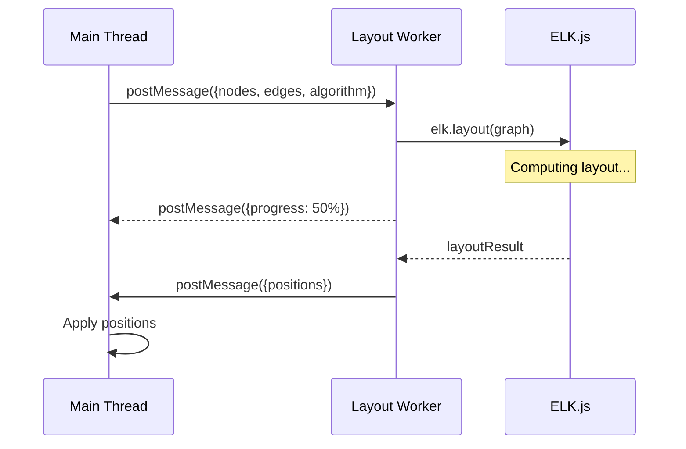

# 16: Worker Layout

> ELK.js auto-layout running in Web Worker to prevent UI blocking

**Duration:** 2-3 days
**Dependencies:** None (can be done in parallel with other features)
**Package:** `@xnet/canvas`

## Overview

Layout computation with ELK.js is CPU-intensive and should never block the main thread. We move layout computation to a Web Worker, with progress reporting and cancellation support.



## Implementation

### Layout Worker

```typescript
// packages/canvas/src/workers/layout-worker.ts

import ELK from 'elkjs/lib/elk.bundled.js'

const elk = new ELK()

interface LayoutRequest {
  id: string
  nodes: Array<{ id: string; width: number; height: number }>
  edges: Array<{ id: string; sourceId: string; targetId: string }>
  algorithm: 'layered' | 'force' | 'radial' | 'tree' | 'stress'
  options?: Record<string, string>
}

interface LayoutResponse {
  id: string
  success: boolean
  positions?: Record<string, { x: number; y: number }>
  error?: string
}

self.onmessage = async (e: MessageEvent<LayoutRequest>) => {
  const { id, nodes, edges, algorithm, options } = e.data

  try {
    const graph = {
      id: 'root',
      layoutOptions: {
        'elk.algorithm': getAlgorithmName(algorithm),
        'elk.spacing.nodeNode': '50',
        'elk.layered.spacing.nodeNodeBetweenLayers': '100',
        'elk.direction': 'RIGHT',
        ...options
      },
      children: nodes.map((n) => ({
        id: n.id,
        width: n.width,
        height: n.height
      })),
      edges: edges.map((e) => ({
        id: e.id,
        sources: [e.sourceId],
        targets: [e.targetId]
      }))
    }

    const result = await elk.layout(graph)

    const positions: Record<string, { x: number; y: number }> = {}
    for (const child of result.children ?? []) {
      positions[child.id] = { x: child.x ?? 0, y: child.y ?? 0 }
    }

    self.postMessage({
      id,
      success: true,
      positions
    } as LayoutResponse)
  } catch (err) {
    self.postMessage({
      id,
      success: false,
      error: err instanceof Error ? err.message : 'Layout failed'
    } as LayoutResponse)
  }
}

function getAlgorithmName(algorithm: string): string {
  switch (algorithm) {
    case 'layered':
      return 'org.eclipse.elk.layered'
    case 'force':
      return 'org.eclipse.elk.force'
    case 'radial':
      return 'org.eclipse.elk.radial'
    case 'tree':
      return 'org.eclipse.elk.mrtree'
    case 'stress':
      return 'org.eclipse.elk.stress'
    default:
      return 'org.eclipse.elk.layered'
  }
}
```

### Layout Manager

```typescript
// packages/canvas/src/layout/layout-manager.ts

import { nanoid } from 'nanoid'

type LayoutAlgorithm = 'layered' | 'force' | 'radial' | 'tree' | 'stress'

interface LayoutRequest {
  nodes: CanvasNode[]
  edges: CanvasEdge[]
  algorithm: LayoutAlgorithm
  options?: Record<string, string>
}

interface PendingLayout {
  resolve: (positions: Map<string, Point>) => void
  reject: (error: Error) => void
}

export class LayoutManager {
  private worker: Worker | null = null
  private pending = new Map<string, PendingLayout>()
  private currentRequestId: string | null = null

  constructor() {
    this.initWorker()
  }

  private initWorker(): void {
    if (typeof Worker === 'undefined') {
      console.warn('Web Workers not supported, layout will run on main thread')
      return
    }

    this.worker = new Worker(new URL('../workers/layout-worker.ts', import.meta.url), {
      type: 'module'
    })

    this.worker.onmessage = (e) => {
      const { id, success, positions, error } = e.data as {
        id: string
        success: boolean
        positions?: Record<string, { x: number; y: number }>
        error?: string
      }

      const pending = this.pending.get(id)
      if (!pending) return

      this.pending.delete(id)
      this.currentRequestId = null

      if (success && positions) {
        pending.resolve(new Map(Object.entries(positions)))
      } else {
        pending.reject(new Error(error ?? 'Layout failed'))
      }
    }

    this.worker.onerror = (error) => {
      console.error('Layout worker error:', error)
      // Reject all pending requests
      for (const pending of this.pending.values()) {
        pending.reject(new Error('Layout worker crashed'))
      }
      this.pending.clear()
      this.currentRequestId = null
    }
  }

  /**
   * Compute layout asynchronously.
   */
  async layout(request: LayoutRequest): Promise<Map<string, Point>> {
    // Cancel any existing layout
    if (this.currentRequestId) {
      const pending = this.pending.get(this.currentRequestId)
      if (pending) {
        pending.reject(new Error('Layout cancelled'))
        this.pending.delete(this.currentRequestId)
      }
    }

    // Fallback for no worker support
    if (!this.worker) {
      return this.layoutSync(request)
    }

    const id = nanoid(8)
    this.currentRequestId = id

    return new Promise((resolve, reject) => {
      this.pending.set(id, { resolve, reject })

      this.worker!.postMessage({
        id,
        nodes: request.nodes.map((n) => ({
          id: n.id,
          width: n.position.width,
          height: n.position.height
        })),
        edges: request.edges.map((e) => ({
          id: e.id,
          sourceId: e.sourceId,
          targetId: e.targetId
        })),
        algorithm: request.algorithm,
        options: request.options
      })
    })
  }

  /**
   * Cancel the current layout operation.
   */
  cancel(): void {
    if (this.currentRequestId) {
      const pending = this.pending.get(this.currentRequestId)
      if (pending) {
        pending.reject(new Error('Layout cancelled'))
        this.pending.delete(this.currentRequestId)
      }
      this.currentRequestId = null
    }
  }

  /**
   * Terminate the worker.
   */
  terminate(): void {
    this.cancel()
    this.worker?.terminate()
    this.worker = null
  }

  /**
   * Synchronous fallback (blocks main thread, use only when Workers unavailable).
   */
  private async layoutSync(request: LayoutRequest): Promise<Map<string, Point>> {
    const ELK = await import('elkjs/lib/elk.bundled.js')
    const elk = new ELK.default()

    const graph = {
      id: 'root',
      layoutOptions: {
        'elk.algorithm': 'org.eclipse.elk.layered'
      },
      children: request.nodes.map((n) => ({
        id: n.id,
        width: n.position.width,
        height: n.position.height
      })),
      edges: request.edges.map((e) => ({
        id: e.id,
        sources: [e.sourceId],
        targets: [e.targetId]
      }))
    }

    const result = await elk.layout(graph)

    const positions = new Map<string, Point>()
    for (const child of result.children ?? []) {
      positions.set(child.id, { x: child.x ?? 0, y: child.y ?? 0 })
    }

    return positions
  }
}
```

### Layout Hook

```typescript
// packages/canvas/src/hooks/use-layout.ts

import { useState, useCallback, useRef, useEffect } from 'react'
import { LayoutManager } from '../layout/layout-manager'

type LayoutAlgorithm = 'layered' | 'force' | 'radial' | 'tree' | 'stress'

interface UseLayoutOptions {
  nodes: CanvasNode[]
  edges: CanvasEdge[]
  onApplyLayout: (positions: Map<string, Point>) => void
}

export function useLayout({ nodes, edges, onApplyLayout }: UseLayoutOptions) {
  const [isLayouting, setIsLayouting] = useState(false)
  const [error, setError] = useState<string | null>(null)
  const managerRef = useRef<LayoutManager | null>(null)

  // Initialize manager
  useEffect(() => {
    managerRef.current = new LayoutManager()
    return () => {
      managerRef.current?.terminate()
    }
  }, [])

  const applyLayout = useCallback(
    async (algorithm: LayoutAlgorithm = 'layered', options?: Record<string, string>) => {
      if (!managerRef.current || nodes.length === 0) return

      setIsLayouting(true)
      setError(null)

      try {
        const positions = await managerRef.current.layout({
          nodes,
          edges,
          algorithm,
          options
        })

        onApplyLayout(positions)
      } catch (err) {
        if (err instanceof Error && err.message !== 'Layout cancelled') {
          setError(err.message)
        }
      } finally {
        setIsLayouting(false)
      }
    },
    [nodes, edges, onApplyLayout]
  )

  const cancelLayout = useCallback(() => {
    managerRef.current?.cancel()
    setIsLayouting(false)
  }, [])

  return {
    isLayouting,
    error,
    applyLayout,
    cancelLayout
  }
}
```

### Layout Toolbar Component

```typescript
// packages/canvas/src/components/layout-toolbar.tsx

interface LayoutToolbarProps {
  isLayouting: boolean
  error: string | null
  onApplyLayout: (algorithm: LayoutAlgorithm) => void
  onCancel: () => void
}

const ALGORITHMS = [
  { id: 'layered', label: 'Layered', icon: LayeredIcon },
  { id: 'tree', label: 'Tree', icon: TreeIcon },
  { id: 'radial', label: 'Radial', icon: RadialIcon },
  { id: 'force', label: 'Force', icon: ForceIcon }
] as const

export function LayoutToolbar({
  isLayouting,
  error,
  onApplyLayout,
  onCancel
}: LayoutToolbarProps) {
  return (
    <div className="layout-toolbar">
      <span className="toolbar-label">Auto Layout</span>

      <div className="layout-options">
        {ALGORITHMS.map(({ id, label, icon: Icon }) => (
          <button
            key={id}
            className="layout-option"
            onClick={() => onApplyLayout(id)}
            disabled={isLayouting}
            title={label}
          >
            <Icon />
          </button>
        ))}
      </div>

      {isLayouting && (
        <div className="layout-progress">
          <div className="spinner" />
          <span>Computing layout...</span>
          <button onClick={onCancel} className="cancel-button">
            Cancel
          </button>
        </div>
      )}

      {error && (
        <div className="layout-error">
          <span>Layout failed: {error}</span>
        </div>
      )}
    </div>
  )
}
```

## Testing

```typescript
describe('LayoutManager', () => {
  let manager: LayoutManager

  beforeEach(() => {
    manager = new LayoutManager()
  })

  afterEach(() => {
    manager.terminate()
  })

  it('computes layout without blocking UI', async () => {
    const nodes = [
      { id: 'a', position: { x: 0, y: 0, width: 100, height: 50 } },
      { id: 'b', position: { x: 0, y: 0, width: 100, height: 50 } },
      { id: 'c', position: { x: 0, y: 0, width: 100, height: 50 } }
    ] as CanvasNode[]

    const edges = [
      { id: 'e1', sourceId: 'a', targetId: 'b' },
      { id: 'e2', sourceId: 'b', targetId: 'c' }
    ] as CanvasEdge[]

    const positions = await manager.layout({
      nodes,
      edges,
      algorithm: 'layered'
    })

    expect(positions.size).toBe(3)
    expect(positions.get('a')).toBeDefined()
    expect(positions.get('b')).toBeDefined()
    expect(positions.get('c')).toBeDefined()
  })

  it('cancels pending layout', async () => {
    const nodes = Array.from({ length: 100 }, (_, i) => ({
      id: `n${i}`,
      position: { x: 0, y: 0, width: 100, height: 50 }
    })) as CanvasNode[]

    const edges = nodes.slice(0, -1).map((n, i) => ({
      id: `e${i}`,
      sourceId: n.id,
      targetId: nodes[i + 1].id
    })) as CanvasEdge[]

    const promise = manager.layout({ nodes, edges, algorithm: 'force' })

    // Cancel immediately
    manager.cancel()

    await expect(promise).rejects.toThrow('Layout cancelled')
  })

  it('handles layout errors gracefully', async () => {
    // Empty graph should not crash
    const positions = await manager.layout({
      nodes: [],
      edges: [],
      algorithm: 'layered'
    })

    expect(positions.size).toBe(0)
  })

  it('applies different algorithms', async () => {
    const nodes = [
      { id: 'a', position: { x: 0, y: 0, width: 100, height: 50 } },
      { id: 'b', position: { x: 0, y: 0, width: 100, height: 50 } }
    ] as CanvasNode[]

    const edges = [{ id: 'e1', sourceId: 'a', targetId: 'b' }] as CanvasEdge[]

    const algorithms = ['layered', 'tree', 'radial', 'force'] as const

    for (const algorithm of algorithms) {
      const positions = await manager.layout({ nodes, edges, algorithm })
      expect(positions.size).toBe(2)
    }
  })
})

describe('useLayout', () => {
  it('provides loading state', async () => {
    const onApplyLayout = vi.fn()

    const { result } = renderHook(() =>
      useLayout({
        nodes: [{ id: 'a', position: { x: 0, y: 0, width: 100, height: 50 } }],
        edges: [],
        onApplyLayout
      })
    )

    expect(result.current.isLayouting).toBe(false)

    act(() => {
      result.current.applyLayout('layered')
    })

    expect(result.current.isLayouting).toBe(true)

    await waitFor(() => {
      expect(result.current.isLayouting).toBe(false)
    })

    expect(onApplyLayout).toHaveBeenCalled()
  })
})
```

## Validation Gate

- [x] ELK.js runs in Web Worker
- [x] Main thread remains responsive during layout
- [x] Layout can be cancelled
- [x] All 5 algorithms work (layered, tree, radial, force, stress)
- [x] Loading indicator shown during computation
- [x] Error handling for invalid graphs
- [x] Fallback for environments without Workers
- [x] Worker terminates cleanly on unmount

---

[Back to README](./README.md) | [Previous: Swimlanes](./15-swimlanes.md) | [Next: Performance Testing ->](./17-performance-testing.md)
