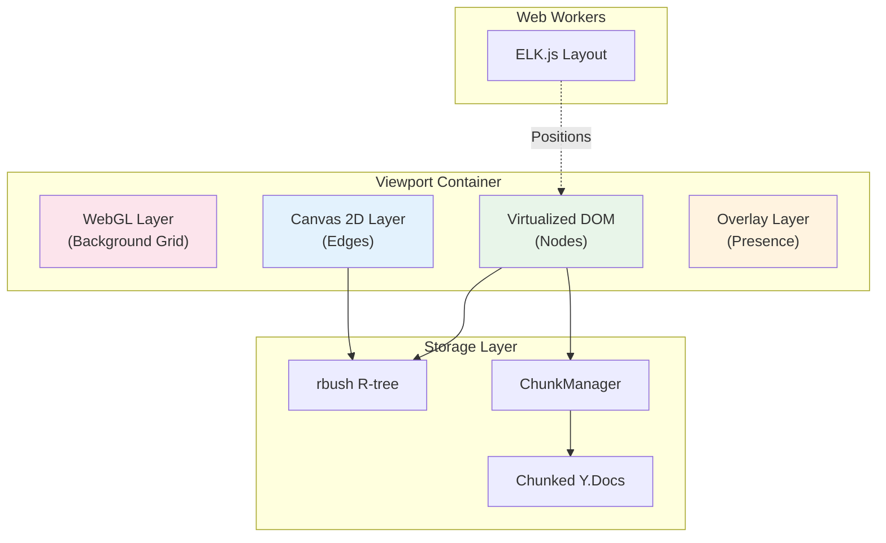
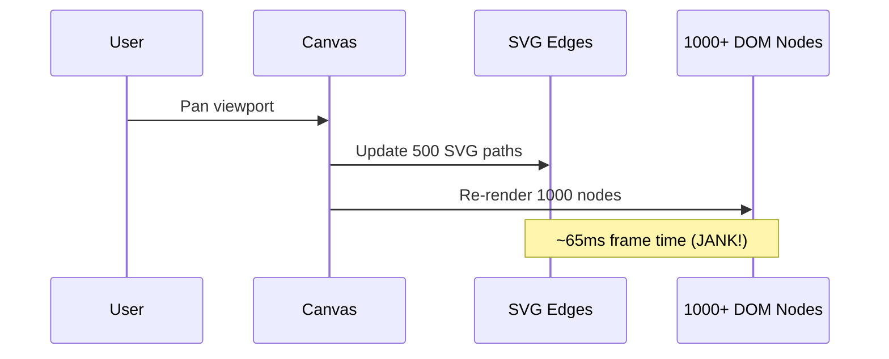
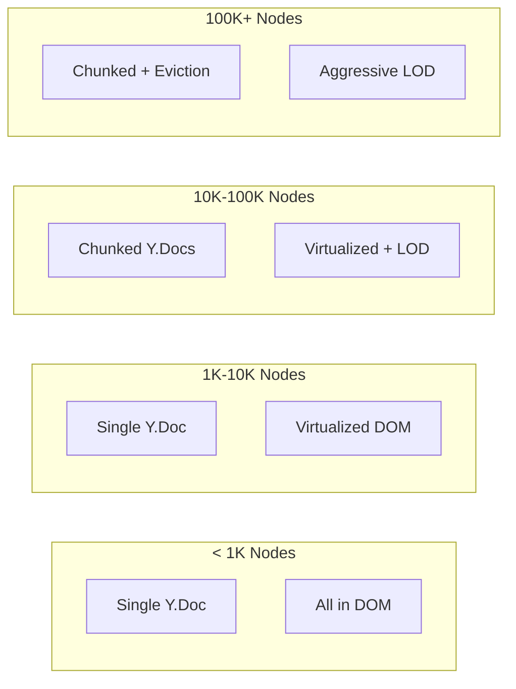

# xNet Implementation Plan - Step 03.9.4: Canvas Optimizations

> Transform xNet's canvas into a professional-grade diagramming surface that rivals Figma, Miro, and Affine

## Executive Summary

This plan implements a complete canvas transformation that:

- Supports **10,000+ nodes** with virtualized rendering and LOD (up from ~500)
- Renders **5,000+ edges** at 60fps using Canvas 2D with path caching
- Provides **infinite grid** via WebGL procedural shaders (zero allocations)
- Enables **real-time collaboration** with live cursors and selection locking
- Implements **rich diagramming** features (Mermaid, shapes, freehand, swimlanes)
- Uses **chunked storage** for truly infinite canvases with lazy-loading

The user experience we're building:

```
1. Create canvases with thousands of nodes and edges
2. Pan and zoom smoothly at any scale (infinite grid)
3. See teammates' cursors and selections in real-time
4. Embed Mermaid diagrams, checklists, and shapes
5. Draw freehand annotations and connectors
6. Auto-layout with ELK.js (off main thread)
7. Navigate large canvases with minimap
```



## Architecture Decisions

| Decision       | Choice                | Rationale                                  |
| -------------- | --------------------- | ------------------------------------------ |
| Grid rendering | WebGL shader          | Procedural = zero allocations at any scale |
| Edge rendering | Canvas 2D + Path2D    | 10x faster than SVG, cacheable paths       |
| Node rendering | Virtualized React DOM | Full component power, accessibility        |
| Presence layer | DOM overlay           | Always-on-top, independent of zoom         |
| Spatial index  | rbush R-tree          | Proven at 100k+ items, O(log n) queries    |
| Storage        | Chunked Y.Docs        | Lazy-load tiles, evict distant chunks      |
| Layout engine  | ELK.js in Worker      | Never blocks main thread                   |

## Current Problems Being Solved



| Problem        | Current State        | Target State              |
| -------------- | -------------------- | ------------------------- |
| Edge rendering | SVG paths (~200 max) | Canvas 2D (~5000+)        |
| Node rendering | All nodes in DOM     | Virtualized visible only  |
| Grid           | None                 | WebGL procedural shader   |
| Presence       | No cursors           | Live cursors + selections |
| Storage        | Single Y.Doc         | Chunked lazy-loading      |
| Layout         | Blocks main thread   | Web Worker                |
| LOD            | None                 | 4 detail levels           |

## Multi-Layer Architecture

```
+------------------------------------------------------------------+
|                        Viewport Container                         |
+------------------------------------------------------------------+
|  +------------------------------------------------------------+  |
|  |              WebGL Layer (Background)                       |  |
|  |  - Infinite grid (procedural, never allocates)              |  |
|  |  - Guides and rulers                                        |  |
|  |  - Performance: 60fps at any zoom level                     |  |
|  +------------------------------------------------------------+  |
|  +------------------------------------------------------------+  |
|  |              Canvas 2D Layer (Edges)                        |  |
|  |  - Bezier curves, orthogonal connectors                     |  |
|  |  - Arrow heads, labels                                      |  |
|  |  - Path2D caching for 10k+ edges                            |  |
|  +------------------------------------------------------------+  |
|  +------------------------------------------------------------+  |
|  |              Virtualized DOM Layer (Nodes)                  |  |
|  |  - Only visible nodes in DOM                                |  |
|  |  - Full React component power                               |  |
|  |  - TipTap editors, databases, code blocks                   |  |
|  |  - LOD: placeholder/minimal/compact/full                    |  |
|  +------------------------------------------------------------+  |
|  +------------------------------------------------------------+  |
|  |              Overlay Layer (Presence)                       |  |
|  |  - Live cursors with user names                             |  |
|  |  - Selection rectangles                                     |  |
|  |  - Comment pins, drag previews                              |  |
|  +------------------------------------------------------------+  |
+------------------------------------------------------------------+
```

## Implementation Phases

### Phase 1: Core Infrastructure (Weeks 1-3)

| Task | Document                                                       | Description                         |
| ---- | -------------------------------------------------------------- | ----------------------------------- |
| 1.1  | [01-webgl-grid-layer.md](./01-webgl-grid-layer.md)             | WebGL context setup and grid shader |
| 1.2  | [01-webgl-grid-layer.md](./01-webgl-grid-layer.md)             | Zoom-responsive grid spacing        |
| 1.3  | [02-canvas2d-edge-layer.md](./02-canvas2d-edge-layer.md)       | Replace SVG with Canvas 2D          |
| 1.4  | [02-canvas2d-edge-layer.md](./02-canvas2d-edge-layer.md)       | Path2D caching and style batching   |
| 1.5  | [03-virtualized-node-layer.md](./03-virtualized-node-layer.md) | Virtualize node rendering           |
| 1.6  | [03-virtualized-node-layer.md](./03-virtualized-node-layer.md) | LOD system (4 detail levels)        |

**Phase 1 Validation Gate:**

- [x] WebGL grid renders at 60fps at any zoom
- [ ] Canvas 2D renders 5000 edges at 60fps
- [ ] Only visible nodes in DOM (+ 300px buffer)
- [ ] LOD reduces detail at zoom < 0.3
- [ ] No jank panning with 5000 nodes

### Phase 2: Lazy-Loading & Scale (Weeks 4-5)

| Task | Document                                         | Description                       |
| ---- | ------------------------------------------------ | --------------------------------- |
| 2.1  | [04-chunked-storage.md](./04-chunked-storage.md) | Chunk-based Y.Doc structure       |
| 2.2  | [04-chunked-storage.md](./04-chunked-storage.md) | ChunkManager with load queue      |
| 2.3  | [04-chunked-storage.md](./04-chunked-storage.md) | Eviction for distant chunks       |
| 2.4  | [05-spatial-index.md](./05-spatial-index.md)     | rbush optimization for 100k nodes |
| 2.5  | [05-spatial-index.md](./05-spatial-index.md)     | Bulk operations for chunk loading |

**Phase 2 Validation Gate:**

- [ ] Chunks load progressively (nearest first)
- [ ] Distant chunks evicted to free memory
- [ ] Cross-chunk edges render correctly
- [ ] Spatial index handles 100k items
- [ ] Memory stays under 100MB for 10k nodes

### Phase 3: Navigation & Presence (Weeks 6-7)

| Task | Document                                               | Description                          |
| ---- | ------------------------------------------------------ | ------------------------------------ |
| 3.1  | [06-minimap.md](./06-minimap.md)                       | Canvas-based minimap                 |
| 3.2  | [06-minimap.md](./06-minimap.md)                       | Click-to-navigate, drag viewport     |
| 3.3  | [07-navigation-tools.md](./07-navigation-tools.md)     | Zoom controls and keyboard shortcuts |
| 3.4  | [07-navigation-tools.md](./07-navigation-tools.md)     | Fit-to-content, reset view           |
| 3.5  | [08-live-cursors.md](./08-live-cursors.md)             | Cursor broadcasting via Awareness    |
| 3.6  | [08-live-cursors.md](./08-live-cursors.md)             | Remote cursor rendering              |
| 3.7  | [09-selection-presence.md](./09-selection-presence.md) | Remote selection indicators          |
| 3.8  | [09-selection-presence.md](./09-selection-presence.md) | Edit locking for nodes               |

**Phase 3 Validation Gate:**

- [ ] Minimap shows all nodes/edges
- [ ] Click minimap navigates viewport
- [ ] Keyboard shortcuts work (Ctrl+0, Ctrl+1)
- [ ] Remote cursors appear within 50ms
- [ ] Edit locking prevents concurrent edits

### Phase 4: Rich Content (Weeks 8-10)

| Task | Document                                           | Description                      |
| ---- | -------------------------------------------------- | -------------------------------- |
| 4.1  | [10-mermaid-diagrams.md](./10-mermaid-diagrams.md) | Mermaid node type                |
| 4.2  | [10-mermaid-diagrams.md](./10-mermaid-diagrams.md) | Live preview and SVG caching     |
| 4.3  | [11-rich-node-types.md](./11-rich-node-types.md)   | Checklist node with keyboard nav |
| 4.4  | [11-rich-node-types.md](./11-rich-node-types.md)   | Embedded pages/databases         |
| 4.5  | [11-rich-node-types.md](./11-rich-node-types.md)   | Shape library (10+ shapes)       |

**Phase 4 Validation Gate:**

- [ ] Mermaid diagrams render correctly
- [ ] Mermaid SVG cached (no re-render on pan)
- [ ] Checklists support Tab indent, Enter add
- [ ] Embeds show linked node content
- [ ] All shapes render and resize correctly

### Phase 5: Drawing & Diagramming (Weeks 11-13)

| Task | Document                                     | Description                      |
| ---- | -------------------------------------------- | -------------------------------- |
| 5.1  | [12-drawing-tools.md](./12-drawing-tools.md) | Freehand drawing with pressure   |
| 5.2  | [12-drawing-tools.md](./12-drawing-tools.md) | Path smoothing (Catmull-Rom)     |
| 5.3  | [13-edge-routing.md](./13-edge-routing.md)   | Orthogonal connector routing     |
| 5.4  | [13-edge-routing.md](./13-edge-routing.md)   | A\* pathfinding around obstacles |
| 5.5  | [14-edge-bundling.md](./14-edge-bundling.md) | Parallel edge detection          |
| 5.6  | [14-edge-bundling.md](./14-edge-bundling.md) | Bundled path rendering           |
| 5.7  | [15-swimlanes.md](./15-swimlanes.md)         | Swimlane container nodes         |
| 5.8  | [15-swimlanes.md](./15-swimlanes.md)         | Drag-into-lane, auto-resize      |

**Phase 5 Validation Gate:**

- [ ] Freehand strokes smooth and responsive
- [ ] Orthogonal routing avoids obstacles
- [ ] Edge bundling groups parallel edges
- [ ] Swimlanes contain and resize correctly
- [ ] All tools work with touch/stylus

### Phase 6: Performance & Polish (Weeks 14-16)

| Task | Document                                                 | Description                      |
| ---- | -------------------------------------------------------- | -------------------------------- |
| 6.1  | [16-worker-layout.md](./16-worker-layout.md)             | ELK.js in Web Worker             |
| 6.2  | [16-worker-layout.md](./16-worker-layout.md)             | Layout progress and cancellation |
| 6.3  | [17-performance-testing.md](./17-performance-testing.md) | Benchmarks at 10k/100k nodes     |
| 6.4  | [17-performance-testing.md](./17-performance-testing.md) | Memory profiling and budgets     |
| 6.5  | [18-accessibility.md](./18-accessibility.md)             | Keyboard navigation              |
| 6.6  | [18-accessibility.md](./18-accessibility.md)             | Screen reader support            |

**Phase 6 Validation Gate:**

- [ ] ELK layout never blocks UI
- [ ] 10k nodes renders at 60fps
- [ ] Memory < 100MB for 10k nodes
- [ ] All actions keyboard accessible
- [ ] Screen reader announces nodes

## Performance Budget

| Metric            | Current | Target  | Measurement       |
| ----------------- | ------- | ------- | ----------------- |
| Nodes before jank | ~500    | 10,000+ | Frame time < 16ms |
| Edges before jank | ~200    | 5,000+  | Frame time < 16ms |
| Pan/zoom latency  | ~5ms    | <2ms    | Performance.now() |
| Initial load (1k) | ~500ms  | <100ms  | First paint       |
| Memory (1k nodes) | ~50MB   | <30MB   | DevTools Memory   |
| Cursor latency    | N/A     | <50ms   | Round-trip        |

## Storage Tiers



## Affected Packages

| Package         | Changes                                       |
| --------------- | --------------------------------------------- |
| `@xnet/canvas`  | All rendering layers, chunk manager, presence |
| `@xnet/sync`    | Awareness for cursor broadcasting             |
| `@xnet/react`   | Canvas hooks, presence hooks                  |
| `apps/electron` | Canvas integration, devtools                  |

## Dependencies

| Dependency         | Package      | Purpose           |
| ------------------ | ------------ | ----------------- |
| `rbush`            | @xnet/canvas | Spatial indexing  |
| `elkjs`            | @xnet/canvas | Auto-layout       |
| `mermaid`          | @xnet/canvas | Diagram rendering |
| `perfect-freehand` | @xnet/canvas | Stroke smoothing  |

## Success Criteria

1. **10k+ nodes** - Canvas with 10k nodes renders at 60fps
2. **5k+ edges** - Canvas 2D handles 5k edges smoothly
3. **Infinite grid** - WebGL grid renders at any zoom level
4. **Live presence** - Cursors appear within 50ms
5. **Rich content** - Mermaid, shapes, freehand all work
6. **Lazy loading** - Only visible chunks in memory
7. **Off-thread layout** - ELK never blocks UI
8. **Accessible** - Full keyboard navigation

## Risk Mitigation

| Risk                | Mitigation                              |
| ------------------- | --------------------------------------- |
| WebGL not supported | Fallback to CSS grid pattern            |
| Canvas 2D too slow  | Further batching, WebGL edges           |
| Memory pressure     | Aggressive chunk eviction               |
| Cursor bandwidth    | Throttle to 30fps, delta encoding       |
| ELK.js size         | Lazy load, tree-shake unused algorithms |

## Timeline Summary

| Phase                 | Duration | Milestone                                |
| --------------------- | -------- | ---------------------------------------- |
| Core Infrastructure   | 3 weeks  | WebGL grid, Canvas edges, virtualization |
| Lazy-Loading & Scale  | 2 weeks  | Chunked storage, spatial optimization    |
| Navigation & Presence | 2 weeks  | Minimap, cursors, selection locking      |
| Rich Content          | 3 weeks  | Mermaid, shapes, embeds                  |
| Drawing & Diagramming | 3 weeks  | Freehand, routing, swimlanes             |
| Performance & Polish  | 3 weeks  | Workers, benchmarks, accessibility       |

**Total: ~16 weeks (4 months)**

## Reference Documents

- [Canvas Optimization Exploration](../../explorations/0068_CANVAS_OPTIMIZATION.md) - Original design document
- [Off-Main-Thread Architecture](../../explorations/0043_OFF_MAIN_THREAD_ARCHITECTURE.md) - Worker design
- [TLDraw](https://github.com/tldraw/tldraw) - Open source canvas reference
- [Excalidraw](https://github.com/excalidraw/excalidraw) - Whiteboard reference
- [rbush](https://github.com/mourner/rbush) - Spatial index library
- [ELK.js](https://github.com/kieler/elkjs) - Layout engine

---

[Back to Main Plan](../plan00Setup/README.md) | [Start Implementation ->](./01-webgl-grid-layer.md)
