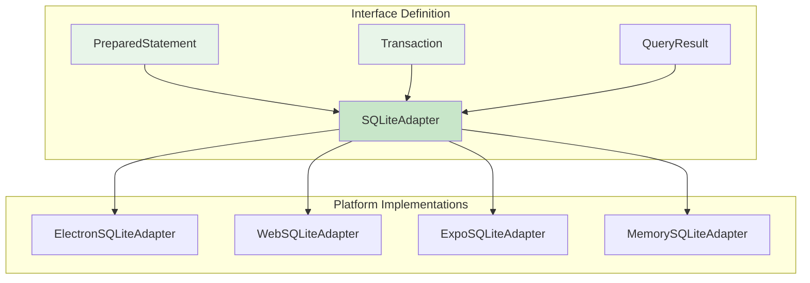

# 01: SQLite Adapter Interface

> Define the unified SQLite adapter interface and create the @xnet/sqlite package scaffold.

**Duration:** 2 days
**Dependencies:** None
**Package:** `packages/sqlite/` (new)

## Overview

This step establishes the foundational interface that all platform-specific SQLite adapters will implement. The interface is designed to:

1. Support both synchronous (better-sqlite3) and asynchronous (wa-sqlite, expo-sqlite) APIs
2. Provide a consistent query interface across platforms
3. Handle prepared statements and transactions
4. Support schema versioning and upgrades



## Package Setup

### 1. Create Package Structure

```bash
mkdir -p packages/sqlite/src/adapters
```

### 2. Package Configuration

```json
// packages/sqlite/package.json
{
  "name": "@xnet/sqlite",
  "version": "0.1.0",
  "description": "Unified SQLite adapter for xNet across all platforms",
  "type": "module",
  "main": "./dist/index.js",
  "types": "./dist/index.d.ts",
  "exports": {
    ".": {
      "import": "./dist/index.js",
      "types": "./dist/index.d.ts"
    },
    "./electron": {
      "import": "./dist/adapters/electron.js",
      "types": "./dist/adapters/electron.d.ts"
    },
    "./web": {
      "import": "./dist/adapters/web.js",
      "types": "./dist/adapters/web.d.ts"
    },
    "./expo": {
      "import": "./dist/adapters/expo.js",
      "types": "./dist/adapters/expo.d.ts"
    },
    "./memory": {
      "import": "./dist/adapters/memory.js",
      "types": "./dist/adapters/memory.d.ts"
    }
  },
  "files": ["dist"],
  "scripts": {
    "build": "tsup",
    "test": "vitest run",
    "test:watch": "vitest",
    "typecheck": "tsc --noEmit"
  },
  "dependencies": {},
  "devDependencies": {
    "tsup": "^8.0.0",
    "typescript": "^5.0.0",
    "vitest": "^2.0.0"
  },
  "peerDependencies": {
    "better-sqlite3": "^11.0.0",
    "wa-sqlite": "^1.0.0",
    "expo-sqlite": "^14.0.0"
  },
  "peerDependenciesMeta": {
    "better-sqlite3": { "optional": true },
    "wa-sqlite": { "optional": true },
    "expo-sqlite": { "optional": true }
  }
}
```

### 3. TypeScript Configuration

```json
// packages/sqlite/tsconfig.json
{
  "extends": "../../tsconfig.base.json",
  "compilerOptions": {
    "outDir": "./dist",
    "rootDir": "./src",
    "declaration": true,
    "declarationMap": true
  },
  "include": ["src/**/*"],
  "exclude": ["node_modules", "dist", "**/*.test.ts"]
}
```

### 4. Build Configuration

```typescript
// packages/sqlite/tsup.config.ts
import { defineConfig } from 'tsup'

export default defineConfig({
  entry: {
    index: 'src/index.ts',
    'adapters/electron': 'src/adapters/electron.ts',
    'adapters/web': 'src/adapters/web.ts',
    'adapters/expo': 'src/adapters/expo.ts',
    'adapters/memory': 'src/adapters/memory.ts'
  },
  format: ['esm'],
  dts: true,
  clean: true,
  external: ['better-sqlite3', 'wa-sqlite', 'expo-sqlite']
})
```

## Interface Definitions

### Core Types

```typescript
// packages/sqlite/src/types.ts

/**
 * SQL parameter types that can be bound to statements.
 */
export type SQLValue = string | number | bigint | Uint8Array | null

/**
 * Row type for query results.
 */
export type SQLRow = Record<string, SQLValue>

/**
 * Result of a mutation query (INSERT, UPDATE, DELETE).
 */
export interface RunResult {
  /** Number of rows affected by the query */
  changes: number
  /** Last inserted row ID (for INSERT with AUTOINCREMENT) */
  lastInsertRowid: bigint
}

/**
 * Configuration options for SQLite database.
 */
export interface SQLiteConfig {
  /** Database file path or name */
  path: string
  /** Enable WAL mode (default: true) */
  walMode?: boolean
  /** Enable foreign keys (default: true) */
  foreignKeys?: boolean
  /** Busy timeout in milliseconds (default: 5000) */
  busyTimeout?: number
}

/**
 * Schema version information.
 */
export interface SchemaVersion {
  version: number
  appliedAt: number
}
```

### SQLite Adapter Interface

```typescript
// packages/sqlite/src/adapter.ts

import type { SQLValue, SQLRow, RunResult, SQLiteConfig, SchemaVersion } from './types'

/**
 * Unified SQLite adapter interface.
 *
 * All platform-specific implementations must implement this interface.
 * The interface uses async methods to support both sync (better-sqlite3)
 * and async (wa-sqlite, expo-sqlite) implementations.
 */
export interface SQLiteAdapter {
  // ─── Lifecycle ─────────────────────────────────────────────────────────

  /**
   * Open the database connection.
   * Creates the database file if it doesn't exist.
   */
  open(config: SQLiteConfig): Promise<void>

  /**
   * Close the database connection.
   * Flushes any pending writes and releases resources.
   */
  close(): Promise<void>

  /**
   * Check if the database is currently open.
   */
  isOpen(): boolean

  // ─── Query Execution ───────────────────────────────────────────────────

  /**
   * Execute a single SQL statement that returns rows.
   * Use for SELECT queries.
   *
   * @param sql - SQL query string
   * @param params - Bound parameters
   * @returns Array of result rows
   *
   * @example
   * const nodes = await db.query<NodeRow>(
   *   'SELECT * FROM nodes WHERE schemaId = ?',
   *   ['xnet://Page/1.0']
   * )
   */
  query<T extends SQLRow = SQLRow>(sql: string, params?: SQLValue[]): Promise<T[]>

  /**
   * Execute a single SQL statement that returns one row.
   * Use for SELECT queries expecting 0 or 1 result.
   *
   * @param sql - SQL query string
   * @param params - Bound parameters
   * @returns Single row or null if not found
   */
  queryOne<T extends SQLRow = SQLRow>(sql: string, params?: SQLValue[]): Promise<T | null>

  /**
   * Execute a single SQL statement that modifies data.
   * Use for INSERT, UPDATE, DELETE queries.
   *
   * @param sql - SQL statement
   * @param params - Bound parameters
   * @returns Run result with changes count and last insert ID
   */
  run(sql: string, params?: SQLValue[]): Promise<RunResult>

  /**
   * Execute raw SQL that may contain multiple statements.
   * Use for schema creation and migrations.
   * Does not support parameter binding.
   *
   * @param sql - SQL statements (may be multiple, separated by semicolons)
   */
  exec(sql: string): Promise<void>

  // ─── Transactions ──────────────────────────────────────────────────────

  /**
   * Execute a function within a transaction.
   * Automatically commits on success, rolls back on error.
   *
   * @param fn - Function to execute within transaction
   * @returns Result of the function
   *
   * @example
   * await db.transaction(async () => {
   *   await db.run('INSERT INTO nodes ...')
   *   await db.run('INSERT INTO changes ...')
   * })
   */
  transaction<T>(fn: () => Promise<T>): Promise<T>

  /**
   * Begin a manual transaction.
   * Must be followed by commit() or rollback().
   */
  beginTransaction(): Promise<void>

  /**
   * Commit the current transaction.
   */
  commit(): Promise<void>

  /**
   * Rollback the current transaction.
   */
  rollback(): Promise<void>

  // ─── Prepared Statements ───────────────────────────────────────────────

  /**
   * Prepare a statement for repeated execution.
   * Useful for bulk operations.
   *
   * @param sql - SQL statement with placeholders
   * @returns Prepared statement handle
   */
  prepare(sql: string): Promise<PreparedStatement>

  // ─── Schema Management ─────────────────────────────────────────────────

  /**
   * Get the current schema version.
   * Returns 0 if no schema has been applied.
   */
  getSchemaVersion(): Promise<number>

  /**
   * Set the schema version after applying migrations.
   */
  setSchemaVersion(version: number): Promise<void>

  /**
   * Apply schema SQL if version is outdated.
   * Handles version checking and updating atomically.
   *
   * @param version - Target schema version
   * @param sql - Schema SQL to execute
   * @returns true if schema was applied, false if already up-to-date
   */
  applySchema(version: number, sql: string): Promise<boolean>

  // ─── Utilities ─────────────────────────────────────────────────────────

  /**
   * Get database file size in bytes.
   * Returns 0 for in-memory databases.
   */
  getDatabaseSize(): Promise<number>

  /**
   * Vacuum the database to reclaim space.
   */
  vacuum(): Promise<void>

  /**
   * Checkpoint WAL file (for WAL mode databases).
   * Returns the number of frames checkpointed.
   */
  checkpoint(): Promise<number>
}

/**
 * Prepared statement for repeated execution.
 */
export interface PreparedStatement {
  /**
   * Execute the statement with parameters and return rows.
   */
  query<T extends SQLRow = SQLRow>(params?: SQLValue[]): Promise<T[]>

  /**
   * Execute the statement with parameters and return one row.
   */
  queryOne<T extends SQLRow = SQLRow>(params?: SQLValue[]): Promise<T | null>

  /**
   * Execute the statement with parameters for modification.
   */
  run(params?: SQLValue[]): Promise<RunResult>

  /**
   * Release the prepared statement.
   */
  finalize(): Promise<void>
}
```

### Schema Definition

```typescript
// packages/sqlite/src/schema.ts

/**
 * Current schema version.
 * Increment this when making schema changes.
 */
export const SCHEMA_VERSION = 1

/**
 * Unified SQLite schema for xNet.
 * This schema is shared across all platforms.
 */
export const SCHEMA_DDL = `
-- ============================================
-- Schema Version Tracking
-- ============================================

CREATE TABLE IF NOT EXISTS _schema_version (
    version INTEGER PRIMARY KEY,
    applied_at INTEGER NOT NULL
);

-- ============================================
-- Core Tables
-- ============================================

-- All nodes (Pages, Databases, Rows, Comments, etc.)
CREATE TABLE IF NOT EXISTS nodes (
    id TEXT PRIMARY KEY,
    schema_id TEXT NOT NULL,
    created_at INTEGER NOT NULL,
    updated_at INTEGER NOT NULL,
    created_by TEXT NOT NULL,
    deleted_at INTEGER
);

-- Node properties (LWW per-property)
CREATE TABLE IF NOT EXISTS node_properties (
    node_id TEXT NOT NULL,
    property_key TEXT NOT NULL,
    value BLOB,
    lamport_time INTEGER NOT NULL,
    updated_by TEXT NOT NULL,
    updated_at INTEGER NOT NULL,

    PRIMARY KEY (node_id, property_key),
    FOREIGN KEY (node_id) REFERENCES nodes(id) ON DELETE CASCADE
);

-- Change log (event sourcing)
CREATE TABLE IF NOT EXISTS changes (
    hash TEXT PRIMARY KEY,
    node_id TEXT NOT NULL,
    payload BLOB NOT NULL,
    lamport_time INTEGER NOT NULL,
    lamport_peer TEXT NOT NULL,
    wall_time INTEGER NOT NULL,
    author TEXT NOT NULL,
    parent_hash TEXT,
    batch_id TEXT,
    signature BLOB NOT NULL,

    FOREIGN KEY (node_id) REFERENCES nodes(id) ON DELETE CASCADE
);

-- Y.Doc binary state (for nodes with collaborative content)
CREATE TABLE IF NOT EXISTS yjs_state (
    node_id TEXT PRIMARY KEY,
    state BLOB NOT NULL,
    updated_at INTEGER NOT NULL,

    FOREIGN KEY (node_id) REFERENCES nodes(id) ON DELETE CASCADE
);

-- Y.Doc incremental updates (for sync)
CREATE TABLE IF NOT EXISTS yjs_updates (
    id INTEGER PRIMARY KEY AUTOINCREMENT,
    node_id TEXT NOT NULL,
    update_data BLOB NOT NULL,
    timestamp INTEGER NOT NULL,
    origin TEXT,

    FOREIGN KEY (node_id) REFERENCES nodes(id) ON DELETE CASCADE
);

-- Yjs snapshots (for document time travel)
CREATE TABLE IF NOT EXISTS yjs_snapshots (
    id INTEGER PRIMARY KEY AUTOINCREMENT,
    node_id TEXT NOT NULL,
    timestamp INTEGER NOT NULL,
    snapshot BLOB NOT NULL,
    doc_state BLOB NOT NULL,
    byte_size INTEGER NOT NULL,

    FOREIGN KEY (node_id) REFERENCES nodes(id) ON DELETE CASCADE
);

-- Blobs (content-addressed)
CREATE TABLE IF NOT EXISTS blobs (
    cid TEXT PRIMARY KEY,
    data BLOB NOT NULL,
    mime_type TEXT,
    size INTEGER NOT NULL,
    created_at INTEGER NOT NULL,
    reference_count INTEGER DEFAULT 1
);

-- Documents (for @xnet/storage compatibility)
CREATE TABLE IF NOT EXISTS documents (
    id TEXT PRIMARY KEY,
    content BLOB NOT NULL,
    metadata TEXT NOT NULL,
    version INTEGER NOT NULL DEFAULT 1
);

-- Signed updates (for @xnet/storage compatibility)
CREATE TABLE IF NOT EXISTS updates (
    id INTEGER PRIMARY KEY AUTOINCREMENT,
    doc_id TEXT NOT NULL,
    update_hash TEXT NOT NULL,
    update_data TEXT NOT NULL,
    created_at INTEGER DEFAULT (strftime('%s', 'now')),
    UNIQUE(doc_id, update_hash)
);

-- Snapshots (for @xnet/storage compatibility)
CREATE TABLE IF NOT EXISTS snapshots (
    doc_id TEXT PRIMARY KEY,
    snapshot_data TEXT NOT NULL,
    created_at INTEGER DEFAULT (strftime('%s', 'now'))
);

-- Sync metadata
CREATE TABLE IF NOT EXISTS sync_state (
    key TEXT PRIMARY KEY,
    value TEXT NOT NULL
);

-- ============================================
-- Indexes
-- ============================================

CREATE INDEX IF NOT EXISTS idx_nodes_schema ON nodes(schema_id);
CREATE INDEX IF NOT EXISTS idx_nodes_updated ON nodes(updated_at);
CREATE INDEX IF NOT EXISTS idx_nodes_created_by ON nodes(created_by);
CREATE INDEX IF NOT EXISTS idx_nodes_deleted ON nodes(deleted_at);

CREATE INDEX IF NOT EXISTS idx_properties_node ON node_properties(node_id);
CREATE INDEX IF NOT EXISTS idx_properties_lamport ON node_properties(lamport_time);

CREATE INDEX IF NOT EXISTS idx_changes_node ON changes(node_id);
CREATE INDEX IF NOT EXISTS idx_changes_lamport ON changes(lamport_time);
CREATE INDEX IF NOT EXISTS idx_changes_wall_time ON changes(wall_time);
CREATE INDEX IF NOT EXISTS idx_changes_batch ON changes(batch_id);

CREATE INDEX IF NOT EXISTS idx_yjs_state_updated ON yjs_state(updated_at);
CREATE INDEX IF NOT EXISTS idx_yjs_updates_node ON yjs_updates(node_id);
CREATE INDEX IF NOT EXISTS idx_yjs_snapshots_node ON yjs_snapshots(node_id);
CREATE INDEX IF NOT EXISTS idx_yjs_snapshots_timestamp ON yjs_snapshots(node_id, timestamp);

CREATE INDEX IF NOT EXISTS idx_updates_doc ON updates(doc_id);
CREATE INDEX IF NOT EXISTS idx_updates_created ON updates(created_at);

-- ============================================
-- Full-Text Search (FTS5)
-- ============================================

-- FTS index for searchable node content
CREATE VIRTUAL TABLE IF NOT EXISTS nodes_fts USING fts5(
    node_id,
    title,
    content,
    tokenize='porter unicode61'
);

-- Triggers to keep FTS in sync will be managed by application layer
-- since the searchable content is derived from node properties
`

/**
 * Schema for future versions (migrations).
 * Each key is the version number, value is the upgrade SQL.
 */
export const SCHEMA_MIGRATIONS: Record<number, string> = {
  // Version 2 migrations would go here
  // 2: `ALTER TABLE nodes ADD COLUMN ...`
}

/**
 * Get the SQL to upgrade from one version to another.
 */
export function getMigrationSQL(fromVersion: number, toVersion: number): string {
  const statements: string[] = []

  for (let v = fromVersion + 1; v <= toVersion; v++) {
    const migration = SCHEMA_MIGRATIONS[v]
    if (migration) {
      statements.push(migration)
    }
  }

  return statements.join('\\n')
}
```

### Query Helpers

```typescript
// packages/sqlite/src/query-builder.ts

import type { SQLValue } from './types'

/**
 * Build a parameterized INSERT statement.
 */
export function buildInsert(
  table: string,
  columns: string[],
  options?: { orReplace?: boolean; orIgnore?: boolean }
): { sql: string; placeholders: string } {
  const placeholders = columns.map(() => '?').join(', ')
  const columnList = columns.join(', ')

  let prefix = 'INSERT'
  if (options?.orReplace) prefix = 'INSERT OR REPLACE'
  if (options?.orIgnore) prefix = 'INSERT OR IGNORE'

  return {
    sql: `${prefix} INTO ${table} (${columnList}) VALUES (${placeholders})`,
    placeholders
  }
}

/**
 * Build a parameterized UPDATE statement.
 */
export function buildUpdate(table: string, columns: string[], whereColumns: string[]): string {
  const setClause = columns.map((c) => `${c} = ?`).join(', ')
  const whereClause = whereColumns.map((c) => `${c} = ?`).join(' AND ')

  return `UPDATE ${table} SET ${setClause} WHERE ${whereClause}`
}

/**
 * Build a parameterized SELECT statement with optional filters.
 */
export function buildSelect(
  table: string,
  columns: string[] = ['*'],
  options?: {
    where?: string[]
    orderBy?: string
    limit?: number
    offset?: number
  }
): string {
  let sql = `SELECT ${columns.join(', ')} FROM ${table}`

  if (options?.where && options.where.length > 0) {
    sql += ` WHERE ${options.where.map((c) => `${c} = ?`).join(' AND ')}`
  }

  if (options?.orderBy) {
    sql += ` ORDER BY ${options.orderBy}`
  }

  if (options?.limit !== undefined) {
    sql += ` LIMIT ${options.limit}`
  }

  if (options?.offset !== undefined) {
    sql += ` OFFSET ${options.offset}`
  }

  return sql
}

/**
 * Escape a string for use in LIKE patterns.
 */
export function escapeLike(value: string): string {
  return value.replace(/[%_\\]/g, '\\$&')
}

/**
 * Build a batch INSERT statement for multiple rows.
 */
export function buildBatchInsert(table: string, columns: string[], rowCount: number): string {
  const placeholders = columns.map(() => '?').join(', ')
  const valuesList = Array(rowCount).fill(`(${placeholders})`).join(', ')
  const columnList = columns.join(', ')

  return `INSERT INTO ${table} (${columnList}) VALUES ${valuesList}`
}
```

### Package Exports

```typescript
// packages/sqlite/src/index.ts

// Types
export type { SQLValue, SQLRow, RunResult, SQLiteConfig, SchemaVersion } from './types'

// Interface
export type { SQLiteAdapter, PreparedStatement } from './adapter'

// Schema
export { SCHEMA_VERSION, SCHEMA_DDL, SCHEMA_MIGRATIONS, getMigrationSQL } from './schema'

// Query helpers
export {
  buildInsert,
  buildUpdate,
  buildSelect,
  buildBatchInsert,
  escapeLike
} from './query-builder'

// Re-export adapters for convenience (tree-shakeable)
// Users should prefer importing from subpaths for smaller bundles
```

## Memory Adapter (for Testing)

```typescript
// packages/sqlite/src/adapters/memory.ts

import type {
  SQLiteAdapter,
  PreparedStatement,
  SQLValue,
  SQLRow,
  RunResult,
  SQLiteConfig
} from '../index'
import { SCHEMA_DDL, SCHEMA_VERSION } from '../schema'

/**
 * In-memory SQLite adapter using sql.js for testing.
 * This adapter is synchronous but exposes async interface for compatibility.
 *
 * Note: Requires sql.js as a dev dependency for tests.
 */
export class MemorySQLiteAdapter implements SQLiteAdapter {
  private db: unknown = null // sql.js Database
  private opened = false
  private inTransaction = false

  async open(config: SQLiteConfig): Promise<void> {
    // Dynamically import sql.js to avoid bundling in production
    const initSqlJs = await import('sql.js').then((m) => m.default)
    const SQL = await initSqlJs()
    this.db = new SQL.Database()
    this.opened = true

    // Apply pragmas
    if (config.foreignKeys !== false) {
      await this.exec('PRAGMA foreign_keys = ON')
    }
  }

  async close(): Promise<void> {
    if (this.db) {
      ;(this.db as { close: () => void }).close()
      this.db = null
    }
    this.opened = false
  }

  isOpen(): boolean {
    return this.opened
  }

  async query<T extends SQLRow = SQLRow>(sql: string, params?: SQLValue[]): Promise<T[]> {
    this.ensureOpen()
    const db = this.db as {
      exec: (sql: string, params?: unknown[]) => { columns: string[]; values: unknown[][] }[]
    }

    try {
      const results = db.exec(sql, params as unknown[] | undefined)
      if (results.length === 0) return []

      const { columns, values } = results[0]
      return values.map((row) => {
        const obj: Record<string, unknown> = {}
        columns.forEach((col, i) => {
          obj[col] = row[i]
        })
        return obj as T
      })
    } catch (err) {
      throw new Error(`Query failed: ${(err as Error).message}\\nSQL: ${sql}`)
    }
  }

  async queryOne<T extends SQLRow = SQLRow>(sql: string, params?: SQLValue[]): Promise<T | null> {
    const rows = await this.query<T>(sql, params)
    return rows[0] ?? null
  }

  async run(sql: string, params?: SQLValue[]): Promise<RunResult> {
    this.ensureOpen()
    const db = this.db as {
      run: (sql: string, params?: unknown[]) => void
      getRowsModified: () => number
    }

    try {
      db.run(sql, params as unknown[] | undefined)
      // sql.js doesn't provide lastInsertRowid directly in run()
      // Query it separately
      const lastId = await this.queryOne<{ id: bigint }>('SELECT last_insert_rowid() as id')

      return {
        changes: db.getRowsModified(),
        lastInsertRowid: lastId?.id ?? BigInt(0)
      }
    } catch (err) {
      throw new Error(`Run failed: ${(err as Error).message}\\nSQL: ${sql}`)
    }
  }

  async exec(sql: string): Promise<void> {
    this.ensureOpen()
    const db = this.db as { run: (sql: string) => void }

    try {
      // Split by semicolons and run each statement
      const statements = sql.split(';').filter((s) => s.trim())
      for (const stmt of statements) {
        db.run(stmt)
      }
    } catch (err) {
      throw new Error(`Exec failed: ${(err as Error).message}\\nSQL: ${sql}`)
    }
  }

  async transaction<T>(fn: () => Promise<T>): Promise<T> {
    await this.beginTransaction()
    try {
      const result = await fn()
      await this.commit()
      return result
    } catch (err) {
      await this.rollback()
      throw err
    }
  }

  async beginTransaction(): Promise<void> {
    if (this.inTransaction) {
      throw new Error('Transaction already in progress')
    }
    await this.exec('BEGIN TRANSACTION')
    this.inTransaction = true
  }

  async commit(): Promise<void> {
    if (!this.inTransaction) {
      throw new Error('No transaction in progress')
    }
    await this.exec('COMMIT')
    this.inTransaction = false
  }

  async rollback(): Promise<void> {
    if (!this.inTransaction) {
      throw new Error('No transaction in progress')
    }
    await this.exec('ROLLBACK')
    this.inTransaction = false
  }

  async prepare(sql: string): Promise<PreparedStatement> {
    // sql.js doesn't have true prepared statements, so we simulate
    return {
      query: async <T extends SQLRow = SQLRow>(params?: SQLValue[]) => this.query<T>(sql, params),
      queryOne: async <T extends SQLRow = SQLRow>(params?: SQLValue[]) =>
        this.queryOne<T>(sql, params),
      run: async (params?: SQLValue[]) => this.run(sql, params),
      finalize: async () => {
        // No-op for sql.js
      }
    }
  }

  async getSchemaVersion(): Promise<number> {
    try {
      const row = await this.queryOne<{ version: number }>(
        'SELECT version FROM _schema_version ORDER BY version DESC LIMIT 1'
      )
      return row?.version ?? 0
    } catch {
      return 0
    }
  }

  async setSchemaVersion(version: number): Promise<void> {
    await this.run('INSERT INTO _schema_version (version, applied_at) VALUES (?, ?)', [
      version,
      Date.now()
    ])
  }

  async applySchema(version: number, sql: string): Promise<boolean> {
    const currentVersion = await this.getSchemaVersion()
    if (currentVersion >= version) {
      return false
    }

    await this.transaction(async () => {
      await this.exec(sql)
      await this.setSchemaVersion(version)
    })

    return true
  }

  async getDatabaseSize(): Promise<number> {
    return 0 // In-memory, no file size
  }

  async vacuum(): Promise<void> {
    await this.exec('VACUUM')
  }

  async checkpoint(): Promise<number> {
    return 0 // No WAL in sql.js
  }

  private ensureOpen(): void {
    if (!this.opened || !this.db) {
      throw new Error('Database not open. Call open() first.')
    }
  }
}

/**
 * Create a MemorySQLiteAdapter with schema applied.
 */
export async function createMemorySQLiteAdapter(): Promise<MemorySQLiteAdapter> {
  const adapter = new MemorySQLiteAdapter()
  await adapter.open({ path: ':memory:' })
  await adapter.applySchema(SCHEMA_VERSION, SCHEMA_DDL)
  return adapter
}
```

## Tests

```typescript
// packages/sqlite/src/adapter.test.ts

import { describe, it, expect, beforeEach, afterEach } from 'vitest'
import { createMemorySQLiteAdapter } from './adapters/memory'
import type { SQLiteAdapter } from './adapter'
import { SCHEMA_VERSION } from './schema'

describe('SQLiteAdapter Interface', () => {
  let db: SQLiteAdapter

  beforeEach(async () => {
    db = await createMemorySQLiteAdapter()
  })

  afterEach(async () => {
    await db.close()
  })

  describe('Lifecycle', () => {
    it('opens and closes database', async () => {
      expect(db.isOpen()).toBe(true)
      await db.close()
      expect(db.isOpen()).toBe(false)
    })

    it('applies schema on creation', async () => {
      const version = await db.getSchemaVersion()
      expect(version).toBe(SCHEMA_VERSION)
    })
  })

  describe('Query Execution', () => {
    it('runs INSERT and SELECT', async () => {
      await db.run(
        'INSERT INTO nodes (id, schema_id, created_at, updated_at, created_by) VALUES (?, ?, ?, ?, ?)',
        ['node-1', 'xnet://Page/1.0', Date.now(), Date.now(), 'did:key:test']
      )

      const rows = await db.query<{ id: string; schema_id: string }>(
        'SELECT id, schema_id FROM nodes WHERE id = ?',
        ['node-1']
      )

      expect(rows).toHaveLength(1)
      expect(rows[0].id).toBe('node-1')
      expect(rows[0].schema_id).toBe('xnet://Page/1.0')
    })

    it('queryOne returns null for no match', async () => {
      const row = await db.queryOne('SELECT * FROM nodes WHERE id = ?', ['nonexistent'])
      expect(row).toBeNull()
    })

    it('queryOne returns single row', async () => {
      await db.run(
        'INSERT INTO nodes (id, schema_id, created_at, updated_at, created_by) VALUES (?, ?, ?, ?, ?)',
        ['node-1', 'xnet://Page/1.0', Date.now(), Date.now(), 'did:key:test']
      )

      const row = await db.queryOne<{ id: string }>('SELECT id FROM nodes WHERE id = ?', ['node-1'])
      expect(row?.id).toBe('node-1')
    })

    it('run returns changes count', async () => {
      await db.run(
        'INSERT INTO nodes (id, schema_id, created_at, updated_at, created_by) VALUES (?, ?, ?, ?, ?)',
        ['node-1', 'xnet://Page/1.0', Date.now(), Date.now(), 'did:key:test']
      )

      const result = await db.run('UPDATE nodes SET schema_id = ? WHERE id = ?', [
        'xnet://Database/1.0',
        'node-1'
      ])

      expect(result.changes).toBe(1)
    })
  })

  describe('Transactions', () => {
    it('commits successful transaction', async () => {
      await db.transaction(async () => {
        await db.run(
          'INSERT INTO nodes (id, schema_id, created_at, updated_at, created_by) VALUES (?, ?, ?, ?, ?)',
          ['node-1', 'xnet://Page/1.0', Date.now(), Date.now(), 'did:key:test']
        )
        await db.run(
          'INSERT INTO nodes (id, schema_id, created_at, updated_at, created_by) VALUES (?, ?, ?, ?, ?)',
          ['node-2', 'xnet://Page/1.0', Date.now(), Date.now(), 'did:key:test']
        )
      })

      const count = await db.queryOne<{ c: number }>('SELECT COUNT(*) as c FROM nodes')
      expect(count?.c).toBe(2)
    })

    it('rolls back failed transaction', async () => {
      try {
        await db.transaction(async () => {
          await db.run(
            'INSERT INTO nodes (id, schema_id, created_at, updated_at, created_by) VALUES (?, ?, ?, ?, ?)',
            ['node-1', 'xnet://Page/1.0', Date.now(), Date.now(), 'did:key:test']
          )
          throw new Error('Intentional failure')
        })
      } catch {
        // Expected
      }

      const count = await db.queryOne<{ c: number }>('SELECT COUNT(*) as c FROM nodes')
      expect(count?.c).toBe(0)
    })
  })

  describe('Schema Management', () => {
    it('returns current schema version', async () => {
      const version = await db.getSchemaVersion()
      expect(version).toBe(SCHEMA_VERSION)
    })

    it('does not re-apply same schema version', async () => {
      // Try to apply the same version again
      const applied = await db.applySchema(SCHEMA_VERSION, 'SELECT 1')
      expect(applied).toBe(false)
    })
  })

  describe('Full-Text Search', () => {
    it('FTS table exists', async () => {
      // Insert into FTS
      await db.run('INSERT INTO nodes_fts (node_id, title, content) VALUES (?, ?, ?)', [
        'node-1',
        'Test Page',
        'This is the content of the test page.'
      ])

      // Search
      const results = await db.query<{ node_id: string }>(
        "SELECT node_id FROM nodes_fts WHERE nodes_fts MATCH 'content'"
      )

      expect(results).toHaveLength(1)
      expect(results[0].node_id).toBe('node-1')
    })
  })
})

describe('Query Helpers', () => {
  it('buildInsert creates correct SQL', async () => {
    const { buildInsert } = await import('./query-builder')

    const { sql } = buildInsert('nodes', ['id', 'schema_id', 'created_at'])
    expect(sql).toBe('INSERT INTO nodes (id, schema_id, created_at) VALUES (?, ?, ?)')
  })

  it('buildInsert with orReplace', async () => {
    const { buildInsert } = await import('./query-builder')

    const { sql } = buildInsert('nodes', ['id', 'value'], { orReplace: true })
    expect(sql).toBe('INSERT OR REPLACE INTO nodes (id, value) VALUES (?, ?)')
  })

  it('buildUpdate creates correct SQL', async () => {
    const { buildUpdate } = await import('./query-builder')

    const sql = buildUpdate('nodes', ['schema_id', 'updated_at'], ['id'])
    expect(sql).toBe('UPDATE nodes SET schema_id = ?, updated_at = ? WHERE id = ?')
  })

  it('buildSelect with options', async () => {
    const { buildSelect } = await import('./query-builder')

    const sql = buildSelect('nodes', ['id', 'schema_id'], {
      where: ['schema_id'],
      orderBy: 'created_at DESC',
      limit: 10,
      offset: 20
    })

    expect(sql).toBe(
      'SELECT id, schema_id FROM nodes WHERE schema_id = ? ORDER BY created_at DESC LIMIT 10 OFFSET 20'
    )
  })
})
```

## Checklist

### Package Setup

- [x] Create `packages/sqlite` directory structure
- [x] Add `package.json` with peer dependencies
- [x] Add `tsconfig.json`
- [x] Add `tsup.config.ts`
- [x] Add to workspace in root `pnpm-workspace.yaml`
- [x] Add to `turbo.json` pipeline

### Interface Implementation

- [x] Define `SQLValue` type
- [x] Define `SQLRow` type
- [x] Define `RunResult` interface
- [x] Define `SQLiteConfig` interface
- [x] Define `SQLiteAdapter` interface
- [x] Define `PreparedStatement` interface

### Schema

- [x] Create unified schema DDL
- [x] Add all table definitions
- [x] Add all indexes
- [x] Add FTS5 virtual table
- [x] Create schema version tracking table
- [x] Add migration helper functions

### Query Helpers

- [x] Implement `buildInsert`
- [x] Implement `buildUpdate`
- [x] Implement `buildSelect`
- [x] Implement `buildBatchInsert`
- [x] Implement `escapeLike`

### Memory Adapter

- [x] Implement `MemorySQLiteAdapter`
- [x] Add sql.js dev dependency
- [x] Implement all interface methods
- [x] Create factory function

### Tests

- [x] Lifecycle tests (open, close)
- [x] Query execution tests
- [x] Transaction tests
- [x] Schema management tests
- [x] FTS tests (skipped for sql.js - no FTS5 support)
- [x] Query helper tests
- [x] Target: 30+ tests (40 passing, 3 skipped)

---

[Back to README](./README.md) | [Next: Electron Adapter ->](./02-electron-better-sqlite3.md)
