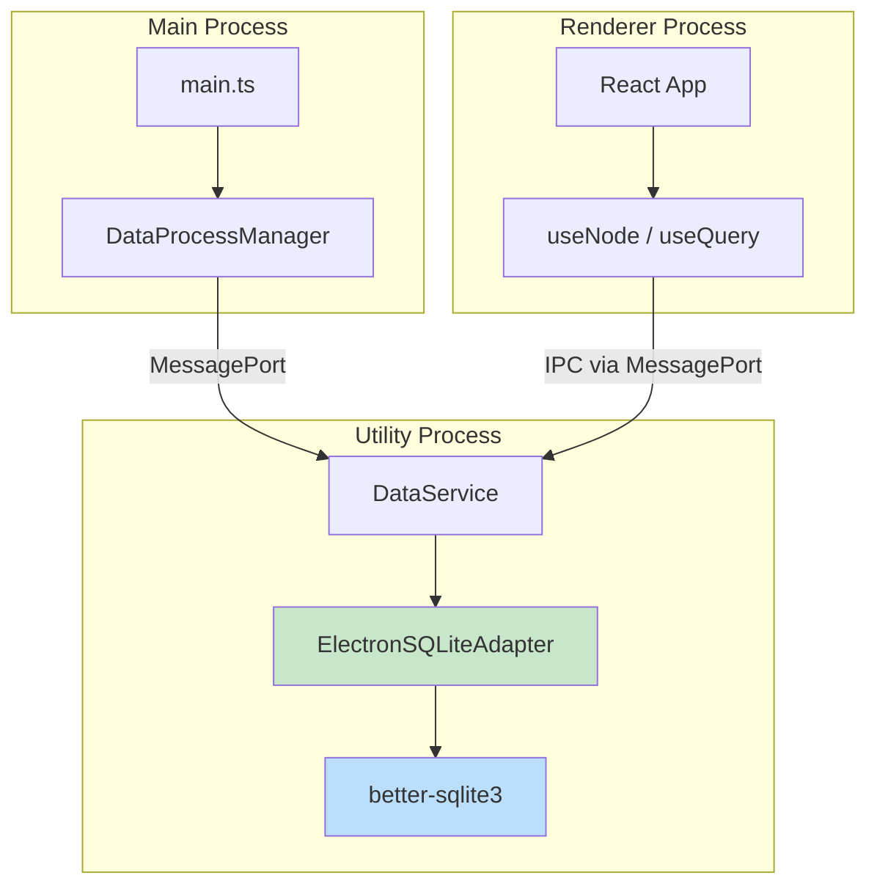

# 02: Electron SQLite Adapter (better-sqlite3)

> Implement the ElectronSQLiteAdapter using better-sqlite3 in the utility process.

**Duration:** 3 days
**Dependencies:** [01-sqlite-adapter-interface.md](./01-sqlite-adapter-interface.md)
**Package:** `packages/sqlite/` and `apps/electron/`

## Overview

The Electron app already uses better-sqlite3 in its utility process (`data-service.ts`), but it's a custom implementation with its own schema. This step creates a proper `ElectronSQLiteAdapter` that implements the unified `SQLiteAdapter` interface and replaces the existing ad-hoc SQLite usage.



## Implementation

### ElectronSQLiteAdapter

````typescript
// packages/sqlite/src/adapters/electron.ts

import type {
  SQLiteAdapter,
  PreparedStatement,
  SQLValue,
  SQLRow,
  RunResult,
  SQLiteConfig
} from '../types'
import { SCHEMA_DDL, SCHEMA_VERSION } from '../schema'
import type Database from 'better-sqlite3'

// better-sqlite3 is imported dynamically to avoid bundling in web
let DatabaseConstructor: typeof Database | null = null

async function getBetterSqlite3(): Promise<typeof Database> {
  if (DatabaseConstructor) return DatabaseConstructor

  // Dynamic import for tree-shaking
  const module = await import('better-sqlite3')
  DatabaseConstructor = module.default
  return DatabaseConstructor
}

/**
 * SQLite adapter for Electron using better-sqlite3.
 *
 * better-sqlite3 is synchronous, which is ideal for Electron's utility process.
 * The async interface is maintained for compatibility with other adapters.
 *
 * @example
 * ```typescript
 * const adapter = new ElectronSQLiteAdapter()
 * await adapter.open({ path: '/path/to/xnet.db' })
 *
 * const nodes = await adapter.query('SELECT * FROM nodes')
 * ```
 */
export class ElectronSQLiteAdapter implements SQLiteAdapter {
  private db: Database.Database | null = null
  private config: SQLiteConfig | null = null
  private inTransaction = false

  // Cached prepared statements for performance
  private statementCache = new Map<string, Database.Statement>()

  async open(config: SQLiteConfig): Promise<void> {
    if (this.db) {
      throw new Error('Database already open. Call close() first.')
    }

    const Database = await getBetterSqlite3()

    this.db = new Database(config.path)
    this.config = config

    // Apply pragmas
    if (config.walMode !== false) {
      this.db.pragma('journal_mode = WAL')
    }

    if (config.foreignKeys !== false) {
      this.db.pragma('foreign_keys = ON')
    }

    if (config.busyTimeout) {
      this.db.pragma(`busy_timeout = ${config.busyTimeout}`)
    } else {
      this.db.pragma('busy_timeout = 5000')
    }

    // Performance optimizations
    this.db.pragma('synchronous = NORMAL')
    this.db.pragma('cache_size = -64000') // 64MB cache
    this.db.pragma('temp_store = MEMORY')
  }

  async close(): Promise<void> {
    if (!this.db) return

    // Clear statement cache
    for (const stmt of this.statementCache.values()) {
      // Statements are auto-finalized in better-sqlite3
    }
    this.statementCache.clear()

    // Checkpoint WAL before close
    if (this.config?.walMode !== false) {
      try {
        this.db.pragma('wal_checkpoint(TRUNCATE)')
      } catch {
        // Ignore checkpoint errors on close
      }
    }

    this.db.close()
    this.db = null
    this.config = null
  }

  isOpen(): boolean {
    return this.db !== null
  }

  async query<T extends SQLRow = SQLRow>(sql: string, params?: SQLValue[]): Promise<T[]> {
    this.ensureOpen()

    try {
      const stmt = this.getOrPrepare(sql)
      const rows = params ? stmt.all(...params) : stmt.all()
      return rows as T[]
    } catch (err) {
      throw this.wrapError(err, sql)
    }
  }

  async queryOne<T extends SQLRow = SQLRow>(sql: string, params?: SQLValue[]): Promise<T | null> {
    this.ensureOpen()

    try {
      const stmt = this.getOrPrepare(sql)
      const row = params ? stmt.get(...params) : stmt.get()
      return (row as T) ?? null
    } catch (err) {
      throw this.wrapError(err, sql)
    }
  }

  async run(sql: string, params?: SQLValue[]): Promise<RunResult> {
    this.ensureOpen()

    try {
      const stmt = this.getOrPrepare(sql)
      const result = params ? stmt.run(...params) : stmt.run()

      return {
        changes: result.changes,
        lastInsertRowid: BigInt(result.lastInsertRowid)
      }
    } catch (err) {
      throw this.wrapError(err, sql)
    }
  }

  async exec(sql: string): Promise<void> {
    this.ensureOpen()

    try {
      this.db!.exec(sql)
    } catch (err) {
      throw this.wrapError(err, sql)
    }
  }

  async transaction<T>(fn: () => Promise<T>): Promise<T> {
    this.ensureOpen()

    // Use better-sqlite3's transaction for sync operations
    // But we need to handle async fn, so we use manual begin/commit
    await this.beginTransaction()

    try {
      const result = await fn()
      await this.commit()
      return result
    } catch (err) {
      await this.rollback()
      throw err
    }
  }

  /**
   * Synchronous transaction for performance-critical batch operations.
   * Prefer this over async transaction when the body is synchronous.
   */
  transactionSync<T>(fn: () => T): T {
    this.ensureOpen()

    const txn = this.db!.transaction(fn)
    return txn()
  }

  async beginTransaction(): Promise<void> {
    if (this.inTransaction) {
      throw new Error('Transaction already in progress')
    }

    this.db!.exec('BEGIN IMMEDIATE')
    this.inTransaction = true
  }

  async commit(): Promise<void> {
    if (!this.inTransaction) {
      throw new Error('No transaction in progress')
    }

    this.db!.exec('COMMIT')
    this.inTransaction = false
  }

  async rollback(): Promise<void> {
    if (!this.inTransaction) {
      return // Silently ignore if no transaction (for cleanup in error handlers)
    }

    this.db!.exec('ROLLBACK')
    this.inTransaction = false
  }

  async prepare(sql: string): Promise<PreparedStatement> {
    this.ensureOpen()

    const stmt = this.db!.prepare(sql)

    return {
      query: async <T extends SQLRow = SQLRow>(params?: SQLValue[]): Promise<T[]> => {
        const rows = params ? stmt.all(...params) : stmt.all()
        return rows as T[]
      },
      queryOne: async <T extends SQLRow = SQLRow>(params?: SQLValue[]): Promise<T | null> => {
        const row = params ? stmt.get(...params) : stmt.get()
        return (row as T) ?? null
      },
      run: async (params?: SQLValue[]): Promise<RunResult> => {
        const result = params ? stmt.run(...params) : stmt.run()
        return {
          changes: result.changes,
          lastInsertRowid: BigInt(result.lastInsertRowid)
        }
      },
      finalize: async () => {
        // better-sqlite3 auto-finalizes statements
      }
    }
  }

  async getSchemaVersion(): Promise<number> {
    try {
      const row = await this.queryOne<{ version: number }>(
        'SELECT version FROM _schema_version ORDER BY version DESC LIMIT 1'
      )
      return row?.version ?? 0
    } catch {
      // Table doesn't exist yet
      return 0
    }
  }

  async setSchemaVersion(version: number): Promise<void> {
    await this.run('INSERT INTO _schema_version (version, applied_at) VALUES (?, ?)', [
      version,
      Date.now()
    ])
  }

  async applySchema(version: number, sql: string): Promise<boolean> {
    const currentVersion = await this.getSchemaVersion()

    if (currentVersion >= version) {
      return false
    }

    return this.transactionSync(() => {
      this.db!.exec(sql)
      this.db!.prepare('INSERT INTO _schema_version (version, applied_at) VALUES (?, ?)').run(
        version,
        Date.now()
      )
      return true
    })
  }

  async getDatabaseSize(): Promise<number> {
    try {
      const row = await this.queryOne<{ page_count: number; page_size: number }>(
        'SELECT page_count, page_size FROM pragma_page_count(), pragma_page_size()'
      )

      if (row) {
        return row.page_count * row.page_size
      }

      // Fallback: use file system
      if (this.config?.path && this.config.path !== ':memory:') {
        const { statSync } = await import('fs')
        try {
          const stats = statSync(this.config.path)
          return stats.size
        } catch {
          return 0
        }
      }

      return 0
    } catch {
      return 0
    }
  }

  async vacuum(): Promise<void> {
    this.ensureOpen()
    this.db!.exec('VACUUM')
  }

  async checkpoint(): Promise<number> {
    this.ensureOpen()

    const result = this.db!.pragma('wal_checkpoint(PASSIVE)') as [
      { busy: number; log: number; checkpointed: number }
    ]

    return result[0]?.checkpointed ?? 0
  }

  // ─── Helper Methods ─────────────────────────────────────────────────────

  /**
   * Get a statement from cache or prepare it.
   * Statement caching significantly improves performance for repeated queries.
   */
  private getOrPrepare(sql: string): Database.Statement {
    let stmt = this.statementCache.get(sql)

    if (!stmt) {
      stmt = this.db!.prepare(sql)
      this.statementCache.set(sql, stmt)
    }

    return stmt
  }

  private ensureOpen(): void {
    if (!this.db) {
      throw new Error('Database not open. Call open() first.')
    }
  }

  private wrapError(err: unknown, sql: string): Error {
    const message = err instanceof Error ? err.message : String(err)
    return new Error(
      `SQLite error: ${message}\nSQL: ${sql.slice(0, 200)}${sql.length > 200 ? '...' : ''}`
    )
  }

  // ─── Electron-Specific Methods ──────────────────────────────────────────

  /**
   * Get the underlying better-sqlite3 database instance.
   * Use for advanced operations not covered by the interface.
   */
  getRawDatabase(): Database.Database {
    this.ensureOpen()
    return this.db!
  }

  /**
   * Create a batch writer for efficient bulk inserts.
   */
  createBatchWriter(options?: { maxBatchSize?: number }): ElectronBatchWriter {
    return new ElectronBatchWriter(this, options)
  }
}

/**
 * Batch writer for efficient bulk operations.
 * Batches multiple writes and executes them in a single transaction.
 */
export class ElectronBatchWriter {
  private adapter: ElectronSQLiteAdapter
  private pendingOps: Array<{ sql: string; params: SQLValue[] }> = []
  private maxBatchSize: number
  private flushTimer: ReturnType<typeof setTimeout> | null = null
  private flushPromise: Promise<void> | null = null

  constructor(adapter: ElectronSQLiteAdapter, options?: { maxBatchSize?: number }) {
    this.adapter = adapter
    this.maxBatchSize = options?.maxBatchSize ?? 100
  }

  /**
   * Queue an operation for batch execution.
   */
  queue(sql: string, params: SQLValue[]): void {
    this.pendingOps.push({ sql, params })

    if (this.pendingOps.length >= this.maxBatchSize) {
      this.flush()
    } else if (!this.flushTimer) {
      // Flush after short delay if no more writes
      this.flushTimer = setTimeout(() => this.flush(), 50)
    }
  }

  /**
   * Flush all pending operations.
   */
  async flush(): Promise<void> {
    if (this.flushTimer) {
      clearTimeout(this.flushTimer)
      this.flushTimer = null
    }

    if (this.pendingOps.length === 0) return

    // If already flushing, wait for it
    if (this.flushPromise) {
      await this.flushPromise
      return this.flush() // Check if more ops queued during wait
    }

    const ops = this.pendingOps
    this.pendingOps = []

    this.flushPromise = (async () => {
      this.adapter.transactionSync(() => {
        const db = this.adapter.getRawDatabase()
        for (const { sql, params } of ops) {
          db.prepare(sql).run(...params)
        }
      })
    })()

    try {
      await this.flushPromise
    } finally {
      this.flushPromise = null
    }
  }

  /**
   * Close the batch writer, flushing any pending operations.
   */
  async close(): Promise<void> {
    await this.flush()
  }
}

// ─── Factory Functions ───────────────────────────────────────────────────────

/**
 * Create an ElectronSQLiteAdapter with schema applied.
 */
export async function createElectronSQLiteAdapter(
  config: SQLiteConfig
): Promise<ElectronSQLiteAdapter> {
  const adapter = new ElectronSQLiteAdapter()
  await adapter.open(config)
  await adapter.applySchema(SCHEMA_VERSION, SCHEMA_DDL)
  return adapter
}
````

### Integration with DataService

```typescript
// apps/electron/src/data-process/data-service.ts changes

import { createElectronSQLiteAdapter, type ElectronSQLiteAdapter } from '@xnet/sqlite/electron'
import { SCHEMA_VERSION, SCHEMA_DDL } from '@xnet/sqlite'

// Replace the existing db initialization in createDataService:

export function createDataService(config: DataServiceConfig): DataService {
  let adapter: ElectronSQLiteAdapter | null = null
  // ... other state ...

  return {
    async initialize(): Promise<void> {
      log('Initializing database at:', config.dbPath)

      // Create adapter with unified schema
      adapter = await createElectronSQLiteAdapter({
        path: config.dbPath,
        walMode: true,
        foreignKeys: true,
        busyTimeout: 5000
      })

      log('Database initialized with schema version:', await adapter.getSchemaVersion())
    },

    async shutdown(): Promise<void> {
      // ... existing cleanup ...

      if (adapter) {
        await adapter.close()
        adapter = null
      }
    },

    // Update blob operations to use adapter
    async getBlob(cid: string): Promise<Uint8Array | null> {
      if (!adapter) return null

      const row = await adapter.queryOne<{ data: Buffer }>('SELECT data FROM blobs WHERE cid = ?', [
        cid
      ])

      return row ? new Uint8Array(row.data) : null
    },

    async putBlob(data: Uint8Array): Promise<string> {
      if (!adapter) throw new Error('Database not initialized')

      const hash = hashContent(data)
      const cid = createContentId(hash)

      await adapter.run(
        'INSERT OR IGNORE INTO blobs (cid, data, size, created_at) VALUES (?, ?, ?, ?)',
        [cid, data, data.byteLength, Date.now()]
      )

      return cid
    },

    async hasBlob(cid: string): Promise<boolean> {
      if (!adapter) return false

      const row = await adapter.queryOne<{ exists: number }>(
        'SELECT 1 as exists FROM blobs WHERE cid = ?',
        [cid]
      )

      return !!row
    }

    // ... rest of the implementation using adapter ...
  }
}
```

### Remove Old SQLite Code

The existing `sqlite-batch.ts` can be replaced with the new `ElectronBatchWriter` class. Update imports in `data-service.ts` accordingly.

## Migration Path

Since this is prerelease software with no migration requirements, the implementation is straightforward:

1. **Replace schema**: The unified schema replaces the existing ad-hoc schema
2. **Clear existing data**: On first run with new version, existing databases are incompatible
3. **Fresh start**: Users get a clean database with the new schema

```typescript
// Optional: Add version check and auto-clear in initialize()

async initialize(): Promise<void> {
  const dbPath = config.dbPath

  // Check if database exists and has old schema
  if (existsSync(dbPath)) {
    try {
      const tempAdapter = new ElectronSQLiteAdapter()
      await tempAdapter.open({ path: dbPath })
      const version = await tempAdapter.getSchemaVersion()
      await tempAdapter.close()

      if (version === 0) {
        // Old database without version tracking - delete it
        log('Found old database without version tracking, removing...')
        unlinkSync(dbPath)
        unlinkSync(`${dbPath}-wal`)
        unlinkSync(`${dbPath}-shm`)
      }
    } catch {
      // Corrupted database - delete it
      log('Found corrupted database, removing...')
      try { unlinkSync(dbPath) } catch {}
      try { unlinkSync(`${dbPath}-wal`) } catch {}
      try { unlinkSync(`${dbPath}-shm`) } catch {}
    }
  }

  // Now create fresh database with unified schema
  adapter = await createElectronSQLiteAdapter({
    path: dbPath,
    walMode: true,
    foreignKeys: true,
    busyTimeout: 5000
  })
}
```

## Performance Optimizations

### Statement Caching

The adapter automatically caches prepared statements. This is critical for performance:

```typescript
// Without caching: ~0.5ms per query (prepare + execute)
// With caching: ~0.05ms per query (execute only)
```

### Batch Writer

For bulk operations, use the batch writer:

```typescript
const batchWriter = adapter.createBatchWriter({ maxBatchSize: 100 })

// Queue many writes
for (const node of nodes) {
  batchWriter.queue(
    'INSERT INTO nodes (id, schema_id, ...) VALUES (?, ?, ...)',
    [node.id, node.schemaId, ...]
  )
}

// Flush remaining
await batchWriter.close()
```

### WAL Mode

WAL (Write-Ahead Logging) is enabled by default:

- **Readers don't block writers** - concurrent reads during writes
- **Writers don't block readers** - reads see consistent snapshot
- **Better crash recovery** - atomic commits
- **Periodic checkpoint** - consolidate WAL into main database

```typescript
// Checkpoint WAL periodically (every 5 minutes)
setInterval(
  () => {
    adapter.checkpoint().catch(console.error)
  },
  5 * 60 * 1000
)

// Full checkpoint on close
await adapter.close() // Automatically checkpoints
```

## Tests

```typescript
// packages/sqlite/src/adapters/electron.test.ts

import { describe, it, expect, beforeEach, afterEach, vi } from 'vitest'
import { ElectronSQLiteAdapter, createElectronSQLiteAdapter } from './electron'
import { SCHEMA_VERSION } from '../schema'
import { tmpdir } from 'os'
import { join } from 'path'
import { unlinkSync, existsSync } from 'fs'
import { randomUUID } from 'crypto'

// Test database helper
function getTestDbPath(): string {
  return join(tmpdir(), `xnet-test-${randomUUID()}.db`)
}

function cleanupDb(path: string): void {
  const files = [path, `${path}-wal`, `${path}-shm`]
  for (const file of files) {
    try {
      if (existsSync(file)) unlinkSync(file)
    } catch {}
  }
}

describe('ElectronSQLiteAdapter', () => {
  let adapter: ElectronSQLiteAdapter
  let dbPath: string

  beforeEach(async () => {
    dbPath = getTestDbPath()
    adapter = await createElectronSQLiteAdapter({ path: dbPath })
  })

  afterEach(async () => {
    await adapter.close()
    cleanupDb(dbPath)
  })

  describe('Lifecycle', () => {
    it('creates database file', () => {
      expect(existsSync(dbPath)).toBe(true)
    })

    it('enables WAL mode', async () => {
      const result = await adapter.queryOne<{ journal_mode: string }>('PRAGMA journal_mode')
      expect(result?.journal_mode).toBe('wal')
    })

    it('enables foreign keys', async () => {
      const result = await adapter.queryOne<{ foreign_keys: number }>('PRAGMA foreign_keys')
      expect(result?.foreign_keys).toBe(1)
    })

    it('applies schema on creation', async () => {
      const version = await adapter.getSchemaVersion()
      expect(version).toBe(SCHEMA_VERSION)
    })

    it('closes cleanly', async () => {
      await adapter.close()
      expect(adapter.isOpen()).toBe(false)
    })

    it('checkpoints WAL on close', async () => {
      // Write some data
      await adapter.run(
        'INSERT INTO nodes (id, schema_id, created_at, updated_at, created_by) VALUES (?, ?, ?, ?, ?)',
        ['node-1', 'xnet://Page/1.0', Date.now(), Date.now(), 'did:key:test']
      )

      await adapter.close()

      // WAL file should be empty or removed after checkpoint
      const walPath = `${dbPath}-wal`
      if (existsSync(walPath)) {
        const { statSync } = await import('fs')
        const stats = statSync(walPath)
        expect(stats.size).toBe(0)
      }
    })
  })

  describe('Query Execution', () => {
    it('inserts and queries rows', async () => {
      const now = Date.now()

      await adapter.run(
        'INSERT INTO nodes (id, schema_id, created_at, updated_at, created_by) VALUES (?, ?, ?, ?, ?)',
        ['node-1', 'xnet://Page/1.0', now, now, 'did:key:test']
      )

      const rows = await adapter.query<{ id: string; schema_id: string }>(
        'SELECT id, schema_id FROM nodes'
      )

      expect(rows).toHaveLength(1)
      expect(rows[0].id).toBe('node-1')
    })

    it('returns run result with changes count', async () => {
      const now = Date.now()

      await adapter.run(
        'INSERT INTO nodes (id, schema_id, created_at, updated_at, created_by) VALUES (?, ?, ?, ?, ?)',
        ['node-1', 'xnet://Page/1.0', now, now, 'did:key:test']
      )

      const result = await adapter.run('UPDATE nodes SET schema_id = ? WHERE id = ?', [
        'xnet://Database/1.0',
        'node-1'
      ])

      expect(result.changes).toBe(1)
    })

    it('returns lastInsertRowid for autoincrement', async () => {
      const result = await adapter.run(
        'INSERT INTO yjs_updates (node_id, update_data, timestamp) VALUES (?, ?, ?)',
        ['node-1', new Uint8Array([1, 2, 3]), Date.now()]
      )

      expect(result.lastInsertRowid).toBeGreaterThan(0n)
    })

    it('handles binary data (Uint8Array)', async () => {
      const binaryData = new Uint8Array([1, 2, 3, 4, 5])

      await adapter.run('INSERT INTO blobs (cid, data, size, created_at) VALUES (?, ?, ?, ?)', [
        'cid-1',
        binaryData,
        binaryData.byteLength,
        Date.now()
      ])

      const row = await adapter.queryOne<{ data: Buffer }>('SELECT data FROM blobs WHERE cid = ?', [
        'cid-1'
      ])

      expect(row?.data).toBeDefined()
      expect(new Uint8Array(row!.data)).toEqual(binaryData)
    })
  })

  describe('Transactions', () => {
    it('commits successful transaction', async () => {
      const now = Date.now()

      await adapter.transaction(async () => {
        await adapter.run(
          'INSERT INTO nodes (id, schema_id, created_at, updated_at, created_by) VALUES (?, ?, ?, ?, ?)',
          ['node-1', 'xnet://Page/1.0', now, now, 'did:key:test']
        )
        await adapter.run(
          'INSERT INTO nodes (id, schema_id, created_at, updated_at, created_by) VALUES (?, ?, ?, ?, ?)',
          ['node-2', 'xnet://Page/1.0', now, now, 'did:key:test']
        )
      })

      const count = await adapter.queryOne<{ c: number }>('SELECT COUNT(*) as c FROM nodes')
      expect(count?.c).toBe(2)
    })

    it('rolls back on error', async () => {
      const now = Date.now()

      await adapter.run(
        'INSERT INTO nodes (id, schema_id, created_at, updated_at, created_by) VALUES (?, ?, ?, ?, ?)',
        ['existing', 'xnet://Page/1.0', now, now, 'did:key:test']
      )

      await expect(
        adapter.transaction(async () => {
          await adapter.run(
            'INSERT INTO nodes (id, schema_id, created_at, updated_at, created_by) VALUES (?, ?, ?, ?, ?)',
            ['node-1', 'xnet://Page/1.0', now, now, 'did:key:test']
          )
          // This will fail (duplicate primary key)
          await adapter.run(
            'INSERT INTO nodes (id, schema_id, created_at, updated_at, created_by) VALUES (?, ?, ?, ?, ?)',
            ['existing', 'xnet://Page/1.0', now, now, 'did:key:test']
          )
        })
      ).rejects.toThrow()

      // Only 'existing' should be in database
      const count = await adapter.queryOne<{ c: number }>('SELECT COUNT(*) as c FROM nodes')
      expect(count?.c).toBe(1)
    })

    it('supports sync transactions for performance', () => {
      const now = Date.now()

      adapter.transactionSync(() => {
        const db = adapter.getRawDatabase()

        db.prepare(
          'INSERT INTO nodes (id, schema_id, created_at, updated_at, created_by) VALUES (?, ?, ?, ?, ?)'
        ).run('node-1', 'xnet://Page/1.0', now, now, 'did:key:test')

        db.prepare(
          'INSERT INTO nodes (id, schema_id, created_at, updated_at, created_by) VALUES (?, ?, ?, ?, ?)'
        ).run('node-2', 'xnet://Page/1.0', now, now, 'did:key:test')
      })

      // Verify synchronously
      const db = adapter.getRawDatabase()
      const count = db.prepare('SELECT COUNT(*) as c FROM nodes').get() as { c: number }
      expect(count.c).toBe(2)
    })
  })

  describe('Prepared Statements', () => {
    it('executes prepared statement multiple times', async () => {
      const stmt = await adapter.prepare(
        'INSERT INTO nodes (id, schema_id, created_at, updated_at, created_by) VALUES (?, ?, ?, ?, ?)'
      )

      const now = Date.now()

      await stmt.run(['node-1', 'xnet://Page/1.0', now, now, 'did:key:test'])
      await stmt.run(['node-2', 'xnet://Page/1.0', now, now, 'did:key:test'])
      await stmt.run(['node-3', 'xnet://Page/1.0', now, now, 'did:key:test'])

      await stmt.finalize()

      const count = await adapter.queryOne<{ c: number }>('SELECT COUNT(*) as c FROM nodes')
      expect(count?.c).toBe(3)
    })
  })

  describe('Performance', () => {
    it('handles 1000 inserts efficiently', async () => {
      const start = performance.now()
      const now = Date.now()

      adapter.transactionSync(() => {
        const db = adapter.getRawDatabase()
        const stmt = db.prepare(
          'INSERT INTO nodes (id, schema_id, created_at, updated_at, created_by) VALUES (?, ?, ?, ?, ?)'
        )

        for (let i = 0; i < 1000; i++) {
          stmt.run(`node-${i}`, 'xnet://Page/1.0', now, now, 'did:key:test')
        }
      })

      const elapsed = performance.now() - start

      expect(elapsed).toBeLessThan(500) // Should complete in under 500ms

      const count = await adapter.queryOne<{ c: number }>('SELECT COUNT(*) as c FROM nodes')
      expect(count?.c).toBe(1000)
    })

    it('queries 1000 rows efficiently', async () => {
      const now = Date.now()

      // Insert test data
      adapter.transactionSync(() => {
        const db = adapter.getRawDatabase()
        const stmt = db.prepare(
          'INSERT INTO nodes (id, schema_id, created_at, updated_at, created_by) VALUES (?, ?, ?, ?, ?)'
        )

        for (let i = 0; i < 1000; i++) {
          stmt.run(`node-${i}`, 'xnet://Page/1.0', now, now, 'did:key:test')
        }
      })

      // Query
      const start = performance.now()
      const rows = await adapter.query('SELECT * FROM nodes')
      const elapsed = performance.now() - start

      expect(rows).toHaveLength(1000)
      expect(elapsed).toBeLessThan(50) // Should complete in under 50ms
    })
  })

  describe('FTS5', () => {
    it('supports full-text search', async () => {
      await adapter.run('INSERT INTO nodes_fts (node_id, title, content) VALUES (?, ?, ?)', [
        'node-1',
        'Meeting Notes',
        'Discussion about project timeline and deliverables'
      ])
      await adapter.run('INSERT INTO nodes_fts (node_id, title, content) VALUES (?, ?, ?)', [
        'node-2',
        'Shopping List',
        'Milk, eggs, bread, butter'
      ])

      const results = await adapter.query<{ node_id: string }>(
        "SELECT node_id FROM nodes_fts WHERE nodes_fts MATCH 'project timeline'"
      )

      expect(results).toHaveLength(1)
      expect(results[0].node_id).toBe('node-1')
    })

    it('supports FTS5 phrase queries', async () => {
      await adapter.run('INSERT INTO nodes_fts (node_id, title, content) VALUES (?, ?, ?)', [
        'node-1',
        'Title',
        'The quick brown fox jumps over the lazy dog'
      ])

      const results = await adapter.query<{ node_id: string }>(
        `SELECT node_id FROM nodes_fts WHERE nodes_fts MATCH '"quick brown"'`
      )

      expect(results).toHaveLength(1)
    })
  })
})
```

## Checklist

### Implementation

- [x] Create `ElectronSQLiteAdapter` class
- [x] Implement all `SQLiteAdapter` interface methods
- [x] Add statement caching
- [x] Add `transactionSync` for performance-critical operations
- [x] Add `ElectronBatchWriter` class
- [x] Add `createElectronSQLiteAdapter` factory function

### Integration

- [x] Update `data-service.ts` to use `ElectronSQLiteAdapter`
- [x] Replace blob operations with adapter queries
- [ ] Update document operations with adapter queries
- [ ] Remove old `sqlite-batch.ts` (or merge into adapter)
- [x] Update imports throughout Electron app

### Performance

- [x] Enable statement caching
- [x] Configure WAL mode with appropriate pragmas
- [ ] Set up periodic WAL checkpoint
- [ ] Benchmark 1000 insert operations (target: <500ms)
- [ ] Benchmark 1000 query operations (target: <50ms)

### Testing

- [x] Lifecycle tests (open, close, WAL mode)
- [x] Query execution tests
- [x] Transaction tests (commit, rollback)
- [x] Binary data handling tests
- [x] Prepared statement tests
- [ ] Performance benchmarks
- [x] FTS5 tests
- [x] Target: 30+ tests (40 passing)

### Cleanup

- [ ] Remove IndexedDB code from Electron
- [ ] Remove idb dependency from Electron

---

[Back to README](./README.md) | [Previous: Interface](./01-sqlite-adapter-interface.md) | [Next: Web Adapter ->](./03-web-wa-sqlite-opfs.md)
