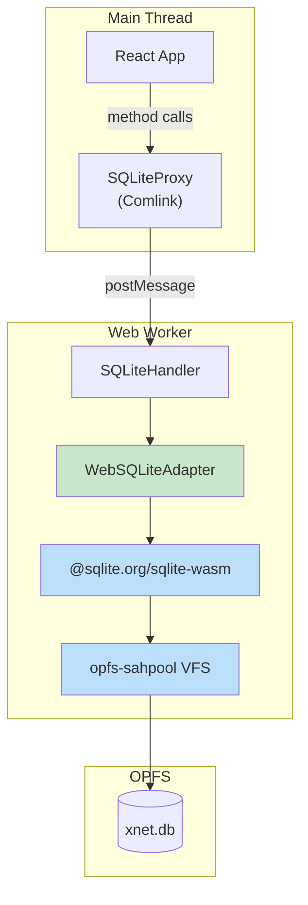

# 03: Web SQLite Adapter (@sqlite.org/sqlite-wasm + OPFS)

> Implement the WebSQLiteAdapter using the official SQLite WASM package with OPFS for browser-based persistence.

**Duration:** 4 days
**Dependencies:** [01-sqlite-adapter-interface.md](./01-sqlite-adapter-interface.md)
**Package:** `packages/sqlite/` and `apps/web/`

## Overview

For web browsers, we use the **official SQLite WASM package** (`@sqlite.org/sqlite-wasm`) maintained by the SQLite team. This provides production-ready WebAssembly bindings with excellent OPFS (Origin Private File System) support.

The package offers two OPFS-based VFS options:

| VFS            | Use Case        | Pros                                           | Cons                                        |
| -------------- | --------------- | ---------------------------------------------- | ------------------------------------------- |
| `opfs`         | Multi-tab apps  | Transparent concurrency                        | Requires COOP/COEP headers, Safari 17+ only |
| `opfs-sahpool` | Single-tab apps | Faster, works Safari 16.4+, no special headers | No concurrency support                      |

For xNet, we'll use `opfs-sahpool` as it:

- Works on all modern browsers including Safari 16.4+
- Provides the best performance
- Doesn't require special HTTP headers
- xNet already handles multi-device sync via the signaling server

SQLite runs in a **Web Worker** to keep the main thread responsive.



## Browser Compatibility

### OPFS-SAHPool Support Matrix

| Browser    | Version | Status    | Notes                            |
| ---------- | ------- | --------- | -------------------------------- |
| Chrome     | 102+    | Supported | March 2022+                      |
| Edge       | 102+    | Supported | March 2022+                      |
| Firefox    | 111+    | Supported | March 2023+                      |
| Safari     | 16.4+   | Supported | March 2023+ (opfs-sahpool works) |
| Safari     | 17+     | Full      | Full opfs VFS support            |
| iOS Safari | 16.4+   | Supported | opfs-sahpool works               |

**Note:** Unlike the `opfs` VFS, `opfs-sahpool` does NOT require COOP/COEP headers, making deployment simpler.

### Browser Support Check

```typescript
// packages/sqlite/src/browser-support.ts

export interface BrowserSupport {
  opfs: boolean
  worker: boolean
  supported: boolean
  reason?: string
}

/**
 * Check if the current browser supports SQLite-WASM with OPFS.
 */
export async function checkBrowserSupport(): Promise<BrowserSupport> {
  const result: BrowserSupport = {
    opfs: false,
    worker: true,
    supported: false
  }

  // Check Web Worker support
  if (typeof Worker === 'undefined') {
    result.worker = false
    result.reason = 'Web Workers not supported'
    return result
  }

  // Check OPFS support
  if (!navigator.storage?.getDirectory) {
    result.reason =
      'Origin Private File System (OPFS) not supported. Please use a modern browser (Chrome 102+, Firefox 111+, Safari 16.4+).'
    return result
  }

  // Test OPFS access
  try {
    const root = await navigator.storage.getDirectory()
    const testFile = await root.getFileHandle('.xnet-support-test', { create: true })
    await root.removeEntry('.xnet-support-test')
    result.opfs = true
  } catch (err) {
    result.reason = `OPFS access failed: ${(err as Error).message}`
    return result
  }

  result.supported = true
  return result
}

/**
 * Show unsupported browser message if SQLite-WASM won't work.
 */
export function showUnsupportedBrowserMessage(reason: string): void {
  const container = document.getElementById('app') ?? document.body

  container.innerHTML = `
    <div style="
      display: flex;
      flex-direction: column;
      align-items: center;
      justify-content: center;
      min-height: 100vh;
      padding: 2rem;
      text-align: center;
      font-family: system-ui, -apple-system, sans-serif;
      background: #fafafa;
    ">
      <div style="
        background: white;
        padding: 2rem;
        border-radius: 8px;
        box-shadow: 0 2px 8px rgba(0,0,0,0.1);
        max-width: 450px;
      ">
        <h1 style="font-size: 1.25rem; margin: 0 0 1rem 0; color: #333;">
          Browser Not Supported
        </h1>
        <p style="color: #666; margin: 0 0 1.5rem 0; line-height: 1.5;">
          ${reason}
        </p>
        <p style="color: #888; font-size: 0.9rem; margin: 0;">
          For the best experience, please use the 
          <a href="https://xnet.app/download" style="color: #0066cc;">
            xNet Desktop App
          </a>
          or update to a modern browser.
        </p>
      </div>
    </div>
  `
}
```

## Implementation

### WebSQLiteAdapter

````typescript
// packages/sqlite/src/adapters/web.ts

import type {
  SQLiteAdapter,
  PreparedStatement,
  SQLValue,
  SQLRow,
  RunResult,
  SQLiteConfig
} from '../types'
import { SCHEMA_DDL, SCHEMA_VERSION } from '../schema'

// Type definitions for @sqlite.org/sqlite-wasm
interface Sqlite3Static {
  oo1: {
    OpfsSAHPoolDb: new (filename: string, mode?: string) => OO1Database
    DB: new (filename: string, mode?: string) => OO1Database
  }
  capi: {
    sqlite3_changes: (db: unknown) => number
    sqlite3_last_insert_rowid: (db: unknown) => bigint
  }
  installOpfsSAHPoolVfs: (options?: {
    name?: string
    directory?: string
    initialCapacity?: number
    clearOnInit?: boolean
  }) => Promise<SAHPoolUtil>
}

interface OO1Database {
  exec: (options: {
    sql: string
    bind?: unknown[]
    returnValue?: string
    rowMode?: string
    callback?: (row: unknown) => void
  }) => unknown[][]
  close: () => void
  pointer: unknown
}

interface SAHPoolUtil {
  OpfsSAHPoolDb: new (filename: string, mode?: string) => OO1Database
  getCapacity: () => number
  getFileCount: () => number
  reserveMinimumCapacity: (n: number) => Promise<number>
  vfsName: string
}

/**
 * SQLite adapter for web browsers using @sqlite.org/sqlite-wasm.
 *
 * Uses the opfs-sahpool VFS for OPFS persistence which:
 * - Works in Safari 16.4+ (unlike the opfs VFS which needs 17+)
 * - Doesn't require COOP/COEP headers
 * - Provides best performance
 *
 * Must run in a Web Worker for OPFS access.
 *
 * @example
 * ```typescript
 * // In a Web Worker
 * const adapter = new WebSQLiteAdapter()
 * await adapter.open({ path: '/xnet.db' })
 *
 * const nodes = await adapter.query('SELECT * FROM nodes')
 * ```
 */
export class WebSQLiteAdapter implements SQLiteAdapter {
  private sqlite3: Sqlite3Static | null = null
  private db: OO1Database | null = null
  private poolUtil: SAHPoolUtil | null = null
  private config: SQLiteConfig | null = null
  private inTransaction = false

  async open(config: SQLiteConfig): Promise<void> {
    if (this.db !== null) {
      throw new Error('Database already open. Call close() first.')
    }

    // Dynamically import sqlite-wasm
    const sqlite3InitModule = (await import('@sqlite.org/sqlite-wasm')).default

    // Initialize the module
    this.sqlite3 = await sqlite3InitModule({
      print: console.log,
      printErr: console.error
    })

    // Install OPFS SAH Pool VFS
    // This is the recommended VFS for single-connection apps
    try {
      this.poolUtil = await this.sqlite3.installOpfsSAHPoolVfs({
        name: 'opfs-sahpool',
        directory: '.xnet-sqlite',
        initialCapacity: 10, // Support ~3-4 databases with journals
        clearOnInit: false
      })

      // Ensure we have enough capacity
      await this.poolUtil.reserveMinimumCapacity(10)

      // Path must be absolute for opfs-sahpool
      const dbPath = config.path.startsWith('/') ? config.path : `/${config.path}`

      // Open database using the pool VFS
      this.db = new this.poolUtil.OpfsSAHPoolDb(dbPath, 'c')
    } catch (err) {
      // If OPFS-SAHPool fails, fall back to in-memory
      console.warn('OPFS-SAHPool not available, using in-memory database:', err)
      this.db = new this.sqlite3.oo1.DB(':memory:', 'c')
    }

    this.config = config

    // Apply pragmas
    if (config.foreignKeys !== false) {
      this.execSync('PRAGMA foreign_keys = ON')
    }

    if (config.busyTimeout) {
      this.execSync(`PRAGMA busy_timeout = ${config.busyTimeout}`)
    } else {
      this.execSync('PRAGMA busy_timeout = 5000')
    }

    // Performance settings
    this.execSync('PRAGMA synchronous = NORMAL')
    this.execSync('PRAGMA cache_size = -64000') // 64MB
    this.execSync('PRAGMA temp_store = MEMORY')
  }

  async close(): Promise<void> {
    if (this.db) {
      this.db.close()
      this.db = null
    }
    this.sqlite3 = null
    this.poolUtil = null
    this.config = null
  }

  isOpen(): boolean {
    return this.db !== null
  }

  async query<T extends SQLRow = SQLRow>(sql: string, params?: SQLValue[]): Promise<T[]> {
    this.ensureOpen()

    const rows: T[] = []

    this.db!.exec({
      sql,
      bind: params as unknown[],
      rowMode: 'object',
      callback: (row) => {
        rows.push(row as T)
      }
    })

    return rows
  }

  async queryOne<T extends SQLRow = SQLRow>(sql: string, params?: SQLValue[]): Promise<T | null> {
    const rows = await this.query<T>(sql, params)
    return rows[0] ?? null
  }

  async run(sql: string, params?: SQLValue[]): Promise<RunResult> {
    this.ensureOpen()

    this.db!.exec({
      sql,
      bind: params as unknown[]
    })

    return {
      changes: this.sqlite3!.capi.sqlite3_changes(this.db!.pointer),
      lastInsertRowid: this.sqlite3!.capi.sqlite3_last_insert_rowid(this.db!.pointer)
    }
  }

  async exec(sql: string): Promise<void> {
    this.ensureOpen()
    this.execSync(sql)
  }

  private execSync(sql: string): void {
    this.db!.exec({ sql })
  }

  async transaction<T>(fn: () => Promise<T>): Promise<T> {
    await this.beginTransaction()

    try {
      const result = await fn()
      await this.commit()
      return result
    } catch (err) {
      await this.rollback()
      throw err
    }
  }

  async beginTransaction(): Promise<void> {
    if (this.inTransaction) {
      throw new Error('Transaction already in progress')
    }

    this.execSync('BEGIN IMMEDIATE')
    this.inTransaction = true
  }

  async commit(): Promise<void> {
    if (!this.inTransaction) {
      throw new Error('No transaction in progress')
    }

    this.execSync('COMMIT')
    this.inTransaction = false
  }

  async rollback(): Promise<void> {
    if (!this.inTransaction) {
      return // Silently ignore
    }

    this.execSync('ROLLBACK')
    this.inTransaction = false
  }

  async prepare(sql: string): Promise<PreparedStatement> {
    // The oo1 API doesn't expose prepared statements directly
    // We simulate them by storing the SQL and executing on demand
    return {
      query: async <T extends SQLRow = SQLRow>(params?: SQLValue[]): Promise<T[]> => {
        return this.query<T>(sql, params)
      },
      queryOne: async <T extends SQLRow = SQLRow>(params?: SQLValue[]): Promise<T | null> => {
        return this.queryOne<T>(sql, params)
      },
      run: async (params?: SQLValue[]): Promise<RunResult> => {
        return this.run(sql, params)
      },
      finalize: async () => {
        // No-op for oo1 API
      }
    }
  }

  async getSchemaVersion(): Promise<number> {
    try {
      const row = await this.queryOne<{ version: number }>(
        'SELECT version FROM _schema_version ORDER BY version DESC LIMIT 1'
      )
      return row?.version ?? 0
    } catch {
      return 0
    }
  }

  async setSchemaVersion(version: number): Promise<void> {
    await this.run('INSERT INTO _schema_version (version, applied_at) VALUES (?, ?)', [
      version,
      Date.now()
    ])
  }

  async applySchema(version: number, sql: string): Promise<boolean> {
    const currentVersion = await this.getSchemaVersion()

    if (currentVersion >= version) {
      return false
    }

    await this.transaction(async () => {
      await this.exec(sql)
      await this.setSchemaVersion(version)
    })

    return true
  }

  async getDatabaseSize(): Promise<number> {
    try {
      const row = await this.queryOne<{ size: number }>(
        'SELECT page_count * page_size as size FROM pragma_page_count(), pragma_page_size()'
      )
      return row?.size ?? 0
    } catch {
      return 0
    }
  }

  async vacuum(): Promise<void> {
    await this.exec('VACUUM')
  }

  async checkpoint(): Promise<number> {
    // opfs-sahpool handles this internally
    return 0
  }

  private ensureOpen(): void {
    if (!this.db || !this.sqlite3) {
      throw new Error('Database not open. Call open() first.')
    }
  }
}

/**
 * Create a WebSQLiteAdapter with schema applied.
 */
export async function createWebSQLiteAdapter(config: SQLiteConfig): Promise<WebSQLiteAdapter> {
  const adapter = new WebSQLiteAdapter()
  await adapter.open(config)
  await adapter.applySchema(SCHEMA_VERSION, SCHEMA_DDL)
  return adapter
}
````

### Web Worker Entry Point

```typescript
// packages/sqlite/src/adapters/web-worker.ts

import * as Comlink from 'comlink'
import { WebSQLiteAdapter, createWebSQLiteAdapter } from './web'
import type { SQLiteConfig, SQLValue, SQLRow, RunResult } from '../types'

/**
 * SQLite worker handler that wraps the adapter for Comlink.
 *
 * This runs in a Web Worker and handles all SQLite operations.
 * The main thread communicates with it via Comlink proxy.
 */
class SQLiteWorkerHandler {
  private adapter: WebSQLiteAdapter | null = null

  async open(config: SQLiteConfig): Promise<void> {
    if (this.adapter) {
      throw new Error('Database already open')
    }
    this.adapter = await createWebSQLiteAdapter(config)
  }

  async close(): Promise<void> {
    if (this.adapter) {
      await this.adapter.close()
      this.adapter = null
    }
  }

  isOpen(): boolean {
    return this.adapter?.isOpen() ?? false
  }

  async query<T extends SQLRow = SQLRow>(sql: string, params?: SQLValue[]): Promise<T[]> {
    if (!this.adapter) throw new Error('Database not open')
    return this.adapter.query<T>(sql, params)
  }

  async queryOne<T extends SQLRow = SQLRow>(sql: string, params?: SQLValue[]): Promise<T | null> {
    if (!this.adapter) throw new Error('Database not open')
    return this.adapter.queryOne<T>(sql, params)
  }

  async run(sql: string, params?: SQLValue[]): Promise<RunResult> {
    if (!this.adapter) throw new Error('Database not open')
    return this.adapter.run(sql, params)
  }

  async exec(sql: string): Promise<void> {
    if (!this.adapter) throw new Error('Database not open')
    return this.adapter.exec(sql)
  }

  async transaction(operations: Array<{ sql: string; params?: SQLValue[] }>): Promise<void> {
    if (!this.adapter) throw new Error('Database not open')

    await this.adapter.transaction(async () => {
      for (const op of operations) {
        await this.adapter!.run(op.sql, op.params)
      }
    })
  }

  async getSchemaVersion(): Promise<number> {
    if (!this.adapter) throw new Error('Database not open')
    return this.adapter.getSchemaVersion()
  }

  async vacuum(): Promise<void> {
    if (!this.adapter) throw new Error('Database not open')
    return this.adapter.vacuum()
  }

  async getDatabaseSize(): Promise<number> {
    if (!this.adapter) throw new Error('Database not open')
    return this.adapter.getDatabaseSize()
  }
}

// Export handler for Comlink
const handler = new SQLiteWorkerHandler()
Comlink.expose(handler)

// Type for the main thread proxy
export type SQLiteWorkerProxy = Comlink.Remote<SQLiteWorkerHandler>
```

### Main Thread Proxy

````typescript
// packages/sqlite/src/adapters/web-proxy.ts

import * as Comlink from 'comlink'
import type { SQLiteWorkerProxy } from './web-worker'
import type {
  SQLiteAdapter,
  SQLiteConfig,
  SQLValue,
  SQLRow,
  RunResult,
  PreparedStatement
} from '../types'

/**
 * SQLite proxy for the main thread.
 *
 * This wraps the Web Worker and provides the SQLiteAdapter interface
 * for use in the main thread React components.
 *
 * @example
 * ```typescript
 * const proxy = await createWebSQLiteProxy({ path: '/xnet.db' })
 * const nodes = await proxy.query('SELECT * FROM nodes')
 * ```
 */
export class WebSQLiteProxy implements SQLiteAdapter {
  private worker: Worker | null = null
  private proxy: SQLiteWorkerProxy | null = null
  private config: SQLiteConfig | null = null

  async open(config: SQLiteConfig): Promise<void> {
    if (this.worker) {
      throw new Error('Already open. Call close() first.')
    }

    // Create worker
    this.worker = new Worker(new URL('./web-worker.ts', import.meta.url), { type: 'module' })

    // Wrap with Comlink
    this.proxy = Comlink.wrap<SQLiteWorkerProxy>(this.worker)

    // Open database in worker
    await this.proxy.open(config)
    this.config = config
  }

  async close(): Promise<void> {
    if (this.proxy) {
      await this.proxy.close()
      this.proxy = null
    }

    if (this.worker) {
      this.worker.terminate()
      this.worker = null
    }

    this.config = null
  }

  isOpen(): boolean {
    return this.proxy !== null
  }

  async query<T extends SQLRow = SQLRow>(sql: string, params?: SQLValue[]): Promise<T[]> {
    if (!this.proxy) throw new Error('Database not open')
    return this.proxy.query<T>(sql, params)
  }

  async queryOne<T extends SQLRow = SQLRow>(sql: string, params?: SQLValue[]): Promise<T | null> {
    if (!this.proxy) throw new Error('Database not open')
    return this.proxy.queryOne<T>(sql, params)
  }

  async run(sql: string, params?: SQLValue[]): Promise<RunResult> {
    if (!this.proxy) throw new Error('Database not open')
    return this.proxy.run(sql, params)
  }

  async exec(sql: string): Promise<void> {
    if (!this.proxy) throw new Error('Database not open')
    return this.proxy.exec(sql)
  }

  async transaction<T>(fn: () => Promise<T>): Promise<T> {
    // For worker-based transactions, we need to collect operations
    // This is a simplified version that doesn't support the full pattern
    throw new Error('Complex transactions not supported in proxy. Use transactionBatch() instead.')
  }

  /**
   * Execute multiple operations in a single transaction.
   * This is the recommended way to do transactions across the worker boundary.
   */
  async transactionBatch(operations: Array<{ sql: string; params?: SQLValue[] }>): Promise<void> {
    if (!this.proxy) throw new Error('Database not open')
    await this.proxy.transaction(operations)
  }

  async beginTransaction(): Promise<void> {
    if (!this.proxy) throw new Error('Database not open')
    await this.proxy.exec('BEGIN IMMEDIATE')
  }

  async commit(): Promise<void> {
    if (!this.proxy) throw new Error('Database not open')
    await this.proxy.exec('COMMIT')
  }

  async rollback(): Promise<void> {
    if (!this.proxy) throw new Error('Database not open')
    await this.proxy.exec('ROLLBACK')
  }

  async prepare(_sql: string): Promise<PreparedStatement> {
    throw new Error('Prepared statements not supported in proxy. Use query() or run() directly.')
  }

  async getSchemaVersion(): Promise<number> {
    if (!this.proxy) throw new Error('Database not open')
    return this.proxy.getSchemaVersion()
  }

  async setSchemaVersion(version: number): Promise<void> {
    if (!this.proxy) throw new Error('Database not open')
    await this.proxy.run('INSERT INTO _schema_version (version, applied_at) VALUES (?, ?)', [
      version,
      Date.now()
    ])
  }

  async applySchema(version: number, sql: string): Promise<boolean> {
    const currentVersion = await this.getSchemaVersion()
    if (currentVersion >= version) return false

    await this.exec(sql)
    await this.setSchemaVersion(version)
    return true
  }

  async getDatabaseSize(): Promise<number> {
    if (!this.proxy) throw new Error('Database not open')
    return this.proxy.getDatabaseSize()
  }

  async vacuum(): Promise<void> {
    if (!this.proxy) throw new Error('Database not open')
    return this.proxy.vacuum()
  }

  async checkpoint(): Promise<number> {
    return 0 // No WAL checkpoint needed for opfs-sahpool
  }
}

/**
 * Create a WebSQLiteProxy ready for use.
 */
export async function createWebSQLiteProxy(config: SQLiteConfig): Promise<WebSQLiteProxy> {
  const proxy = new WebSQLiteProxy()
  await proxy.open(config)
  return proxy
}
````

### Vite Configuration

```typescript
// apps/web/vite.config.ts

import { defineConfig } from 'vite'
import react from '@vitejs/plugin-react'

export default defineConfig({
  plugins: [react()],

  // Optimize dependencies - exclude sqlite-wasm from pre-bundling
  optimizeDeps: {
    exclude: ['@sqlite.org/sqlite-wasm']
  },

  // Worker configuration
  worker: {
    format: 'es'
  },

  // Note: COOP/COEP headers are NOT required for opfs-sahpool!
  // They're only needed for the 'opfs' VFS which uses SharedArrayBuffer.
  // We use opfs-sahpool which doesn't need these headers.

  // Build configuration
  build: {
    target: 'esnext',
    rollupOptions: {
      output: {
        // Separate WASM into its own chunk for caching
        manualChunks: {
          'sqlite-wasm': ['@sqlite.org/sqlite-wasm']
        }
      }
    }
  }
})
```

### Web App Integration

```typescript
// apps/web/src/storage/sqlite.ts

import { checkBrowserSupport, showUnsupportedBrowserMessage } from '@xnet/sqlite'
import { createWebSQLiteProxy, type WebSQLiteProxy } from '@xnet/sqlite/web'

let sqliteProxy: WebSQLiteProxy | null = null
let initPromise: Promise<WebSQLiteProxy | null> | null = null

/**
 * Initialize SQLite for web.
 * Shows unsupported browser message if SQLite-WASM won't work.
 *
 * Call this early in app startup.
 */
export async function initializeSQLite(): Promise<WebSQLiteProxy | null> {
  // Return existing or in-progress initialization
  if (initPromise) {
    return initPromise
  }

  initPromise = (async () => {
    // Check browser support first
    const support = await checkBrowserSupport()

    if (!support.supported) {
      showUnsupportedBrowserMessage(support.reason!)
      return null
    }

    try {
      // Create and open database
      sqliteProxy = await createWebSQLiteProxy({
        path: '/xnet.db',
        foreignKeys: true,
        busyTimeout: 5000
      })

      console.log('[SQLite] Initialized successfully')
      return sqliteProxy
    } catch (err) {
      console.error('[SQLite] Failed to initialize:', err)
      showUnsupportedBrowserMessage(`Failed to initialize database: ${(err as Error).message}`)
      return null
    }
  })()

  return initPromise
}

/**
 * Get the SQLite proxy for the current session.
 * Returns null if not initialized.
 */
export function getSQLiteProxy(): WebSQLiteProxy | null {
  return sqliteProxy
}

/**
 * Close SQLite and cleanup.
 */
export async function closeSQLite(): Promise<void> {
  if (sqliteProxy) {
    await sqliteProxy.close()
    sqliteProxy = null
    initPromise = null
  }
}
```

## Testing

```typescript
// packages/sqlite/src/adapters/web.test.ts

import { describe, it, expect, beforeEach, afterEach } from 'vitest'
import { WebSQLiteAdapter, createWebSQLiteAdapter } from './web'
import { SCHEMA_VERSION } from '../schema'

// These tests require a browser/worker environment
// Skip in Node.js

const isBrowser = typeof navigator !== 'undefined'

describe.skipIf(!isBrowser)('WebSQLiteAdapter', () => {
  let adapter: WebSQLiteAdapter

  beforeEach(async () => {
    adapter = await createWebSQLiteAdapter({
      path: `/test-${Date.now()}.db`
    })
  })

  afterEach(async () => {
    if (adapter?.isOpen()) {
      await adapter.close()
    }
  })

  describe('Lifecycle', () => {
    it('opens database', () => {
      expect(adapter.isOpen()).toBe(true)
    })

    it('applies schema on creation', async () => {
      const version = await adapter.getSchemaVersion()
      expect(version).toBe(SCHEMA_VERSION)
    })

    it('closes cleanly', async () => {
      await adapter.close()
      expect(adapter.isOpen()).toBe(false)
    })
  })

  describe('Query Execution', () => {
    it('inserts and queries rows', async () => {
      const now = Date.now()

      await adapter.run(
        'INSERT INTO nodes (id, schema_id, created_at, updated_at, created_by) VALUES (?, ?, ?, ?, ?)',
        ['node-1', 'xnet://Page/1.0', now, now, 'did:key:test']
      )

      const rows = await adapter.query<{ id: string }>('SELECT id FROM nodes')

      expect(rows).toHaveLength(1)
      expect(rows[0].id).toBe('node-1')
    })

    it('handles binary data', async () => {
      const binaryData = new Uint8Array([1, 2, 3, 4, 5])

      await adapter.run('INSERT INTO blobs (cid, data, size, created_at) VALUES (?, ?, ?, ?)', [
        'cid-1',
        binaryData,
        binaryData.byteLength,
        Date.now()
      ])

      const row = await adapter.queryOne<{ data: Uint8Array }>(
        'SELECT data FROM blobs WHERE cid = ?',
        ['cid-1']
      )

      expect(row?.data).toBeDefined()
      expect(new Uint8Array(row!.data)).toEqual(binaryData)
    })
  })

  describe('Transactions', () => {
    it('commits successful transaction', async () => {
      const now = Date.now()

      await adapter.transaction(async () => {
        await adapter.run(
          'INSERT INTO nodes (id, schema_id, created_at, updated_at, created_by) VALUES (?, ?, ?, ?, ?)',
          ['node-1', 'xnet://Page/1.0', now, now, 'did:key:test']
        )
        await adapter.run(
          'INSERT INTO nodes (id, schema_id, created_at, updated_at, created_by) VALUES (?, ?, ?, ?, ?)',
          ['node-2', 'xnet://Page/1.0', now, now, 'did:key:test']
        )
      })

      const count = await adapter.queryOne<{ c: number }>('SELECT COUNT(*) as c FROM nodes')
      expect(count?.c).toBe(2)
    })

    it('rolls back on error', async () => {
      const now = Date.now()

      // Create existing node
      await adapter.run(
        'INSERT INTO nodes (id, schema_id, created_at, updated_at, created_by) VALUES (?, ?, ?, ?, ?)',
        ['existing', 'xnet://Page/1.0', now, now, 'did:key:test']
      )

      // Try transaction that fails
      await expect(
        adapter.transaction(async () => {
          await adapter.run(
            'INSERT INTO nodes (id, schema_id, created_at, updated_at, created_by) VALUES (?, ?, ?, ?, ?)',
            ['node-1', 'xnet://Page/1.0', now, now, 'did:key:test']
          )
          // Duplicate key error
          await adapter.run(
            'INSERT INTO nodes (id, schema_id, created_at, updated_at, created_by) VALUES (?, ?, ?, ?, ?)',
            ['existing', 'xnet://Page/1.0', now, now, 'did:key:test']
          )
        })
      ).rejects.toThrow()

      // Only existing node should be in database
      const count = await adapter.queryOne<{ c: number }>('SELECT COUNT(*) as c FROM nodes')
      expect(count?.c).toBe(1)
    })
  })

  describe('FTS5', () => {
    it('supports full-text search', async () => {
      await adapter.run('INSERT INTO nodes_fts (node_id, title, content) VALUES (?, ?, ?)', [
        'node-1',
        'Meeting Notes',
        'Discussion about project timeline'
      ])

      const results = await adapter.query<{ node_id: string }>(
        "SELECT node_id FROM nodes_fts WHERE nodes_fts MATCH 'project'"
      )

      expect(results).toHaveLength(1)
      expect(results[0].node_id).toBe('node-1')
    })
  })
})
```

## Bundle Size

| Component                      | Size (gzipped) |
| ------------------------------ | -------------- |
| `@sqlite.org/sqlite-wasm` WASM | ~400KB         |
| `@sqlite.org/sqlite-wasm` JS   | ~50KB          |
| Comlink                        | ~5KB           |
| **Total**                      | **~455KB**     |

This is larger than wa-sqlite but includes:

- Official SQLite team maintenance
- FTS5 full-text search
- All SQLite features
- Long-term support guarantee

### Bundle Optimization

```typescript
// Lazy load SQLite only when needed
const initSQLite = () => import('./storage/sqlite').then((m) => m.initializeSQLite())

// In app startup
if (needsDatabase) {
  await initSQLite()
}
```

## Checklist

### Implementation

- [ ] Add `@sqlite.org/sqlite-wasm` dependency
- [ ] Create `WebSQLiteAdapter` class
- [ ] Implement all `SQLiteAdapter` interface methods
- [ ] Configure opfs-sahpool VFS
- [ ] Create `SQLiteWorkerHandler` for Web Worker
- [ ] Create `WebSQLiteProxy` for main thread
- [ ] Add Comlink integration

### Browser Support

- [ ] Implement `checkBrowserSupport()`
- [ ] Implement `showUnsupportedBrowserMessage()`
- [ ] Test OPFS feature detection
- [ ] Handle fallback to in-memory gracefully

### Build Configuration

- [ ] Update Vite config for WASM
- [ ] Update Vite config for workers
- [ ] Configure code splitting for sqlite-wasm
- [ ] Verify no COOP/COEP headers required

### Integration

- [ ] Create web app SQLite initialization
- [ ] Add to main app entry point
- [ ] Handle unsupported browsers gracefully
- [ ] Add lazy loading for bundle optimization

### Testing

- [ ] Unit tests for adapter (run in browser)
- [ ] Test in Chrome (102+)
- [ ] Test in Firefox (111+)
- [ ] Test in Safari (16.4+)
- [ ] Test in Edge (102+)
- [ ] Test persistence across page reloads
- [ ] Test FTS5 full-text search

---

[Back to README](./README.md) | [Previous: Electron](./02-electron-better-sqlite3.md) | [Next: Expo ->](./04-expo-sqlite-integration.md)
