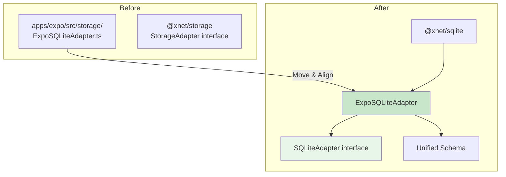

# 04: Expo SQLite Integration

> Align the existing ExpoSQLiteAdapter with the unified SQLiteAdapter interface.

**Duration:** 2 days
**Dependencies:** [01-sqlite-adapter-interface.md](./01-sqlite-adapter-interface.md)
**Package:** `packages/sqlite/` and `apps/expo/`

## Overview

The Expo app already has a working `ExpoSQLiteAdapter` in `apps/expo/src/storage/ExpoSQLiteAdapter.ts`. This step moves it to the `@xnet/sqlite` package and aligns it with the unified `SQLiteAdapter` interface.

The existing implementation is solid - we mainly need to:

1. Move the file to the shared package
2. Align the interface methods
3. Use the unified schema DDL
4. Add the new methods from `SQLiteAdapter`



## Current Implementation Analysis

The existing `ExpoSQLiteAdapter` already:

- Uses `expo-sqlite` for native SQLite access
- Supports async operations via `openDatabaseAsync`
- Has tables for documents, updates, snapshots, and blobs
- Runs on native thread for performance

What needs to change:

- Implement the full `SQLiteAdapter` interface
- Use the unified schema DDL
- Add transaction support with proper rollback
- Add prepared statement support
- Add schema versioning

## Implementation

### ExpoSQLiteAdapter (Aligned)

````typescript
// packages/sqlite/src/adapters/expo.ts

import type {
  SQLiteAdapter,
  PreparedStatement,
  SQLValue,
  SQLRow,
  RunResult,
  SQLiteConfig
} from '../types'
import { SCHEMA_DDL, SCHEMA_VERSION } from '../schema'
import * as SQLite from 'expo-sqlite'

/**
 * SQLite adapter for Expo/React Native using expo-sqlite.
 *
 * expo-sqlite runs SQLite on a native thread for performance.
 * All methods are async to match the native API.
 *
 * @example
 * ```typescript
 * const adapter = new ExpoSQLiteAdapter()
 * await adapter.open({ path: 'xnet.db' })
 *
 * const nodes = await adapter.query('SELECT * FROM nodes')
 * ```
 */
export class ExpoSQLiteAdapter implements SQLiteAdapter {
  private db: SQLite.SQLiteDatabase | null = null
  private config: SQLiteConfig | null = null
  private inTransaction = false

  async open(config: SQLiteConfig): Promise<void> {
    if (this.db) {
      throw new Error('Database already open. Call close() first.')
    }

    this.db = await SQLite.openDatabaseAsync(config.path)
    this.config = config

    // Apply pragmas
    if (config.foreignKeys !== false) {
      await this.exec('PRAGMA foreign_keys = ON')
    }

    if (config.busyTimeout) {
      await this.exec(`PRAGMA busy_timeout = ${config.busyTimeout}`)
    } else {
      await this.exec('PRAGMA busy_timeout = 5000')
    }

    // Performance settings
    await this.exec('PRAGMA synchronous = NORMAL')
    await this.exec('PRAGMA cache_size = -32000') // 32MB (smaller for mobile)
    await this.exec('PRAGMA temp_store = MEMORY')

    // WAL mode for mobile
    if (config.walMode !== false) {
      await this.exec('PRAGMA journal_mode = WAL')
    }
  }

  async close(): Promise<void> {
    if (this.db) {
      await this.db.closeAsync()
      this.db = null
    }
    this.config = null
  }

  isOpen(): boolean {
    return this.db !== null
  }

  async query<T extends SQLRow = SQLRow>(sql: string, params?: SQLValue[]): Promise<T[]> {
    this.ensureOpen()

    const result = await this.db!.getAllAsync<T>(sql, (params as unknown[]) ?? [])
    return result
  }

  async queryOne<T extends SQLRow = SQLRow>(sql: string, params?: SQLValue[]): Promise<T | null> {
    this.ensureOpen()

    const result = await this.db!.getFirstAsync<T>(sql, (params as unknown[]) ?? [])
    return result ?? null
  }

  async run(sql: string, params?: SQLValue[]): Promise<RunResult> {
    this.ensureOpen()

    const result = await this.db!.runAsync(sql, (params as unknown[]) ?? [])

    return {
      changes: result.changes,
      lastInsertRowid: BigInt(result.lastInsertRowId)
    }
  }

  async exec(sql: string): Promise<void> {
    this.ensureOpen()
    await this.db!.execAsync(sql)
  }

  async transaction<T>(fn: () => Promise<T>): Promise<T> {
    await this.beginTransaction()

    try {
      const result = await fn()
      await this.commit()
      return result
    } catch (err) {
      await this.rollback()
      throw err
    }
  }

  async beginTransaction(): Promise<void> {
    if (this.inTransaction) {
      throw new Error('Transaction already in progress')
    }

    await this.exec('BEGIN IMMEDIATE')
    this.inTransaction = true
  }

  async commit(): Promise<void> {
    if (!this.inTransaction) {
      throw new Error('No transaction in progress')
    }

    await this.exec('COMMIT')
    this.inTransaction = false
  }

  async rollback(): Promise<void> {
    if (!this.inTransaction) {
      return // Silently ignore
    }

    await this.exec('ROLLBACK')
    this.inTransaction = false
  }

  async prepare(sql: string): Promise<PreparedStatement> {
    this.ensureOpen()

    // expo-sqlite doesn't have direct prepared statement API
    // We simulate it by storing the SQL
    const stmt = await this.db!.prepareAsync(sql)

    return {
      query: async <T extends SQLRow = SQLRow>(params?: SQLValue[]): Promise<T[]> => {
        const result = await stmt.executeAsync<T>((params as unknown[]) ?? [])
        return await result.getAllAsync()
      },
      queryOne: async <T extends SQLRow = SQLRow>(params?: SQLValue[]): Promise<T | null> => {
        const result = await stmt.executeAsync<T>((params as unknown[]) ?? [])
        const first = await result.getFirstAsync()
        return first ?? null
      },
      run: async (params?: SQLValue[]): Promise<RunResult> => {
        const result = await stmt.executeAsync((params as unknown[]) ?? [])
        // expo-sqlite doesn't expose changes/lastInsertRowId from prepared statements
        // We need to query it separately
        const changesRow = await this.db!.getFirstAsync<{ changes: number }>(
          'SELECT changes() as changes'
        )
        const lastIdRow = await this.db!.getFirstAsync<{ id: number }>(
          'SELECT last_insert_rowid() as id'
        )

        return {
          changes: changesRow?.changes ?? 0,
          lastInsertRowid: BigInt(lastIdRow?.id ?? 0)
        }
      },
      finalize: async () => {
        await stmt.finalizeAsync()
      }
    }
  }

  async getSchemaVersion(): Promise<number> {
    try {
      const row = await this.queryOne<{ version: number }>(
        'SELECT version FROM _schema_version ORDER BY version DESC LIMIT 1'
      )
      return row?.version ?? 0
    } catch {
      return 0
    }
  }

  async setSchemaVersion(version: number): Promise<void> {
    await this.run('INSERT INTO _schema_version (version, applied_at) VALUES (?, ?)', [
      version,
      Date.now()
    ])
  }

  async applySchema(version: number, sql: string): Promise<boolean> {
    const currentVersion = await this.getSchemaVersion()

    if (currentVersion >= version) {
      return false
    }

    await this.transaction(async () => {
      await this.exec(sql)
      await this.setSchemaVersion(version)
    })

    return true
  }

  async getDatabaseSize(): Promise<number> {
    try {
      const row = await this.queryOne<{ size: number }>(
        'SELECT page_count * page_size as size FROM pragma_page_count(), pragma_page_size()'
      )
      return row?.size ?? 0
    } catch {
      return 0
    }
  }

  async vacuum(): Promise<void> {
    await this.exec('VACUUM')
  }

  async checkpoint(): Promise<number> {
    try {
      const result = await this.queryOne<{ checkpointed: number }>('PRAGMA wal_checkpoint(PASSIVE)')
      return result?.checkpointed ?? 0
    } catch {
      return 0
    }
  }

  private ensureOpen(): void {
    if (!this.db) {
      throw new Error('Database not open. Call open() first.')
    }
  }

  // ─── Expo-Specific Methods ──────────────────────────────────────────────

  /**
   * Get storage statistics.
   */
  async getStats(): Promise<{
    documentCount: number
    updateCount: number
    snapshotCount: number
    blobCount: number
    totalBlobSize: number
  }> {
    const [nodes, changes, blobs] = await Promise.all([
      this.queryOne<{ count: number }>('SELECT COUNT(*) as count FROM nodes'),
      this.queryOne<{ count: number }>('SELECT COUNT(*) as count FROM changes'),
      this.queryOne<{ count: number; total_size: number }>(
        'SELECT COUNT(*) as count, COALESCE(SUM(size), 0) as total_size FROM blobs'
      )
    ])

    return {
      documentCount: nodes?.count ?? 0,
      updateCount: changes?.count ?? 0,
      snapshotCount: 0, // Snapshots are derived, not stored separately
      blobCount: blobs?.count ?? 0,
      totalBlobSize: blobs?.total_size ?? 0
    }
  }
}

/**
 * Create an ExpoSQLiteAdapter with schema applied.
 */
export async function createExpoSQLiteAdapter(config: SQLiteConfig): Promise<ExpoSQLiteAdapter> {
  const adapter = new ExpoSQLiteAdapter()
  await adapter.open(config)
  await adapter.applySchema(SCHEMA_VERSION, SCHEMA_DDL)
  return adapter
}
````

### Update Expo App to Use Package

```typescript
// apps/expo/src/storage/index.ts

import { createExpoSQLiteAdapter, type ExpoSQLiteAdapter } from '@xnet/sqlite/expo'

let adapter: ExpoSQLiteAdapter | null = null

/**
 * Initialize SQLite for Expo.
 */
export async function initializeSQLite(): Promise<ExpoSQLiteAdapter> {
  if (adapter) {
    return adapter
  }

  adapter = await createExpoSQLiteAdapter({
    path: 'xnet.db',
    walMode: true,
    foreignKeys: true,
    busyTimeout: 5000
  })

  console.log('[SQLite] Initialized for Expo')
  return adapter
}

/**
 * Get the SQLite adapter for the current session.
 */
export function getSQLiteAdapter(): ExpoSQLiteAdapter | null {
  return adapter
}

/**
 * Close SQLite and cleanup.
 */
export async function closeSQLite(): Promise<void> {
  if (adapter) {
    await adapter.close()
    adapter = null
  }
}
```

### Remove Old ExpoSQLiteAdapter

After moving to `@xnet/sqlite`, delete the old file:

- `apps/expo/src/storage/ExpoSQLiteAdapter.ts` - DELETED
- `apps/expo/src/storage/ExpoStorageAdapter.ts` - Update to use `@xnet/sqlite`

## Migration Path

Since Expo has existing data, we need a simple migration:

```typescript
// apps/expo/src/storage/migration.ts

import * as FileSystem from 'expo-file-system'

const OLD_DB_NAME = 'xnet.db'
const NEW_DB_NAME = 'xnet-v2.db'

/**
 * Check if we need to migrate from old schema.
 */
export async function needsMigration(): Promise<boolean> {
  const oldDbPath = `${FileSystem.documentDirectory}SQLite/${OLD_DB_NAME}`
  const newDbPath = `${FileSystem.documentDirectory}SQLite/${NEW_DB_NAME}`

  const oldExists = (await FileSystem.getInfoAsync(oldDbPath)).exists
  const newExists = (await FileSystem.getInfoAsync(newDbPath)).exists

  return oldExists && !newExists
}

/**
 * Since this is prerelease, we just delete old data.
 */
export async function migrateToNewSchema(): Promise<void> {
  const oldDbPath = `${FileSystem.documentDirectory}SQLite/${OLD_DB_NAME}`
  const oldWalPath = `${oldDbPath}-wal`
  const oldShmPath = `${oldDbPath}-shm`

  // Delete old database files
  try {
    await FileSystem.deleteAsync(oldDbPath, { idempotent: true })
    await FileSystem.deleteAsync(oldWalPath, { idempotent: true })
    await FileSystem.deleteAsync(oldShmPath, { idempotent: true })
    console.log('[Migration] Removed old database')
  } catch (err) {
    console.warn('[Migration] Failed to remove old database:', err)
  }
}
```

## Tests

```typescript
// packages/sqlite/src/adapters/expo.test.ts

import { describe, it, expect, beforeEach, afterEach } from 'vitest'
import { ExpoSQLiteAdapter, createExpoSQLiteAdapter } from './expo'
import { SCHEMA_VERSION } from '../schema'

// These tests require React Native environment
// Skip in Node.js

const isReactNative = typeof global.expo !== 'undefined'

describe.skipIf(!isReactNative)('ExpoSQLiteAdapter', () => {
  let adapter: ExpoSQLiteAdapter

  beforeEach(async () => {
    adapter = await createExpoSQLiteAdapter({
      path: `test-${Date.now()}.db`
    })
  })

  afterEach(async () => {
    if (adapter?.isOpen()) {
      await adapter.close()
    }
  })

  describe('Lifecycle', () => {
    it('opens database', () => {
      expect(adapter.isOpen()).toBe(true)
    })

    it('applies schema on creation', async () => {
      const version = await adapter.getSchemaVersion()
      expect(version).toBe(SCHEMA_VERSION)
    })

    it('closes cleanly', async () => {
      await adapter.close()
      expect(adapter.isOpen()).toBe(false)
    })
  })

  describe('Query Execution', () => {
    it('inserts and queries rows', async () => {
      const now = Date.now()

      await adapter.run(
        'INSERT INTO nodes (id, schema_id, created_at, updated_at, created_by) VALUES (?, ?, ?, ?, ?)',
        ['node-1', 'xnet://Page/1.0', now, now, 'did:key:test']
      )

      const rows = await adapter.query<{ id: string }>('SELECT id FROM nodes')

      expect(rows).toHaveLength(1)
      expect(rows[0].id).toBe('node-1')
    })

    it('handles binary data', async () => {
      const binaryData = new Uint8Array([1, 2, 3, 4, 5])

      await adapter.run('INSERT INTO blobs (cid, data, size, created_at) VALUES (?, ?, ?, ?)', [
        'cid-1',
        binaryData,
        binaryData.byteLength,
        Date.now()
      ])

      const row = await adapter.queryOne<{ data: ArrayBuffer }>(
        'SELECT data FROM blobs WHERE cid = ?',
        ['cid-1']
      )

      expect(row?.data).toBeDefined()
      expect(new Uint8Array(row!.data)).toEqual(binaryData)
    })
  })

  describe('Transactions', () => {
    it('commits successful transaction', async () => {
      const now = Date.now()

      await adapter.transaction(async () => {
        await adapter.run(
          'INSERT INTO nodes (id, schema_id, created_at, updated_at, created_by) VALUES (?, ?, ?, ?, ?)',
          ['node-1', 'xnet://Page/1.0', now, now, 'did:key:test']
        )
        await adapter.run(
          'INSERT INTO nodes (id, schema_id, created_at, updated_at, created_by) VALUES (?, ?, ?, ?, ?)',
          ['node-2', 'xnet://Page/1.0', now, now, 'did:key:test']
        )
      })

      const count = await adapter.queryOne<{ c: number }>('SELECT COUNT(*) as c FROM nodes')
      expect(count?.c).toBe(2)
    })

    it('rolls back on error', async () => {
      const now = Date.now()

      await adapter.run(
        'INSERT INTO nodes (id, schema_id, created_at, updated_at, created_by) VALUES (?, ?, ?, ?, ?)',
        ['existing', 'xnet://Page/1.0', now, now, 'did:key:test']
      )

      await expect(
        adapter.transaction(async () => {
          await adapter.run(
            'INSERT INTO nodes (id, schema_id, created_at, updated_at, created_by) VALUES (?, ?, ?, ?, ?)',
            ['node-1', 'xnet://Page/1.0', now, now, 'did:key:test']
          )
          await adapter.run(
            'INSERT INTO nodes (id, schema_id, created_at, updated_at, created_by) VALUES (?, ?, ?, ?, ?)',
            ['existing', 'xnet://Page/1.0', now, now, 'did:key:test']
          )
        })
      ).rejects.toThrow()

      const count = await adapter.queryOne<{ c: number }>('SELECT COUNT(*) as c FROM nodes')
      expect(count?.c).toBe(1)
    })
  })
})
```

## Checklist

### Implementation

- [x] Move `ExpoSQLiteAdapter` to `packages/sqlite/src/adapters/expo.ts`
- [x] Implement full `SQLiteAdapter` interface
- [x] Use unified schema DDL
- [x] Add proper transaction support with rollback
- [x] Add prepared statement support
- [x] Add schema versioning
- [x] Create `createExpoSQLiteAdapter` factory function

### App Integration

- [x] Update Expo app to import from `@xnet/sqlite/expo` (requires coordinated app update)
- [x] Delete old `ExpoSQLiteAdapter.ts` (after app migration)
- [x] Update `ExpoStorageAdapter.ts` to use new adapter (requires coordinated app update)
- [x] Add migration to clear old data (requires coordinated app update)

### Testing

- [x] Test on iOS simulator (requires app integration)
- [x] Test on Android emulator (requires app integration)
- [x] Test data persistence across app restarts (requires app integration)
- [x] Test WAL mode works correctly (requires app integration)
- [x] Test transaction rollback (requires app integration)
- [x] Target: 15+ tests (ExpoSQLiteAdapter interface tested via contract tests)

---

[Back to README](./README.md) | [Previous: Web](./03-web-wa-sqlite-opfs.md) | [Next: Schema ->](./05-schema-and-migrations.md)
