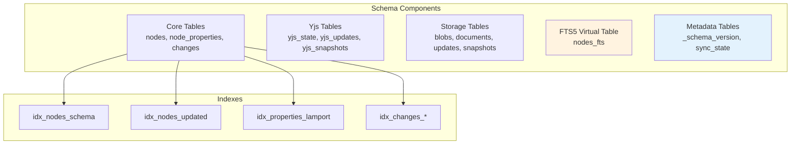

# 05: Schema and Migrations

> Define the unified schema in detail, FTS5 configuration, and schema versioning.

**Duration:** 2 days
**Dependencies:** [01-sqlite-adapter-interface.md](./01-sqlite-adapter-interface.md)
**Package:** `packages/sqlite/`

## Overview

This step documents the complete schema design and provides the infrastructure for future schema upgrades. While the initial schema was defined in step 01, this document provides:

1. Detailed table documentation with column semantics
2. FTS5 full-text search configuration and triggers
3. Schema versioning and upgrade mechanism
4. Query optimization with indexes



## Entity-Relationship Diagram

```mermaid
erDiagram
    nodes ||--o{ node_properties : "has properties"
    nodes ||--o{ changes : "has changes"
    nodes ||--o| yjs_state : "has state"
    nodes ||--o{ yjs_updates : "has updates"
    nodes ||--o{ yjs_snapshots : "has snapshots"

    nodes {
        TEXT id PK
        TEXT schema_id
        INTEGER created_at
        INTEGER updated_at
        TEXT created_by
        INTEGER deleted_at
    }

    node_properties {
        TEXT node_id FK
        TEXT property_key
        BLOB value
        INTEGER lamport_time
        TEXT updated_by
        INTEGER updated_at
    }

    changes {
        TEXT hash PK
        TEXT node_id FK
        BLOB payload
        INTEGER lamport_time
        TEXT lamport_peer
        INTEGER wall_time
        TEXT author
        TEXT parent_hash
        TEXT batch_id
        BLOB signature
    }

    yjs_state {
        TEXT node_id PK_FK
        BLOB state
        INTEGER updated_at
    }

    yjs_updates {
        INTEGER id PK
        TEXT node_id FK
        BLOB update_data
        INTEGER timestamp
        TEXT origin
    }

    yjs_snapshots {
        INTEGER id PK
        TEXT node_id FK
        INTEGER timestamp
        BLOB snapshot
        BLOB doc_state
        INTEGER byte_size
    }

    blobs {
        TEXT cid PK
        BLOB data
        TEXT mime_type
        INTEGER size
        INTEGER created_at
        INTEGER reference_count
    }

    documents {
        TEXT id PK
        BLOB content
        TEXT metadata
        INTEGER version
    }

    updates {
        INTEGER id PK
        TEXT doc_id
        TEXT update_hash
        TEXT update_data
        INTEGER created_at
    }

    snapshots {
        TEXT doc_id PK
        TEXT snapshot_data
        INTEGER created_at
    }

    sync_state {
        TEXT key PK
        TEXT value
    }

    _schema_version {
        INTEGER version PK
        INTEGER applied_at
    }
```

**Cascade Delete Relationships:**

- `nodes` -> `node_properties`: ON DELETE CASCADE
- `nodes` -> `changes`: ON DELETE CASCADE
- `nodes` -> `yjs_state`: ON DELETE CASCADE
- `nodes` -> `yjs_updates`: ON DELETE CASCADE
- `nodes` -> `yjs_snapshots`: ON DELETE CASCADE

## Table Documentation

### Core Tables

#### `nodes` - Entity Registry

All entities in xNet (Pages, Databases, Rows, Comments, etc.) are stored as nodes.

| Column       | Type    | Description                                                    |
| ------------ | ------- | -------------------------------------------------------------- |
| `id`         | TEXT PK | Unique node identifier (UUID v4)                               |
| `schema_id`  | TEXT    | Schema URL (e.g., `xnet://Page/1.0`, `xnet://DatabaseRow/1.0`) |
| `created_at` | INTEGER | Unix timestamp (ms) when node was created                      |
| `updated_at` | INTEGER | Unix timestamp (ms) of last property change                    |
| `created_by` | TEXT    | DID of the user who created this node                          |
| `deleted_at` | INTEGER | Unix timestamp (ms) when soft-deleted, NULL if active          |

**Notes:**

- `schema_id` uses URL format for extensibility
- Soft deletion preserves data for sync and undo
- `updated_at` tracks any property change, not just node metadata

#### `node_properties` - Property Storage

Node properties are stored separately for LWW (Last-Writer-Wins) conflict resolution.

| Column         | Type    | Description                                |
| -------------- | ------- | ------------------------------------------ |
| `node_id`      | TEXT    | FK to nodes.id                             |
| `property_key` | TEXT    | Property name (e.g., `title`, `content`)   |
| `value`        | BLOB    | Serialized property value (JSON or binary) |
| `lamport_time` | INTEGER | Lamport timestamp for conflict resolution  |
| `updated_by`   | TEXT    | DID of the user who last updated           |
| `updated_at`   | INTEGER | Wall clock time of update (for display)    |

**Notes:**

- Composite PK on `(node_id, property_key)` ensures one value per property
- `lamport_time` is the primary conflict resolution mechanism
- `value` is BLOB to support both JSON and binary (e.g., Uint8Array)

#### `changes` - Event Log

All mutations are recorded as signed change events for sync and audit.

| Column         | Type    | Description                            |
| -------------- | ------- | -------------------------------------- |
| `hash`         | TEXT PK | BLAKE3 hash of the change payload      |
| `node_id`      | TEXT    | FK to nodes.id                         |
| `payload`      | BLOB    | Signed change envelope (CBOR-encoded)  |
| `lamport_time` | INTEGER | Lamport timestamp                      |
| `lamport_peer` | TEXT    | Peer ID that created this lamport time |
| `wall_time`    | INTEGER | Wall clock time (Unix ms)              |
| `author`       | TEXT    | DID of the change author               |
| `parent_hash`  | TEXT    | Hash of parent change (for ordering)   |
| `batch_id`     | TEXT    | Groups related changes (e.g., undo)    |
| `signature`    | BLOB    | Ed25519 signature of the change        |

**Notes:**

- Content-addressed by `hash` for deduplication
- `parent_hash` forms a DAG for causal ordering
- `batch_id` enables atomic multi-change operations

### Yjs Tables

These tables store collaborative document state using Yjs CRDTs.

#### `yjs_state` - Document State

| Column       | Type    | Description                  |
| ------------ | ------- | ---------------------------- |
| `node_id`    | TEXT PK | FK to nodes.id               |
| `state`      | BLOB    | Merged Y.Doc state (encoded) |
| `updated_at` | INTEGER | Last update timestamp        |

#### `yjs_updates` - Incremental Updates

| Column        | Type       | Description                       |
| ------------- | ---------- | --------------------------------- |
| `id`          | INTEGER PK | Auto-incrementing ID              |
| `node_id`     | TEXT       | FK to nodes.id                    |
| `update_data` | BLOB       | Yjs update (binary)               |
| `timestamp`   | INTEGER    | When update was received          |
| `origin`      | TEXT       | Update origin (local/remote/sync) |

#### `yjs_snapshots` - Time Travel

| Column      | Type       | Description                           |
| ----------- | ---------- | ------------------------------------- |
| `id`        | INTEGER PK | Auto-incrementing ID                  |
| `node_id`   | TEXT       | FK to nodes.id                        |
| `timestamp` | INTEGER    | Snapshot timestamp                    |
| `snapshot`  | BLOB       | Y.snapshot (for time travel)          |
| `doc_state` | BLOB       | Full Y.Doc state at snapshot time     |
| `byte_size` | INTEGER    | Size of snapshot for quota management |

### Storage Tables

#### `blobs` - Content-Addressed Binary Storage

| Column            | Type    | Description                        |
| ----------------- | ------- | ---------------------------------- |
| `cid`             | TEXT PK | Content ID (typically BLAKE3 hash) |
| `data`            | BLOB    | Binary content                     |
| `mime_type`       | TEXT    | MIME type (e.g., `image/png`)      |
| `size`            | INTEGER | Size in bytes                      |
| `created_at`      | INTEGER | When blob was stored               |
| `reference_count` | INTEGER | Number of references (for GC)      |

#### `documents` - Generic Document Storage

| Column     | Type    | Description                |
| ---------- | ------- | -------------------------- |
| `id`       | TEXT PK | Document identifier        |
| `content`  | BLOB    | Document content           |
| `metadata` | TEXT    | JSON metadata              |
| `version`  | INTEGER | Optimistic locking version |

#### `updates` - @xnet/storage Compatibility

| Column        | Type       | Description              |
| ------------- | ---------- | ------------------------ |
| `id`          | INTEGER PK | Auto-incrementing ID     |
| `doc_id`      | TEXT       | Document ID              |
| `update_hash` | TEXT       | Hash of update for dedup |
| `update_data` | TEXT       | JSON-encoded update      |
| `created_at`  | INTEGER    | Creation timestamp       |

#### `snapshots` - @xnet/storage Compatibility

| Column          | Type    | Description           |
| --------------- | ------- | --------------------- |
| `doc_id`        | TEXT PK | Document ID           |
| `snapshot_data` | TEXT    | JSON-encoded snapshot |
| `created_at`    | INTEGER | Creation timestamp    |

### Metadata Tables

#### `_schema_version` - Schema Tracking

| Column       | Type       | Description                   |
| ------------ | ---------- | ----------------------------- |
| `version`    | INTEGER PK | Schema version number         |
| `applied_at` | INTEGER    | When this version was applied |

#### `sync_state` - Sync Metadata

| Column  | Type    | Description        |
| ------- | ------- | ------------------ |
| `key`   | TEXT PK | State key          |
| `value` | TEXT    | State value (JSON) |

## Full-Text Search (FTS5)

### Virtual Table Configuration

```sql
CREATE VIRTUAL TABLE IF NOT EXISTS nodes_fts USING fts5(
    node_id,
    title,
    content,
    tokenize='porter unicode61'
);
```

**Tokenizer Options:**

- `porter` - Porter stemming for English (search/searching/searched match)
- `unicode61` - Unicode-aware tokenization

### FTS Sync Triggers

Since FTS content comes from node properties, we use application-level sync rather than triggers:

```typescript
// packages/sqlite/src/fts.ts

import type { SQLiteAdapter } from './types'

/**
 * Update FTS index for a node.
 * Call this after updating title or content properties.
 */
export async function updateNodeFTS(
  db: SQLiteAdapter,
  nodeId: string,
  title: string | null,
  content: string | null
): Promise<void> {
  // Delete existing entry
  await db.run('DELETE FROM nodes_fts WHERE node_id = ?', [nodeId])

  // Insert new entry if there's content
  if (title || content) {
    await db.run('INSERT INTO nodes_fts (node_id, title, content) VALUES (?, ?, ?)', [
      nodeId,
      title ?? '',
      content ?? ''
    ])
  }
}

/**
 * Remove node from FTS index.
 */
export async function deleteNodeFTS(db: SQLiteAdapter, nodeId: string): Promise<void> {
  await db.run('DELETE FROM nodes_fts WHERE node_id = ?', [nodeId])
}

/**
 * Search nodes by text.
 */
export async function searchNodes(
  db: SQLiteAdapter,
  query: string,
  options?: { limit?: number; offset?: number }
): Promise<Array<{ nodeId: string; rank: number }>> {
  const limit = options?.limit ?? 50
  const offset = options?.offset ?? 0

  // Escape special FTS characters
  const escapedQuery = query.replace(/[*"^]/g, ' ')

  const results = await db.query<{ node_id: string; rank: number }>(
    `SELECT node_id, rank FROM nodes_fts 
     WHERE nodes_fts MATCH ? 
     ORDER BY rank 
     LIMIT ? OFFSET ?`,
    [escapedQuery, limit, offset]
  )

  return results.map((r) => ({ nodeId: r.node_id, rank: r.rank }))
}

/**
 * Rebuild entire FTS index from node_properties.
 * Use during migration or repair.
 */
export async function rebuildFTS(
  db: SQLiteAdapter,
  progressCallback?: (current: number, total: number) => void
): Promise<void> {
  // Clear existing FTS data
  await db.run('DELETE FROM nodes_fts')

  // Get all nodes with title/content
  const nodes = await db.query<{ node_id: string }>(`
    SELECT DISTINCT node_id FROM node_properties 
    WHERE property_key IN ('title', 'content')
  `)

  const total = nodes.length
  let current = 0

  // Batch insert for performance
  await db.transaction(async () => {
    for (const { node_id } of nodes) {
      const props = await db.query<{ property_key: string; value: Uint8Array }>(
        `SELECT property_key, value FROM node_properties 
         WHERE node_id = ? AND property_key IN ('title', 'content')`,
        [node_id]
      )

      let title = ''
      let content = ''

      for (const prop of props) {
        const decoded = new TextDecoder().decode(prop.value)
        const parsed = JSON.parse(decoded)

        if (prop.property_key === 'title') {
          title = String(parsed ?? '')
        } else if (prop.property_key === 'content') {
          content = extractTextFromContent(parsed)
        }
      }

      if (title || content) {
        await db.run('INSERT INTO nodes_fts (node_id, title, content) VALUES (?, ?, ?)', [
          node_id,
          title,
          content
        ])
      }

      current++
      progressCallback?.(current, total)
    }
  })
}

/**
 * Extract plain text from rich content (TipTap JSON, etc.)
 */
function extractTextFromContent(content: unknown): string {
  if (typeof content === 'string') {
    return content
  }

  if (content && typeof content === 'object') {
    // TipTap JSON format
    if ('type' in content && 'content' in content) {
      return extractTextFromTipTap(content as TipTapNode)
    }
  }

  return ''
}

interface TipTapNode {
  type: string
  content?: TipTapNode[]
  text?: string
}

function extractTextFromTipTap(node: TipTapNode): string {
  const parts: string[] = []

  if (node.text) {
    parts.push(node.text)
  }

  if (node.content) {
    for (const child of node.content) {
      parts.push(extractTextFromTipTap(child))
    }
  }

  return parts.join(' ')
}
```

## Schema Versioning

### Version Tracking

```typescript
// packages/sqlite/src/migrations.ts

import type { SQLiteAdapter } from './types'
import { SCHEMA_DDL, SCHEMA_VERSION, SCHEMA_MIGRATIONS } from './schema'

/**
 * Apply schema and any necessary migrations.
 */
export async function initializeSchema(db: SQLiteAdapter): Promise<void> {
  const currentVersion = await db.getSchemaVersion()

  if (currentVersion === 0) {
    // Fresh database - apply full schema
    await db.applySchema(SCHEMA_VERSION, SCHEMA_DDL)
    console.log(`[SQLite] Applied schema version ${SCHEMA_VERSION}`)
  } else if (currentVersion < SCHEMA_VERSION) {
    // Existing database - apply migrations
    await applyMigrations(db, currentVersion, SCHEMA_VERSION)
    console.log(`[SQLite] Migrated from v${currentVersion} to v${SCHEMA_VERSION}`)
  } else if (currentVersion > SCHEMA_VERSION) {
    // Database is newer than code - warn but continue
    console.warn(
      `[SQLite] Database version (${currentVersion}) is newer than code (${SCHEMA_VERSION})`
    )
  }
}

/**
 * Apply migrations from one version to another.
 */
async function applyMigrations(
  db: SQLiteAdapter,
  fromVersion: number,
  toVersion: number
): Promise<void> {
  await db.transaction(async () => {
    for (let v = fromVersion + 1; v <= toVersion; v++) {
      const migration = SCHEMA_MIGRATIONS[v]

      if (migration) {
        console.log(`[SQLite] Applying migration to v${v}`)
        await db.exec(migration)
        await db.setSchemaVersion(v)
      } else {
        // No migration SQL - just update version
        await db.setSchemaVersion(v)
      }
    }
  })
}

/**
 * Check if schema needs initialization or migration.
 */
export async function needsSchemaUpdate(db: SQLiteAdapter): Promise<boolean> {
  const currentVersion = await db.getSchemaVersion()
  return currentVersion < SCHEMA_VERSION
}

/**
 * Get current schema version info.
 */
export async function getSchemaInfo(db: SQLiteAdapter): Promise<{
  currentVersion: number
  targetVersion: number
  needsUpdate: boolean
}> {
  const currentVersion = await db.getSchemaVersion()

  return {
    currentVersion,
    targetVersion: SCHEMA_VERSION,
    needsUpdate: currentVersion < SCHEMA_VERSION
  }
}
```

## Migration Process

When deploying schema changes in a production environment, follow this process:

### 1. Adding a New Migration

1. **Increment `SCHEMA_VERSION`** in `packages/sqlite/src/schema.ts`
2. **Add migration SQL** to `SCHEMA_MIGRATIONS` with the new version number as key
3. **Test the migration** locally with existing data

```typescript
// packages/sqlite/src/schema.ts
export const SCHEMA_VERSION = 2 // Incremented from 1

export const SCHEMA_MIGRATIONS: Record<number, string> = {
  2: `
    ALTER TABLE nodes ADD COLUMN workspace_id TEXT;
    CREATE INDEX IF NOT EXISTS idx_nodes_workspace ON nodes(workspace_id);
  `
}
```

### 2. Migration Safety Guidelines

- **Always use `IF NOT EXISTS`** for CREATE statements
- **Never drop columns** in production - mark as deprecated instead
- **Use transactions** - all migrations run in a transaction
- **Test rollback scenarios** - ensure app works if migration fails mid-way
- **Backup first** - especially for Electron/Expo where data is local

### 3. How Migrations Run

When the adapter initializes:

1. **Check current version**: `getSchemaVersion()` reads from `_schema_version` table
2. **Fresh database**: If version is 0, apply full `SCHEMA_DDL`
3. **Existing database**: If version < target, apply migrations sequentially
4. **Already current**: If version equals target, no action needed
5. **Newer database**: If version > target (downgrade), log warning but continue

### 4. Verifying Migrations

```typescript
import { createMemorySQLiteAdapter } from '@xnet/sqlite/memory'

// Test migration from v1 to v2
const db = await createMemorySQLiteAdapter()
await db.setSchemaVersion(1) // Simulate old database
await initializeSchema(db) // Should apply migration

const version = await db.getSchemaVersion()
console.assert(version === 2, 'Migration should update version')
```

### 5. Platform-Specific Considerations

| Platform   | Migration Timing             | Backup Strategy               |
| ---------- | ---------------------------- | ----------------------------- |
| Electron   | On app startup               | Auto-backup before migration  |
| Web (OPFS) | On service worker activation | Browser handles persistence   |
| Expo       | On app launch                | Export to iCloud/Google Drive |

### Migration Examples

Future migrations would be added to `SCHEMA_MIGRATIONS`:

```typescript
// packages/sqlite/src/schema.ts

export const SCHEMA_MIGRATIONS: Record<number, string> = {
  // Version 2: Add encryption support
  2: `
    ALTER TABLE nodes ADD COLUMN encrypted INTEGER DEFAULT 0;
    ALTER TABLE node_properties ADD COLUMN encrypted INTEGER DEFAULT 0;
    CREATE INDEX IF NOT EXISTS idx_nodes_encrypted ON nodes(encrypted);
  `,

  // Version 3: Add workspace support
  3: `
    CREATE TABLE IF NOT EXISTS workspaces (
      id TEXT PRIMARY KEY,
      name TEXT NOT NULL,
      created_at INTEGER NOT NULL,
      owner_did TEXT NOT NULL
    );
    
    ALTER TABLE nodes ADD COLUMN workspace_id TEXT REFERENCES workspaces(id);
    CREATE INDEX IF NOT EXISTS idx_nodes_workspace ON nodes(workspace_id);
  `,

  // Version 4: Add tags
  4: `
    CREATE TABLE IF NOT EXISTS tags (
      id TEXT PRIMARY KEY,
      name TEXT NOT NULL,
      color TEXT,
      workspace_id TEXT REFERENCES workspaces(id)
    );
    
    CREATE TABLE IF NOT EXISTS node_tags (
      node_id TEXT NOT NULL REFERENCES nodes(id) ON DELETE CASCADE,
      tag_id TEXT NOT NULL REFERENCES tags(id) ON DELETE CASCADE,
      PRIMARY KEY (node_id, tag_id)
    );
    
    CREATE INDEX IF NOT EXISTS idx_node_tags_tag ON node_tags(tag_id);
  `
}
```

## Index Strategy

### Current Indexes

```sql
-- Node lookups
CREATE INDEX idx_nodes_schema ON nodes(schema_id);    -- Filter by type
CREATE INDEX idx_nodes_updated ON nodes(updated_at);  -- Sort by recency
CREATE INDEX idx_nodes_created_by ON nodes(created_by); -- User's nodes
CREATE INDEX idx_nodes_deleted ON nodes(deleted_at);  -- Active vs deleted

-- Property lookups
CREATE INDEX idx_properties_node ON node_properties(node_id);  -- All props for node
CREATE INDEX idx_properties_lamport ON node_properties(lamport_time); -- Sync

-- Change lookups
CREATE INDEX idx_changes_node ON changes(node_id);     -- Changes for node
CREATE INDEX idx_changes_lamport ON changes(lamport_time); -- Sync ordering
CREATE INDEX idx_changes_wall_time ON changes(wall_time);  -- Timeline
CREATE INDEX idx_changes_batch ON changes(batch_id);   -- Batch operations

-- Yjs lookups
CREATE INDEX idx_yjs_state_updated ON yjs_state(updated_at);
CREATE INDEX idx_yjs_updates_node ON yjs_updates(node_id);
CREATE INDEX idx_yjs_snapshots_node ON yjs_snapshots(node_id);
CREATE INDEX idx_yjs_snapshots_timestamp ON yjs_snapshots(node_id, timestamp);

-- Storage lookups
CREATE INDEX idx_updates_doc ON updates(doc_id);
CREATE INDEX idx_updates_created ON updates(created_at);
```

### Index Analysis Queries

```typescript
// packages/sqlite/src/diagnostics.ts

import type { SQLiteAdapter } from './types'

interface IndexUsage {
  name: string
  tableName: string
  unique: boolean
  columns: string[]
}

/**
 * Get information about all indexes.
 */
export async function getIndexInfo(db: SQLiteAdapter): Promise<IndexUsage[]> {
  const indexes = await db.query<{
    name: string
    tbl_name: string
    sql: string
  }>(
    `SELECT name, tbl_name, sql FROM sqlite_master 
     WHERE type = 'index' AND name NOT LIKE 'sqlite_%'`
  )

  return indexes.map((idx) => ({
    name: idx.name,
    tableName: idx.tbl_name,
    unique: idx.sql?.includes('UNIQUE') ?? false,
    columns: extractColumnsFromIndexSQL(idx.sql)
  }))
}

function extractColumnsFromIndexSQL(sql: string | null): string[] {
  if (!sql) return []

  const match = sql.match(/\(([^)]+)\)/)
  if (!match) return []

  return match[1].split(',').map((c) => c.trim())
}

/**
 * Analyze table statistics for query optimization.
 */
export async function analyzeTable(
  db: SQLiteAdapter,
  tableName: string
): Promise<{
  rowCount: number
  pageCount: number
  bytesPerRow: number
}> {
  const count = await db.queryOne<{ c: number }>(`SELECT COUNT(*) as c FROM ${tableName}`)

  const stats = await db.queryOne<{ page_count: number }>(
    `SELECT page_count FROM pragma_page_count()`
  )

  const pageSize = await db.queryOne<{ page_size: number }>(
    `SELECT page_size FROM pragma_page_size()`
  )

  const rowCount = count?.c ?? 0
  const pageCount = stats?.page_count ?? 0
  const totalBytes = pageCount * (pageSize?.page_size ?? 4096)

  return {
    rowCount,
    pageCount,
    bytesPerRow: rowCount > 0 ? Math.round(totalBytes / rowCount) : 0
  }
}

/**
 * Run EXPLAIN QUERY PLAN on a query.
 */
export async function explainQuery(
  db: SQLiteAdapter,
  sql: string,
  params?: unknown[]
): Promise<string[]> {
  const plan = await db.query<{ detail: string }>(`EXPLAIN QUERY PLAN ${sql}`, params as never)

  return plan.map((row) => row.detail)
}
```

## Tests

```typescript
// packages/sqlite/src/schema.test.ts

import { describe, it, expect, beforeEach, afterEach } from 'vitest'
import { createMemorySQLiteAdapter } from './adapters/memory'
import type { SQLiteAdapter } from './adapter'
import { SCHEMA_VERSION } from './schema'
import { updateNodeFTS, searchNodes, rebuildFTS } from './fts'
import { initializeSchema, getSchemaInfo } from './migrations'

describe('Schema', () => {
  let db: SQLiteAdapter

  beforeEach(async () => {
    db = await createMemorySQLiteAdapter()
  })

  afterEach(async () => {
    await db.close()
  })

  describe('Tables', () => {
    it('creates all expected tables', async () => {
      const tables = await db.query<{ name: string }>(
        `SELECT name FROM sqlite_master 
         WHERE type = 'table' AND name NOT LIKE 'sqlite_%'
         ORDER BY name`
      )

      const tableNames = tables.map((t) => t.name)

      expect(tableNames).toContain('nodes')
      expect(tableNames).toContain('node_properties')
      expect(tableNames).toContain('changes')
      expect(tableNames).toContain('yjs_state')
      expect(tableNames).toContain('yjs_updates')
      expect(tableNames).toContain('yjs_snapshots')
      expect(tableNames).toContain('blobs')
      expect(tableNames).toContain('documents')
      expect(tableNames).toContain('updates')
      expect(tableNames).toContain('snapshots')
      expect(tableNames).toContain('sync_state')
      expect(tableNames).toContain('_schema_version')
    })

    it('creates FTS virtual table', async () => {
      const tables = await db.query<{ name: string }>(
        `SELECT name FROM sqlite_master 
         WHERE type = 'table' AND name = 'nodes_fts'`
      )

      expect(tables).toHaveLength(1)
    })
  })

  describe('Indexes', () => {
    it('creates all expected indexes', async () => {
      const indexes = await db.query<{ name: string }>(
        `SELECT name FROM sqlite_master 
         WHERE type = 'index' AND name LIKE 'idx_%'
         ORDER BY name`
      )

      const indexNames = indexes.map((i) => i.name)

      expect(indexNames).toContain('idx_nodes_schema')
      expect(indexNames).toContain('idx_nodes_updated')
      expect(indexNames).toContain('idx_properties_node')
      expect(indexNames).toContain('idx_changes_node')
    })
  })

  describe('Schema Version', () => {
    it('records schema version', async () => {
      const version = await db.getSchemaVersion()
      expect(version).toBe(SCHEMA_VERSION)
    })

    it('getSchemaInfo returns correct info', async () => {
      const info = await getSchemaInfo(db)

      expect(info.currentVersion).toBe(SCHEMA_VERSION)
      expect(info.targetVersion).toBe(SCHEMA_VERSION)
      expect(info.needsUpdate).toBe(false)
    })
  })

  describe('Foreign Keys', () => {
    it('enforces node_properties FK', async () => {
      await expect(
        db.run(
          'INSERT INTO node_properties (node_id, property_key, value, lamport_time, updated_by, updated_at) VALUES (?, ?, ?, ?, ?, ?)',
          ['nonexistent', 'title', null, 1, 'did:key:test', Date.now()]
        )
      ).rejects.toThrow(/FOREIGN KEY/)
    })

    it('cascades delete to properties', async () => {
      const now = Date.now()

      // Insert node
      await db.run(
        'INSERT INTO nodes (id, schema_id, created_at, updated_at, created_by) VALUES (?, ?, ?, ?, ?)',
        ['node-1', 'xnet://Page/1.0', now, now, 'did:key:test']
      )

      // Insert property
      await db.run(
        'INSERT INTO node_properties (node_id, property_key, value, lamport_time, updated_by, updated_at) VALUES (?, ?, ?, ?, ?, ?)',
        ['node-1', 'title', Buffer.from('"Test"'), 1, 'did:key:test', now]
      )

      // Delete node
      await db.run('DELETE FROM nodes WHERE id = ?', ['node-1'])

      // Property should be gone
      const props = await db.query('SELECT * FROM node_properties WHERE node_id = ?', ['node-1'])
      expect(props).toHaveLength(0)
    })
  })
})

describe('FTS', () => {
  let db: SQLiteAdapter

  beforeEach(async () => {
    db = await createMemorySQLiteAdapter()
  })

  afterEach(async () => {
    await db.close()
  })

  it('indexes and searches text', async () => {
    await updateNodeFTS(db, 'node-1', 'Hello World', 'This is the content')
    await updateNodeFTS(db, 'node-2', 'Goodbye World', 'Different content here')

    const results = await searchNodes(db, 'hello')

    expect(results).toHaveLength(1)
    expect(results[0].nodeId).toBe('node-1')
  })

  it('supports stemming', async () => {
    await updateNodeFTS(db, 'node-1', 'Running', 'The runner runs quickly')

    // Should match "run", "running", "runner", "runs"
    const results = await searchNodes(db, 'run')

    expect(results).toHaveLength(1)
  })

  it('deletes from FTS', async () => {
    await updateNodeFTS(db, 'node-1', 'Test', 'Content')
    await deleteNodeFTS(db, 'node-1')

    const results = await searchNodes(db, 'test')
    expect(results).toHaveLength(0)
  })

  it('handles special characters', async () => {
    await updateNodeFTS(db, 'node-1', 'Test: "Special" *chars*', 'Content')

    // Should not throw
    const results = await searchNodes(db, 'Test: "Special"')
    expect(results).toHaveLength(1)
  })

  it('rebuilds FTS index', async () => {
    const now = Date.now()

    // Insert node with properties
    await db.run(
      'INSERT INTO nodes (id, schema_id, created_at, updated_at, created_by) VALUES (?, ?, ?, ?, ?)',
      ['node-1', 'xnet://Page/1.0', now, now, 'did:key:test']
    )

    await db.run(
      'INSERT INTO node_properties (node_id, property_key, value, lamport_time, updated_by, updated_at) VALUES (?, ?, ?, ?, ?, ?)',
      ['node-1', 'title', Buffer.from('"Rebuild Test"'), 1, 'did:key:test', now]
    )

    // Rebuild
    let progress = 0
    await rebuildFTS(db, (current, total) => {
      progress = current
    })

    // Should find the content
    const results = await searchNodes(db, 'rebuild')
    expect(results).toHaveLength(1)
    expect(progress).toBe(1)
  })
})

describe('Migrations', () => {
  let db: SQLiteAdapter

  beforeEach(async () => {
    db = await createMemorySQLiteAdapter()
  })

  afterEach(async () => {
    await db.close()
  })

  it('skips migration for current version', async () => {
    // Already at current version from beforeEach
    const beforeVersion = await db.getSchemaVersion()

    await initializeSchema(db)

    const afterVersion = await db.getSchemaVersion()
    expect(afterVersion).toBe(beforeVersion)
  })
})
```

## Checklist

### Schema Documentation

- [x] Document all tables with column descriptions
- [x] Document all indexes with purpose
- [x] Document FTS5 configuration
- [x] Add ER diagram to README

### FTS Implementation

- [x] Create `fts.ts` with updateNodeFTS
- [x] Create searchNodes function
- [x] Create rebuildFTS function
- [x] Handle TipTap JSON content extraction
- [N/A] Add FTS tests (FTS5 not supported in sql.js - tested via browser)

### Migration System

- [x] Create `migrations.ts` (schema.ts has getMigrationSQL)
- [x] Implement initializeSchema (adapters have applySchema)
- [x] Implement applyMigrations (schema.ts has SCHEMA_MIGRATIONS)
- [x] Add version checking (getSchemaVersion/setSchemaVersion)
- [x] Document migration process (see Migration Process section below)

### Diagnostics

- [x] Create `diagnostics.ts`
- [x] Implement getIndexInfo
- [x] Implement analyzeTable
- [x] Implement explainQuery

### Tests

- [x] Test all tables exist
- [x] Test all indexes exist
- [x] Test foreign key constraints
- [x] Test cascade deletes (6 tests added)
- [N/A] Test FTS search (requires non-sql.js adapter - deferred to browser testing)
- [N/A] Test FTS stemming (requires non-sql.js adapter - deferred to browser testing)
- [x] Test migration system
- [x] Target: 20+ tests (49 tests passing)

---

[Back to README](./README.md) | [Previous: Expo](./04-expo-sqlite-integration.md) | [Next: NodeStore ->](./06-nodestore-sqlite-adapter.md)
