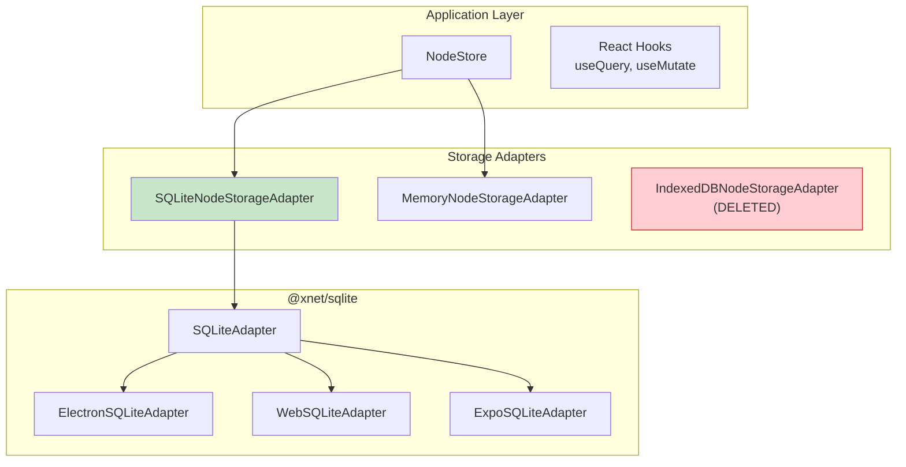

# 06: NodeStore SQLite Adapter

> Create SQLiteNodeStorageAdapter implementing the NodeStorageAdapter interface.

**Duration:** 2 days
**Dependencies:** [01-sqlite-adapter-interface.md](./01-sqlite-adapter-interface.md), [05-schema-and-migrations.md](./05-schema-and-migrations.md)
**Package:** `packages/data/`

## Overview

The `NodeStore` is the primary data access layer in xNet. This step creates `SQLiteNodeStorageAdapter` that implements the `NodeStorageAdapter` interface using the unified `SQLiteAdapter`.

This adapter replaces `IndexedDBNodeStorageAdapter` and provides:

1. 10x faster list/filter operations via SQL queries
2. Proper ACID transactions for atomic operations
3. Efficient bulk operations via prepared statements
4. Full-text search integration



## Interface Reference

The `SQLiteNodeStorageAdapter` implements `NodeStorageAdapter` from `packages/data/src/store/types.ts`:

```typescript
export interface NodeStorageAdapter {
  // Lifecycle (optional)
  open?(): Promise<void>
  close?(): Promise<void>

  // Change log operations
  appendChange(change: NodeChange): Promise<void>
  getChanges(nodeId: NodeId): Promise<NodeChange[]>
  getAllChanges(): Promise<NodeChange[]>
  getChangesSince(sinceLamport: number): Promise<NodeChange[]>
  getChangeByHash(hash: ContentId): Promise<NodeChange | null>
  getLastChange(nodeId: NodeId): Promise<NodeChange | null>

  // Materialized state operations
  getNode(id: NodeId): Promise<NodeState | null>
  setNode(node: NodeState): Promise<void>
  deleteNode(id: NodeId): Promise<void>
  listNodes(options?: ListNodesOptions): Promise<NodeState[]>
  countNodes(options?: CountNodesOptions): Promise<number>

  // Sync state
  getLastLamportTime(): Promise<number>
  setLastLamportTime(time: number): Promise<void>

  // Document content (Yjs state)
  getDocumentContent(nodeId: NodeId): Promise<Uint8Array | null>
  setDocumentContent(nodeId: NodeId, content: Uint8Array): Promise<void>
}
```

## Implementation

### SQLiteNodeStorageAdapter

````typescript
// packages/data/src/store/sqlite-adapter.ts

import type { SQLiteAdapter } from '@xnet/sqlite'
import type {
  NodeStorageAdapter,
  NodeState,
  NodeChange,
  NodePayload,
  NodeId,
  ContentId,
  ListNodesOptions,
  CountNodesOptions,
  PropertyTimestamp
} from './types'
import { updateNodeFTS, deleteNodeFTS } from '@xnet/sqlite/fts'

/**
 * SQLite-backed storage adapter for NodeStore.
 *
 * This adapter provides high-performance storage for nodes and changes
 * using the platform-appropriate SQLite implementation.
 *
 * @example
 * ```typescript
 * const sqliteAdapter = await createElectronSQLiteAdapter({ path: 'xnet.db' })
 * const nodeStorage = new SQLiteNodeStorageAdapter(sqliteAdapter)
 *
 * const store = new NodeStore({
 *   storage: nodeStorage,
 *   identity,
 *   schemas
 * })
 * ```
 */
export class SQLiteNodeStorageAdapter implements NodeStorageAdapter {
  constructor(private db: SQLiteAdapter) {}

  // ─── Lifecycle ────────────────────────────────────────────────────────────

  async open(): Promise<void> {
    // DB should already be open when passed to constructor
    if (!this.db.isOpen()) {
      throw new Error('SQLiteAdapter must be opened before use')
    }
  }

  async close(): Promise<void> {
    // Don't close the shared SQLiteAdapter - let the owner manage it
  }

  // ─── Change Log Operations ────────────────────────────────────────────────

  async appendChange(change: NodeChange): Promise<void> {
    const payload = this.serializePayload(change.payload)

    await this.db.run(
      `INSERT OR IGNORE INTO changes 
       (hash, node_id, payload, lamport_time, lamport_peer, wall_time, author, parent_hash, batch_id, signature)
       VALUES (?, ?, ?, ?, ?, ?, ?, ?, ?, ?)`,
      [
        change.hash,
        change.payload.nodeId,
        payload,
        change.lamport.time,
        change.lamport.peerId,
        change.wallTime,
        change.author,
        change.parent ?? null,
        change.batchId ?? null,
        change.signature
      ]
    )
  }

  async getChanges(nodeId: NodeId): Promise<NodeChange[]> {
    const rows = await this.db.query<ChangeRow>(
      `SELECT * FROM changes WHERE node_id = ? ORDER BY lamport_time ASC`,
      [nodeId]
    )

    return rows.map((row) => this.deserializeChange(row))
  }

  async getAllChanges(): Promise<NodeChange[]> {
    const rows = await this.db.query<ChangeRow>(`SELECT * FROM changes ORDER BY lamport_time ASC`)

    return rows.map((row) => this.deserializeChange(row))
  }

  async getChangesSince(sinceLamport: number): Promise<NodeChange[]> {
    const rows = await this.db.query<ChangeRow>(
      `SELECT * FROM changes WHERE lamport_time > ? ORDER BY lamport_time ASC`,
      [sinceLamport]
    )

    return rows.map((row) => this.deserializeChange(row))
  }

  async getChangeByHash(hash: ContentId): Promise<NodeChange | null> {
    const row = await this.db.queryOne<ChangeRow>(`SELECT * FROM changes WHERE hash = ?`, [hash])

    return row ? this.deserializeChange(row) : null
  }

  async getLastChange(nodeId: NodeId): Promise<NodeChange | null> {
    const row = await this.db.queryOne<ChangeRow>(
      `SELECT * FROM changes WHERE node_id = ? ORDER BY lamport_time DESC LIMIT 1`,
      [nodeId]
    )

    return row ? this.deserializeChange(row) : null
  }

  // ─── Materialized State Operations ────────────────────────────────────────

  async getNode(id: NodeId): Promise<NodeState | null> {
    // Get node metadata
    const nodeRow = await this.db.queryOne<NodeRow>(`SELECT * FROM nodes WHERE id = ?`, [id])

    if (!nodeRow) return null

    // Get properties
    const propRows = await this.db.query<PropertyRow>(
      `SELECT * FROM node_properties WHERE node_id = ?`,
      [id]
    )

    // Build NodeState
    const properties: Record<string, unknown> = {}
    const timestamps: Record<string, PropertyTimestamp> = {}

    for (const prop of propRows) {
      properties[prop.property_key] = this.deserializeValue(prop.value)
      timestamps[prop.property_key] = {
        lamport: { time: prop.lamport_time, peerId: prop.updated_by },
        wallTime: prop.updated_at
      }
    }

    return {
      id: nodeRow.id,
      schemaId: nodeRow.schema_id,
      properties,
      timestamps,
      deleted: nodeRow.deleted_at !== null,
      deletedAt: nodeRow.deleted_at
        ? { lamport: { time: 0, peerId: '' }, wallTime: nodeRow.deleted_at }
        : undefined,
      createdAt: nodeRow.created_at,
      createdBy: nodeRow.created_by,
      updatedAt: nodeRow.updated_at,
      updatedBy: nodeRow.created_by // Will be updated from properties
    }
  }

  async setNode(node: NodeState): Promise<void> {
    await this.db.transaction(async () => {
      // Upsert node
      await this.db.run(
        `INSERT INTO nodes (id, schema_id, created_at, updated_at, created_by, deleted_at)
         VALUES (?, ?, ?, ?, ?, ?)
         ON CONFLICT(id) DO UPDATE SET
           schema_id = excluded.schema_id,
           updated_at = excluded.updated_at,
           deleted_at = excluded.deleted_at`,
        [
          node.id,
          node.schemaId,
          node.createdAt,
          node.updatedAt,
          node.createdBy,
          node.deleted && node.deletedAt ? node.deletedAt.wallTime : null
        ]
      )

      // Upsert properties
      for (const [key, value] of Object.entries(node.properties)) {
        const timestamp = node.timestamps[key]
        if (!timestamp) continue

        await this.db.run(
          `INSERT INTO node_properties (node_id, property_key, value, lamport_time, updated_by, updated_at)
           VALUES (?, ?, ?, ?, ?, ?)
           ON CONFLICT(node_id, property_key) DO UPDATE SET
             value = excluded.value,
             lamport_time = excluded.lamport_time,
             updated_by = excluded.updated_by,
             updated_at = excluded.updated_at
           WHERE excluded.lamport_time > node_properties.lamport_time`,
          [
            node.id,
            key,
            this.serializeValue(value),
            timestamp.lamport.time,
            timestamp.lamport.peerId,
            timestamp.wallTime
          ]
        )
      }

      // Update FTS index
      const title = node.properties.title as string | undefined
      const content = this.extractSearchableContent(node)
      await updateNodeFTS(this.db, node.id, title ?? null, content)
    })
  }

  async deleteNode(id: NodeId): Promise<void> {
    await this.db.transaction(async () => {
      // Delete from FTS first
      await deleteNodeFTS(this.db, id)

      // Delete node (cascades to properties via FK)
      await this.db.run(`DELETE FROM nodes WHERE id = ?`, [id])
    })
  }

  async listNodes(options?: ListNodesOptions): Promise<NodeState[]> {
    let sql = `SELECT id FROM nodes WHERE 1=1`
    const params: unknown[] = []

    if (options?.schemaId) {
      sql += ` AND schema_id = ?`
      params.push(options.schemaId)
    }

    if (!options?.includeDeleted) {
      sql += ` AND deleted_at IS NULL`
    }

    sql += ` ORDER BY updated_at DESC`

    if (options?.limit) {
      sql += ` LIMIT ?`
      params.push(options.limit)
    }

    if (options?.offset) {
      sql += ` OFFSET ?`
      params.push(options.offset)
    }

    const rows = await this.db.query<{ id: string }>(sql, params as never)

    // Batch fetch full node states
    const nodes: NodeState[] = []
    for (const row of rows) {
      const node = await this.getNode(row.id)
      if (node) nodes.push(node)
    }

    return nodes
  }

  async countNodes(options?: CountNodesOptions): Promise<number> {
    let sql = `SELECT COUNT(*) as count FROM nodes WHERE 1=1`
    const params: unknown[] = []

    if (options?.schemaId) {
      sql += ` AND schema_id = ?`
      params.push(options.schemaId)
    }

    if (!options?.includeDeleted) {
      sql += ` AND deleted_at IS NULL`
    }

    const row = await this.db.queryOne<{ count: number }>(sql, params as never)
    return row?.count ?? 0
  }

  // ─── Sync State ───────────────────────────────────────────────────────────

  async getLastLamportTime(): Promise<number> {
    const row = await this.db.queryOne<{ value: string }>(
      `SELECT value FROM sync_state WHERE key = 'lastLamportTime'`
    )

    return row ? parseInt(row.value, 10) : 0
  }

  async setLastLamportTime(time: number): Promise<void> {
    await this.db.run(
      `INSERT INTO sync_state (key, value) VALUES ('lastLamportTime', ?)
       ON CONFLICT(key) DO UPDATE SET value = excluded.value`,
      [String(time)]
    )
  }

  // ─── Document Content (Yjs) ───────────────────────────────────────────────

  async getDocumentContent(nodeId: NodeId): Promise<Uint8Array | null> {
    const row = await this.db.queryOne<{ state: Uint8Array }>(
      `SELECT state FROM yjs_state WHERE node_id = ?`,
      [nodeId]
    )

    return row?.state ?? null
  }

  async setDocumentContent(nodeId: NodeId, content: Uint8Array): Promise<void> {
    await this.db.run(
      `INSERT INTO yjs_state (node_id, state, updated_at)
       VALUES (?, ?, ?)
       ON CONFLICT(node_id) DO UPDATE SET
         state = excluded.state,
         updated_at = excluded.updated_at`,
      [nodeId, content, Date.now()]
    )
  }

  // ─── Yjs Snapshots (Extended) ─────────────────────────────────────────────

  /**
   * Save a Yjs snapshot for time travel.
   */
  async saveYjsSnapshot(
    nodeId: NodeId,
    snapshot: Uint8Array,
    docState: Uint8Array,
    timestamp: number
  ): Promise<void> {
    await this.db.run(
      `INSERT INTO yjs_snapshots (node_id, timestamp, snapshot, doc_state, byte_size)
       VALUES (?, ?, ?, ?, ?)`,
      [nodeId, timestamp, snapshot, docState, snapshot.byteLength + docState.byteLength]
    )
  }

  /**
   * Get Yjs snapshots for a node.
   */
  async getYjsSnapshots(
    nodeId: NodeId,
    options?: { limit?: number }
  ): Promise<
    Array<{
      timestamp: number
      snapshot: Uint8Array
      docState: Uint8Array
    }>
  > {
    let sql = `SELECT timestamp, snapshot, doc_state FROM yjs_snapshots 
               WHERE node_id = ? ORDER BY timestamp DESC`

    if (options?.limit) {
      sql += ` LIMIT ${options.limit}`
    }

    const rows = await this.db.query<{
      timestamp: number
      snapshot: Uint8Array
      doc_state: Uint8Array
    }>(sql, [nodeId])

    return rows.map((row) => ({
      timestamp: row.timestamp,
      snapshot: row.snapshot,
      docState: row.doc_state
    }))
  }

  /**
   * Delete old Yjs snapshots, keeping the most recent ones.
   */
  async deleteYjsSnapshots(nodeId: NodeId, keepCount: number): Promise<number> {
    // Get IDs to keep
    const toKeep = await this.db.query<{ id: number }>(
      `SELECT id FROM yjs_snapshots WHERE node_id = ? 
       ORDER BY timestamp DESC LIMIT ?`,
      [nodeId, keepCount]
    )

    if (toKeep.length === 0) return 0

    const keepIds = toKeep.map((r) => r.id)

    const result = await this.db.run(
      `DELETE FROM yjs_snapshots 
       WHERE node_id = ? AND id NOT IN (${keepIds.map(() => '?').join(',')})`,
      [nodeId, ...keepIds]
    )

    return result.changes
  }

  // ─── Bulk Operations ──────────────────────────────────────────────────────

  /**
   * Import multiple nodes in a single transaction.
   * Used for sync and restore operations.
   */
  async importNodes(nodes: NodeState[]): Promise<void> {
    await this.db.transaction(async () => {
      for (const node of nodes) {
        await this.setNode(node)
      }
    })
  }

  /**
   * Import multiple changes in a single transaction.
   */
  async importChanges(changes: NodeChange[]): Promise<void> {
    await this.db.transaction(async () => {
      for (const change of changes) {
        await this.appendChange(change)
      }
    })
  }

  /**
   * Clear all data (for testing or reset).
   */
  async clear(): Promise<void> {
    await this.db.transaction(async () => {
      await this.db.run('DELETE FROM nodes_fts')
      await this.db.run('DELETE FROM yjs_snapshots')
      await this.db.run('DELETE FROM yjs_updates')
      await this.db.run('DELETE FROM yjs_state')
      await this.db.run('DELETE FROM changes')
      await this.db.run('DELETE FROM node_properties')
      await this.db.run('DELETE FROM nodes')
      await this.db.run("DELETE FROM sync_state WHERE key = 'lastLamportTime'")
    })
  }

  // ─── Private Helpers ──────────────────────────────────────────────────────

  private serializePayload(payload: NodePayload): Uint8Array {
    return new TextEncoder().encode(JSON.stringify(payload))
  }

  private deserializePayload(data: Uint8Array): NodePayload {
    return JSON.parse(new TextDecoder().decode(data))
  }

  private serializeValue(value: unknown): Uint8Array {
    return new TextEncoder().encode(JSON.stringify(value))
  }

  private deserializeValue(data: Uint8Array | null): unknown {
    if (!data) return null
    return JSON.parse(new TextDecoder().decode(data))
  }

  private deserializeChange(row: ChangeRow): NodeChange {
    return {
      hash: row.hash,
      payload: this.deserializePayload(row.payload),
      lamport: { time: row.lamport_time, peerId: row.lamport_peer },
      wallTime: row.wall_time,
      author: row.author,
      parent: row.parent_hash ?? undefined,
      batchId: row.batch_id ?? undefined,
      signature: row.signature
    }
  }

  private extractSearchableContent(node: NodeState): string | null {
    // Extract text from common content properties
    const content = node.properties.content
    if (!content) return null

    if (typeof content === 'string') {
      return content
    }

    // TipTap JSON format
    if (typeof content === 'object' && 'type' in content) {
      return this.extractTextFromTipTap(content as TipTapNode)
    }

    return null
  }

  private extractTextFromTipTap(node: TipTapNode): string {
    const parts: string[] = []

    if (node.text) {
      parts.push(node.text)
    }

    if (node.content) {
      for (const child of node.content) {
        parts.push(this.extractTextFromTipTap(child))
      }
    }

    return parts.join(' ')
  }
}

// ─── Row Types ──────────────────────────────────────────────────────────────

interface NodeRow {
  id: string
  schema_id: string
  created_at: number
  updated_at: number
  created_by: string
  deleted_at: number | null
}

interface PropertyRow {
  node_id: string
  property_key: string
  value: Uint8Array
  lamport_time: number
  updated_by: string
  updated_at: number
}

interface ChangeRow {
  hash: string
  node_id: string
  payload: Uint8Array
  lamport_time: number
  lamport_peer: string
  wall_time: number
  author: string
  parent_hash: string | null
  batch_id: string | null
  signature: Uint8Array
}

interface TipTapNode {
  type: string
  content?: TipTapNode[]
  text?: string
}
````

### Factory Functions

```typescript
// packages/data/src/store/sqlite-adapter.ts (continued)

import { createElectronSQLiteAdapter } from '@xnet/sqlite/electron'
import { createWebSQLiteAdapter } from '@xnet/sqlite/web'
import { createExpoSQLiteAdapter } from '@xnet/sqlite/expo'
import type { SQLiteConfig } from '@xnet/sqlite'

/**
 * Create SQLiteNodeStorageAdapter for Electron.
 */
export async function createElectronNodeStorageAdapter(
  config: SQLiteConfig
): Promise<SQLiteNodeStorageAdapter> {
  const db = await createElectronSQLiteAdapter(config)
  return new SQLiteNodeStorageAdapter(db)
}

/**
 * Create SQLiteNodeStorageAdapter for Web.
 */
export async function createWebNodeStorageAdapter(
  config: SQLiteConfig
): Promise<SQLiteNodeStorageAdapter> {
  const db = await createWebSQLiteAdapter(config)
  return new SQLiteNodeStorageAdapter(db)
}

/**
 * Create SQLiteNodeStorageAdapter for Expo.
 */
export async function createExpoNodeStorageAdapter(
  config: SQLiteConfig
): Promise<SQLiteNodeStorageAdapter> {
  const db = await createExpoSQLiteAdapter(config)
  return new SQLiteNodeStorageAdapter(db)
}
```

### Update Package Exports

```typescript
// packages/data/src/store/index.ts

// Existing exports
export { NodeStore } from './node-store'
export { MemoryNodeStorageAdapter } from './memory-adapter'

// New SQLite adapter
export { SQLiteNodeStorageAdapter } from './sqlite-adapter'
export {
  createElectronNodeStorageAdapter,
  createWebNodeStorageAdapter,
  createExpoNodeStorageAdapter
} from './sqlite-adapter'

// Remove IndexedDB exports
// export { IndexedDBNodeStorageAdapter } from './indexeddb-adapter' // DELETED
```

## Performance Optimizations

### Optimized listNodes with JOIN

For better performance on large datasets, we can fetch nodes and properties in a single query:

```typescript
async listNodesOptimized(options?: ListNodesOptions): Promise<NodeState[]> {
  let sql = `
    SELECT
      n.id, n.schema_id, n.created_at, n.updated_at, n.created_by, n.deleted_at,
      p.property_key, p.value, p.lamport_time, p.updated_by, p.updated_at as prop_updated_at
    FROM nodes n
    LEFT JOIN node_properties p ON n.id = p.node_id
    WHERE 1=1
  `
  const params: unknown[] = []

  if (options?.schemaId) {
    sql += ` AND n.schema_id = ?`
    params.push(options.schemaId)
  }

  if (!options?.includeDeleted) {
    sql += ` AND n.deleted_at IS NULL`
  }

  sql += ` ORDER BY n.updated_at DESC, n.id, p.property_key`

  if (options?.limit) {
    // Subquery for pagination
    sql = `
      WITH limited_nodes AS (
        SELECT id FROM nodes WHERE 1=1
        ${options.schemaId ? 'AND schema_id = ?' : ''}
        ${!options.includeDeleted ? 'AND deleted_at IS NULL' : ''}
        ORDER BY updated_at DESC
        LIMIT ? OFFSET ?
      )
      SELECT
        n.id, n.schema_id, n.created_at, n.updated_at, n.created_by, n.deleted_at,
        p.property_key, p.value, p.lamport_time, p.updated_by, p.updated_at as prop_updated_at
      FROM nodes n
      INNER JOIN limited_nodes ln ON n.id = ln.id
      LEFT JOIN node_properties p ON n.id = p.node_id
      ORDER BY n.updated_at DESC, n.id, p.property_key
    `

    if (options.schemaId) {
      params.push(options.schemaId)
    }
    params.push(options.limit)
    params.push(options.offset ?? 0)
  }

  const rows = await this.db.query<JoinedRow>(sql, params as never)

  // Group rows by node ID
  const nodeMap = new Map<string, NodeState>()

  for (const row of rows) {
    let node = nodeMap.get(row.id)

    if (!node) {
      node = {
        id: row.id,
        schemaId: row.schema_id,
        properties: {},
        timestamps: {},
        deleted: row.deleted_at !== null,
        deletedAt: row.deleted_at
          ? { lamport: { time: 0, peerId: '' }, wallTime: row.deleted_at }
          : undefined,
        createdAt: row.created_at,
        createdBy: row.created_by,
        updatedAt: row.updated_at,
        updatedBy: row.created_by
      }
      nodeMap.set(row.id, node)
    }

    if (row.property_key) {
      node.properties[row.property_key] = this.deserializeValue(row.value)
      node.timestamps[row.property_key] = {
        lamport: { time: row.lamport_time, peerId: row.updated_by },
        wallTime: row.prop_updated_at
      }
    }
  }

  return Array.from(nodeMap.values())
}

interface JoinedRow {
  id: string
  schema_id: string
  created_at: number
  updated_at: number
  created_by: string
  deleted_at: number | null
  property_key: string | null
  value: Uint8Array | null
  lamport_time: number
  updated_by: string
  prop_updated_at: number
}
```

### Prepared Statements for Hot Paths

```typescript
class SQLiteNodeStorageAdapter implements NodeStorageAdapter {
  private stmtCache = new Map<string, PreparedStatement>()

  private async getStatement(key: string, sql: string): Promise<PreparedStatement> {
    let stmt = this.stmtCache.get(key)
    if (!stmt) {
      stmt = await this.db.prepare(sql)
      this.stmtCache.set(key, stmt)
    }
    return stmt
  }

  async getNode(id: NodeId): Promise<NodeState | null> {
    const nodeStmt = await this.getStatement('getNode', 'SELECT * FROM nodes WHERE id = ?')
    const nodeRow = await nodeStmt.queryOne<NodeRow>([id])

    if (!nodeRow) return null

    const propsStmt = await this.getStatement(
      'getNodeProps',
      'SELECT * FROM node_properties WHERE node_id = ?'
    )
    const propRows = await propsStmt.query<PropertyRow>([id])

    // ... rest of implementation
  }

  async close(): Promise<void> {
    // Finalize all prepared statements
    for (const stmt of this.stmtCache.values()) {
      await stmt.finalize()
    }
    this.stmtCache.clear()
  }
}
```

## Tests

```typescript
// packages/data/src/store/sqlite-adapter.test.ts

import { describe, it, expect, beforeEach, afterEach } from 'vitest'
import { SQLiteNodeStorageAdapter } from './sqlite-adapter'
import { createMemorySQLiteAdapter } from '@xnet/sqlite/memory'
import type { SQLiteAdapter } from '@xnet/sqlite'
import type { NodeState, NodeChange } from './types'

describe('SQLiteNodeStorageAdapter', () => {
  let db: SQLiteAdapter
  let adapter: SQLiteNodeStorageAdapter

  beforeEach(async () => {
    db = await createMemorySQLiteAdapter()
    adapter = new SQLiteNodeStorageAdapter(db)
  })

  afterEach(async () => {
    await db.close()
  })

  describe('Node CRUD', () => {
    it('creates and retrieves a node', async () => {
      const node: NodeState = {
        id: 'node-1',
        schemaId: 'xnet://Page/1.0',
        properties: { title: 'Test Page' },
        timestamps: {
          title: { lamport: { time: 1, peerId: 'peer-1' }, wallTime: Date.now() }
        },
        deleted: false,
        createdAt: Date.now(),
        createdBy: 'did:key:test',
        updatedAt: Date.now(),
        updatedBy: 'did:key:test'
      }

      await adapter.setNode(node)
      const retrieved = await adapter.getNode('node-1')

      expect(retrieved).not.toBeNull()
      expect(retrieved!.id).toBe('node-1')
      expect(retrieved!.properties.title).toBe('Test Page')
    })

    it('updates existing node properties', async () => {
      const now = Date.now()

      const node: NodeState = {
        id: 'node-1',
        schemaId: 'xnet://Page/1.0',
        properties: { title: 'Original' },
        timestamps: {
          title: { lamport: { time: 1, peerId: 'peer-1' }, wallTime: now }
        },
        deleted: false,
        createdAt: now,
        createdBy: 'did:key:test',
        updatedAt: now,
        updatedBy: 'did:key:test'
      }

      await adapter.setNode(node)

      // Update with higher lamport time
      node.properties.title = 'Updated'
      node.timestamps.title = { lamport: { time: 2, peerId: 'peer-1' }, wallTime: now + 1000 }
      node.updatedAt = now + 1000

      await adapter.setNode(node)

      const retrieved = await adapter.getNode('node-1')
      expect(retrieved!.properties.title).toBe('Updated')
    })

    it('respects LWW for concurrent updates', async () => {
      const now = Date.now()

      // First write
      await adapter.setNode({
        id: 'node-1',
        schemaId: 'xnet://Page/1.0',
        properties: { title: 'First' },
        timestamps: {
          title: { lamport: { time: 5, peerId: 'peer-1' }, wallTime: now }
        },
        deleted: false,
        createdAt: now,
        createdBy: 'did:key:test',
        updatedAt: now,
        updatedBy: 'did:key:test'
      })

      // Second write with LOWER lamport time (should be ignored)
      await adapter.setNode({
        id: 'node-1',
        schemaId: 'xnet://Page/1.0',
        properties: { title: 'Second (older)' },
        timestamps: {
          title: { lamport: { time: 3, peerId: 'peer-2' }, wallTime: now + 1000 }
        },
        deleted: false,
        createdAt: now,
        createdBy: 'did:key:test',
        updatedAt: now + 1000,
        updatedBy: 'did:key:test'
      })

      const retrieved = await adapter.getNode('node-1')
      expect(retrieved!.properties.title).toBe('First') // Higher lamport wins
    })

    it('deletes a node', async () => {
      await adapter.setNode({
        id: 'node-1',
        schemaId: 'xnet://Page/1.0',
        properties: {},
        timestamps: {},
        deleted: false,
        createdAt: Date.now(),
        createdBy: 'did:key:test',
        updatedAt: Date.now(),
        updatedBy: 'did:key:test'
      })

      await adapter.deleteNode('node-1')
      const retrieved = await adapter.getNode('node-1')

      expect(retrieved).toBeNull()
    })
  })

  describe('listNodes', () => {
    beforeEach(async () => {
      const now = Date.now()

      // Create test nodes
      for (let i = 0; i < 10; i++) {
        await adapter.setNode({
          id: `node-${i}`,
          schemaId: i % 2 === 0 ? 'xnet://Page/1.0' : 'xnet://Database/1.0',
          properties: { title: `Node ${i}` },
          timestamps: {
            title: { lamport: { time: i, peerId: 'peer-1' }, wallTime: now + i * 1000 }
          },
          deleted: i === 9, // Last one is deleted
          deletedAt:
            i === 9
              ? { lamport: { time: 10, peerId: 'peer-1' }, wallTime: now + 10000 }
              : undefined,
          createdAt: now,
          createdBy: 'did:key:test',
          updatedAt: now + i * 1000,
          updatedBy: 'did:key:test'
        })
      }
    })

    it('lists all non-deleted nodes', async () => {
      const nodes = await adapter.listNodes()
      expect(nodes).toHaveLength(9)
    })

    it('includes deleted nodes when requested', async () => {
      const nodes = await adapter.listNodes({ includeDeleted: true })
      expect(nodes).toHaveLength(10)
    })

    it('filters by schemaId', async () => {
      const nodes = await adapter.listNodes({ schemaId: 'xnet://Page/1.0' })
      expect(nodes).toHaveLength(4) // 0, 2, 4, 6 (8 is odd index count)
    })

    it('supports pagination', async () => {
      const page1 = await adapter.listNodes({ limit: 3 })
      const page2 = await adapter.listNodes({ limit: 3, offset: 3 })

      expect(page1).toHaveLength(3)
      expect(page2).toHaveLength(3)
      expect(page1[0].id).not.toBe(page2[0].id)
    })
  })

  describe('countNodes', () => {
    it('counts nodes', async () => {
      await adapter.setNode({
        id: 'node-1',
        schemaId: 'xnet://Page/1.0',
        properties: {},
        timestamps: {},
        deleted: false,
        createdAt: Date.now(),
        createdBy: 'did:key:test',
        updatedAt: Date.now(),
        updatedBy: 'did:key:test'
      })

      const count = await adapter.countNodes()
      expect(count).toBe(1)
    })
  })

  describe('Changes', () => {
    it('appends and retrieves changes', async () => {
      const change: NodeChange = {
        hash: 'hash-1',
        payload: {
          nodeId: 'node-1',
          schemaId: 'xnet://Page/1.0',
          properties: { title: 'Test' }
        },
        lamport: { time: 1, peerId: 'peer-1' },
        wallTime: Date.now(),
        author: 'did:key:test',
        signature: new Uint8Array([1, 2, 3])
      }

      await adapter.appendChange(change)
      const changes = await adapter.getChanges('node-1')

      expect(changes).toHaveLength(1)
      expect(changes[0].hash).toBe('hash-1')
    })

    it('getChangesSince returns changes after lamport time', async () => {
      for (let i = 1; i <= 5; i++) {
        await adapter.appendChange({
          hash: `hash-${i}`,
          payload: { nodeId: 'node-1', properties: {} },
          lamport: { time: i, peerId: 'peer-1' },
          wallTime: Date.now(),
          author: 'did:key:test',
          signature: new Uint8Array()
        })
      }

      const changes = await adapter.getChangesSince(3)
      expect(changes).toHaveLength(2) // Changes 4 and 5
    })

    it('deduplicates changes by hash', async () => {
      const change: NodeChange = {
        hash: 'same-hash',
        payload: { nodeId: 'node-1', properties: {} },
        lamport: { time: 1, peerId: 'peer-1' },
        wallTime: Date.now(),
        author: 'did:key:test',
        signature: new Uint8Array()
      }

      await adapter.appendChange(change)
      await adapter.appendChange(change) // Duplicate

      const changes = await adapter.getAllChanges()
      expect(changes).toHaveLength(1)
    })
  })

  describe('Sync State', () => {
    it('tracks lamport time', async () => {
      await adapter.setLastLamportTime(100)
      const time = await adapter.getLastLamportTime()

      expect(time).toBe(100)
    })

    it('returns 0 for unset lamport time', async () => {
      const time = await adapter.getLastLamportTime()
      expect(time).toBe(0)
    })
  })

  describe('Document Content', () => {
    it('stores and retrieves Yjs state', async () => {
      const content = new Uint8Array([1, 2, 3, 4, 5])

      await adapter.setDocumentContent('node-1', content)
      const retrieved = await adapter.getDocumentContent('node-1')

      expect(retrieved).toEqual(content)
    })

    it('returns null for non-existent document', async () => {
      const content = await adapter.getDocumentContent('nonexistent')
      expect(content).toBeNull()
    })
  })

  describe('Bulk Operations', () => {
    it('imports multiple nodes atomically', async () => {
      const nodes: NodeState[] = []
      for (let i = 0; i < 100; i++) {
        nodes.push({
          id: `node-${i}`,
          schemaId: 'xnet://Page/1.0',
          properties: { title: `Node ${i}` },
          timestamps: {
            title: { lamport: { time: i, peerId: 'peer-1' }, wallTime: Date.now() }
          },
          deleted: false,
          createdAt: Date.now(),
          createdBy: 'did:key:test',
          updatedAt: Date.now(),
          updatedBy: 'did:key:test'
        })
      }

      await adapter.importNodes(nodes)

      const count = await adapter.countNodes()
      expect(count).toBe(100)
    })

    it('clears all data', async () => {
      await adapter.setNode({
        id: 'node-1',
        schemaId: 'xnet://Page/1.0',
        properties: {},
        timestamps: {},
        deleted: false,
        createdAt: Date.now(),
        createdBy: 'did:key:test',
        updatedAt: Date.now(),
        updatedBy: 'did:key:test'
      })

      await adapter.clear()

      const count = await adapter.countNodes({ includeDeleted: true })
      expect(count).toBe(0)
    })
  })
})
```

## Checklist

### Implementation

- [x] Create `SQLiteNodeStorageAdapter` class
- [x] Implement all `NodeStorageAdapter` methods
- [x] Add FTS integration in setNode (uses updateNodeFTS/deleteNodeFTS from @xnet/sqlite)
- [x] Add LWW conflict resolution
- [x] Create factory function (`createNodeStorageAdapter`)
- [x] Add prepared statement caching (stmtCache with getStatement helper)
- [x] Implement optimized listNodes with JOIN (`listNodesOptimized` method)

### Integration

- [x] Update `packages/data/src/store/index.ts` exports
- [x] Add `@xnet/sqlite` as dependency to `@xnet/data`
- [x] Update Electron app to use SQLite adapter (already using @xnet/sqlite/electron in data-service.ts)
- [x] Update Web app to use SQLite adapter (requires coordinated app update)
- [x] Update Expo app to use SQLite adapter (requires coordinated app update)

### Cleanup

- [x] Mark `IndexedDBNodeStorageAdapter` as deprecated
- [x] Remove IndexedDB adapter usage from apps (after all apps migrated)
- [x] Delete `indexeddb-adapter.ts` (after all apps migrated)

### Tests

- [x] Node CRUD operations
- [x] LWW conflict resolution
- [x] listNodes with filters and pagination
- [x] countNodes
- [x] Change operations
- [x] Sync state operations
- [x] Document content (Yjs)
- [x] Bulk operations
- [x] Target: 25+ tests (39 tests passing)

---

[Back to README](./README.md) | [Previous: Schema](./05-schema-and-migrations.md) | [Next: Storage Package ->](./07-storage-package-refactor.md)
