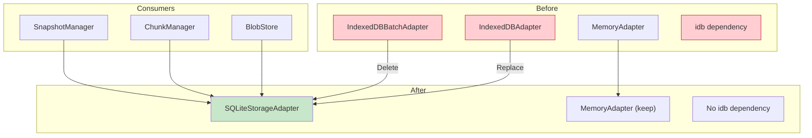

# 07: Storage Package Refactor

> Refactor @xnet/storage to use SQLite, remove IndexedDB adapters.

**Duration:** 2 days
**Dependencies:** [01-sqlite-adapter-interface.md](./01-sqlite-adapter-interface.md), [05-schema-and-migrations.md](./05-schema-and-migrations.md)
**Package:** `packages/storage/`

## Overview

The `@xnet/storage` package provides document and blob storage abstractions. This step:

1. Creates `SQLiteStorageAdapter` implementing the `StorageAdapter` interface
2. Updates `BlobStore` and `ChunkManager` to work with SQLite
3. Removes `IndexedDBAdapter` and `IndexedDBBatchAdapter`
4. Removes the `idb` dependency



## Current Interface

The `StorageAdapter` interface from `packages/storage/src/types.ts`:

```typescript
export interface StorageAdapter {
  // Lifecycle
  open(): Promise<void>
  close(): Promise<void>
  clear(): Promise<void>

  // Document operations
  getDocument(id: string): Promise<DocumentData | null>
  setDocument(id: string, data: DocumentData): Promise<void>
  deleteDocument(id: string): Promise<void>
  listDocuments(prefix?: string): Promise<DocumentData[]>

  // Update log (for Yjs sync)
  appendUpdate(docId: string, update: Uint8Array): Promise<void>
  getUpdates(docId: string, since?: number): Promise<Uint8Array[]>
  getUpdateCount(docId: string): Promise<number>

  // Snapshots
  getSnapshot(docId: string): Promise<Uint8Array | null>
  setSnapshot(docId: string, snapshot: Uint8Array): Promise<void>

  // Blobs
  getBlob(cid: string): Promise<Uint8Array | null>
  setBlob(cid: string, data: Uint8Array): Promise<void>
  hasBlob(cid: string): Promise<boolean>
}

export interface DocumentData {
  id: string
  content: Uint8Array
  metadata: DocumentMetadata
  version: number
}

export interface DocumentMetadata {
  created: number
  updated: number
  type?: string
  workspace?: string
}
```

## Implementation

### SQLiteStorageAdapter

````typescript
// packages/storage/src/adapters/sqlite.ts

import type { SQLiteAdapter } from '@xnet/sqlite'
import type { StorageAdapter, DocumentData, DocumentMetadata } from '../types'

/**
 * SQLite-backed storage adapter.
 *
 * Uses the platform-appropriate SQLite implementation via SQLiteAdapter.
 * Provides document storage, update logs, snapshots, and blob storage.
 *
 * @example
 * ```typescript
 * import { createElectronSQLiteAdapter } from '@xnet/sqlite/electron'
 *
 * const sqliteAdapter = await createElectronSQLiteAdapter({ path: 'xnet.db' })
 * const storage = new SQLiteStorageAdapter(sqliteAdapter)
 * await storage.open()
 * ```
 */
export class SQLiteStorageAdapter implements StorageAdapter {
  private isOpened = false

  constructor(private db: SQLiteAdapter) {}

  // ─── Lifecycle ────────────────────────────────────────────────────────────

  async open(): Promise<void> {
    if (!this.db.isOpen()) {
      throw new Error('SQLiteAdapter must be opened before use')
    }
    this.isOpened = true
  }

  async close(): Promise<void> {
    // Don't close the shared SQLiteAdapter - let the owner manage it
    this.isOpened = false
  }

  async clear(): Promise<void> {
    this.ensureOpen()

    await this.db.transaction(async () => {
      await this.db.run('DELETE FROM updates')
      await this.db.run('DELETE FROM snapshots')
      await this.db.run('DELETE FROM documents')
      await this.db.run('DELETE FROM blobs')
    })
  }

  // ─── Document Operations ──────────────────────────────────────────────────

  async getDocument(id: string): Promise<DocumentData | null> {
    this.ensureOpen()

    const row = await this.db.queryOne<{
      id: string
      content: Uint8Array
      metadata: string
      version: number
    }>('SELECT * FROM documents WHERE id = ?', [id])

    if (!row) return null

    return {
      id: row.id,
      content: row.content,
      metadata: JSON.parse(row.metadata),
      version: row.version
    }
  }

  async setDocument(id: string, data: DocumentData): Promise<void> {
    this.ensureOpen()

    await this.db.run(
      `INSERT INTO documents (id, content, metadata, version)
       VALUES (?, ?, ?, ?)
       ON CONFLICT(id) DO UPDATE SET
         content = excluded.content,
         metadata = excluded.metadata,
         version = excluded.version`,
      [id, data.content, JSON.stringify(data.metadata), data.version]
    )
  }

  async deleteDocument(id: string): Promise<void> {
    this.ensureOpen()

    await this.db.transaction(async () => {
      // Delete related updates and snapshots
      await this.db.run('DELETE FROM updates WHERE doc_id = ?', [id])
      await this.db.run('DELETE FROM snapshots WHERE doc_id = ?', [id])
      // Delete document
      await this.db.run('DELETE FROM documents WHERE id = ?', [id])
    })
  }

  async listDocuments(prefix?: string): Promise<DocumentData[]> {
    this.ensureOpen()

    let sql = 'SELECT * FROM documents'
    const params: string[] = []

    if (prefix) {
      sql += ' WHERE id LIKE ?'
      params.push(`${this.escapeLike(prefix)}%`)
    }

    sql += ' ORDER BY id'

    const rows = await this.db.query<{
      id: string
      content: Uint8Array
      metadata: string
      version: number
    }>(sql, params)

    return rows.map((row) => ({
      id: row.id,
      content: row.content,
      metadata: JSON.parse(row.metadata),
      version: row.version
    }))
  }

  // ─── Update Log ───────────────────────────────────────────────────────────

  async appendUpdate(docId: string, update: Uint8Array): Promise<void> {
    this.ensureOpen()

    // Hash update for deduplication
    const updateHash = await this.hashUpdate(update)

    await this.db.run(
      `INSERT OR IGNORE INTO updates (doc_id, update_hash, update_data, created_at)
       VALUES (?, ?, ?, ?)`,
      [docId, updateHash, this.encodeBase64(update), Date.now()]
    )
  }

  async getUpdates(docId: string, since?: number): Promise<Uint8Array[]> {
    this.ensureOpen()

    let sql = 'SELECT update_data FROM updates WHERE doc_id = ?'
    const params: (string | number)[] = [docId]

    if (since !== undefined) {
      sql += ' AND id > ?'
      params.push(since)
    }

    sql += ' ORDER BY id ASC'

    const rows = await this.db.query<{ update_data: string }>(sql, params)

    return rows.map((row) => this.decodeBase64(row.update_data))
  }

  async getUpdateCount(docId: string): Promise<number> {
    this.ensureOpen()

    const row = await this.db.queryOne<{ count: number }>(
      'SELECT COUNT(*) as count FROM updates WHERE doc_id = ?',
      [docId]
    )

    return row?.count ?? 0
  }

  // ─── Snapshots ────────────────────────────────────────────────────────────

  async getSnapshot(docId: string): Promise<Uint8Array | null> {
    this.ensureOpen()

    const row = await this.db.queryOne<{ snapshot_data: string }>(
      'SELECT snapshot_data FROM snapshots WHERE doc_id = ?',
      [docId]
    )

    if (!row) return null

    return this.decodeBase64(row.snapshot_data)
  }

  async setSnapshot(docId: string, snapshot: Uint8Array): Promise<void> {
    this.ensureOpen()

    await this.db.run(
      `INSERT INTO snapshots (doc_id, snapshot_data, created_at)
       VALUES (?, ?, ?)
       ON CONFLICT(doc_id) DO UPDATE SET
         snapshot_data = excluded.snapshot_data,
         created_at = excluded.created_at`,
      [docId, this.encodeBase64(snapshot), Date.now()]
    )
  }

  // ─── Blobs ────────────────────────────────────────────────────────────────

  async getBlob(cid: string): Promise<Uint8Array | null> {
    this.ensureOpen()

    const row = await this.db.queryOne<{ data: Uint8Array }>(
      'SELECT data FROM blobs WHERE cid = ?',
      [cid]
    )

    return row?.data ?? null
  }

  async setBlob(cid: string, data: Uint8Array): Promise<void> {
    this.ensureOpen()

    await this.db.run(
      `INSERT OR IGNORE INTO blobs (cid, data, size, created_at)
       VALUES (?, ?, ?, ?)`,
      [cid, data, data.byteLength, Date.now()]
    )
  }

  async hasBlob(cid: string): Promise<boolean> {
    this.ensureOpen()

    const row = await this.db.queryOne<{ exists: number }>(
      'SELECT 1 as exists FROM blobs WHERE cid = ? LIMIT 1',
      [cid]
    )

    return row !== null
  }

  // ─── Extended Methods ─────────────────────────────────────────────────────

  /**
   * Delete a blob by CID.
   * Not in base interface but useful for cleanup.
   */
  async deleteBlob(cid: string): Promise<void> {
    this.ensureOpen()
    await this.db.run('DELETE FROM blobs WHERE cid = ?', [cid])
  }

  /**
   * Get storage statistics.
   */
  async getStats(): Promise<{
    documentCount: number
    blobCount: number
    blobTotalSize: number
    updateCount: number
    snapshotCount: number
  }> {
    this.ensureOpen()

    const [docs, blobs, updates, snapshots] = await Promise.all([
      this.db.queryOne<{ count: number }>('SELECT COUNT(*) as count FROM documents'),
      this.db.queryOne<{ count: number; total: number }>(
        'SELECT COUNT(*) as count, COALESCE(SUM(size), 0) as total FROM blobs'
      ),
      this.db.queryOne<{ count: number }>('SELECT COUNT(*) as count FROM updates'),
      this.db.queryOne<{ count: number }>('SELECT COUNT(*) as count FROM snapshots')
    ])

    return {
      documentCount: docs?.count ?? 0,
      blobCount: blobs?.count ?? 0,
      blobTotalSize: blobs?.total ?? 0,
      updateCount: updates?.count ?? 0,
      snapshotCount: snapshots?.count ?? 0
    }
  }

  /**
   * Compact updates by merging into snapshot.
   */
  async compactUpdates(docId: string, mergedSnapshot: Uint8Array): Promise<number> {
    this.ensureOpen()

    let deletedCount = 0

    await this.db.transaction(async () => {
      // Set new snapshot
      await this.setSnapshot(docId, mergedSnapshot)

      // Delete old updates
      const result = await this.db.run('DELETE FROM updates WHERE doc_id = ?', [docId])
      deletedCount = result.changes
    })

    return deletedCount
  }

  // ─── Private Helpers ──────────────────────────────────────────────────────

  private ensureOpen(): void {
    if (!this.isOpened) {
      throw new Error('StorageAdapter not open. Call open() first.')
    }
  }

  private escapeLike(value: string): string {
    return value.replace(/[%_\\]/g, '\\$&')
  }

  private encodeBase64(data: Uint8Array): string {
    // Use browser/node compatible method
    if (typeof Buffer !== 'undefined') {
      return Buffer.from(data).toString('base64')
    }
    return btoa(String.fromCharCode(...data))
  }

  private decodeBase64(str: string): Uint8Array {
    if (typeof Buffer !== 'undefined') {
      return new Uint8Array(Buffer.from(str, 'base64'))
    }
    return new Uint8Array(
      atob(str)
        .split('')
        .map((c) => c.charCodeAt(0))
    )
  }

  private async hashUpdate(data: Uint8Array): Promise<string> {
    // Simple hash for deduplication
    // In production, use BLAKE3 from @xnet/crypto
    if (typeof crypto !== 'undefined' && crypto.subtle) {
      const hash = await crypto.subtle.digest('SHA-256', data)
      return this.encodeBase64(new Uint8Array(hash))
    }
    // Fallback: simple checksum
    let sum = 0
    for (const byte of data) {
      sum = (sum * 31 + byte) >>> 0
    }
    return sum.toString(16)
  }
}
````

### Factory Functions

```typescript
// packages/storage/src/adapters/sqlite.ts (continued)

import { createElectronSQLiteAdapter } from '@xnet/sqlite/electron'
import { createWebSQLiteAdapter } from '@xnet/sqlite/web'
import { createExpoSQLiteAdapter } from '@xnet/sqlite/expo'
import type { SQLiteConfig } from '@xnet/sqlite'

/**
 * Create SQLiteStorageAdapter for Electron.
 */
export async function createElectronStorageAdapter(
  config: SQLiteConfig
): Promise<SQLiteStorageAdapter> {
  const db = await createElectronSQLiteAdapter(config)
  const adapter = new SQLiteStorageAdapter(db)
  await adapter.open()
  return adapter
}

/**
 * Create SQLiteStorageAdapter for Web.
 */
export async function createWebStorageAdapter(config: SQLiteConfig): Promise<SQLiteStorageAdapter> {
  const db = await createWebSQLiteAdapter(config)
  const adapter = new SQLiteStorageAdapter(db)
  await adapter.open()
  return adapter
}

/**
 * Create SQLiteStorageAdapter for Expo.
 */
export async function createExpoStorageAdapter(
  config: SQLiteConfig
): Promise<SQLiteStorageAdapter> {
  const db = await createExpoSQLiteAdapter(config)
  const adapter = new SQLiteStorageAdapter(db)
  await adapter.open()
  return adapter
}
```

### Shared Adapter Instance

For apps that use both NodeStore and StorageAdapter, share the underlying SQLiteAdapter:

```typescript
// packages/storage/src/adapters/sqlite.ts (continued)

/**
 * Create SQLiteStorageAdapter from an existing SQLiteAdapter.
 * Use when sharing the SQLite connection with other services.
 */
export function createStorageAdapterFromSQLite(sqliteAdapter: SQLiteAdapter): SQLiteStorageAdapter {
  const adapter = new SQLiteStorageAdapter(sqliteAdapter)
  // Note: open() must be called by the consumer
  return adapter
}
```

### Update Package Exports

```typescript
// packages/storage/src/index.ts

// Types
export type { StorageAdapter, DocumentData, DocumentMetadata, StorageStats } from './types'

// Adapters
export { MemoryAdapter } from './adapters/memory'
export {
  SQLiteStorageAdapter,
  createElectronStorageAdapter,
  createWebStorageAdapter,
  createExpoStorageAdapter,
  createStorageAdapterFromSQLite
} from './adapters/sqlite'

// REMOVED:
// export { IndexedDBAdapter } from './adapters/indexeddb'
// export { IndexedDBBatchAdapter, createIndexedDBBatchAdapter } from './adapters/indexeddb-batch'

// Batch utilities (may still be useful for other contexts)
export { BatchWriter, createBatchWriter } from './adapters/batch-writer'

// Blob storage
export { BlobStore } from './blob-store'
export { ChunkManager, CHUNK_SIZE, CHUNK_THRESHOLD } from './chunk-manager'
export type { ChunkManifest, StoreResult } from './chunk-manager'

// Snapshot management
export { SnapshotManager, type SnapshotManagerOptions } from './snapshots/manager'
```

## Update Consumers

### BlobStore

Update to use the new deleteBlob method:

```typescript
// packages/storage/src/blob-store.ts

import type { StorageAdapter } from './types'
import type { SQLiteStorageAdapter } from './adapters/sqlite'

export class BlobStore {
  constructor(private storage: StorageAdapter) {}

  // ... existing methods stay the same ...

  /**
   * Delete a blob if the adapter supports it.
   */
  async delete(cid: string): Promise<boolean> {
    // Check if adapter has deleteBlob method
    if ('deleteBlob' in this.storage && typeof this.storage.deleteBlob === 'function') {
      await (this.storage as SQLiteStorageAdapter).deleteBlob(cid)
      return true
    }
    // Fallback: can't delete with base interface
    console.warn('BlobStore.delete: Adapter does not support deleteBlob')
    return false
  }
}
```

### ChunkManager

No changes needed - it uses the standard StorageAdapter interface.

### SnapshotManager

No changes needed - it uses the standard StorageAdapter interface.

## Remove IndexedDB

### Files to Delete

```
packages/storage/src/adapters/indexeddb.ts        # DELETE
packages/storage/src/adapters/indexeddb-batch.ts  # DELETE
packages/storage/src/adapters/indexeddb.test.ts   # DELETE (if exists)
```

### Update package.json

```diff
{
  "name": "@xnet/storage",
  "dependencies": {
-   "idb": "^8.0.0"
+   "@xnet/sqlite": "workspace:*"
  }
}
```

## Tests

```typescript
// packages/storage/src/adapters/sqlite.test.ts

import { describe, it, expect, beforeEach, afterEach } from 'vitest'
import { SQLiteStorageAdapter } from './sqlite'
import { createMemorySQLiteAdapter } from '@xnet/sqlite/memory'
import type { SQLiteAdapter } from '@xnet/sqlite'
import type { DocumentData } from '../types'

describe('SQLiteStorageAdapter', () => {
  let db: SQLiteAdapter
  let storage: SQLiteStorageAdapter

  beforeEach(async () => {
    db = await createMemorySQLiteAdapter()
    storage = new SQLiteStorageAdapter(db)
    await storage.open()
  })

  afterEach(async () => {
    await storage.close()
    await db.close()
  })

  describe('Lifecycle', () => {
    it('opens and closes', async () => {
      // Already opened in beforeEach
      await storage.close()
      // Should be able to reopen
      await storage.open()
    })

    it('clears all data', async () => {
      // Add some data
      await storage.setDocument('doc-1', {
        id: 'doc-1',
        content: new Uint8Array([1, 2, 3]),
        metadata: { created: Date.now(), updated: Date.now() },
        version: 1
      })
      await storage.setBlob('blob-1', new Uint8Array([4, 5, 6]))

      // Clear
      await storage.clear()

      // Verify empty
      const doc = await storage.getDocument('doc-1')
      const blob = await storage.getBlob('blob-1')
      expect(doc).toBeNull()
      expect(blob).toBeNull()
    })
  })

  describe('Documents', () => {
    const testDoc: DocumentData = {
      id: 'doc-1',
      content: new Uint8Array([1, 2, 3]),
      metadata: { created: Date.now(), updated: Date.now(), type: 'page' },
      version: 1
    }

    it('stores and retrieves documents', async () => {
      await storage.setDocument(testDoc.id, testDoc)
      const retrieved = await storage.getDocument(testDoc.id)

      expect(retrieved).not.toBeNull()
      expect(retrieved!.id).toBe(testDoc.id)
      expect(retrieved!.content).toEqual(testDoc.content)
      expect(retrieved!.metadata.type).toBe('page')
    })

    it('updates existing documents', async () => {
      await storage.setDocument(testDoc.id, testDoc)

      const updated = { ...testDoc, version: 2 }
      await storage.setDocument(testDoc.id, updated)

      const retrieved = await storage.getDocument(testDoc.id)
      expect(retrieved!.version).toBe(2)
    })

    it('deletes documents', async () => {
      await storage.setDocument(testDoc.id, testDoc)
      await storage.deleteDocument(testDoc.id)

      const retrieved = await storage.getDocument(testDoc.id)
      expect(retrieved).toBeNull()
    })

    it('lists documents by prefix', async () => {
      await storage.setDocument('pages/1', { ...testDoc, id: 'pages/1' })
      await storage.setDocument('pages/2', { ...testDoc, id: 'pages/2' })
      await storage.setDocument('blobs/1', { ...testDoc, id: 'blobs/1' })

      const pages = await storage.listDocuments('pages/')
      expect(pages).toHaveLength(2)
      expect(pages.every((d) => d.id.startsWith('pages/'))).toBe(true)
    })

    it('lists all documents without prefix', async () => {
      await storage.setDocument('doc-1', testDoc)
      await storage.setDocument('doc-2', { ...testDoc, id: 'doc-2' })

      const all = await storage.listDocuments()
      expect(all).toHaveLength(2)
    })
  })

  describe('Updates', () => {
    it('appends and retrieves updates', async () => {
      const update1 = new Uint8Array([1, 2, 3])
      const update2 = new Uint8Array([4, 5, 6])

      await storage.appendUpdate('doc-1', update1)
      await storage.appendUpdate('doc-1', update2)

      const updates = await storage.getUpdates('doc-1')
      expect(updates).toHaveLength(2)
    })

    it('counts updates', async () => {
      await storage.appendUpdate('doc-1', new Uint8Array([1]))
      await storage.appendUpdate('doc-1', new Uint8Array([2]))
      await storage.appendUpdate('doc-1', new Uint8Array([3]))

      const count = await storage.getUpdateCount('doc-1')
      expect(count).toBe(3)
    })

    it('deduplicates identical updates', async () => {
      const update = new Uint8Array([1, 2, 3])

      await storage.appendUpdate('doc-1', update)
      await storage.appendUpdate('doc-1', update) // Same content

      const count = await storage.getUpdateCount('doc-1')
      expect(count).toBe(1)
    })
  })

  describe('Snapshots', () => {
    it('stores and retrieves snapshots', async () => {
      const snapshot = new Uint8Array([1, 2, 3, 4, 5])

      await storage.setSnapshot('doc-1', snapshot)
      const retrieved = await storage.getSnapshot('doc-1')

      expect(retrieved).toEqual(snapshot)
    })

    it('returns null for non-existent snapshot', async () => {
      const snapshot = await storage.getSnapshot('nonexistent')
      expect(snapshot).toBeNull()
    })

    it('overwrites existing snapshots', async () => {
      await storage.setSnapshot('doc-1', new Uint8Array([1, 2, 3]))
      await storage.setSnapshot('doc-1', new Uint8Array([4, 5, 6]))

      const retrieved = await storage.getSnapshot('doc-1')
      expect(retrieved).toEqual(new Uint8Array([4, 5, 6]))
    })
  })

  describe('Blobs', () => {
    it('stores and retrieves blobs', async () => {
      const data = new Uint8Array([1, 2, 3, 4, 5])

      await storage.setBlob('cid-1', data)
      const retrieved = await storage.getBlob('cid-1')

      expect(retrieved).toEqual(data)
    })

    it('checks blob existence', async () => {
      await storage.setBlob('cid-1', new Uint8Array([1, 2, 3]))

      expect(await storage.hasBlob('cid-1')).toBe(true)
      expect(await storage.hasBlob('cid-2')).toBe(false)
    })

    it('does not overwrite existing blobs', async () => {
      const original = new Uint8Array([1, 2, 3])
      const duplicate = new Uint8Array([4, 5, 6])

      await storage.setBlob('cid-1', original)
      await storage.setBlob('cid-1', duplicate) // Should be ignored

      const retrieved = await storage.getBlob('cid-1')
      expect(retrieved).toEqual(original)
    })

    it('deletes blobs', async () => {
      await storage.setBlob('cid-1', new Uint8Array([1, 2, 3]))
      await storage.deleteBlob('cid-1')

      expect(await storage.hasBlob('cid-1')).toBe(false)
    })
  })

  describe('Extended Methods', () => {
    it('returns storage stats', async () => {
      await storage.setDocument('doc-1', {
        id: 'doc-1',
        content: new Uint8Array([1]),
        metadata: { created: Date.now(), updated: Date.now() },
        version: 1
      })
      await storage.setBlob('blob-1', new Uint8Array([1, 2, 3, 4, 5]))
      await storage.appendUpdate('doc-1', new Uint8Array([1, 2]))
      await storage.setSnapshot('doc-1', new Uint8Array([1]))

      const stats = await storage.getStats()

      expect(stats.documentCount).toBe(1)
      expect(stats.blobCount).toBe(1)
      expect(stats.blobTotalSize).toBe(5)
      expect(stats.updateCount).toBe(1)
      expect(stats.snapshotCount).toBe(1)
    })

    it('compacts updates into snapshot', async () => {
      await storage.appendUpdate('doc-1', new Uint8Array([1]))
      await storage.appendUpdate('doc-1', new Uint8Array([2]))
      await storage.appendUpdate('doc-1', new Uint8Array([3]))

      const mergedSnapshot = new Uint8Array([1, 2, 3])
      const deletedCount = await storage.compactUpdates('doc-1', mergedSnapshot)

      expect(deletedCount).toBe(3)
      expect(await storage.getUpdateCount('doc-1')).toBe(0)
      expect(await storage.getSnapshot('doc-1')).toEqual(mergedSnapshot)
    })
  })
})
```

## Migration Strategy

Since this is prerelease software, no data migration is needed:

1. Users update the app
2. Old IndexedDB data is ignored (will be garbage collected by browser)
3. New SQLite storage starts fresh
4. Sync will repopulate data from peers

For Electron, the existing SQLite data (if using better-sqlite3) will be migrated to the new schema via the schema versioning system.

## Checklist

### Implementation

- [x] Create `SQLiteStorageAdapter` class
- [x] Implement all `StorageAdapter` methods
- [x] Add `deleteBlob` extended method
- [x] Add `getStats` extended method
- [x] Add `compactUpdates` extended method
- [ ] Create platform factory functions (deferred - apps handle this)
- [x] Create shared adapter factory (`createStorageAdapterFromSQLite`)

### Update Consumers

- [x] Update `BlobStore.delete()` to use new method
- [x] Verify `ChunkManager` works with new adapter
- [x] Verify `SnapshotManager` works with new adapter

### Package Updates

- [x] Update `packages/storage/src/index.ts` exports
- [ ] Remove IndexedDB adapter exports (deferred - keep for backward compat)
- [x] Add `@xnet/sqlite` dependency
- [ ] Remove `idb` dependency (deferred - keep until IndexedDB fully removed)

### Cleanup

- [x] Mark `IndexedDBAdapter` and `IndexedDBBatchAdapter` as deprecated
- [ ] Delete `indexeddb.ts` (deferred to Phase 8)
- [ ] Delete `indexeddb-batch.ts` (deferred to Phase 8)
- [ ] Delete any IndexedDB tests (deferred to Phase 8)
- [x] Update any documentation (README updated with SQLite usage)

### Tests

- [x] Lifecycle tests
- [x] Document CRUD tests
- [x] Update log tests
- [x] Snapshot tests
- [x] Blob tests
- [x] Extended method tests
- [x] Integration tests with BlobStore
- [x] Integration tests with ChunkManager
- [x] Target: 25+ tests (30 tests passing)

---

[Back to README](./README.md) | [Previous: NodeStore](./06-nodestore-sqlite-adapter.md) | [Next: Testing ->](./08-testing-and-validation.md)
