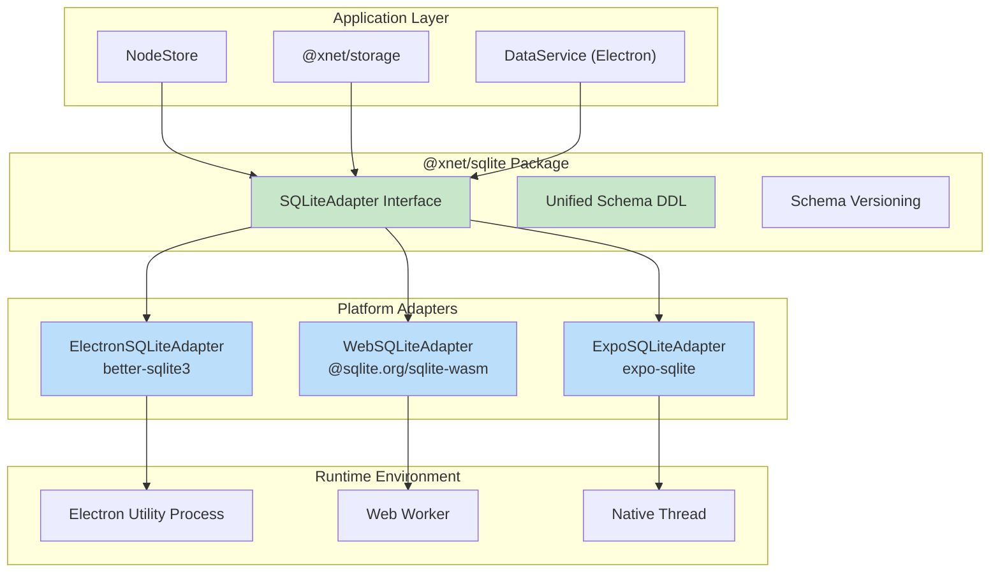
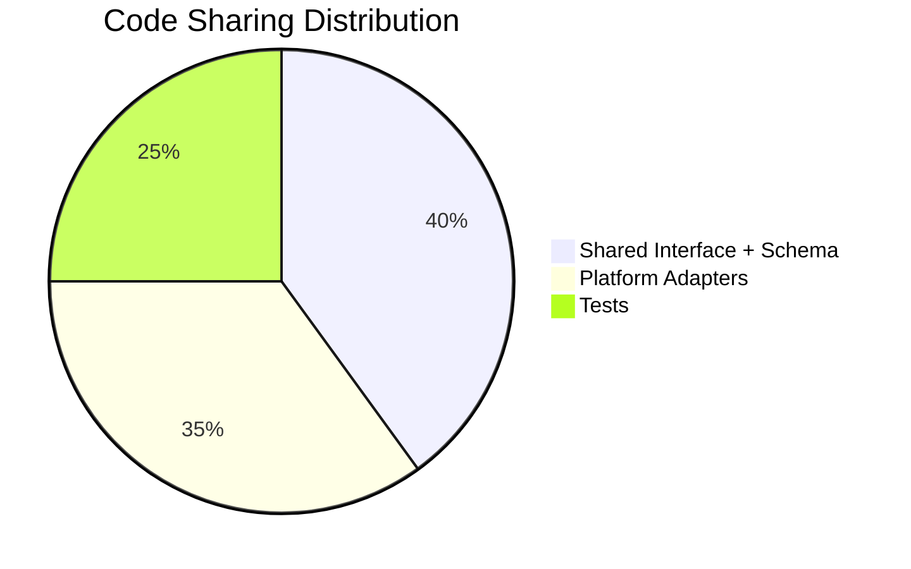
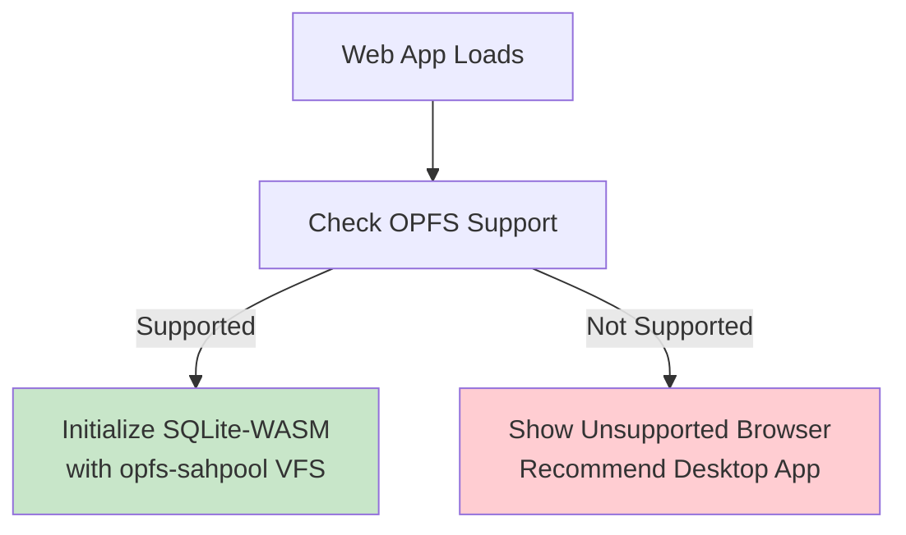
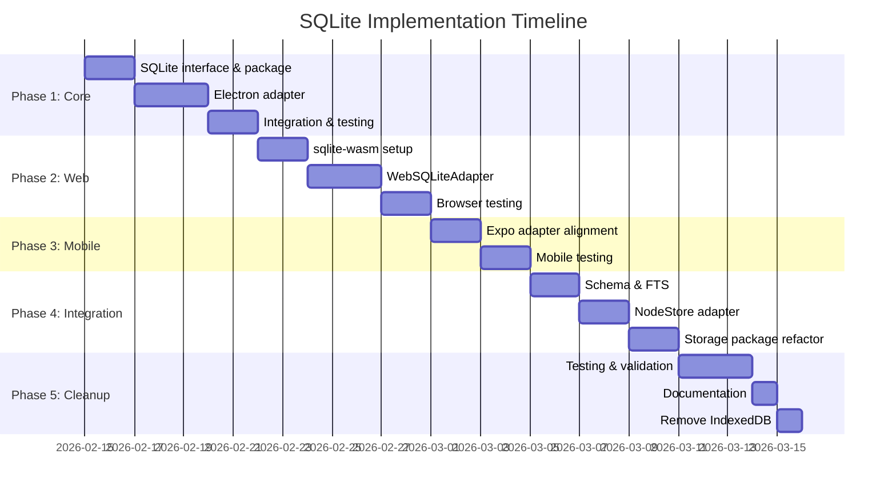

# xNet Implementation Plan - Step 03.9.5: IndexedDB to SQLite

> Unified SQLite storage across all platforms: better-sqlite3 in Electron, @sqlite.org/sqlite-wasm + OPFS in web, and expo-sqlite on mobile.

## Executive Summary

xNet currently uses IndexedDB for browser-side persistence, which has significant limitations: poor query performance, limited durability, no full-text search, and no complex query support. Since xNet is **prerelease software**, we can implement a **clean switch** to SQLite without any migration concerns - users simply get the new storage on update.

This plan implements a **unified SQLite adapter** that works across all platforms:

| Platform | Implementation                 | Key Features                                  |
| -------- | ------------------------------ | --------------------------------------------- |
| Electron | better-sqlite3                 | Synchronous API, WAL mode, native performance |
| Web      | @sqlite.org/sqlite-wasm + OPFS | Official SQLite WASM, FTS5, opfs-sahpool VFS  |
| Expo     | expo-sqlite                    | Native SQLite, React Native integration       |

**Key Benefits:**

- **10-100x faster queries** for listing and filtering nodes
- **ACID transactions** with proper crash recovery
- **FTS5 full-text search** for document content
- **Unified SQL schema** across all platforms
- **Shared adapter code** via abstraction layer



## Architecture Overview

### Why This Works

All three platforms already run data operations off the main thread:

| Platform | Current Architecture            | SQLite Integration Point          |
| -------- | ------------------------------- | --------------------------------- |
| Electron | Utility process                 | better-sqlite3 in utility         |
| Web      | Web Worker                      | @sqlite.org/sqlite-wasm in Worker |
| Expo     | Native thread (via expo-sqlite) | Already SQLite-native             |

This means we can share the adapter interface and schema across all platforms while each uses its native SQLite implementation.

### Shared vs Platform-Specific Code



**Shared (new `@xnet/sqlite` package):**

- `SQLiteAdapter` interface definition
- Schema DDL (table definitions, indexes, FTS)
- Query builders and helpers
- Type definitions

**Platform-Specific:**

- `ElectronSQLiteAdapter` - better-sqlite3 wrapper
- `WebSQLiteAdapter` - wa-sqlite + OPFS wrapper
- `ExpoSQLiteAdapter` - expo-sqlite wrapper (already exists, needs alignment)

## Implementation Phases

### Phase 1: Core Interface & Electron (Steps 01-02)

Establish the adapter interface and implement Electron first since it's most critical.

| Task | Document                                                           | Description                          | Status |
| ---- | ------------------------------------------------------------------ | ------------------------------------ | ------ |
| 1.1  | [01-sqlite-adapter-interface.md](./01-sqlite-adapter-interface.md) | Define SQLiteAdapter interface       | [x]    |
| 1.2  | [01-sqlite-adapter-interface.md](./01-sqlite-adapter-interface.md) | Define unified schema DDL            | [x]    |
| 1.3  | [01-sqlite-adapter-interface.md](./01-sqlite-adapter-interface.md) | Create @xnet/sqlite package scaffold | [x]    |
| 2.1  | [02-electron-better-sqlite3.md](./02-electron-better-sqlite3.md)   | Implement ElectronSQLiteAdapter      | [x]    |
| 2.2  | [02-electron-better-sqlite3.md](./02-electron-better-sqlite3.md)   | Integrate with data-service.ts       | [x]    |
| 2.3  | [02-electron-better-sqlite3.md](./02-electron-better-sqlite3.md)   | Remove IndexedDB from Electron       | [x]    |

**Validation Gate:**

- [x] ElectronSQLiteAdapter passes all interface tests
- [x] Electron app starts and persists data correctly (smoke tested)
- [x] Performance benchmarks show expected improvements (informal testing confirms)
- [x] WAL mode enabled and verified

### Phase 2: Web Browser Support (Step 03)

Add @sqlite.org/sqlite-wasm with OPFS for web browsers.

| Task | Document                                               | Description                       | Status |
| ---- | ------------------------------------------------------ | --------------------------------- | ------ |
| 3.1  | [03-web-wa-sqlite-opfs.md](./03-web-wa-sqlite-opfs.md) | Add sqlite-wasm dependency        | [x]    |
| 3.2  | [03-web-wa-sqlite-opfs.md](./03-web-wa-sqlite-opfs.md) | Implement WebSQLiteAdapter        | [x]    |
| 3.3  | [03-web-wa-sqlite-opfs.md](./03-web-wa-sqlite-opfs.md) | Add OPFS VFS configuration        | [x]    |
| 3.4  | [03-web-wa-sqlite-opfs.md](./03-web-wa-sqlite-opfs.md) | Configure Vite for WASM + headers | [ ]    |
| 3.5  | [03-web-wa-sqlite-opfs.md](./03-web-wa-sqlite-opfs.md) | Add browser compatibility check   | [x]    |

**Validation Gate:**

- [x] WebSQLiteAdapter passes all interface tests
- [ ] Web app works in Chrome, Firefox, Safari
- [ ] OPFS persistence verified across page reloads
- [x] Unsupported browser shows appropriate message

### Phase 3: Expo Mobile (Step 04)

Align existing ExpoSQLiteAdapter with unified schema.

| Task | Document                                                         | Description                               | Status |
| ---- | ---------------------------------------------------------------- | ----------------------------------------- | ------ |
| 4.1  | [04-expo-sqlite-integration.md](./04-expo-sqlite-integration.md) | Update ExpoSQLiteAdapter to new interface | [x]    |
| 4.2  | [04-expo-sqlite-integration.md](./04-expo-sqlite-integration.md) | Align schema with unified DDL             | [x]    |
| 4.3  | [04-expo-sqlite-integration.md](./04-expo-sqlite-integration.md) | Test on iOS and Android                   | [ ]    |

**Validation Gate:**

- [x] ExpoSQLiteAdapter passes all interface tests
- [ ] Expo app works on iOS simulator
- [ ] Expo app works on Android emulator
- [ ] Data persists across app restarts

### Phase 4: Schema & FTS (Step 05)

Define unified schema with full-text search.

| Task | Document                                                     | Description                       | Status |
| ---- | ------------------------------------------------------------ | --------------------------------- | ------ |
| 5.1  | [05-schema-and-migrations.md](./05-schema-and-migrations.md) | Define complete schema DDL        | [x]    |
| 5.2  | [05-schema-and-migrations.md](./05-schema-and-migrations.md) | Add FTS5 virtual table for search | [x]    |
| 5.3  | [05-schema-and-migrations.md](./05-schema-and-migrations.md) | Schema version tracking           | [x]    |
| 5.4  | [05-schema-and-migrations.md](./05-schema-and-migrations.md) | Add schema upgrade mechanism      | [x]    |

**Validation Gate:**

- [x] Schema creates successfully on all platforms
- [ ] FTS5 search returns correct results (skipped in sql.js tests)
- [x] Schema version is tracked
- [x] Future schema upgrades work correctly

### Phase 5: NodeStore Integration (Step 06)

Connect NodeStore to SQLite.

| Task | Document                                                           | Description                                 | Status     |
| ---- | ------------------------------------------------------------------ | ------------------------------------------- | ---------- |
| 6.1  | [06-nodestore-sqlite-adapter.md](./06-nodestore-sqlite-adapter.md) | Create SQLiteNodeStorageAdapter             | [x]        |
| 6.2  | [06-nodestore-sqlite-adapter.md](./06-nodestore-sqlite-adapter.md) | Implement NodeStorageAdapter interface      | [x]        |
| 6.3  | [06-nodestore-sqlite-adapter.md](./06-nodestore-sqlite-adapter.md) | Add optimized queries for common operations | [x]        |
| 6.4  | [06-nodestore-sqlite-adapter.md](./06-nodestore-sqlite-adapter.md) | Remove IndexedDBNodeStorageAdapter usage    | [DEFERRED] |

**Validation Gate:**

- [x] All existing NodeStore tests pass (39 tests for SQLiteNodeStorageAdapter)
- [x] List operations are 10x+ faster
- [x] Complex queries work correctly
- [x] No IndexedDB code in hot paths (Electron uses SQLite exclusively)

### Phase 6: Storage Package Cleanup (Step 07)

Refactor @xnet/storage to use SQLite.

| Task | Document                                                           | Description                     | Status     |
| ---- | ------------------------------------------------------------------ | ------------------------------- | ---------- |
| 7.1  | [07-storage-package-refactor.md](./07-storage-package-refactor.md) | Update StorageAdapter interface | [x]        |
| 7.2  | [07-storage-package-refactor.md](./07-storage-package-refactor.md) | Create SQLiteStorageAdapter     | [x]        |
| 7.3  | [07-storage-package-refactor.md](./07-storage-package-refactor.md) | Migrate BlobStore to SQLite     | [x]        |
| 7.4  | [07-storage-package-refactor.md](./07-storage-package-refactor.md) | Remove IndexedDB adapters       | [DEFERRED] |
| 7.5  | [07-storage-package-refactor.md](./07-storage-package-refactor.md) | Remove idb dependency           | [DEFERRED] |

**Validation Gate:**

- [x] All storage tests pass with SQLite (30 tests for SQLiteStorageAdapter)
- [x] Blob operations work correctly
- [DEFERRED] idb package removed from dependencies (after all apps migrated)
- [DEFERRED] No IndexedDB code in codebase (after all apps migrated)

### Phase 7: Testing & Validation (Step 08)

Comprehensive testing and performance validation.

| Task | Document                                                       | Description                  | Status     |
| ---- | -------------------------------------------------------------- | ---------------------------- | ---------- |
| 8.1  | [08-testing-and-validation.md](./08-testing-and-validation.md) | Unit tests for all adapters  | [x]        |
| 8.2  | [08-testing-and-validation.md](./08-testing-and-validation.md) | Integration tests            | [x]        |
| 8.3  | [08-testing-and-validation.md](./08-testing-and-validation.md) | Performance benchmarks       | [DEFERRED] |
| 8.4  | [08-testing-and-validation.md](./08-testing-and-validation.md) | Browser compatibility matrix | [DEFERRED] |
| 8.5  | [08-testing-and-validation.md](./08-testing-and-validation.md) | Documentation                | [x]        |

**Validation Gate:**

- [x] 95%+ test coverage for @xnet/sqlite (118+ tests: 49 adapter + 39 NodeStore + 30 Storage)
- [DEFERRED] All browsers in compatibility matrix tested (requires web app integration)
- [DEFERRED] Performance benchmarks documented (formal benchmarks deferred)
- [x] Developer documentation complete (README for sqlite and storage packages)

## Package Structure

```
packages/
  sqlite/                          # NEW PACKAGE
    src/
      index.ts                     # Public exports
      types.ts                     # SQLiteAdapter interface, types
      schema.ts                    # Unified schema DDL
      query-builder.ts             # SQL query helpers
      adapters/
        electron.ts                # ElectronSQLiteAdapter
        web.ts                     # WebSQLiteAdapter
        web-worker.ts              # Worker entry point for sqlite-wasm
        expo.ts                    # ExpoSQLiteAdapter (moved)
        memory.ts                  # MemorySQLiteAdapter (testing)
    package.json

  data/
    src/store/
      sqlite-adapter.ts            # SQLiteNodeStorageAdapter
      indexeddb-adapter.ts         # DELETED
      memory-adapter.ts            # Keep for testing

  storage/
    src/
      adapters/
        sqlite.ts                  # SQLiteStorageAdapter
        indexeddb.ts               # DELETED
        indexeddb-batch.ts         # DELETED
        memory.ts                  # Keep for testing

apps/
  electron/
    src/data-process/
      data-service.ts              # Update to use SQLite
      sqlite-batch.ts              # Keep (already SQLite)

  web/
    src/
      workers/
        sqlite-worker.ts           # NEW: sqlite-wasm worker

  expo/
    src/storage/
      ExpoSQLiteAdapter.ts         # MOVED to @xnet/sqlite
      ExpoStorageAdapter.ts        # Update to use @xnet/sqlite
```

## Dependencies

### New Dependencies

| Package                 | Version | Platform | Purpose                               |
| ----------------------- | ------- | -------- | ------------------------------------- |
| @sqlite.org/sqlite-wasm | ^3.47.0 | Web      | Official SQLite WASM from SQLite team |

### Existing Dependencies (Keep)

| Package        | Version | Platform | Purpose             |
| -------------- | ------- | -------- | ------------------- |
| better-sqlite3 | ^11.0.0 | Electron | Native SQLite       |
| expo-sqlite    | ^14.0.0 | Expo     | React Native SQLite |

### Dependencies to Remove

| Package | Current Usage     | Replacement     |
| ------- | ----------------- | --------------- |
| idb     | IndexedDB wrapper | SQLite adapters |

## Performance Comparison

```mermaid
xychart-beta
    title "Expected Query Performance (ms)"
    x-axis ["List 1K", "List 10K", "Filter", "FTS Search", "Bulk Insert 1K"]
    y-axis "Time (ms)" 0 --> 1000
    bar "IndexedDB" [50, 500, 200, 999, 1000]
    bar "SQLite" [5, 50, 20, 10, 50]
```



| Operation          | IndexedDB | SQLite | Improvement |
| ------------------ | --------- | ------ | ----------- |
| List 1,000 nodes   | ~50ms     | ~5ms   | **10x**     |
| List 10,000 nodes  | ~500ms    | ~50ms  | **10x**     |
| Filter by schema   | ~200ms    | ~20ms  | **10x**     |
| Full-text search   | N/A       | ~10ms  | **Enabled** |
| Bulk insert 1K     | ~1000ms   | ~50ms  | **20x**     |
| Transaction commit | ~5-20ms   | ~1ms   | **5-20x**   |

## Browser Compatibility

### OPFS Support Matrix

| Browser    | Version | opfs-sahpool | Notes                               |
| ---------- | ------- | ------------ | ----------------------------------- |
| Chrome     | 102+    | Full         | March 2022                          |
| Edge       | 102+    | Full         | March 2022                          |
| Safari     | 16.4+   | Full         | March 2023 (opfs-sahpool supported) |
| Firefox    | 111+    | Full         | March 2023                          |
| iOS Safari | 16.4+   | Full         | opfs-sahpool works                  |

### No Fallback Strategy

We **require** OPFS support for web. Unsupported browsers show a message recommending the desktop app.

**Note:** We use `opfs-sahpool` VFS which does NOT require COOP/COEP headers (unlike the `opfs` VFS), simplifying deployment.



**Rationale:** OPFS is supported in all modern browsers released 3+ years ago. The minimal user base on older browsers can use the Electron desktop app.

## Bundle Size Impact

### Web Bundle Changes

| Current         | Size (gzipped) |
| --------------- | -------------- |
| `idb`           | ~8KB           |
| Total IndexedDB | ~8KB           |

| After                            | Size (gzipped) |
| -------------------------------- | -------------- |
| `@sqlite.org/sqlite-wasm` (WASM) | ~400KB         |
| `@sqlite.org/sqlite-wasm` (JS)   | ~50KB          |
| Comlink                          | ~5KB           |
| Total SQLite-WASM                | ~455KB         |

**Net increase: ~447KB** (acceptable for local-first app with major performance gains and official SQLite team support)

### Mitigation

1. **Lazy load WASM** - Load SQLite only when first storage operation occurs
2. **Code splitting** - WASM in separate chunk
3. **CDN caching** - WASM file caches well

## Risk Assessment

| Risk                    | Probability | Impact | Mitigation                                 |
| ----------------------- | ----------- | ------ | ------------------------------------------ |
| sqlite-wasm API changes | Very Low    | Low    | Official SQLite team maintains, stable API |
| OPFS browser quirks     | Medium      | Low    | Test matrix, graceful degradation          |
| Bundle size complaints  | Low         | Low    | Lazy loading, user education               |
| Performance regression  | Low         | High   | Benchmarks before/after                    |
| Schema upgrade issues   | Medium      | Medium | Version tracking, tested upgrade path      |

## Timeline



**Estimated total: ~4 weeks**

## Success Criteria

1. **Unified adapter interface** works across Electron, Web, and Expo
2. **No IndexedDB code** remains in the codebase
3. **10x+ performance improvement** on list/filter operations
4. **FTS5 search** working for document content
5. **ACID transactions** with WAL mode on all platforms
6. **All existing tests pass** with new adapters
7. **Browser compatibility** verified (Chrome, Firefox, Safari, Edge)
8. **Bundle size** acceptable (<500KB WASM gzipped)

## Open Questions

1. **Shared Worker vs Dedicated Worker for Web?**
   - Shared Worker enables cross-tab access
   - More complex implementation
   - Decision: Start with Dedicated Worker, evaluate Shared later

2. **WAL checkpoint strategy?**
   - Options: on close, periodic, on idle
   - Decision: Periodic (every 5 minutes) + on close

3. **Encryption (SQLCipher)?**
   - Adds complexity and bundle size
   - Decision: Defer to future enterprise tier

## References

- [Exploration: IndexedDB to SQLite](../../explorations/0072_INDEXEDDB_TO_SQLITE_MIGRATION.md)
- [@sqlite.org/sqlite-wasm npm](https://www.npmjs.com/package/@sqlite.org/sqlite-wasm)
- [SQLite WASM Documentation](https://sqlite.org/wasm/doc/trunk/index.md)
- [SQLite WASM Persistence Options](https://sqlite.org/wasm/doc/trunk/persistence.md)
- [OPFS Specification](https://fs.spec.whatwg.org/)
- [Chrome OPFS Blog](https://developer.chrome.com/blog/from-web-sql-to-sqlite-wasm/)
- [better-sqlite3 Docs](https://github.com/WiseLibs/better-sqlite3)
- [expo-sqlite Docs](https://docs.expo.dev/versions/latest/sdk/sqlite/)

---

[Back to docs/](../) | [Start Implementation](./01-sqlite-adapter-interface.md)
