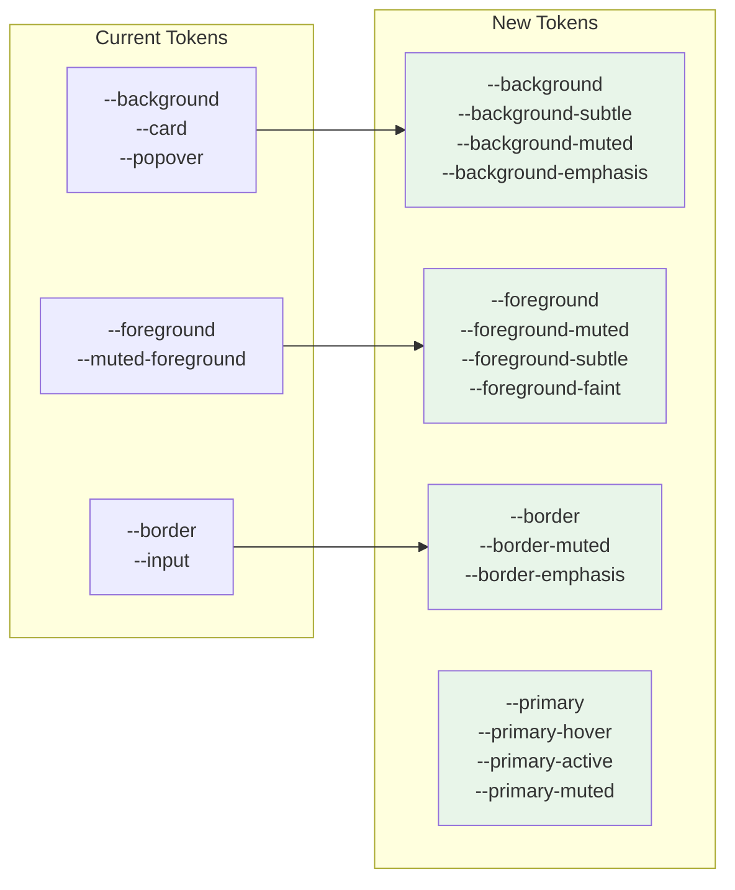

# 01: Design Tokens

> Enhanced color system with refined light/dark modes and semantic color variants.

**Duration:** 2 days  
**Dependencies:** None  
**Package:** `packages/ui/`

## Overview

This step updates `tokens.css` with a refined color system that follows the "monochrome + one accent" philosophy. The new system provides more granular control over backgrounds, foregrounds, and borders while maintaining the existing Tailwind integration.



## Implementation

### 1. Updated tokens.css

```css
/* packages/ui/src/theme/tokens.css */

@layer base {
  :root {
    /* ─── Layout ────────────────────────────────────────────────── */
    --radius: 0.5rem;
    --radius-sm: 0.25rem;
    --radius-md: 0.375rem;
    --radius-lg: 0.5rem;
    --radius-xl: 0.75rem;
    --radius-full: 9999px;

    /* ─── Backgrounds ───────────────────────────────────────────── */
    --background: 0 0% 100%; /* Pure white */
    --background-subtle: 0 0% 98%; /* Off-white for cards */
    --background-muted: 0 0% 96%; /* Hover states */
    --background-emphasis: 0 0% 94%; /* Active states */

    /* ─── Foregrounds ───────────────────────────────────────────── */
    --foreground: 0 0% 9%; /* Primary text */
    --foreground-muted: 0 0% 45%; /* Secondary text */
    --foreground-subtle: 0 0% 64%; /* Tertiary text */
    --foreground-faint: 0 0% 78%; /* Placeholder text */

    /* ─── Borders ───────────────────────────────────────────────── */
    --border: 0 0% 90%; /* Default borders */
    --border-muted: 0 0% 94%; /* Subtle borders */
    --border-emphasis: 0 0% 82%; /* Emphasized borders */

    /* ─── Primary (Blue) ────────────────────────────────────────── */
    --primary: 221 83% 53%; /* Interactive elements */
    --primary-hover: 221 83% 47%; /* Hover state */
    --primary-active: 221 83% 42%; /* Active/pressed state */
    --primary-muted: 221 83% 96%; /* Subtle backgrounds */
    --primary-foreground: 0 0% 100%; /* Text on primary */

    /* ─── Secondary ─────────────────────────────────────────────── */
    --secondary: 240 4.8% 95.9%;
    --secondary-foreground: 240 5.9% 10%;

    /* ─── Muted (for backward compat) ───────────────────────────── */
    --muted: 240 4.8% 95.9%;
    --muted-foreground: 240 3.8% 46.1%;

    /* ─── Accent (for backward compat) ──────────────────────────── */
    --accent: 240 4.8% 95.9%;
    --accent-foreground: 240 5.9% 10%;

    /* ─── Semantic: Destructive ─────────────────────────────────── */
    --destructive: 0 72% 51%;
    --destructive-hover: 0 72% 45%;
    --destructive-active: 0 72% 40%;
    --destructive-muted: 0 72% 96%;
    --destructive-foreground: 0 0% 100%;

    /* ─── Semantic: Success ─────────────────────────────────────── */
    --success: 142 71% 45%;
    --success-hover: 142 71% 40%;
    --success-active: 142 71% 35%;
    --success-muted: 142 71% 96%;
    --success-foreground: 0 0% 100%;

    /* ─── Semantic: Warning ─────────────────────────────────────── */
    --warning: 38 92% 50%;
    --warning-hover: 38 92% 45%;
    --warning-active: 38 92% 40%;
    --warning-muted: 38 92% 96%;
    --warning-foreground: 0 0% 9%;

    /* ─── Input & Ring ──────────────────────────────────────────── */
    --input: 0 0% 90%;
    --ring: 221 83% 53%;

    /* ─── Card / Panel (backward compat) ────────────────────────── */
    --card: 0 0% 100%;
    --card-foreground: 0 0% 9%;

    /* ─── Popover / Dropdown (backward compat) ──────────────────── */
    --popover: 0 0% 100%;
    --popover-foreground: 0 0% 9%;

    /* ─── Sidebar ───────────────────────────────────────────────── */
    --sidebar-background: 0 0% 98%;
    --sidebar-foreground: 240 5.3% 26.1%;
    --sidebar-border: 220 13% 91%;
    --sidebar-accent: 240 4.8% 95.9%;
    --sidebar-accent-foreground: 240 5.9% 10%;

    /* ─── Chart colors (data visualization) ─────────────────────── */
    --chart-1: 221 83% 53%;
    --chart-2: 142 71% 45%;
    --chart-3: 38 92% 50%;
    --chart-4: 280 65% 60%;
    --chart-5: 0 72% 51%;
  }

  .dark {
    /* ─── Backgrounds ───────────────────────────────────────────── */
    --background: 0 0% 7%; /* Near-black */
    --background-subtle: 0 0% 10%; /* Cards */
    --background-muted: 0 0% 13%; /* Hover states */
    --background-emphasis: 0 0% 16%; /* Active states */

    /* ─── Foregrounds ───────────────────────────────────────────── */
    --foreground: 0 0% 95%; /* Primary text */
    --foreground-muted: 0 0% 65%; /* Secondary text */
    --foreground-subtle: 0 0% 50%; /* Tertiary text */
    --foreground-faint: 0 0% 35%; /* Placeholder text */

    /* ─── Borders ───────────────────────────────────────────────── */
    --border: 0 0% 18%; /* Default borders */
    --border-muted: 0 0% 14%; /* Subtle borders */
    --border-emphasis: 0 0% 25%; /* Emphasized borders */

    /* ─── Primary (Blue - brighter for dark mode) ───────────────── */
    --primary: 217 91% 60%;
    --primary-hover: 217 91% 65%;
    --primary-active: 217 91% 55%;
    --primary-muted: 217 91% 15%;
    --primary-foreground: 0 0% 100%;

    /* ─── Secondary ─────────────────────────────────────────────── */
    --secondary: 240 3.7% 15.9%;
    --secondary-foreground: 0 0% 98%;

    /* ─── Muted (backward compat) ───────────────────────────────── */
    --muted: 240 3.7% 15.9%;
    --muted-foreground: 240 5% 64.9%;

    /* ─── Accent (backward compat) ──────────────────────────────── */
    --accent: 240 3.7% 15.9%;
    --accent-foreground: 0 0% 98%;

    /* ─── Semantic: Destructive ─────────────────────────────────── */
    --destructive: 0 62.8% 50.6%;
    --destructive-hover: 0 62.8% 55%;
    --destructive-active: 0 62.8% 45%;
    --destructive-muted: 0 62.8% 15%;
    --destructive-foreground: 0 0% 100%;

    /* ─── Semantic: Success ─────────────────────────────────────── */
    --success: 142 71% 45%;
    --success-hover: 142 71% 50%;
    --success-active: 142 71% 40%;
    --success-muted: 142 71% 15%;
    --success-foreground: 0 0% 100%;

    /* ─── Semantic: Warning ─────────────────────────────────────── */
    --warning: 38 92% 50%;
    --warning-hover: 38 92% 55%;
    --warning-active: 38 92% 45%;
    --warning-muted: 38 92% 15%;
    --warning-foreground: 0 0% 9%;

    /* ─── Input & Ring ──────────────────────────────────────────── */
    --input: 0 0% 18%;
    --ring: 217 91% 60%;

    /* ─── Card / Panel (backward compat) ────────────────────────── */
    --card: 0 0% 10%;
    --card-foreground: 0 0% 95%;

    /* ─── Popover / Dropdown (backward compat) ──────────────────── */
    --popover: 0 0% 10%;
    --popover-foreground: 0 0% 95%;

    /* ─── Sidebar ───────────────────────────────────────────────── */
    --sidebar-background: 240 5.9% 10%;
    --sidebar-foreground: 240 4.8% 95.9%;
    --sidebar-border: 240 3.7% 15.9%;
    --sidebar-accent: 240 3.7% 15.9%;
    --sidebar-accent-foreground: 240 4.8% 95.9%;

    /* ─── Chart colors ──────────────────────────────────────────── */
    --chart-1: 217 91% 60%;
    --chart-2: 142 71% 45%;
    --chart-3: 38 92% 50%;
    --chart-4: 280 65% 60%;
    --chart-5: 0 63% 51%;
  }
}

@layer base {
  * {
    @apply border-border;
  }
  body {
    @apply bg-background text-foreground;
  }
}
```

### 2. Update Tailwind Config for New Tokens

```javascript
// packages/ui/tailwind.config.js (additions to colors)

colors: {
  background: {
    DEFAULT: 'hsl(var(--background))',
    subtle: 'hsl(var(--background-subtle))',
    muted: 'hsl(var(--background-muted))',
    emphasis: 'hsl(var(--background-emphasis))'
  },
  foreground: {
    DEFAULT: 'hsl(var(--foreground))',
    muted: 'hsl(var(--foreground-muted))',
    subtle: 'hsl(var(--foreground-subtle))',
    faint: 'hsl(var(--foreground-faint))'
  },
  border: {
    DEFAULT: 'hsl(var(--border))',
    muted: 'hsl(var(--border-muted))',
    emphasis: 'hsl(var(--border-emphasis))'
  },
  primary: {
    DEFAULT: 'hsl(var(--primary))',
    hover: 'hsl(var(--primary-hover))',
    active: 'hsl(var(--primary-active))',
    muted: 'hsl(var(--primary-muted))',
    foreground: 'hsl(var(--primary-foreground))'
  },
  destructive: {
    DEFAULT: 'hsl(var(--destructive))',
    hover: 'hsl(var(--destructive-hover))',
    active: 'hsl(var(--destructive-active))',
    muted: 'hsl(var(--destructive-muted))',
    foreground: 'hsl(var(--destructive-foreground))'
  },
  success: {
    DEFAULT: 'hsl(var(--success))',
    hover: 'hsl(var(--success-hover))',
    active: 'hsl(var(--success-active))',
    muted: 'hsl(var(--success-muted))',
    foreground: 'hsl(var(--success-foreground))'
  },
  warning: {
    DEFAULT: 'hsl(var(--warning))',
    hover: 'hsl(var(--warning-hover))',
    active: 'hsl(var(--warning-active))',
    muted: 'hsl(var(--warning-muted))',
    foreground: 'hsl(var(--warning-foreground))'
  },
  // ... existing colors for backward compat
}
```

## Color Usage Guidelines

### Primary (Blue)

Use for:

- Primary action buttons
- Links
- Focus rings
- Selected states
- Progress indicators

```tsx
// Good
<Button className="bg-primary hover:bg-primary-hover active:bg-primary-active">
  Save
</Button>

// Good
<a className="text-primary hover:underline">Learn more</a>
```

### Grayscale

Use for:

- All text (foreground variants)
- All backgrounds (background variants)
- All borders (border variants)
- Icons (unless interactive)
- Dividers

```tsx
// Good - text hierarchy
<h1 className="text-foreground">Title</h1>
<p className="text-foreground-muted">Description</p>
<span className="text-foreground-subtle">Metadata</span>
<input placeholder="Type here" className="placeholder:text-foreground-faint" />

// Good - background hierarchy
<div className="bg-background">
  <div className="bg-background-subtle">Card</div>
  <div className="hover:bg-background-muted">Hoverable</div>
  <div className="active:bg-background-emphasis">Pressable</div>
</div>
```

### Semantic Colors

Use sparingly:

- **Success**: Completed actions, saved states
- **Warning**: Caution, pending actions
- **Destructive**: Delete, errors, destructive actions

```tsx
// Good - semantic feedback
<Badge className="bg-success-muted text-success">Saved</Badge>
<Badge className="bg-warning-muted text-warning">Pending</Badge>
<Badge className="bg-destructive-muted text-destructive">Error</Badge>

// Good - destructive button
<Button className="bg-destructive hover:bg-destructive-hover">
  Delete
</Button>
```

### Never Do

```tsx
// Bad - gradients
<div className="bg-gradient-to-r from-blue-500 to-purple-500">

// Bad - multiple accent colors
<Button className="bg-purple-500">Action 1</Button>
<Button className="bg-green-500">Action 2</Button>

// Bad - saturated backgrounds
<div className="bg-blue-100">

// Bad - color as only indicator
<span className="text-red-500">Error</span> // needs icon too
```

## Tests

```typescript
// packages/ui/src/theme/tokens.test.ts

import { describe, it, expect, beforeAll } from 'vitest'
import { JSDOM } from 'jsdom'
import fs from 'fs'
import path from 'path'

describe('Design Tokens', () => {
  let root: CSSStyleDeclaration
  let dark: CSSStyleDeclaration

  beforeAll(() => {
    const css = fs.readFileSync(path.join(__dirname, 'tokens.css'), 'utf-8')
    const dom = new JSDOM(`
      <!DOCTYPE html>
      <html>
        <head><style>${css}</style></head>
        <body class="dark"></body>
      </html>
    `)
    root = dom.window.getComputedStyle(dom.window.document.documentElement)
    dark = dom.window.getComputedStyle(dom.window.document.body)
  })

  describe('Light mode', () => {
    it('has background variants', () => {
      expect(root.getPropertyValue('--background')).toBeTruthy()
      expect(root.getPropertyValue('--background-subtle')).toBeTruthy()
      expect(root.getPropertyValue('--background-muted')).toBeTruthy()
      expect(root.getPropertyValue('--background-emphasis')).toBeTruthy()
    })

    it('has foreground variants', () => {
      expect(root.getPropertyValue('--foreground')).toBeTruthy()
      expect(root.getPropertyValue('--foreground-muted')).toBeTruthy()
      expect(root.getPropertyValue('--foreground-subtle')).toBeTruthy()
      expect(root.getPropertyValue('--foreground-faint')).toBeTruthy()
    })

    it('has border variants', () => {
      expect(root.getPropertyValue('--border')).toBeTruthy()
      expect(root.getPropertyValue('--border-muted')).toBeTruthy()
      expect(root.getPropertyValue('--border-emphasis')).toBeTruthy()
    })

    it('has primary state variants', () => {
      expect(root.getPropertyValue('--primary')).toBeTruthy()
      expect(root.getPropertyValue('--primary-hover')).toBeTruthy()
      expect(root.getPropertyValue('--primary-active')).toBeTruthy()
      expect(root.getPropertyValue('--primary-muted')).toBeTruthy()
    })

    it('has semantic color variants', () => {
      // Destructive
      expect(root.getPropertyValue('--destructive')).toBeTruthy()
      expect(root.getPropertyValue('--destructive-muted')).toBeTruthy()
      // Success
      expect(root.getPropertyValue('--success')).toBeTruthy()
      expect(root.getPropertyValue('--success-muted')).toBeTruthy()
      // Warning
      expect(root.getPropertyValue('--warning')).toBeTruthy()
      expect(root.getPropertyValue('--warning-muted')).toBeTruthy()
    })
  })

  describe('Dark mode', () => {
    it('has different background values', () => {
      // Dark mode should have darker backgrounds
      const lightBg = root.getPropertyValue('--background')
      const darkBg = dark.getPropertyValue('--background')
      expect(lightBg).not.toBe(darkBg)
    })

    it('has different foreground values', () => {
      const lightFg = root.getPropertyValue('--foreground')
      const darkFg = dark.getPropertyValue('--foreground')
      expect(lightFg).not.toBe(darkFg)
    })
  })

  describe('Backward compatibility', () => {
    it('maintains card tokens', () => {
      expect(root.getPropertyValue('--card')).toBeTruthy()
      expect(root.getPropertyValue('--card-foreground')).toBeTruthy()
    })

    it('maintains popover tokens', () => {
      expect(root.getPropertyValue('--popover')).toBeTruthy()
      expect(root.getPropertyValue('--popover-foreground')).toBeTruthy()
    })

    it('maintains muted tokens', () => {
      expect(root.getPropertyValue('--muted')).toBeTruthy()
      expect(root.getPropertyValue('--muted-foreground')).toBeTruthy()
    })

    it('maintains sidebar tokens', () => {
      expect(root.getPropertyValue('--sidebar-background')).toBeTruthy()
      expect(root.getPropertyValue('--sidebar-foreground')).toBeTruthy()
    })
  })
})
```

## Checklist

- [x] Update `tokens.css` with new color system
- [x] Add background variants (subtle, muted, emphasis)
- [x] Add foreground variants (muted, subtle, faint)
- [x] Add border variants (muted, emphasis)
- [x] Add primary state variants (hover, active, muted)
- [x] Add semantic color variants (destructive, success, warning)
- [x] Maintain backward compatibility with existing tokens
- [x] Update Tailwind config with new color mappings
- [x] Write unit tests for token presence
- [x] Verify light mode colors
- [x] Verify dark mode colors
- [x] Test in Electron app
- [x] No visual regressions in existing components

---

[Back to README](./README.md) | [Next: Animation System ->](./02-animation-system.md)
