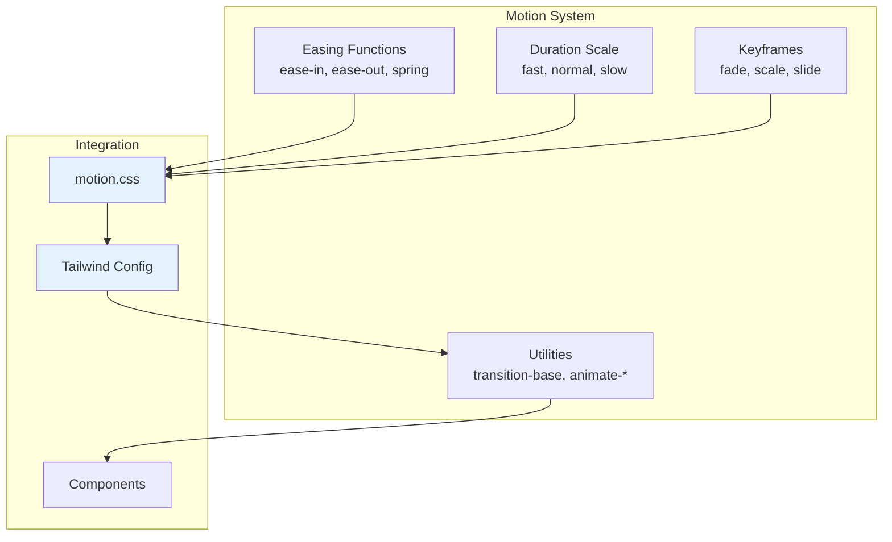

# 02: Animation System

> Comprehensive motion system with easing functions, durations, keyframes, and reduced motion support.

**Duration:** 2 days  
**Dependencies:** [01-design-tokens.md](./01-design-tokens.md)  
**Package:** `packages/ui/`

## Overview

This step creates a comprehensive animation system that provides consistent, physics-based motion across all components. The system includes easing functions, duration scales, animation keyframes, and full support for the `prefers-reduced-motion` media query.



## Motion Principles

```
1. FAST BY DEFAULT
   - Micro-interactions: 100-150ms
   - State changes: 150-200ms
   - Page transitions: 200-300ms
   - Complex animations: 300-400ms max

2. PHYSICS-BASED
   - ease-out for entrances (decelerating)
   - ease-in for exits (accelerating away)
   - ease-in-out for state changes
   - Never use linear (feels robotic)

3. PURPOSEFUL
   - Confirm: "Your action was received"
   - Guide: "Look here next"
   - Connect: "These things are related"
   - Delight: Sparingly, for moments of joy

4. RESPECT PREFERENCES
   - Honor prefers-reduced-motion
   - Provide instant alternatives
```

## Implementation

### 1. Create motion.css

```css
/* packages/ui/src/theme/motion.css */

@layer base {
  :root {
    /* ─── Easing Functions ──────────────────────────────────────── */

    /* Standard easings */
    --ease-in: cubic-bezier(0.4, 0, 1, 1);
    --ease-out: cubic-bezier(0, 0, 0.2, 1);
    --ease-in-out: cubic-bezier(0.4, 0, 0.2, 1);

    /* Spring-like easings for more natural feel */
    --ease-spring: cubic-bezier(0.34, 1.56, 0.64, 1);
    --ease-bounce: cubic-bezier(0.68, -0.55, 0.265, 1.55);

    /* Subtle easing for micro-interactions */
    --ease-subtle: cubic-bezier(0.25, 0.1, 0.25, 1);

    /* ─── Duration Scale ────────────────────────────────────────── */
    --duration-instant: 0ms;
    --duration-fast: 100ms;
    --duration-normal: 150ms;
    --duration-slow: 200ms;
    --duration-slower: 300ms;
    --duration-slowest: 400ms;
  }
}

/* ─── Animation Keyframes ─────────────────────────────────────────── */

@keyframes fade-in {
  from {
    opacity: 0;
  }
  to {
    opacity: 1;
  }
}

@keyframes fade-out {
  from {
    opacity: 1;
  }
  to {
    opacity: 0;
  }
}

@keyframes scale-in {
  from {
    opacity: 0;
    transform: scale(0.95);
  }
  to {
    opacity: 1;
    transform: scale(1);
  }
}

@keyframes scale-out {
  from {
    opacity: 1;
    transform: scale(1);
  }
  to {
    opacity: 0;
    transform: scale(0.95);
  }
}

@keyframes slide-in-bottom {
  from {
    opacity: 0;
    transform: translateY(8px);
  }
  to {
    opacity: 1;
    transform: translateY(0);
  }
}

@keyframes slide-out-bottom {
  from {
    opacity: 1;
    transform: translateY(0);
  }
  to {
    opacity: 0;
    transform: translateY(8px);
  }
}

@keyframes slide-in-top {
  from {
    opacity: 0;
    transform: translateY(-8px);
  }
  to {
    opacity: 1;
    transform: translateY(0);
  }
}

@keyframes slide-out-top {
  from {
    opacity: 1;
    transform: translateY(0);
  }
  to {
    opacity: 0;
    transform: translateY(-8px);
  }
}

@keyframes slide-in-right {
  from {
    opacity: 0;
    transform: translateX(16px);
  }
  to {
    opacity: 1;
    transform: translateX(0);
  }
}

@keyframes slide-out-right {
  from {
    opacity: 1;
    transform: translateX(0);
  }
  to {
    opacity: 0;
    transform: translateX(16px);
  }
}

@keyframes slide-in-left {
  from {
    opacity: 0;
    transform: translateX(-16px);
  }
  to {
    opacity: 1;
    transform: translateX(0);
  }
}

@keyframes slide-out-left {
  from {
    opacity: 1;
    transform: translateX(0);
  }
  to {
    opacity: 0;
    transform: translateX(-16px);
  }
}

@keyframes pulse-subtle {
  0%,
  100% {
    opacity: 1;
  }
  50% {
    opacity: 0.7;
  }
}

@keyframes shimmer {
  0% {
    background-position: -200% 0;
  }
  100% {
    background-position: 200% 0;
  }
}

@keyframes spin {
  from {
    transform: rotate(0deg);
  }
  to {
    transform: rotate(360deg);
  }
}

/* Accordion-specific (for Base UI compatibility) */
@keyframes accordion-down {
  from {
    height: 0;
    opacity: 0;
  }
  to {
    height: var(--accordion-content-height);
    opacity: 1;
  }
}

@keyframes accordion-up {
  from {
    height: var(--accordion-content-height);
    opacity: 1;
  }
  to {
    height: 0;
    opacity: 0;
  }
}

/* Collapsible-specific */
@keyframes collapsible-down {
  from {
    height: 0;
  }
  to {
    height: var(--collapsible-content-height);
  }
}

@keyframes collapsible-up {
  from {
    height: var(--collapsible-content-height);
  }
  to {
    height: 0;
  }
}

/* ─── Transition Utilities ────────────────────────────────────────── */

@layer utilities {
  /* Base transition - use for most interactive elements */
  .transition-base {
    transition-property: color, background-color, border-color, opacity, box-shadow, transform;
    transition-duration: var(--duration-normal);
    transition-timing-function: var(--ease-out);
  }

  /* Fast transitions for micro-interactions */
  .transition-fast {
    transition-duration: var(--duration-fast);
  }

  /* Slow transitions for emphasis */
  .transition-slow {
    transition-duration: var(--duration-slow);
  }

  /* Transform-only transitions (GPU accelerated) */
  .transition-transform {
    transition-property: transform, opacity;
    transition-duration: var(--duration-normal);
    transition-timing-function: var(--ease-out);
  }

  /* Color-only transitions */
  .transition-colors-fast {
    transition-property: color, background-color, border-color;
    transition-duration: var(--duration-fast);
    transition-timing-function: var(--ease-out);
  }
}

/* ─── Reduced Motion Support ──────────────────────────────────────── */

@media (prefers-reduced-motion: reduce) {
  *,
  *::before,
  *::after {
    animation-duration: 0.01ms !important;
    animation-iteration-count: 1 !important;
    transition-duration: 0.01ms !important;
    scroll-behavior: auto !important;
  }
}
```

### 2. Update Tailwind Config

```javascript
// packages/ui/tailwind.config.js

import tailwindcssAnimate from 'tailwindcss-animate'

/** @type {import('tailwindcss').Config} */
export default {
  content: ['./src/**/*.{js,ts,jsx,tsx}'],
  darkMode: 'class',
  theme: {
    extend: {
      // ... existing colors from 01-design-tokens.md

      // ─── Transition Timing Functions ─────────────────────────────
      transitionTimingFunction: {
        'ease-in': 'var(--ease-in)',
        'ease-out': 'var(--ease-out)',
        'ease-in-out': 'var(--ease-in-out)',
        spring: 'var(--ease-spring)',
        bounce: 'var(--ease-bounce)',
        subtle: 'var(--ease-subtle)'
      },

      // ─── Transition Durations ────────────────────────────────────
      transitionDuration: {
        instant: 'var(--duration-instant)',
        fast: 'var(--duration-fast)',
        normal: 'var(--duration-normal)',
        slow: 'var(--duration-slow)',
        slower: 'var(--duration-slower)',
        slowest: 'var(--duration-slowest)'
      },

      // ─── Keyframe Animations ─────────────────────────────────────
      keyframes: {
        'fade-in': {
          from: { opacity: '0' },
          to: { opacity: '1' }
        },
        'fade-out': {
          from: { opacity: '1' },
          to: { opacity: '0' }
        },
        'scale-in': {
          from: { opacity: '0', transform: 'scale(0.95)' },
          to: { opacity: '1', transform: 'scale(1)' }
        },
        'scale-out': {
          from: { opacity: '1', transform: 'scale(1)' },
          to: { opacity: '0', transform: 'scale(0.95)' }
        },
        'slide-in-bottom': {
          from: { opacity: '0', transform: 'translateY(8px)' },
          to: { opacity: '1', transform: 'translateY(0)' }
        },
        'slide-out-bottom': {
          from: { opacity: '1', transform: 'translateY(0)' },
          to: { opacity: '0', transform: 'translateY(8px)' }
        },
        'slide-in-top': {
          from: { opacity: '0', transform: 'translateY(-8px)' },
          to: { opacity: '1', transform: 'translateY(0)' }
        },
        'slide-out-top': {
          from: { opacity: '1', transform: 'translateY(0)' },
          to: { opacity: '0', transform: 'translateY(-8px)' }
        },
        'slide-in-right': {
          from: { opacity: '0', transform: 'translateX(16px)' },
          to: { opacity: '1', transform: 'translateX(0)' }
        },
        'slide-out-right': {
          from: { opacity: '1', transform: 'translateX(0)' },
          to: { opacity: '0', transform: 'translateX(16px)' }
        },
        'slide-in-left': {
          from: { opacity: '0', transform: 'translateX(-16px)' },
          to: { opacity: '1', transform: 'translateX(0)' }
        },
        'slide-out-left': {
          from: { opacity: '1', transform: 'translateX(0)' },
          to: { opacity: '0', transform: 'translateX(-16px)' }
        },
        'pulse-subtle': {
          '0%, 100%': { opacity: '1' },
          '50%': { opacity: '0.7' }
        },
        shimmer: {
          '0%': { backgroundPosition: '-200% 0' },
          '100%': { backgroundPosition: '200% 0' }
        },
        'accordion-down': {
          from: { height: '0', opacity: '0' },
          to: { height: 'var(--accordion-content-height)', opacity: '1' }
        },
        'accordion-up': {
          from: { height: 'var(--accordion-content-height)', opacity: '1' },
          to: { height: '0', opacity: '0' }
        },
        'collapsible-down': {
          from: { height: '0' },
          to: { height: 'var(--collapsible-content-height)' }
        },
        'collapsible-up': {
          from: { height: 'var(--collapsible-content-height)' },
          to: { height: '0' }
        }
      },

      // ─── Animation Utilities ─────────────────────────────────────
      animation: {
        'fade-in': 'fade-in var(--duration-normal) var(--ease-out)',
        'fade-out': 'fade-out var(--duration-fast) var(--ease-in)',
        'scale-in': 'scale-in var(--duration-normal) var(--ease-out)',
        'scale-out': 'scale-out var(--duration-fast) var(--ease-in)',
        'slide-in-bottom': 'slide-in-bottom var(--duration-slow) var(--ease-out)',
        'slide-out-bottom': 'slide-out-bottom var(--duration-normal) var(--ease-in)',
        'slide-in-top': 'slide-in-top var(--duration-slow) var(--ease-out)',
        'slide-out-top': 'slide-out-top var(--duration-normal) var(--ease-in)',
        'slide-in-right': 'slide-in-right var(--duration-slow) var(--ease-out)',
        'slide-out-right': 'slide-out-right var(--duration-normal) var(--ease-in)',
        'slide-in-left': 'slide-in-left var(--duration-slow) var(--ease-out)',
        'slide-out-left': 'slide-out-left var(--duration-normal) var(--ease-in)',
        'pulse-subtle': 'pulse-subtle 2s var(--ease-in-out) infinite',
        shimmer: 'shimmer 1.5s linear infinite',
        'accordion-down': 'accordion-down var(--duration-slow) var(--ease-out)',
        'accordion-up': 'accordion-up var(--duration-normal) var(--ease-in)',
        'collapsible-down': 'collapsible-down var(--duration-slow) var(--ease-out)',
        'collapsible-up': 'collapsible-up var(--duration-normal) var(--ease-in)',
        spin: 'spin 1s linear infinite'
      }
    }
  },
  plugins: [tailwindcssAnimate]
}
```

### 3. Base UI Animation Integration

Base UI provides data attributes for animation states that we can hook into:

```css
/* packages/ui/src/theme/base-ui-animations.css */

/* ─── Dialog/Modal Animations ─────────────────────────────────────── */

.dialog-backdrop {
  opacity: 0;
  transition: opacity var(--duration-normal) var(--ease-out);
}

.dialog-backdrop[data-open] {
  opacity: 1;
}

.dialog-backdrop[data-ending] {
  opacity: 0;
  transition: opacity var(--duration-fast) var(--ease-in);
}

.dialog-popup {
  opacity: 0;
  transform: scale(0.95);
  transition:
    opacity var(--duration-normal) var(--ease-out),
    transform var(--duration-normal) var(--ease-out);
}

.dialog-popup[data-open] {
  opacity: 1;
  transform: scale(1);
}

.dialog-popup[data-ending] {
  opacity: 0;
  transform: scale(0.95);
  transition:
    opacity var(--duration-fast) var(--ease-in),
    transform var(--duration-fast) var(--ease-in);
}

/* ─── Popover/Tooltip Animations ──────────────────────────────────── */

.popover-popup,
.tooltip-popup {
  opacity: 0;
  transform: translateY(4px);
  transition:
    opacity var(--duration-fast) var(--ease-out),
    transform var(--duration-fast) var(--ease-out);
}

.popover-popup[data-open],
.tooltip-popup[data-open] {
  opacity: 1;
  transform: translateY(0);
}

.popover-popup[data-ending],
.tooltip-popup[data-ending] {
  opacity: 0;
  transform: translateY(4px);
  transition:
    opacity var(--duration-fast) var(--ease-in),
    transform var(--duration-fast) var(--ease-in);
}

/* Position-aware animations */
.popover-popup[data-side='top'],
.tooltip-popup[data-side='top'] {
  transform: translateY(-4px);
}

.popover-popup[data-side='top'][data-open],
.tooltip-popup[data-side='top'][data-open] {
  transform: translateY(0);
}

/* ─── Menu Animations ─────────────────────────────────────────────── */

.menu-popup {
  opacity: 0;
  transform: scale(0.95);
  transform-origin: top left;
  transition:
    opacity var(--duration-fast) var(--ease-out),
    transform var(--duration-fast) var(--ease-out);
}

.menu-popup[data-open] {
  opacity: 1;
  transform: scale(1);
}

.menu-popup[data-ending] {
  opacity: 0;
  transform: scale(0.95);
}

/* ─── Select Animations ───────────────────────────────────────────── */

.select-popup {
  opacity: 0;
  transform: translateY(-4px);
  transition:
    opacity var(--duration-fast) var(--ease-out),
    transform var(--duration-fast) var(--ease-out);
}

.select-popup[data-open] {
  opacity: 1;
  transform: translateY(0);
}

.select-popup[data-ending] {
  opacity: 0;
  transform: translateY(-4px);
}

/* ─── Accordion Animations ────────────────────────────────────────── */

.accordion-panel {
  overflow: hidden;
}

.accordion-panel[data-open] {
  animation: accordion-down var(--duration-slow) var(--ease-out);
}

.accordion-panel[data-ending] {
  animation: accordion-up var(--duration-normal) var(--ease-in);
}

/* ─── Collapsible Animations ──────────────────────────────────────── */

.collapsible-panel {
  overflow: hidden;
}

.collapsible-panel[data-open] {
  animation: collapsible-down var(--duration-slow) var(--ease-out);
}

.collapsible-panel[data-ending] {
  animation: collapsible-up var(--duration-normal) var(--ease-in);
}

/* ─── Switch Animations ───────────────────────────────────────────── */

.switch-thumb {
  transition: transform var(--duration-fast) var(--ease-spring);
}

.switch-root[data-checked] .switch-thumb {
  transform: translateX(100%);
}

/* ─── Checkbox Animations ─────────────────────────────────────────── */

.checkbox-indicator {
  opacity: 0;
  transform: scale(0.8);
  transition:
    opacity var(--duration-fast) var(--ease-out),
    transform var(--duration-fast) var(--ease-spring);
}

.checkbox-root[data-checked] .checkbox-indicator {
  opacity: 1;
  transform: scale(1);
}

/* ─── Reduced Motion ──────────────────────────────────────────────── */

@media (prefers-reduced-motion: reduce) {
  .dialog-backdrop,
  .dialog-popup,
  .popover-popup,
  .tooltip-popup,
  .menu-popup,
  .select-popup,
  .switch-thumb,
  .checkbox-indicator {
    transition: none !important;
    animation: none !important;
  }

  /* Instant state changes */
  .dialog-popup[data-open],
  .popover-popup[data-open],
  .tooltip-popup[data-open],
  .menu-popup[data-open],
  .select-popup[data-open] {
    opacity: 1;
    transform: none;
  }
}
```

## Usage Examples

### Button with Transition

```tsx
<Button className="transition-base hover:bg-primary-hover active:bg-primary-active">
  Click me
</Button>
```

### Card with Hover Animation

```tsx
<Card className="transition-base hover:shadow-md hover:border-border-emphasis">Content</Card>
```

### Modal with Scale Animation

```tsx
// Using Base UI data attributes
<Dialog.Popup className="dialog-popup">
  {/* Automatically animates based on [data-open] and [data-ending] */}
</Dialog.Popup>
```

### Skeleton with Shimmer

```tsx
<div className="animate-shimmer bg-gradient-to-r from-background-muted via-background to-background-muted bg-[length:200%_100%]">
  Loading...
</div>
```

### Accordion with Height Animation

```tsx
<Accordion.Panel className="accordion-panel">
  {/* Automatically animates based on [data-open] and [data-ending] */}
</Accordion.Panel>
```

## Tests

```typescript
// packages/ui/src/theme/motion.test.ts

import { describe, it, expect } from 'vitest'

describe('Motion System', () => {
  describe('CSS Variables', () => {
    it('defines easing functions', () => {
      const style = getComputedStyle(document.documentElement)
      expect(style.getPropertyValue('--ease-in')).toBeTruthy()
      expect(style.getPropertyValue('--ease-out')).toBeTruthy()
      expect(style.getPropertyValue('--ease-in-out')).toBeTruthy()
      expect(style.getPropertyValue('--ease-spring')).toBeTruthy()
    })

    it('defines duration scale', () => {
      const style = getComputedStyle(document.documentElement)
      expect(style.getPropertyValue('--duration-fast')).toBe('100ms')
      expect(style.getPropertyValue('--duration-normal')).toBe('150ms')
      expect(style.getPropertyValue('--duration-slow')).toBe('200ms')
    })
  })

  describe('Reduced Motion', () => {
    it('respects prefers-reduced-motion', () => {
      // This would need to be tested with a media query mock
      // The CSS should disable animations when reduced motion is preferred
    })
  })

  describe('Animation Classes', () => {
    it('provides transition-base utility', () => {
      const el = document.createElement('div')
      el.className = 'transition-base'
      document.body.appendChild(el)

      const style = getComputedStyle(el)
      expect(style.transitionProperty).toContain('color')
      expect(style.transitionProperty).toContain('background-color')

      document.body.removeChild(el)
    })
  })
})
```

## Checklist

- [ ] Create `motion.css` with easing functions
- [ ] Add duration scale variables
- [ ] Create animation keyframes (fade, scale, slide)
- [ ] Add transition utility classes
- [ ] Add reduced motion support
- [ ] Update Tailwind config with animations
- [ ] Create Base UI animation integration CSS
- [ ] Add accordion/collapsible animations
- [ ] Add dialog/modal animations
- [ ] Add popover/tooltip animations
- [ ] Add menu/select animations
- [ ] Add switch/checkbox animations
- [ ] Write unit tests
- [ ] Verify 60fps performance
- [ ] Test reduced motion preference

---

[Back to README](./README.md) | [Previous: Design Tokens](./01-design-tokens.md) | [Next: Tailwind Config ->](./03-tailwind-config.md)
