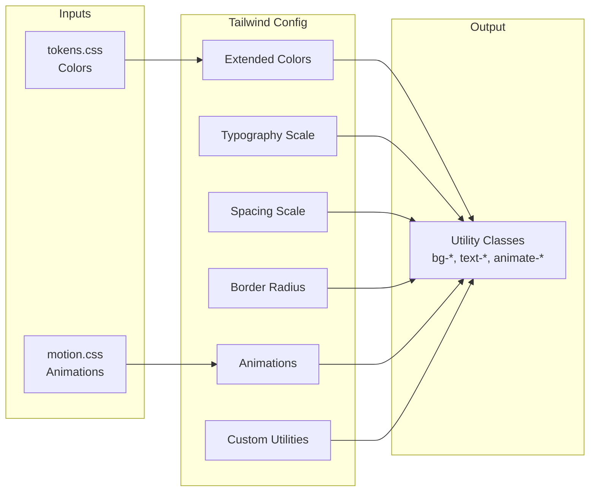

# 03: Tailwind Configuration

> Extended Tailwind theme with typography, spacing, and component-specific utilities.

**Duration:** 1 day  
**Dependencies:** [01-design-tokens.md](./01-design-tokens.md), [02-animation-system.md](./02-animation-system.md)  
**Package:** `packages/ui/`

## Overview

This step consolidates all Tailwind configuration updates from the previous steps and adds typography scale, spacing refinements, and component-specific utilities. The goal is a single, comprehensive Tailwind config that serves as the foundation for all xNet applications.



## Implementation

### Complete Tailwind Config

```javascript
// packages/ui/tailwind.config.js

import tailwindcssAnimate from 'tailwindcss-animate'

/** @type {import('tailwindcss').Config} */
export default {
  content: ['./src/**/*.{js,ts,jsx,tsx}'],
  darkMode: 'class',
  theme: {
    extend: {
      // ─── Colors ──────────────────────────────────────────────────
      colors: {
        // Background variants
        background: {
          DEFAULT: 'hsl(var(--background))',
          subtle: 'hsl(var(--background-subtle))',
          muted: 'hsl(var(--background-muted))',
          emphasis: 'hsl(var(--background-emphasis))'
        },

        // Foreground variants
        foreground: {
          DEFAULT: 'hsl(var(--foreground))',
          muted: 'hsl(var(--foreground-muted))',
          subtle: 'hsl(var(--foreground-subtle))',
          faint: 'hsl(var(--foreground-faint))'
        },

        // Border variants
        border: {
          DEFAULT: 'hsl(var(--border))',
          muted: 'hsl(var(--border-muted))',
          emphasis: 'hsl(var(--border-emphasis))'
        },

        // Primary with states
        primary: {
          DEFAULT: 'hsl(var(--primary))',
          hover: 'hsl(var(--primary-hover))',
          active: 'hsl(var(--primary-active))',
          muted: 'hsl(var(--primary-muted))',
          foreground: 'hsl(var(--primary-foreground))'
        },

        // Secondary (backward compat)
        secondary: {
          DEFAULT: 'hsl(var(--secondary))',
          foreground: 'hsl(var(--secondary-foreground))'
        },

        // Muted (backward compat)
        muted: {
          DEFAULT: 'hsl(var(--muted))',
          foreground: 'hsl(var(--muted-foreground))'
        },

        // Accent (backward compat)
        accent: {
          DEFAULT: 'hsl(var(--accent))',
          foreground: 'hsl(var(--accent-foreground))'
        },

        // Semantic: Destructive
        destructive: {
          DEFAULT: 'hsl(var(--destructive))',
          hover: 'hsl(var(--destructive-hover))',
          active: 'hsl(var(--destructive-active))',
          muted: 'hsl(var(--destructive-muted))',
          foreground: 'hsl(var(--destructive-foreground))'
        },

        // Semantic: Success
        success: {
          DEFAULT: 'hsl(var(--success))',
          hover: 'hsl(var(--success-hover))',
          active: 'hsl(var(--success-active))',
          muted: 'hsl(var(--success-muted))',
          foreground: 'hsl(var(--success-foreground))'
        },

        // Semantic: Warning
        warning: {
          DEFAULT: 'hsl(var(--warning))',
          hover: 'hsl(var(--warning-hover))',
          active: 'hsl(var(--warning-active))',
          muted: 'hsl(var(--warning-muted))',
          foreground: 'hsl(var(--warning-foreground))'
        },

        // Input & Ring
        input: 'hsl(var(--input))',
        ring: 'hsl(var(--ring))',

        // Card (backward compat)
        card: {
          DEFAULT: 'hsl(var(--card))',
          foreground: 'hsl(var(--card-foreground))'
        },

        // Popover (backward compat)
        popover: {
          DEFAULT: 'hsl(var(--popover))',
          foreground: 'hsl(var(--popover-foreground))'
        },

        // Sidebar
        sidebar: {
          DEFAULT: 'hsl(var(--sidebar-background))',
          foreground: 'hsl(var(--sidebar-foreground))',
          border: 'hsl(var(--sidebar-border))',
          accent: 'hsl(var(--sidebar-accent))',
          'accent-foreground': 'hsl(var(--sidebar-accent-foreground))'
        },

        // Chart colors
        chart: {
          1: 'hsl(var(--chart-1))',
          2: 'hsl(var(--chart-2))',
          3: 'hsl(var(--chart-3))',
          4: 'hsl(var(--chart-4))',
          5: 'hsl(var(--chart-5))'
        }
      },

      // ─── Typography ──────────────────────────────────────────────
      fontFamily: {
        sans: [
          'ui-sans-serif',
          'system-ui',
          '-apple-system',
          'BlinkMacSystemFont',
          '"Segoe UI"',
          'Roboto',
          '"Helvetica Neue"',
          'Arial',
          'sans-serif'
        ],
        mono: [
          'ui-monospace',
          'SFMono-Regular',
          '"SF Mono"',
          'Menlo',
          'Monaco',
          'Consolas',
          '"Liberation Mono"',
          '"Courier New"',
          'monospace'
        ]
      },

      fontSize: {
        // Custom scale based on 1.25 ratio (major third)
        xs: ['0.6875rem', { lineHeight: '1.5' }], // 11px
        sm: ['0.8125rem', { lineHeight: '1.5' }], // 13px
        base: ['0.9375rem', { lineHeight: '1.6' }], // 15px
        lg: ['1.0625rem', { lineHeight: '1.5' }], // 17px
        xl: ['1.25rem', { lineHeight: '1.4' }], // 20px
        '2xl': ['1.5rem', { lineHeight: '1.3' }], // 24px
        '3xl': ['1.875rem', { lineHeight: '1.2' }] // 30px
      },

      // ─── Spacing ─────────────────────────────────────────────────
      spacing: {
        // Keep default Tailwind scale, add custom values
        0.5: '2px',
        1: '4px',
        1.5: '6px',
        2: '8px',
        2.5: '10px',
        3: '12px',
        4: '16px',
        5: '20px',
        6: '24px',
        8: '32px',
        10: '40px',
        12: '48px',
        16: '64px',
        20: '80px',
        24: '96px'
      },

      // ─── Border Radius ───────────────────────────────────────────
      borderRadius: {
        none: '0',
        sm: 'var(--radius-sm)', // 4px
        DEFAULT: 'var(--radius)', // 8px
        md: 'var(--radius-md)', // 6px
        lg: 'var(--radius-lg)', // 8px
        xl: 'var(--radius-xl)', // 12px
        full: 'var(--radius-full)' // 9999px
      },

      // ─── Box Shadow ──────────────────────────────────────────────
      boxShadow: {
        sm: '0 1px 2px 0 rgb(0 0 0 / 0.05)',
        DEFAULT: '0 1px 3px 0 rgb(0 0 0 / 0.1), 0 1px 2px -1px rgb(0 0 0 / 0.1)',
        md: '0 4px 6px -1px rgb(0 0 0 / 0.1), 0 2px 4px -2px rgb(0 0 0 / 0.1)',
        lg: '0 10px 15px -3px rgb(0 0 0 / 0.1), 0 4px 6px -4px rgb(0 0 0 / 0.1)',
        xl: '0 20px 25px -5px rgb(0 0 0 / 0.1), 0 8px 10px -6px rgb(0 0 0 / 0.1)',
        inner: 'inset 0 2px 4px 0 rgb(0 0 0 / 0.05)',
        none: 'none'
      },

      // ─── Transition Timing Functions ─────────────────────────────
      transitionTimingFunction: {
        'ease-in': 'var(--ease-in)',
        'ease-out': 'var(--ease-out)',
        'ease-in-out': 'var(--ease-in-out)',
        spring: 'var(--ease-spring)',
        bounce: 'var(--ease-bounce)',
        subtle: 'var(--ease-subtle)'
      },

      // ─── Transition Durations ────────────────────────────────────
      transitionDuration: {
        instant: 'var(--duration-instant)',
        fast: 'var(--duration-fast)',
        normal: 'var(--duration-normal)',
        slow: 'var(--duration-slow)',
        slower: 'var(--duration-slower)',
        slowest: 'var(--duration-slowest)'
      },

      // ─── Keyframes ───────────────────────────────────────────────
      keyframes: {
        'fade-in': {
          from: { opacity: '0' },
          to: { opacity: '1' }
        },
        'fade-out': {
          from: { opacity: '1' },
          to: { opacity: '0' }
        },
        'scale-in': {
          from: { opacity: '0', transform: 'scale(0.95)' },
          to: { opacity: '1', transform: 'scale(1)' }
        },
        'scale-out': {
          from: { opacity: '1', transform: 'scale(1)' },
          to: { opacity: '0', transform: 'scale(0.95)' }
        },
        'slide-in-bottom': {
          from: { opacity: '0', transform: 'translateY(8px)' },
          to: { opacity: '1', transform: 'translateY(0)' }
        },
        'slide-out-bottom': {
          from: { opacity: '1', transform: 'translateY(0)' },
          to: { opacity: '0', transform: 'translateY(8px)' }
        },
        'slide-in-top': {
          from: { opacity: '0', transform: 'translateY(-8px)' },
          to: { opacity: '1', transform: 'translateY(0)' }
        },
        'slide-out-top': {
          from: { opacity: '1', transform: 'translateY(0)' },
          to: { opacity: '0', transform: 'translateY(-8px)' }
        },
        'slide-in-right': {
          from: { opacity: '0', transform: 'translateX(16px)' },
          to: { opacity: '1', transform: 'translateX(0)' }
        },
        'slide-out-right': {
          from: { opacity: '1', transform: 'translateX(0)' },
          to: { opacity: '0', transform: 'translateX(16px)' }
        },
        'slide-in-left': {
          from: { opacity: '0', transform: 'translateX(-16px)' },
          to: { opacity: '1', transform: 'translateX(0)' }
        },
        'slide-out-left': {
          from: { opacity: '1', transform: 'translateX(0)' },
          to: { opacity: '0', transform: 'translateX(-16px)' }
        },
        'pulse-subtle': {
          '0%, 100%': { opacity: '1' },
          '50%': { opacity: '0.7' }
        },
        shimmer: {
          '0%': { backgroundPosition: '-200% 0' },
          '100%': { backgroundPosition: '200% 0' }
        },
        'accordion-down': {
          from: { height: '0', opacity: '0' },
          to: { height: 'var(--accordion-content-height)', opacity: '1' }
        },
        'accordion-up': {
          from: { height: 'var(--accordion-content-height)', opacity: '1' },
          to: { height: '0', opacity: '0' }
        },
        'collapsible-down': {
          from: { height: '0' },
          to: { height: 'var(--collapsible-content-height)' }
        },
        'collapsible-up': {
          from: { height: 'var(--collapsible-content-height)' },
          to: { height: '0' }
        }
      },

      // ─── Animations ──────────────────────────────────────────────
      animation: {
        'fade-in': 'fade-in var(--duration-normal) var(--ease-out)',
        'fade-out': 'fade-out var(--duration-fast) var(--ease-in)',
        'scale-in': 'scale-in var(--duration-normal) var(--ease-out)',
        'scale-out': 'scale-out var(--duration-fast) var(--ease-in)',
        'slide-in-bottom': 'slide-in-bottom var(--duration-slow) var(--ease-out)',
        'slide-out-bottom': 'slide-out-bottom var(--duration-normal) var(--ease-in)',
        'slide-in-top': 'slide-in-top var(--duration-slow) var(--ease-out)',
        'slide-out-top': 'slide-out-top var(--duration-normal) var(--ease-in)',
        'slide-in-right': 'slide-in-right var(--duration-slow) var(--ease-out)',
        'slide-out-right': 'slide-out-right var(--duration-normal) var(--ease-in)',
        'slide-in-left': 'slide-in-left var(--duration-slow) var(--ease-out)',
        'slide-out-left': 'slide-out-left var(--duration-normal) var(--ease-in)',
        'pulse-subtle': 'pulse-subtle 2s var(--ease-in-out) infinite',
        shimmer: 'shimmer 1.5s linear infinite',
        'accordion-down': 'accordion-down var(--duration-slow) var(--ease-out)',
        'accordion-up': 'accordion-up var(--duration-normal) var(--ease-in)',
        'collapsible-down': 'collapsible-down var(--duration-slow) var(--ease-out)',
        'collapsible-up': 'collapsible-up var(--duration-normal) var(--ease-in)',
        spin: 'spin 1s linear infinite'
      },

      // ─── Container ───────────────────────────────────────────────
      container: {
        center: true,
        padding: {
          DEFAULT: '1rem',
          sm: '1.5rem',
          lg: '2rem'
        },
        screens: {
          sm: '640px',
          md: '768px',
          lg: '1024px',
          xl: '1280px'
        }
      }
    }
  },
  plugins: [tailwindcssAnimate]
}
```

### Export from Package

```javascript
// packages/ui/tailwind.config.js is already the main export

// Ensure package.json exports it:
// "exports": {
//   "./tailwind.config": "./tailwind.config.js"
// }
```

### App-Level Usage

```javascript
// apps/electron/tailwind.config.js

import baseConfig from '@xnetjs/ui/tailwind.config'

/** @type {import('tailwindcss').Config} */
export default {
  ...baseConfig,
  content: [
    './src/**/*.{js,ts,jsx,tsx}',
    '../../packages/ui/src/**/*.{js,ts,jsx,tsx}',
    '../../packages/editor/src/**/*.{js,ts,jsx,tsx}',
    '../../packages/canvas/src/**/*.{js,ts,jsx,tsx}',
    '../../packages/devtools/src/**/*.{js,ts,jsx,tsx}'
  ]
}
```

## Typography Usage

```tsx
// Heading hierarchy
<h1 className="text-3xl font-bold text-foreground">Hero</h1>
<h2 className="text-2xl font-semibold text-foreground">Page Title</h2>
<h3 className="text-xl font-semibold text-foreground">Section</h3>
<h4 className="text-lg font-medium text-foreground">Subsection</h4>

// Body text
<p className="text-base text-foreground">Primary body text</p>
<p className="text-sm text-foreground-muted">Secondary text</p>
<span className="text-xs text-foreground-subtle">Caption</span>

// Max line length for readability
<article className="max-w-prose">
  <p>Long form content should be constrained to 65-75 characters...</p>
</article>
```

## Spacing Usage

```tsx
// Related items: 4-8px
<div className="flex gap-1">
  <Icon />
  <span>Label</span>
</div>

// Grouped items: 12-16px
<div className="flex flex-col gap-3">
  <ListItem />
  <ListItem />
</div>

// Sections: 24-32px
<section className="space-y-6">
  <SectionA />
  <SectionB />
</section>

// Major sections: 48-64px
<main className="space-y-12">
  <Hero />
  <Features />
</main>
```

## Checklist

- [x] Consolidate all color definitions
- [x] Add typography scale
- [x] Add spacing scale
- [x] Add border radius scale
- [x] Add box shadow scale
- [x] Add transition utilities
- [x] Add animation utilities
- [x] Add container configuration
- [x] Export config from package
- [x] Update app-level configs to extend base
- [x] Verify all utilities work
- [x] Test in Electron app
- [x] No visual regressions

---

[Back to README](./README.md) | [Previous: Animation System](./02-animation-system.md) | [Next: Base UI Setup ->](./04-base-ui-setup.md)
