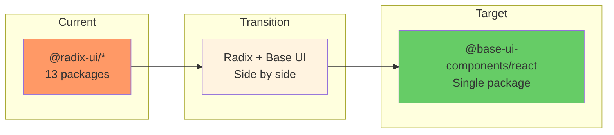

# 04: Base UI Setup

> Install and configure Base UI alongside Radix for incremental migration.

**Duration:** 1 day  
**Dependencies:** [03-tailwind-config.md](./03-tailwind-config.md)  
**Package:** `packages/ui/`

## Overview

This step installs Base UI and sets up the foundation for incremental migration from Radix UI. We'll run both libraries side-by-side during the migration, allowing us to migrate components one at a time without breaking the application.



## Why Base UI?

| Factor          | Radix UI                              | Base UI                                  |
| --------------- | ------------------------------------- | ---------------------------------------- |
| **Maintenance** | Near-zero commits, 600+ open issues   | Active development, MUI-backed           |
| **Animation**   | Basic, manual state tracking          | Built-in transition data attributes      |
| **API**         | `asChild` + deprecated `cloneElement` | Modern `render` prop pattern             |
| **React 19**    | Partial support                       | Full support                             |
| **Team**        | Original team left                    | Radix co-creator (Colm Tuite) now at MUI |

## Implementation

### 1. Install Base UI

```bash
# In packages/ui
pnpm add @base-ui-components/react
```

### 2. Update package.json

```json
{
  "name": "@xnet/ui",
  "dependencies": {
    // Existing Radix packages (will be removed incrementally)
    "@radix-ui/react-accordion": "^1.2.12",
    "@radix-ui/react-checkbox": "^1.1.4",
    "@radix-ui/react-collapsible": "^1.1.12",
    "@radix-ui/react-dialog": "^1.1.6",
    "@radix-ui/react-dropdown-menu": "^2.1.6",
    "@radix-ui/react-popover": "^1.1.6",
    "@radix-ui/react-scroll-area": "^1.2.10",
    "@radix-ui/react-select": "^2.1.6",
    "@radix-ui/react-separator": "^1.1.8",
    "@radix-ui/react-slot": "^1.1.2",
    "@radix-ui/react-switch": "^1.2.6",
    "@radix-ui/react-tabs": "^1.1.13",
    "@radix-ui/react-tooltip": "^1.1.8",

    // New Base UI (single package)
    "@base-ui-components/react": "^1.0.0",

    // Keep existing utilities
    "class-variance-authority": "^0.7.1",
    "clsx": "^2.1.0",
    "cmdk": "^1.1.1",
    "lucide-react": "^0.400.0",
    "tailwind-merge": "^2.6.0",
    "tailwindcss-animate": "^1.0.7"
  }
}
```

### 3. Create Base UI Wrapper Module

```typescript
// packages/ui/src/base-ui/index.ts

/**
 * Base UI component re-exports with xNet styling conventions.
 *
 * This module provides a consistent API for Base UI components,
 * applying our design tokens and animation system.
 */

// Re-export all Base UI components
export * from '@base-ui-components/react/accordion'
export * from '@base-ui-components/react/checkbox'
export * from '@base-ui-components/react/collapsible'
export * from '@base-ui-components/react/dialog'
export * from '@base-ui-components/react/menu'
export * from '@base-ui-components/react/popover'
export * from '@base-ui-components/react/scroll-area'
export * from '@base-ui-components/react/select'
export * from '@base-ui-components/react/switch'
export * from '@base-ui-components/react/tabs'
export * from '@base-ui-components/react/tooltip'
```

### 4. API Comparison Reference

Create a reference file for migration:

````typescript
// packages/ui/src/base-ui/MIGRATION_GUIDE.md

/**
 * # Radix → Base UI Migration Guide
 *
 * ## Key API Differences
 *
 * ### Composition Pattern
 *
 * Radix uses `asChild`:
 * ```tsx
 * <Dialog.Trigger asChild>
 *   <Button>Open</Button>
 * </Dialog.Trigger>
 * ```
 *
 * Base UI uses `render`:
 * ```tsx
 * <Dialog.Trigger render={<Button />}>
 *   Open
 * </Dialog.Trigger>
 * ```
 *
 * ### Naming Changes
 *
 * | Radix              | Base UI           |
 * | ------------------ | ----------------- |
 * | Dialog.Content     | Dialog.Popup      |
 * | Dialog.Overlay     | Dialog.Backdrop   |
 * | DropdownMenu       | Menu              |
 * | Select.Content     | Select.Popup      |
 * | Popover.Content    | Popover.Popup     |
 * | Tooltip.Content    | Tooltip.Popup     |
 *
 * ### Animation Data Attributes
 *
 * Base UI provides these automatically:
 * - [data-open] - Element is open
 * - [data-closed] - Element is closed
 * - [data-starting] - Element is entering
 * - [data-ending] - Element is exiting
 *
 * Use in CSS:
 * ```css
 * .dialog-popup[data-starting] {
 *   animation: scale-in 150ms ease-out;
 * }
 * .dialog-popup[data-ending] {
 *   animation: fade-out 100ms ease-in;
 * }
 * ```
 */
````

### 5. Verify Installation

```typescript
// packages/ui/src/base-ui/base-ui.test.ts

import { describe, it, expect } from 'vitest'

describe('Base UI Installation', () => {
  it('can import Accordion', async () => {
    const { Accordion } = await import('@base-ui-components/react/accordion')
    expect(Accordion.Root).toBeDefined()
    expect(Accordion.Item).toBeDefined()
    expect(Accordion.Header).toBeDefined()
    expect(Accordion.Trigger).toBeDefined()
    expect(Accordion.Panel).toBeDefined()
  })

  it('can import Checkbox', async () => {
    const { Checkbox } = await import('@base-ui-components/react/checkbox')
    expect(Checkbox.Root).toBeDefined()
    expect(Checkbox.Indicator).toBeDefined()
  })

  it('can import Dialog', async () => {
    const { Dialog } = await import('@base-ui-components/react/dialog')
    expect(Dialog.Root).toBeDefined()
    expect(Dialog.Trigger).toBeDefined()
    expect(Dialog.Portal).toBeDefined()
    expect(Dialog.Backdrop).toBeDefined()
    expect(Dialog.Popup).toBeDefined()
    expect(Dialog.Title).toBeDefined()
    expect(Dialog.Description).toBeDefined()
    expect(Dialog.Close).toBeDefined()
  })

  it('can import Menu', async () => {
    const { Menu } = await import('@base-ui-components/react/menu')
    expect(Menu.Root).toBeDefined()
    expect(Menu.Trigger).toBeDefined()
    expect(Menu.Portal).toBeDefined()
    expect(Menu.Popup).toBeDefined()
    expect(Menu.Item).toBeDefined()
  })

  it('can import Popover', async () => {
    const { Popover } = await import('@base-ui-components/react/popover')
    expect(Popover.Root).toBeDefined()
    expect(Popover.Trigger).toBeDefined()
    expect(Popover.Portal).toBeDefined()
    expect(Popover.Popup).toBeDefined()
  })

  it('can import Select', async () => {
    const { Select } = await import('@base-ui-components/react/select')
    expect(Select.Root).toBeDefined()
    expect(Select.Trigger).toBeDefined()
    expect(Select.Portal).toBeDefined()
    expect(Select.Popup).toBeDefined()
    expect(Select.Option).toBeDefined()
  })

  it('can import Switch', async () => {
    const { Switch } = await import('@base-ui-components/react/switch')
    expect(Switch.Root).toBeDefined()
    expect(Switch.Thumb).toBeDefined()
  })

  it('can import Tabs', async () => {
    const { Tabs } = await import('@base-ui-components/react/tabs')
    expect(Tabs.Root).toBeDefined()
    expect(Tabs.List).toBeDefined()
    expect(Tabs.Tab).toBeDefined()
    expect(Tabs.Panel).toBeDefined()
  })

  it('can import Tooltip', async () => {
    const { Tooltip } = await import('@base-ui-components/react/tooltip')
    expect(Tooltip.Root).toBeDefined()
    expect(Tooltip.Trigger).toBeDefined()
    expect(Tooltip.Portal).toBeDefined()
    expect(Tooltip.Popup).toBeDefined()
  })
})
```

### 6. Migration Tracking

Create a tracking file:

```typescript
// packages/ui/src/MIGRATION_STATUS.md

/**
 * # Radix → Base UI Migration Status
 *
 * ## Phase 2: Simple Components
 * - [ ] Separator → native <hr>
 * - [ ] Switch
 * - [ ] Checkbox
 * - [ ] Tabs
 * - [ ] Button (no Radix, just styling)
 * - [ ] Input (no Radix, just styling)
 *
 * ## Phase 3: Medium Components
 * - [ ] Accordion
 * - [ ] Collapsible
 * - [ ] Tooltip
 * - [ ] Popover
 * - [ ] ScrollArea
 * - [ ] Skeleton (new)
 *
 * ## Phase 4: Complex Components
 * - [ ] Dialog/Modal
 * - [ ] Sheet
 * - [ ] Select
 * - [ ] Menu (DropdownMenu)
 * - [ ] Command (cmdk) - evaluate
 *
 * ## Radix Packages to Remove (after migration)
 * - @radix-ui/react-accordion
 * - @radix-ui/react-checkbox
 * - @radix-ui/react-collapsible
 * - @radix-ui/react-dialog
 * - @radix-ui/react-dropdown-menu
 * - @radix-ui/react-popover
 * - @radix-ui/react-scroll-area
 * - @radix-ui/react-select
 * - @radix-ui/react-separator
 * - @radix-ui/react-slot
 * - @radix-ui/react-switch
 * - @radix-ui/react-tabs
 * - @radix-ui/react-tooltip
 */
```

## Base UI Animation Integration

Base UI provides data attributes that we can use for CSS animations:

```css
/* Already defined in 02-animation-system.md */

/* Dialog animations */
.dialog-popup[data-starting] {
  animation: scale-in var(--duration-normal) var(--ease-out);
}

.dialog-popup[data-ending] {
  animation: fade-out var(--duration-fast) var(--ease-in);
}

/* Popover/Tooltip animations */
.popover-popup[data-starting],
.tooltip-popup[data-starting] {
  animation: fade-in var(--duration-fast) var(--ease-out);
}

.popover-popup[data-ending],
.tooltip-popup[data-ending] {
  animation: fade-out var(--duration-fast) var(--ease-in);
}
```

## Checklist

- [x] Install `@base-ui-components/react`
- [x] Update package.json with new dependency
- [x] Create base-ui wrapper module
- [x] Create migration guide reference
- [x] Write installation verification tests
- [x] Create migration status tracking file
- [x] Verify Base UI works alongside Radix
- [x] Run existing tests (no regressions)
- [x] Build package successfully

---

[Back to README](./README.md) | [Previous: Tailwind Config](./03-tailwind-config.md) | [Next: Simple Components ->](./05-simple-components.md)
