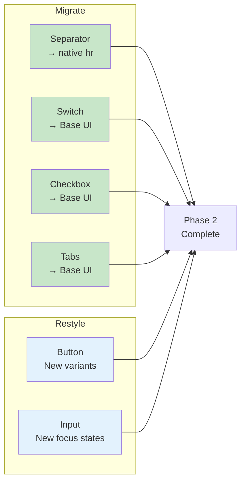

# 05: Simple Components Migration

> Migrate low-risk components: Separator, Switch, Checkbox, Tabs, Button, Input.

**Duration:** 4 days  
**Dependencies:** [04-base-ui-setup.md](./04-base-ui-setup.md)  
**Package:** `packages/ui/`

## Overview

This step migrates the simplest components from Radix to Base UI. These components have similar APIs and low migration risk. We also update Button and Input with the new styling system (they don't use Radix).



## Implementation

### 1. Separator → Native `<hr>`

The Separator component can be replaced with a native `<hr>` element:

```tsx
// packages/ui/src/primitives/Separator.tsx

import * as React from 'react'
import { cn } from '../utils/cn'

export interface SeparatorProps extends React.HTMLAttributes<HTMLHRElement> {
  orientation?: 'horizontal' | 'vertical'
  decorative?: boolean
}

const Separator = React.forwardRef<HTMLHRElement, SeparatorProps>(
  ({ className, orientation = 'horizontal', decorative = true, ...props }, ref) => (
    <hr
      ref={ref}
      role={decorative ? 'none' : 'separator'}
      aria-orientation={orientation}
      className={cn(
        'shrink-0 border-none bg-border',
        orientation === 'horizontal' ? 'h-px w-full' : 'h-full w-px',
        className
      )}
      {...props}
    />
  )
)
Separator.displayName = 'Separator'

export { Separator }
```

### 2. Switch → Base UI

```tsx
// packages/ui/src/primitives/Switch.tsx

import * as React from 'react'
import { Switch as BaseSwitch } from '@base-ui-components/react/switch'
import { cn } from '../utils/cn'

export interface SwitchProps extends React.ComponentPropsWithoutRef<typeof BaseSwitch.Root> {
  className?: string
}

const Switch = React.forwardRef<HTMLButtonElement, SwitchProps>(({ className, ...props }, ref) => (
  <BaseSwitch.Root
    ref={ref}
    className={cn(
      // Base styles
      'peer inline-flex h-5 w-9 shrink-0 cursor-pointer items-center',
      'rounded-full border-2 border-transparent',
      'transition-base',
      // Unchecked state
      'bg-input',
      // Checked state
      'data-[checked]:bg-primary',
      // Focus state
      'focus-visible:outline-none focus-visible:ring-2',
      'focus-visible:ring-ring focus-visible:ring-offset-2',
      'focus-visible:ring-offset-background',
      // Disabled state
      'disabled:cursor-not-allowed disabled:opacity-50',
      className
    )}
    {...props}
  >
    <BaseSwitch.Thumb
      className={cn(
        'pointer-events-none block h-4 w-4 rounded-full',
        'bg-background shadow-lg ring-0',
        'transition-transform duration-fast ease-spring',
        // Position based on checked state
        'translate-x-0 data-[checked]:translate-x-4'
      )}
    />
  </BaseSwitch.Root>
))
Switch.displayName = 'Switch'

export { Switch }
```

### 3. Checkbox → Base UI

```tsx
// packages/ui/src/primitives/Checkbox.tsx

import * as React from 'react'
import { Checkbox as BaseCheckbox } from '@base-ui-components/react/checkbox'
import { Check } from 'lucide-react'
import { cn } from '../utils/cn'

export interface CheckboxProps extends React.ComponentPropsWithoutRef<typeof BaseCheckbox.Root> {
  className?: string
}

const Checkbox = React.forwardRef<HTMLButtonElement, CheckboxProps>(
  ({ className, ...props }, ref) => (
    <BaseCheckbox.Root
      ref={ref}
      className={cn(
        // Base styles
        'peer h-4 w-4 shrink-0 rounded-sm',
        'border border-primary',
        'transition-base',
        // Focus state
        'focus-visible:outline-none focus-visible:ring-2',
        'focus-visible:ring-ring focus-visible:ring-offset-2',
        'focus-visible:ring-offset-background',
        // Checked state
        'data-[checked]:bg-primary data-[checked]:text-primary-foreground',
        // Disabled state
        'disabled:cursor-not-allowed disabled:opacity-50',
        className
      )}
      {...props}
    >
      <BaseCheckbox.Indicator
        className={cn(
          'flex items-center justify-center text-current',
          'opacity-0 scale-75',
          'transition-all duration-fast ease-spring',
          'data-[checked]:opacity-100 data-[checked]:scale-100'
        )}
      >
        <Check className="h-3.5 w-3.5" strokeWidth={3} />
      </BaseCheckbox.Indicator>
    </BaseCheckbox.Root>
  )
)
Checkbox.displayName = 'Checkbox'

export { Checkbox }
```

### 4. Tabs → Base UI

```tsx
// packages/ui/src/primitives/Tabs.tsx

import * as React from 'react'
import { Tabs as BaseTabs } from '@base-ui-components/react/tabs'
import { cn } from '../utils/cn'

// ─── Tabs Root ─────────────────────────────────────────────────────

const Tabs = BaseTabs.Root

// ─── Tabs List ─────────────────────────────────────────────────────

const TabsList = React.forwardRef<
  HTMLDivElement,
  React.ComponentPropsWithoutRef<typeof BaseTabs.List>
>(({ className, ...props }, ref) => (
  <BaseTabs.List
    ref={ref}
    className={cn(
      'inline-flex h-9 items-center justify-center',
      'rounded-lg bg-muted p-1',
      'text-muted-foreground',
      className
    )}
    {...props}
  />
))
TabsList.displayName = 'TabsList'

// ─── Tabs Tab (Trigger) ────────────────────────────────────────────

const TabsTrigger = React.forwardRef<
  HTMLButtonElement,
  React.ComponentPropsWithoutRef<typeof BaseTabs.Tab>
>(({ className, ...props }, ref) => (
  <BaseTabs.Tab
    ref={ref}
    className={cn(
      'inline-flex items-center justify-center',
      'whitespace-nowrap rounded-md px-3 py-1',
      'text-sm font-medium',
      'ring-offset-background',
      'transition-base',
      // Focus state
      'focus-visible:outline-none focus-visible:ring-2',
      'focus-visible:ring-ring focus-visible:ring-offset-2',
      // Disabled state
      'disabled:pointer-events-none disabled:opacity-50',
      // Selected state
      'data-[selected]:bg-background data-[selected]:text-foreground',
      'data-[selected]:shadow',
      className
    )}
    {...props}
  />
))
TabsTrigger.displayName = 'TabsTrigger'

// ─── Tabs Panel (Content) ──────────────────────────────────────────

const TabsContent = React.forwardRef<
  HTMLDivElement,
  React.ComponentPropsWithoutRef<typeof BaseTabs.Panel>
>(({ className, ...props }, ref) => (
  <BaseTabs.Panel
    ref={ref}
    className={cn(
      'mt-2 ring-offset-background',
      'focus-visible:outline-none focus-visible:ring-2',
      'focus-visible:ring-ring focus-visible:ring-offset-2',
      // Animation
      'data-[hidden]:hidden',
      'animate-fade-in',
      className
    )}
    {...props}
  />
))
TabsContent.displayName = 'TabsContent'

export { Tabs, TabsList, TabsTrigger, TabsContent }
```

### 5. Button (Restyle)

```tsx
// packages/ui/src/primitives/Button.tsx

import * as React from 'react'
import { cva, type VariantProps } from 'class-variance-authority'
import { cn } from '../utils/cn'

const buttonVariants = cva(
  // Base styles
  [
    'inline-flex items-center justify-center gap-2',
    'whitespace-nowrap rounded-md text-sm font-medium',
    'transition-base',
    // Focus state
    'focus-visible:outline-none focus-visible:ring-2',
    'focus-visible:ring-ring focus-visible:ring-offset-2',
    'focus-visible:ring-offset-background',
    // Disabled state
    'disabled:pointer-events-none disabled:opacity-50',
    // Icon sizing
    '[&_svg]:pointer-events-none [&_svg]:size-4 [&_svg]:shrink-0'
  ],
  {
    variants: {
      variant: {
        default: [
          'bg-primary text-primary-foreground shadow-sm',
          'hover:bg-primary-hover',
          'active:bg-primary-active'
        ],
        destructive: [
          'bg-destructive text-destructive-foreground shadow-sm',
          'hover:bg-destructive-hover',
          'active:bg-destructive-active'
        ],
        outline: [
          'border border-border bg-background',
          'hover:bg-background-muted hover:text-foreground',
          'active:bg-background-emphasis'
        ],
        secondary: [
          'bg-secondary text-secondary-foreground',
          'hover:bg-secondary/80',
          'active:bg-secondary/70'
        ],
        ghost: [
          'text-foreground-muted',
          'hover:bg-background-muted hover:text-foreground',
          'active:bg-background-emphasis'
        ],
        link: ['text-primary underline-offset-4', 'hover:underline', 'active:text-primary-active']
      },
      size: {
        default: 'h-9 px-4 py-2',
        sm: 'h-8 rounded-md px-3 text-xs',
        lg: 'h-10 rounded-md px-6',
        icon: 'h-9 w-9'
      }
    },
    defaultVariants: {
      variant: 'default',
      size: 'default'
    }
  }
)

export interface ButtonProps
  extends React.ButtonHTMLAttributes<HTMLButtonElement>, VariantProps<typeof buttonVariants> {
  asChild?: boolean
}

const Button = React.forwardRef<HTMLButtonElement, ButtonProps>(
  ({ className, variant, size, asChild = false, ...props }, ref) => {
    // Note: asChild is kept for backward compat but we'll migrate away from it
    const Comp = 'button'
    return (
      <Comp className={cn(buttonVariants({ variant, size, className }))} ref={ref} {...props} />
    )
  }
)
Button.displayName = 'Button'

export { Button, buttonVariants }
```

### 6. Input (Restyle)

```tsx
// packages/ui/src/primitives/Input.tsx

import * as React from 'react'
import { cn } from '../utils/cn'

export interface InputProps extends React.InputHTMLAttributes<HTMLInputElement> {}

const Input = React.forwardRef<HTMLInputElement, InputProps>(
  ({ className, type, ...props }, ref) => {
    return (
      <input
        type={type}
        className={cn(
          // Base styles
          'flex h-9 w-full rounded-md',
          'border border-border bg-transparent',
          'px-3 py-1 text-sm',
          'transition-base',
          // Placeholder
          'placeholder:text-foreground-faint',
          // Focus state
          'focus-visible:outline-none',
          'focus-visible:ring-2 focus-visible:ring-ring',
          'focus-visible:border-primary',
          // File input
          'file:border-0 file:bg-transparent',
          'file:text-sm file:font-medium file:text-foreground',
          // Disabled state
          'disabled:cursor-not-allowed disabled:opacity-50',
          className
        )}
        ref={ref}
        {...props}
      />
    )
  }
)
Input.displayName = 'Input'

export { Input }
```

## Tests

```typescript
// packages/ui/src/primitives/Switch.test.tsx

import { describe, it, expect } from 'vitest'
import { render, screen, fireEvent } from '@testing-library/react'
import { Switch } from './Switch'

describe('Switch', () => {
  it('renders unchecked by default', () => {
    render(<Switch aria-label="Toggle" />)
    const switchEl = screen.getByRole('switch')
    expect(switchEl).not.toHaveAttribute('data-checked')
  })

  it('toggles when clicked', () => {
    render(<Switch aria-label="Toggle" />)
    const switchEl = screen.getByRole('switch')

    fireEvent.click(switchEl)
    expect(switchEl).toHaveAttribute('data-checked')

    fireEvent.click(switchEl)
    expect(switchEl).not.toHaveAttribute('data-checked')
  })

  it('can be controlled', () => {
    const { rerender } = render(<Switch checked={false} aria-label="Toggle" />)
    expect(screen.getByRole('switch')).not.toHaveAttribute('data-checked')

    rerender(<Switch checked={true} aria-label="Toggle" />)
    expect(screen.getByRole('switch')).toHaveAttribute('data-checked')
  })

  it('can be disabled', () => {
    render(<Switch disabled aria-label="Toggle" />)
    expect(screen.getByRole('switch')).toBeDisabled()
  })
})
```

```typescript
// packages/ui/src/primitives/Checkbox.test.tsx

import { describe, it, expect } from 'vitest'
import { render, screen, fireEvent } from '@testing-library/react'
import { Checkbox } from './Checkbox'

describe('Checkbox', () => {
  it('renders unchecked by default', () => {
    render(<Checkbox aria-label="Accept" />)
    const checkbox = screen.getByRole('checkbox')
    expect(checkbox).not.toHaveAttribute('data-checked')
  })

  it('toggles when clicked', () => {
    render(<Checkbox aria-label="Accept" />)
    const checkbox = screen.getByRole('checkbox')

    fireEvent.click(checkbox)
    expect(checkbox).toHaveAttribute('data-checked')
  })

  it('shows check icon when checked', () => {
    render(<Checkbox checked aria-label="Accept" />)
    // The indicator should be visible
    expect(screen.getByRole('checkbox')).toHaveAttribute('data-checked')
  })
})
```

```typescript
// packages/ui/src/primitives/Tabs.test.tsx

import { describe, it, expect } from 'vitest'
import { render, screen, fireEvent } from '@testing-library/react'
import { Tabs, TabsList, TabsTrigger, TabsContent } from './Tabs'

describe('Tabs', () => {
  it('renders tabs correctly', () => {
    render(
      <Tabs defaultValue="tab1">
        <TabsList>
          <TabsTrigger value="tab1">Tab 1</TabsTrigger>
          <TabsTrigger value="tab2">Tab 2</TabsTrigger>
        </TabsList>
        <TabsContent value="tab1">Content 1</TabsContent>
        <TabsContent value="tab2">Content 2</TabsContent>
      </Tabs>
    )

    expect(screen.getByText('Tab 1')).toBeInTheDocument()
    expect(screen.getByText('Tab 2')).toBeInTheDocument()
    expect(screen.getByText('Content 1')).toBeInTheDocument()
  })

  it('switches content when tab clicked', () => {
    render(
      <Tabs defaultValue="tab1">
        <TabsList>
          <TabsTrigger value="tab1">Tab 1</TabsTrigger>
          <TabsTrigger value="tab2">Tab 2</TabsTrigger>
        </TabsList>
        <TabsContent value="tab1">Content 1</TabsContent>
        <TabsContent value="tab2">Content 2</TabsContent>
      </Tabs>
    )

    fireEvent.click(screen.getByText('Tab 2'))
    expect(screen.getByText('Content 2')).toBeVisible()
  })

  it('supports keyboard navigation', () => {
    render(
      <Tabs defaultValue="tab1">
        <TabsList>
          <TabsTrigger value="tab1">Tab 1</TabsTrigger>
          <TabsTrigger value="tab2">Tab 2</TabsTrigger>
        </TabsList>
        <TabsContent value="tab1">Content 1</TabsContent>
        <TabsContent value="tab2">Content 2</TabsContent>
      </Tabs>
    )

    const tab1 = screen.getByText('Tab 1')
    tab1.focus()

    fireEvent.keyDown(tab1, { key: 'ArrowRight' })
    expect(screen.getByText('Tab 2')).toHaveFocus()
  })
})
```

## Checklist

- [ ] Migrate Separator to native `<hr>`
- [ ] Migrate Switch to Base UI
- [ ] Migrate Checkbox to Base UI
- [ ] Migrate Tabs to Base UI
- [ ] Update Button with new variants
- [ ] Update Input with new focus states
- [ ] Write tests for Switch
- [ ] Write tests for Checkbox
- [ ] Write tests for Tabs
- [ ] Update exports in index.ts
- [ ] Remove Radix imports from migrated components
- [ ] Verify animations work
- [ ] Test in Electron app
- [ ] No visual regressions

---

[Back to README](./README.md) | [Previous: Base UI Setup](./04-base-ui-setup.md) | [Next: Medium Components ->](./06-medium-components.md)
