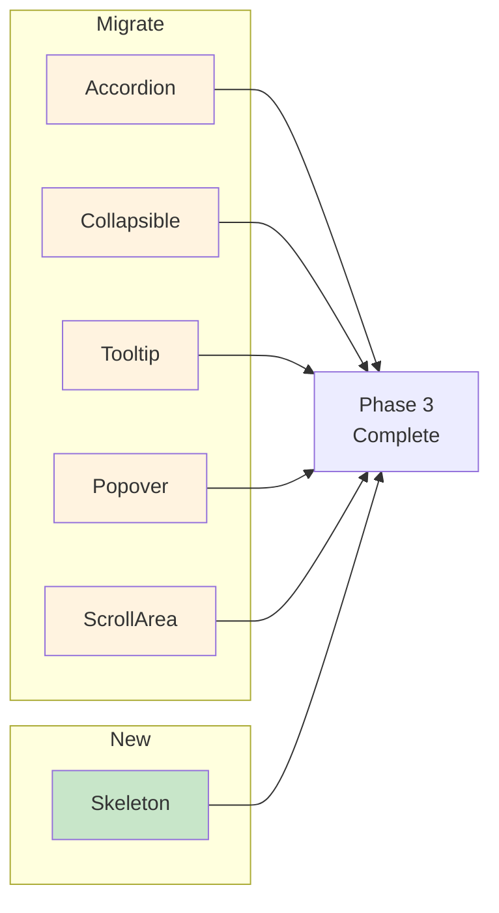

# 06: Medium Components Migration

> Migrate medium-complexity components: Accordion, Collapsible, Tooltip, Popover, ScrollArea, and add Skeleton.

**Duration:** 5 days  
**Dependencies:** [05-simple-components.md](./05-simple-components.md)  
**Package:** `packages/ui/`

## Overview

This step migrates components with moderate complexity. These components have some API differences from Radix but are still relatively straightforward to migrate. We also add a new Skeleton component for loading states.



## Implementation

### 1. Accordion → Base UI

```tsx
// packages/ui/src/primitives/Accordion.tsx

import * as React from 'react'
import { Accordion as BaseAccordion } from '@base-ui-components/react/accordion'
import { ChevronDown } from 'lucide-react'
import { cn } from '../utils/cn'

// ─── Accordion Root ────────────────────────────────────────────────

const Accordion = BaseAccordion.Root

// ─── Accordion Item ────────────────────────────────────────────────

const AccordionItem = React.forwardRef<
  HTMLDivElement,
  React.ComponentPropsWithoutRef<typeof BaseAccordion.Item>
>(({ className, ...props }, ref) => (
  <BaseAccordion.Item ref={ref} className={cn('border-b border-border', className)} {...props} />
))
AccordionItem.displayName = 'AccordionItem'

// ─── Accordion Trigger ─────────────────────────────────────────────

const AccordionTrigger = React.forwardRef<
  HTMLButtonElement,
  React.ComponentPropsWithoutRef<typeof BaseAccordion.Trigger>
>(({ className, children, ...props }, ref) => (
  <BaseAccordion.Header className="flex">
    <BaseAccordion.Trigger
      ref={ref}
      className={cn(
        'flex flex-1 items-center justify-between',
        'py-4 text-sm font-medium',
        'transition-base',
        'hover:underline',
        // Chevron rotation
        '[&>svg]:transition-transform [&>svg]:duration-slow',
        '[&[data-open]>svg]:rotate-180',
        className
      )}
      {...props}
    >
      {children}
      <ChevronDown className="h-4 w-4 shrink-0 text-foreground-muted" />
    </BaseAccordion.Trigger>
  </BaseAccordion.Header>
))
AccordionTrigger.displayName = 'AccordionTrigger'

// ─── Accordion Content ─────────────────────────────────────────────

const AccordionContent = React.forwardRef<
  HTMLDivElement,
  React.ComponentPropsWithoutRef<typeof BaseAccordion.Panel>
>(({ className, children, ...props }, ref) => (
  <BaseAccordion.Panel
    ref={ref}
    className={cn(
      'overflow-hidden text-sm',
      // Animation using CSS variables set by Base UI
      'data-[open]:animate-accordion-down',
      'data-[ending]:animate-accordion-up',
      className
    )}
    {...props}
  >
    <div className="pb-4 pt-0">{children}</div>
  </BaseAccordion.Panel>
))
AccordionContent.displayName = 'AccordionContent'

export { Accordion, AccordionItem, AccordionTrigger, AccordionContent }
```

### 2. Collapsible → Base UI

```tsx
// packages/ui/src/primitives/Collapsible.tsx

import * as React from 'react'
import { Collapsible as BaseCollapsible } from '@base-ui-components/react/collapsible'
import { cn } from '../utils/cn'

// ─── Collapsible Root ──────────────────────────────────────────────

const Collapsible = BaseCollapsible.Root

// ─── Collapsible Trigger ───────────────────────────────────────────

const CollapsibleTrigger = BaseCollapsible.Trigger

// ─── Collapsible Content ───────────────────────────────────────────

const CollapsibleContent = React.forwardRef<
  HTMLDivElement,
  React.ComponentPropsWithoutRef<typeof BaseCollapsible.Panel>
>(({ className, ...props }, ref) => (
  <BaseCollapsible.Panel
    ref={ref}
    className={cn(
      'overflow-hidden',
      'data-[open]:animate-collapsible-down',
      'data-[ending]:animate-collapsible-up',
      className
    )}
    {...props}
  />
))
CollapsibleContent.displayName = 'CollapsibleContent'

export { Collapsible, CollapsibleTrigger, CollapsibleContent }
```

### 3. Tooltip → Base UI

```tsx
// packages/ui/src/primitives/Tooltip.tsx

import * as React from 'react'
import { Tooltip as BaseTooltip } from '@base-ui-components/react/tooltip'
import { cn } from '../utils/cn'

// ─── Tooltip Provider ──────────────────────────────────────────────

const TooltipProvider = ({ children }: { children: React.ReactNode }) => children

// ─── Tooltip Root ──────────────────────────────────────────────────

const Tooltip = BaseTooltip.Root

// ─── Tooltip Trigger ───────────────────────────────────────────────

const TooltipTrigger = BaseTooltip.Trigger

// ─── Tooltip Content ───────────────────────────────────────────────

const TooltipContent = React.forwardRef<
  HTMLDivElement,
  React.ComponentPropsWithoutRef<typeof BaseTooltip.Popup> & {
    sideOffset?: number
  }
>(({ className, sideOffset = 4, ...props }, ref) => (
  <BaseTooltip.Portal>
    <BaseTooltip.Positioner sideOffset={sideOffset}>
      <BaseTooltip.Popup
        ref={ref}
        className={cn(
          'z-50 overflow-hidden rounded-md',
          'bg-primary px-3 py-1.5',
          'text-xs text-primary-foreground',
          'shadow-md',
          // Animation
          'opacity-0 scale-95',
          'data-[open]:opacity-100 data-[open]:scale-100',
          'data-[ending]:opacity-0 data-[ending]:scale-95',
          'transition-all duration-fast ease-out',
          className
        )}
        {...props}
      />
    </BaseTooltip.Positioner>
  </BaseTooltip.Portal>
))
TooltipContent.displayName = 'TooltipContent'

export { Tooltip, TooltipTrigger, TooltipContent, TooltipProvider }
```

### 4. Popover → Base UI

```tsx
// packages/ui/src/primitives/Popover.tsx

import * as React from 'react'
import { Popover as BasePopover } from '@base-ui-components/react/popover'
import { cn } from '../utils/cn'

// ─── Popover Root ──────────────────────────────────────────────────

const Popover = BasePopover.Root

// ─── Popover Trigger ───────────────────────────────────────────────

const PopoverTrigger = BasePopover.Trigger

// ─── Popover Anchor ────────────────────────────────────────────────

const PopoverAnchor = BasePopover.Anchor

// ─── Popover Content ───────────────────────────────────────────────

const PopoverContent = React.forwardRef<
  HTMLDivElement,
  React.ComponentPropsWithoutRef<typeof BasePopover.Popup> & {
    align?: 'start' | 'center' | 'end'
    sideOffset?: number
  }
>(({ className, align = 'center', sideOffset = 4, ...props }, ref) => (
  <BasePopover.Portal>
    <BasePopover.Positioner sideOffset={sideOffset} align={align}>
      <BasePopover.Popup
        ref={ref}
        className={cn(
          'z-50 w-72 rounded-md',
          'border border-border bg-popover p-4',
          'text-popover-foreground shadow-md',
          'outline-none',
          // Animation
          'opacity-0 translate-y-1',
          'data-[open]:opacity-100 data-[open]:translate-y-0',
          'data-[ending]:opacity-0 data-[ending]:translate-y-1',
          'transition-all duration-fast ease-out',
          className
        )}
        {...props}
      />
    </BasePopover.Positioner>
  </BasePopover.Portal>
))
PopoverContent.displayName = 'PopoverContent'

// ─── Popover Close ─────────────────────────────────────────────────

const PopoverClose = BasePopover.Close

export { Popover, PopoverTrigger, PopoverContent, PopoverAnchor, PopoverClose }
```

### 5. ScrollArea → Base UI

```tsx
// packages/ui/src/primitives/ScrollArea.tsx

import * as React from 'react'
import { ScrollArea as BaseScrollArea } from '@base-ui-components/react/scroll-area'
import { cn } from '../utils/cn'

// ─── ScrollArea Root ───────────────────────────────────────────────

const ScrollArea = React.forwardRef<
  HTMLDivElement,
  React.ComponentPropsWithoutRef<typeof BaseScrollArea.Root>
>(({ className, children, ...props }, ref) => (
  <BaseScrollArea.Root ref={ref} className={cn('relative overflow-hidden', className)} {...props}>
    <BaseScrollArea.Viewport className="h-full w-full rounded-[inherit]">
      {children}
    </BaseScrollArea.Viewport>
    <ScrollBar />
    <BaseScrollArea.Corner />
  </BaseScrollArea.Root>
))
ScrollArea.displayName = 'ScrollArea'

// ─── ScrollBar ─────────────────────────────────────────────────────

const ScrollBar = React.forwardRef<
  HTMLDivElement,
  React.ComponentPropsWithoutRef<typeof BaseScrollArea.Scrollbar> & {
    orientation?: 'vertical' | 'horizontal'
  }
>(({ className, orientation = 'vertical', ...props }, ref) => (
  <BaseScrollArea.Scrollbar
    ref={ref}
    orientation={orientation}
    className={cn(
      'flex touch-none select-none transition-colors',
      orientation === 'vertical' && 'h-full w-2.5 border-l border-l-transparent p-px',
      orientation === 'horizontal' && 'h-2.5 flex-col border-t border-t-transparent p-px',
      className
    )}
    {...props}
  >
    <BaseScrollArea.Thumb
      className={cn(
        'relative flex-1 rounded-full bg-border',
        'transition-colors hover:bg-border-emphasis'
      )}
    />
  </BaseScrollArea.Scrollbar>
))
ScrollBar.displayName = 'ScrollBar'

export { ScrollArea, ScrollBar }
```

### 6. Skeleton (New Component)

```tsx
// packages/ui/src/primitives/Skeleton.tsx

import * as React from 'react'
import { cn } from '../utils/cn'

export interface SkeletonProps extends React.HTMLAttributes<HTMLDivElement> {
  /** Width of the skeleton. Can be a number (px) or string (e.g., '100%') */
  width?: number | string
  /** Height of the skeleton. Can be a number (px) or string */
  height?: number | string
  /** Whether to show as a circle (for avatars) */
  circle?: boolean
}

const Skeleton = React.forwardRef<HTMLDivElement, SkeletonProps>(
  ({ className, width, height, circle, style, ...props }, ref) => {
    const computedStyle: React.CSSProperties = {
      ...style,
      width: typeof width === 'number' ? `${width}px` : width,
      height: typeof height === 'number' ? `${height}px` : height
    }

    return (
      <div
        ref={ref}
        className={cn(
          'animate-shimmer',
          'bg-gradient-to-r from-background-muted via-background-subtle to-background-muted',
          'bg-[length:200%_100%]',
          circle ? 'rounded-full' : 'rounded-md',
          className
        )}
        style={computedStyle}
        {...props}
      />
    )
  }
)
Skeleton.displayName = 'Skeleton'

// ─── Skeleton Text ─────────────────────────────────────────────────

const SkeletonText = React.forwardRef<
  HTMLDivElement,
  Omit<SkeletonProps, 'height'> & { lines?: number }
>(({ className, lines = 3, ...props }, ref) => (
  <div ref={ref} className={cn('space-y-2', className)} {...props}>
    {Array.from({ length: lines }).map((_, i) => (
      <Skeleton key={i} height={16} width={i === lines - 1 ? '60%' : '100%'} />
    ))}
  </div>
))
SkeletonText.displayName = 'SkeletonText'

// ─── Skeleton Avatar ───────────────────────────────────────────────

const SkeletonAvatar = React.forwardRef<
  HTMLDivElement,
  Omit<SkeletonProps, 'circle' | 'width' | 'height'> & { size?: number }
>(({ className, size = 40, ...props }, ref) => (
  <Skeleton ref={ref} circle width={size} height={size} className={className} {...props} />
))
SkeletonAvatar.displayName = 'SkeletonAvatar'

// ─── Skeleton Card ─────────────────────────────────────────────────

const SkeletonCard = React.forwardRef<HTMLDivElement, SkeletonProps>(
  ({ className, ...props }, ref) => (
    <div
      ref={ref}
      className={cn('rounded-lg border border-border p-4 space-y-4', className)}
      {...props}
    >
      <div className="flex items-center space-x-4">
        <SkeletonAvatar />
        <div className="space-y-2 flex-1">
          <Skeleton height={16} width="40%" />
          <Skeleton height={12} width="20%" />
        </div>
      </div>
      <SkeletonText lines={3} />
    </div>
  )
)
SkeletonCard.displayName = 'SkeletonCard'

export { Skeleton, SkeletonText, SkeletonAvatar, SkeletonCard }
```

## Tests

```typescript
// packages/ui/src/primitives/Accordion.test.tsx

import { describe, it, expect } from 'vitest'
import { render, screen, fireEvent } from '@testing-library/react'
import { Accordion, AccordionItem, AccordionTrigger, AccordionContent } from './Accordion'

describe('Accordion', () => {
  it('renders accordion items', () => {
    render(
      <Accordion type="single" collapsible>
        <AccordionItem value="item-1">
          <AccordionTrigger>Section 1</AccordionTrigger>
          <AccordionContent>Content 1</AccordionContent>
        </AccordionItem>
      </Accordion>
    )

    expect(screen.getByText('Section 1')).toBeInTheDocument()
  })

  it('expands content when clicked', () => {
    render(
      <Accordion type="single" collapsible>
        <AccordionItem value="item-1">
          <AccordionTrigger>Section 1</AccordionTrigger>
          <AccordionContent>Content 1</AccordionContent>
        </AccordionItem>
      </Accordion>
    )

    fireEvent.click(screen.getByText('Section 1'))
    expect(screen.getByText('Content 1')).toBeVisible()
  })

  it('collapses when clicked again', () => {
    render(
      <Accordion type="single" collapsible>
        <AccordionItem value="item-1">
          <AccordionTrigger>Section 1</AccordionTrigger>
          <AccordionContent>Content 1</AccordionContent>
        </AccordionItem>
      </Accordion>
    )

    const trigger = screen.getByText('Section 1')
    fireEvent.click(trigger)
    fireEvent.click(trigger)
    // Content should be hidden
  })
})
```

```typescript
// packages/ui/src/primitives/Tooltip.test.tsx

import { describe, it, expect } from 'vitest'
import { render, screen, fireEvent, waitFor } from '@testing-library/react'
import { Tooltip, TooltipTrigger, TooltipContent, TooltipProvider } from './Tooltip'

describe('Tooltip', () => {
  it('shows tooltip on hover', async () => {
    render(
      <TooltipProvider>
        <Tooltip>
          <TooltipTrigger>Hover me</TooltipTrigger>
          <TooltipContent>Tooltip text</TooltipContent>
        </Tooltip>
      </TooltipProvider>
    )

    fireEvent.mouseEnter(screen.getByText('Hover me'))

    await waitFor(() => {
      expect(screen.getByText('Tooltip text')).toBeVisible()
    })
  })

  it('hides tooltip on mouse leave', async () => {
    render(
      <TooltipProvider>
        <Tooltip>
          <TooltipTrigger>Hover me</TooltipTrigger>
          <TooltipContent>Tooltip text</TooltipContent>
        </Tooltip>
      </TooltipProvider>
    )

    const trigger = screen.getByText('Hover me')
    fireEvent.mouseEnter(trigger)
    fireEvent.mouseLeave(trigger)

    await waitFor(() => {
      expect(screen.queryByText('Tooltip text')).not.toBeVisible()
    })
  })
})
```

```typescript
// packages/ui/src/primitives/Skeleton.test.tsx

import { describe, it, expect } from 'vitest'
import { render } from '@testing-library/react'
import { Skeleton, SkeletonText, SkeletonAvatar, SkeletonCard } from './Skeleton'

describe('Skeleton', () => {
  it('renders with default styles', () => {
    const { container } = render(<Skeleton />)
    expect(container.firstChild).toHaveClass('animate-shimmer')
  })

  it('accepts width and height props', () => {
    const { container } = render(<Skeleton width={100} height={20} />)
    expect(container.firstChild).toHaveStyle({ width: '100px', height: '20px' })
  })

  it('renders as circle when circle prop is true', () => {
    const { container } = render(<Skeleton circle />)
    expect(container.firstChild).toHaveClass('rounded-full')
  })
})

describe('SkeletonText', () => {
  it('renders multiple lines', () => {
    const { container } = render(<SkeletonText lines={3} />)
    expect(container.querySelectorAll('[class*="animate-shimmer"]')).toHaveLength(3)
  })
})

describe('SkeletonAvatar', () => {
  it('renders as circle with default size', () => {
    const { container } = render(<SkeletonAvatar />)
    expect(container.firstChild).toHaveClass('rounded-full')
    expect(container.firstChild).toHaveStyle({ width: '40px', height: '40px' })
  })
})

describe('SkeletonCard', () => {
  it('renders card skeleton with avatar and text', () => {
    const { container } = render(<SkeletonCard />)
    expect(container.querySelectorAll('[class*="animate-shimmer"]').length).toBeGreaterThan(3)
  })
})
```

## Checklist

- [ ] Migrate Accordion to Base UI
- [ ] Migrate Collapsible to Base UI
- [ ] Migrate Tooltip to Base UI
- [ ] Migrate Popover to Base UI
- [ ] Migrate ScrollArea to Base UI
- [ ] Create Skeleton component
- [ ] Create SkeletonText variant
- [ ] Create SkeletonAvatar variant
- [ ] Create SkeletonCard variant
- [ ] Write tests for Accordion
- [ ] Write tests for Tooltip
- [ ] Write tests for Skeleton
- [ ] Verify animations work with Base UI data attributes
- [ ] Update exports in index.ts
- [ ] Remove Radix imports from migrated components
- [ ] Test in Electron app
- [ ] No visual regressions

---

[Back to README](./README.md) | [Previous: Simple Components](./05-simple-components.md) | [Next: Complex Components ->](./07-complex-components.md)
