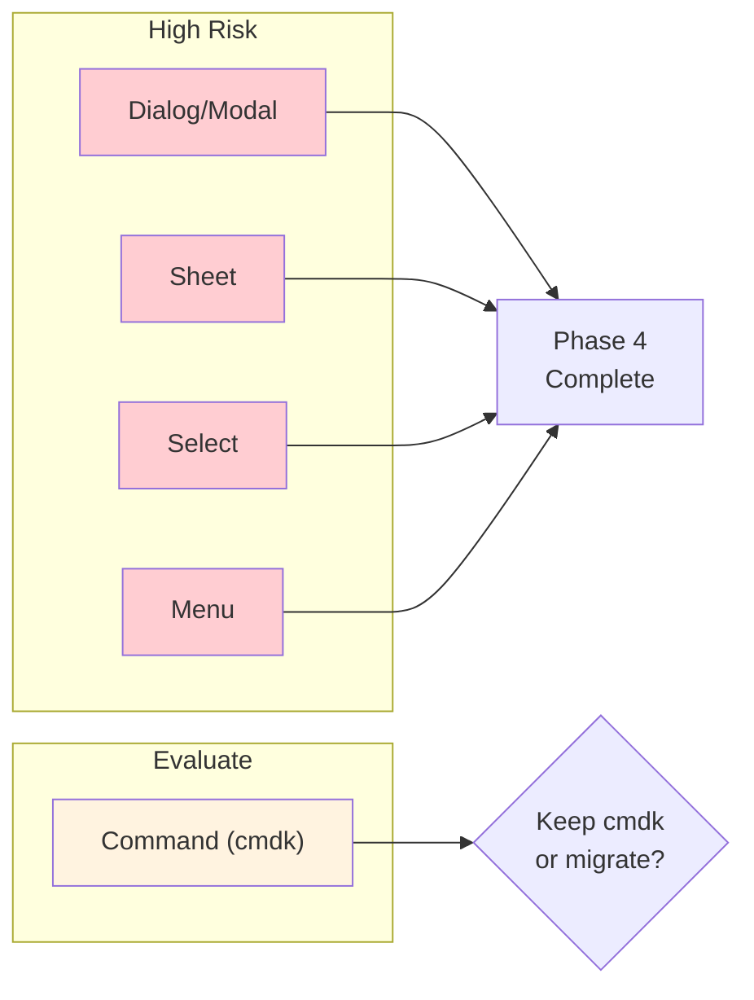

# 07: Complex Components Migration

> Migrate high-complexity components: Dialog/Modal, Sheet, Select, Menu, and evaluate Command.

**Duration:** 5 days  
**Dependencies:** [06-medium-components.md](./06-medium-components.md)  
**Package:** `packages/ui/`

## Overview

This step migrates the most complex components with significant API differences. These components require careful attention to maintain existing functionality while adopting Base UI patterns.



## API Differences Summary

| Radix          | Base UI         | Notes                         |
| -------------- | --------------- | ----------------------------- |
| Dialog.Content | Dialog.Popup    | Renamed                       |
| Dialog.Overlay | Dialog.Backdrop | Renamed                       |
| DropdownMenu   | Menu            | Simplified name               |
| Select.Content | Select.Popup    | Renamed                       |
| asChild        | render prop     | Different composition pattern |

## Implementation

### 1. Dialog/Modal → Base UI

```tsx
// packages/ui/src/primitives/Modal.tsx

import * as React from 'react'
import { Dialog as BaseDialog } from '@base-ui-components/react/dialog'
import { X } from 'lucide-react'
import { cn } from '../utils/cn'

// ─── Dialog Root ───────────────────────────────────────────────────

const Dialog = BaseDialog.Root

// ─── Dialog Trigger ────────────────────────────────────────────────

const DialogTrigger = BaseDialog.Trigger

// ─── Dialog Portal ─────────────────────────────────────────────────

const DialogPortal = BaseDialog.Portal

// ─── Dialog Close ──────────────────────────────────────────────────

const DialogClose = BaseDialog.Close

// ─── Dialog Overlay (Backdrop) ─────────────────────────────────────

const DialogOverlay = React.forwardRef<
  HTMLDivElement,
  React.ComponentPropsWithoutRef<typeof BaseDialog.Backdrop>
>(({ className, ...props }, ref) => (
  <BaseDialog.Backdrop
    ref={ref}
    className={cn(
      'fixed inset-0 z-50 bg-black/80',
      // Animation
      'opacity-0 data-[open]:opacity-100',
      'transition-opacity duration-normal ease-out',
      'data-[ending]:opacity-0 data-[ending]:duration-fast',
      className
    )}
    {...props}
  />
))
DialogOverlay.displayName = 'DialogOverlay'

// ─── Dialog Content (Popup) ────────────────────────────────────────

const DialogContent = React.forwardRef<
  HTMLDivElement,
  React.ComponentPropsWithoutRef<typeof BaseDialog.Popup>
>(({ className, children, ...props }, ref) => (
  <DialogPortal>
    <DialogOverlay />
    <BaseDialog.Popup
      ref={ref}
      className={cn(
        'fixed left-1/2 top-1/2 z-50',
        '-translate-x-1/2 -translate-y-1/2',
        'w-full max-w-lg',
        'grid gap-4 p-6',
        'border border-border bg-background shadow-lg',
        'rounded-lg',
        // Animation
        'opacity-0 scale-95',
        'data-[open]:opacity-100 data-[open]:scale-100',
        'transition-all duration-normal ease-out',
        'data-[ending]:opacity-0 data-[ending]:scale-95',
        'data-[ending]:duration-fast',
        className
      )}
      {...props}
    >
      {children}
      <BaseDialog.Close
        className={cn(
          'absolute right-4 top-4',
          'rounded-sm opacity-70',
          'ring-offset-background',
          'transition-opacity',
          'hover:opacity-100',
          'focus:outline-none focus:ring-2 focus:ring-ring focus:ring-offset-2',
          'disabled:pointer-events-none'
        )}
      >
        <X className="h-4 w-4" />
        <span className="sr-only">Close</span>
      </BaseDialog.Close>
    </BaseDialog.Popup>
  </DialogPortal>
))
DialogContent.displayName = 'DialogContent'

// ─── Dialog Header ─────────────────────────────────────────────────

const DialogHeader = ({ className, ...props }: React.HTMLAttributes<HTMLDivElement>) => (
  <div className={cn('flex flex-col space-y-1.5 text-center sm:text-left', className)} {...props} />
)
DialogHeader.displayName = 'DialogHeader'

// ─── Dialog Footer ─────────────────────────────────────────────────

const DialogFooter = ({ className, ...props }: React.HTMLAttributes<HTMLDivElement>) => (
  <div
    className={cn('flex flex-col-reverse sm:flex-row sm:justify-end sm:space-x-2', className)}
    {...props}
  />
)
DialogFooter.displayName = 'DialogFooter'

// ─── Dialog Title ──────────────────────────────────────────────────

const DialogTitle = React.forwardRef<
  HTMLHeadingElement,
  React.ComponentPropsWithoutRef<typeof BaseDialog.Title>
>(({ className, ...props }, ref) => (
  <BaseDialog.Title
    ref={ref}
    className={cn('text-lg font-semibold leading-none tracking-tight', className)}
    {...props}
  />
))
DialogTitle.displayName = 'DialogTitle'

// ─── Dialog Description ────────────────────────────────────────────

const DialogDescription = React.forwardRef<
  HTMLParagraphElement,
  React.ComponentPropsWithoutRef<typeof BaseDialog.Description>
>(({ className, ...props }, ref) => (
  <BaseDialog.Description
    ref={ref}
    className={cn('text-sm text-foreground-muted', className)}
    {...props}
  />
))
DialogDescription.displayName = 'DialogDescription'

export {
  Dialog,
  DialogPortal,
  DialogOverlay,
  DialogTrigger,
  DialogClose,
  DialogContent,
  DialogHeader,
  DialogFooter,
  DialogTitle,
  DialogDescription
}

// Alias for backward compatibility
export {
  Dialog as Modal,
  DialogContent as ModalContent,
  DialogHeader as ModalHeader,
  DialogFooter as ModalFooter,
  DialogTitle as ModalTitle,
  DialogDescription as ModalDescription,
  DialogTrigger as ModalTrigger,
  DialogClose as ModalClose
}
```

### 2. Sheet → Base UI

```tsx
// packages/ui/src/primitives/Sheet.tsx

import * as React from 'react'
import { Dialog as BaseDialog } from '@base-ui-components/react/dialog'
import { X } from 'lucide-react'
import { cva, type VariantProps } from 'class-variance-authority'
import { cn } from '../utils/cn'

// ─── Sheet Root ────────────────────────────────────────────────────

const Sheet = BaseDialog.Root

// ─── Sheet Trigger ─────────────────────────────────────────────────

const SheetTrigger = BaseDialog.Trigger

// ─── Sheet Close ───────────────────────────────────────────────────

const SheetClose = BaseDialog.Close

// ─── Sheet Portal ──────────────────────────────────────────────────

const SheetPortal = BaseDialog.Portal

// ─── Sheet Overlay ─────────────────────────────────────────────────

const SheetOverlay = React.forwardRef<
  HTMLDivElement,
  React.ComponentPropsWithoutRef<typeof BaseDialog.Backdrop>
>(({ className, ...props }, ref) => (
  <BaseDialog.Backdrop
    ref={ref}
    className={cn(
      'fixed inset-0 z-50 bg-black/80',
      'opacity-0 data-[open]:opacity-100',
      'transition-opacity duration-normal',
      'data-[ending]:opacity-0',
      className
    )}
    {...props}
  />
))
SheetOverlay.displayName = 'SheetOverlay'

// ─── Sheet Content Variants ────────────────────────────────────────

const sheetVariants = cva(
  [
    'fixed z-50 gap-4 bg-background p-6 shadow-lg',
    'transition-transform duration-slow ease-out',
    'data-[ending]:duration-normal'
  ],
  {
    variants: {
      side: {
        top: [
          'inset-x-0 top-0 border-b',
          '-translate-y-full data-[open]:translate-y-0',
          'data-[ending]:-translate-y-full'
        ],
        bottom: [
          'inset-x-0 bottom-0 border-t',
          'translate-y-full data-[open]:translate-y-0',
          'data-[ending]:translate-y-full'
        ],
        left: [
          'inset-y-0 left-0 h-full w-3/4 border-r sm:max-w-sm',
          '-translate-x-full data-[open]:translate-x-0',
          'data-[ending]:-translate-x-full'
        ],
        right: [
          'inset-y-0 right-0 h-full w-3/4 border-l sm:max-w-sm',
          'translate-x-full data-[open]:translate-x-0',
          'data-[ending]:translate-x-full'
        ]
      }
    },
    defaultVariants: {
      side: 'right'
    }
  }
)

// ─── Sheet Content ─────────────────────────────────────────────────

interface SheetContentProps
  extends
    React.ComponentPropsWithoutRef<typeof BaseDialog.Popup>,
    VariantProps<typeof sheetVariants> {}

const SheetContent = React.forwardRef<HTMLDivElement, SheetContentProps>(
  ({ side = 'right', className, children, ...props }, ref) => (
    <SheetPortal>
      <SheetOverlay />
      <BaseDialog.Popup ref={ref} className={cn(sheetVariants({ side }), className)} {...props}>
        <BaseDialog.Close
          className={cn(
            'absolute right-4 top-4',
            'rounded-sm opacity-70',
            'ring-offset-background',
            'transition-opacity',
            'hover:opacity-100',
            'focus:outline-none focus:ring-2 focus:ring-ring focus:ring-offset-2',
            'disabled:pointer-events-none'
          )}
        >
          <X className="h-4 w-4" />
          <span className="sr-only">Close</span>
        </BaseDialog.Close>
        {children}
      </BaseDialog.Popup>
    </SheetPortal>
  )
)
SheetContent.displayName = 'SheetContent'

// ─── Sheet Header ──────────────────────────────────────────────────

const SheetHeader = ({ className, ...props }: React.HTMLAttributes<HTMLDivElement>) => (
  <div className={cn('flex flex-col space-y-2 text-center sm:text-left', className)} {...props} />
)
SheetHeader.displayName = 'SheetHeader'

// ─── Sheet Footer ──────────────────────────────────────────────────

const SheetFooter = ({ className, ...props }: React.HTMLAttributes<HTMLDivElement>) => (
  <div
    className={cn('flex flex-col-reverse sm:flex-row sm:justify-end sm:space-x-2', className)}
    {...props}
  />
)
SheetFooter.displayName = 'SheetFooter'

// ─── Sheet Title ───────────────────────────────────────────────────

const SheetTitle = React.forwardRef<
  HTMLHeadingElement,
  React.ComponentPropsWithoutRef<typeof BaseDialog.Title>
>(({ className, ...props }, ref) => (
  <BaseDialog.Title
    ref={ref}
    className={cn('text-lg font-semibold text-foreground', className)}
    {...props}
  />
))
SheetTitle.displayName = 'SheetTitle'

// ─── Sheet Description ─────────────────────────────────────────────

const SheetDescription = React.forwardRef<
  HTMLParagraphElement,
  React.ComponentPropsWithoutRef<typeof BaseDialog.Description>
>(({ className, ...props }, ref) => (
  <BaseDialog.Description
    ref={ref}
    className={cn('text-sm text-foreground-muted', className)}
    {...props}
  />
))
SheetDescription.displayName = 'SheetDescription'

export {
  Sheet,
  SheetPortal,
  SheetOverlay,
  SheetTrigger,
  SheetClose,
  SheetContent,
  SheetHeader,
  SheetFooter,
  SheetTitle,
  SheetDescription
}
```

### 3. Select → Base UI

```tsx
// packages/ui/src/primitives/Select.tsx

import * as React from 'react'
import { Select as BaseSelect } from '@base-ui-components/react/select'
import { Check, ChevronDown, ChevronUp } from 'lucide-react'
import { cn } from '../utils/cn'

// ─── Select Root ───────────────────────────────────────────────────

const Select = BaseSelect.Root

// ─── Select Group ──────────────────────────────────────────────────

const SelectGroup = BaseSelect.Group

// ─── Select Value ──────────────────────────────────────────────────

const SelectValue = BaseSelect.Value

// ─── Select Trigger ────────────────────────────────────────────────

const SelectTrigger = React.forwardRef<
  HTMLButtonElement,
  React.ComponentPropsWithoutRef<typeof BaseSelect.Trigger>
>(({ className, children, ...props }, ref) => (
  <BaseSelect.Trigger
    ref={ref}
    className={cn(
      'flex h-9 w-full items-center justify-between',
      'whitespace-nowrap rounded-md border border-input',
      'bg-transparent px-3 py-2 text-sm shadow-sm',
      'ring-offset-background',
      'placeholder:text-foreground-faint',
      'focus:outline-none focus:ring-1 focus:ring-ring',
      'disabled:cursor-not-allowed disabled:opacity-50',
      '[&>span]:line-clamp-1',
      className
    )}
    {...props}
  >
    {children}
    <BaseSelect.Icon>
      <ChevronDown className="h-4 w-4 opacity-50" />
    </BaseSelect.Icon>
  </BaseSelect.Trigger>
))
SelectTrigger.displayName = 'SelectTrigger'

// ─── Select Content ────────────────────────────────────────────────

const SelectContent = React.forwardRef<
  HTMLDivElement,
  React.ComponentPropsWithoutRef<typeof BaseSelect.Popup> & {
    position?: 'popper' | 'item-aligned'
  }
>(({ className, children, position = 'popper', ...props }, ref) => (
  <BaseSelect.Portal>
    <BaseSelect.Positioner>
      <BaseSelect.Popup
        ref={ref}
        className={cn(
          'relative z-50 max-h-96 min-w-[8rem] overflow-hidden',
          'rounded-md border bg-popover text-popover-foreground shadow-md',
          // Animation
          'opacity-0 scale-95',
          'data-[open]:opacity-100 data-[open]:scale-100',
          'transition-all duration-fast ease-out',
          'data-[ending]:opacity-0 data-[ending]:scale-95',
          position === 'popper' && [
            'data-[side=bottom]:translate-y-1',
            'data-[side=left]:-translate-x-1',
            'data-[side=right]:translate-x-1',
            'data-[side=top]:-translate-y-1'
          ],
          className
        )}
        {...props}
      >
        <SelectScrollUpButton />
        <BaseSelect.Viewport
          className={cn(
            'p-1',
            position === 'popper' &&
              'h-[var(--select-popup-available-height)] w-full min-w-[var(--select-trigger-width)]'
          )}
        >
          {children}
        </BaseSelect.Viewport>
        <SelectScrollDownButton />
      </BaseSelect.Popup>
    </BaseSelect.Positioner>
  </BaseSelect.Portal>
))
SelectContent.displayName = 'SelectContent'

// ─── Select Scroll Buttons ─────────────────────────────────────────

const SelectScrollUpButton = React.forwardRef<
  HTMLDivElement,
  React.ComponentPropsWithoutRef<typeof BaseSelect.ScrollUpArrow>
>(({ className, ...props }, ref) => (
  <BaseSelect.ScrollUpArrow
    ref={ref}
    className={cn('flex cursor-default items-center justify-center py-1', className)}
    {...props}
  >
    <ChevronUp className="h-4 w-4" />
  </BaseSelect.ScrollUpArrow>
))
SelectScrollUpButton.displayName = 'SelectScrollUpButton'

const SelectScrollDownButton = React.forwardRef<
  HTMLDivElement,
  React.ComponentPropsWithoutRef<typeof BaseSelect.ScrollDownArrow>
>(({ className, ...props }, ref) => (
  <BaseSelect.ScrollDownArrow
    ref={ref}
    className={cn('flex cursor-default items-center justify-center py-1', className)}
    {...props}
  >
    <ChevronDown className="h-4 w-4" />
  </BaseSelect.ScrollDownArrow>
))
SelectScrollDownButton.displayName = 'SelectScrollDownButton'

// ─── Select Label ──────────────────────────────────────────────────

const SelectLabel = React.forwardRef<
  HTMLDivElement,
  React.ComponentPropsWithoutRef<typeof BaseSelect.GroupLabel>
>(({ className, ...props }, ref) => (
  <BaseSelect.GroupLabel
    ref={ref}
    className={cn('px-2 py-1.5 text-sm font-semibold', className)}
    {...props}
  />
))
SelectLabel.displayName = 'SelectLabel'

// ─── Select Item ───────────────────────────────────────────────────

const SelectItem = React.forwardRef<
  HTMLDivElement,
  React.ComponentPropsWithoutRef<typeof BaseSelect.Option>
>(({ className, children, ...props }, ref) => (
  <BaseSelect.Option
    ref={ref}
    className={cn(
      'relative flex w-full cursor-default select-none items-center',
      'rounded-sm py-1.5 pl-2 pr-8 text-sm outline-none',
      'focus:bg-accent focus:text-accent-foreground',
      'data-[disabled]:pointer-events-none data-[disabled]:opacity-50',
      className
    )}
    {...props}
  >
    <span className="absolute right-2 flex h-3.5 w-3.5 items-center justify-center">
      <BaseSelect.OptionIndicator>
        <Check className="h-4 w-4" />
      </BaseSelect.OptionIndicator>
    </span>
    <BaseSelect.OptionText>{children}</BaseSelect.OptionText>
  </BaseSelect.Option>
))
SelectItem.displayName = 'SelectItem'

// ─── Select Separator ──────────────────────────────────────────────

const SelectSeparator = React.forwardRef<HTMLDivElement, React.HTMLAttributes<HTMLDivElement>>(
  ({ className, ...props }, ref) => (
    <div ref={ref} className={cn('-mx-1 my-1 h-px bg-muted', className)} {...props} />
  )
)
SelectSeparator.displayName = 'SelectSeparator'

export {
  Select,
  SelectGroup,
  SelectValue,
  SelectTrigger,
  SelectContent,
  SelectLabel,
  SelectItem,
  SelectSeparator,
  SelectScrollUpButton,
  SelectScrollDownButton
}
```

### 4. Menu (DropdownMenu) → Base UI

```tsx
// packages/ui/src/primitives/Menu.tsx

import * as React from 'react'
import { Menu as BaseMenu } from '@base-ui-components/react/menu'
import { Check, ChevronRight, Circle } from 'lucide-react'
import { cn } from '../utils/cn'

// ─── Menu Root ─────────────────────────────────────────────────────

const DropdownMenu = BaseMenu.Root

// ─── Menu Trigger ──────────────────────────────────────────────────

const DropdownMenuTrigger = BaseMenu.Trigger

// ─── Menu Group ────────────────────────────────────────────────────

const DropdownMenuGroup = BaseMenu.Group

// ─── Menu Portal ───────────────────────────────────────────────────

const DropdownMenuPortal = BaseMenu.Portal

// ─── Menu Content ──────────────────────────────────────────────────

const DropdownMenuContent = React.forwardRef<
  HTMLDivElement,
  React.ComponentPropsWithoutRef<typeof BaseMenu.Popup> & {
    sideOffset?: number
  }
>(({ className, sideOffset = 4, ...props }, ref) => (
  <BaseMenu.Portal>
    <BaseMenu.Positioner sideOffset={sideOffset}>
      <BaseMenu.Popup
        ref={ref}
        className={cn(
          'z-50 min-w-[8rem] overflow-hidden',
          'rounded-md border bg-popover p-1',
          'text-popover-foreground shadow-md',
          // Animation
          'opacity-0 scale-95',
          'data-[open]:opacity-100 data-[open]:scale-100',
          'transition-all duration-fast ease-out',
          'data-[ending]:opacity-0 data-[ending]:scale-95',
          className
        )}
        {...props}
      />
    </BaseMenu.Positioner>
  </BaseMenu.Portal>
))
DropdownMenuContent.displayName = 'DropdownMenuContent'

// ─── Menu Item ─────────────────────────────────────────────────────

const DropdownMenuItem = React.forwardRef<
  HTMLDivElement,
  React.ComponentPropsWithoutRef<typeof BaseMenu.Item> & {
    inset?: boolean
  }
>(({ className, inset, ...props }, ref) => (
  <BaseMenu.Item
    ref={ref}
    className={cn(
      'relative flex cursor-default select-none items-center gap-2',
      'rounded-sm px-2 py-1.5 text-sm outline-none',
      'transition-colors',
      'focus:bg-accent focus:text-accent-foreground',
      'data-[disabled]:pointer-events-none data-[disabled]:opacity-50',
      '[&>svg]:size-4 [&>svg]:shrink-0',
      inset && 'pl-8',
      className
    )}
    {...props}
  />
))
DropdownMenuItem.displayName = 'DropdownMenuItem'

// ─── Menu Checkbox Item ────────────────────────────────────────────

const DropdownMenuCheckboxItem = React.forwardRef<
  HTMLDivElement,
  React.ComponentPropsWithoutRef<typeof BaseMenu.CheckboxItem>
>(({ className, children, checked, ...props }, ref) => (
  <BaseMenu.CheckboxItem
    ref={ref}
    className={cn(
      'relative flex cursor-default select-none items-center',
      'rounded-sm py-1.5 pl-8 pr-2 text-sm outline-none',
      'transition-colors',
      'focus:bg-accent focus:text-accent-foreground',
      'data-[disabled]:pointer-events-none data-[disabled]:opacity-50',
      className
    )}
    checked={checked}
    {...props}
  >
    <span className="absolute left-2 flex h-3.5 w-3.5 items-center justify-center">
      <BaseMenu.CheckboxItemIndicator>
        <Check className="h-4 w-4" />
      </BaseMenu.CheckboxItemIndicator>
    </span>
    {children}
  </BaseMenu.CheckboxItem>
))
DropdownMenuCheckboxItem.displayName = 'DropdownMenuCheckboxItem'

// ─── Menu Radio Group ──────────────────────────────────────────────

const DropdownMenuRadioGroup = BaseMenu.RadioGroup

// ─── Menu Radio Item ───────────────────────────────────────────────

const DropdownMenuRadioItem = React.forwardRef<
  HTMLDivElement,
  React.ComponentPropsWithoutRef<typeof BaseMenu.RadioItem>
>(({ className, children, ...props }, ref) => (
  <BaseMenu.RadioItem
    ref={ref}
    className={cn(
      'relative flex cursor-default select-none items-center',
      'rounded-sm py-1.5 pl-8 pr-2 text-sm outline-none',
      'transition-colors',
      'focus:bg-accent focus:text-accent-foreground',
      'data-[disabled]:pointer-events-none data-[disabled]:opacity-50',
      className
    )}
    {...props}
  >
    <span className="absolute left-2 flex h-3.5 w-3.5 items-center justify-center">
      <BaseMenu.RadioItemIndicator>
        <Circle className="h-2 w-2 fill-current" />
      </BaseMenu.RadioItemIndicator>
    </span>
    {children}
  </BaseMenu.RadioItem>
))
DropdownMenuRadioItem.displayName = 'DropdownMenuRadioItem'

// ─── Menu Label ────────────────────────────────────────────────────

const DropdownMenuLabel = React.forwardRef<
  HTMLDivElement,
  React.ComponentPropsWithoutRef<typeof BaseMenu.GroupLabel> & {
    inset?: boolean
  }
>(({ className, inset, ...props }, ref) => (
  <BaseMenu.GroupLabel
    ref={ref}
    className={cn('px-2 py-1.5 text-sm font-semibold', inset && 'pl-8', className)}
    {...props}
  />
))
DropdownMenuLabel.displayName = 'DropdownMenuLabel'

// ─── Menu Separator ────────────────────────────────────────────────

const DropdownMenuSeparator = React.forwardRef<
  HTMLDivElement,
  React.ComponentPropsWithoutRef<typeof BaseMenu.Separator>
>(({ className, ...props }, ref) => (
  <BaseMenu.Separator ref={ref} className={cn('-mx-1 my-1 h-px bg-muted', className)} {...props} />
))
DropdownMenuSeparator.displayName = 'DropdownMenuSeparator'

// ─── Menu Shortcut ─────────────────────────────────────────────────

const DropdownMenuShortcut = ({ className, ...props }: React.HTMLAttributes<HTMLSpanElement>) => (
  <span className={cn('ml-auto text-xs tracking-widest opacity-60', className)} {...props} />
)
DropdownMenuShortcut.displayName = 'DropdownMenuShortcut'

// ─── Submenu (if needed) ───────────────────────────────────────────

const DropdownMenuSub = BaseMenu.Root
const DropdownMenuSubTrigger = React.forwardRef<
  HTMLDivElement,
  React.ComponentPropsWithoutRef<typeof BaseMenu.SubmenuTrigger> & {
    inset?: boolean
  }
>(({ className, inset, children, ...props }, ref) => (
  <BaseMenu.SubmenuTrigger
    ref={ref}
    className={cn(
      'flex cursor-default select-none items-center gap-2',
      'rounded-sm px-2 py-1.5 text-sm outline-none',
      'focus:bg-accent',
      'data-[open]:bg-accent',
      inset && 'pl-8',
      className
    )}
    {...props}
  >
    {children}
    <ChevronRight className="ml-auto h-4 w-4" />
  </BaseMenu.SubmenuTrigger>
))
DropdownMenuSubTrigger.displayName = 'DropdownMenuSubTrigger'

const DropdownMenuSubContent = React.forwardRef<
  HTMLDivElement,
  React.ComponentPropsWithoutRef<typeof BaseMenu.Popup>
>(({ className, ...props }, ref) => (
  <BaseMenu.Portal>
    <BaseMenu.Positioner>
      <BaseMenu.Popup
        ref={ref}
        className={cn(
          'z-50 min-w-[8rem] overflow-hidden',
          'rounded-md border bg-popover p-1',
          'text-popover-foreground shadow-lg',
          'opacity-0 scale-95',
          'data-[open]:opacity-100 data-[open]:scale-100',
          'transition-all duration-fast',
          className
        )}
        {...props}
      />
    </BaseMenu.Positioner>
  </BaseMenu.Portal>
))
DropdownMenuSubContent.displayName = 'DropdownMenuSubContent'

export {
  DropdownMenu,
  DropdownMenuTrigger,
  DropdownMenuContent,
  DropdownMenuItem,
  DropdownMenuCheckboxItem,
  DropdownMenuRadioItem,
  DropdownMenuLabel,
  DropdownMenuSeparator,
  DropdownMenuShortcut,
  DropdownMenuGroup,
  DropdownMenuPortal,
  DropdownMenuSub,
  DropdownMenuSubContent,
  DropdownMenuSubTrigger,
  DropdownMenuRadioGroup
}
```

### 5. Command (cmdk) - Evaluation

The Command component uses `cmdk` which is a separate library, not Radix. We have options:

**Option A: Keep cmdk (Recommended)**

- cmdk is actively maintained
- Works well with our current setup
- No migration needed

**Option B: Build custom with Base UI Menu**

- More work, less features
- Would need to implement fuzzy search, keyboard nav

**Decision: Keep cmdk** - It's not a Radix component and is actively maintained.

```tsx
// packages/ui/src/primitives/Command.tsx
// Keep existing implementation, just update styling to match new design system

import * as React from 'react'
import { Command as CommandPrimitive } from 'cmdk'
import { Search } from 'lucide-react'
import { cn } from '../utils/cn'

// ... existing implementation with updated class names using new tokens
```

## Checklist

- [x] Migrate Dialog/Modal to Base UI
- [x] Migrate Sheet to Base UI
- [x] Migrate Select to Base UI
- [x] Migrate Menu (DropdownMenu) to Base UI
- [x] Evaluate Command (cmdk) - decision: keep
- [x] Update Command styling to match new design system
- [ ] Write tests for Dialog
- [ ] Write tests for Sheet
- [ ] Write tests for Select
- [ ] Write tests for Menu
- [ ] Verify all animations work
- [ ] Test keyboard navigation
- [ ] Test focus management
- [x] Update exports in index.ts
- [x] Remove Radix imports from migrated components
- [ ] Test in Electron app
- [ ] No visual regressions

---

[Back to README](./README.md) | [Previous: Medium Components](./06-medium-components.md) | [Next: Responsive Layout ->](./08-responsive-layout.md)
