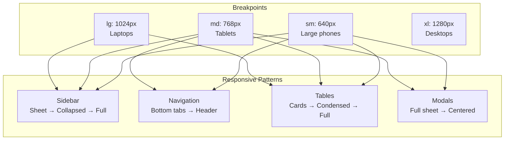

# 08: Responsive Layout

> Mobile-first responsive patterns for Sidebar, navigation, tables, and containers.

**Duration:** 5 days  
**Dependencies:** [07-complex-components.md](./07-complex-components.md)  
**Package:** `packages/ui/`, `apps/electron/`

## Overview

This step implements mobile-first responsive patterns across the application. The focus is on touch-friendly interfaces, adaptive layouts, and ensuring the app works well on all screen sizes.



## Touch Target Guidelines

| Size  | Pixels  | Use Case             |
| ----- | ------- | -------------------- |
| Min   | 44x44px | Apple HIG minimum    |
| Comfy | 48x48px | Standard interactive |
| Large | 56x56px | Primary actions, FAB |

## Implementation

### 1. Responsive Sidebar

```tsx
// packages/ui/src/components/ResponsiveSidebar.tsx

import * as React from 'react'
import { Menu } from 'lucide-react'
import { Sheet, SheetContent, SheetTrigger } from '../primitives/Sheet'
import { Button } from '../primitives/Button'
import { cn } from '../utils/cn'

interface ResponsiveSidebarProps {
  children: React.ReactNode
  collapsedContent?: React.ReactNode
  className?: string
}

export function ResponsiveSidebar({
  children,
  collapsedContent,
  className
}: ResponsiveSidebarProps) {
  return (
    <>
      {/* Mobile: Sheet triggered by hamburger */}
      <div className="md:hidden">
        <Sheet>
          <SheetTrigger asChild>
            <Button
              variant="ghost"
              size="icon"
              className="h-11 w-11" // 44px touch target
            >
              <Menu className="h-5 w-5" />
              <span className="sr-only">Toggle menu</span>
            </Button>
          </SheetTrigger>
          <SheetContent side="left" className="w-72 p-0">
            {children}
          </SheetContent>
        </Sheet>
      </div>

      {/* Tablet: Collapsible sidebar (icons only) */}
      <aside
        className={cn(
          'hidden md:flex lg:hidden',
          'w-16 flex-col border-r border-sidebar-border',
          'bg-sidebar',
          className
        )}
      >
        {collapsedContent || children}
      </aside>

      {/* Desktop: Full sidebar */}
      <aside
        className={cn(
          'hidden lg:flex',
          'w-64 flex-col border-r border-sidebar-border',
          'bg-sidebar',
          className
        )}
      >
        {children}
      </aside>
    </>
  )
}
```

### 2. Mobile Bottom Navigation

```tsx
// packages/ui/src/components/BottomNav.tsx

import * as React from 'react'
import { cn } from '../utils/cn'

interface BottomNavItem {
  icon: React.ReactNode
  label: string
  href?: string
  onClick?: () => void
  active?: boolean
}

interface BottomNavProps {
  items: BottomNavItem[]
  className?: string
}

export function BottomNav({ items, className }: BottomNavProps) {
  return (
    <nav
      className={cn(
        'fixed bottom-0 left-0 right-0 z-50',
        'md:hidden', // Only show on mobile
        'border-t border-border bg-background',
        'safe-area-inset-bottom', // iOS safe area
        className
      )}
    >
      <div className="flex items-center justify-around">
        {items.map((item, index) => (
          <button
            key={index}
            onClick={item.onClick}
            className={cn(
              'flex flex-col items-center justify-center',
              'min-h-[56px] min-w-[64px] px-3 py-2', // Touch-friendly
              'text-xs',
              'transition-colors',
              item.active ? 'text-primary' : 'text-foreground-muted hover:text-foreground'
            )}
          >
            <span className="mb-1">{item.icon}</span>
            <span>{item.label}</span>
          </button>
        ))}
      </div>
    </nav>
  )
}

// Add safe area padding utility
// In globals.css:
// .safe-area-inset-bottom {
//   padding-bottom: env(safe-area-inset-bottom);
// }
```

### 3. Responsive Table

```tsx
// packages/ui/src/components/ResponsiveTable.tsx

import * as React from 'react'
import { cn } from '../utils/cn'

interface Column<T> {
  key: keyof T
  header: string
  render?: (value: T[keyof T], row: T) => React.ReactNode
  hideOnMobile?: boolean
}

interface ResponsiveTableProps<T> {
  data: T[]
  columns: Column<T>[]
  keyField: keyof T
  className?: string
  onRowClick?: (row: T) => void
}

export function ResponsiveTable<T extends Record<string, unknown>>({
  data,
  columns,
  keyField,
  className,
  onRowClick
}: ResponsiveTableProps<T>) {
  return (
    <>
      {/* Mobile: Card layout */}
      <div className={cn('md:hidden space-y-3', className)}>
        {data.map((row) => (
          <div
            key={String(row[keyField])}
            onClick={() => onRowClick?.(row)}
            className={cn(
              'rounded-lg border border-border p-4',
              'bg-card',
              onRowClick && 'cursor-pointer active:bg-background-muted'
            )}
          >
            {columns.map((col) => (
              <div key={String(col.key)} className="flex justify-between py-1">
                <span className="text-sm text-foreground-muted">{col.header}</span>
                <span className="text-sm font-medium">
                  {col.render ? col.render(row[col.key], row) : String(row[col.key])}
                </span>
              </div>
            ))}
          </div>
        ))}
      </div>

      {/* Tablet/Desktop: Table layout */}
      <div className={cn('hidden md:block overflow-x-auto', className)}>
        <table className="w-full border-collapse text-sm">
          <thead>
            <tr className="border-b border-border">
              {columns
                .filter((col) => !col.hideOnMobile)
                .map((col) => (
                  <th
                    key={String(col.key)}
                    className={cn(
                      'px-4 py-3 text-left',
                      'text-xs font-medium text-foreground-muted',
                      'uppercase tracking-wider'
                    )}
                  >
                    {col.header}
                  </th>
                ))}
            </tr>
          </thead>
          <tbody>
            {data.map((row) => (
              <tr
                key={String(row[keyField])}
                onClick={() => onRowClick?.(row)}
                className={cn(
                  'border-b border-border-muted',
                  'transition-colors hover:bg-background-muted',
                  onRowClick && 'cursor-pointer'
                )}
              >
                {columns
                  .filter((col) => !col.hideOnMobile)
                  .map((col) => (
                    <td key={String(col.key)} className="px-4 py-3">
                      {col.render ? col.render(row[col.key], row) : String(row[col.key])}
                    </td>
                  ))}
              </tr>
            ))}
          </tbody>
        </table>
      </div>
    </>
  )
}
```

### 4. Responsive Modal/Sheet

```tsx
// packages/ui/src/components/ResponsiveDialog.tsx

import * as React from 'react'
import {
  Dialog,
  DialogContent,
  DialogHeader,
  DialogTitle,
  DialogDescription,
  DialogFooter
} from '../primitives/Modal'
import {
  Sheet,
  SheetContent,
  SheetHeader,
  SheetTitle,
  SheetDescription,
  SheetFooter
} from '../primitives/Sheet'
import { useMediaQuery } from '../hooks/useMediaQuery'

interface ResponsiveDialogProps {
  open: boolean
  onOpenChange: (open: boolean) => void
  title: string
  description?: string
  children: React.ReactNode
  footer?: React.ReactNode
}

export function ResponsiveDialog({
  open,
  onOpenChange,
  title,
  description,
  children,
  footer
}: ResponsiveDialogProps) {
  const isMobile = useMediaQuery('(max-width: 767px)')

  if (isMobile) {
    return (
      <Sheet open={open} onOpenChange={onOpenChange}>
        <SheetContent side="bottom" className="h-[85vh] rounded-t-xl">
          <SheetHeader>
            <SheetTitle>{title}</SheetTitle>
            {description && <SheetDescription>{description}</SheetDescription>}
          </SheetHeader>
          <div className="flex-1 overflow-auto py-4">{children}</div>
          {footer && <SheetFooter>{footer}</SheetFooter>}
        </SheetContent>
      </Sheet>
    )
  }

  return (
    <Dialog open={open} onOpenChange={onOpenChange}>
      <DialogContent>
        <DialogHeader>
          <DialogTitle>{title}</DialogTitle>
          {description && <DialogDescription>{description}</DialogDescription>}
        </DialogHeader>
        {children}
        {footer && <DialogFooter>{footer}</DialogFooter>}
      </DialogContent>
    </Dialog>
  )
}
```

### 5. useMediaQuery Hook

```tsx
// packages/ui/src/hooks/useMediaQuery.ts

import * as React from 'react'

export function useMediaQuery(query: string): boolean {
  const [matches, setMatches] = React.useState(false)

  React.useEffect(() => {
    const mediaQuery = window.matchMedia(query)

    // Set initial value
    setMatches(mediaQuery.matches)

    // Create listener
    const handler = (event: MediaQueryListEvent) => {
      setMatches(event.matches)
    }

    // Add listener
    mediaQuery.addEventListener('change', handler)

    // Cleanup
    return () => {
      mediaQuery.removeEventListener('change', handler)
    }
  }, [query])

  return matches
}

// Convenience hooks
export function useIsMobile() {
  return useMediaQuery('(max-width: 767px)')
}

export function useIsTablet() {
  return useMediaQuery('(min-width: 768px) and (max-width: 1023px)')
}

export function useIsDesktop() {
  return useMediaQuery('(min-width: 1024px)')
}
```

### 6. Container Utilities

```css
/* packages/ui/src/theme/responsive.css */

@layer utilities {
  /* Container with responsive padding */
  .container-responsive {
    @apply w-full mx-auto px-4 sm:px-6 lg:px-8;
    max-width: 1280px;
  }

  /* Safe area insets for iOS */
  .safe-area-inset-top {
    padding-top: env(safe-area-inset-top);
  }

  .safe-area-inset-bottom {
    padding-bottom: env(safe-area-inset-bottom);
  }

  .safe-area-inset-left {
    padding-left: env(safe-area-inset-left);
  }

  .safe-area-inset-right {
    padding-right: env(safe-area-inset-right);
  }

  /* Touch-friendly minimum sizes */
  .touch-target {
    min-height: 44px;
    min-width: 44px;
  }

  .touch-target-lg {
    min-height: 48px;
    min-width: 48px;
  }

  /* Hide scrollbar but keep functionality */
  .scrollbar-hide {
    -ms-overflow-style: none;
    scrollbar-width: none;
  }

  .scrollbar-hide::-webkit-scrollbar {
    display: none;
  }

  /* Prevent text selection on touch */
  .no-select {
    -webkit-user-select: none;
    user-select: none;
    -webkit-touch-callout: none;
  }
}
```

### 7. Responsive Typography

```css
/* packages/ui/src/theme/responsive.css (continued) */

@layer utilities {
  /* Responsive text that scales with viewport */
  .text-responsive-sm {
    @apply text-xs sm:text-sm;
  }

  .text-responsive-base {
    @apply text-sm sm:text-base;
  }

  .text-responsive-lg {
    @apply text-base sm:text-lg md:text-xl;
  }

  .text-responsive-xl {
    @apply text-lg sm:text-xl md:text-2xl;
  }

  .text-responsive-2xl {
    @apply text-xl sm:text-2xl md:text-3xl;
  }
}
```

## Testing on Real Devices

### Device Testing Checklist

| Device Type    | Screen Size | Test Cases                        |
| -------------- | ----------- | --------------------------------- |
| iPhone SE      | 375px       | Sidebar sheet, bottom nav, tables |
| iPhone 14 Pro  | 393px       | Touch targets, safe areas         |
| iPad Mini      | 768px       | Collapsed sidebar, tablet layout  |
| iPad Pro 12.9" | 1024px      | Full sidebar, desktop features    |
| Desktop        | 1440px+     | Full layout, hover states         |

### Testing Commands

```bash
# Start dev server
cd apps/electron && pnpm dev

# Test with Chrome DevTools device emulation
# 1. Open DevTools (Cmd+Option+I)
# 2. Toggle device toolbar (Cmd+Shift+M)
# 3. Select device or enter custom dimensions

# Test on real iOS device via Expo
cd apps/expo && pnpm start
```

## Checklist

- [ ] Create ResponsiveSidebar component
- [ ] Create BottomNav component
- [ ] Create ResponsiveTable component
- [ ] Create ResponsiveDialog component
- [ ] Create useMediaQuery hook
- [ ] Add safe area utilities
- [ ] Add touch target utilities
- [ ] Add responsive typography utilities
- [ ] Update Sidebar in Electron app
- [ ] Add bottom navigation to mobile
- [ ] Convert tables to responsive
- [ ] Test on iPhone SE (375px)
- [ ] Test on iPad (768px)
- [ ] Test on desktop (1440px)
- [ ] Verify touch targets are 44px+
- [ ] Test with VoiceOver/TalkBack

---

[Back to README](./README.md) | [Previous: Complex Components](./07-complex-components.md) | [Next: Accessibility ->](./09-accessibility.md)
