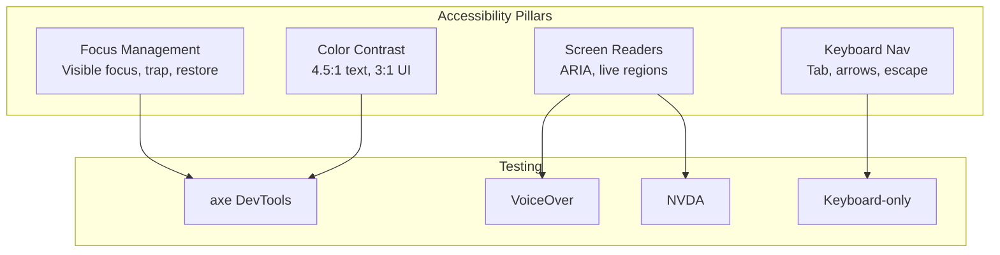

# 09: Accessibility

> WCAG 2.1 AA compliance with focus management, color contrast, and screen reader support.

**Duration:** 3 days  
**Dependencies:** [08-responsive-layout.md](./08-responsive-layout.md)  
**Package:** `packages/ui/`

## Overview

This step ensures all components meet WCAG 2.1 AA accessibility standards. We focus on focus management, color contrast, keyboard navigation, and screen reader compatibility.



## WCAG 2.1 AA Requirements

| Criterion | Requirement           | Target            |
| --------- | --------------------- | ----------------- |
| 1.4.3     | Text contrast         | 4.5:1 minimum     |
| 1.4.11    | UI component contrast | 3:1 minimum       |
| 2.1.1     | Keyboard accessible   | All functionality |
| 2.4.7     | Focus visible         | Clear indicator   |
| 4.1.2     | Name, role, value     | Proper ARIA       |

## Implementation

### 1. Focus Management

```css
/* packages/ui/src/theme/accessibility.css */

@layer base {
  /* ─── Focus Visible ───────────────────────────────────────────── */

  /* Visible focus for keyboard users */
  :focus-visible {
    outline: 2px solid hsl(var(--primary));
    outline-offset: 2px;
  }

  /* Remove focus ring for mouse users */
  :focus:not(:focus-visible) {
    outline: none;
  }

  /* Custom focus ring utility */
  .focus-ring {
    @apply focus-visible:outline-none focus-visible:ring-2;
    @apply focus-visible:ring-ring focus-visible:ring-offset-2;
    @apply focus-visible:ring-offset-background;
  }

  /* ─── Skip Link ───────────────────────────────────────────────── */

  .skip-link {
    position: absolute;
    top: -40px;
    left: 0;
    padding: 8px 16px;
    background: hsl(var(--primary));
    color: hsl(var(--primary-foreground));
    z-index: 100;
    transition: top 0.2s ease-out;
    border-radius: 0 0 4px 0;
  }

  .skip-link:focus {
    top: 0;
  }
}
```

### 2. Skip Link Component

```tsx
// packages/ui/src/components/SkipLink.tsx

import * as React from 'react'
import { cn } from '../utils/cn'

interface SkipLinkProps {
  href?: string
  children?: React.ReactNode
  className?: string
}

export function SkipLink({
  href = '#main-content',
  children = 'Skip to main content',
  className
}: SkipLinkProps) {
  return (
    <a href={href} className={cn('skip-link', className)}>
      {children}
    </a>
  )
}
```

### 3. Focus Trap Hook

```tsx
// packages/ui/src/hooks/useFocusTrap.ts

import * as React from 'react'

const FOCUSABLE_SELECTORS = [
  'a[href]',
  'button:not([disabled])',
  'input:not([disabled])',
  'select:not([disabled])',
  'textarea:not([disabled])',
  '[tabindex]:not([tabindex="-1"])'
].join(', ')

export function useFocusTrap(active: boolean = true) {
  const containerRef = React.useRef<HTMLDivElement>(null)
  const previousActiveElement = React.useRef<HTMLElement | null>(null)

  React.useEffect(() => {
    if (!active) return

    const container = containerRef.current
    if (!container) return

    // Store the previously focused element
    previousActiveElement.current = document.activeElement as HTMLElement

    // Get all focusable elements
    const focusableElements = container.querySelectorAll<HTMLElement>(FOCUSABLE_SELECTORS)
    const firstElement = focusableElements[0]
    const lastElement = focusableElements[focusableElements.length - 1]

    // Focus the first element
    firstElement?.focus()

    const handleKeyDown = (event: KeyboardEvent) => {
      if (event.key !== 'Tab') return

      if (event.shiftKey) {
        // Shift + Tab
        if (document.activeElement === firstElement) {
          event.preventDefault()
          lastElement?.focus()
        }
      } else {
        // Tab
        if (document.activeElement === lastElement) {
          event.preventDefault()
          firstElement?.focus()
        }
      }
    }

    container.addEventListener('keydown', handleKeyDown)

    return () => {
      container.removeEventListener('keydown', handleKeyDown)
      // Restore focus to the previously focused element
      previousActiveElement.current?.focus()
    }
  }, [active])

  return containerRef
}
```

### 4. Announce Hook (Live Regions)

```tsx
// packages/ui/src/hooks/useAnnounce.ts

import * as React from 'react'

type Politeness = 'polite' | 'assertive'

let announcer: HTMLDivElement | null = null

function getAnnouncer(): HTMLDivElement {
  if (!announcer) {
    announcer = document.createElement('div')
    announcer.setAttribute('aria-live', 'polite')
    announcer.setAttribute('aria-atomic', 'true')
    announcer.setAttribute('role', 'status')
    announcer.style.cssText = `
      position: absolute;
      width: 1px;
      height: 1px;
      padding: 0;
      margin: -1px;
      overflow: hidden;
      clip: rect(0, 0, 0, 0);
      white-space: nowrap;
      border: 0;
    `
    document.body.appendChild(announcer)
  }
  return announcer
}

export function useAnnounce() {
  const announce = React.useCallback((message: string, politeness: Politeness = 'polite') => {
    const announcer = getAnnouncer()
    announcer.setAttribute('aria-live', politeness)

    // Clear and set message to trigger announcement
    announcer.textContent = ''
    requestAnimationFrame(() => {
      announcer.textContent = message
    })
  }, [])

  return announce
}
```

### 5. Color Contrast Verification

```tsx
// packages/ui/src/utils/contrast.ts

/**
 * Calculate relative luminance of a color
 * https://www.w3.org/TR/WCAG21/#dfn-relative-luminance
 */
function getLuminance(r: number, g: number, b: number): number {
  const [rs, gs, bs] = [r, g, b].map((c) => {
    c = c / 255
    return c <= 0.03928 ? c / 12.92 : Math.pow((c + 0.055) / 1.055, 2.4)
  })
  return 0.2126 * rs + 0.7152 * gs + 0.0722 * bs
}

/**
 * Calculate contrast ratio between two colors
 * https://www.w3.org/TR/WCAG21/#dfn-contrast-ratio
 */
export function getContrastRatio(
  color1: { r: number; g: number; b: number },
  color2: { r: number; g: number; b: number }
): number {
  const l1 = getLuminance(color1.r, color1.g, color1.b)
  const l2 = getLuminance(color2.r, color2.g, color2.b)
  const lighter = Math.max(l1, l2)
  const darker = Math.min(l1, l2)
  return (lighter + 0.05) / (darker + 0.05)
}

/**
 * Check if contrast meets WCAG requirements
 */
export function meetsContrastRequirement(
  ratio: number,
  level: 'AA' | 'AAA' = 'AA',
  isLargeText: boolean = false
): boolean {
  if (level === 'AAA') {
    return isLargeText ? ratio >= 4.5 : ratio >= 7
  }
  return isLargeText ? ratio >= 3 : ratio >= 4.5
}
```

### 6. High Contrast Mode Support

```css
/* packages/ui/src/theme/accessibility.css (continued) */

@layer base {
  /* ─── High Contrast Mode ──────────────────────────────────────── */

  @media (prefers-contrast: high) {
    :root {
      --border: 0 0% 0%;
      --foreground-muted: 0 0% 20%;
      --foreground-subtle: 0 0% 30%;
    }

    .dark {
      --border: 0 0% 100%;
      --foreground-muted: 0 0% 80%;
      --foreground-subtle: 0 0% 70%;
    }

    /* Increase border width for visibility */
    button,
    input,
    select,
    textarea,
    [role='button'],
    [role='checkbox'],
    [role='switch'] {
      border-width: 2px;
    }

    /* Ensure focus is very visible */
    :focus-visible {
      outline-width: 3px;
      outline-offset: 3px;
    }
  }

  /* ─── Forced Colors Mode (Windows High Contrast) ──────────────── */

  @media (forced-colors: active) {
    /* Let the system handle colors */
    * {
      forced-color-adjust: auto;
    }

    /* Ensure focus is visible */
    :focus-visible {
      outline: 3px solid CanvasText;
      outline-offset: 2px;
    }

    /* Ensure buttons are visible */
    button,
    [role='button'] {
      border: 2px solid ButtonText;
    }
  }
}
```

### 7. ARIA Patterns

```tsx
// packages/ui/src/components/AccessibleButton.tsx

import * as React from 'react'
import { Button, ButtonProps } from '../primitives/Button'
import { Loader2 } from 'lucide-react'

interface AccessibleButtonProps extends ButtonProps {
  loading?: boolean
  loadingText?: string
}

export function AccessibleButton({
  loading,
  loadingText = 'Loading...',
  disabled,
  children,
  ...props
}: AccessibleButtonProps) {
  return (
    <Button
      disabled={disabled || loading}
      aria-busy={loading}
      aria-disabled={disabled || loading}
      {...props}
    >
      {loading ? (
        <>
          <Loader2 className="h-4 w-4 animate-spin" aria-hidden="true" />
          <span className="sr-only">{loadingText}</span>
          <span aria-hidden="true">{children}</span>
        </>
      ) : (
        children
      )}
    </Button>
  )
}
```

```tsx
// packages/ui/src/components/AccessibleInput.tsx

import * as React from 'react'
import { Input, InputProps } from '../primitives/Input'
import { cn } from '../utils/cn'

interface AccessibleInputProps extends InputProps {
  label: string
  error?: string
  hint?: string
}

export function AccessibleInput({
  label,
  error,
  hint,
  id,
  className,
  ...props
}: AccessibleInputProps) {
  const inputId = id || React.useId()
  const errorId = `${inputId}-error`
  const hintId = `${inputId}-hint`

  return (
    <div className="space-y-1.5">
      <label htmlFor={inputId} className="text-sm font-medium text-foreground">
        {label}
      </label>

      {hint && (
        <p id={hintId} className="text-sm text-foreground-muted">
          {hint}
        </p>
      )}

      <Input
        id={inputId}
        aria-invalid={!!error}
        aria-describedby={cn(error && errorId, hint && hintId)}
        className={cn(error && 'border-destructive focus-visible:ring-destructive', className)}
        {...props}
      />

      {error && (
        <p id={errorId} role="alert" className="text-sm text-destructive">
          {error}
        </p>
      )}
    </div>
  )
}
```

### 8. Screen Reader Only Utility

```css
/* packages/ui/src/theme/accessibility.css (continued) */

@layer utilities {
  /* Screen reader only - visually hidden but accessible */
  .sr-only {
    position: absolute;
    width: 1px;
    height: 1px;
    padding: 0;
    margin: -1px;
    overflow: hidden;
    clip: rect(0, 0, 0, 0);
    white-space: nowrap;
    border: 0;
  }

  /* Make sr-only content visible on focus */
  .sr-only-focusable:focus,
  .sr-only-focusable:active {
    position: static;
    width: auto;
    height: auto;
    padding: inherit;
    margin: inherit;
    overflow: visible;
    clip: auto;
    white-space: normal;
  }

  /* Not sr-only - for toggling visibility */
  .not-sr-only {
    position: static;
    width: auto;
    height: auto;
    padding: 0;
    margin: 0;
    overflow: visible;
    clip: auto;
    white-space: normal;
  }
}
```

## Testing

### Automated Testing with axe

```typescript
// packages/ui/src/accessibility.test.ts

import { describe, it, expect } from 'vitest'
import { render } from '@testing-library/react'
import { axe, toHaveNoViolations } from 'jest-axe'
import { Button } from './primitives/Button'
import { Input } from './primitives/Input'
import { Checkbox } from './primitives/Checkbox'

expect.extend(toHaveNoViolations)

describe('Accessibility', () => {
  describe('Button', () => {
    it('has no accessibility violations', async () => {
      const { container } = render(<Button>Click me</Button>)
      const results = await axe(container)
      expect(results).toHaveNoViolations()
    })

    it('has no violations when disabled', async () => {
      const { container } = render(<Button disabled>Disabled</Button>)
      const results = await axe(container)
      expect(results).toHaveNoViolations()
    })
  })

  describe('Input', () => {
    it('has no accessibility violations with label', async () => {
      const { container } = render(
        <div>
          <label htmlFor="test-input">Name</label>
          <Input id="test-input" />
        </div>
      )
      const results = await axe(container)
      expect(results).toHaveNoViolations()
    })
  })

  describe('Checkbox', () => {
    it('has no accessibility violations', async () => {
      const { container } = render(
        <Checkbox aria-label="Accept terms" />
      )
      const results = await axe(container)
      expect(results).toHaveNoViolations()
    })
  })
})
```

### Manual Testing Checklist

| Test                | Method             | Pass Criteria                      |
| ------------------- | ------------------ | ---------------------------------- |
| Keyboard navigation | Tab through page   | All interactive elements reachable |
| Focus visible       | Tab through page   | Focus indicator always visible     |
| Skip link           | Tab from page load | Skip link appears and works        |
| Screen reader       | VoiceOver/NVDA     | All content announced correctly    |
| Color contrast      | axe DevTools       | No contrast violations             |
| Zoom                | 200% zoom          | No content loss or overlap         |
| Reduced motion      | System preference  | Animations disabled                |
| High contrast       | System preference  | UI remains usable                  |

## Checklist

- [x] Add focus-visible styles
- [x] Create SkipLink component
- [x] Create useFocusTrap hook
- [x] Create useAnnounce hook
- [x] Add high contrast mode support
- [x] Add forced colors mode support
- [x] Create AccessibleButton component
- [x] Create AccessibleInput component
- [x] Add sr-only utility class
- [ ] Write axe accessibility tests
- [ ] Test with VoiceOver (macOS)
- [ ] Test with keyboard only
- [ ] Verify color contrast ratios
- [ ] Test at 200% zoom
- [ ] Test with reduced motion
- [ ] Test with high contrast mode

---

[Back to README](./README.md) | [Previous: Responsive Layout](./08-responsive-layout.md) | [Next: Cleanup & Docs ->](./10-cleanup-docs.md)
