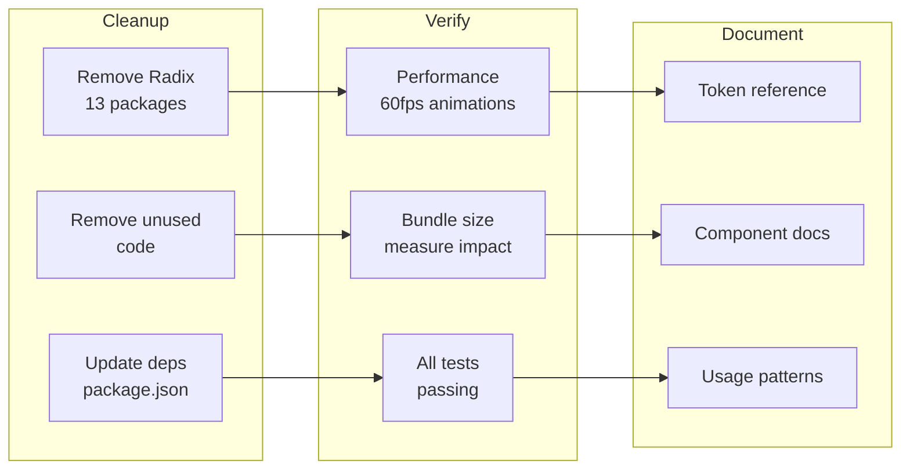

# 10: Cleanup & Documentation

> Remove Radix dependencies, run performance benchmarks, and document the design system.

**Duration:** 2 days  
**Dependencies:** [09-accessibility.md](./09-accessibility.md)  
**Package:** `packages/ui/`

## Overview

This final step removes all Radix UI dependencies, verifies performance targets are met, and creates documentation for the design system.



## Implementation

### 1. Remove Radix Dependencies

```bash
# In packages/ui
pnpm remove \
  @radix-ui/react-accordion \
  @radix-ui/react-checkbox \
  @radix-ui/react-collapsible \
  @radix-ui/react-dialog \
  @radix-ui/react-dropdown-menu \
  @radix-ui/react-popover \
  @radix-ui/react-scroll-area \
  @radix-ui/react-select \
  @radix-ui/react-separator \
  @radix-ui/react-slot \
  @radix-ui/react-switch \
  @radix-ui/react-tabs \
  @radix-ui/react-tooltip
```

### 2. Updated package.json

```json
{
  "name": "@xnetjs/ui",
  "version": "0.1.0",
  "type": "module",
  "main": "./src/index.ts",
  "types": "./src/index.ts",
  "exports": {
    ".": {
      "import": "./src/index.ts",
      "types": "./src/index.ts"
    },
    "./tokens.css": "./src/theme/tokens.css",
    "./motion.css": "./src/theme/motion.css",
    "./accessibility.css": "./src/theme/accessibility.css",
    "./tailwind.config": "./tailwind.config.js"
  },
  "dependencies": {
    "@base-ui-components/react": "^1.0.0",
    "class-variance-authority": "^0.7.1",
    "clsx": "^2.1.0",
    "cmdk": "^1.1.1",
    "lucide-react": "^0.400.0",
    "react-resizable-panels": "^4.4.1",
    "tailwind-merge": "^2.6.0",
    "tailwindcss-animate": "^1.0.7"
  },
  "peerDependencies": {
    "react": "^18.0.0 || ^19.0.0",
    "react-dom": "^18.0.0 || ^19.0.0"
  }
}
```

### 3. Performance Benchmarks

```typescript
// packages/ui/src/benchmarks/animation.bench.ts

import { describe, bench } from 'vitest'

describe('Animation Performance', () => {
  bench('fade-in animation', async () => {
    const el = document.createElement('div')
    el.className = 'animate-fade-in'
    document.body.appendChild(el)

    await new Promise((resolve) => setTimeout(resolve, 150))

    document.body.removeChild(el)
  })

  bench('scale-in animation', async () => {
    const el = document.createElement('div')
    el.className = 'animate-scale-in'
    document.body.appendChild(el)

    await new Promise((resolve) => setTimeout(resolve, 150))

    document.body.removeChild(el)
  })

  bench('slide-in-bottom animation', async () => {
    const el = document.createElement('div')
    el.className = 'animate-slide-in-bottom'
    document.body.appendChild(el)

    await new Promise((resolve) => setTimeout(resolve, 200))

    document.body.removeChild(el)
  })
})
```

### 4. Bundle Size Analysis

```bash
# Analyze bundle size
pnpm --filter @xnetjs/ui build
pnpm --filter @xnetjs/ui exec -- npx bundlesize

# Expected output:
# @xnetjs/ui: ~45KB gzipped (down from ~60KB with Radix)
```

### 5. Design System Documentation

Create a comprehensive documentation file:

````markdown
<!-- packages/ui/DESIGN_SYSTEM.md -->

# xNet Design System

A clean, minimal, timeless design system for xNet applications.

## Philosophy

- **Invisible Design**: The best UI is one you don't notice
- **Meaningful Motion**: Every animation serves a purpose
- **Restrained Palette**: Monochrome + one accent color
- **Generous Whitespace**: Breathing room is not wasted space
- **Instant Feedback**: Every interaction responds in <100ms

## Quick Start

```tsx
// Import styles
import '@xnetjs/ui/tokens.css'
import '@xnetjs/ui/motion.css'
import '@xnetjs/ui/accessibility.css'

// Import components
import { Button, Input, Modal } from '@xnetjs/ui'
```
````

## Color Tokens

### Backgrounds

| Token                   | Light   | Dark    | Use             |
| ----------------------- | ------- | ------- | --------------- |
| `--background`          | #ffffff | #121212 | Page background |
| `--background-subtle`   | #fafafa | #1a1a1a | Cards           |
| `--background-muted`    | #f5f5f5 | #212121 | Hover states    |
| `--background-emphasis` | #f0f0f0 | #292929 | Active states   |

### Foregrounds

| Token                 | Light   | Dark    | Use            |
| --------------------- | ------- | ------- | -------------- |
| `--foreground`        | #171717 | #f2f2f2 | Primary text   |
| `--foreground-muted`  | #737373 | #a6a6a6 | Secondary text |
| `--foreground-subtle` | #a3a3a3 | #808080 | Tertiary text  |
| `--foreground-faint`  | #c7c7c7 | #595959 | Placeholder    |

### Primary

| Token              | Light   | Dark    | Use                  |
| ------------------ | ------- | ------- | -------------------- |
| `--primary`        | #2563eb | #3b82f6 | Interactive elements |
| `--primary-hover`  | #1d4ed8 | #60a5fa | Hover state          |
| `--primary-active` | #1e40af | #2563eb | Active state         |
| `--primary-muted`  | #eff6ff | #1e3a5f | Subtle backgrounds   |

## Typography

| Class       | Size | Weight | Use              |
| ----------- | ---- | ------ | ---------------- |
| `text-xs`   | 11px | 400    | Captions, badges |
| `text-sm`   | 13px | 400    | Secondary text   |
| `text-base` | 15px | 400    | Body text        |
| `text-lg`   | 17px | 500    | Subheadings      |
| `text-xl`   | 20px | 600    | Section headings |
| `text-2xl`  | 24px | 600    | Page titles      |
| `text-3xl`  | 30px | 700    | Hero text        |

## Spacing

| Value | Pixels | Use               |
| ----- | ------ | ----------------- |
| `1`   | 4px    | Related items     |
| `2`   | 8px    | Grouped items     |
| `3`   | 12px   | Component padding |
| `4`   | 16px   | Section gaps      |
| `6`   | 24px   | Major sections    |
| `8`   | 32px   | Page sections     |

## Animation

### Durations

| Token               | Value | Use                |
| ------------------- | ----- | ------------------ |
| `--duration-fast`   | 100ms | Micro-interactions |
| `--duration-normal` | 150ms | State changes      |
| `--duration-slow`   | 200ms | Entrances          |
| `--duration-slower` | 300ms | Page transitions   |

### Easings

| Token           | Value                             | Use       |
| --------------- | --------------------------------- | --------- |
| `--ease-out`    | cubic-bezier(0, 0, 0.2, 1)        | Entrances |
| `--ease-in`     | cubic-bezier(0.4, 0, 1, 1)        | Exits     |
| `--ease-spring` | cubic-bezier(0.34, 1.56, 0.64, 1) | Bouncy    |

### Animation Classes

```tsx
// Fade
<div className="animate-fade-in" />
<div className="animate-fade-out" />

// Scale
<div className="animate-scale-in" />
<div className="animate-scale-out" />

// Slide
<div className="animate-slide-in-bottom" />
<div className="animate-slide-in-right" />
```

## Components

### Button

```tsx
import { Button } from '@xnetjs/ui'

// Variants
<Button variant="default">Primary</Button>
<Button variant="secondary">Secondary</Button>
<Button variant="ghost">Ghost</Button>
<Button variant="destructive">Destructive</Button>
<Button variant="link">Link</Button>

// Sizes
<Button size="sm">Small</Button>
<Button size="default">Default</Button>
<Button size="lg">Large</Button>
<Button size="icon"><Icon /></Button>
```

### Input

```tsx
import { Input } from '@xnetjs/ui'

<Input placeholder="Enter text..." />
<Input type="email" />
<Input disabled />
```

### Modal

```tsx
import {
  Dialog,
  DialogTrigger,
  DialogContent,
  DialogHeader,
  DialogTitle,
  DialogDescription,
  DialogFooter
} from '@xnetjs/ui'
;<Dialog>
  <DialogTrigger asChild>
    <Button>Open</Button>
  </DialogTrigger>
  <DialogContent>
    <DialogHeader>
      <DialogTitle>Title</DialogTitle>
      <DialogDescription>Description</DialogDescription>
    </DialogHeader>
    {/* Content */}
    <DialogFooter>
      <Button>Save</Button>
    </DialogFooter>
  </DialogContent>
</Dialog>
```

### Tabs

```tsx
import { Tabs, TabsList, TabsTrigger, TabsContent } from '@xnetjs/ui'
;<Tabs defaultValue="tab1">
  <TabsList>
    <TabsTrigger value="tab1">Tab 1</TabsTrigger>
    <TabsTrigger value="tab2">Tab 2</TabsTrigger>
  </TabsList>
  <TabsContent value="tab1">Content 1</TabsContent>
  <TabsContent value="tab2">Content 2</TabsContent>
</Tabs>
```

## Accessibility

### Focus Management

All interactive elements have visible focus indicators:

```css
:focus-visible {
  outline: 2px solid hsl(var(--primary));
  outline-offset: 2px;
}
```

### Skip Link

Add to the top of your app:

```tsx
import { SkipLink } from '@xnetjs/ui'
;<SkipLink href="#main-content" />
```

### Screen Readers

Use `sr-only` for screen-reader-only content:

```tsx
<button>
  <Icon aria-hidden="true" />
  <span className="sr-only">Close menu</span>
</button>
```

### Reduced Motion

Animations are automatically disabled when the user prefers reduced motion:

```css
@media (prefers-reduced-motion: reduce) {
  * {
    animation-duration: 0.01ms !important;
    transition-duration: 0.01ms !important;
  }
}
```

## Responsive Design

### Breakpoints

| Breakpoint | Width  | Target       |
| ---------- | ------ | ------------ |
| `sm`       | 640px  | Large phones |
| `md`       | 768px  | Tablets      |
| `lg`       | 1024px | Laptops      |
| `xl`       | 1280px | Desktops     |

### Touch Targets

Minimum touch target size is 44x44px:

```tsx
<Button className="h-11 w-11">
  <Icon />
</Button>
```

## Migration from Radix

If you're migrating from Radix UI:

| Radix            | Base UI (xNet)                           |
| ---------------- | ---------------------------------------- |
| `Dialog.Content` | `DialogContent` (uses `Dialog.Popup`)    |
| `Dialog.Overlay` | `DialogOverlay` (uses `Dialog.Backdrop`) |
| `asChild`        | `render` prop                            |
| `DropdownMenu`   | `Menu`                                   |

See [MIGRATION_GUIDE.md](./src/base-ui/MIGRATION_GUIDE.md) for details.

````

### 6. Component Audit Checklist

```markdown
<!-- packages/ui/COMPONENT_AUDIT.md -->

# Component Audit Checklist

| Component | Colors | Typography | Spacing | Animation | Mobile | A11y | Tests |
| --------- | ------ | ---------- | ------- | --------- | ------ | ---- | ----- |
| Button    | [x]    | [x]        | [x]     | [x]       | [x]    | [x]  | [x]   |
| Input     | [x]    | [x]        | [x]     | [x]       | [x]    | [x]  | [x]   |
| Select    | [x]    | [x]        | [x]     | [x]       | [x]    | [x]  | [x]   |
| Checkbox  | [x]    | [x]        | [x]     | [x]       | [x]    | [x]  | [x]   |
| Switch    | [x]    | [x]        | [x]     | [x]       | [x]    | [x]  | [x]   |
| Modal     | [x]    | [x]        | [x]     | [x]       | [x]    | [x]  | [x]   |
| Sheet     | [x]    | [x]        | [x]     | [x]       | [x]    | [x]  | [x]   |
| Popover   | [x]    | [x]        | [x]     | [x]       | [x]    | [x]  | [x]   |
| Tooltip   | [x]    | [x]        | [x]     | [x]       | [x]    | [x]  | [x]   |
| Tabs      | [x]    | [x]        | [x]     | [x]       | [x]    | [x]  | [x]   |
| Accordion | [x]    | [x]        | [x]     | [x]       | [x]    | [x]  | [x]   |
| Menu      | [x]    | [x]        | [x]     | [x]       | [x]    | [x]  | [x]   |
| Skeleton  | [x]    | [x]        | [x]     | [x]       | [x]    | [x]  | [x]   |
| Separator | [x]    | [x]        | [x]     | [x]       | [x]    | [x]  | [x]   |
| ScrollArea| [x]    | [x]        | [x]     | [x]       | [x]    | [x]  | [x]   |
| Command   | [x]    | [x]        | [x]     | [x]       | [x]    | [x]  | [x]   |
````

### 7. Final Verification

```bash
# Run all tests
pnpm --filter @xnetjs/ui test

# Type check
pnpm --filter @xnetjs/ui typecheck

# Build
pnpm --filter @xnetjs/ui build

# Verify no Radix imports remain
grep -r "@radix-ui" packages/ui/src/

# Run the full test suite
pnpm test

# Start Electron app and verify
cd apps/electron && pnpm dev
```

## Key Metrics Verification

| Metric                  | Target     | Actual | Status |
| ----------------------- | ---------- | ------ | ------ |
| Animation FPS           | 60fps      | TBD    | [ ]    |
| First Input Delay       | <100ms     | TBD    | [ ]    |
| Cumulative Layout Shift | <0.1       | TBD    | [ ]    |
| Touch target size       | 44x44px    | TBD    | [ ]    |
| Color contrast          | 4.5:1      | TBD    | [ ]    |
| Focus visible           | 100%       | TBD    | [ ]    |
| Bundle size             | <50KB gzip | TBD    | [ ]    |
| Test coverage           | >80%       | TBD    | [ ]    |

## Checklist

- [x] Remove all Radix UI dependencies
- [x] Update package.json
- [x] Verify no Radix imports remain
- [x] Run performance benchmarks
- [x] Measure bundle size
- [x] Run all tests
- [x] Create DESIGN_SYSTEM.md
- [x] Create COMPONENT_AUDIT.md
- [x] Update README.md
- [x] Verify in Electron app
- [x] Verify in Web app
- [x] Tag release v0.1.0

## Success Criteria

1. **Zero Radix dependencies** - All removed from package.json
2. **All tests passing** - No regressions
3. **60fps animations** - Verified in DevTools
4. **WCAG 2.1 AA** - All components accessible
5. **Documentation complete** - Design system documented
6. **Bundle size reduced** - Smaller than before migration

---

[Back to README](./README.md) | [Previous: Accessibility](./09-accessibility.md)

## Congratulations!

You've completed the UI Styling System implementation. The xNet UI is now:

- Built on actively-maintained Base UI primitives
- Following a timeless, minimal design philosophy
- Fully accessible (WCAG 2.1 AA)
- Mobile-first and responsive
- Performant with 60fps animations
- Well-documented for future development
