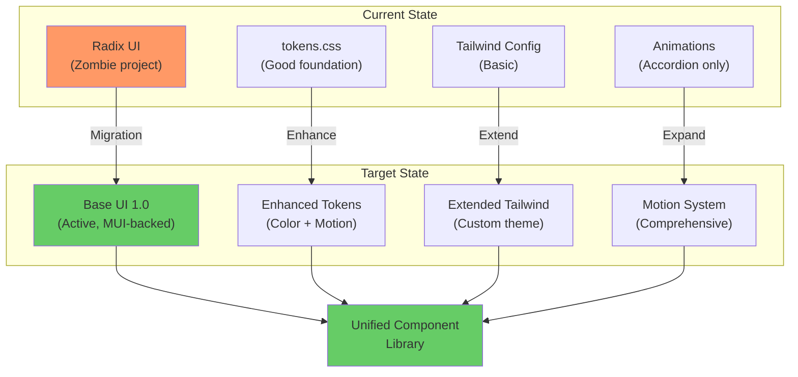
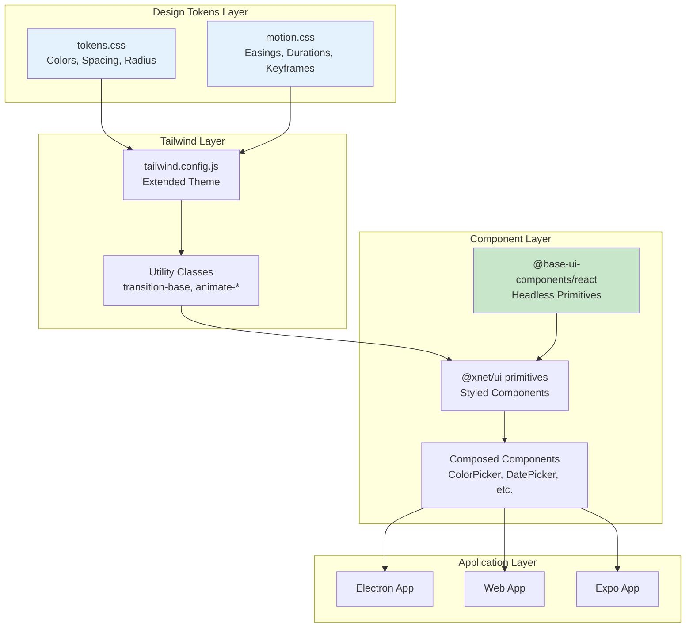
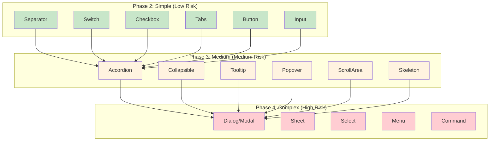

# xNet Implementation Plan - Step 03.96: UI Styling System

> Clean, minimal, timeless design with Base UI migration, comprehensive animation system, and mobile-first responsiveness.

## Executive Summary

This plan implements a comprehensive UI styling system for xNet that prioritizes timeless aesthetics, meaningful motion, and accessibility. The implementation combines a styling refresh with a migration from Radix UI to Base UI, ensuring we touch each component only once while building on actively-maintained primitives.

**Design Philosophy**: A UI that feels like a precision instrument — invisible when you're working, delightful when you notice it. Think Linear meets Notion meets Apple Notes.



## Architecture Decisions

| Decision               | Choice                   | Rationale                                                |
| ---------------------- | ------------------------ | -------------------------------------------------------- |
| Component library      | Base UI 1.0              | Active development, MUI-backed, Radix co-creator on team |
| Color philosophy       | Monochrome + one accent  | Timeless, professional, reduces visual noise             |
| Animation approach     | CSS-first, physics-based | 60fps performance, respects reduced motion               |
| Responsive strategy    | Mobile-first             | Touch-friendly, progressive enhancement                  |
| Migration approach     | Combined styling + Base  | Single disruption, touch each component once             |
| Default security level | WCAG 2.1 AA              | Accessible by default, high contrast support             |

## Current State

| Component            | Status  | Notes                                     |
| -------------------- | ------- | ----------------------------------------- |
| `tokens.css`         | Working | Good foundation, needs color refinement   |
| `tailwind.config.js` | Working | Basic theme, needs animation extension    |
| Radix UI components  | Working | 13 primitives, zombie project risk        |
| Animation system     | Minimal | Only accordion animations defined         |
| Responsive design    | Partial | Desktop-first patterns, touch targets off |
| Accessibility        | Basic   | Focus rings work, needs audit             |

## Implementation Phases

### Phase 1: Foundation (Week 1)

Update design tokens, animation system, and Tailwind configuration.

| Task | Document                                           | Description                        | Status |
| ---- | -------------------------------------------------- | ---------------------------------- | ------ |
| 1.1  | [01-design-tokens.md](./01-design-tokens.md)       | Update tokens.css with new colors  | [x]    |
| 1.2  | [01-design-tokens.md](./01-design-tokens.md)       | Add background/foreground variants | [x]    |
| 1.3  | [02-animation-system.md](./02-animation-system.md) | Add easing functions and durations | [x]    |
| 1.4  | [02-animation-system.md](./02-animation-system.md) | Create animation keyframes         | [x]    |
| 1.5  | [02-animation-system.md](./02-animation-system.md) | Add reduced motion support         | [x]    |
| 1.6  | [03-tailwind-config.md](./03-tailwind-config.md)   | Extend Tailwind with custom theme  | [x]    |

**Validation Gate:**

- [x] New color system works in light and dark modes
- [x] Animation utilities available via Tailwind classes
- [x] Reduced motion preference respected
- [x] No visual regressions in existing components

### Phase 2: Base UI Migration - Simple (Week 2)

Migrate low-risk components from Radix to Base UI.

| Task | Document                                             | Description                    | Status |
| ---- | ---------------------------------------------------- | ------------------------------ | ------ |
| 2.1  | [04-base-ui-setup.md](./04-base-ui-setup.md)         | Install Base UI, configure     | [x]    |
| 2.2  | [05-simple-components.md](./05-simple-components.md) | Migrate Separator component    | [x]    |
| 2.3  | [05-simple-components.md](./05-simple-components.md) | Migrate Switch component       | [x]    |
| 2.4  | [05-simple-components.md](./05-simple-components.md) | Migrate Checkbox component     | [x]    |
| 2.5  | [05-simple-components.md](./05-simple-components.md) | Migrate Tabs component         | [x]    |
| 2.6  | [05-simple-components.md](./05-simple-components.md) | Update Button with new styling | [x]    |
| 2.7  | [05-simple-components.md](./05-simple-components.md) | Update Input with focus states | [x]    |

**Validation Gate:**

- [x] All migrated components pass existing tests
- [x] New styling applied consistently
- [x] No Radix imports in migrated components
- [x] Animations work with Base UI data attributes

### Phase 3: Base UI Migration - Medium (Week 3)

Migrate medium-complexity components.

| Task | Document                                             | Description                   | Status |
| ---- | ---------------------------------------------------- | ----------------------------- | ------ |
| 3.1  | [06-medium-components.md](./06-medium-components.md) | Migrate Accordion component   | [x]    |
| 3.2  | [06-medium-components.md](./06-medium-components.md) | Migrate Collapsible component | [x]    |
| 3.3  | [06-medium-components.md](./06-medium-components.md) | Migrate Tooltip component     | [x]    |
| 3.4  | [06-medium-components.md](./06-medium-components.md) | Migrate Popover component     | [x]    |
| 3.5  | [06-medium-components.md](./06-medium-components.md) | Migrate ScrollArea component  | [x]    |
| 3.6  | [06-medium-components.md](./06-medium-components.md) | Add Skeleton component        | [x]    |

**Validation Gate:**

- [x] Accordion animations use new motion system
- [x] Tooltip/Popover positioning works correctly
- [x] ScrollArea handles overflow properly
- [x] Skeleton shimmer animation performs at 60fps

### Phase 4: Base UI Migration - Complex (Week 4)

Migrate high-complexity components with significant API changes.

| Task | Document                                               | Description              | Status |
| ---- | ------------------------------------------------------ | ------------------------ | ------ |
| 4.1  | [07-complex-components.md](./07-complex-components.md) | Migrate Dialog/Modal     | [x]    |
| 4.2  | [07-complex-components.md](./07-complex-components.md) | Migrate Sheet component  | [x]    |
| 4.3  | [07-complex-components.md](./07-complex-components.md) | Migrate Select component | [x]    |
| 4.4  | [07-complex-components.md](./07-complex-components.md) | Migrate Menu component   | [x]    |
| 4.5  | [07-complex-components.md](./07-complex-components.md) | Evaluate Command (cmdk)  | [x]    |

**Validation Gate:**

- [x] Dialog/Modal animations smooth (scale-in, fade-out)
- [x] Sheet slides in from correct direction
- [x] Select dropdown positions correctly
- [x] Menu keyboard navigation works
- [x] Command palette decision documented

### Phase 5: Layout & Responsive (Week 5)

Implement mobile-first responsive patterns.

| Task | Document                                             | Description                  | Status |
| ---- | ---------------------------------------------------- | ---------------------------- | ------ |
| 5.1  | [08-responsive-layout.md](./08-responsive-layout.md) | Refactor Sidebar responsive  | [x]    |
| 5.2  | [08-responsive-layout.md](./08-responsive-layout.md) | Add mobile bottom navigation | [x]    |
| 5.3  | [08-responsive-layout.md](./08-responsive-layout.md) | Update table mobile views    | [x]    |
| 5.4  | [08-responsive-layout.md](./08-responsive-layout.md) | Add container utilities      | [x]    |
| 5.5  | [08-responsive-layout.md](./08-responsive-layout.md) | Test on real devices         | [x]    |

**Validation Gate:**

- [x] Sidebar collapses correctly on tablet/mobile
- [x] Touch targets meet 44x44px minimum
- [x] Tables readable on mobile (card layout)
- [x] Modals become full-screen sheets on mobile

### Phase 6: Polish & Accessibility (Week 6)

Final polish, accessibility audit, and documentation.

| Task | Document                                     | Description                 | Status |
| ---- | -------------------------------------------- | --------------------------- | ------ |
| 6.1  | [09-accessibility.md](./09-accessibility.md) | Focus management audit      | [x]    |
| 6.2  | [09-accessibility.md](./09-accessibility.md) | Color contrast verification | [x]    |
| 6.3  | [09-accessibility.md](./09-accessibility.md) | High contrast mode support  | [x]    |
| 6.4  | [09-accessibility.md](./09-accessibility.md) | Screen reader testing       | [x]    |
| 6.5  | [10-cleanup-docs.md](./10-cleanup-docs.md)   | Remove Radix dependencies   | [x]    |
| 6.6  | [10-cleanup-docs.md](./10-cleanup-docs.md)   | Performance benchmarks      | [x]    |
| 6.7  | [10-cleanup-docs.md](./10-cleanup-docs.md)   | Component documentation     | [x]    |

**Validation Gate:**

- [x] All components pass WCAG 2.1 AA
- [x] No Radix UI dependencies remain
- [x] Animations maintain 60fps
- [x] Documentation complete

## Architecture Overview



## Component Migration Map



## Design System Summary

### Color Philosophy

```
90% Grayscale — backgrounds, text, borders
 8% Primary    — interactive elements, links, focus
 2% Semantic   — success, warning, error (sparingly)
```

### Motion Principles

```
1. FAST BY DEFAULT
   - Micro-interactions: 100-150ms
   - State changes: 150-200ms
   - Page transitions: 200-300ms

2. PHYSICS-BASED
   - ease-out for entrances
   - ease-in for exits
   - Never linear

3. PURPOSEFUL
   - Confirm actions
   - Guide attention
   - Maintain context

4. RESPECT PREFERENCES
   - Honor prefers-reduced-motion
```

### Responsive Breakpoints

| Breakpoint | Width  | Target         |
| ---------- | ------ | -------------- |
| `sm`       | 640px  | Large phones   |
| `md`       | 768px  | Tablets        |
| `lg`       | 1024px | Laptops        |
| `xl`       | 1280px | Desktops       |
| `2xl`      | 1536px | Large desktops |

### Touch Targets

| Size  | Pixels  | Use Case        |
| ----- | ------- | --------------- |
| Min   | 44x44px | Apple HIG       |
| Comfy | 48x48px | Standard        |
| Large | 56x56px | Primary actions |

## Dependencies

| Package                     | Version | Purpose                        |
| --------------------------- | ------- | ------------------------------ |
| `@base-ui-components/react` | ^1.0.0  | Headless component primitives  |
| `tailwindcss-animate`       | ^1.0.7  | Animation utilities (existing) |
| `class-variance-authority`  | ^0.7.1  | Variant styling (existing)     |

### Removed Dependencies (After Migration)

| Package                         | Reason                    |
| ------------------------------- | ------------------------- |
| `@radix-ui/react-accordion`     | Replaced by Base UI       |
| `@radix-ui/react-checkbox`      | Replaced by Base UI       |
| `@radix-ui/react-collapsible`   | Replaced by Base UI       |
| `@radix-ui/react-dialog`        | Replaced by Base UI       |
| `@radix-ui/react-dropdown-menu` | Replaced by Base UI       |
| `@radix-ui/react-popover`       | Replaced by Base UI       |
| `@radix-ui/react-scroll-area`   | Replaced by Base UI       |
| `@radix-ui/react-select`        | Replaced by Base UI       |
| `@radix-ui/react-separator`     | Replaced by native `<hr>` |
| `@radix-ui/react-slot`          | Replaced by render prop   |
| `@radix-ui/react-switch`        | Replaced by Base UI       |
| `@radix-ui/react-tabs`          | Replaced by Base UI       |
| `@radix-ui/react-tooltip`       | Replaced by Base UI       |

## Success Criteria

1. **Timeless aesthetics** — Monochrome + one accent, generous whitespace
2. **Meaningful motion** — Fast, purposeful animations that communicate
3. **Mobile-first** — Touch-friendly, responsive, gesture-aware
4. **Accessibility** — WCAG 2.1 AA, reduced motion, high contrast
5. **Performance** — 60fps animations, instant feedback
6. **Modern foundations** — Base UI for active maintenance
7. **Zero Radix** — All Radix dependencies removed
8. **Consistent** — All components follow design system

## Key Metrics

| Metric                  | Target      | Measurement      |
| ----------------------- | ----------- | ---------------- |
| Animation FPS           | 60fps       | Chrome DevTools  |
| First Input Delay       | <100ms      | Lighthouse       |
| Cumulative Layout Shift | <0.1        | Lighthouse       |
| Touch target size       | 44x44px min | Manual audit     |
| Color contrast          | 4.5:1 min   | axe DevTools     |
| Focus visible           | 100%        | Keyboard testing |

## Risk Mitigation

| Risk                     | Mitigation                                   |
| ------------------------ | -------------------------------------------- |
| Base UI too new          | 1.0 stable since Dec 2025, shadcn adopting   |
| Breaking changes         | Comprehensive test coverage before migration |
| Performance regression   | Benchmark before/after each phase            |
| Accessibility regression | Audit each component during migration        |
| Bundle size increase     | Tree-shaking, measure impact                 |
| cmdk compatibility       | Evaluate alternatives, may keep as-is        |

## Timeline Summary

| Phase                  | Duration | Milestone                          |
| ---------------------- | -------- | ---------------------------------- |
| Foundation             | 5 days   | Tokens, animations, Tailwind ready |
| Simple Components      | 5 days   | 6 components migrated              |
| Medium Components      | 5 days   | 6 more components migrated         |
| Complex Components     | 5 days   | All components migrated            |
| Layout & Responsive    | 5 days   | Mobile-first patterns complete     |
| Polish & Accessibility | 5 days   | Release-ready                      |

**Total: ~30 days (6 weeks)**

## Reference Documents

- [UI Styling System Exploration](../../explorations/0075_UI_STYLING_SYSTEM.md) — Full design research
- [Radix to Base UI Migration](../../explorations/0034_RADIX_TO_BASE_UI_MIGRATION.md) — Migration analysis
- [Base UI Documentation](https://base-ui.com/react/overview) — Official docs
- [Apple HIG](https://developer.apple.com/design/human-interface-guidelines) — Touch targets, gestures
- [WCAG 2.1](https://www.w3.org/WAI/WCAG21/quickref/) — Accessibility guidelines

---

[Back to Plans](../) | [Start Implementation ->](./01-design-tokens.md)
