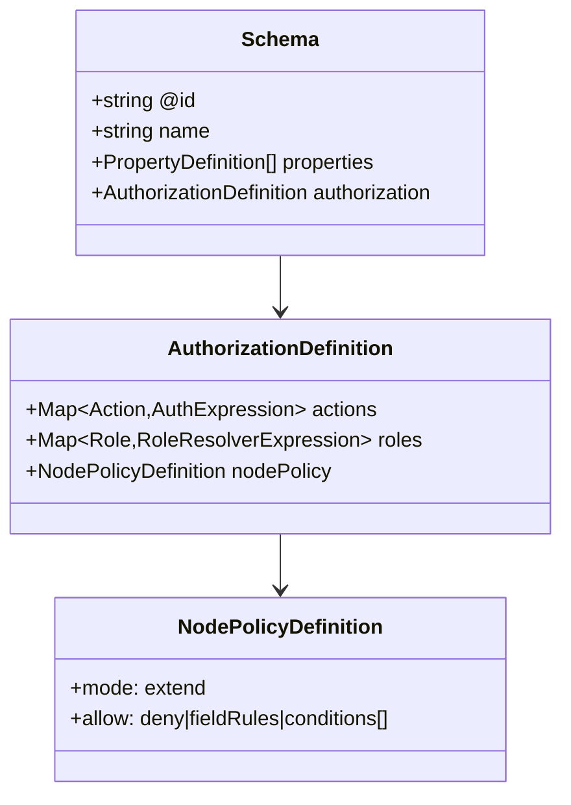

# 02: Schema Authorization Model

> Extend `defineSchema()` with a typed authorization block and schema-time validation.

**Duration:** 3 days  
**Dependencies:** [01-alignment-and-adrs.md](./01-alignment-and-adrs.md)  
**Packages:** `packages/data/src/schema`

## Current Baseline

- `DefineSchemaOptions` currently supports `name`, `namespace`, `version`, `properties`, `extends`, `document` in `packages/data/src/schema/define.ts`.
- `Schema` type currently has no authorization section in `packages/data/src/schema/types.ts`.

## Implementation

### 1. Add Typed Authorization Block

Add optional `authorization` to schema types:

```ts
type AuthorizationDefinition = {
  actions: Record<string, AuthExpression>
  roles: Record<string, RoleResolverExpression>
  nodePolicy?: {
    mode: 'extend'
    allow: Array<'deny' | 'fieldRules' | 'conditions'>
  }
}
```

### 2. Extend `defineSchema` Input and Output

Update `DefineSchemaOptions` and serialized `Schema` to include authorization metadata. Ensure this survives schema registry persistence and transport.

### 3. Add Schema-Time Validation

Validation checks should reject:

- Unknown role references in action expressions.
- Invalid relation path syntax.
- Circular role definitions that cannot resolve.
- Unsupported node policy mode.
- Unsafe public write/delete definitions unless explicitly opted in.

### 4. Add Versioning Rules

Authorization schema changes should respect existing schema version semantics:

- Role/action shape changes require semver bump guidance.
- Add migration notes for action rename compatibility.

## Data Model Diagram



## Tests

- Extend `packages/data/src/schema/schema.test.ts` for valid/invalid authorization blocks.
- Add property-based tests for expression parser acceptance/rejection boundaries.
- Add snapshot tests for serialized schema output.

## Checklist

- [ ] `Schema` type includes authorization.
- [ ] `defineSchema` accepts and emits authorization.
- [ ] Schema validation catches malformed auth configs.
- [ ] Versioning guidance documented.
- [ ] Tests added for pass/fail cases.

---

[Back to README](./README.md) | [Previous: Alignment and ADRs](./01-alignment-and-adrs.md) | [Next: Expression DSL and Compiler ->](./03-expression-dsl-and-compiler.md)
