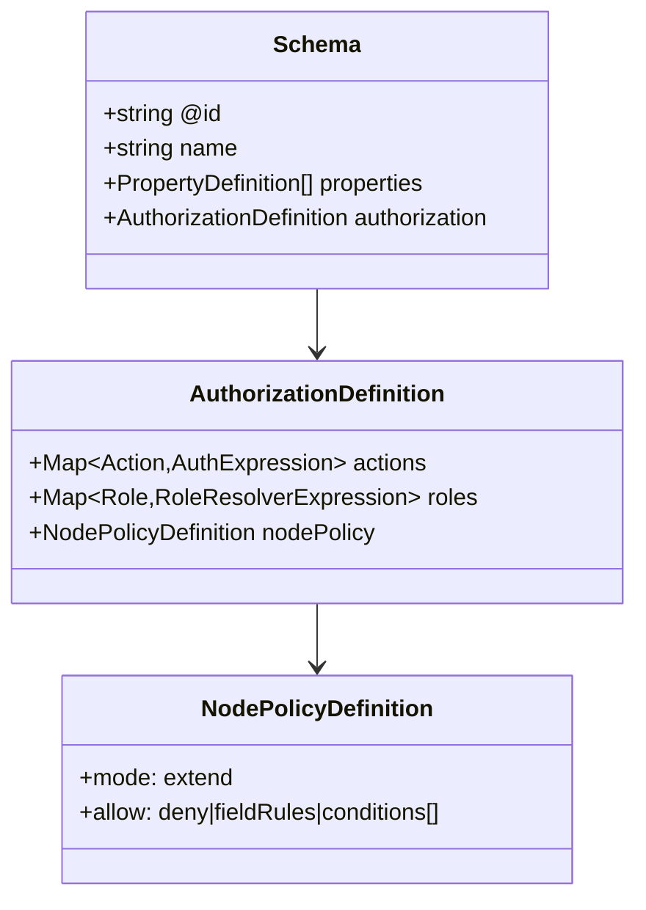

# 02: Schema Authorization Model

> Extend `defineSchema()` with a typed authorization block and schema-time validation.

**Duration:** 3 days  
**Dependencies:** [01-alignment-and-adrs.md](./01-alignment-and-adrs.md)  
**Packages:** `packages/data/src/schema`

**Sequencing note:** Complete this step first to provide the type foundation. [11-types-and-validation-contract.md](./11-types-and-validation-contract.md) depends on the types defined here and can be developed in parallel with [03-expression-dsl-and-compiler.md](./03-expression-dsl-and-compiler.md) once types are available.

## Current Baseline

- `DefineSchemaOptions` currently supports `name`, `namespace`, `version`, `properties`, `extends`, `document` in `packages/data/src/schema/define.ts`.
- `Schema` type currently has no authorization section in `packages/data/src/schema/types.ts`.

## Implementation

### TypeScript Typing Contract

Strong typechecking is required at schema authoring time:

- Actions must be a literal union inferred from `authorization.actions` keys.
- Role references in expressions must be constrained to known role keys.
- Relation paths in builders must be constrained to valid relation-property chains.
- `store.auth.can()` input action type must resolve to schema-specific action union when schema is known.

Use `as const` + generic helpers to preserve literal types and avoid widening.

### 1. Add Typed Authorization Block

Add optional `authorization` to schema types:

```ts
type AuthorizationDefinition = {
  actions: Record<string, AuthExpression>
  roles: Record<string, RoleResolverExpression>
  nodePolicy?: {
    mode: 'extend'
    allow: Array<'deny' | 'fieldRules' | 'conditions'>
  }
}
```

Add type-level helpers:

```ts
type ActionKey<TAuth extends AuthorizationDefinition> = keyof TAuth['actions'] & string
type RoleKey<TAuth extends AuthorizationDefinition> = keyof TAuth['roles'] & string
```

### 2. Extend `defineSchema` Input and Output

Update `DefineSchemaOptions` and serialized `Schema` to include authorization metadata. Ensure this survives schema registry persistence and transport.

### 3. Add Schema-Time Validation

Validation checks should reject:

- Unknown role references in action expressions.
- Invalid relation path syntax.
- Circular role definitions that cannot resolve.
- Unsupported node policy mode.
- Unsafe public write/delete definitions unless explicitly opted in.

### 4. Add Versioning Rules

Authorization schema changes should respect existing schema version semantics:

- Role/action shape changes require semver bump guidance.
- Add migration notes for action rename compatibility.

### 5. Add Field-Level Authorization (Optional)

Support per-field write restrictions within a `write` action:

```ts
type AuthorizationDefinition = {
  actions: Record<string, AuthExpression>
  roles: Record<string, RoleResolverExpression>
  fieldRules?: {
    [fieldName: string]: {
      allow: AuthExpression
      deny?: AuthExpression
    }
  }
  nodePolicy?: {
    mode: 'extend'
    allow: Array<'deny' | 'fieldRules' | 'conditions'>
  }
}
```

Example: restrict `secretNotes` field to owners while allowing editors to write other fields.

### 6. Add Versioning Rules

Authorization schema changes should respect existing schema version semantics:

- Role/action shape changes require semver bump guidance.
- Add migration notes for action rename compatibility.

### 7. Add Legacy Compatibility Behavior

Define explicit behavior for schemas that do not yet include `authorization`:

- Introduce schema auth mode: `legacy | compat | enforce`.
- `legacy`: preserve current behavior, emit diagnostics only.
- `compat`: evaluate new auth model and emit warnings/metrics on would-deny paths.
- `enforce`: authorization required; missing action rules deny mutating operations by default.

Add repo-level feature flag strategy for moving from `legacy` -> `compat` -> `enforce`.

## Data Model Diagram



## Tests

- Extend `packages/data/src/schema/schema.test.ts` for valid/invalid authorization blocks.
- Add property-based tests for expression parser acceptance/rejection boundaries.
- Add snapshot tests for serialized schema output.
- Add migration-mode tests for `legacy`, `compat`, and `enforce` behavior.
- Add tests for default deny semantics when action mapping is missing in `enforce` mode.
- Add type-level tests (`tsd`/`expectTypeOf`) for role/action inference and invalid builder inputs.

## Checklist

- [ ] `Schema` type includes authorization.
- [ ] `defineSchema` accepts and emits authorization.
- [ ] Schema validation catches malformed auth configs.
- [ ] Field-level authorization syntax defined.
- [ ] Versioning guidance documented.
- [ ] Legacy/compat/enforce behavior implemented and documented.
- [ ] Tests added for pass/fail cases.
- [ ] Type-level tests added for schema auth typing guarantees.

---

[Back to README](./README.md) | [Previous: Alignment and ADRs](./01-alignment-and-adrs.md) | [Next: Types and Validation Contract ->](./11-types-and-validation-contract.md)
