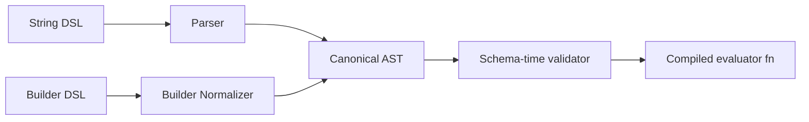

# 03: Expression DSL and Compiler

> Implement hybrid auth DSL (string + builders), parser, AST, and compiled evaluators.

**Duration:** 4 days  
**Dependencies:** [02-schema-authorization-model.md](./02-schema-authorization-model.md)  
**Packages:** `packages/data` (new auth submodule)

## Design Requirements

- Keep common expressions short (`'owner | admin'`).
- Provide typed builders for complex and path-sensitive expressions.
- Compile expressions once per schema version and cache AST/executable form.

## Implementation

### 1. Add Builder API

Example API:

```ts
const expr = or(role('editor'), relation('project', role('admin')), publicAccess())
```

Builder output should be serializable into the same AST shape as parsed strings.

Typing requirements for builders:

- `role()` only accepts `RoleKey<TAuth>`.
- `action()` (if exposed) only accepts `ActionKey<TAuth>`.
- `relation()` path segments only accept relation keys from the current schema graph.
- Invalid role/path references must fail at compile-time in typed usage.

Example typed signatures:

```ts
declare function role<TRole extends string>(name: TRole): RoleNode<TRole>

declare function relation<TSchema, TPath extends ValidRelationPath<TSchema>>(
  path: TPath,
  expr: AuthAstNode
): RelationNode<TPath>
```

### 2. Add String Parser

Grammar targets:

- literals: `owner`, `public`
- operators: `|`, `&`, `!`
- path refs: `relation.project.members`
- parentheses for precedence control

### 3. AST and Type Checking

Normalize both string and builder input into canonical AST nodes.

Typechecking model:

- Compile-time: generic constraints for typed builders.
- Schema-time runtime: parser + validator for string DSL and persisted schema payloads.
- Execution-time: evaluator consumes only canonical validated AST.



### 4. Compiler and Cache

Cache key:

- `schemaId`
- `schemaVersion`
- `expressionHash`

Compiler output should be a pure function with no side effects for deterministic replay.

### 5. Safety Constraints

- Hard cap on expression node count.
- Relation path segment count limit.
- Strict tokenizer to avoid permissive parse ambiguity.

## Tests

- Parser conformance tests (precedence, associativity, invalid tokens).
- Builder and string parity tests (same AST/evaluation output).
- Fuzz tests for malformed input and depth exhaustion.
- Type-level tests for builder constraints and inference (`expectTypeOf`/`tsd`).

## Checklist

- [ ] Builder API implemented.
- [ ] String parser implemented.
- [ ] Canonical AST model stable.
- [ ] Compiler + cache integrated.
- [ ] Fuzz and parity tests passing.

---

[Back to README](./README.md) | [Previous: Schema Authorization Model](./02-schema-authorization-model.md) | [Next: Auth Evaluator Engine ->](./04-auth-evaluator-engine.md)
