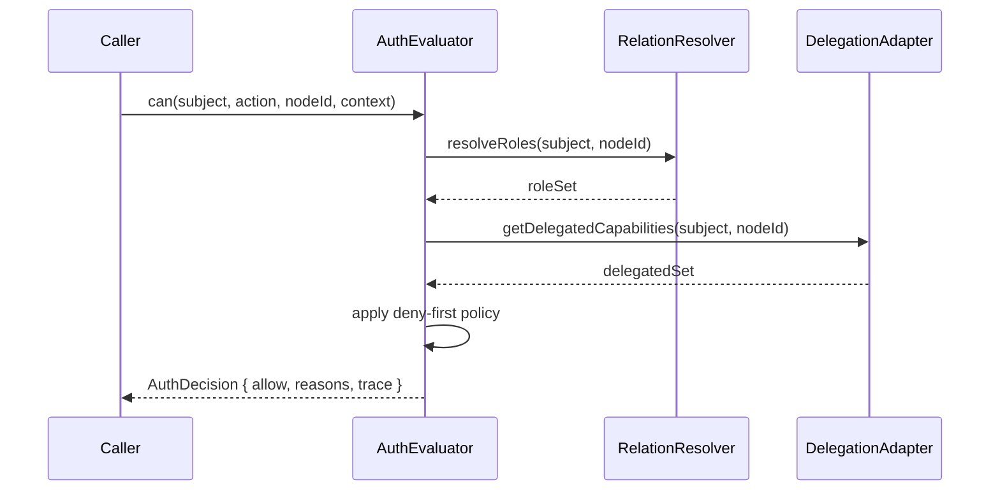

# 04: Auth Evaluator Engine

> Build deterministic authorization evaluator with role resolution, relation traversal, UCAN bridge inputs, and explanation output.

**Duration:** 5 days  
**Dependencies:** [03-expression-dsl-and-compiler.md](./03-expression-dsl-and-compiler.md)  
**Packages:** `packages/data` (new `auth/` module), `packages/core` types

## Responsibilities

- Resolve effective roles from node properties and relation graph.
- Evaluate action expression using compiled AST.
- Merge in UCAN-derived capabilities.
- Apply node-level deny and field/condition constraints.
- Return allow/deny plus structured trace.

## Evaluation Pipeline



## Implementation

### 1. Define Evaluator Interfaces

- `AuthEvaluator.can(input): Promise<AuthDecision>`
- `AuthEvaluator.explain(input): Promise<AuthTrace>`

### 2. Implement Relation Traversal

**Option A: Materialized Role Membership Cache (Recommended)**

Maintain a cached membership index instead of traversing on every `can()` check:

```ts
// On relation mutation (async, background)
async function onRelationChanged(nodeId: string, relation: string, targetId: string) {
  // Invalidate all role caches that include paths through this edge
  await invalidateRoleCachesForEdge(nodeId, relation, targetId)
  // Eagerly recompute for hot nodes (optional optimization)
  await recomputeRolesForNode(nodeId)
}

// can() check becomes O(1) cache lookup
async function can(subject, action, nodeId) {
  const roles = await roleCache.get(`${subject}:${nodeId}`)
  return evaluateAction(roles, action)
}
```

**Pros**: `can()` stays fast (sub-ms), scales to 100k+ node graphs
**Cons**: Mutation slightly slower, cache invalidation complexity

**Option B: BFS with Memoization + Limits**

Keep traversal but add memoization and strict limits:

```ts
const MEMO = new Map() // per-evaluation context

async function resolveRoles(subject, nodeId, depth = 0, visited = new Set()) {
  if (depth > 3 || visited.size > 100) return []
  if (visited.has(nodeId)) return [] // cycle guard

  const key = `${subject}:${nodeId}:${depth}`
  if (MEMO.has(key)) return MEMO.get(key)

  // ... traversal logic

  MEMO.set(key, roles)
  return roles
}
```

**Trade-off**: Simpler but `can()` latency varies with graph complexity

Both approaches must implement:

- Max depth limit (default 3)
- Visited-set cycle detection
- Max nodes visited limit (e.g., 100) for fail-safe termination

### 3. Add Node Policy Constraints

- Explicit deny rule matching.
- Field-level write restrictions for partial updates.
- Optional condition subset (time/context) from ADR scope.

### 4. Determinism and Replay

Evaluator output must be deterministic for same inputs and model snapshot to support sync conflict analysis.

## Tests

- Role resolution tests for direct and transitive relations.
- Deny precedence tests over all allow paths.
- Field-level constraints tests for patch updates.
- Determinism tests across repeated runs.

## Checklist

- [ ] Evaluator interfaces and decision types implemented.
- [ ] Relation traversal and cycle protection working.
- [ ] Materialized role cache or BFS traversal implemented.
- [ ] Deny-first merge logic in place.
- [ ] Field-level constraint evaluation implemented.
- [ ] Structured explain traces emitted.
- [ ] Determinism tests passing.

---

[Back to README](./README.md) | [Previous: Expression DSL and Compiler](./03-expression-dsl-and-compiler.md) | [Next: NodeStore Enforcement ->](./05-nodestore-enforcement.md)
